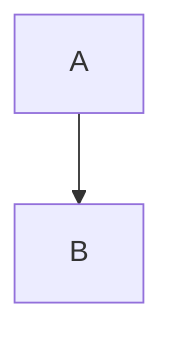

# MM01: Using flowchart instead of graph

The Mermaid dependency diagram uses `flowchart` instead of `graph`.

## Expected Format

Use `graph` for better portability:



## How to Fix

Change `flowchart` to `graph`:

**Before (invalid):**
```
flowchart TD
    A --> B
```

**After:**
```
graph TD
    A --> B
```

## Why This Matters

While `flowchart` works in many renderers, `graph` is more portable and renders consistently across different Mermaid implementations.
