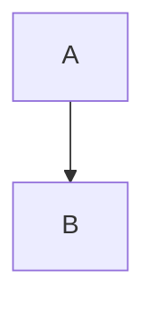

# MM02: Missing diagram direction

The Mermaid diagram is missing a direction specifier.

## Expected Format

Include `TD` (top-down) or `LR` (left-right) after `graph`:



or


## How to Fix

Add the direction to the graph declaration:

**Before (invalid):**
```
graph
    A --> B
```

**After:**
```
graph TD
    A --> B
```

## Choosing Direction

- **TD** (top-down): Use when dependencies span 5+ sequential levels (vertical is more readable)
- **LR** (left-right): Use for simple diagrams with few sequential levels
