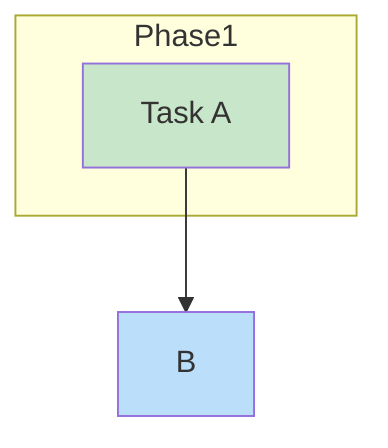

# MM04: Class definition before edges

A `classDef` or `class` statement appears before the diagram edges.

## Expected Structure

Class definitions should come at the end of the diagram:



## How to Fix

Move all `classDef` and `class` statements to the end of the diagram.

**Before (wrong order):**
```
graph TD
    classDef done fill:#c8e6c9
    A --> B
    class A done
```

**After:**
```
graph TD
    A --> B

    classDef done fill:#c8e6c9
    class A done
```
