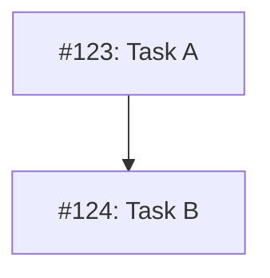

# MM06: Issue in table but not in diagram

An issue appears in the Implementation Issues table but is missing from the Mermaid dependency diagram.

## Expected Behavior

Every issue in the table should have a corresponding node in the diagram:

**Table:**
```markdown
| Issue | Dependencies | Tier |
|-------|--------------|------|
| [#123: Task A](url) | None | testable |
| [#124: Task B](url) | [#123](url) | testable |
```

**Diagram:**


## How to Fix

Add the missing issue to the diagram:

1. Create a node: `I<number>["#<number>: <short-title>"]`
2. Add edges for dependencies
3. Assign appropriate status class

**Example:**
```
I123["#123: Add feature"]

I122 --> I123

class I123 ready
```

## Node Naming Convention

- Node ID: `I<issue-number>` (e.g., `I123`)
- Node label: `"#<N>: <title>"` (max 40 characters)
