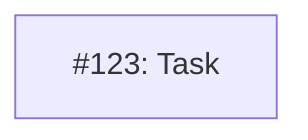
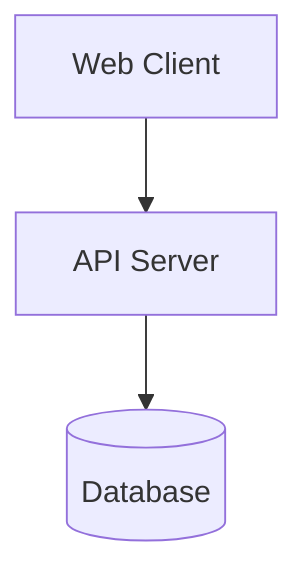

# MM07: Issue dependency diagram and status relationship

This rule distinguishes between two types of Mermaid diagrams:

1. **Issue dependency diagrams** - Contain `I<number>` nodes (e.g., `I123`, `I456`) representing GitHub issues
2. **Documentation diagrams** - Architecture diagrams, flowcharts, examples without issue nodes

## Rules

| Diagram Type | Allowed Statuses |
|--------------|------------------|
| Issue dependency (has `I<number>` nodes) | **Planned only** |
| Documentation (no `I<number>` nodes) | Any status |

### Issue Dependency Diagrams

- **Planned** status MUST have exactly one issue dependency diagram
- Only **Planned** status may have issue dependency diagrams
- Other statuses (Proposed, Accepted, Current, Superseded) must NOT have issue dependency diagrams

### Documentation Diagrams

- Allowed in any status
- No validation of content (MM01-MM15 checks are skipped)
- Use for architecture diagrams, flowcharts, examples

## Error Messages

**"Issue dependency diagram (with I<number> nodes) only allowed in 'Planned' status"**
A diagram with `I<number>` nodes exists but the document status is not Planned.

**"'Planned' status requires an issue dependency diagram (with I<number> nodes)"**
The document has Planned status but no diagram with `I<number>` nodes exists.

## How to Fix

**If you have an issue dependency diagram but status is not Planned:**
- Remove the diagram (when transitioning to Current), OR
- Change status to Planned (if issues still being tracked)

**If status is Planned but no issue dependency diagram:**
- Add a dependency diagram with `I<number>` nodes for tracked issues, OR
- Change status if implementation is complete or not yet planned

**If you want a documentation diagram in any status:**
- Ensure no nodes use the `I<number>` pattern
- Use descriptive node names like `A[Component]`, `Client`, `Server`

## Examples

**Invalid - Current status with issue dependency diagram:**
```yaml
---
status: Current
---
```


**Valid - Current status with documentation diagram:**
```yaml
---
status: Current
---
```


**Valid - Planned status with issue dependency diagram:**
```yaml
---
status: Planned
---
```

