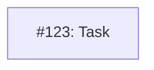

# MM07: Diagram and status relationship

This rule enforces the relationship between Mermaid diagrams and document status:
1. **Planned** status MUST have a diagram (tracks implementation progress)
2. **Current** status MAY have a diagram (kept for historical reference)
3. **Other statuses** (Proposed, Accepted, Superseded) must NOT have a diagram

## When Diagrams Are Required

Dependency diagrams must exist when:
- Status is **Planned** (issues have been created via /plan)

Diagrams are optional when:
- Status is **Current** (implementation complete, diagram kept for history)
- **Note:** Current status docs are historical records; detailed diagram validation (MM01-MM15 except MM07) is skipped

Diagrams must NOT exist in:
- **Proposed** - No issues created yet
- **Accepted** - Approved but not yet planned
- **Superseded** - Replaced by newer design

## Error Messages

**"Mermaid diagram only allowed in 'Planned' or 'Current' status"**
A diagram exists but the document status is Proposed, Accepted, or Superseded.

**"'Planned' status requires a Mermaid dependency diagram"**
The document has Planned status but no diagram exists.

## How to Fix

**If you have a diagram but status is Proposed/Accepted/Superseded:**
- Remove the diagram, OR
- Transition status to Planned (after creating issues via /plan)

**If status is Planned but no diagram:**
- Add a dependency diagram showing the implementation issues, OR
- Transition to a different status if issues haven't been created

## Example

**Invalid - Accepted status with diagram:**
```yaml
---
status: Accepted
---
```


**Invalid - Planned status without diagram:**
```yaml
---
status: Planned
---
```
(no mermaid block)

**Valid - Planned status with diagram:**
```yaml
---
status: Planned
---
```


**Valid - Current status with diagram (historical):**
```yaml
---
status: Current
---
```

