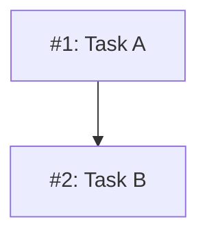
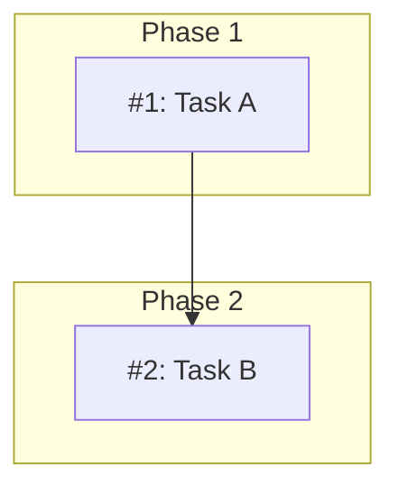

# MM08: Only one issue dependency diagram per document

Multiple issue dependency diagrams were found in the design document.

**Note:** This rule only applies to diagrams containing `I<number>` or `M<number>` nodes (issue/milestone dependency graphs). Other diagrams (flowcharts, architecture diagrams, etc.) are allowed anywhere in the document.

## Expected Behavior

Each **Planned** design document should have exactly one issue dependency diagram in the Implementation Issues section. Additional non-dependency diagrams are allowed elsewhere in the document for documentation purposes.

## Why This Matters

- Multiple diagrams create confusion about which is authoritative
- Tooling expects a single diagram to update when issue status changes
- The diagram should represent the complete dependency graph for the design

## How to Fix

Consolidate all nodes and edges into a single diagram:

**Before (invalid - multiple diagrams):**

**After:**

## Using Subgraphs for Organization

If you need to group related issues visually, use subgraphs within a single diagram:

