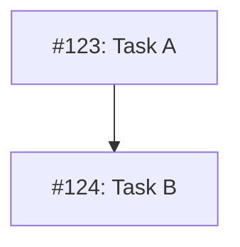

# MM09: Node in diagram but not in table

A node in the Mermaid diagram references an issue that doesn't exist in the Implementation Issues table.

## Expected Behavior

Every node in the diagram must correspond to an issue in the table:

**Table:**
```markdown
| Issue | Dependencies | Tier |
|-------|--------------|------|
| [#123: Task A](url) | None | testable |
| [#124: Task B](url) | [#123](url) | testable |
```

**Diagram:**


## How to Fix

Either add the missing issue to the table, or remove the orphaned node from the diagram:

**Option 1: Add to table**
Add a row for the missing issue with its title, dependencies, and tier.

**Option 2: Remove from diagram**
Delete the node definition and any edges that reference it.

## Common Causes

- Issue was removed from table but node left in diagram
- Copy-paste error with wrong issue number
- Issue renumbered after diagram was created
