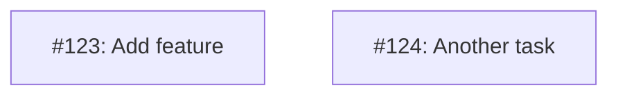
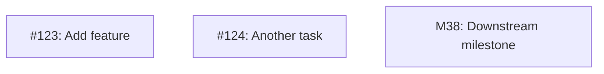

# MM10: Invalid node naming convention

A node in the Mermaid diagram doesn't follow the required naming convention.

## Required Format

All nodes must use one of these naming conventions:
- `I<issue-number>` for issues (e.g., `I123`, `I404`, `I1`)
- `M<milestone-number>` for milestones (e.g., `M38`, `M1`)

## Why This Matters

- Consistent naming enables tooling to update diagrams automatically
- The `I` prefix identifies issue nodes, `M` prefix identifies milestone nodes
- The number in the ID allows cross-referencing with tables and GitHub

## How to Fix

Rename nodes to follow the `I<number>` or `M<number>` convention:

**Before (invalid):**


**After:**


## Node Labels

The node ID is the part before the brackets. The label inside brackets can be any descriptive text:

```
I123["#123: Short description"]
 ^       ^
 |       +-- Label (displayed)
 +---------- Node ID (must be I<number> or M<number>)
```
