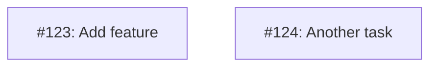

# MM10: Invalid node naming convention

A node in the Mermaid diagram doesn't follow the required naming convention.

## Required Format

All issue nodes must be named `I<issue-number>`:
- `I123` for issue #123
- `I404` for issue #404
- `I1` for issue #1

## Why This Matters

- Consistent naming enables tooling to update diagrams automatically
- The `I` prefix clearly identifies issue nodes vs other diagram elements
- Issue number in the ID allows cross-referencing with the table

## How to Fix

Rename nodes to follow the `I<number>` convention:

**Before (invalid):**


**After:**


## Node Labels

The node ID is the part before the brackets. The label inside brackets can be any descriptive text:

```
I123["#123: Short description"]
 ^       ^
 |       +-- Label (displayed)
 +---------- Node ID (must be I<number>)
```
