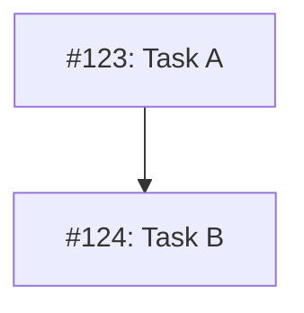

# MM11: Node has no class assigned

A node in the Mermaid diagram doesn't have a status class assigned.

## Expected Behavior

Every issue node must have one of these classes assigned:

| Class | Color | Meaning |
|-------|-------|---------|
| `done` | Green (#c8e6c9) | Issue is closed |
| `ready` | Blue (#bbdefb) | Open, no blocking dependencies |
| `blocked` | Yellow (#fff9c4) | Open, has open blockers |
| `needsDesign` | Purple (#e1bee7) | Future work, not yet designed |

## How to Fix

Add a class assignment for the node at the end of the diagram:

**Before (invalid - no class):**


**After:**


## Grouping Multiple Nodes

Nodes with the same class can be grouped:

```mermaid
class I123,I124,I125 done
class I126,I127 blocked
```

## Initial Status

When /plan creates the diagram:
- Issues with no dependencies: `ready`
- Issues with dependencies: `blocked`
- Future work: `needsDesign`
