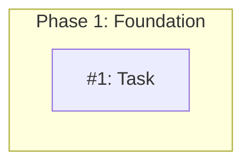
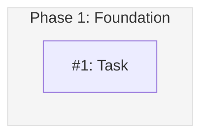

# MM13: Invalid subgraph styling

A subgraph (milestone group) uses non-standard styling.

## Standard Subgraph Style

All subgraphs should use consistent styling for visual clarity:

```mermaid
%%{init: {'theme': 'base', 'themeVariables': { 'clusterBkg': '#f5f5f5', 'clusterBorder': '#e0e0e0' }}}%%
```

Or with explicit style:
```
style Phase1 fill:#f5f5f5,stroke:#e0e0e0
```

## Standard Colors

| Element | Color | Appearance |
|---------|-------|------------|
| Background | `#f5f5f5` | Light gray |
| Border | `#e0e0e0` | Medium gray |

## Why Standardization Matters

- Subgraphs should be visually distinct from nodes but not distracting
- Neutral colors ensure status colors (green, blue, yellow, purple) remain prominent
- Consistent styling across all design documents

## How to Fix

Add the standard styling to your subgraphs:

**Before (non-standard):**


**After:**


## Note

Subgraph styling is optional - the validation only fails if styling IS present but doesn't match the standard.
