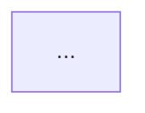
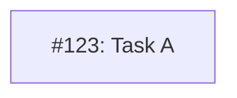

# MM14: Legend line required after diagram

The Mermaid dependency diagram is missing a legend explaining the color coding.

## Required Format

Add a legend line immediately after the closing ``` of the mermaid block:

```markdown


**Legend**: Green = done, Blue = ready, Yellow = blocked, Purple = needs-design
```

## Why This Matters

- Readers can quickly understand what each color means
- Provides context without requiring memorization of the color scheme
- Makes diagrams self-documenting

## How to Fix

Add the legend line after your mermaid diagram:

**Before (invalid):**
```markdown


## Next Section
```

**After:**
```markdown


**Legend**: Green = done, Blue = ready, Yellow = blocked, Purple = needs-design

## Next Section
```

## Standard Legend Text

Use this exact format:

```
**Legend**: Green = done, Blue = ready, Yellow = blocked, Purple = needs-design
```
