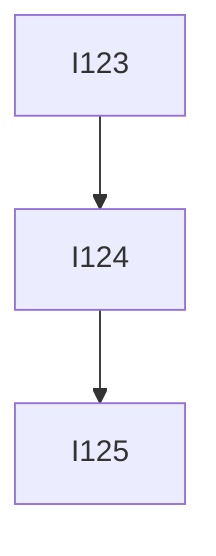
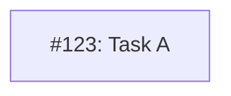

# MM15: Class doesn't match issue status

A node's class assignment doesn't match the actual status of the GitHub issue.

## Status to Class Mapping

| Issue State | Blocking Status | Label | Expected Class |
|-------------|-----------------|-------|----------------|
| Closed | - | - | `done` |
| Open | Has open blockers | - | `blocked` |
| Open | No open blockers | `needs-design` | `needsDesign` |
| Open | No open blockers | (none) | `ready` |

## How Blocking Status is Determined

A node is "blocked" if any of its dependencies (upstream nodes in the graph) have a class other than `done`.

In this example:
- I123 blocks I124
- I124 blocks I125
- If I123 is not `done`, then I124 is blocked
- If I124 is not `done`, then I125 is blocked

## Why This Matters

- Diagram should reflect actual project state
- Incorrect classes mislead readers about what's ready to work on
- Helps identify stale diagrams that need updating

## How to Fix

Update the class assignment to match the issue's actual status:

**Before (incorrect - issue is actually closed):**

**After (correct):**

## Common Scenarios

### Issue was closed but diagram not updated
Change the class from `ready` or `blocked` to `done`.

### Blocker was completed but dependent still shows blocked
Update the dependent issue's class from `blocked` to `ready` (or `needsDesign` if it has that label).

### Issue has needs-design label but shows as ready
Change the class from `ready` to `needsDesign`.

## Note

This check requires the `gh` CLI to be available and authenticated. If `gh` is not available or the issue cannot be fetched, this validation is skipped for that node.
