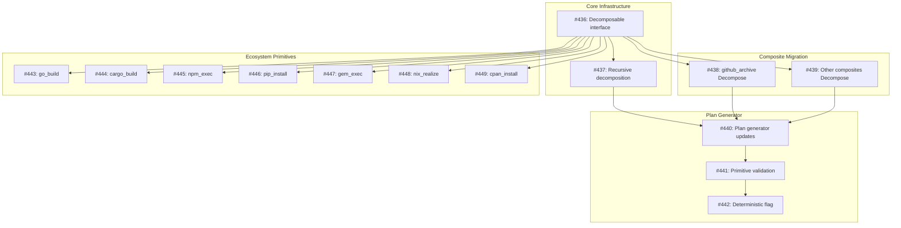

# Design: Decomposable Actions and Primitive Operations

- **Status**: Planned
- **Milestone**: Deterministic Recipe Execution
- **Author**: @dangazineu
- **Created**: 2025-12-12
- **Scope**: Tactical

## Implementation Issues

This design is implemented through the following GitHub issues:

### Core Infrastructure
- [#436](https://github.com/tsukumogami/tsuku/issues/436): Define Decomposable interface and primitive registry
- [#437](https://github.com/tsukumogami/tsuku/issues/437): Implement recursive decomposition algorithm

### Composite Action Migration
- [#438](https://github.com/tsukumogami/tsuku/issues/438): Implement Decompose() for github_archive
- [#439](https://github.com/tsukumogami/tsuku/issues/439): Implement Decompose() for download_archive, github_file, hashicorp_release

### Plan Generator Updates
- [#440](https://github.com/tsukumogami/tsuku/issues/440): Update plan generator to decompose composite actions
- [#441](https://github.com/tsukumogami/tsuku/issues/441): Validate plans contain only primitives
- [#442](https://github.com/tsukumogami/tsuku/issues/442): Add deterministic flag to plan schema

### Ecosystem Primitives
- [#443](https://github.com/tsukumogami/tsuku/issues/443): Implement go_build ecosystem primitive
- [#444](https://github.com/tsukumogami/tsuku/issues/444): Implement cargo_build ecosystem primitive
- [#445](https://github.com/tsukumogami/tsuku/issues/445): Implement npm_exec ecosystem primitive
- [#446](https://github.com/tsukumogami/tsuku/issues/446): Implement pip_install ecosystem primitive
- [#447](https://github.com/tsukumogami/tsuku/issues/447): Implement gem_exec ecosystem primitive
- [#448](https://github.com/tsukumogami/tsuku/issues/448): Implement nix_realize ecosystem primitive
- [#449](https://github.com/tsukumogami/tsuku/issues/449): Implement cpan_install ecosystem primitive

### Dependency Graph



## Upstream Design Reference

This design implements part of [DESIGN-deterministic-resolution.md](DESIGN-deterministic-resolution.md).

**Relevant sections:**
- Core Insight: Split installation into evaluation and execution phases
- Milestone 2: Deterministic Execution

## Context and Problem Statement

The deterministic recipe execution design establishes a two-phase model: evaluation produces an installation plan, execution replays that plan. However, the current implementation has a structural flaw: **composite actions are treated as atomic units in plans, but contain runtime logic that can produce different outcomes**.

For example, `github_archive` is marked as "evaluable" in `ActionEvaluability`, but during execution it:
1. Resolves wildcard asset patterns via GitHub API
2. Constructs download URLs with runtime logic
3. Internally calls download, extract, chmod, and install_binaries actions

This means the plan captures `github_archive` with parameters, but execution may behave differently than what was evaluated - violating the determinism guarantee.

**The core problem**: Plans should contain only primitive operations that execute deterministically. Composite actions are recipe-authoring conveniences that must decompose during evaluation.

## Decision Drivers

1. **Single execution path**: `tsuku install foo` and `tsuku eval foo | tsuku install --plan -` must be semantically equivalent
2. **Structural determinism**: Determinism should be guaranteed by architecture, not by careful implementation
3. **Honest barriers**: Where true determinism is impossible (ecosystem installers), capture maximum constraint and be explicit about limitations
4. **Incremental adoption**: Design must work with existing recipes without breaking changes

## Considered Options

### Option 1: Composite Decomposition at Eval Time

Composite actions implement a `Decompose()` method that returns primitive steps. The plan generator calls this instead of just recording the composite action.

**Pros:**
- Plans contain only primitives - execution is trivially deterministic
- Clear separation between recipe DSL and execution model
- Testable: can unit test decomposition logic

**Cons:**
- Requires refactoring all composite actions
- Decomposition logic may duplicate execution logic initially

### Option 2: Interpreter Pattern with Action Rewriting

The plan generator "interprets" composite actions, rewriting them to primitive sequences. Composite actions remain unchanged but the plan generator understands their structure.

**Pros:**
- No changes to existing action implementations
- Centralized decomposition logic

**Cons:**
- Plan generator becomes complex, tightly coupled to action internals
- Decomposition logic diverges from execution logic over time

### Option 3: Unified Execute/Decompose with Mode Flag

Actions receive an execution mode (Eval vs Execute). In Eval mode, they record their operations to a plan builder rather than executing them.

**Pros:**
- Single code path for both modes
- Decomposition is always in sync with execution

**Cons:**
- Invasive change to action interface
- Every action must handle both modes
- Testing becomes more complex

## Decision Outcome

**Chosen: Option 1 (Composite Decomposition at Eval Time)**

This option provides the cleanest architectural separation. The plan generator produces primitive-only plans, and the executor only understands primitives. The complexity is localized to composite action implementations.

### Rationale

- Maintains single responsibility: composites know how to decompose, primitives know how to execute
- Plans become self-describing - no need to understand composite action semantics to read a plan
- Execution path is simple: iterate over primitives and execute each one
- Future ecosystem primitives follow the same pattern

## Solution Architecture

### Primitive Action Classification

Actions are classified into two tiers based on their decomposition barrier:

#### Tier 1: File Operation Primitives

These are fully atomic operations with deterministic, reproducible behavior:

| Primitive | Purpose | Key Parameters |
|-----------|---------|----------------|
| `download` | Fetch URL to file | `url`, `dest`, `checksum` |
| `extract` | Decompress archive | `archive`, `format`, `strip_dirs` |
| `chmod` | Set file permissions | `files`, `mode` |
| `install_binaries` | Copy to install dir, create symlinks | `binaries`, `install_mode` |
| `set_env` | Set environment variables | `vars` |
| `set_rpath` | Modify binary rpath | `binary`, `rpath` |
| `link_dependencies` | Create dependency symlinks | `dependencies` |
| `install_libraries` | Install shared libraries | `libraries` |

#### Tier 2: Ecosystem Primitives

These represent the **decomposition barrier** for ecosystem-specific operations. They are atomic from tsuku's perspective but internally invoke external tooling. The plan captures maximum constraint to minimize non-determinism.

| Primitive | Ecosystem | Locked at Eval | Residual Non-determinism |
|-----------|-----------|----------------|--------------------------|
| `go_build` | Go | go.sum, module versions | Compiler version, CGO |
| `cargo_build` | Rust | Cargo.lock | Compiler version |
| `npm_exec` | Node.js | package-lock.json | Native addon builds |
| `pip_install` | Python | requirements.txt with hashes | Native extensions |
| `gem_exec` | Ruby | Gemfile.lock | Native extensions |
| `nix_realize` | Nix | Derivation hash | None (fully deterministic) |

Each ecosystem primitive requires dedicated investigation to determine:
1. What can be locked at eval time
2. What reproducibility guarantees the ecosystem provides
3. Minimal invocation that respects locks
4. Residual non-determinism that must be accepted

### Composite Action Decomposition

Composite actions implement the `Decomposable` interface:

```go
// Decomposable indicates an action can be broken into primitive steps
type Decomposable interface {
    // Decompose returns the steps this action expands to.
    // Steps may be primitives or other composites (recursive decomposition).
    // Called during plan generation, not execution.
    Decompose(ctx *EvalContext, params map[string]interface{}) ([]Step, error)
}

// Step represents a single operation returned by Decompose.
// It may be a primitive (terminal) or another composite (requires further decomposition).
type Step struct {
    Action   string                 // Action name (primitive or composite)
    Params   map[string]interface{} // Fully resolved parameters
    Checksum string                 // For download actions: expected SHA256
    Size     int64                  // For download actions: expected size
}

// EvalContext provides context during decomposition
type EvalContext struct {
    Version    string
    VersionTag string
    OS         string
    Arch       string
    Recipe     *recipe.Recipe
    Resolver   *version.Resolver    // For API calls (asset resolution, etc.)
    Downloader *validate.PreDownloader // For checksum computation
}
```

#### Recursive Decomposition

Composite actions may return other composite actions from `Decompose()`. The plan generator recursively decomposes until only primitives remain:

```go
// DecomposeToprimitives recursively decomposes an action until all steps are primitives.
func DecomposeToPrimitives(ctx *EvalContext, action string, params map[string]interface{}) ([]PrimitiveStep, error) {
    // Check if action is already a primitive
    if IsPrimitive(action) {
        return []PrimitiveStep{{Action: action, Params: params}}, nil
    }

    // Get the action and check if it's decomposable
    act := actions.Get(action)
    decomposable, ok := act.(Decomposable)
    if !ok {
        return nil, fmt.Errorf("action %s is neither primitive nor decomposable", action)
    }

    // Decompose and recursively process each resulting step
    steps, err := decomposable.Decompose(ctx, params)
    if err != nil {
        return nil, fmt.Errorf("failed to decompose %s: %w", action, err)
    }

    var primitives []PrimitiveStep
    for _, step := range steps {
        // Recursive call - step.Action may be composite or primitive
        subPrimitives, err := DecomposeToPrimitives(ctx, step.Action, step.Params)
        if err != nil {
            return nil, err
        }
        // Carry forward checksum/size from the step if present
        if len(subPrimitives) == 1 && step.Checksum != "" {
            subPrimitives[0].Checksum = step.Checksum
            subPrimitives[0].Size = step.Size
        }
        primitives = append(primitives, subPrimitives...)
    }

    return primitives, nil
}
```

This recursive approach enables:

1. **Layered composition**: A high-level action like `install_from_github` could decompose to `github_archive`, which further decomposes to download/extract/chmod/install_binaries.

2. **Reusable building blocks**: Mid-level composites (like `download_and_extract`) can be shared across multiple high-level composites.

3. **Gradual migration**: Existing composite actions can initially decompose to other composites, with primitives introduced incrementally.

**Cycle detection**: The plan generator must detect cycles to prevent infinite recursion. A simple visited set tracking `(action, params_hash)` tuples suffices.

#### Example: github_archive Decomposition

```go
func (a *GitHubArchiveAction) Decompose(ctx *EvalContext, params map[string]interface{}) ([]PrimitiveStep, error) {
    // 1. Resolve asset pattern (may involve API call)
    assetName := resolveAssetPattern(ctx, params)

    // 2. Construct download URL
    url := fmt.Sprintf("https://github.com/%s/releases/download/%s/%s",
        params["repo"], ctx.VersionTag, assetName)

    // 3. Download to compute checksum
    result, err := ctx.Downloader.Download(ctx.Context, url)
    if err != nil {
        return nil, err
    }
    defer result.Cleanup()

    // 4. Return primitive steps
    return []PrimitiveStep{
        {
            Action:   "download",
            Params:   map[string]interface{}{"url": url, "dest": assetName},
            Checksum: result.Checksum,
            Size:     result.Size,
        },
        {
            Action: "extract",
            Params: map[string]interface{}{
                "archive":    assetName,
                "format":     params["archive_format"],
                "strip_dirs": params["strip_dirs"],
            },
        },
        {
            Action: "chmod",
            Params: map[string]interface{}{"files": extractBinaries(params)},
        },
        {
            Action: "install_binaries",
            Params: map[string]interface{}{
                "binaries":     params["binaries"],
                "install_mode": params["install_mode"],
            },
        },
    }, nil
}
```

### Plan Structure

Plans contain only primitive operations:

```json
{
  "format_version": 2,
  "tool": "ripgrep",
  "version": "14.1.0",
  "platform": {"os": "linux", "arch": "amd64"},
  "generated_at": "2025-12-12T10:00:00Z",
  "recipe_hash": "sha256:abc...",
  "steps": [
    {
      "action": "download",
      "params": {
        "url": "https://github.com/BurntSushi/ripgrep/releases/download/14.1.0/ripgrep-14.1.0-x86_64-unknown-linux-musl.tar.gz",
        "dest": "ripgrep-14.1.0-x86_64-unknown-linux-musl.tar.gz"
      },
      "checksum": "sha256:1234567890abcdef...",
      "size": 2048576
    },
    {
      "action": "extract",
      "params": {
        "archive": "ripgrep-14.1.0-x86_64-unknown-linux-musl.tar.gz",
        "format": "tar.gz",
        "strip_dirs": 1
      }
    },
    {
      "action": "chmod",
      "params": {"files": ["rg"]}
    },
    {
      "action": "install_binaries",
      "params": {"binaries": ["rg"]}
    }
  ]
}
```

### Ecosystem Primitive Example: go_build

For ecosystem primitives, the plan captures the lock information:

```json
{
  "action": "go_build",
  "params": {
    "module": "github.com/jesseduffield/lazygit",
    "version": "v0.40.2",
    "executables": ["lazygit"]
  },
  "locks": {
    "go_version": "1.21.0",
    "go_sum": "h1:abc...=\ngithub.com/foo/bar v1.0.0 h1:xyz...=\n..."
  },
  "deterministic": false
}
```

The `deterministic: false` flag explicitly marks this step as having residual non-determinism.

### Unified Execution Flow

```
tsuku install foo
       │
       ▼
┌─────────────────┐
│  Load Recipe    │
└────────┬────────┘
         │
         ▼
┌─────────────────┐
│  Generate Plan  │◄── Decompose composites
│  (eval phase)   │    Resolve versions
└────────┬────────┘    Compute checksums
         │             Lock ecosystem deps
         ▼
┌─────────────────┐
│  Installation   │◄── Plan (primitives only)
│     Plan        │
└────────┬────────┘
         │
         ▼
┌─────────────────┐
│  Execute Plan   │◄── Iterate primitives
│  (exec phase)   │    Verify checksums
└────────┬────────┘    Fail on mismatch
         │
         ▼
    Installed Tool
```

Both `tsuku install foo` and `tsuku eval foo | tsuku install --plan -` follow this exact flow. The only difference is whether the plan is transient (piped) or persisted (file).

## Implementation Approach

### Phase 1: Decomposable Interface and File Primitives

1. Define `Decomposable` interface in `internal/actions/`
2. Update `ResolvedStep` to remove composite actions, only allow primitives
3. Implement `Decompose()` for:
   - `DownloadArchiveAction`
   - `GitHubArchiveAction`
   - `GitHubFileAction`
   - `HashiCorpReleaseAction`
4. Update plan generator to call `Decompose()` for composite actions
5. Executor validates plan contains only primitives

### Phase 2: Ecosystem Primitive Investigation

Launch parallel investigation for each ecosystem:
- Go modules: lock format, reproducibility guarantees
- Cargo: Cargo.lock integration, build reproducibility
- npm: package-lock.json, native addon handling
- pip: requirements.txt with hashes, wheel reproducibility
- gem: Gemfile.lock format
- nix: derivation hashing, store path capture

### Phase 3: Ecosystem Primitive Implementation

Based on investigation results, implement each ecosystem primitive:
1. Define lock capture at eval time
2. Implement locked execution
3. Document residual non-determinism
4. Add `deterministic` flag to plan schema

## Security Considerations

### Download Verification

- All `download` primitives in plans include checksums
- Executor verifies checksum before proceeding
- Mismatch is a hard failure (security feature)

### Execution Isolation

- Ecosystem primitives run in controlled environments
- Go: `CGO_ENABLED=0`, isolated `GOMODCACHE`
- npm: `--ignore-scripts` option for untrusted packages
- Each ecosystem primitive documents its isolation model

### Supply Chain Risks

- Plans capture checksums at eval time
- Re-evaluation detects upstream changes (modified releases)
- Ecosystem locks (go.sum, Cargo.lock) provide additional verification
- Residual risk: initial eval inherits any existing compromise

### User Data Exposure

- Plans may contain URLs that reveal tool preferences
- No credentials in plans (URLs are public download links)
- Ecosystem locks don't contain sensitive data

## Consequences

### Positive

- **Guaranteed determinism for decomposable recipes**: Plans with only Tier 1 primitives are fully reproducible
- **Explicit non-determinism**: Ecosystem primitives clearly mark residual non-determinism
- **Simpler executor**: Only understands primitives, no composite action logic
- **Better testability**: Can unit test decomposition separate from execution
- **Auditable plans**: Plans are self-describing, no hidden logic

### Negative

- **Increased eval time**: Decomposition requires API calls and downloads upfront
- **Migration effort**: All composite actions need `Decompose()` implementation
- **Plan size**: Decomposed plans are larger than composite plans
- **Ecosystem complexity**: Each ecosystem primitive requires dedicated investigation

### Neutral

- **Recipe syntax unchanged**: Authors still write `github_archive`, it decomposes transparently
- **Backward compatibility**: Old plans with composite actions can be re-evaluated

## Open Questions

1. **Plan format version**: Should decomposed plans use format version 2 to distinguish from current plans?

2. **Partial determinism**: Should plans have an overall `deterministic` flag, or is per-step sufficient?

3. **Ecosystem primitive naming**: `go_build` vs `go_install_locked` vs keeping `go_install` with enhanced behavior?

4. **Lock storage**: Should ecosystem locks be inline in the plan or referenced files?

## Appendix A: Ecosystem Investigation Results

Detailed research was conducted for each supported ecosystem. Full reports are available in `docs/deterministic-builds/`. This appendix summarizes key findings.

### Summary Table

| Ecosystem | Lock File | Deterministic | Key Limitation |
|-----------|-----------|---------------|----------------|
| **Nix** | flake.lock + derivation hash | **Yes** | Binary cache trust |
| **Go** | go.sum (MVS checksums) | Yes (pure Go) | CGO, compiler version |
| **Cargo** | Cargo.lock (SHA-256) | No | Compiler, build scripts |
| **npm** | package-lock.json v3 | Partial | Native addons, scripts |
| **pip** | requirements.txt + hashes | No | Platform wheels, C extensions |
| **gem** | Gemfile.lock + checksums | No | Native extensions, hooks |
| **CPAN** | cpanfile.snapshot (Carton) | No | XS modules, Makefile.PL |

### Go

> Full details: [ecosystem_go.md](deterministic-builds/ecosystem_go.md)

**Lock mechanism**: `go.sum` contains cryptographic checksums for all module dependencies. Go's Minimum Version Selection (MVS) algorithm ensures reproducible dependency resolution.

**Eval-time capture**:
```bash
go mod download -json  # Download and hash all dependencies
go list -m all         # List resolved module versions
```

**Locked execution**:
```bash
CGO_ENABLED=0 \
GOPROXY=off \
go build -trimpath -buildvcs=false ./...
```

**Recommended primitive**:
```go
type GoBuildParams struct {
    Module      string            `json:"module"`       // e.g., "github.com/user/repo"
    Version     string            `json:"version"`      // e.g., "v1.2.3"
    Executables []string          `json:"executables"`  // Binary names to install
    GoSum       string            `json:"go_sum"`       // Complete go.sum content
    GoVersion   string            `json:"go_version"`   // e.g., "1.21.0"
    CGOEnabled  bool              `json:"cgo_enabled"`  // Default: false
    BuildFlags  []string          `json:"build_flags"`  // e.g., ["-trimpath"]
}
```

**Residual non-determinism**: Compiler version, CGO dependencies, embedded paths (mitigated with `-trimpath`).

**Security**: Module proxy compromise, typosquatting. Mitigated by go.sum checksum verification.

### Cargo

> Full details: [ecosystem_cargo.md](deterministic-builds/ecosystem_cargo.md)

**Lock mechanism**: `Cargo.lock` contains SHA-256 checksums for all crate dependencies in TOML format.

**Eval-time capture**:
```bash
cargo metadata --format-version 1  # Dependency graph (no build)
cargo fetch                         # Download all crates
```

**Locked execution**:
```bash
cargo build --release --locked --offline
```

**Recommended primitive**:
```go
type CargoBuildParams struct {
    Crate        string   `json:"crate"`         // e.g., "ripgrep"
    Version      string   `json:"version"`       // e.g., "14.1.0"
    Executables  []string `json:"executables"`   // Binary names
    CargoLock    string   `json:"cargo_lock"`    // Complete Cargo.lock content
    RustVersion  string   `json:"rust_version"`  // e.g., "1.75.0"
    TargetTriple string   `json:"target_triple"` // e.g., "x86_64-unknown-linux-gnu"
}
```

**Residual non-determinism**: Compiler version, target triple, build scripts (`build.rs`), proc macros.

**Security**: Build scripts execute arbitrary code. Mitigated by sandboxing, checksum verification.

### npm

> Full details: [ecosystem_npm.md](deterministic-builds/ecosystem_npm.md)

**Lock mechanism**: `package-lock.json` v2/v3 contains complete dependency tree with SHA-512 integrity hashes.

**Eval-time capture**:
```bash
npm install --package-lock-only  # Generate lockfile without installing
npm ci --dry-run                  # Verify lockfile
```

**Locked execution**:
```bash
npm ci --ignore-scripts --offline
```

**Recommended primitive**:
```go
type NpmExecParams struct {
    Package      string   `json:"package"`       // e.g., "@angular/cli"
    Version      string   `json:"version"`       // e.g., "17.0.0"
    Executables  []string `json:"executables"`   // Binary names
    PackageLock  string   `json:"package_lock"`  // Complete package-lock.json
    NodeVersion  string   `json:"node_version"`  // e.g., "20.10.0"
    IgnoreScripts bool    `json:"ignore_scripts"` // Default: true (security)
}
```

**Residual non-determinism**: Native addons (node-gyp), postinstall scripts, Node.js version.

**Security**: Install scripts, typosquatting, supply chain. Mitigated by `--ignore-scripts`, integrity verification.

### pip

> Full details: [ecosystem_pip.md](deterministic-builds/ecosystem_pip.md)

**Lock mechanism**: `requirements.txt` with hashes (via pip-tools). Format: `package==version --hash=sha256:...`

**Eval-time capture**:
```bash
pip-compile --generate-hashes requirements.in  # Generate locked requirements
pip download -r requirements.txt               # Download wheels
```

**Locked execution**:
```bash
pip install --require-hashes --no-deps --only-binary :all: -r requirements.txt
```

**Recommended primitive**:
```go
type PipInstallParams struct {
    Package        string   `json:"package"`         // e.g., "black"
    Version        string   `json:"version"`         // e.g., "23.12.1"
    Executables    []string `json:"executables"`     // Binary names
    Requirements   string   `json:"requirements"`    // requirements.txt with hashes
    PythonVersion  string   `json:"python_version"`  // e.g., "3.11"
    OnlyBinary     bool     `json:"only_binary"`     // Default: true (no sdist)
}
```

**Residual non-determinism**: Platform wheels, C extensions, Python version ABI.

**Security**: setup.py execution, hash spoofing. Mitigated by `--only-binary`, hash verification.

### gem

> Full details: [ecosystem_gem.md](deterministic-builds/ecosystem_gem.md)

**Lock mechanism**: `Gemfile.lock` with SHA-256 checksums (Bundler 2.6+).

**Eval-time capture**:
```bash
bundle lock --add-checksums --add-platform x86_64-linux
```

**Locked execution**:
```bash
BUNDLE_FROZEN=true bundle install --no-document --standalone
```

**Recommended primitive**:
```go
type GemExecParams struct {
    Gem           string            `json:"gem"`            // e.g., "rubocop"
    Version       string            `json:"version"`        // e.g., "1.50.2"
    Executables   []string          `json:"executables"`    // Binary names
    LockData      string            `json:"lock_data"`      // Complete Gemfile.lock
    RubyVersion   string            `json:"ruby_version"`   // e.g., "3.2.0"
    Platforms     []string          `json:"platforms"`      // e.g., ["ruby", "x86_64-linux"]
}
```

**Residual non-determinism**: Native extensions, Ruby version ABI, pre/post-install hooks.

**Security**: Install hooks execute arbitrary code (no disable mechanism). Platform gems may differ.

### Nix

> Full details: [ecosystem_nix.md](deterministic-builds/ecosystem_nix.md)

**Lock mechanism**: `flake.lock` (JSON) pins all flake inputs. Derivation hashes provide content-addressable builds.

**Eval-time capture**:
```bash
nix flake metadata --json          # Resolved/locked inputs (fast)
nix derivation show nixpkgs#hello  # Derivation path without building
nix-instantiate                    # Create .drv, compute output path
```

**Locked execution**:
```bash
nix build --no-update-lock-file nixpkgs#package
nix-store --realize /nix/store/abc...xyz.drv
```

**Recommended primitive**:
```go
type NixRealizeParams struct {
    FlakeRef       string          `json:"flake_ref"`        // e.g., "nixpkgs#hello"
    Executables    []string        `json:"executables"`      // Binary names
    DerivationPath string          `json:"derivation_path"`  // Pre-computed .drv path
    OutputPath     string          `json:"output_path"`      // Expected store path
    FlakeLock      json.RawMessage `json:"flake_lock"`       // Complete flake.lock
    LockedRef      string          `json:"locked_ref"`       // Pinned flake reference
}
```

**Residual non-determinism**: Minimal. Timestamps, compression non-determinism in upstream packages.

**Security**: Binary cache trust model. Mitigated by signature verification, local builds.

**Note**: Nix provides the strongest reproducibility guarantees of all ecosystems.

### CPAN

> Full details: [ecosystem_cpan.md](deterministic-builds/ecosystem_cpan.md)

**Lock mechanism**: `cpanfile.snapshot` (via Carton) captures distribution versions and dependency graph.

**Eval-time capture**:
```bash
carton install   # Resolve dependencies, create snapshot
carton bundle    # Download tarballs to vendor/cache
```

**Locked execution**:
```bash
cpanm --local-lib ./local --mirror file://vendor/cache --mirror-only Module@version
```

**Recommended primitive**:
```go
type CpanInstallParams struct {
    Distribution string            `json:"distribution"` // e.g., "App-Ack"
    Version      string            `json:"version"`      // e.g., "3.7.0"
    Executables  []string          `json:"executables"`  // Binary names
    Snapshot     string            `json:"snapshot"`     // Complete cpanfile.snapshot
    PerlVersion  string            `json:"perl_version"` // e.g., "5.38.0"
    MirrorOnly   bool              `json:"mirror_only"`  // Default: true
    CachedBundle bool              `json:"cached_bundle"` // Use vendored tarballs
}
```

**Residual non-determinism**: XS module compilation, Perl version core modules, Makefile.PL decisions.

**Security**: Makefile.PL executes arbitrary code (unavoidable). CPAN mirror tampering. Mitigated by bundling, checksum verification.

## Appendix B: Ecosystem Investigation Template

For future ecosystem additions, answer these questions:

### [Ecosystem Name]

**Lock mechanism**: What file/format captures the dependency graph?

**Eval-time capture**: What commands extract lock information without installing?

**Locked execution**: What flags/env ensure the lock is respected?

**Reproducibility guarantees**: What does the ecosystem guarantee about builds?

**Residual non-determinism**: What can still vary between runs?

**Recommended primitive interface**:
```go
type [Ecosystem]BuildParams struct {
    // Fields
}
```

**Security considerations**: Specific risks for this ecosystem.

## Appendix C: Detailed Research References

Full ecosystem investigation reports with implementation details:

- `docs/deterministic-builds/ecosystem_go.md` - Go modules and build system
- `docs/deterministic-builds/ecosystem_cargo.md` - Rust Cargo build system
- `docs/deterministic-builds/ecosystem_npm.md` - npm package manager
- `docs/deterministic-builds/ecosystem_pip.md` - Python pip/pipx
- `docs/deterministic-builds/ecosystem_gem.md` - Ruby gem/Bundler
- `docs/deterministic-builds/ecosystem_nix.md` - Nix flakes and derivations
- `docs/deterministic-builds/ecosystem_cpan.md` - Perl CPAN/Carton

These reports contain detailed API examples, security analysis, and implementation recommendations.
