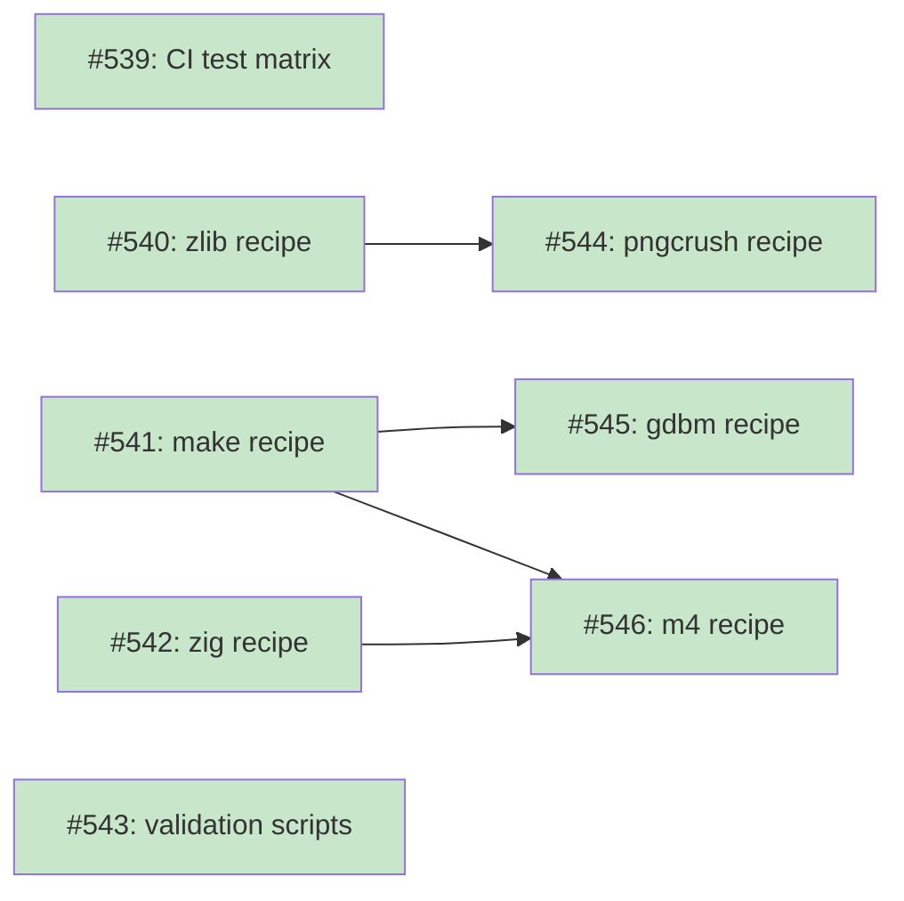
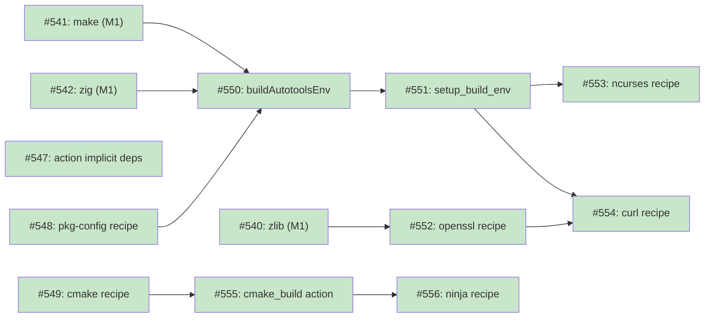
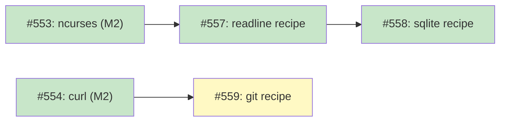
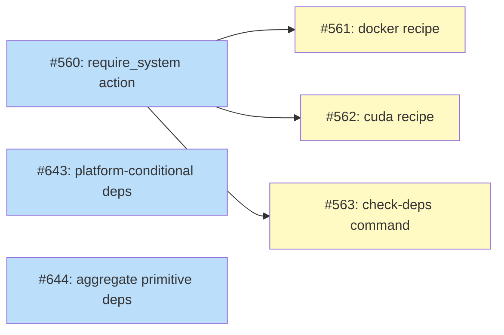

# Dependency Provisioning

## Status

Current

## Implementation Issues

**Legend**: Green = done, Blue = ready, Yellow = blocked

### Milestone: [Dependency Provisioning: Build Foundation](https://github.com/tsukumogami/tsuku/milestone/18)

| Issue | Title | Dependencies | Status |
|-------|-------|--------------|--------|
| [#539](https://github.com/tsukumogami/tsuku/issues/539) | ci(build): add 4-platform test matrix for build essentials | None | Done |
| [#540](https://github.com/tsukumogami/tsuku/issues/540) | feat(recipes): add zlib recipe using homebrew | None | Done |
| [#541](https://github.com/tsukumogami/tsuku/issues/541) | feat(recipes): add make recipe using homebrew | None | Done |
| [#542](https://github.com/tsukumogami/tsuku/issues/542) | feat(recipes): add zig recipe and validate cc wrapper | None | Done |
| [#543](https://github.com/tsukumogami/tsuku/issues/543) | feat(scripts): add build essential validation scripts | None | Done |
| [#544](https://github.com/tsukumogami/tsuku/issues/544) | feat(recipes): add pngcrush recipe to validate zlib dependency | [#540](https://github.com/tsukumogami/tsuku/issues/540) | Done |
| [#545](https://github.com/tsukumogami/tsuku/issues/545) | feat(recipes): add gdbm recipe to validate configure_make | [#541](https://github.com/tsukumogami/tsuku/issues/541) | Done |
| [#546](https://github.com/tsukumogami/tsuku/issues/546) | feat(recipes): add m4 recipe to validate compilation | [#541](https://github.com/tsukumogami/tsuku/issues/541), [#542](https://github.com/tsukumogami/tsuku/issues/542) | Done |



### Milestone: [Dependency Provisioning: Build Environment](https://github.com/tsukumogami/tsuku/milestone/19)

| Issue | Title | Dependencies |
|-------|-------|--------------|
| [#547](https://github.com/tsukumogami/tsuku/issues/547) | feat(actions): declare implicit dependencies for build actions | None |
| [#548](https://github.com/tsukumogami/tsuku/issues/548) | feat(recipes): add pkg-config recipe using homebrew | None |
| [#549](https://github.com/tsukumogami/tsuku/issues/549) | feat(recipes): add cmake recipe using homebrew | None |
| [#550](https://github.com/tsukumogami/tsuku/issues/550) | feat(actions): enhance buildAutotoolsEnv with dependency paths | [#541](https://github.com/tsukumogami/tsuku/issues/541), [#542](https://github.com/tsukumogami/tsuku/issues/542), [#548](https://github.com/tsukumogami/tsuku/issues/548) |
| [#551](https://github.com/tsukumogami/tsuku/issues/551) | feat(actions): implement setup_build_env action | [#550](https://github.com/tsukumogami/tsuku/issues/550) |
| [#552](https://github.com/tsukumogami/tsuku/issues/552) | feat(recipes): add openssl recipe using homebrew | [#540](https://github.com/tsukumogami/tsuku/issues/540) |
| [#553](https://github.com/tsukumogami/tsuku/issues/553) | feat(recipes): add ncurses recipe to validate pkg-config | [#551](https://github.com/tsukumogami/tsuku/issues/551) |
| [#554](https://github.com/tsukumogami/tsuku/issues/554) | feat(recipes): add curl recipe to validate openssl | [#551](https://github.com/tsukumogami/tsuku/issues/551), [#552](https://github.com/tsukumogami/tsuku/issues/552) |
| [#555](https://github.com/tsukumogami/tsuku/issues/555) | feat(actions): implement cmake_build action | [#549](https://github.com/tsukumogami/tsuku/issues/549) |
| [#556](https://github.com/tsukumogami/tsuku/issues/556) | feat(recipes): add ninja recipe to validate cmake_build | [#555](https://github.com/tsukumogami/tsuku/issues/555) |



### Milestone: [Dependency Provisioning: Full Integration](https://github.com/tsukumogami/tsuku/milestone/20)

| Issue | Title | Dependencies |
|-------|-------|--------------|
| [#557](https://github.com/tsukumogami/tsuku/issues/557) | feat(recipes): add readline recipe using homebrew | [#553](https://github.com/tsukumogami/tsuku/issues/553) |
| [#558](https://github.com/tsukumogami/tsuku/issues/558) | feat(recipes): add sqlite recipe to validate readline | [#557](https://github.com/tsukumogami/tsuku/issues/557) |
| [#559](https://github.com/tsukumogami/tsuku/issues/559) | feat(recipes): add git recipe to validate complete toolchain | [#554](https://github.com/tsukumogami/tsuku/issues/554) |



### Milestone: [Dependency Provisioning: System-Required](https://github.com/tsukumogami/tsuku/milestone/21)

| Issue | Title | Dependencies |
|-------|-------|--------------|
| [#560](https://github.com/tsukumogami/tsuku/issues/560) | feat(actions): implement require_system action with detection | None |
| [#561](https://github.com/tsukumogami/tsuku/issues/561) | feat(recipes): add docker recipe using require_system | [#560](https://github.com/tsukumogami/tsuku/issues/560) |
| [#562](https://github.com/tsukumogami/tsuku/issues/562) | feat(recipes): add cuda recipe using require_system | [#560](https://github.com/tsukumogami/tsuku/issues/560) |
| [#563](https://github.com/tsukumogami/tsuku/issues/563) | feat(cli): add tsuku check-deps command | [#560](https://github.com/tsukumogami/tsuku/issues/560) |
| [#643](https://github.com/tsukumogami/tsuku/issues/643) | feat(actions): add platform-conditional dependencies | None |
| [#644](https://github.com/tsukumogami/tsuku/issues/644) | feat(actions): aggregate primitive action dependencies in composites | None |



## Context and Problem Statement

Tsuku recipes need to declare dependencies on external tools and libraries. These dependencies have different provisioning strategies:

1. **Downloadable**: Tools tsuku downloads and installs (pre-built binaries, Homebrew bottles)
2. **Buildable**: Tools tsuku builds from source (using compilers it provides)
3. **System-required**: Tools that must already exist on the system (Docker, CUDA, kernel modules)

Currently, tsuku has no way to:
- Declare dependencies on things it cannot provide
- Give users clear guidance when system dependencies are missing
- Proactively provide build essentials that users assume come from the "system"

This creates friction:
- Builds fail with cryptic errors when prerequisites are missing
- Users don't know what to install or how
- Recipe authors can't express "this needs Docker installed"
- No consistency across environments (CI vs local, macOS vs Linux)

### Key Insight

**All dependencies should be recipes.** The recipe's *actions* determine how to provision:

- `homebrew_bottle` → download and install pre-built binary
- `configure_make` → build from source
- `require_system` → validate system has it, guide user if missing

This unified model means recipe authors just declare `dependencies = ["docker", "gcc", "zlib"]` - tsuku looks up each recipe and provisions according to its actions.

### What Tsuku CAN Provide

Most traditional "system" dependencies can be provided via Homebrew bottles:
- **Compilers**: gcc, clang, binutils
- **Build tools**: make, cmake, autoconf, meson
- **Libraries**: zlib, openssl, libffi, ncurses

These work when relocated to `$TSUKU_HOME` (validated per-platform).

### What Tsuku CANNOT Provide

Some dependencies fundamentally cannot be relocated or installed without system privileges:

| Category | Examples | Why Tsuku Cannot Provide |
|----------|----------|--------------------------|
| **C Runtime** | libc, libSystem | Everything links against it; cannot be relocated |
| **Kernel Interfaces** | /dev, /proc, system calls | OS-level, not user-space |
| **Privileged Daemons** | Docker, systemd services | Require root, kernel features (cgroups, namespaces) |
| **Kernel Modules** | GPU drivers, filesystem drivers | Must be loaded into kernel |
| **System Services** | D-Bus, launchd agents | Require system-wide integration |
| **Hardware Access** | Direct GPU, USB, network drivers | Require kernel-level permissions |

**Docker example**: Docker requires:
- Kernel features (cgroups, namespaces) - not user-space
- A privileged daemon (dockerd runs as root) - tsuku is unprivileged
- System service integration (systemd/launchd) - outside tsuku's scope
- Cannot be "relocated" - it's fundamentally a system-level component

These dependencies have recipes too - but their recipes use the `require_system` action instead of download/build actions.

### Relationship to Existing Dependency Model

The existing model (see [DESIGN-dependency-pattern.md](DESIGN-dependency-pattern.md)) already handles:
- **Install-time dependencies** (`dependencies`) - needed during `tsuku install`
- **Runtime dependencies** (`runtime_dependencies`) - needed when the tool runs
- **Implicit action dependencies** - actions declare what they need (e.g., `npm_install` needs `nodejs`)

This design extends that model:
- Build actions (`configure_make`, `cmake_build`) declare implicit dependencies on build tools
- Tsuku provides all build tools, not just ecosystem runtimes
- System-required dependencies are recipes with `require_system` action
- No special syntax needed - just declare dependencies normally

### Homebrew Mapping

| Homebrew Field | Tsuku Mapping |
|----------------|---------------|
| `dependencies` | `dependencies` + `runtime_dependencies` |
| `build_dependencies` | `dependencies` only (not in `runtime_dependencies`) |
| `uses_from_macos` | Tsuku provides these too (validated per-platform) |

### Scope

**In scope:**
- **Unified Recipe Model**: All dependencies are recipes with appropriate actions
  - Provisionable tools use `homebrew_bottle`, `configure_make`, etc.
  - System-required tools use new `require_system` action
  - Recipe authors just declare `dependencies = ["docker", "gcc"]`
- **Build Essentials**: Proactively provide compilers, build tools, and libraries
  - Create recipes for baseline dependencies (gcc, make, zlib, etc.)
  - Validate cross-platform functionality via test matrix
- **System-Required Dependencies**: Handle tools tsuku cannot provide
  - New `require_system` action for detection and guidance
  - Clear error messages with installation guidance
  - Optional assisted installation with user consent

**Out of scope:**
- Automatic silent installation of system dependencies
- System dependency version management (beyond minimum version checks)

## Decision Drivers

- **Zero prerequisites**: Users shouldn't need to install anything before tsuku works
- **Cross-platform consistency**: Same recipe works on macOS and Linux
- **Validation over assumption**: Test that relocated tools actually work
- **Fail fast**: If something truly can't be provided, error clearly
- **Reuse existing patterns**: Extend implicit dependency system, don't reinvent

## Considered Options

### Decision 1: How to handle provisionable dependencies (gcc, zlib, etc.)

#### Option 1A: Require System Installation

Require users to pre-install build tools via apt/brew before using tsuku.

**Pros:**
- No additional work for tsuku
- Smaller disk footprint

**Cons:**
- Friction for users (must install prerequisites)
- Cryptic errors when deps missing
- Inconsistent across platforms
- Violates "self-contained" philosophy

#### Option 1B: Tsuku Provides All Build Essentials

Tsuku proactively provides compilers, build tools, and common libraries via Homebrew bottles.

**Pros:**
- Zero prerequisites for users
- Consistent behavior across platforms
- Solves the actual problem (missing deps)

**Cons:**
- Larger disk footprint
- More recipes to maintain
- Bootstrap complexity (need pre-built bottles)

### Decision 2: How to handle unprovisionable dependencies (Docker, etc.)

#### Option 2A: No Declaration (Status Quo)

Don't declare system dependencies; let tools fail with their own error messages.

**Pros:**
- No additional work

**Cons:**
- Cryptic error messages
- Users don't know what to install
- No way for recipes to express requirements

#### Option 2B: Annotation Prefix (`system:docker`)

Add a `system:` prefix to declare dependencies tsuku cannot provide:

```toml
dependencies = ["system:docker", "zlib"]
```

**Pros:**
- Works with existing dependency model

**Cons:**
- Recipe authors must know tsuku internals to classify correctly
- Cognitive burden: is it `docker` or `system:docker`?
- LLMs will frequently misclassify (estimated 30-50% error rate without canonical lists)
- No validation feedback if author uses wrong classification

#### Option 2C: Unified Recipe Model (All Dependencies Are Recipes)

Every dependency has a recipe. The recipe's actions determine provisioning strategy:

```toml
# gcc.toml - provisionable via Homebrew
[[steps]]
action = "homebrew"
formula = "gcc"

# docker.toml - system-required
[[steps]]
action = "require_system"
command = "docker"
install_guide = { darwin = "brew install --cask docker", linux = "..." }
```

Recipe authors just declare:
```toml
dependencies = ["docker", "gcc", "zlib"]  # No prefix needed
```

**Pros:**
- No special syntax for recipe authors to learn
- Tsuku auto-classifies based on recipe content
- Adding new system deps = adding a recipe file (not code changes)
- LLM generation simplified (just list dependencies)
- Validation: unknown dependency = recipe doesn't exist
- Enables future assisted installation per-tool

**Cons:**
- Must create recipes for system dependencies (docker.toml, cuda.toml)
- Recipe lookup adds minor overhead

## Decision Outcome

**Chosen: 1B + 2C (Unified Recipe Model)**

### Summary

All dependencies are recipes. Provisionable tools (gcc, zlib) have recipes with `homebrew_bottle` or `configure_make` actions. System-required tools (Docker, CUDA) have recipes with the new `require_system` action. Recipe authors just declare `dependencies = ["docker", "gcc"]` without any special syntax - tsuku looks up each recipe and provisions according to its actions.

### Rationale

**For Decision 1 (provisionable deps):** Option 1B aligns with tsuku's "self-contained" philosophy. If tsuku can provide something, it should.

**For Decision 2 (unprovisionable deps):** Option 2C (unified model) was chosen over 2B (annotation prefix) because:

- The `system:` prefix creates cognitive burden - recipe authors must understand tsuku internals to classify correctly
- LLMs will misclassify 30-50% of dependencies without canonical lists embedded in prompts
- Detection logic belongs in recipes (data), not hardcoded registries (code)

The unified model solves these problems:
- Recipe authors don't need to classify - just list dependencies
- LLMs generate correct recipes without understanding tsuku internals
- Adding new system deps is adding a recipe file, not modifying code
- Each recipe is self-documenting about its provisioning strategy
- Validation is simple: unknown dependency = recipe doesn't exist

## Build Essentials Inventory

### Compilers and Toolchains

| Tool | Purpose | Source | Priority |
|------|---------|--------|----------|
| zig | C/C++ compiler (via zig cc) | GitHub release | P0 (default) |
| gcc | C/C++ compiler | Homebrew | P1 (fallback if zig edge cases) |
| clang/llvm | C/C++ compiler | Homebrew | P2 |
| binutils | Linker, assembler | Homebrew | P1 (if needed) |

**Note**: Zig is the default compiler because it's a single relocatable binary. GCC can be added later if specific tools require it.

### Build Systems

| Tool | Purpose | Homebrew Available | Priority |
|------|---------|-------------------|----------|
| make | GNU Make | Yes | P0 |
| cmake | CMake build system | Yes (likely exists) | P0 |
| autoconf | Autotools configure | Yes | P1 |
| automake | Autotools Makefile generation | Yes | P1 |
| libtool | Library build helper | Yes | P1 |
| meson | Meson build system | Yes | P2 |
| ninja | Ninja build tool | Yes | P1 |

### Build Utilities

| Tool | Purpose | Homebrew Available | Priority |
|------|---------|-------------------|----------|
| pkg-config | Library discovery | Yes (likely exists) | P0 |
| m4 | Macro processor | Yes | P1 |
| bison | Parser generator | Yes | P2 |
| flex | Lexer generator | Yes | P2 |

### Common Libraries

| Library | Purpose | Homebrew Available | Priority |
|---------|---------|-------------------|----------|
| zlib | Compression | Yes | P0 |
| openssl | TLS/crypto | Yes (likely exists) | P0 |
| libffi | Foreign function interface | Yes | P1 |
| ncurses | Terminal UI | Yes | P1 |
| readline | Line editing | Yes | P1 |
| sqlite | Database | Yes | P2 |
| libxml2 | XML parsing | Yes | P1 |
| libyaml | YAML parsing | Yes | P2 |

## Solution Architecture

### Implicit Dependencies for Build Actions

Build actions declare their baseline requirements in the action dependency registry:

```go
var ActionDependencies = map[string]ActionDeps{
    "configure_make": {
        InstallTime: []string{"make", "zig", "pkg-config"},
        Runtime:     nil,
    },
    "cmake_build": {
        InstallTime: []string{"cmake", "make", "zig", "pkg-config"},
        Runtime:     nil,
    },
    "meson_build": {
        InstallTime: []string{"meson", "ninja", "zig", "pkg-config"},
        Runtime:     nil,
    },
}
```

**Note**: `zig` provides the C/C++ compiler via `zig cc`. The existing `buildAutotoolsEnv()` in `util.go` already sets up CC/CXX to use zig when no system compiler is available.

When a recipe uses `configure_make`, tsuku automatically ensures zig, make, and pkg-config are installed.

### Recipe-Level Library Dependencies

Libraries needed for a specific build are declared in the recipe:

```toml
[metadata]
name = "curl"

[[steps]]
action = "setup_build_env"

[[steps]]
action = "configure_make"
dependencies = ["openssl", "zlib", "nghttp2"]
runtime_dependencies = ["openssl", "zlib", "nghttp2"]
configure_flags = ["--with-openssl", "--with-zlib"]

[[steps]]
action = "install_binaries"
binaries = ["src/curl"]
```

The resolver combines:
1. Action implicit deps (make, gcc, pkg-config, autoconf)
2. Recipe explicit deps (openssl, zlib, nghttp2)

### Build Environment Setup

The `setup_build_env` action configures paths for all dependencies:

```go
func (a *SetupBuildEnvAction) Execute(ctx *ExecutionContext) error {
    var pkgConfigPaths, includePaths, libPaths []string

    for _, dep := range ctx.ResolvedDeps.InstallTime {
        toolPath := ctx.State.GetToolPath(dep)
        pkgConfigPaths = append(pkgConfigPaths, filepath.Join(toolPath, "lib", "pkgconfig"))
        includePaths = append(includePaths, filepath.Join(toolPath, "include"))
        libPaths = append(libPaths, filepath.Join(toolPath, "lib"))
    }

    ctx.Env["PKG_CONFIG_PATH"] = strings.Join(pkgConfigPaths, ":")
    ctx.Env["CPPFLAGS"] = formatFlags("-I", includePaths)
    ctx.Env["LDFLAGS"] = formatFlags("-L", libPaths)
    ctx.Env["CMAKE_PREFIX_PATH"] = strings.Join(toolPaths, ";")
    ctx.Env["CC"] = filepath.Join(ctx.State.GetToolPath("gcc"), "bin", "gcc")
    ctx.Env["CXX"] = filepath.Join(ctx.State.GetToolPath("gcc"), "bin", "g++")

    return nil
}
```

## System-Required Dependencies (Unified Recipe Model)

### The `require_system` Action

A new primitive action that validates system dependencies and provides installation guidance:

```go
type RequireSystemParams struct {
    Command       string            // Command to check (e.g., "docker")
    VersionFlag   string            // Flag to get version (e.g., "--version")
    VersionRegex  string            // Regex to extract version
    MinVersion    string            // Minimum required version (optional)
    InstallGuide  map[string]string // Platform-specific install instructions
    AssistedInstall map[string]string // Commands for assisted install (optional)
}

func (a *RequireSystemAction) Execute(ctx *ExecutionContext) error {
    // 1. Run detection
    found, version := detectCommand(ctx.Params.Command, ctx.Params.VersionFlag)

    if found {
        if ctx.Params.MinVersion != "" && !versionSatisfied(version, ctx.Params.MinVersion) {
            return &VersionMismatchError{...}
        }
        ctx.Log("Found %s version %s", ctx.Params.Command, version)
        return nil  // Success
    }

    // 2. Not found - check assisted install option
    if ctx.Config.AssistedInstall && ctx.Params.AssistedInstall != nil {
        if userConsents("Install " + ctx.Params.Command + "?") {
            return runAssistedInstall(ctx.Params.AssistedInstall)
        }
    }

    // 3. Show guidance and fail
    return &SystemDepMissingError{
        Dependency: ctx.Params.Command,
        Guide:      getGuideForPlatform(ctx.Params.InstallGuide),
    }
}
```

### Example Recipes

**Docker (system-required):**
```toml
# recipes/docker.toml
[metadata]
name = "docker"
description = "Container runtime"

[[steps]]
action = "require_system"
command = "docker"
version_flag = "--version"
version_regex = "Docker version ([0-9.]+)"

[steps.install_guide]
darwin = "brew install --cask docker"
linux.ubuntu = "sudo apt install docker.io && sudo usermod -aG docker $USER"
linux.fedora = "sudo dnf install docker && sudo systemctl enable docker"
fallback = "See https://docs.docker.com/engine/install/"

# Future: assisted installation
# [steps.assisted_install]
# darwin = "brew install --cask docker"
# requires_sudo = false
```

**CUDA (system-required):**
```toml
# recipes/cuda.toml
[metadata]
name = "cuda"
description = "NVIDIA CUDA Toolkit"

[[steps]]
action = "require_system"
command = "nvcc"
version_flag = "--version"
version_regex = "release ([0-9.]+)"

[steps.install_guide]
darwin = "CUDA is not supported on macOS"
linux = "See https://developer.nvidia.com/cuda-downloads"

[steps.min_version]
version = "11.0"
message = "CUDA 11.0+ required"
```

**GCC (provisionable - for comparison):**
```toml
# recipes/gcc.toml
[metadata]
name = "gcc"
description = "GNU Compiler Collection"

[version]
source = "homebrew"
formula = "gcc"

[[steps]]
action = "homebrew"
formula = "gcc"

[[steps]]
action = "install_binaries"
binaries = ["bin/gcc", "bin/g++", "bin/cpp"]
```

### How Recipe Authors Use This

Recipe authors simply declare dependencies - no special syntax:

```toml
# recipes/my-docker-tool.toml
[metadata]
name = "my-docker-tool"

[[steps]]
action = "docker_build"
dependencies = ["docker"]  # Tsuku looks up docker.toml, sees require_system

[[steps]]
action = "install_binaries"
binaries = ["my-tool"]
```

```toml
# recipes/gpu-app.toml
[metadata]
name = "gpu-app"

[[steps]]
action = "cmake_build"
dependencies = ["cuda", "zlib"]  # cuda = require_system, zlib = homebrew_bottle

[[steps]]
action = "install_binaries"
binaries = ["gpu-app"]
```

### Error Messages

When a system dependency is missing:

```
Error: Missing required dependency: docker

Docker is required but not installed on your system.
Tsuku cannot install Docker because it requires system privileges.

To install Docker:
  macOS: brew install --cask docker
  Ubuntu: sudo apt install docker.io && sudo usermod -aG docker $USER

After installing, run: tsuku install my-docker-tool
```

**Error message requirements:**
- Show full dependency chain (e.g., "my-tool → docker-compose → docker")
- Batch multiple missing dependencies into single error
- Distinguish between "not installed" vs "installed but version too old"
- Suggest fuzzy matches for typos ("Did you mean: docker?")

### Implementation Requirements

The `require_system` action must address these concerns:

**Detection Reliability:**
- Binary existence check alone has high false positive rate (e.g., Docker installed but daemon not running)
- Support hierarchical validation: binary exists → version check → runtime check (e.g., `docker info`)
- Support multiple version regex patterns for compatibility (Docker vs Podman output formats)
- Detect platform accurately: distro families (debian, rhel, arch), WSL2, containers
- Optional runtime validation parameter for tools requiring daemon/service (docker, systemd)
- Cache detection results with TTL to avoid repeated slow checks

**Security:**
- No shell execution for command detection - use `exec.Command()` directly
- Validate command names (alphanumeric, dash, underscore only)
- Use canonical PATH for detection (`/usr/local/bin:/usr/bin:/bin`)
- Install guides must be templated, not free-form text
- HTTPS-only URLs in install guides
- Block dangerous patterns in install guides (`curl | bash`, `wget | sh`)

**Discoverability:**
- Recipe search and categorization (system-required vs provisionable)
- `tsuku info <dep>` shows provisioning strategy and requirements
- `tsuku check-deps <recipe>` validates all dependencies before install

### Installation Flow (Unified Model)

```
tsuku install my-docker-tool
        │
        ▼
┌─────────────────────────────────────────┐
│ 1. Load recipe (my-docker-tool.toml)    │
│    - Deps: [docker, curl]               │
└─────────────────────────────────────────┘
        │
        ▼
┌─────────────────────────────────────────┐
│ 2. For each dependency, load its recipe │
│    - docker.toml → has require_system   │
│    - curl.toml → has homebrew_bottle    │
└─────────────────────────────────────────┘
        │
        ▼
┌─────────────────────────────────────────┐
│ 3. Install dependencies in order        │
│    - docker: Execute require_system     │
│      → Check: docker --version          │
│      → Found? Continue                  │
│      → Missing? Show guide, FAIL        │
│    - curl: Execute homebrew_bottle      │
│      → Download and install             │
└─────────────────────────────────────────┘
        │
        ▼
┌─────────────────────────────────────────┐
│ 4. Execute my-docker-tool build steps   │
└─────────────────────────────────────────┘
```

### Component Changes

#### Build Essentials (Provisionable)

| Component | Change |
|-----------|--------|
| `internal/actions/dependencies.go` | Add build tools to action implicit deps |
| `internal/actions/setup_build_env.go` | NEW: Action to configure build environment |
| `internal/executor/executor.go` | Ensure implicit deps installed before build |
| `recipes/gcc.toml` | NEW: GCC compiler recipe |
| `recipes/make.toml` | NEW: GNU Make recipe |
| `recipes/zlib.toml` | NEW: zlib library recipe |

#### System-Required Dependencies

| Component | Change |
|-----------|--------|
| `internal/actions/require_system.go` | NEW: `require_system` action implementation |
| `internal/actions/registry.go` | Register `require_system` as primitive action |
| `recipes/docker.toml` | NEW: Docker system-required recipe |
| `recipes/cuda.toml` | NEW: CUDA system-required recipe |
| `recipes/systemd.toml` | NEW: systemd system-required recipe |

## Validation Tooling

Scripts and criteria used by the implementation phases for validation.

### Bottle Availability Check

**Script**: `scripts/validate-bottle-availability.sh`
```bash
#!/bin/bash
# For each tool and platform combination:
# 1. Query Homebrew API for bottle availability
# 2. Download bottle to temp directory
# 3. Extract and verify binary can execute from non-standard path
# 4. Check RPATH/install_name for relocation compatibility
```

**Fallback strategy** (if a bottle is unavailable for a platform):
1. Check if alternative source exists (e.g., linuxbrew vs homebrew)
2. Consider nix-portable as fallback for that platform
3. Document the gap and defer that platform/tool combination

### Relocation Validation Criteria

For each tool/library, verify these relocation requirements:

**Linux binaries:**
- RPATH must use `$ORIGIN` relative paths or absolute `$TSUKU_HOME` paths
- No hardcoded `/usr/local` or `/home/linuxbrew` paths
- Verify with: `readelf -d <binary> | grep RPATH`

**macOS binaries:**
- install_name must use `@rpath` or `@loader_path`
- No hardcoded `/usr/local` or `/opt/homebrew` paths
- Verify with: `otool -L <binary>`

**Script**: `scripts/verify-relocation.sh`
```bash
#!/bin/bash
# Usage: verify-relocation.sh <tool-name>
# Checks:
# 1. No hardcoded system paths in binary
# 2. RPATH/install_name uses relocatable references
# 3. Binary executes successfully from $TSUKU_HOME/tools/<name>/
# 4. ldd/otool shows only tsuku-provided or system (libc) deps
```

### Tool Verification

**Script**: `scripts/verify-tool.sh`
```bash
#!/bin/bash
# Usage: verify-tool.sh <tool-name>
# Runs tool-specific verification:
# - gcc: compile a simple C program
# - make: run a simple Makefile
# - curl: fetch https://example.com
# - git: clone a repository
```

### No-System-Deps Verification

**Script**: `scripts/verify-no-system-deps.sh`
```bash
#!/bin/bash
# Usage: verify-no-system-deps.sh <tool-name>
# Verifies the tool uses only tsuku-provided dependencies:
# Linux: ldd shows only $TSUKU_HOME paths and libc
# macOS: otool -L shows only @rpath and system frameworks
```

## Implementation Approach

Each phase delivers ONE build essential end-to-end: recipe creation, CI validation on all platforms, and a test tool that exercises it. This incremental approach validates the full stack before adding complexity.

### Platform Test Matrix

All phases test on these 4 platform combinations:

| Platform | GitHub Runner | Architecture | Notes |
|----------|---------------|--------------|-------|
| Linux x86_64 | `ubuntu-latest` | amd64 | Primary Linux target |
| Linux arm64 | `ubuntu-24.04-arm` | arm64 | 37% cheaper than x86_64 |
| macOS Intel | `macos-13` | x86_64 | Intel Mac support |
| macOS Apple Silicon | `macos-14` | arm64 | Primary macOS target |

### Validation Criteria (Every Phase)

Each build essential must pass these tests on all 4 platforms:

1. **Bottle available**: Homebrew bottle exists for platform
2. **Relocatable**: No hardcoded paths (`/usr/local`, `/opt/homebrew`, `/home/linuxbrew`)
3. **Functional**: Tool/library works from `$TSUKU_HOME/tools/<name>/`
4. **Consumer works**: A real tool using this essential builds and runs correctly
5. **Clean environment**: Works in minimal container with NO system dev tools

### Phase 1: zlib (Foundation Library)

**Goal**: Validate simplest library installation and relocation.

**Build Essential**: `zlib` (compression library, zero dependencies)

**Test Tool**: `expat` (XML parser, depends only on zlib)

| Step | Description |
|------|-------------|
| 1 | Create `recipes/zlib.toml` using `homebrew_bottle` action |
| 2 | Validate bottle availability on all 4 platforms |
| 3 | Test relocation: verify no hardcoded paths in `libz.so`/`libz.dylib` |
| 4 | Create `recipes/expat.toml` that declares `dependencies = ["zlib"]` |
| 5 | CI: Install zlib, build expat, verify `xmlwf --version` works |
| 6 | CI: Run in minimal container (ubuntu:22.04) with no system zlib |

**Gate**: expat builds and runs on all 4 platforms using only tsuku-provided zlib.

### Phase 2: make (Build Runner)

**Goal**: Validate GNU Make installation; enable configure/make builds.

**Build Essential**: `make` (GNU Make, minimal dependencies)

**Test Tool**: `gdbm` (key-value database, uses configure/make, no library deps)

| Step | Description |
|------|-------------|
| 1 | Create `recipes/make.toml` using `homebrew_bottle` action |
| 2 | Validate make executable works from relocated path |
| 3 | Create `recipes/gdbm.toml` using `configure_make` action |
| 4 | Implement basic `configure_make` action (uses system gcc temporarily) |
| 5 | CI: Install make, build gdbm from source, verify `gdbmtool --version` |

**Gate**: gdbm builds from source using tsuku-provided make on all 4 platforms.

### Phase 3: Compiler Validation (zig)

**Goal**: Validate compilation works without system compiler using tsuku-provided zig.

**Compiler Strategy**: Tsuku already provides zig as a C/C++ compiler fallback (implemented in `util.go`). We use zig instead of gcc from Homebrew bottles because:
- Zig is a single binary (~50MB) vs gcc (~150MB+ with dependencies)
- Zig relocates trivially (no RPATH complexity)
- Already implemented and working
- GCC can be added later if edge cases arise (some configure scripts check for "gcc" specifically)

**Test Tool**: `m4` (macro processor, simple C program)

| Step | Description |
|------|-------------|
| 1 | Verify zig recipe exists and installs correctly on all 4 platforms |
| 2 | Create `recipes/m4.toml` using `configure_make` action |
| 3 | CI: Build m4 from source in minimal container with NO system gcc |
| 4 | Validate zig wrapper scripts work (`cc`, `c++` symlinks) |
| 5 | Document any configure script edge cases that require real gcc |

**Gate**: m4 compiles and runs on all 4 platforms using zig (no system compiler).

**Future**: If edge cases accumulate, add `recipes/gcc.toml` using `homebrew_bottle` as alternative.

### Phase 4: pkg-config + Build Environment

**Goal**: Validate pkg-config and complete build environment setup.

**Build Essentials**: `pkg-config` (library discovery), environment variables

**Test Tool**: `ncurses` (terminal library, uses pkg-config for detection)

| Step | Description |
|------|-------------|
| 1 | Create `recipes/pkg-config.toml` using `homebrew_bottle` action |
| 2 | Update `buildAutotoolsEnv()` to set `PKG_CONFIG_PATH` from tsuku deps |
| 3 | Update `buildAutotoolsEnv()` to set `CPPFLAGS`, `LDFLAGS` for tsuku deps |
| 4 | Create `recipes/ncurses.toml` using `configure_make` |
| 5 | CI: Build ncurses, verify pkg-config finds zlib |

**Gate**: ncurses builds and pkg-config correctly reports flags on all 4 platforms.

### Phase 5: openssl (Security Library)

**Goal**: Validate OpenSSL; enable TLS-capable tools.

**Build Essential**: `openssl` (TLS/crypto library)

**Test Tool**: `curl` (HTTP client, requires openssl + zlib)

| Step | Description |
|------|-------------|
| 1 | Create `recipes/openssl.toml` using `homebrew_bottle` action |
| 2 | Validate openssl libraries relocate correctly (complex RPATH) |
| 3 | Create `recipes/curl.toml` with `dependencies = ["openssl", "zlib"]` |
| 4 | CI: Build curl from source, verify `curl --version` shows OpenSSL |
| 5 | CI: Verify `curl https://example.com` works (TLS functional) |

**Gate**: curl builds with TLS support and makes HTTPS requests on all 4 platforms.

### Phase 6: cmake (Modern Build System)

**Goal**: Validate CMake; enable cmake-based projects.

**Build Essential**: `cmake` (CMake build system)

**Test Tool**: `ninja` (fast build tool, uses cmake to build)

| Step | Description |
|------|-------------|
| 1 | Create `recipes/cmake.toml` using `homebrew_bottle` action |
| 2 | Implement `cmake_build` action |
| 3 | Create `recipes/ninja.toml` using `cmake_build` action |
| 4 | CI: Build ninja from source using tsuku cmake/gcc/make |

**Gate**: ninja builds using cmake on all 4 platforms.

### Phase 7: Full Integration (Complex Tools)

**Goal**: Validate complete toolchain with real-world complex tools.

**Test Tools**: `git` (complex deps), `sqlite` (embedded database)

| Step | Description |
|------|-------------|
| 1 | Create `recipes/readline.toml` (depends on ncurses) |
| 2 | Create `recipes/sqlite.toml` (depends on readline) |
| 3 | Create `recipes/git.toml` (depends on curl, openssl, zlib, expat) |
| 4 | CI: Build git from source, verify `git --version` |
| 5 | CI: Verify git can clone a repository (full functional test) |
| 6 | CI: Build sqlite, verify `sqlite3 --version` |

**Gate**: git and sqlite build and function correctly on all 4 platforms.

### Phase 8: System-Required Action

**Goal**: Implement `require_system` action for unprovisionable dependencies.

| Step | Description |
|------|-------------|
| 1 | Implement `require_system` action in `internal/actions/require_system.go` |
| 2 | Add command detection with version parsing |
| 3 | Add hierarchical validation (binary → version → runtime check) |
| 4 | Add platform-specific install guide rendering |
| 5 | Register action in action registry as primitive |
| 6 | Unit tests for detection, version parsing, guide rendering |

**Gate**: Unit tests pass; `require_system` correctly detects installed commands.

### Phase 9: System-Required Recipes

**Goal**: Create recipes for common system dependencies.

| Step | Description |
|------|-------------|
| 1 | Create `recipes/docker.toml` with `require_system` action |
| 2 | Create `recipes/cuda.toml` with `require_system` action |
| 3 | Add `tsuku check-deps <recipe>` command |
| 4 | CI: Test error messages when docker is missing |
| 5 | CI: Test success path when docker is present (use docker runner) |

**Gate**: Installing a docker-dependent tool shows clear guidance when docker is missing.

### Phase 10: Assisted Installation (Future)

**Goal**: Enable optional assisted installation with user consent.

| Step | Description |
|------|-------------|
| 1 | Add `assisted_install` parameter to `require_system` |
| 2 | Implement privilege escalation with explicit user consent |
| 3 | Add `--assist` flag to `tsuku install` |
| 4 | Start with macOS brew commands (no sudo required) |

**Safety requirements:**
- Explicit per-command user consent (not blanket approval)
- Show exact command before execution
- Log all assisted installation commands to audit file
- Timeout on sudo prompts (no hanging)
- No assisted commands that modify system files outside package managers
- Require `--assist` flag; never auto-assist

**Gate**: User can opt-in to assisted Docker installation on macOS.

### Dependency Chain Summary

```
Phase 1: zlib ──────────────────────────────────────────┐
Phase 2: make ──────────────────────────────────────────┤
Phase 3: zig (compiler validation) ─────────────────────┤
         m4 (test) ← zig, make                          │
Phase 4: pkg-config ────────────────────────────────────┤
         ncurses (test) ← zig, make, pkg-config         │
Phase 5: openssl ← zlib ────────────────────────────────┤
         curl (test) ← zig, make, zlib, openssl         │
Phase 6: cmake ─────────────────────────────────────────┤
         ninja (test) ← zig, make, cmake                │
Phase 7: readline ← ncurses ────────────────────────────┤
         sqlite ← readline                              │
         git ← curl, zlib, openssl, expat ──────────────┘
```

### CI Workflow Structure

Each phase adds to a cumulative test workflow:

```yaml
# .github/workflows/build-essentials.yml
name: Build Essentials

on:
  push:
    paths: ['recipes/gcc.toml', 'recipes/make.toml', ...]
  schedule:
    - cron: '0 4 * * *'  # Nightly full validation

jobs:
  test-matrix:
    strategy:
      fail-fast: false
      matrix:
        platform:
          - { runner: ubuntu-latest, os: linux, arch: x86_64 }
          - { runner: ubuntu-24.04-arm, os: linux, arch: arm64 }
          - { runner: macos-13, os: macos, arch: x86_64 }
          - { runner: macos-14, os: macos, arch: arm64 }
        test:
          - { essential: zlib, consumer: expat }
          - { essential: make, consumer: gdbm }
          - { essential: gcc, consumer: m4 }
          - { essential: pkg-config, consumer: ncurses }
          - { essential: openssl, consumer: curl }
          - { essential: cmake, consumer: ninja }
    runs-on: ${{ matrix.platform.runner }}
    steps:
      - uses: actions/checkout@v4
      - name: Build tsuku
        run: go build -o tsuku ./cmd/tsuku
      - name: Install essential
        run: ./tsuku install ${{ matrix.test.essential }}
      - name: Build consumer from source
        run: ./tsuku install ${{ matrix.test.consumer }}
      - name: Verify consumer works
        run: ./scripts/verify-tool.sh ${{ matrix.test.consumer }}
      - name: Verify no system deps
        run: ./scripts/verify-no-system-deps.sh ${{ matrix.test.consumer }}

  clean-container-test:
    runs-on: ubuntu-latest
    container:
      image: ubuntu:22.04  # No gcc, make, or dev tools
    strategy:
      matrix:
        test: [expat, gdbm, m4, ncurses, curl, ninja]
    steps:
      - name: Install minimal deps (git only)
        run: apt-get update && apt-get install -y git ca-certificates
      - uses: actions/checkout@v4
      - name: Bootstrap Go
        run: # Download Go binary
      - name: Build and test
        run: |
          go build -o tsuku ./cmd/tsuku
          ./tsuku install ${{ matrix.test }}
          ./scripts/verify-tool.sh ${{ matrix.test }}
```

## Security Considerations

Build tools represent an elevated security concern because compilers and linkers are **trust anchors** - a compromised compiler affects ALL binaries it produces.

### Download Verification

All build essentials come from Homebrew bottles with checksums.

**Current mitigations:**
- SHA256 checksum verification on every download
- Only official Homebrew bottles from known URLs

**Future enhancements (recommended):**
- GPG signature verification where available
- Reproducible build verification for critical tools (gcc, binutils)
- Provenance tracking: log exact bottle URLs and checksums used

### Supply Chain

Build tools have elevated trust requirements:

| Component | Risk Level | Justification |
|-----------|------------|---------------|
| gcc/clang | Critical | Complete control over compiled code |
| binutils (ld, as) | Critical | Controls linking and final binary |
| make/cmake/meson | High | Execute arbitrary build scripts |
| openssl/libffi | High | Runtime security-critical libraries |
| pkg-config | Medium | Can inject compiler/linker flags |

**Mitigations:**
- Only official Homebrew bottles (no third-party sources)
- Version pinning for build essentials (no automatic updates)
- Explicit user consent before updating build tools
- Future: SBOM generation for audit trail

### System-Required Recipe Trust

The `require_system` action introduces additional attack vectors:
- Install guide commands could direct users to malicious URLs
- Assisted installation commands run with user privileges

**Mitigations (required for launch):**
- System-required recipes must be signed (GPG or similar)
- Install guides use templated commands, not arbitrary text
- HTTPS-only URLs in install guides
- Block dangerous patterns: `curl | bash`, `wget | sh`, `sudo rm -rf`
- No shell expansion in command detection (use `exec.Command()` directly)

**Future enhancements:**
- Separate review process for system-required recipes
- Rate limiting on recipe updates (prevent rapid malicious changes)

### Execution Isolation

Build tools execute arbitrary code during compilation. While some risk is inherent to source builds, isolation mechanisms can limit damage from compromised tools.

**Current approach:** Build tools run with user permissions in user's environment.

**Recommended enhancements:**
1. **Environment filtering**: Strip sensitive variables before builds
   - Filter: `AWS_*`, `GITHUB_TOKEN`, `SSH_AUTH_SOCK`, `GPG_*`
   - Pass only build-relevant variables (CC, CFLAGS, PATH, etc.)

2. **Filesystem restrictions** (future):
   - No access to `~/.ssh`, `~/.aws`, `~/.config` during builds
   - Restrict writes to build directory and `$TSUKU_HOME`

3. **Network isolation** (future):
   - Block network access during build phase
   - Only allow downloads during explicit download steps

**Not implemented:** Full container/chroot isolation. This would significantly complicate the user experience and is deferred until demand materializes.

### User Data Exposure

Build tools may access environment variables and files during execution.

**Mitigations:**
- Environment filtering (see above)
- Build in isolated directory, not user's project
- Clear documentation of what data build tools can access

### Visibility

Hidden dependencies (build tools not shown in `tsuku list`) reduce user awareness.

**Mitigations:**
- `tsuku list --build-deps` shows all build dependencies
- `tsuku verify gcc` works for build tools
- Installation logs show all dependencies installed
- `tsuku audit-log` (future) shows full installation history

## Consequences

### Positive

#### Unified Recipe Model
- No special syntax for recipe authors - just declare `dependencies = ["docker", "gcc"]`
- LLMs can generate correct recipes without understanding tsuku internals
- Adding new system deps = adding a recipe file (no code changes)
- Each recipe is self-documenting about its provisioning strategy
- Validation is simple: unknown dependency = recipe doesn't exist

#### Build Essentials
- Source builds work without manual prerequisite installation
- Consistent behavior across platforms
- Clear validation that relocated tools actually work

#### System-Required Dependencies
- Clear declaration of unprovisionable requirements (Docker, CUDA, etc.)
- User-friendly error messages with installation guidance
- Platform-specific requirements supported via `when` clause
- Future: assisted installation with user consent

### Negative

- More recipes to create and maintain (gcc, make, docker, cuda, etc.)
- Larger disk footprint (build tools installed even if system has them)
- Initial setup takes longer (must install build tools)
- Bootstrap complexity (requires pre-built Homebrew bottles)
- Elevated security responsibility (compilers are trust anchors)

### Mitigations

- Build tools installed as hidden dependencies (not shown in `tsuku list`)
- Lazy installation (only when a source build is attempted)
- Share build tools across multiple source builds
- Use Homebrew bottles (pre-built) to avoid bootstrap problem
- System-required recipes are simple (just require_system action)

### Neutral

- All dependencies are recipes - unified model
- Shifts complexity from recipe authors to tsuku maintainers
- Aligns with tsuku's "self-contained" philosophy while acknowledging limits
