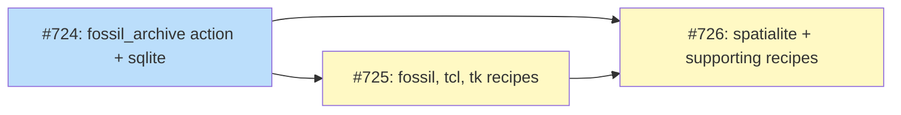

# Fossil Archive Action

## Status

Planned

## Implementation Issues

### Milestone: [Fossil Archive Action](https://github.com/tsukumogami/tsuku/milestone/28)

| Issue | Title | Dependencies |
|-------|-------|--------------|
| [#724](https://github.com/tsukumogami/tsuku/issues/724) | feat(actions): add fossil_archive action with sqlite-source recipe | None |
| [#725](https://github.com/tsukumogami/tsuku/issues/725) | feat(recipes): add fossil-source, tcl-source, tk-source testdata recipes | [#724](https://github.com/tsukumogami/tsuku/issues/724) |
| [#726](https://github.com/tsukumogami/tsuku/issues/726) | feat(recipes): add spatialite and supporting testdata recipes | [#724](https://github.com/tsukumogami/tsuku/issues/724), [#725](https://github.com/tsukumogami/tsuku/issues/725) |

### Dependency Graph



**Legend**: Green = done, Blue = ready, Yellow = blocked, Purple = needs-design

## Context and Problem Statement

Tsuku's [Build Essentials](BUILD-ESSENTIALS.md) infrastructure enables building tools from source when pre-built binaries aren't available. This design extends that capability to support [Fossil SCM](https://fossil-scm.org/), a distributed version control system used by several important open-source projects.

### Recipe Philosophy

Tsuku production recipes follow a preference hierarchy:

1. **Homebrew bottles** - Pre-built binaries, fastest installation
2. **Ecosystem actions** (`github_archive`) - Pre-built releases from upstream
3. **Build-from-source** - Last resort when no binary exists

Build-from-source capability exists to ensure **complete coverage** - any tool can be installed, even without pre-built binaries. The `fossil_archive` action adds this capability for Fossil-hosted projects.

### Testdata vs Production Recipes

Most Fossil-hosted projects have Homebrew bottles or GitHub releases available. Their `fossil_archive` recipes serve as **capability showcases and integration tests** in `testdata/recipes/`, not production recipes:

| Project | Production Recipe | Testdata Recipe | Purpose |
|---------|-------------------|-----------------|---------|
| SQLite | `recipes/s/sqlite.toml` (Homebrew) | `testdata/recipes/sqlite-source.toml` | Showcase fossil_archive |
| Fossil | TBD (check Homebrew) | `testdata/recipes/fossil-source.toml` | Self-hosting demo |
| Tcl | TBD (check Homebrew) | `testdata/recipes/tcl-source.toml` | version_separator demo |
| Tk | TBD (check Homebrew) | `testdata/recipes/tk-source.toml` | Dependency chain demo |
| SpatiaLite | TBD | `testdata/recipes/spatialite-source.toml` | Full ecosystem exercise |

**Exception:** If a tool is ONLY available via Fossil (no Homebrew/GitHub), then `fossil_archive` becomes the production recipe.

### Supporting Recipes

To fully exercise the build ecosystem, SpatiaLite's dependencies will also be added as testdata recipes:

| Library | Source | Build System | Testdata Recipe |
|---------|--------|--------------|-----------------|
| GEOS | github.com/libgeos/geos | CMake | `testdata/recipes/geos-source.toml` |
| PROJ | github.com/OSGeo/PROJ | CMake | `testdata/recipes/proj-source.toml` |
| libxml2 | gitlab.gnome.org/GNOME/libxml2 | autoconf | `testdata/recipes/libxml2-source.toml` |

This provides coverage for:
- CMake-based builds (`cmake_build` action)
- GitLab-hosted projects (tests `download` action)
- Complex dependency chains (SpatiaLite → GEOS, PROJ, libxml2 → SQLite)

### Scope

**In scope:**
- `FossilTimelineProvider` for version resolution in `internal/version/`
- `fossil_archive` action for download/extract in `internal/actions/`
- Automatic tarball URL construction
- Configuration for tag format and project name
- Testdata recipes showcasing the capability

**Out of scope:**
- Fossil-specific build steps (use existing `configure_make`, etc.)
- JSON API support (not enabled on most public Fossil servers)
- Production recipes (unless Fossil is the only source)

## Decision Drivers

- **Consistency**: Follow the `github_archive` pattern
- **Minimal configuration**: Infer as much as possible from repo URL
- **Expand coverage**: Support Fossil-hosted projects

## Background

### Fossil SCM Capabilities

All Fossil repositories provide:

1. **Release timeline**: `{repo}/timeline?t=release&n=all&y=ci` - lists all releases
2. **Source tarballs**: `{repo}/tarball/{tag}/{project}.tar.gz` - any tagged version

### Comparison with github_archive

| Aspect | github_archive | fossil_archive |
|--------|----------------|----------------|
| Repo format | `owner/repo` | Full URL |
| Version source | GitHub Releases API | Fossil timeline |
| Download URL | GitHub release assets | `{repo}/tarball/{tag}/...` |
| Asset naming | Configurable pattern | Predictable pattern |

## Solution

### Action Definition

```toml
[[steps]]
action = "fossil_archive"
repo = "https://sqlite.org/src"
project_name = "sqlite"
binaries = ["sqlite3"]
```

### Configuration Options

| Field | Required | Default | Description |
|-------|----------|---------|-------------|
| `repo` | Yes | - | Fossil repository URL (HTTPS required) |
| `binaries` | Yes | - | Binaries to install |
| `project_name` | Yes | - | Name used in tarball filename |
| `tag_prefix` | No | `"version-"` | Prefix before version in tags |
| `version_separator` | No | `"."` | Separator in version numbers (`.` or `-`) |
| `timeline_tag` | No | `"release"` | Tag used to filter releases in timeline |
| `strip_dirs` | No | `1` | Directories to strip from archive |

**Why `project_name` is required:** URL path segments don't reliably indicate project names. For example, `https://sqlite.org/src` has path segment `src`, not `sqlite`. Similarly, `https://fossil-scm.org/home` has `home`, not `fossil`.

### URL Construction

Given configuration:
```toml
repo = "https://sqlite.org/src"
project_name = "sqlite"
tag_prefix = "version-"
```

1. **Timeline URL**: `https://sqlite.org/src/timeline?t=release&n=all&y=ci`
2. **Tag format**: `version-{version}` (e.g., `version-3.46.0`)
3. **Tarball URL**: `https://sqlite.org/src/tarball/version-3.46.0/sqlite.tar.gz`

### Version Mapping

The user-specified version combines with `tag_prefix` and `version_separator`:

| User Request | tag_prefix | version_separator | Fossil Tag |
|--------------|------------|-------------------|------------|
| `sqlite@3.46.0` | `version-` | `.` (default) | `version-3.46.0` |
| `tcl@9.0.0` | `core-` | `-` | `core-9-0-0` |

### Example Recipes

**SQLite:**
```toml
[metadata]
name = "sqlite"
description = "SQLite database engine"
homepage = "https://sqlite.org/"

[[steps]]
action = "fossil_archive"
repo = "https://sqlite.org/src"
project_name = "sqlite"
binaries = ["sqlite3"]

[[steps]]
action = "configure_make"
source_dir = "sqlite"
executables = ["sqlite3"]

[verify]
command = "sqlite3 --version"
pattern = "{version}"
```

**Fossil itself:**
```toml
[metadata]
name = "fossil"
description = "Distributed version control system"
homepage = "https://fossil-scm.org/"

[[steps]]
action = "fossil_archive"
repo = "https://fossil-scm.org/home"
project_name = "fossil"
binaries = ["fossil"]

[[steps]]
action = "configure_make"
source_dir = "fossil"
executables = ["fossil"]

[verify]
command = "fossil version"
pattern = "{version}"
```

**Tcl (different tag format):**
```toml
[metadata]
name = "tcl"
description = "Tool Command Language"
homepage = "https://www.tcl.tk/"

[[steps]]
action = "fossil_archive"
repo = "https://core.tcl-lang.org/tcl"
project_name = "tcl"
tag_prefix = "core-"
version_separator = "-"
binaries = ["tclsh"]

[[steps]]
action = "configure_make"
source_dir = "tcl/unix"
executables = ["tclsh"]

[verify]
command = "tclsh --version"
pattern = "{version}"
```

The `version_separator = "-"` converts version `9.0.0` to tag `core-9-0-0`.

**Tk (depends on Tcl):**
```toml
[metadata]
name = "tk"
description = "Graphical toolkit for Tcl"
homepage = "https://www.tcl.tk/"
dependencies = ["tcl"]

[[steps]]
action = "fossil_archive"
repo = "https://core.tcl-lang.org/tk"
project_name = "tk"
tag_prefix = "core-"
version_separator = "-"
binaries = ["wish"]

[[steps]]
action = "configure_make"
source_dir = "tk/unix"
executables = ["wish"]

[verify]
command = "wish --version"
pattern = "{version}"
```

**SpatiaLite (full dependency chain):**
```toml
[metadata]
name = "spatialite"
description = "Spatial extensions for SQLite"
homepage = "https://www.gaia-gis.it/fossil/libspatialite"
dependencies = ["sqlite-source", "geos", "proj", "libxml2"]

[[steps]]
action = "fossil_archive"
repo = "https://www.gaia-gis.it/fossil/libspatialite"
project_name = "libspatialite"
timeline_tag = "version"  # SpatiaLite uses different tag convention
binaries = ["spatialite"]

[[steps]]
action = "configure_make"
source_dir = "libspatialite"
executables = ["spatialite"]

[verify]
command = "spatialite --version"
pattern = "{version}"
```

Note: The `timeline_tag` option is used here because SpatiaLite may use a different tagging convention than the default "release" tag.

## Implementation Approach

### Phase 1: Version Provider

| Task | Description |
|------|-------------|
| Create `fossil_provider.go` | New provider in `internal/version/` |
| Timeline parsing | Fetch and parse HTML timeline |
| Version extraction | Extract versions from tags using `tag_prefix` and `version_separator` |
| Caching | Wrap with `CachedVersionLister` for timeline caching |

### Phase 2: Action

| Task | Description |
|------|-------------|
| Create `fossil_archive.go` | New action in `internal/actions/` |
| URL construction | Build tarball URL from config |
| Download + extract | Reuse `decomposeDownload()` and existing extract logic |
| Implement `Decomposable` | Enable deterministic installation plans |

### Phase 3: Integration

| Task | Description |
|------|-------------|
| Register provider | Add `FossilSourceStrategy` to provider factory |
| Register action | Add to action registry |
| Unit tests | Test timeline parsing, URL construction, version mapping |
| Integration tests | Test with real Fossil repos (SQLite, Fossil, Tcl) |

### Phase 4: Testdata Recipes

Create testdata recipes to showcase `fossil_archive` capability and exercise the full build ecosystem:

**Fossil-hosted projects (testdata):**

| Recipe | Location | Purpose |
|--------|----------|---------|
| `sqlite-source` | `testdata/recipes/` | Primary showcase for fossil_archive |
| `fossil-source` | `testdata/recipes/` | Self-hosting demo |
| `tcl-source` | `testdata/recipes/` | Demonstrates version_separator |
| `tk-source` | `testdata/recipes/` | Demonstrates dependency chain |
| `spatialite-source` | `testdata/recipes/` | Full ecosystem exercise |

**Supporting recipes (testdata):**

| Recipe | Location | Purpose |
|--------|----------|---------|
| `geos-source` | `testdata/recipes/` | CMake build demo |
| `proj-source` | `testdata/recipes/` | CMake + SQLite dependency |
| `libxml2-source` | `testdata/recipes/` | GitLab + autoconf demo |

| Task | Description |
|------|-------------|
| SQLite recipe | Update `testdata/recipes/sqlite-source.toml` to use `fossil_archive` |
| Fossil recipe | New `testdata/recipes/fossil-source.toml` |
| Tcl recipe | New `testdata/recipes/tcl-source.toml` with `version_separator = "-"` |
| Tk recipe | New `testdata/recipes/tk-source.toml` with Tcl dependency |
| GEOS recipe | New `testdata/recipes/geos-source.toml` using `github_archive` + `cmake_build` |
| PROJ recipe | New `testdata/recipes/proj-source.toml` using `github_archive` + `cmake_build` |
| libxml2 recipe | New `testdata/recipes/libxml2-source.toml` using `download` + `configure_make` |
| SpatiaLite recipe | New `testdata/recipes/spatialite-source.toml` with full dep chain |
| Documentation | Update BUILD-ESSENTIALS.md to reference fossil_archive |

### Files to Create/Modify

| File | Changes |
|------|---------|
| `internal/version/fossil_provider.go` | New: Timeline parsing, version resolution |
| `internal/version/provider_factory.go` | Add `FossilSourceStrategy` |
| `internal/actions/fossil_archive.go` | New: Action implementation |
| `internal/actions/action.go` | Register action |
| `testdata/recipes/sqlite-source.toml` | Update to use `fossil_archive` |
| `testdata/recipes/fossil-source.toml` | New: Fossil SCM testdata recipe |
| `testdata/recipes/tcl-source.toml` | New: Tcl testdata recipe |
| `testdata/recipes/tk-source.toml` | New: Tk testdata recipe |
| `testdata/recipes/geos-source.toml` | New: GEOS testdata recipe (CMake) |
| `testdata/recipes/proj-source.toml` | New: PROJ testdata recipe (CMake) |
| `testdata/recipes/libxml2-source.toml` | New: libxml2 testdata recipe (autoconf) |
| `testdata/recipes/spatialite-source.toml` | New: SpatiaLite testdata recipe |
| `docs/BUILD-ESSENTIALS.md` | Add fossil_archive to build essentials reference |

## Consequences

### Positive

- **Concise recipes**: Single action handles version + download
- **Consistent pattern**: Mirrors `github_archive` approach
- **Expanded coverage**: Fossil projects now supported

### Negative

- **New action to maintain**: Additional code surface
- **HTML parsing**: Depends on Fossil timeline structure

### Mitigations

- Timeline format has been stable for years
- Action is self-contained, minimal maintenance

## Security Considerations

### Trust Model

Fossil does not provide cryptographic signatures for releases. The security model is **Trust On First Use (TOFU)**:

| Layer | Protection | When Applied |
|-------|------------|--------------|
| Transport | TLS 1.2+ with system CA validation | Every request |
| Server | First-party servers only (sqlite.org, fossil-scm.org) | URL validation |
| Content | SHA256 checksum computed at download | First install |
| Pinning | Layer 3 checksum pinning | Subsequent installs |

**What this means:**
- No pre-download verification is possible (unlike GPG-signed releases)
- First install trusts server integrity
- Subsequent installs detect tampering via pinned checksums
- Post-install `[verify]` catches some classes of corruption

### Download Verification

**Challenge**: Fossil tarballs are generated on-demand with no published checksums.

**Mitigations:**
- HTTPS required (HTTP URLs rejected)
- TLS certificate validation with fail-closed on errors
- Same-origin redirect policy (no cross-domain redirects)
- Post-install verification via `[verify]`
- Layer 3 checksum pinning after first install

### Execution Isolation

**Not applicable** - action only fetches HTML and tarballs.

### Supply Chain Risks

| Risk | Likelihood | Impact | Mitigation |
|------|------------|--------|------------|
| Compromised server | Low | High | HTTPS, first-party only, TOFU pinning |
| Timeline injection | Very Low | Medium | Strict regex parsing, format validation |
| Redirect attack | Very Low | Medium | Same-origin redirect policy |

### Tarball Extraction

Standard archive protections apply:
- Path traversal prevention (no `../` escapes)
- Symlink restrictions (no links outside archive root)
- No device nodes or special files

### User Data Exposure

**Not applicable** - only fetches public pages.
