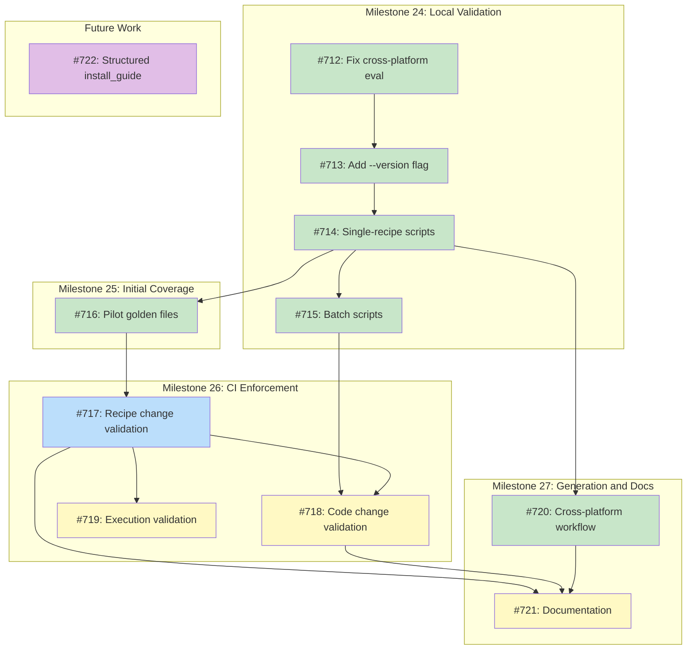

# DESIGN: Golden Plan Testing

## Status

Current (M24 and M25 complete)

## Implementation Issues

### Milestone: [Golden Plan Validation (Local)](https://github.com/tsukumogami/tsuku/milestone/24)

| Issue | Title | Dependencies |
|-------|-------|--------------|
| [#712](https://github.com/tsukumogami/tsuku/issues/712) | fix(eval): support cross-platform plan generation | None |
| [#713](https://github.com/tsukumogami/tsuku/issues/713) | feat(eval): add --version flag for recipe mode | [#712](https://github.com/tsukumogami/tsuku/issues/712) |
| [#714](https://github.com/tsukumogami/tsuku/issues/714) | feat(scripts): add golden file regeneration and validation scripts | [#713](https://github.com/tsukumogami/tsuku/issues/713) |
| [#715](https://github.com/tsukumogami/tsuku/issues/715) | feat(scripts): add batch golden file validation and regeneration | [#714](https://github.com/tsukumogami/tsuku/issues/714) |

### Milestone: [Initial Golden File Coverage](https://github.com/tsukumogami/tsuku/milestone/25)

| Issue | Title | Dependencies |
|-------|-------|--------------|
| [#716](https://github.com/tsukumogami/tsuku/issues/716) | chore(golden): generate pilot golden files for representative recipes | [#714](https://github.com/tsukumogami/tsuku/issues/714) |

### Milestone: [Golden Plan CI Enforcement](https://github.com/tsukumogami/tsuku/milestone/26)

| Issue | Title | Dependencies |
|-------|-------|--------------|
| [#717](https://github.com/tsukumogami/tsuku/issues/717) | ci(golden): add workflow to validate golden files on recipe changes | [#716](https://github.com/tsukumogami/tsuku/issues/716) |
| [#718](https://github.com/tsukumogami/tsuku/issues/718) | ci(golden): add workflow to validate golden files on code changes | [#715](https://github.com/tsukumogami/tsuku/issues/715), [#717](https://github.com/tsukumogami/tsuku/issues/717) |
| [#719](https://github.com/tsukumogami/tsuku/issues/719) | ci(golden): add execution validation for changed golden files | [#717](https://github.com/tsukumogami/tsuku/issues/717) |

### Milestone: [Cross-Platform Generation and Documentation](https://github.com/tsukumogami/tsuku/milestone/27)

| Issue | Title | Dependencies |
|-------|-------|--------------|
| [#720](https://github.com/tsukumogami/tsuku/issues/720) | ci(golden): add cross-platform generation workflow | [#714](https://github.com/tsukumogami/tsuku/issues/714) |
| [#721](https://github.com/tsukumogami/tsuku/issues/721) | docs: add golden file workflow to CONTRIBUTING.md | [#717](https://github.com/tsukumogami/tsuku/issues/717), [#718](https://github.com/tsukumogami/tsuku/issues/718), [#720](https://github.com/tsukumogami/tsuku/issues/720) |

### Needs Design (Future Work)

| Issue | Title | Dependencies |
|-------|-------|--------------|
| [#722](https://github.com/tsukumogami/tsuku/issues/722) | docs(design): create design for structured install_guide | None |

### Dependency Graph



**Legend**: Green = done, Blue = ready, Yellow = blocked, Purple = needs-design

## Context and Problem Statement

Tsuku's test suite relies heavily on integration tests that execute full installation workflows. These tests download files from external services (GitHub releases, npm registry, PyPI, crates.io, RubyGems, Homebrew bottles), perform actual installations, and verify the results. While comprehensive, this approach has significant drawbacks:

1. **Non-determinism**: Every test run makes network calls to resolve versions and download artifacts. External service availability, rate limiting, and content changes cause unpredictable failures.

2. **Slow execution**: Builder tests (cargo, pypi, npm, gem) take 30+ minutes each and are relegated to nightly schedules rather than PR validation. The main test suite takes 15+ minutes per matrix combination.

3. **Limited platform coverage**: Only 4 tools are tested on macOS versus 10 on Linux. arm64 Linux has no coverage due to Homebrew limitations.

4. **No recipe regression safety net**: Recipe changes can silently alter plan generation in unexpected ways. There is no mechanism to preview what a recipe change will produce across all supported platforms.

The `tsuku eval` command now supports generating deterministic installation plans from local recipe files (`--recipe`) with cross-platform targeting (`--os`, `--arch`). This creates an opportunity for a comprehensive golden plan testing system that validates **every recipe** across **all supported platforms** on **every PR**.

### Vision

Every recipe in the tsuku registry should have golden plans generated for all its supported platforms. These golden plans serve as:

1. **Regression detection** - Any code change that affects plan generation is immediately visible
2. **Recipe validation** - Recipe authors see exactly what their recipe produces before merging
3. **Execution gatekeeping** - Changed golden files must pass installation tests before merge

### Scope

**In scope:**
- Generating golden plans for every recipe at pinned versions
- Cross-platform plan generation (all 4 platform combinations per recipe)
- CI workflow to detect recipe changes and require golden file updates
- Execution validation when golden files change

**Out of scope:**
- Replacing execution tests entirely (some execution testing remains valuable)
- Version resolution testing (inherently dynamic)
- Testing "latest" version plans (non-deterministic)

## Decision Drivers

1. **Comprehensive coverage**: Every recipe should be validated, not just a representative sample.

2. **Change visibility**: Recipe and code changes should produce visible diffs in golden files, enabling meaningful code review.

3. **Execution validation**: Changed golden plans should be proven executable before merge.

4. **Determinism**: Golden file generation must be reproducible across environments.

5. **Maintainability**: The system should be self-maintaining - recipe changes naturally flow to golden file updates.

## Considered Options

### Option 1: Selective Golden Files (3-5 Reference Recipes)

Store golden plans only for a small set of representative recipes.

**Pros:**
- Low maintenance burden
- Small fixture footprint

**Cons:**
- Most recipes have no regression protection
- Recipe authors don't see plan output before merge
- Silent regressions possible for untested recipes

### Option 2: Comprehensive Golden Files (All Recipes)

Generate and store golden plans for every recipe across all supported platforms.

**Pros:**
- Complete regression coverage
- Recipe authors see exactly what changes
- Visible diffs for code review
- Catches edge cases in non-representative recipes

**Cons:**
- Large file count (~600 golden files for 155 recipes × 4 platforms)
- Requires automated regeneration workflow
- Storage overhead (~50-100 MB)

### Option 3: Hash-Only Validation

Store only checksums of expected plans, not full plan content.

**Pros:**
- Minimal storage
- Fast comparison

**Cons:**
- No visibility into what changed
- Debugging regressions requires regeneration
- Cannot review plan changes in PRs

## Decision Outcome

**Chosen: Option 2 - Comprehensive Golden Files**

The comprehensive approach provides the safety net needed for a growing recipe registry. While the file count is significant, the benefits outweigh the costs:

- Recipe authors see complete plan output in PR diffs
- Silent regressions are eliminated
- Code review becomes meaningful for recipe changes
- The pattern mirrors `test-changed-recipes.yml` which is already proven

### Trade-offs Accepted

- ~600 golden files to maintain in version control
- Storage overhead of ~50-100 MB
- Initial generation effort for all existing recipes

## Solution Architecture

### Overview

The golden plan system consists of four components:

1. **Golden file storage** in `testdata/golden/plans/` organized by recipe
2. **Plan generation tooling** using `tsuku eval --recipe`
3. **CI workflow** to enforce golden file updates on recipe changes
4. **Execution validation** for changed golden files

### Directory Structure

Golden files are organized with first-letter subdirectories, mirroring the recipe registry structure for scalability:

```
testdata/
├── golden/
│   └── plans/                          # Golden plan files
│       ├── b/
│       │   └── btop/                   # Linux-only recipe
│       │       ├── v1.3.0-linux-amd64.json
│       │       └── v1.3.0-linux-arm64.json
│       ├── f/
│       │   └── fzf/
│       │       ├── v0.46.0-linux-amd64.json
│       │       ├── v0.46.0-linux-arm64.json
│       │       ├── v0.46.0-darwin-amd64.json
│       │       └── v0.46.0-darwin-arm64.json
│       ├── t/
│       │   └── terraform/
│       │       └── ...
│       └── ...
├── recipes/                            # Test recipe copies (version-pinned)
│   └── ...
└── states/                             # Existing state fixtures
```

This structure enables scaling to tens of thousands of recipes without creating directories with thousands of entries.

### Naming Convention

Golden files follow the pattern: `{first-letter}/{recipe}/{version}-{os}-{arch}.json`

- `{first-letter}` - First letter of recipe name (matches `internal/recipe/recipes/{letter}/`)
- `{recipe}` - Recipe name matching the TOML filename (kebab-case)
- `{version}` - Pinned version with `v` prefix (e.g., `v0.46.0`)
- `{os}` - Target OS (`linux` or `darwin`)
- `{arch}` - Target architecture (`amd64` or `arm64`)

### Platform Filtering

Not all recipes support all platforms. Golden files are generated only for supported platforms:

| Recipe Type | Platforms | Example |
|-------------|-----------|---------|
| Cross-platform | All 4 | fzf, terraform, ripgrep |
| Linux-only | linux-amd64, linux-arm64 | btop, nix-portable |
| Darwin-only | darwin-amd64, darwin-arm64 | (rare) |
| System requirement | None | docker, cuda |

Recipes using `require_system` action cannot have plans generated and are excluded.

### Checksum Handling

Plan generation requires downloading files to compute SHA256 checksums. For golden file generation:

**Option A: Real downloads with caching**
- Generate plans with real network access
- Cache downloads to avoid re-downloading on regeneration
- Checksums reflect actual file content

**Option B: Deterministic mock downloader**
- Generate checksums from URL hashing
- No network access required
- Checksums are deterministic but don't reflect actual content

**Chosen: Option A for CI, Option B for unit tests.**

- CI golden file generation uses real downloads (validates actual checksums)
- Unit tests use mock downloader (fast, deterministic, offline)
- Both approaches produce consistent plans given the same version

### Version Pinning and Versionless Recipes

Recipes are **versionless by design** - a single recipe should correctly generate installation plans for any version of the tool. However, the *plans themselves* are version-specific: they contain resolved download URLs, computed checksums, and version-dependent extraction paths.

Golden files test this versionlessness by maintaining plans for multiple versions of the same recipe:

```
testdata/golden/plans/f/fzf/
├── v0.44.0-linux-amd64.json    # Older version
├── v0.44.0-linux-arm64.json
├── v0.45.0-linux-amd64.json    # Previous version
├── v0.45.0-linux-arm64.json
├── v0.46.0-linux-amd64.json    # Current version
├── v0.46.0-linux-arm64.json
├── v0.46.0-darwin-amd64.json
└── v0.46.0-darwin-arm64.json
```

**Why multi-version golden files matter:**

1. **Proves versionlessness**: A recipe change that breaks plan generation for v0.44.0 but works for v0.46.0 is a regression. Multi-version golden files catch this.

2. **Version-specific plan differences are expected**: Different versions have different checksums, sometimes different URL patterns, or different archive structures. Each version's plan is independently valid.

3. **Pinning provides determinism**: Plans for a specific version never change unless the recipe logic changes. This isolates recipe regressions from upstream version churn.

**When to add versions:**

- When a version introduces a URL pattern change (e.g., GitHub release naming convention changed at v2.0)
- When testing a recipe fix that affected specific versions
- When validating that a new version works before users encounter it

**Version lifecycle:**

The regeneration script preserves all existing versions in the directory. When a recipe changes, all versions are regenerated to verify the recipe still works for each. Old versions can be pruned manually when no longer valuable for testing.

### Cross-Platform Generation Limitations

Plan generation for a target platform different from the current runtime works correctly for download-based recipes. However, some actions have inherent limitations:

**Download Actions (Full Support):**

| Action | Notes |
|--------|-------|
| `download`, `download_archive`, `download_file` | Downloads target platform binary, computes checksum |
| `github_archive`, `github_release` | Resolves platform-specific asset URLs |
| `homebrew` | Queries GHCR for target platform bottle |

**Build Actions (Require Native Toolchain):**

| Action | Cross-Platform Support | Notes |
|--------|----------------------|-------|
| `cargo_build` | None | Requires Rust toolchain on build machine |
| `go_build` | None | Requires Go toolchain on build machine |
| `cmake_build` | None | Requires CMake + compiler on build machine |
| `configure_make` | None | Requires autotools + compiler on build machine |
| `meson_build` | None | Requires Meson + Ninja on build machine |

**Ecosystem Install Actions (Partial Support):**

| Action | Cross-Platform Support | Notes |
|--------|----------------------|-------|
| `npm_install` | Partial | Lockfile is platform-agnostic, but npm version affects output |
| `cargo_install` | Partial | Cargo.lock is platform-agnostic |
| `gem_install` | Partial | Gemfile.lock is platform-agnostic |
| `go_install` | Partial | go.sum is platform-agnostic |
| `pipx_install`, `pip_install` | Limited | `pip download` fetches platform-specific wheels |
| `cpan_install` | Limited | Perl module builds are platform-specific |

**Nix Actions (Limited Support):**

| Action | Cross-Platform Support | Notes |
|--------|----------------------|-------|
| `nix_install` | Limited | Nix derivations may be platform-specific |
| `nix_portable` | Limited | Downloads platform-specific nix-portable binary |
| `nix_realize` | Limited | Realizes derivations for current platform |

**System Actions (No Plans Generated):**

| Action | Notes |
|--------|-------|
| `require_system` | Skipped - requires system package, no plan generated |
| `system_packages` | Skipped - requires system package manager |

**Post-Processing Actions (Platform-Agnostic):**

| Action | Notes |
|--------|-------|
| `extract`, `chmod`, `install_binaries` | Operates on already-downloaded files |
| `set_env`, `set_rpath`, `link_dependencies` | Configures installed files |
| `text_replace`, `apply_patch` | Modifies file contents |

**Implication for golden files**: Recipes using build actions or Nix should have their golden files generated on a consistent platform. The CI workflow uses `ubuntu-latest` for all plan generation, which provides this consistency.

For ecosystem install recipes, golden files represent the plan as generated from Linux. Execution validation on other platforms will re-resolve dependencies appropriately at install time.

### Trust Boundaries

The golden plan system relies on the following trust assumptions:

| Trusted | What It Means |
|---------|--------------|
| CI infrastructure | GitHub Actions runners are uncompromised |
| TLS/PKI | HTTPS connections to upstream registries are secure |
| Upstream registries | GitHub, npm, PyPI, crates.io serve authentic content |
| Reviewers | Humans reviewing PRs detect malicious changes |

| Verified (Not Trusted) |  |
|------------------------|--|
| Checksums | SHA256 computed during download and stored in plans |
| Plan structure | Validated against format version and invariants |
| Platform support | Recipes generate plans only for supported platforms |

**Important**: Initial golden file generation MUST occur in CI, not on developer machines. A compromised developer workstation could inject malicious checksums.

### Residual Risks

1. **Network-enabled sandbox tests**: When `RequiresNetwork=true`, sandbox containers have full network access (`--network=host`). This is necessary for ecosystem builds (cargo, npm, pip) but means a compromised dependency could exfiltrate data. Future improvement: egress filtering to known registries only.

2. **No upstream signature verification**: Tsuku relies on HTTPS + SHA256 checksums without verifying GPG/Sigstore signatures. This is acceptable for the current threat model but could be enhanced for high-security deployments.

3. **Version bump trust window**: When versions are bumped, new checksums are computed from upstream. Reviewers must verify version bumps are legitimate.

### CI Workflow: Recipe Changes

The workflow mirrors `test-changed-recipes.yml`:

```yaml
name: Validate Golden Plans

on:
  pull_request:
    paths:
      - 'internal/recipe/recipes/**/*.toml'
      - 'testdata/golden/plans/**/*.json'

jobs:
  detect-changes:
    runs-on: ubuntu-latest
    outputs:
      recipes: ${{ steps.changed.outputs.recipes }}
      golden-changed: ${{ steps.changed.outputs.golden }}
    steps:
      - uses: actions/checkout@v4
        with:
          fetch-depth: 0

      - id: changed
        run: |
          # Detect changed recipes
          RECIPES=$(git diff --name-only origin/main...HEAD -- 'internal/recipe/recipes/**/*.toml' | \
            xargs -I {} basename {} .toml | sort -u | jq -R -s -c 'split("\n")[:-1]')
          echo "recipes=$RECIPES" >> $GITHUB_OUTPUT

          # Detect changed golden files
          GOLDEN=$(git diff --name-only origin/main...HEAD -- 'testdata/golden/plans/**/*.json' | wc -l)
          echo "golden=$GOLDEN" >> $GITHUB_OUTPUT

  regenerate-golden:
    needs: detect-changes
    if: needs.detect-changes.outputs.recipes != '[]'
    runs-on: ubuntu-latest
    steps:
      - uses: actions/checkout@v4

      - uses: actions/setup-go@v5
        with:
          go-version-file: 'go.mod'

      - name: Cache downloads
        uses: actions/cache@v4
        with:
          path: ~/.tsuku/cache/downloads
          key: golden-downloads-${{ hashFiles('testdata/golden/plans/**/*.json') }}
          restore-keys: |
            golden-downloads-

      - name: Build tsuku
        run: go build -o tsuku ./cmd/tsuku

      - name: Validate golden files for changed recipes
        run: |
          FAILED=()
          for recipe in $(echo '${{ needs.detect-changes.outputs.recipes }}' | jq -r '.[]'); do
            if ! ./scripts/validate-golden.sh "$recipe"; then
              FAILED+=("$recipe")
            fi
          done
          if [[ ${#FAILED[@]} -gt 0 ]]; then
            echo "::error::Golden files are out of date for: ${FAILED[*]}"
            echo "Run './scripts/regenerate-golden.sh <recipe>' for each and commit the changes."
            exit 1
          fi

  validate-execution:
    needs: detect-changes
    if: needs.detect-changes.outputs.golden > 0
    runs-on: ${{ matrix.os }}
    strategy:
      matrix:
        include:
          - os: ubuntu-latest
            platform: linux-amd64
          - os: macos-latest
            platform: darwin-arm64
          - os: macos-13
            platform: darwin-amd64
    steps:
      - uses: actions/checkout@v4
        with:
          fetch-depth: 0

      - uses: actions/setup-go@v5
        with:
          go-version-file: 'go.mod'

      - name: Build tsuku
        run: go build -o tsuku ./cmd/tsuku

      - name: Install changed golden plans
        run: |
          # Find golden files changed in this PR that match current platform
          PLATFORM="${{ matrix.platform }}"
          git diff --name-only origin/main...HEAD -- 'testdata/golden/plans/**/*.json' | \
            grep "$PLATFORM" | while read plan; do
              echo "Testing: $plan"
              ./tsuku install --plan "$plan" --sandbox
            done
```

**Local development equivalent:**

Before pushing changes, run the same validation locally:

```bash
# If you changed a recipe (e.g., fzf.toml)
./scripts/validate-golden.sh fzf

# If validation fails, regenerate and review the diff
./scripts/regenerate-golden.sh fzf
git diff testdata/golden/plans/f/fzf/

# If you changed tsuku code (executor, actions, etc.)
./scripts/validate-all-golden.sh

# If validation fails, investigate the diff output, then regenerate selectively:
./scripts/regenerate-golden.sh fzf                         # Full recipe
./scripts/regenerate-golden.sh ripgrep --os linux          # Linux platforms only
./scripts/regenerate-golden.sh terraform --version v1.7.0  # Specific version only
git diff --stat testdata/golden/plans/

# Test execution locally (current platform only)
./tsuku install --plan testdata/golden/plans/f/fzf/v0.46.0-linux-amd64.json --sandbox
```

### Execution Validation: Keeping Plans Fresh

This section describes how the golden plan system ensures plans remain valid, executable, and synchronized with both tsuku code and recipe definitions.

#### The Three Synchronization Challenges

Golden plans must stay synchronized with three moving targets:

| Target | What Changes | Detection | Resolution |
|--------|--------------|-----------|------------|
| **Recipes** | Download URLs, extraction steps, platform support | `git diff` on `recipes/**/*.toml` | Regenerate affected recipe's golden files |
| **Tsuku code** | Plan generation logic, action semantics, format version | `git diff` on `internal/**`, `cmd/**` | Regenerate ALL golden files |
| **Upstream artifacts** | New versions released, checksums change | Manual or automated version bump | Generate new version's golden files |

#### Validation Lifecycle

```
┌─────────────────────────────────────────────────────────────────────────────┐
│                           PR SUBMITTED                                       │
└─────────────────────────────────────────────────────────────────────────────┘
                                    │
                                    ▼
                    ┌───────────────────────────────┐
                    │   Detect Changed Files         │
                    │   - recipes/**/*.toml          │
                    │   - internal/**, cmd/**        │
                    │   - testdata/golden/**         │
                    └───────────────────────────────┘
                                    │
              ┌─────────────────────┼─────────────────────┐
              ▼                     ▼                     ▼
    ┌─────────────────┐   ┌─────────────────┐   ┌─────────────────┐
    │ Recipe Changed  │   │ Code Changed    │   │ Golden Changed  │
    └─────────────────┘   └─────────────────┘   └─────────────────┘
              │                     │                     │
              ▼                     ▼                     ▼
    ┌─────────────────┐   ┌─────────────────┐   ┌─────────────────┐
    │ Regenerate      │   │ Regenerate      │   │ Execution       │
    │ affected recipe │   │ ALL recipes     │   │ validation      │
    └─────────────────┘   └─────────────────┘   └─────────────────┘
              │                     │                     │
              ▼                     ▼                     ▼
    ┌─────────────────┐   ┌─────────────────┐   ┌─────────────────┐
    │ git diff        │   │ git diff        │   │ tsuku install   │
    │ --exit-code     │   │ --exit-code     │   │ --plan --sandbox│
    └─────────────────┘   └─────────────────┘   └─────────────────┘
              │                     │                     │
              └─────────────────────┼─────────────────────┘
                                    ▼
                         ┌─────────────────────┐
                         │  All checks pass?   │
                         └─────────────────────┘
                            │              │
                          Yes              No
                            ▼              ▼
                    ┌─────────────┐  ┌─────────────────┐
                    │ PR mergeable│  │ CI fails with   │
                    └─────────────┘  │ actionable error│
                                     └─────────────────┘
```

#### Trigger 1: Recipe Changes

When a recipe file changes, CI regenerates golden files for that recipe only:

**What happens:**
1. CI detects `recipes/f/fzf.toml` was modified
2. Runs `./scripts/regenerate-golden.sh fzf`
3. Script queries `tsuku info --recipe ... --metadata-only --json` for supported platforms
4. Generates plan for each platform: `tsuku eval --recipe ... --os linux --arch amd64 --version <ver>`
5. Compares generated files against committed golden files
6. Fails if any difference exists

**Developer workflow (run locally before pushing):**
```bash
# Edit recipe
vim internal/recipe/recipes/f/fzf.toml

# Validate to see what changed (shows diff on failure)
./scripts/validate-golden.sh fzf

# If validation fails, regenerate golden files
./scripts/regenerate-golden.sh fzf

# Review the changes
git diff testdata/golden/plans/f/fzf/

# Optional: test execution locally
./tsuku install --plan testdata/golden/plans/f/fzf/v0.46.0-linux-amd64.json --sandbox

# Commit both recipe and golden file changes
git add internal/recipe/recipes/f/fzf.toml testdata/golden/plans/f/fzf/
git commit -m "feat(recipe): update fzf download URL"
```

**CI error example:**
```
::error::Golden files are out of date for recipe 'fzf'.
Run './scripts/regenerate-golden.sh fzf' and commit the changes.

--- a/testdata/golden/plans/f/fzf/v0.46.0-linux-amd64.json
+++ b/testdata/golden/plans/f/fzf/v0.46.0-linux-amd64.json
@@ -12,7 +12,7 @@
   "steps": [
     {
       "action": "download",
-      "url": "https://github.com/junegunn/fzf/archive/v0.46.0.tar.gz",
+      "url": "https://github.com/junegunn/fzf/releases/download/v0.46.0/fzf-0.46.0-linux_amd64.tar.gz",
```

#### Trigger 2: Tsuku Code Changes

When plan generation logic changes, CI regenerates ALL golden files:

**What happens:**
1. CI detects changes in `internal/executor/**`, `internal/actions/**`, etc.
2. Runs `./scripts/regenerate-all-golden.sh` (iterates over all recipes)
3. Compares all generated files against committed golden files
4. Fails if any difference exists

**This catches:**
- Bug fixes that change plan output
- New fields added to plan JSON
- Changes to action ordering or dependencies
- Format version bumps

**Developer workflow (run locally before pushing):**
```bash
# Edit plan generation code
vim internal/executor/plan.go

# Run unit tests
go test ./internal/executor/...

# Validate ALL golden files (shows diffs on failure)
./scripts/validate-all-golden.sh

# If validation fails, investigate the diffs, then regenerate selectively:
./scripts/regenerate-golden.sh <recipe>                    # One recipe at a time
./scripts/regenerate-golden.sh <recipe> --os linux         # Filter by OS
./scripts/regenerate-golden.sh <recipe> --arch amd64       # Filter by arch

# Review scope of changes
git diff --stat testdata/golden/plans/

# Optional: spot-check execution for a few recipes
./tsuku install --plan testdata/golden/plans/f/fzf/v0.46.0-linux-amd64.json --sandbox
./tsuku install --plan testdata/golden/plans/r/ripgrep/v14.1.0-linux-amd64.json --sandbox

# If changes are intentional, commit everything
git add internal/executor/plan.go testdata/golden/plans/
git commit -m "fix(executor): correct step ordering for dependencies"
```

**CI error example:**
```
::error::Code changes affect golden plan output for 47 recipes.
Please regenerate golden files and commit the changes.

testdata/golden/plans/a/amplify/v6.3.1-linux-amd64.json    | 2 +-
testdata/golden/plans/a/amplify/v6.3.1-linux-arm64.json    | 2 +-
testdata/golden/plans/a/amplify/v6.3.1-darwin-amd64.json   | 2 +-
...
47 files changed, 94 insertions(+), 94 deletions(-)
```

#### Trigger 3: Golden File Changes (Execution Validation)

When golden files are modified (by either trigger above), CI validates they are executable:

**What happens:**
1. CI detects golden files changed in the PR
2. For each changed golden file matching the current runner's platform:
   - Runs `tsuku install --plan <golden-file> --sandbox`
   - Sandbox downloads the artifact and verifies checksum
   - Sandbox executes installation steps in isolated container
   - Verifies the tool is installed correctly
3. Fails if any installation fails

**Why this matters:**
- Catches checksum mismatches (upstream artifact changed)
- Catches invalid plans (malformed JSON, missing steps)
- Catches execution failures (broken extraction, missing permissions)
- Validates the plan actually works, not just that it parses

**Platform matrix:**
```yaml
strategy:
  matrix:
    include:
      - os: ubuntu-latest
        platform: linux-amd64
      - os: macos-latest
        platform: darwin-arm64
      - os: macos-13
        platform: darwin-amd64
```

Each runner validates golden files for its platform:
- `ubuntu-latest` validates `*-linux-amd64.json` files
- `macos-latest` validates `*-darwin-arm64.json` files (Apple Silicon)
- `macos-13` validates `*-darwin-amd64.json` files (Intel Mac)

**Known limitation**: `linux-arm64` golden files are generated but not execution-validated (no arm64 Linux runners in standard GitHub Actions). Plan generation logic is shared across architectures, so this is acceptable risk.

**Execution validation output:**
```
Testing: testdata/golden/plans/f/fzf/v0.46.0-linux-amd64.json
Running sandbox test for fzf...
  Container image: ubuntu:22.04
  Network access: disabled (binary installation)
  Resource limits: 2G memory, 2.0 CPUs, 2m0s timeout

Sandbox test PASSED

Testing: testdata/golden/plans/r/ripgrep/v14.1.0-linux-amd64.json
Running sandbox test for ripgrep...
...
```

**Execution failure example:**
```
Testing: testdata/golden/plans/f/fzf/v0.46.0-linux-amd64.json
Running sandbox test for fzf...

Sandbox test FAILED
Exit code: 1

Error output:
  download: checksum mismatch
    expected: sha256:abc123...
    actual:   sha256:def456...

::error::Golden file execution failed. The upstream artifact may have changed.
Investigate the checksum mismatch and update the golden file if legitimate.
```

**Developer workflow (run locally before pushing):**
```bash
# After regenerating golden files, test execution locally
# You can only test plans matching your current platform

# On Linux (amd64):
for plan in testdata/golden/plans/f/fzf/*-linux-amd64.json; do
    echo "Testing: $plan"
    ./tsuku install --plan "$plan" --sandbox
done

# On macOS (arm64):
for plan in testdata/golden/plans/f/fzf/*-darwin-arm64.json; do
    echo "Testing: $plan"
    ./tsuku install --plan "$plan" --sandbox
done

# Test a specific plan
./tsuku install --plan testdata/golden/plans/f/fzf/v0.46.0-linux-amd64.json --sandbox
```

#### Trigger 4: Upstream Version Updates (Keeping Plans Fresh)

Golden files pin specific versions. When new versions are released upstream, plans become stale. Two approaches to freshness:

**Manual version bumps (local workflow):**
```bash
# Developer decides to update fzf to v0.47.0
./scripts/regenerate-golden.sh fzf v0.47.0

# Review new checksums
git diff testdata/golden/plans/f/fzf/

# Test execution for the new version (current platform)
./tsuku install --plan testdata/golden/plans/f/fzf/v0.47.0-linux-amd64.json --sandbox

# Commit new version's golden files
git add testdata/golden/plans/f/fzf/
git commit -m "chore(golden): update fzf to v0.47.0"
```

**Automated version bump workflow (Phase 4):**
```yaml
# .github/workflows/golden-version-bump.yml
name: Golden Version Bump

on:
  schedule:
    - cron: '0 0 * * 0'  # Weekly on Sunday

jobs:
  check-versions:
    runs-on: ubuntu-latest
    steps:
      - uses: actions/checkout@v4

      - name: Check for outdated golden files
        run: |
          ./scripts/check-golden-versions.sh > outdated.txt
          if [[ -s outdated.txt ]]; then
            echo "Found outdated golden files"
            cat outdated.txt
          fi

      - name: Create PR for version bumps
        if: steps.check.outputs.outdated == 'true'
        run: |
          # Generate new golden files for latest versions
          # Create PR with changes
```

**Version retention policy:**
- Keep golden files for the pinned version
- When bumping versions, old version files can be removed or retained
- Retaining old versions enables testing version-specific behavior

#### Failure Modes and Recovery

| Failure | Cause | Resolution |
|---------|-------|------------|
| Golden file mismatch after recipe change | Recipe change affects plan output | Run `./scripts/regenerate-golden.sh <recipe>`, commit changes |
| Golden file mismatch after code change | Code change affects plan output | Run `./scripts/regenerate-all-golden.sh`, commit changes |
| Execution validation fails (checksum) | Upstream artifact changed | Investigate: is this legitimate? If yes, regenerate. If no, report upstream. |
| Execution validation fails (other) | Plan is malformed or steps fail | Debug the plan, fix recipe or code, regenerate |
| No golden files for recipe | New recipe added | Run `./scripts/regenerate-golden.sh <recipe>`, commit new files |
| Golden files for unsupported platform | Recipe platform support narrowed | Regeneration script automatically removes unsupported platform files |

#### Platform Coverage and linux-arm64 Exclusion

Golden file testing covers three of the four supported platforms:

| Platform | Plan Generation | Execution Validation | CI Runner |
|----------|-----------------|---------------------|-----------|
| linux-amd64 | Yes | Yes | `ubuntu-latest` |
| darwin-arm64 | Yes | Yes | `macos-latest` |
| darwin-amd64 | Yes | Yes | `macos-13` |
| linux-arm64 | **No** | **No** | None available |

**linux-arm64 is explicitly excluded** from golden file testing because:

1. **No CI runner available**: GitHub Actions does not provide arm64 Linux runners in the standard tier
2. **Cannot generate build-based plans**: Build recipes require native toolchain execution
3. **Cannot validate execution**: Even if plans existed, we couldn't run sandbox tests

**What this means in practice:**

- Recipes do NOT have `*-linux-arm64.json` golden files
- The regeneration scripts skip linux-arm64 when generating golden files
- Platform support metadata still includes linux-arm64 (the recipe supports it, we just don't test it)

**Risk mitigation:**

- Plan generation logic is shared across architectures - bugs would likely affect both amd64 and arm64
- Download-based recipes use the same URL patterns for both architectures
- Users on linux-arm64 are a small minority of the user base
- If arm64 Linux runners become available, coverage can be added without design changes

**Future option**: Self-hosted arm64 Linux runners or services like Actuated/Blacksmith could enable linux-arm64 coverage if demand justifies the cost.

#### Cross-Platform Golden File Generation Workflow

Developers often work on a single platform but need to generate golden files for platforms they don't have access to. This workflow enables generating golden files on CI runners and committing them back to the PR:

```yaml
# .github/workflows/generate-golden-files.yml
name: Generate Golden Files

on:
  workflow_dispatch:
    inputs:
      recipe:
        description: 'Recipe name to regenerate'
        required: true
      commit_to_branch:
        description: 'Commit results back to current branch'
        type: boolean
        default: true

jobs:
  generate:
    strategy:
      matrix:
        include:
          - os: ubuntu-latest
            platform: linux-amd64
          - os: macos-latest
            platform: darwin-arm64
          - os: macos-13
            platform: darwin-amd64
    runs-on: ${{ matrix.os }}
    steps:
      - uses: actions/checkout@v4

      - uses: actions/setup-go@v5
        with:
          go-version-file: 'go.mod'

      - name: Build tsuku
        run: go build -o tsuku ./cmd/tsuku

      - name: Generate golden files
        run: |
          RECIPE="${{ inputs.recipe }}"
          PLATFORM="${{ matrix.platform }}"
          OS="${PLATFORM%-*}"
          ARCH="${PLATFORM#*-}"
          ./scripts/regenerate-golden.sh "$RECIPE" --os "$OS" --arch "$ARCH"

      - uses: actions/upload-artifact@v4
        with:
          name: golden-${{ matrix.platform }}
          path: testdata/golden/plans/

  commit:
    needs: generate
    runs-on: ubuntu-latest
    if: inputs.commit_to_branch
    steps:
      - uses: actions/checkout@v4

      - uses: actions/download-artifact@v4
        with:
          path: artifacts/

      - name: Merge platform artifacts
        run: |
          for platform_dir in artifacts/golden-*/; do
            cp -r "$platform_dir"/* testdata/golden/plans/ 2>/dev/null || true
          done

      - name: Commit and push
        run: |
          git config user.name "github-actions[bot]"
          git config user.email "41898282+github-actions[bot]@users.noreply.github.com"
          git add testdata/golden/plans/
          if git diff --staged --quiet; then
            echo "No changes to commit"
          else
            git commit -m "chore(golden): regenerate ${{ inputs.recipe }} golden files"
            git push
          fi
```

**Developer workflow:**

1. Push recipe changes to a branch/PR
2. Go to Actions → "Generate Golden Files" → Run workflow
3. Select your branch, enter the recipe name
4. Workflow runs on all three platforms in parallel
5. Golden files are committed back to your branch

**Download-only mode:**

Set `commit_to_branch: false` to download artifacts manually:
1. Run the workflow
2. Download artifacts from the workflow run page
3. Extract and commit locally

This enables developers on any platform to contribute recipes with complete golden file coverage (excluding linux-arm64).

#### The Regeneration Scripts

**`scripts/regenerate-golden.sh <recipe> [flags]`**
- Regenerates golden files for a single recipe
- Uses existing versions from directory, or latest if none exist
- Supports constraint filters for targeted regeneration:
  - `--version <ver>` - regenerate only this version (or add new version)
  - `--os <os>` - regenerate only for this OS (linux, darwin)
  - `--arch <arch>` - regenerate only for this arch (amd64, arm64)
- Filters can be combined: `--os linux --arch amd64 --version v0.46.0`
- Automatically removes files for unsupported platforms

**`scripts/regenerate-all-golden.sh`**
- Iterates over all recipes in `recipes/`
- Calls `regenerate-golden.sh` for each
- Used when code changes require full regeneration
- Parallelizable for speed (future enhancement)

**`scripts/check-golden-versions.sh`**
- Compares pinned versions against latest available
- Reports recipes with newer versions available
- Used by automated version bump workflow

### CI Workflow: Code Changes

When tsuku code changes (plan generation logic), all golden files must be validated:

```yaml
name: Validate All Golden Plans

on:
  pull_request:
    paths:
      - 'internal/executor/**'
      - 'internal/actions/**'
      - 'internal/recipe/**'
      - 'internal/validate/**'
      - 'cmd/tsuku/eval.go'
      - 'cmd/tsuku/plan*.go'

jobs:
  regenerate-all:
    runs-on: ubuntu-latest
    steps:
      - uses: actions/checkout@v4

      - uses: actions/setup-go@v5
        with:
          go-version-file: 'go.mod'

      - name: Build tsuku
        run: go build -o tsuku ./cmd/tsuku

      - name: Validate all golden files
        run: ./scripts/validate-all-golden.sh
```

**Local development equivalent:**

```bash
# Build tsuku
go build -o tsuku ./cmd/tsuku

# Validate all golden files (same command CI runs)
./scripts/validate-all-golden.sh

# If validation fails, regenerate and review
./scripts/regenerate-all-golden.sh
git diff --stat testdata/golden/plans/
```

### Golden File Generation Script

```bash
#!/bin/bash
# scripts/regenerate-golden.sh - Regenerate golden files for a recipe
# Usage: ./scripts/regenerate-golden.sh <recipe> [flags]
# Flags:
#   --version <ver>  Regenerate only this version (or add new version)
#   --os <os>        Regenerate only for this OS (linux, darwin)
#   --arch <arch>    Regenerate only for this arch (amd64, arm64)
#
# Examples:
#   ./scripts/regenerate-golden.sh fzf                           # All versions, all platforms
#   ./scripts/regenerate-golden.sh fzf --version v0.47.0         # Add/update specific version
#   ./scripts/regenerate-golden.sh fzf --os linux                # Linux only, all versions
#   ./scripts/regenerate-golden.sh fzf --os linux --arch amd64   # Single platform, all versions

set -euo pipefail

RECIPE=""
FILTER_VERSION=""
FILTER_OS=""
FILTER_ARCH=""

# Parse arguments
while [[ $# -gt 0 ]]; do
    case "$1" in
        --version) FILTER_VERSION="$2"; shift 2 ;;
        --os)      FILTER_OS="$2"; shift 2 ;;
        --arch)    FILTER_ARCH="$2"; shift 2 ;;
        -*)        echo "Unknown flag: $1"; exit 1 ;;
        *)         RECIPE="$1"; shift ;;
    esac
done

if [[ -z "$RECIPE" ]]; then
    echo "Usage: $0 <recipe> [--version <ver>] [--os <os>] [--arch <arch>]"
    exit 1
fi

FIRST_LETTER="${RECIPE:0:1}"
RECIPE_PATH="internal/recipe/recipes/${FIRST_LETTER}/${RECIPE}.toml"
GOLDEN_DIR="testdata/golden/plans/${FIRST_LETTER}/${RECIPE}"

if [[ ! -f "$RECIPE_PATH" ]]; then
    echo "Recipe not found: $RECIPE_PATH"
    exit 1
fi

mkdir -p "$GOLDEN_DIR"

# Get supported platforms from recipe metadata (format: "linux/amd64", "darwin/arm64", etc.)
# Convert to hyphenated format for filenames
# Exclude linux-arm64 (no CI runner available for generation or validation)
ALL_PLATFORMS=$(./tsuku info --recipe "$RECIPE_PATH" --metadata-only --json | \
    jq -r '.supported_platforms[]' | tr '/' '-' | grep -v '^linux-arm64$')

if [[ -z "$ALL_PLATFORMS" ]]; then
    echo "No supported platforms found for $RECIPE (excluding linux-arm64)"
    exit 0
fi

# Apply platform filters
PLATFORMS=""
for platform in $ALL_PLATFORMS; do
    os="${platform%-*}"
    arch="${platform#*-}"

    # Skip if OS filter doesn't match
    if [[ -n "$FILTER_OS" && "$os" != "$FILTER_OS" ]]; then
        continue
    fi

    # Skip if arch filter doesn't match
    if [[ -n "$FILTER_ARCH" && "$arch" != "$FILTER_ARCH" ]]; then
        continue
    fi

    PLATFORMS="$PLATFORMS $platform"
done

PLATFORMS=$(echo "$PLATFORMS" | xargs)  # Trim whitespace

if [[ -z "$PLATFORMS" ]]; then
    echo "No platforms match filters (--os=$FILTER_OS, --arch=$FILTER_ARCH)"
    exit 1
fi

# Determine which versions to regenerate
if [[ -n "$FILTER_VERSION" ]]; then
    # Use the specified version only
    VERSIONS="$FILTER_VERSION"
elif [[ -d "$GOLDEN_DIR" ]] && ls "$GOLDEN_DIR"/*.json >/dev/null 2>&1; then
    # Use existing versions from directory
    VERSIONS=$(ls "$GOLDEN_DIR"/*.json | sed 's/.*\/v\([^-]*\)-.*/\1/' | sort -u)
else
    # Get latest version using tsuku versions command (first line is most recent)
    VERSIONS=$(./tsuku versions "$RECIPE" 2>/dev/null | head -1)
    if [[ -z "$VERSIONS" ]]; then
        echo "Could not resolve latest version for $RECIPE"
        exit 1
    fi
fi

# Regenerate for each version
for VERSION in $VERSIONS; do
    echo "Regenerating $RECIPE@$VERSION..."

    # Generate only for filtered platforms
    for platform in $PLATFORMS; do
        os="${platform%-*}"
        arch="${platform#*-}"
        OUTPUT="$GOLDEN_DIR/v${VERSION}-${platform}.json"

        if ./tsuku eval --recipe "$RECIPE_PATH" --os "$os" --arch "$arch" \
            --version "$VERSION" > "$OUTPUT.tmp" 2>/dev/null; then
            mv "$OUTPUT.tmp" "$OUTPUT"
            echo "  Generated: $OUTPUT"
        else
            rm -f "$OUTPUT.tmp"
            echo "  Failed: $OUTPUT"
        fi
    done
done

# Clean up golden files for platforms no longer supported (only when no filters applied)
if [[ -z "$FILTER_OS" && -z "$FILTER_ARCH" && -z "$FILTER_VERSION" ]]; then
    find "$GOLDEN_DIR" -name "*.json" | while read -r file; do
        platform=$(basename "$file" | sed 's/v[^-]*-//' | sed 's/\.json//')
        if ! echo "$ALL_PLATFORMS" | grep -qx "$platform"; then
            echo "  Removing unsupported: $file"
            rm -f "$file"
        fi
    done
fi
```

### Comparison Strategy

Golden file comparison uses a two-phase approach:

1. **Detection**: Fast hash comparison to detect changes
2. **On failure**: Full semantic diff showing exactly what changed

This applies to both local development and CI - the same scripts are used in both contexts.

### Validation Scripts (Local-First)

Scripts are designed for local development and reused by CI:

```bash
#!/bin/bash
# scripts/validate-golden.sh - Validate golden files for a recipe
# Usage: ./scripts/validate-golden.sh <recipe>
# Exit codes: 0 = match, 1 = mismatch (with diff), 2 = error

set -euo pipefail

RECIPE="$1"
FIRST_LETTER="${RECIPE:0:1}"
RECIPE_PATH="internal/recipe/recipes/${FIRST_LETTER}/${RECIPE}.toml"
GOLDEN_DIR="testdata/golden/plans/${FIRST_LETTER}/${RECIPE}"
TEMP_DIR=$(mktemp -d)
trap "rm -rf $TEMP_DIR" EXIT

if [[ ! -d "$GOLDEN_DIR" ]]; then
    echo "No golden files found for $RECIPE"
    exit 2
fi

# Regenerate to temp directory
# Exclude linux-arm64 (no CI runner available for generation or validation)
PLATFORMS=$(./tsuku info --recipe "$RECIPE_PATH" --metadata-only --json | \
    jq -r '.supported_platforms[]' | tr '/' '-' | grep -v '^linux-arm64$')
VERSIONS=$(ls "$GOLDEN_DIR"/*.json 2>/dev/null | sed 's/.*\/v\([^-]*\)-.*/\1/' | sort -u)

MISMATCH=0
for VERSION in $VERSIONS; do
    for platform in $PLATFORMS; do
        os="${platform%-*}"
        arch="${platform#*-}"
        GOLDEN="$GOLDEN_DIR/v${VERSION}-${platform}.json"
        ACTUAL="$TEMP_DIR/v${VERSION}-${platform}.json"

        if [[ ! -f "$GOLDEN" ]]; then
            continue
        fi

        ./tsuku eval --recipe "$RECIPE_PATH" --os "$os" --arch "$arch" \
            --version "$VERSION" > "$ACTUAL" 2>/dev/null || continue

        # Fast hash comparison first
        GOLDEN_HASH=$(sha256sum "$GOLDEN" | cut -d' ' -f1)
        ACTUAL_HASH=$(sha256sum "$ACTUAL" | cut -d' ' -f1)

        if [[ "$GOLDEN_HASH" != "$ACTUAL_HASH" ]]; then
            MISMATCH=1
            echo "MISMATCH: $GOLDEN"
            echo "--- Expected (golden)"
            echo "+++ Actual (generated)"
            diff -u "$GOLDEN" "$ACTUAL" || true
            echo ""
        fi
    done
done

if [[ $MISMATCH -eq 1 ]]; then
    echo "Golden file validation failed. Run './scripts/regenerate-golden.sh $RECIPE' to update."
    exit 1
fi

echo "Golden files for $RECIPE are up to date."
exit 0
```

```bash
#!/bin/bash
# scripts/validate-all-golden.sh - Validate all golden files
# Usage: ./scripts/validate-all-golden.sh
# Runs validate-golden.sh for each recipe with golden files
# Reports which recipes failed so you can investigate and selectively regenerate

set -euo pipefail

GOLDEN_BASE="testdata/golden/plans"
FAILED=()

for letter_dir in "$GOLDEN_BASE"/*/; do
    [[ -d "$letter_dir" ]] || continue
    for recipe_dir in "$letter_dir"*/; do
        [[ -d "$recipe_dir" ]] || continue
        recipe=$(basename "$recipe_dir")

        echo "Validating $recipe..."
        if ! ./scripts/validate-golden.sh "$recipe"; then
            FAILED+=("$recipe")
        fi
    done
done

if [[ ${#FAILED[@]} -gt 0 ]]; then
    echo ""
    echo "Failed recipes: ${FAILED[*]}"
    echo ""
    echo "To regenerate a specific recipe:"
    echo "  ./scripts/regenerate-golden.sh <recipe>"
    echo ""
    echo "To regenerate with constraints:"
    echo "  ./scripts/regenerate-golden.sh <recipe> --os linux --arch amd64"
    echo "  ./scripts/regenerate-golden.sh <recipe> --version v1.2.3"
    exit 1
fi

echo "All golden files are up to date."
exit 0
```

### Plan Comparison for Go Tests

Unit tests use a Go comparison utility that handles unstable fields:

```go
// internal/testutil/golden.go

type GoldenOptions struct {
    IgnoreFields    []string // Fields to mask before comparison
    UpdateOnFailure bool     // Write actual output as new golden file
}

var DefaultGoldenOptions = GoldenOptions{
    IgnoreFields: []string{"generated_at", "recipe_source"},
}

func ComparePlanToGolden(t *testing.T, actual *executor.InstallationPlan, goldenPath string, opts GoldenOptions) {
    t.Helper()

    actualJSON := marshalWithMasking(actual, opts.IgnoreFields)

    if opts.UpdateOnFailure || os.Getenv("UPDATE_GOLDEN") == "1" {
        writeGoldenFile(t, goldenPath, actualJSON)
        return
    }

    expectedJSON := readGoldenFile(t, goldenPath)
    expectedJSON = maskFields(expectedJSON, opts.IgnoreFields)

    // Fast byte comparison first
    if bytes.Equal(actualJSON, expectedJSON) {
        return
    }

    // On mismatch, compute and display semantic diff
    diff := computeJSONDiff(expectedJSON, actualJSON)
    t.Errorf("Golden file mismatch:\n%s\n\nRun with UPDATE_GOLDEN=1 to update", diff)
}
```

## Implementation Approach

### Phase 0: Recipe Metadata Command

**Implemented**: #706 added `--recipe` and `--metadata-only` flags to `tsuku info`:

```bash
# From registry
tsuku info fzf --json

# From local file (fast, no dependency resolution)
tsuku info --recipe path/to/recipe.toml --metadata-only --json
```

Output includes `supported_platforms` array (note: uses `/` separator):
```json
{
  "name": "fzf",
  "description": "A command-line fuzzy finder",
  "type": "tool",
  "supported_platforms": ["linux/amd64", "linux/arm64", "darwin/amd64", "darwin/arm64"],
  ...
}
```

This enables programmatic tooling for golden plan management and other automation.

### Phase 1: Infrastructure

1. **Fix cross-platform eval bug**: `cmd/tsuku/eval.go` checks platform support using `SupportsPlatformRuntime()` which validates against `runtime.GOOS/runtime.GOARCH` instead of the target platform from `--os`/`--arch` flags. Fix to use `r.SupportsPlatform(targetOS, targetArch)`.
2. **Add `--version` flag to eval**: When using `--recipe` mode, allow `--version <ver>` to specify the version for plan generation.
3. Create `scripts/regenerate-golden.sh` for single-recipe regeneration
4. Create `scripts/regenerate-all-golden.sh` for full regeneration
5. Create `scripts/validate-golden.sh` for single-recipe validation (hash + diff on failure)
6. Create `scripts/validate-all-golden.sh` for full validation
7. Add `internal/testutil/golden.go` with comparison utilities for Go tests
8. Add `internal/testutil/mock_downloader.go` for unit tests

### Phase 2: CI Workflows (Before Bulk Generation)

1. Add `validate-golden-recipes.yml` for recipe change validation
2. Add `validate-golden-code.yml` for code change validation
3. Add download caching using `actions/cache` keyed by recipe+version
4. Add execution validation step using `--sandbox` flag

### Phase 3: Tiered Golden File Generation

**Tier 1 (Pilot)**: Generate golden files for ~30 recipes covering all action types:
- GitHub archive downloads (fzf, ripgrep, lazygit)
- Direct URL downloads (terraform, golang, nodejs)
- Ecosystem builds (cargo-audit, amplify, jekyll)
- Dependencies (sqlite-source → readline)
- Platform-specific (btop, nix-portable)

Validate approach and iterate on tooling.

**Tier 2 (Expansion)**: Generate remaining ~125 recipes in batches, running in CI to ensure checksums are computed on trusted infrastructure.

### Phase 4: Documentation and Automation

1. Document golden file update workflow in CONTRIBUTING.md
2. Add pre-commit hook option for local validation
3. Create GitHub Action for automated version bump PRs
4. Update PR template to note golden file requirements

### Blocker: Structured install_guide for System Dependencies (needs-design)

**Problem**: Recipes with `require_system` steps cannot be execution-validated in the sandbox because the required system packages are not installed in the container.

**Current state**:
- The `require_system` action has an `install_guide` field with platform-specific installation instructions
- These instructions are free-form text (e.g., "sudo apt install docker.io"), not structured package specs
- The sandbox base containers (`debian:bookworm-slim`, `ubuntu:22.04`) include various pre-installed packages
- There is no mechanism to parse `install_guide` and install the required packages in the container

**Impact on golden plan testing**:
- Recipes with `require_system` dependencies are **blocked from execution validation**
- These recipes can have golden plans generated, but cannot be sandbox-tested
- This creates a gap in test coverage for recipes like docker-based tools, CUDA tools, etc.

**Required solution** (separate design document):

This is a complex change that warrants its own design document. The high-level requirements are:

1. **Structured install_guide format**: Enhance `require_system` to support machine-parseable package specifications alongside human-readable text:
   ```toml
   [steps.install_guide]
   # Structured format for automation
   "linux/amd64" = { apt = ["docker.io"], text = "Or visit docker.com" }
   "darwin/arm64" = { brew = ["docker"], cask = true }
   ```

2. **Minimal base container**: Remove ALL pre-installed packages from the sandbox base container. The container should contain only:
   - A pre-built tsuku binary
   - The absolute minimum for tsuku to execute (glibc)
   - Nothing else - every dependency must come from the recipe

3. **Dynamic container building**: The sandbox executor should:
   - Parse `require_system` steps from the plan
   - Extract structured package specs for the target platform
   - Build a custom container image with those packages installed
   - Cache container images by package set hash for efficiency

4. **Recipe completeness**: Every recipe must explicitly declare its system dependencies. Recipes that worked due to packages "accidentally" present in the base container will fail until properly annotated.

**Acceptance criteria for the blocking issue**:
- [ ] Design document for structured `install_guide` format is accepted
- [ ] `require_system` action supports structured package specs
- [ ] Sandbox base container is stripped to minimal (tsuku binary + glibc only)
- [ ] Sandbox executor builds custom containers from `require_system` declarations
- [ ] All recipes with `require_system` steps have structured `install_guide`
- [ ] Golden plans exist for ALL recipes (no exclusions due to system deps)
- [ ] Execution validation works for recipes with `require_system` dependencies

**Interim approach**:
Until this blocker is resolved, recipes with `require_system` steps are excluded from execution validation but still have golden plans generated. The validation scripts will skip execution for these recipes and log a warning.

## Security Considerations

### Download Verification

Golden files contain checksums computed from real downloads. When a golden file changes, the CI workflow validates the plan can be executed with `tsuku install --plan --sandbox`. This ensures:

- Checksums match actual downloadable artifacts
- Plans are executable, not just syntactically valid
- Sandbox isolation prevents malicious payload execution

### Execution Isolation

Execution validation uses the `--sandbox` flag which runs installations in an isolated container. This provides:

- No modification to host system
- Resource limits (memory, CPU, timeout)
- Network isolation for non-download actions

### Supply Chain Risks

Golden files act as a cryptographic snapshot of expected artifacts:

- Checksum changes are visible in PR diffs
- Unexpected checksum changes indicate potential supply chain attack
- Version pinning prevents "latest" from silently changing

If an upstream artifact is republished with different content:
1. CI fails (checksum mismatch)
2. Developer investigates the change
3. If legitimate, golden file is updated with review

### User Data Exposure

Golden plan tests do not access user data. All operations are confined to:

- Reading recipe files from the repository
- Writing JSON files to testdata directory
- Generating deterministic output from public inputs

## Consequences

### Positive

- **Complete regression coverage**: Every recipe has validated golden files
- **Recipe change visibility**: PR diffs show exactly how plans change
- **Execution confidence**: Changed golden files must pass installation
- **Cross-platform validation**: All 4 platforms tested from single runner
- **Self-documenting**: Golden files show expected plan structure

### Negative

- **Storage overhead**: ~50-100 MB of JSON files in repository
- **Initial effort**: Generating golden files for 155 recipes
- **Regeneration time**: Full regeneration requires downloading artifacts
- **Version management**: Pinned versions need occasional updates

### Mitigations

- **Selective regeneration**: Only regenerate changed recipes on most PRs
- **Caching**: Download cache reduces regeneration time
- **Automation**: Scripts handle regeneration complexity
- **Version bump workflow**: Automated PRs for version updates

## Plan Validity and Forward Compatibility

### Format Version

Plans include a `format_version` field that enables forward compatibility:

```go
const PlanFormatVersion = 3

func ValidatePlan(plan *InstallationPlan) error {
    if plan.FormatVersion < 2 {
        return fmt.Errorf("plan format version %d is too old", plan.FormatVersion)
    }
    // ...
}
```

When format changes:
1. Increment `PlanFormatVersion`
2. Regenerate all golden files
3. PR shows diff of format changes across all recipes

### Execution Validation

Golden files are validated through execution on every change:

| Validation Type | When | How |
|-----------------|------|-----|
| Structural | Every PR | Go tests with `AssertPlanInvariants()` |
| Checksum freshness | Golden file change | `tsuku install --plan --sandbox` |
| Cross-platform | Recipe change | Generate for all 4 platforms |

### What Happens When Tsuku Changes

| Change Type | Effect | Action |
|-------------|--------|--------|
| New plan field | Golden files unchanged | None needed |
| Field removed | Regeneration changes files | Commit updated files |
| Step order change | Regeneration changes files | Review and commit |
| Format version bump | All files change | Regenerate all, review |
| New action type | New recipes may use it | Add structural tests |
