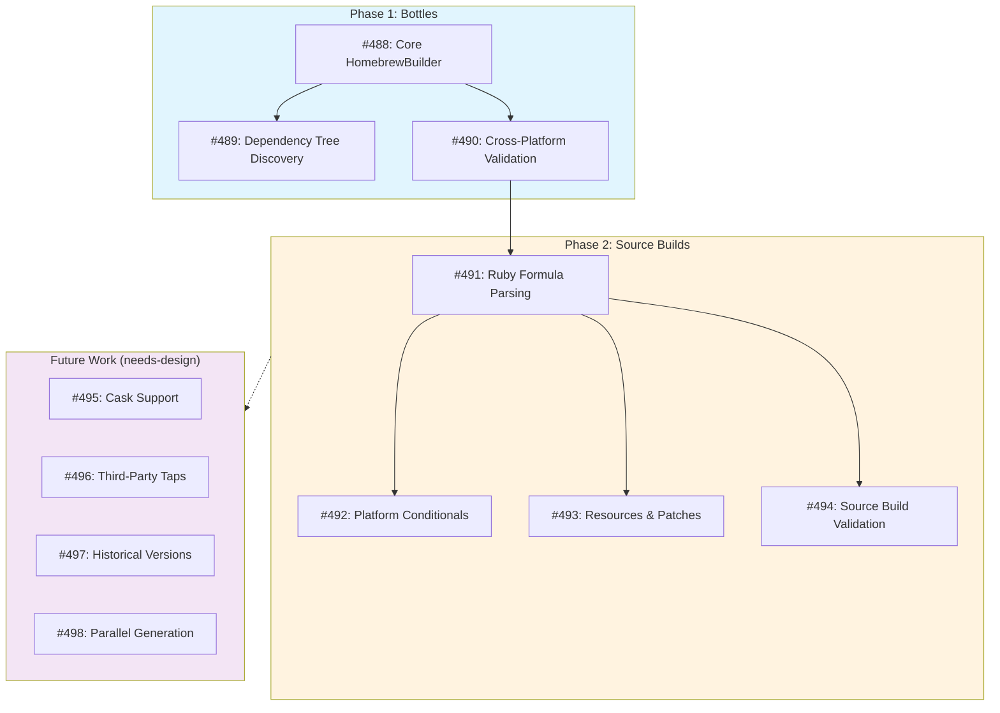

# Design: Homebrew Builder

**Status**: Approved

## Implementation Plan

**Milestone**: [M17: Homebrew Builder](https://github.com/tsukumogami/tsuku/milestone/17)

### Dependency Graph



### Implementation Issues

| Issue | Title | Phase | Dependencies |
|-------|-------|-------|--------------|
| [#488](https://github.com/tsukumogami/tsuku/issues/488) | Core HomebrewBuilder with LLM bottle inspection | Phase 1 | None |
| [#489](https://github.com/tsukumogami/tsuku/issues/489) | Dependency tree discovery for Homebrew formulas | Phase 1 | #488 |
| [#490](https://github.com/tsukumogami/tsuku/issues/490) | Cross-platform validation for Homebrew recipes | Phase 1 | #488 |
| [#491](https://github.com/tsukumogami/tsuku/issues/491) | Source build support with Ruby formula parsing | Phase 2 | #490 |
| [#492](https://github.com/tsukumogami/tsuku/issues/492) | Platform conditional handling for source builds | Phase 2 | #491 |
| [#493](https://github.com/tsukumogami/tsuku/issues/493) | Resource and patch support for source builds | Phase 2 | #491 |
| [#494](https://github.com/tsukumogami/tsuku/issues/494) | Container-based source build validation | Phase 2 | #491 |

### Future Work Issues (needs-design)

| Issue | Title |
|-------|-------|
| [#495](https://github.com/tsukumogami/tsuku/issues/495) | Design cask support for HomebrewBuilder |
| [#496](https://github.com/tsukumogami/tsuku/issues/496) | Design third-party tap support for HomebrewBuilder |
| [#497](https://github.com/tsukumogami/tsuku/issues/497) | Design historical version support for HomebrewBuilder |
| [#498](https://github.com/tsukumogami/tsuku/issues/498) | Design parallel generation for HomebrewBuilder |

## Context and Problem Statement

Homebrew is the dominant package manager for developer tools on macOS, with over 6,000 formulas in homebrew-core alone. Many valuable developer tools are distributed exclusively through Homebrew, making it an essential source for any comprehensive package manager.

tsuku already supports Homebrew bottles through the `homebrew_bottle` action, which downloads pre-built binaries from GHCR, verifies checksums, and relocates path placeholders. However, this approach requires manually authored recipes that specify which formula to fetch. Creating these recipes currently requires a human to:

1. Read the Homebrew formula (Ruby DSL)
2. Understand the installation semantics
3. Translate dependencies, build steps, and binary locations into tsuku's TOML format
4. Test across platforms

This manual process is time-consuming and doesn't scale. A developer wanting to install a Homebrew-only tool through tsuku must either:
- Wait for someone to write a recipe
- Write the recipe themselves (requiring Homebrew and tsuku knowledge)
- Fall back to using Homebrew directly (defeating tsuku's unified interface goal)

**The core challenge**: Homebrew formulas are written in a Ruby DSL that encodes installation logic procedurally. Unlike JSON/YAML registries (npm, crates.io) where metadata can be parsed deterministically, extracting installation semantics from Ruby code requires interpretation that only a human or LLM can provide.

### Why Now

1. **LLM Builder Infrastructure is ready**: The foundational infrastructure for LLM-powered recipe generation (LLM client, container validation, repair loops) is being implemented
2. **Precedent established**: The GitHub Release Builder validates the infrastructure on a simpler problem first
3. **User demand**: Homebrew-only tools are a common gap in tsuku's coverage
4. **Research validation**: SpackIt (2024) demonstrated 82.9% success with LLM-based package recipe generation using repair loops

### Scope

**In scope:**
- LLM-based parsing of Homebrew core formulas
- Bottle extraction (pre-built binaries from GHCR)
- **Source-based builds** when bottles are unavailable
- **Platform-agnostic recipes** that work on both macOS and Linux
- Dependency extraction and signaling
- Integration with existing `homebrew_bottle` action

**Out of scope (future work):**
- Casks (GUI applications) - different DSL, macOS-only installation semantics
- Third-party taps - security and discovery considerations
- Automatic dependency resolution - builders signal up, not recurse

### Implementation Phases

The design covers full Homebrew formula support, but implementation is phased:

1. **Phase 1 (Bottles)**: LLM-generated recipes using `homebrew_bottle` action for formulas with pre-built bottles
2. **Phase 2 (Source)**: LLM-parsed `install` methods translated to tsuku actions for formulas without bottles

This phasing allows validating the LLM infrastructure on the simpler bottle case before tackling source builds.

### Builder Scope Boundary

`--from=homebrew:<formula>` generates recipes using **Homebrew as the sole source**. The builder does not cross-reference other sources (GitHub releases, PyPI, etc.) even if they might be more efficient for certain platforms.

**Example**: jq has pre-built Linux binaries on GitHub releases but requires Homebrew bottles (or source build) on macOS. The Homebrew builder will use Homebrew's approach for both platforms, not GitHub releases for Linux.

**Rationale**: Mixing sources adds complexity (cross-builder knowledge, per-platform heuristics). Each builder has a single responsibility.

**Alternatives for users wanting optimized cross-platform recipes**:
- Use `--from=github:<repo>` for tools with good GitHub releases
- Create custom recipes that use different actions per platform
- Future: a "smart" orchestrator that picks the best source per platform

### Platform Strategy

Generated recipes are **platform-agnostic**. The `homebrew_bottle` action handles platform detection at runtime:

| Host Platform | Bottle Tag |
|---------------|------------|
| macOS ARM64 | `arm64_sonoma` (or latest available) |
| macOS x86_64 | `sonoma` (or latest available) |
| Linux ARM64 | `arm64_linux` |
| Linux x86_64 | `x86_64_linux` |

This enables:
- **Local testing on Linux** - Validate recipes in containers before CI
- **macOS CI validation** - GitHub Actions runners test macOS-specific behavior
- **Single recipe per formula** - No platform-specific recipe variants needed

The LLM generates a recipe without platform-specific details; the action resolves the correct bottle at install time.

## Decision Drivers

- **Security by default**: Validation enabled by default, but users can opt-out with `--skip-validation`
- **Leverage existing infrastructure**: Reuse `homebrew_bottle` action, LLM client, container validator
- **Incremental complexity**: Start with bottles (simpler), extend to source builds (harder)
- **Predictable success rate**: Target ~75% success rate for bottle-based formulas
- **Cost awareness**: LLM calls cost money; prefer bottles over source to minimize parsing complexity
- **Schema enforcement**: LLM output must conform to tsuku recipe schema

## Implementation Context

### Existing Infrastructure

**Builder Interface** (`internal/builders/builder.go`):

The tsuku codebase has a mature builder pattern proven by `GitHubReleaseBuilder`:

```go
type Builder interface {
    Name() string
    CanBuild(ctx context.Context, packageName string) (bool, error)
    Build(ctx context.Context, req BuildRequest) (*BuildResult, error)
}
```

`BuildResult` includes: Recipe, Warnings, Source, RepairAttempts, Provider, Cost, ValidationSkipped.

**homebrew_bottle Action** (`internal/actions/homebrew_bottle.go`):

The existing action provides complete bottle installation:

1. **GHCR authentication**: Anonymous token acquisition
2. **Manifest query**: Platform-specific blob SHA extraction
3. **Download with verification**: SHA256 from manifest annotations
4. **Placeholder relocation**: `@@HOMEBREW_PREFIX@@`, `@@HOMEBREW_CELLAR@@` replacement
5. **Binary patching**: RPATH fixup via `patchelf` (Linux) or `install_name_tool` (macOS)

Platform tag mapping is hardcoded to Sonoma:
- `darwin/arm64` → `arm64_sonoma`
- `darwin/amd64` → `sonoma`
- `linux/arm64` → `arm64_linux`
- `linux/amd64` → `x86_64_linux`

**Version Provider** (`internal/version/provider_homebrew.go`):

`HomebrewProvider` queries `https://formulae.brew.sh/api/formula/{name}.json`:
- Only exposes stable version (no historical versions)
- Includes deprecation/disabled status
- Reports bottle availability

**LLM Infrastructure** (`internal/llm/`):

- Multi-provider support (Claude, Gemini) with circuit breaker failover
- Tool-use protocol for structured LLM output
- Conversation loop pattern with repair attempts (max 2)
- Cost tracking across turns

**Validation Executor** (`internal/validate/executor.go`):

Container-based validation with:
- `--network=none` isolation
- Resource limits (2GB RAM, 2 CPU, 10GB disk, 5min timeout)
- Error sanitization before LLM repair loop
- Pre-download asset mounting

### Homebrew Formula Structure

**Ruby DSL Complexity Spectrum** (from formula-structure.md):

| Category | Example | Characteristics | LLM Parsing Difficulty |
|----------|---------|----------------|----------------------|
| Simple | jq | 1 dep, autotools, no conditionals | Easy |
| Medium | ripgrep | Cargo build, shell completions | Medium |
| Complex | neovim | Resources, CMake, file patching | Hard |
| Very Complex | postgresql@17 | Platform deps, services, keg-only | Very Hard |

**Key DSL Elements**:
- Bottle block: Platform-specific SHA256 checksums
- Dependencies: Build (`:build`), runtime, test (`:test`), optional
- Platform conditionals: `on_macos`, `on_linux`, `on_arm`, `on_intel`
- Resources: Additional downloads (common in language tools)
- Install method: Procedural Ruby code (cannot be executed safely)

**Homebrew JSON API** provides structured metadata:
- `formulae.brew.sh/api/formula/{name}.json`: Description, version, deps, bottle info
- Bottle URLs directly accessible (no need to query OCI manifest separately)
- Dependencies categorized: build, runtime, test, recommended, optional

### Ecosystem Variations

**Casks vs Formulas** (from casks-and-taps.md):

Casks are simpler (declarative, no build logic) but:
- macOS-only (not portable to Linux)
- May include pkg installers with arbitrary scripts
- `preflight`/`postflight` hooks execute code

**Third-Party Taps**:

- No central vetting (unlike homebrew-core)
- Trail of Bits audit (2023) found 25 security defects in Homebrew
- Formulas can contain arbitrary Ruby code in `install do` blocks
- Risk of typosquatting, compromised maintainers, abandoned taps

**Linux Support**:

- Merged from Linuxbrew into unified homebrew-core
- Different dependencies via `on_linux` blocks
- Different prefix: `/home/linuxbrew/.linuxbrew`
- Bottles built with GCC (macOS uses clang)
- No sandbox during Linux builds

### Security Constraints

**Critical requirements** (from security-analysis.md):

1. **Never execute formula Ruby**: Use JSON API, not Ruby parsing
2. **Bottles only for MVP**: No source builds that require formula execution
3. **homebrew-core only**: Third-party taps require explicit opt-in
4. **LLM output schema excludes checksums**: Obtained from GHCR at runtime
5. **URL allowlist**: Only `ghcr.io`, `github.com`, `formulae.brew.sh`
6. **Container validation by default**: Users can pass `--skip-validation` to trust Homebrew directly

**Prompt injection risk**: Formula descriptions are user-controlled content. Mitigations:
- Structured prompts with JSON code blocks
- Tool-use-only mode (no free-text responses)
- Input sanitization (control chars, template syntax, max lengths)
- Schema validation catches malicious outputs

## Considered Options

### Option A: Deterministic Bottle Builder (No LLM)

Build a simple builder using only Homebrew JSON API without LLM involvement.

**Approach:**
1. Query `formulae.brew.sh/api/formula/{name}.json` for metadata
2. Generate recipe with `homebrew_bottle` action
3. Hardcode binary discovery: use formula name as primary executable
4. No repair loop, no validation (or simple heuristic validation)

**Advantages:**
- No LLM cost (free)
- Fast generation (~1s)
- Simple implementation
- Deterministic output

**Disadvantages:**
- Low success rate (~50-60%) due to binary name guessing
  - `ripgrep` installs `rg`, not `ripgrep`
  - `fd-find` installs `fd`, not `fd-find`
- Cannot discover multiple executables
- No intelligent dependency analysis
- Validation failures require manual recipe editing

**Complexity:** Low

### Option B: LLM-Enhanced Bottle Builder

Use LLM to analyze formula metadata and optionally inspect bottle contents for intelligent recipe generation.

**Approach:**
1. Fetch formula JSON and optionally bottle manifest
2. LLM conversation with tools:
   - `fetch_formula_json`: Get metadata from API
   - `inspect_bottle`: Download bottle, list contents
   - `extract_recipe`: Output final recipe structure
3. Container validation with repair loop (max 2 attempts)
4. Schema-enforced output (no checksums, URL validation)

**Advantages:**
- High success rate (~75-85%) for bottle-based formulas
- Intelligent binary discovery from bottle inspection
- Dependency signaling (DependencyMissing errors)
- Repair loop fixes common mistakes
- Follows proven GitHubReleaseBuilder pattern

**Disadvantages:**
- LLM cost (~$0.02-0.10 per recipe)
- Slower generation (~10-30s)
- Requires LLM API key
- Prompt injection risk (mitigated by schema enforcement)

**Complexity:** Medium

### Option C: Full Source Build Support

Extend beyond bottles to generate recipes that build from source using LLM-parsed install methods.

**Approach:**
1. If bottle unavailable, fetch formula Ruby source
2. LLM parses `def install` method
3. Map Ruby DSL calls to tsuku actions:
   - `system "./configure"` → `configure_make` action
   - `system "cmake"` → `cmake` action
   - `system "cargo"` → `cargo_install` action
4. Handle resources, patches, platform conditionals
5. Build in container with Homebrew-like environment

**Advantages:**
- Higher coverage (formulas without bottles)
- Enables custom build flags
- Future-proofs for edge cases

**Disadvantages:**
- Much lower success rate (~40-60%) due to Ruby complexity
- Security risk: Ruby code could contain malicious logic
- Complex prompt engineering for Ruby → TOML translation
- Platform-specific `install` blocks hard to parse
- Resource staging, patches, inreplace operations are complex
- Higher LLM cost (longer prompts, more repair attempts)

**Complexity:** High (Ruby DSL parsing, build system detection, platform conditionals)

### Option D: Hybrid Approach (Bottles-First with Source Fallback)

Start with bottle-based generation (Option B), fall back to source builds (Option C) when bottles unavailable.

**Approach:**
1. Check if formula has bottles for target platform
2. If yes: Use Option B (LLM bottle builder)
3. If no: Attempt Option C (LLM source builder)
4. Signal to user which path was taken

**Advantages:**
- Maximum coverage
- Best of both worlds

**Disadvantages:**
- Most complex implementation
- Two code paths to maintain
- Source fallback has lower success rate
- Higher security surface area

**Complexity:** High (combines Option B and C complexity)

### Option Comparison Matrix

| Criterion | Option A (Deterministic) | Option B (LLM Bottles) | Option C (Source) | Option D (Hybrid) |
|-----------|-------------------------|----------------------|-------------------|-------------------|
| Success rate | ~50-60% | ~75-85% | ~40-60% | ~80-90% |
| Cost per recipe | $0 | ~$0.05 | ~$0.15 | ~$0.08 avg |
| Generation time | ~1s | ~15s | ~30s | ~18s avg |
| Implementation effort | Low | Medium | High | High |
| Security risk | Low | Medium | High | High |
| Maintenance burden | Low | Medium | High | High |
| Formula coverage | Bottle-only | Bottle-only | All | All |

## Decision Outcome

**Chosen option: Option D (Hybrid) with phased implementation**

The design covers both bottle-based and source-based recipe generation. Implementation is phased to validate the LLM infrastructure on the simpler bottle case first.

### Rationale

Option D provides maximum formula coverage while managing complexity through phased delivery:

1. **Full coverage goal**: The design should support all Homebrew core formulas, not just those with bottles. Some valuable tools don't have bottles, and bottle availability varies by platform.

2. **Phased risk management**: Start with bottles (simpler, higher success rate) to validate the LLM infrastructure before tackling source builds.

3. **Shared infrastructure**: Both paths use the same LLM conversation loop, validation executor, and dependency tree discovery. The difference is in the tools available and the generated recipe structure.

4. **Platform coverage**: Source builds may be needed when bottles exist for one platform but not another (e.g., macOS bottle available, Linux bottle missing).

### Implementation Phases

**Phase 1: Bottles (Option B)**
- LLM-generated recipes using `homebrew_bottle` action
- Target: ~75-85% success rate on formulas with bottles
- Complexity: Medium (LLM conversation loop, bottle inspection, validation)

**Phase 2: Source Builds (Option C)**
- LLM-parsed `install` methods translated to tsuku actions
- Target: ~50-70% success rate on formulas without bottles
- Complexity: High (Ruby DSL analysis, build system mapping, platform conditionals)

### Rejected Option

- **Option A (Deterministic)**: Rejected because binary name guessing significantly reduces success rate. `ripgrep` → `rg`, `fd-find` → `fd` patterns are too common.

### Acceptance Criteria

**Phase 1 (Bottles) is complete when:**

1. `tsuku create <tool> --from homebrew:<formula>` generates a working recipe
2. Generated recipes are **platform-agnostic** (single recipe works on macOS and Linux)
3. Formulas with bottles use `homebrew_bottle` action
4. Container validation passes with `--network=none` isolation
5. Success rate on top 100 Homebrew formulas (with bottles) exceeds 70%
6. Dependency tree is discovered via JSON API before LLM invocation
7. User sees full dependency tree with cost estimate and confirms before generation
8. Recipes are generated in topological order (dependencies first)
9. Security constraints are enforced (URL allowlist, no checksums in LLM output)

**Phase 2 (Source Builds) is complete when:**

1. Formulas without bottles generate recipes using tsuku build actions
2. LLM correctly maps common build systems: autotools, CMake, Cargo, Go, Make
3. Platform conditionals (`on_macos`, `on_linux`) are handled correctly
4. Resources and patches are downloaded and applied
5. Success rate on formulas without bottles exceeds 50%
6. Source build security controls are enforced (see Security Considerations)

## Solution Architecture

### Component Overview

```
┌─────────────────────────────────────────────────────────────────┐
│                        HomebrewBuilder                          │
│  ┌──────────────┐  ┌──────────────┐  ┌──────────────────────┐  │
│  │   CanBuild   │  │    Build     │  │   generateRecipe     │  │
│  │              │  │              │  │                      │  │
│  │ Check if    │  │ LLM convo    │  │ Create Recipe from   │  │
│  │ formula     │  │ with tools   │  │ extracted pattern    │  │
│  │ exists      │  │              │  │                      │  │
│  └──────────────┘  └──────────────┘  └──────────────────────┘  │
└─────────────────────────────────────────────────────────────────┘
         │                  │                      │
         ▼                  ▼                      ▼
┌─────────────────┐  ┌──────────────┐  ┌──────────────────────┐
│ HomebrewProvider│  │  LLM Client  │  │  Validation Executor │
│                 │  │              │  │                      │
│ formulae.brew.sh│  │ Claude/Gemini│  │ Container validation │
│ JSON API        │  │ Tool use     │  │ --network=none       │
└─────────────────┘  └──────────────┘  └──────────────────────┘
         │                  │                      │
         ▼                  ▼                      ▼
┌─────────────────────────────────────────────────────────────────┐
│                     homebrew_bottle Action                       │
│  ┌──────────────┐  ┌──────────────┐  ┌──────────────────────┐  │
│  │ GHCR Token   │  │ Download     │  │ Relocate             │  │
│  │ Acquisition  │  │ & Verify     │  │ Placeholders         │  │
│  └──────────────┘  └──────────────┘  └──────────────────────┘  │
└─────────────────────────────────────────────────────────────────┘
```

### Data Flow

```
User: tsuku create mylib --from homebrew:libyaml
                    │
                    ▼
            ┌───────────────┐
            │  CanBuild()   │
            │               │
            │ Query formula │
            │ JSON API      │
            └───────┬───────┘
                    │ Formula exists, has bottles
                    ▼
            ┌───────────────┐
            │   Build()     │
            │               │
            │ LLM convo:    │
            │ - System prompt│
            │ - Formula JSON │
            │ - Tool defs   │
            └───────┬───────┘
                    │
        ┌───────────┴───────────┐
        ▼                       ▼
┌───────────────┐       ┌───────────────┐
│fetch_formula  │       │inspect_bottle │
│               │       │               │
│ Returns full  │       │ Download,     │
│ JSON metadata │       │ list contents │
└───────┬───────┘       └───────┬───────┘
        │                       │
        └───────────┬───────────┘
                    ▼
            ┌───────────────┐
            │extract_recipe │
            │               │
            │ LLM outputs:  │
            │ - executables │
            │ - deps        │
            │ - verify cmd  │
            └───────┬───────┘
                    │
                    ▼
            ┌───────────────┐
            │generateRecipe │
            │               │
            │ TOML recipe   │
            │ with actions  │
            └───────┬───────┘
                    │
                    ▼
            ┌───────────────┐
            │  Validate()   │
            │               │
            │ Container run │
            │ with bottle   │
            └───────┬───────┘
                    │
            ┌───────┴───────┐
            ▼               ▼
        [PASS]          [FAIL]
            │               │
            │       ┌───────┴───────┐
            │       │ Repair Loop   │
            │       │ (max 2)       │
            │       └───────┬───────┘
            │               │
            └───────┬───────┘
                    ▼
            ┌───────────────┐
            │ Return Result │
            │               │
            │ Recipe +      │
            │ Warnings +    │
            │ Cost          │
            └───────────────┘
```

### LLM Tool Definitions

```go
// Tools available to LLM during Homebrew recipe generation
var homebrewBuilderTools = []llm.ToolDef{
    {
        Name:        "fetch_formula_json",
        Description: "Fetch the Homebrew formula JSON metadata including version, dependencies, and bottle availability.",
        Parameters: map[string]any{
            "type": "object",
            "properties": map[string]any{
                "formula": map[string]any{
                    "type":        "string",
                    "description": "Formula name (e.g., 'libyaml', 'ripgrep')",
                },
            },
            "required": []string{"formula"},
        },
    },
    {
        Name:        "inspect_bottle",
        Description: "Download a Homebrew bottle and list its contents to discover executables and libraries.",
        Parameters: map[string]any{
            "type": "object",
            "properties": map[string]any{
                "formula": map[string]any{
                    "type":        "string",
                    "description": "Formula name",
                },
                "platform": map[string]any{
                    "type":        "string",
                    "description": "Platform tag (arm64_sonoma, sonoma, x86_64_linux, arm64_linux)",
                },
            },
            "required": []string{"formula", "platform"},
        },
    },
    {
        Name:        "extract_recipe",
        Description: "Signal completion and output the recipe structure. Call this when you have determined the executables and verification command.",
        Parameters: map[string]any{
            "type": "object",
            "properties": map[string]any{
                "executables": map[string]any{
                    "type":        "array",
                    "items":       map[string]any{"type": "string"},
                    "description": "List of executable paths relative to bottle root (e.g., ['bin/rg'])",
                },
                "dependencies": map[string]any{
                    "type":        "array",
                    "items":       map[string]any{"type": "string"},
                    "description": "List of runtime dependency formula names",
                },
                "verify_command": map[string]any{
                    "type":        "string",
                    "description": "Command to verify installation (e.g., 'rg --version')",
                },
            },
            "required": []string{"executables", "verify_command"},
        },
    },
}
```

### Generated Recipe Structure

Recipes are **platform-agnostic** - no OS or architecture specified. The `homebrew_bottle` action resolves the correct bottle at install time based on the host platform.

```toml
# Generated by HomebrewBuilder from homebrew:ripgrep
# Platform-agnostic: works on macOS (ARM64/x86_64) and Linux (ARM64/x86_64)

[metadata]
name = "ripgrep"
description = "Search tool like grep and The Silver Searcher"
homepage = "https://github.com/BurntSushi/ripgrep"

[version]
provider = "homebrew:ripgrep"

[[steps]]
action = "homebrew_bottle"
formula = "ripgrep"
# Platform detection happens at runtime:
#   macOS ARM64 → arm64_sonoma bottle
#   macOS x86   → sonoma bottle
#   Linux ARM64 → arm64_linux bottle
#   Linux x86   → x86_64_linux bottle

[[steps]]
action = "install_binaries"
binaries = ["bin/rg"]

[verify]
command = "rg --version"

# Dependencies signaled but not auto-installed
# User must run: tsuku install pcre2
[dependencies]
runtime = ["pcre2"]
```

This single recipe is tested:
- **Locally on Linux** via container validation
- **On macOS CI** via GitHub Actions runners

### Source Build Architecture (Phase 2)

When a formula lacks bottles (or bottles for a specific platform), the LLM parses the formula's `install` method and generates a recipe using tsuku's build actions.

#### Additional LLM Tools for Source Builds

```go
var sourceBuilderTools = []llm.ToolDef{
    // ... existing tools (fetch_formula_json, inspect_bottle, extract_recipe) ...

    {
        Name:        "fetch_formula_ruby",
        Description: "Fetch the raw Ruby formula file to analyze the install method, resources, and patches.",
        Parameters: map[string]any{
            "type": "object",
            "properties": map[string]any{
                "formula": map[string]any{
                    "type":        "string",
                    "description": "Formula name",
                },
            },
            "required": []string{"formula"},
        },
    },
    {
        Name:        "extract_source_recipe",
        Description: "Output a source-based recipe structure with build actions.",
        Parameters: map[string]any{
            "type": "object",
            "properties": map[string]any{
                "build_system": map[string]any{
                    "type":        "string",
                    "enum":        []string{"autotools", "cmake", "cargo", "go", "make", "custom"},
                    "description": "Detected build system",
                },
                "source_url": map[string]any{
                    "type":        "string",
                    "description": "URL template for source archive",
                },
                "build_dependencies": map[string]any{
                    "type":        "array",
                    "items":       map[string]any{"type": "string"},
                    "description": "Build-time dependencies",
                },
                "configure_args": map[string]any{
                    "type":        "array",
                    "items":       map[string]any{"type": "string"},
                    "description": "Arguments for configure/cmake",
                },
                "executables": map[string]any{
                    "type":        "array",
                    "items":       map[string]any{"type": "string"},
                    "description": "Expected executables after build",
                },
                "verify_command": map[string]any{
                    "type":        "string",
                    "description": "Command to verify installation",
                },
            },
            "required": []string{"build_system", "source_url", "executables", "verify_command"},
        },
    },
}
```

#### Build System Mapping

| Homebrew Pattern | tsuku Action | Example |
|-----------------|--------------|---------|
| `system "./configure"` + `make` | `configure_make` | jq, curl |
| `system "cmake"` | `cmake_build` | neovim, llvm |
| `system "cargo", "install"` | `cargo_install` | ripgrep, fd |
| `system "go", "build"` | `go_build` | gh, lazygit |
| `bin.install "binary"` | `install_binaries` | pre-built binaries |

#### Source Build Recipe Example

```toml
# Generated by HomebrewBuilder (source build) from homebrew:jq
# Platform-agnostic: builds from source on any platform

[metadata]
name = "jq"
description = "Lightweight and flexible command-line JSON processor"
homepage = "https://jqlang.github.io/jq/"

[version]
provider = "homebrew:jq"

[[steps]]
action = "download"
url = "https://github.com/jqlang/jq/releases/download/jq-{{.Version}}/jq-{{.Version}}.tar.gz"

[[steps]]
action = "extract"
strip_dirs = 1

[[steps]]
action = "configure_make"
configure_args = ["--disable-maintainer-mode"]

[[steps]]
action = "install_binaries"
binaries = ["bin/jq"]

[verify]
command = "jq --version"

[dependencies]
build = ["autoconf", "automake", "libtool"]
runtime = ["oniguruma"]
```

#### Handling Platform Conditionals

When formulas have `on_macos` / `on_linux` blocks, the LLM generates platform-conditional steps:

```toml
# Formula has: on_linux do depends_on "libffi" end

[dependencies.linux]
runtime = ["libffi"]

[dependencies.macos]
runtime = []

# Or for build steps with platform differences:
[[steps]]
action = "configure_make"
configure_args = ["--prefix={{.InstallDir}}"]

[[steps.macos]]
action = "run_command"
command = "install_name_tool -id @rpath/libjq.dylib lib/libjq.dylib"

[[steps.linux]]
action = "set_rpath"
path = "lib/libjq.so"
```

#### Resources and Patches

For formulas with resources (additional downloads) or patches:

```toml
# Resources are downloaded before build
[[resources]]
name = "tree-sitter-c"
url = "https://github.com/tree-sitter/tree-sitter-c/archive/v0.24.1.tar.gz"
dest = "deps/tree-sitter-c"

# Patches applied after extraction
[[patches]]
url = "https://raw.githubusercontent.com/Homebrew/formula-patches/master/example/fix.patch"
strip = 1
```

### Dependency Handling

#### Dependency Tree Discovery (Pre-LLM Phase)

Before invoking the LLM, the builder traverses the dependency tree using Homebrew's JSON API. This is cheap (HTTP calls only) and provides full visibility before committing to LLM costs.

```
User: tsuku create ripgrep --from homebrew:ripgrep
                    │
                    ▼
         ┌─────────────────────┐
         │ Discover Dependency │
         │ Tree (no LLM)       │
         └──────────┬──────────┘
                    │
    ┌───────────────┴───────────────┐
    ▼                               ▼
┌─────────────┐            ┌─────────────┐
│ GET ripgrep │            │ Check tsuku │
│ .json       │            │ registry    │
│             │            │             │
│ deps: pcre2 │            │ Has recipe? │
└──────┬──────┘            └──────┬──────┘
       │                          │
       ▼                          ▼
┌─────────────┐            ┌─────────────┐
│ GET pcre2   │            │ ripgrep: NO │
│ .json       │            │ pcre2: NO   │
│             │            │             │
│ deps: []    │            │ Need: 2     │
└─────────────┘            └─────────────┘
                    │
                    ▼
         ┌─────────────────────┐
         │ User Confirmation   │
         │                     │
         │ Generate 2 recipes? │
         │ Cost: ~$0.10        │
         └──────────┬──────────┘
                    │ [y]
                    ▼
         ┌─────────────────────┐
         │ Generate in Order   │
         │                     │
         │ 1. pcre2 (leaf)     │
         │ 2. ripgrep (root)   │
         └─────────────────────┘
```

#### Tree Traversal Algorithm

```go
// DependencyNode represents a formula and its dependencies
type DependencyNode struct {
    Formula       string
    Dependencies  []string          // Runtime deps from JSON API
    HasRecipe     bool              // Already in tsuku registry
    NeedsGenerate bool              // Needs LLM generation
    Children      []*DependencyNode // Resolved child nodes
}

// DiscoverDependencyTree traverses Homebrew API to build full tree
func (b *HomebrewBuilder) DiscoverDependencyTree(
    ctx context.Context,
    formula string,
) (*DependencyNode, error) {
    // 1. Fetch formula JSON from Homebrew API
    meta, err := b.fetchFormulaJSON(ctx, formula)
    if err != nil {
        return nil, err
    }

    node := &DependencyNode{
        Formula:      formula,
        Dependencies: meta.Dependencies, // Runtime deps only
        HasRecipe:    b.registry.Has(formula),
    }
    node.NeedsGenerate = !node.HasRecipe

    // 2. Recursively resolve children
    for _, dep := range meta.Dependencies {
        child, err := b.DiscoverDependencyTree(ctx, dep)
        if err != nil {
            return nil, err
        }
        node.Children = append(node.Children, child)
    }

    return node, nil
}

// ToGenerationOrder returns formulas in topological order (leaves first)
func (node *DependencyNode) ToGenerationOrder() []string {
    var result []string
    var visit func(*DependencyNode)
    visited := make(map[string]bool)

    visit = func(n *DependencyNode) {
        if visited[n.Formula] {
            return
        }
        visited[n.Formula] = true

        // Visit children first (leaves before parents)
        for _, child := range n.Children {
            visit(child)
        }

        if n.NeedsGenerate {
            result = append(result, n.Formula)
        }
    }

    visit(node)
    return result
}
```

#### User Confirmation Flow

```go
// BuildWithDependencies handles the full dependency-aware generation
func (b *HomebrewBuilder) BuildWithDependencies(
    ctx context.Context,
    req BuildRequest,
) (*BuildResult, error) {
    // 1. Discover full dependency tree (no LLM, just API calls)
    tree, err := b.DiscoverDependencyTree(ctx, req.Package)
    if err != nil {
        return nil, err
    }

    // 2. Get formulas needing generation
    toGenerate := tree.ToGenerationOrder()

    if len(toGenerate) == 0 {
        // All recipes exist, just return existing
        return b.loadExistingRecipe(req.Package)
    }

    // 3. Show user what will be generated
    estimate := float64(len(toGenerate)) * 0.05 // ~$0.05 per recipe

    fmt.Printf("Dependency tree for %s:\n", req.Package)
    printTree(tree, "")
    fmt.Printf("\nRecipes to generate: %d\n", len(toGenerate))
    fmt.Printf("Estimated cost: ~$%.2f\n", estimate)
    fmt.Printf("\nProceed? [y/N] ")

    if !confirmFromUser() {
        return nil, ErrUserCancelled
    }

    // 4. Generate in topological order (leaves first)
    var results []*BuildResult
    for _, formula := range toGenerate {
        result, err := b.Build(ctx, BuildRequest{
            Package:   formula,
            SourceArg: formula,
        })
        if err != nil {
            return nil, fmt.Errorf("failed to generate %s: %w", formula, err)
        }
        results = append(results, result)
    }

    // 5. Return the root recipe result
    return results[len(results)-1], nil
}
```

#### Example Output

```
$ tsuku create neovim --from homebrew:neovim

Discovering dependencies...

Dependency tree for neovim:
  neovim (needs recipe)
  ├── gettext (needs recipe)
  ├── libuv (has recipe ✓)
  ├── lpeg (needs recipe)
  │   └── lua (needs recipe)
  ├── luajit (needs recipe)
  ├── luv (needs recipe)
  │   ├── libuv (has recipe ✓)
  │   └── luajit (needs recipe) [duplicate]
  ├── msgpack (needs recipe)
  ├── tree-sitter (needs recipe)
  └── unibilium (needs recipe)

Recipes to generate: 8
  1. gettext
  2. lua
  3. lpeg
  4. luajit
  5. luv
  6. msgpack
  7. tree-sitter
  8. unibilium
  9. neovim

Estimated cost: ~$0.45

Proceed? [y/N] y

Generating recipes...
  [1/9] gettext... ✓ (validated)
  [2/9] lua... ✓ (validated)
  ...
  [9/9] neovim... ✓ (validated)

All recipes generated successfully.
Run 'tsuku install neovim' to install.
```

#### Handling Cycles and Duplicates

Homebrew formulas can have shared dependencies (diamonds) but not cycles. The traversal:
- Uses visited set to avoid re-processing shared deps
- Topological sort ensures each formula generated exactly once
- Generates leaves first so deps are ready when parent is validated

## Implementation Approach

Implementation is organized into two major phases: Bottles (Phase 1) and Source Builds (Phase 2).

### Phase 1: Bottle-Based Recipes

#### 1.1 Core Builder

1. **HomebrewBuilder struct** implementing `Builder` interface
2. **CanBuild**: Query Homebrew JSON API, check formula exists
3. **Build**: LLM conversation loop with bottle inspection tools
4. **generateRecipe**: Transform extracted pattern to TOML recipe
5. **Container validation**: Reuse existing executor with bottle pre-download

#### 1.2 Dependency Tree Discovery

1. **Tree traversal**: Recursively query Homebrew JSON API for runtime dependencies
2. **Registry check**: Identify which deps already have tsuku recipes
3. **User confirmation**: Show full tree with cost estimate, require explicit approval
4. **Topological generation**: Generate recipes in dependency order (leaves first)
5. **Progress reporting**: Show generation progress with validation status

#### 1.3 Cross-Platform Validation

1. **Linux validation**: Container-based testing during development
2. **macOS validation**: GitHub Actions CI for macOS-specific behavior
3. **Bottle availability check**: Verify formula has bottles for target platforms
4. **Graceful degradation**: Warn if bottle missing for a platform

### Phase 2: Source Build Recipes

#### 2.1 Ruby Formula Parsing

1. **fetch_formula_ruby tool**: Download raw Ruby formula from homebrew-core
2. **LLM analysis**: Parse `def install` method, identify build system
3. **Build system detection**: Map Ruby patterns to tsuku actions (autotools, cmake, cargo, go)
4. **extract_source_recipe tool**: Output structured build recipe

#### 2.2 Platform Conditionals

1. **Parse `on_macos`/`on_linux` blocks**: Extract platform-specific dependencies and build steps
2. **Generate conditional recipe sections**: `[dependencies.linux]`, `[[steps.macos]]`
3. **Test on both platforms**: Ensure recipe works correctly on each

#### 2.3 Resources and Patches

1. **Resource handling**: Download additional archives specified in formula
2. **Patch application**: Apply patches from Homebrew formula-patches repo
3. **inreplace operations**: Map text replacements to sed-like actions

#### 2.4 Build Validation

1. **Container-based builds**: Build from source in isolated container
2. **Build tool availability**: Ensure required build tools (make, cmake, cargo) are available
3. **Output verification**: Confirm expected binaries are produced

### Future Work

- **Cask support**: Different DSL, macOS-only, script execution concerns
- **Third-party taps**: Requires tap allowlist and security warnings
- **Historical versions**: Homebrew API only exposes stable version
- **Parallel generation**: Generate independent deps concurrently

## Security Considerations

Security is important, but we trust Homebrew. For homebrew-core formulas, using tsuku should be equivalent to running `brew install` - we're fetching from the same trusted source (GHCR bottles, Homebrew CI-vetted formulas).

Validation catches LLM mistakes (wrong binary names, missing deps), not Homebrew supply chain attacks. Users can skip validation with `--skip-validation` when they trust the formula.

### Threat Model

| Threat | Vector | Severity | Mitigation |
|--------|--------|----------|------------|
| Malicious formula content | Homebrew core compromise | Critical | GHCR immutability, Homebrew CI review |
| Prompt injection | Formula description manipulation | High | Input sanitization, tool-use-only mode, schema validation |
| URL substitution | LLM generates malicious URLs | High | URL allowlist enforcement |
| Checksum bypass | LLM hallucinated checksums | High | Schema excludes checksums; obtained from trusted source at runtime |
| Third-party tap attack | Typosquatting, compromised maintainer | High | homebrew-core only |
| Ruby code execution | Formula `install` method | Critical | LLM reads but never executes; builds use tsuku actions |
| Malicious build commands | LLM generates dangerous shell commands | High | Action allowlist, no raw shell execution |

### Security Controls

#### 1. LLM Reads Ruby, Never Executes

**Phase 1 (Bottles):** Uses only Homebrew JSON API. Ruby formulas not accessed.

**Phase 2 (Source Builds):** LLM reads Ruby formula to understand build steps, but:
- Ruby code is **never executed** by tsuku
- LLM translates Ruby patterns to **tsuku actions** (not shell commands)
- Generated recipes use **structured actions** (`configure_make`, `cmake_build`, `cargo_install`)
- No `run_command` action with arbitrary shell allowed in LLM output schema

Example transformation:
```ruby
# Homebrew Ruby (read by LLM, never executed)
def install
  system "./configure", "--prefix=#{prefix}"
  system "make", "install"
end
```

```toml
# Generated tsuku recipe (structured actions)
[[steps]]
action = "configure_make"
configure_args = ["--prefix={{.InstallDir}}"]
```

#### 2. Trusted Binary Sources

**Phase 1 (Bottles):** Uses pre-built binaries from Homebrew's trusted CI:
- SHA256 verification via GHCR manifest annotations
- Bottles signed by Homebrew infrastructure
- No build logic executed

**Phase 2 (Source Builds):** Downloads source from URLs in Homebrew formulas:
- Source URLs must be from allowlisted domains (GitHub, official project sites)
- SHA256 checksums from formula (not LLM-generated)
- Builds happen in isolated containers with no network access

#### 3. URL Allowlist

Generated recipes can only reference:
- `ghcr.io/homebrew/core/*` - Homebrew bottles
- `github.com/*/*/releases/*` - GitHub releases (future)
- `formulae.brew.sh/*` - Homebrew API

Post-generation validation rejects recipes with URLs outside this allowlist.

#### 4. Schema Enforcement

LLM output schema does NOT include:
- Checksums (obtained from GHCR at runtime)
- Arbitrary URLs (constructed programmatically)
- Shell commands beyond verification

Tool-use-only mode prevents free-text responses that could contain malicious instructions.

#### 5. Input Sanitization

Before sending formula metadata to LLM:
- Max length: 512 chars for description
- Strip control characters (0x00-0x1F, 0x7F)
- Escape template syntax (`{{`, `}}`)
- Unicode normalization (prevent homoglyphs)

#### 6. Container Validation

All generated recipes are validated in isolated containers:
- `--network=none` - No network access
- Resource limits (2GB RAM, 2 CPU, 5min timeout)
- Pre-downloaded bottles mounted read-only
- Verification command executed in isolation

#### 7. homebrew-core Only

MVP restricts to official homebrew-core tap:
- Vetted by Homebrew maintainers
- Required CI checks before merge
- Open source, auditable

Third-party tap support requires explicit opt-in with security warnings.

### Risk Assessment

| Risk | Severity | Likelihood | Residual Risk |
|------|----------|------------|---------------|
| LLM hallucinated checksums | High | Medium | **Low** (schema excludes) |
| URL substitution attack | High | Low | **Low** (allowlist) |
| Prompt injection | High | Medium | **Medium** (sanitization + schema) |
| Third-party tap attack | High | Medium | **None** (excluded) |
| Ruby code execution | Critical | N/A | **None** (read-only, translated to actions) |
| Malicious build commands | High | Medium | **Low** (action allowlist, no raw shell) |

### Implementation Checklist

**Phase 1 (Bottles):**

- [ ] LLM output schema excludes checksum fields
- [ ] URL allowlist validation (GHCR, GitHub, formulae.brew.sh only)
- [ ] Formula metadata sanitization (control chars, template syntax, max lengths)
- [ ] Tool-use enforcement (no free-text LLM responses)
- [ ] `homebrew_bottle` action for bottle-based recipes
- [ ] Container validation with `--network=none` (enabled by default, skippable)
- [ ] Tap source validation (reject non-homebrew-core formulas)
- [ ] Prompt injection test cases in CI
- [ ] API key leak audit (no secrets in logs)

**Phase 2 (Source Builds):**

- [ ] Source URL allowlist (GitHub, official project domains)
- [ ] SHA256 extraction from formula (not LLM-generated)
- [ ] Action allowlist enforcement (no raw `run_command`)
- [ ] Build action schema validation (`configure_make`, `cmake_build`, etc.)
- [ ] Container-based build with `--network=none`
- [ ] Platform conditional handling (`on_macos`, `on_linux`)

## Consequences

### Positive

1. **Expanded coverage**: Users can install Homebrew-only tools through tsuku without manual recipe authoring.

2. **Unified interface**: `tsuku install <tool>` works for tools from any supported ecosystem, including Homebrew.

3. **Validated recipes**: Container-based validation ensures generated recipes actually work before users see them.

4. **Dependency visibility**: Recipe metadata documents dependencies, helping users understand what they're installing.

5. **Reduced maintenance**: LLM-generated recipes adapt to formula changes (new versions, updated bottle checksums).

### Negative

1. **LLM cost**: Each recipe generation costs ~$0.05-0.15 depending on complexity. For high-volume usage, this adds up.

2. **API key requirement**: Users need Claude or Gemini API key for recipe generation (not for installation).

3. **Slower generation**: LLM-based generation (~15-30s) is slower than deterministic approaches (~1s).

4. **Success rate varies by phase**:
   - Phase 1 (Bottles): ~75-85% success rate
   - Phase 2 (Source): ~50-70% success rate due to build complexity

### Risks

1. **Homebrew API changes**: If Homebrew changes JSON API structure, builder may break. Mitigation: Monitor API, version detection.

2. **GHCR availability**: If GitHub Container Registry has outages, bottle downloads fail. Mitigation: Existing `homebrew_bottle` action handles retries.

3. **Prompt injection evolution**: Attackers may find new injection techniques. Mitigation: Defense in depth, schema validation as last line.

4. **Platform tag changes**: Homebrew may add new macOS versions (e.g., `arm64_tahoe`). Mitigation: Platform tag fallback logic.

### Future Extensions

Design accommodates future work:

1. **Cask support**: Casks are simpler (declarative, no build logic). Same architecture applies with cask-specific tools.

2. **Third-party taps**: Add tap allowlist configuration, security warnings, same builder pattern.

3. **Historical versions**: Support generating recipes for specific formula versions (requires Git history traversal).

4. **Cross-platform validation**: Add macOS CI runners for macOS-only formula validation.

## References

- **Parent design**: LLM Recipe Builder Infrastructure (vision repo M15)
- **Existing implementation**: `internal/actions/homebrew_bottle.go`
- **Homebrew documentation**: https://docs.brew.sh/Formula-Cookbook
- **Homebrew JSON API**: https://formulae.brew.sh/docs/api/
- **SpackIt paper**: LLM-based package recipe generation with 82.9% success rate
