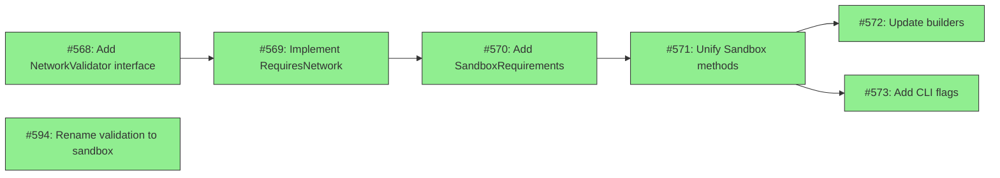

# Design: Centralize Sandbox Testing

## Status

Current

## Implementation Issues

### Milestone: [Centralize Sandbox Testing](https://github.com/tsukumogami/tsuku/milestone/22)

| Issue | Title | Status | Dependencies |
|-------|-------|--------|--------------|
| [#568](https://github.com/tsukumogami/tsuku/issues/568) | feat(actions): add NetworkValidator interface | Done | None |
| [#569](https://github.com/tsukumogami/tsuku/issues/569) | feat(actions): implement RequiresNetwork on actions | Done | #568 |
| [#570](https://github.com/tsukumogami/tsuku/issues/570) | feat(sandbox): add SandboxRequirements computation | Done | #569 |
| [#571](https://github.com/tsukumogami/tsuku/issues/571) | refactor(sandbox): unify Sandbox and SandboxSourceBuild | Done | #570 |
| [#572](https://github.com/tsukumogami/tsuku/issues/572) | refactor(builders): use centralized sandbox testing | Done | #571 |
| [#573](https://github.com/tsukumogami/tsuku/issues/573) | feat(cli): add --sandbox and --recipe flags to install | Done | #571 |
| [#594](https://github.com/tsukumogami/tsuku/issues/594) | refactor: rename validation terminology to sandbox | Done | None |

### Dependency Graph



## Context and Problem Statement

Tsuku's container-based sandbox testing ensures recipes work correctly by executing them in isolated containers. The eval+plan architecture (PR #530) enables offline sandbox testing by caching downloads during plan generation on the host, then running `tsuku install --plan` in a container with cached assets.

However, sandbox testing behavior is currently scattered across individual builders rather than being a unified, recipe-driven operation:

- **GitHub Release builder** calls `Sandbox()` with `Network: none`
- **Homebrew bottle builder** calls `Sandbox()` with `Network: none`
- **Homebrew source builder** calls `SandboxSourceBuild()` with `Network: host`

Each builder independently decides:
1. Whether to run sandbox testing (checks if executor is present)
2. Which sandbox method to call
3. What container image to use
4. Whether network access is needed
5. What resource limits to apply
6. How to handle failures (fail build vs log warning)

This architecture creates several problems:

**1. Sandbox testing cannot be invoked independently**

There is no way to test an existing recipe outside the `tsuku create` flow. A user who writes or modifies a recipe cannot run `tsuku install --sandbox` to test it in isolation.

**2. Sandbox testing depends on transient builder context**

The decision of which sandbox method to use relies on information the builder has at runtime (e.g., "I'm generating a source recipe") rather than information derivable from the recipe itself.

**3. Duplicated knowledge about action requirements**

`detectRequiredBuildTools()` in `source_build.go` contains a switch statement mapping action names to apt packages:

```go
switch step.Action {
case "configure_make":
    toolsNeeded["autoconf"] = true
case "cargo_build":
    toolsNeeded["curl"] = true
// ...
}
```

This knowledge should live with the actions themselves, not in the sandbox executor. When new actions are added, this switch must be manually updated.

**4. Network requirements are implicit**

Some actions require network access (e.g., `cargo_build` fetches crates, `go_build` fetches modules, `apt_install` needs package repositories). This is currently handled by using different sandbox methods, but the requirement isn't surfaced in the plan or derivable from recipe analysis.

**5. Inconsistent failure semantics**

Bottle sandbox failures trigger the LLM repair loop, but source sandbox failures are logged as warnings. This inconsistency is builder-specific rather than policy-driven.

### Scope

**In scope:**
- Centralizing sandbox testing logic into a single entry point
- Deriving sandbox requirements (image, network, resources, build tools) from recipe/plan content
- Surfacing action metadata (network requirements, build dependencies) for sandbox decisions
- Adding `tsuku install --sandbox` flag for standalone sandbox testing
- Refactoring builders to use the centralized sandbox testing

**Out of scope:**
- Removing network access from ecosystem actions (cargo_build, go_build, etc.)
- Caching ecosystem dependencies (crates, go modules, npm packages)
- Changes to the eval+plan architecture itself
- Repair loop behavior changes

## Decision Drivers

- **Single source of truth**: Sandbox requirements should be derivable from recipe/plan content alone
- **Action encapsulation**: Each action should declare its own requirements (network, build tools)
- **Independent invocation**: Sandbox testing must work outside the `tsuku create` flow
- **Backwards compatibility**: Existing recipes and plans must continue to work
- **Minimal duplication**: Knowledge about actions shouldn't be duplicated between action implementations and sandbox executor
- **Plan completeness**: The installation plan should contain enough information to determine sandbox requirements
- **Testing simplicity**: Solutions should be easy to test without complex mocking
- **Migration path**: Gradual adoption preferred over all-or-nothing changes

## Success Criteria

A successful solution will:
1. Enable `tsuku install <tool> --sandbox` to work without any builder context
2. Derive sandbox requirements (network, build tools, image) from plan content alone
3. Require updating only one location when adding a new action's requirements
4. Surface network requirements explicitly so sandbox testing can configure containers appropriately
5. Work with existing plans (no forced regeneration)
6. Support `tsuku eval <tool> | tsuku install --plan - --sandbox` workflow

## Implementation Context

### Existing Patterns

The action system uses **static registry maps** for metadata rather than instance methods:

```go
// Determinism classification
var deterministicActions = map[string]bool{
    "download": true, "extract": true, // ...
    "cargo_build": false, "go_build": false, // ...
}

// Runtime dependencies
var ActionDependencies = map[string]ActionDeps{
    "npm_install":  {InstallTime: []string{"nodejs"}, Runtime: []string{"nodejs"}},
    "cpan_install": {InstallTime: []string{"perl"}, Runtime: []string{"perl"}},
}
```

This pattern is extensible - new metadata dimensions can be added as new maps.

### Relationship to Dependency Provisioning

**Important:** This design should be read alongside [DESIGN-dependency-provisioning.md](DESIGN-dependency-provisioning.md), which fundamentally changes how build tools are handled.

The dependency-provisioning design establishes that **tsuku provides all build tools as recipes** via Homebrew bottles, not apt packages:

```go
// From DESIGN-dependency-provisioning.md
var ActionDependencies = map[string]ActionDeps{
    "configure_make": {
        InstallTime: []string{"make", "zig", "pkg-config"},  // tsuku recipes
        Runtime:     nil,
    },
    "cmake_build": {
        InstallTime: []string{"cmake", "make", "zig", "pkg-config"},
        Runtime:     nil,
    },
}
```

Build tools are handled by `ActionDependencies.InstallTime`. When `tsuku install --plan` runs in a container, tsuku's normal dependency resolution installs them.

This design adds **`RequiresNetwork`** - whether the action needs network access during execution. Everything else already exists:

| Need | Source |
|------|--------|
| Network requirements | **NEW** - `NetworkValidator.RequiresNetwork()` interface method |
| Determinism | Already exists - `deterministicActions` map |
| Build tool dependencies | Already exists - `ActionDependencies.InstallTime` |
| Runtime dependencies | Already exists - `ActionDependencies.Runtime` |

### Current Sandbox Testing Flow

```
Builder (knows recipe type)
   |
   +-- Bottle recipe --> Sandbox() --> Network: none, Debian
   |
   +-- Source recipe --> SandboxSourceBuild() --> Network: host, Ubuntu
                              |
                              v
                    detectRequiredBuildTools() [duplicates action knowledge]
```

### Information Available in Plan

The `ResolvedStep` struct contains:
- Action name and parameters
- Evaluable flag (can be reproduced from URLs/checksums)
- Deterministic flag (produces identical results)
- URL, checksum, size for downloads

### Information Missing from Plan

- Network requirements per step
- Build tool requirements per step
- Aggregate sandbox configuration (image, resources)

### Conventions to Follow

- Use static registry maps for action metadata (like `ActionDependencies`)
- Keep sandbox logic in `internal/sandbox/` package
- Plan generation in `internal/executor/` package
- Actions define their own metadata, sandbox executor consumes it

## Considered Options

This design addresses two independent decisions:
1. Where to store action metadata (network requirements, build tools)
2. How to surface sandbox requirements for use by the sandbox executor

### Decision 1: Action Metadata Storage

#### Option 1A: Static Registry Maps

Extend the existing pattern of static maps in `decomposable.go`:

```go
var ActionNetworkRequirements = map[string]bool{
    "download": false,      // uses cached files
    "cargo_build": true,    // fetches crates
    "go_build": true,       // fetches modules
    "configure_make": false, // source already extracted
}

var ActionBuildTools = map[string][]string{
    "configure_make": {"autoconf", "automake", "libtool", "pkg-config"},
    "cmake_build": {"cmake", "ninja-build"},
    "cpan_install": {"perl", "cpanminus"},
}
```

**Pros:**
- Follows existing pattern (ActionDependencies, deterministicActions)
- Simple to implement
- Easy to query during plan generation
- No interface changes to existing actions

**Cons:**
- Metadata lives separately from action implementation
- Adding a new action requires updating multiple files
- Can become out of sync if action behavior changes

#### Option 1B: Interface Methods on Actions

Add methods to the Action interface:

```go
type ActionMetadata interface {
    RequiresNetwork() bool
    BuildTools() []string
}

// Actions implement this interface
func (a *CargoAction) RequiresNetwork() bool { return true }
func (a *CargoAction) BuildTools() []string { return nil }
```

**Pros:**
- Metadata co-located with action implementation
- Harder to forget when adding new actions (compiler enforces interface)
- Self-documenting

**Cons:**
- Requires modifying all 49 existing actions
- Breaking interface change
- Most actions would return default values (false, nil)

#### Option 1C: Action Struct with Metadata Fields

Embed metadata in the action registration:

```go
type ActionInfo struct {
    Action         Action
    Network        bool
    BuildTools     []string
    Deterministic  bool
}

func RegisterWithMetadata(info ActionInfo) { ... }
```

**Pros:**
- All metadata in one place per action
- Registration-time validation possible
- Consolidates existing scattered maps

**Cons:**
- Larger refactor of registration system
- Need to migrate all existing Register() calls
- All-or-nothing migration (can't adopt gradually)

#### Option 1D: Structured Metadata Registry

Combine extensibility of static maps with structured organization:

```go
type ActionValidationMetadata struct {
    RequiresNetwork bool
    BuildTools      []string  // apt package names
}

var ActionValidationMetadata = map[string]ActionValidationMetadata{
    "configure_make": {
        RequiresNetwork: false,
        BuildTools:      []string{"autoconf", "automake", "libtool", "pkg-config"},
    },
    "cargo_build": {
        RequiresNetwork: true,
        BuildTools:      []string{"curl"},  // for rustup
    },
    "download": {
        RequiresNetwork: false,  // uses cached files
        BuildTools:      nil,
    },
}
```

**Pros:**
- Follows existing ActionDependencies pattern (proven in production)
- Consolidates network + build tools in single struct (vs separate maps)
- Easy to audit - single map shows all requirements
- No interface changes to actions
- Gradual migration possible (add entries as needed)
- Simple to extend (add fields to struct)

**Cons:**
- Metadata still separate from action implementation
- Adding new action requires updating map (but only one place)
- Can become out of sync if action behavior changes

### Decision 2: Surfacing Sandbox Requirements

#### Option 2A: Plan-Level Aggregate Fields

Add aggregate fields to `InstallationPlan`:

```go
type InstallationPlan struct {
    // ... existing fields ...

    // Sandbox requirements (computed from steps)
    RequiresNetwork bool     // true if any step needs network
    BuildTools      []string // union of all step build tools
}
```

**Pros:**
- Simple for sandbox executor to consume
- Pre-computed during plan generation
- Clear contract between plan generator and sandbox executor

**Cons:**
- Loses per-step granularity (can't skip network for specific steps)
- Plan must be regenerated if requirements change
- Duplicates information derivable from steps

#### Option 2B: Per-Step Metadata in ResolvedStep

Add metadata to each step:

```go
type ResolvedStep struct {
    // ... existing fields ...

    RequiresNetwork bool
    BuildTools      []string
}
```

**Pros:**
- Full granularity preserved
- Sandbox executor can make nuanced decisions
- Steps are self-describing

**Cons:**
- Larger plan JSON
- Sandbox executor must aggregate across steps
- More complex sandbox logic

#### Option 2C: Separate SandboxRequirements Struct

Compute requirements as a separate output alongside the plan:

```go
type SandboxRequirements struct {
    Network    bool
    BuildTools []string
    Image      string  // recommended container image
    Resources  ResourceLimits
}

func ComputeSandboxRequirements(plan *InstallationPlan) *SandboxRequirements
```

**Pros:**
- Clean separation of concerns
- Requirements can be computed from any plan (including hand-written ones)
- Sandbox executor takes this struct directly

**Cons:**
- Another data structure to maintain
- Must be recomputed if plan changes
- Indirection between plan and sandbox testing

### Evaluation Against Decision Drivers

| Option | Single Source | Action Encapsulation | Backwards Compat | Min Duplication | Testing Simplicity | Migration Path |
|--------|---------------|---------------------|------------------|-----------------|-------------------|----------------|
| 1A: Static Maps | Good | Fair | Good | Fair | Good | Good |
| 1B: Interface Methods | Good | Good | Poor | Good | Fair | Poor |
| 1C: Action Struct | Good | Good | Fair | Good | Good | Poor |
| 1D: Structured Registry | Good | Fair | Good | Good | Good | Good |
| 2A: Plan Aggregate | Good | N/A | Fair | Fair | Good | Fair |
| 2B: Per-Step Metadata | Good | N/A | Fair | Good | Good | Fair |
| 2C: Separate Struct | Good | N/A | Good | Good | Good | Good |

Note: Options 2A/2B require plan format version bump; Option 2C works with existing plans.

### Assumptions

The following assumptions inform this design:

1. **Network requirements are action-intrinsic**: This design assumes network requirements can be determined from action name alone. In practice, some actions may have conditional requirements (e.g., `cargo_build` with vendored dependencies). For the initial implementation, we treat network as binary per action. Conditional requirements can be addressed in future iterations.

2. **Build tools are apt package names**: The `BuildTools` field contains Debian/Ubuntu apt package names. This is appropriate since validation currently uses `debian:bookworm-slim` and `ubuntu:22.04` images. Multi-platform support (brew packages, etc.) is out of scope.

3. **Build tools are action-intrinsic**: Most build tools are determined by action name. Parameter-dependent requirements (e.g., cmake generator affecting tool choice) are edge cases handled by including the superset of possibly-needed tools.

4. **Offline vs network validation coexist**: Some validation can be fully offline (binary installation), while source builds require network for ecosystem dependencies. The design accommodates both modes.

### Uncertainties

- **Plan size impact**: Adding metadata to every step increases plan JSON size by approximately 20-50 bytes per step. For typical recipes with <10 steps, this is negligible (~200-500 bytes total).
- **Future metadata dimensions**: May need additional metadata (resource hints, platform constraints) in the future. The structured registry (Option 1D) makes this easy to extend.
- **Composite action handling**: When a composite action decomposes to primitives, the primitive steps' metadata should be used (not the composite's).

## Decision Outcome

**Chosen: Option 1B (Interface Methods) + Option 2C (Separate SandboxRequirements Struct)**

### Summary

Actions implement a `RequiresNetwork()` method that returns their network requirements. A computed `SandboxRequirements` struct derives container configuration from the plan by querying each action's method. This approach co-locates metadata with action code, provides compile-time enforcement, and aligns with a broader refactor to migrate existing static maps (`ActionDependencies`, `deterministicActions`) to interface methods (see #566).

### Rationale

**Option 1B (Interface Methods)** was chosen because:
- **Single source of truth**: Metadata lives with the action code, not in a separate registry
- **Compile-time enforcement**: Compiler ensures all actions implement required methods
- **Self-documenting**: Look at an action to see its requirements
- **Go-idiomatic**: Interfaces for capabilities is standard Go practice
- **Consistency**: Aligns with #566 to refactor existing static maps to interfaces

**Option 2C (Separate SandboxRequirements Struct)** was chosen because:
- **Backwards compatible**: Works with existing plans without regeneration
- **Clean separation**: Sandbox executor doesn't need to understand plan internals beyond step actions
- **Independent invocation**: Any code with a plan can compute requirements
- **No plan format changes**: Avoids version bump and migration complexity

**Alternatives rejected:**

- **Option 1A (Separate Static Maps)**: Would scatter metadata across multiple maps, making it harder to ensure completeness and consistency.
- **Option 1C (Action Struct Registration)**: All-or-nothing migration, larger refactor than necessary.
- **Option 1D (Structured Metadata Registry)**: Keeps metadata separate from action code; inconsistent with direction established in #566.
- **Option 2A (Plan Aggregate Fields)**: Requires plan format version bump; loses ability to work with existing plans.
- **Option 2B (Per-Step Metadata)**: Requires plan format changes; adds complexity to plan generation for marginal benefit.

### Trade-offs Accepted

By choosing this approach, we accept:

1. **Modify all action files**: Each action file needs a `RequiresNetwork()` method. Embedding a `BaseAction` with default implementation minimizes boilerplate.

2. **Need action instance to query**: Must look up action from registry to call method. This is acceptable since the action registry already exists.

3. **Computation at sandbox time**: Requirements are computed from the plan each time rather than cached. This is acceptable because the computation is trivial (iterate steps, lookup action, call method).

These trade-offs are acceptable because:
- Metadata co-location is more maintainable long-term
- Boilerplate is minimal with embedding pattern
- This aligns with broader refactor direction (#566)

## Solution Architecture

### Overview

The solution introduces a centralized sandbox testing system that derives container configuration from recipe/plan content. The system consists of three layers:

1. **Action Metadata Layer**: Interface methods on actions returning their requirements
2. **Requirements Computation Layer**: Function that aggregates metadata from plan steps
3. **Unified Sandbox Executor**: Single entry point that consumes requirements and executes sandbox testing

```
┌─────────────────────────────────────────────────────────────────────┐
│                        Sandbox Testing Flow                          │
├─────────────────────────────────────────────────────────────────────┤
│                                                                      │
│  Recipe ──► GeneratePlan() ──► InstallationPlan                     │
│                                       │                              │
│                                       ▼                              │
│                          ComputeSandboxRequirements()                │
│                                       │                              │
│                    ┌──────────────────┴──────────────────┐          │
│                    │                                      │          │
│                    ▼                                      ▼          │
│         action.RequiresNetwork()              SandboxRequirements    │
│         (interface method)                    (computed struct)      │
│                                                      │               │
│                                                      ▼               │
│                                              Sandbox(plan, reqs)     │
│                                                      │               │
│                                                      ▼               │
│                                              Container Execution     │
└─────────────────────────────────────────────────────────────────────┘
```

### Components

#### 1. NetworkValidator Interface

Location: `internal/actions/action.go`

Actions implement a `RequiresNetwork()` method to declare their network requirements. Build tools are handled by `ActionDependencies.InstallTime` (see [DESIGN-dependency-provisioning.md](DESIGN-dependency-provisioning.md)).

```go
// NetworkValidator is implemented by actions that can declare network requirements.
// Actions that fetch external dependencies (cargo_build, go_build) return true.
// Actions that work with cached/pre-downloaded content return false.
type NetworkValidator interface {
    RequiresNetwork() bool
}

// BaseAction provides default implementations for optional interfaces.
// Actions embed this to inherit defaults and override as needed.
type BaseAction struct{}

// RequiresNetwork returns false by default (most actions work offline).
func (BaseAction) RequiresNetwork() bool { return false }
```

#### 2. Action Implementations

Each action implements `RequiresNetwork()` directly or inherits the default via embedding:

```go
// internal/actions/download.go
type DownloadAction struct {
    BaseAction  // inherits RequiresNetwork() = false
}

// internal/actions/cargo_build.go
type CargoBuildAction struct{}

func (CargoBuildAction) RequiresNetwork() bool { return true }  // needs crates.io

// internal/actions/configure_make.go
type ConfigureMakeAction struct {
    BaseAction  // inherits RequiresNetwork() = false (source already extracted)
}
```

**Network requirements by category:**

| Category | Actions | RequiresNetwork |
|----------|---------|-----------------|
| Core primitives | download, extract, chmod, install_binaries, apply_patch_file, text_replace, set_env, set_rpath | `false` (cached content) |
| Build actions | configure_make, cmake_build | `false` (source cached) |
| Ecosystem primitives | cargo_build, cargo_install, go_build, go_install, cpan_install, npm_install, pip_install, gem_install | `true` (fetch dependencies) |
| Exec actions | npm_exec, gem_exec | `false` (modules installed) |
| System package managers | apt_install, yum_install, brew_install | `true` (fetch packages) |
| Run command | run_command | `true` (conservative) |

**Default handling**: Actions that don't implement `NetworkValidator` (or embed `BaseAction`) default to `RequiresNetwork() = false`. This "fail-closed" design means unknown actions run without network - if they actually need network, validation fails with a clear error (timeout/DNS failure), prompting the developer to add the method.

#### 3. SandboxRequirements Struct

Location: `internal/sandbox/requirements.go`

```go
// SandboxRequirements describes what a sandbox container needs.
// Note: Build tools are NOT tracked here - tsuku's normal dependency resolution
// handles them via ActionDependencies.InstallTime.
type SandboxRequirements struct {
    // RequiresNetwork is true if any step needs network access.
    RequiresNetwork bool

    // Image is the recommended container image based on requirements.
    // Uses debian:bookworm-slim for binary-only, ubuntu:22.04 for source builds.
    Image string

    // Resources are the recommended resource limits.
    Resources ResourceLimits
}

// ComputeSandboxRequirements derives container requirements from a plan.
func ComputeSandboxRequirements(plan *executor.InstallationPlan) *SandboxRequirements {
    reqs := &SandboxRequirements{
        RequiresNetwork: false,
        Image:           DefaultSandboxImage,  // debian:bookworm-slim
        Resources: ResourceLimits{
            Memory:  "2g",
            CPUs:    "2",
            PidsMax: 100,
            Timeout: 2 * time.Minute,
        },
    }

    // Check if any step requires network by querying the action
    for _, step := range plan.Steps {
        action := actions.Get(step.Action)
        if action == nil {
            continue  // Unknown action, defaults to no network
        }

        // Check if action implements NetworkValidator
        if nv, ok := action.(actions.NetworkValidator); ok {
            if nv.RequiresNetwork() {
                reqs.RequiresNetwork = true
            }
        }
    }

    // Upgrade image and resources for network-requiring (ecosystem) builds
    // Network-requiring steps typically involve compilation which needs more resources
    if reqs.RequiresNetwork {
        reqs.Image = SourceBuildSandboxImage  // ubuntu:22.04
        reqs.Resources = SourceBuildLimits()  // 4g, 4 CPUs, 15min timeout
    }

    // Also upgrade for plans with known build actions (even if offline)
    if hasBuildActions(plan) {
        reqs.Image = SourceBuildSandboxImage
        reqs.Resources = SourceBuildLimits()
    }

    return reqs
}

// hasBuildActions checks if plan contains compilation steps
func hasBuildActions(plan *executor.InstallationPlan) bool {
    buildActions := map[string]bool{
        "configure_make": true,
        "cmake_build":    true,
        "cargo_build":    true,
        "go_build":       true,
    }
    for _, step := range plan.Steps {
        if buildActions[step.Action] {
            return true
        }
    }
    return false
}
```

#### 4. Unified Sandbox Executor

Location: `internal/sandbox/executor.go`

```go
// Sandbox runs a plan in an isolated container using computed requirements.
// This is the single entry point for all sandbox testing.
func (e *Executor) Sandbox(
    ctx context.Context,
    plan *executor.InstallationPlan,
    reqs *SandboxRequirements,
) (*SandboxResult, error) {
    // Detect container runtime
    runtime, err := e.detector.Detect(ctx)
    if err != nil {
        // ... handle no runtime
    }

    // Build container options from requirements
    opts := RunOptions{
        Image:   reqs.Image,
        Command: []string{"/bin/bash", "/workspace/sandbox.sh"},
        Network: "none",
        Limits:  reqs.Resources,
        // ... mounts, env, etc.
    }

    // Enable network if required
    if reqs.RequiresNetwork {
        opts.Network = "host"
    }

    // Generate sandbox script with build tool installation
    script := e.buildSandboxScript(plan, reqs)

    // ... write script, run container, check results
}

// buildSandboxScript creates the shell script for sandbox testing.
// Note: Build tools are NOT installed via apt-get. Instead, tsuku's normal
// dependency resolution handles them via ActionDependencies.InstallTime.
// The sandbox script simply runs tsuku install --plan.
func (e *Executor) buildSandboxScript(
    plan *executor.InstallationPlan,
    reqs *SandboxRequirements,
) string {
    var sb strings.Builder

    sb.WriteString("#!/bin/bash\n")
    sb.WriteString("set -e\n\n")

    // Minimal system setup (ca-certificates for HTTPS)
    if reqs.RequiresNetwork {
        sb.WriteString("# Minimal network setup\n")
        sb.WriteString("apt-get update -qq && apt-get install -qq -y ca-certificates >/dev/null 2>&1\n\n")
    }

    // Setup and install - tsuku handles build tool dependencies automatically
    sb.WriteString("# Setup TSUKU_HOME\n")
    // ... mkdir, cp recipe, tsuku install --plan

    return sb.String()
}
```

### Key Interfaces

#### Public API

```go
// In internal/actions/action.go
type NetworkValidator interface {
    RequiresNetwork() bool
}

// In internal/sandbox/requirements.go
func ComputeSandboxRequirements(plan *executor.InstallationPlan) *SandboxRequirements

// In internal/sandbox/executor.go
func (e *Executor) Sandbox(ctx context.Context, plan *executor.InstallationPlan, reqs *SandboxRequirements) (*SandboxResult, error)
```

#### CLI Interface

Rather than creating a new command, container-based sandbox testing is integrated into `tsuku install` with a `--sandbox` flag:

```
tsuku install <tool> --sandbox                    # Generate plan, run in sandbox container
tsuku install --recipe recipe.toml --sandbox      # Test recipe file in sandbox (new)
tsuku install --plan plan.json --sandbox          # Execute existing plan in sandbox
tsuku install --plan - --sandbox                  # Read plan from stdin (pipe from eval)
```

This mirrors the existing `tsuku install` interface:
- Accepts tool name or plan (via `--plan` flag)
- Works with `tsuku eval <tool> | tsuku install --plan - --sandbox`

**Note:** Currently `tsuku install` only accepts tool names (looked up from registry) or plans. To enable direct recipe file testing, this work should also add `--recipe` flag support:

```
tsuku install --recipe path/to/recipe.toml --sandbox
tsuku eval --recipe path/to/recipe.toml | tsuku install --plan - --sandbox
```

This allows recipe authors to test local recipe files before submitting to the registry.

**User Awareness for Untrusted Recipes**: When using `--recipe` with a local file, the CLI should display what permissions will be granted before execution:

```
$ tsuku install --recipe ./my-recipe.toml --sandbox
Sandbox testing recipe: ./my-recipe.toml
  Network access: required (cargo_build action)
  Container image: ubuntu:22.04
  Resource limits: 4GB memory, 4 CPUs, 15m timeout

Proceed with sandbox testing? [y/N]
```

This confirmation can be bypassed with `--install-deps` for CI/automation, but ensures users understand what network-enabled sandbox testing entails for untrusted recipes.

The `--sandbox` flag:
1. Generates plan (if tool name provided) or loads plan (if --plan)
2. Computes sandbox requirements from plan
3. Runs `tsuku install --plan` inside an isolated container
4. Reports success/failure based on exit code and verification

Note: The existing `tsuku validate` command performs static recipe validation (TOML syntax, required fields). Container-based execution testing is a different concern, handled by `tsuku install --sandbox`.

### Data Flow

```
User Input                    Processing                      Output
─────────────────────────────────────────────────────────────────────────

tsuku install rg --sandbox
        │
        ▼
┌─────────────────┐
│ CLI: Parse Args │
└────────┬────────┘
        │
        ▼
┌─────────────────────────────┐
│ GeneratePlan()              │◄──── Downloads cached to ~/.tsuku/cache
│ (internal/executor)         │
└────────┬────────────────────┘
        │
        │ InstallationPlan
        ▼
┌─────────────────────────────┐
│ ComputeSandboxRequirements  │◄──── Iterates plan.Steps
│ (internal/sandbox)          │      Calls action.RequiresNetwork()
└────────┬────────────────────┘      Aggregates network/image/resources
        │
        │ SandboxRequirements
        │   .RequiresNetwork: bool
        │   .Image: string
        │   .Resources: ResourceLimits
        ▼
┌─────────────────────────────┐
│ Executor.Sandbox()          │
│ (internal/sandbox)          │
│   ├─ Build container opts   │
│   │    from requirements    │
│   ├─ Generate sandbox.sh    │
│   └─ Run container          │────► Container with:
└────────┬────────────────────┘        - Network: none|host
        │                             - Image: debian|ubuntu
        │                             - Mounts: workspace, cache
        │                             - Limits: memory, CPU, timeout
        │
        ▼
┌─────────────────────────────┐
│ Container Execution         │
│   ├─ tsuku install --plan   │◄──── Uses cached downloads
│   │    (handles deps via    │      Build tools from ActionDependencies
│   │     ActionDependencies) │
│   └─ Verify command         │
└────────┬────────────────────┘
        │
        ▼
┌─────────────────────────────┐
│ SandboxResult               │────► Success/Failure + stdout/stderr
└─────────────────────────────┘
```

**Key Integration Points:**

| Step | Component | Data In | Data Out |
|------|-----------|---------|----------|
| 1 | CLI | User args | Tool name or plan path |
| 2 | GeneratePlan | Recipe | InstallationPlan (with cached downloads) |
| 3 | ComputeSandboxRequirements | InstallationPlan | SandboxRequirements |
| 4 | Executor.Sandbox | Plan + Requirements | Container config + script |
| 5 | Container | sandbox.sh + plan.json | Exit code + output |

## Implementation Approach

### Phase 1: Add NetworkValidator Interface

**Goal**: Define the interface and default implementation without changing existing behavior.

- Add `NetworkValidator` interface to `internal/actions/action.go`
- Add `BaseAction` struct with default `RequiresNetwork() = false`
- Add tests for interface behavior

**Deliverables**:
- NetworkValidator interface definition
- BaseAction with default implementation
- Unit tests for default behavior

### Phase 2: Implement RequiresNetwork on Actions

**Goal**: Add `RequiresNetwork()` method to all actions that need network access.

- Update ecosystem actions to return `true`: cargo_build, cargo_install, go_build, go_install, cpan_install, npm_install, pip_install, gem_install
- Update system package managers to return `true`: apt_install, yum_install, brew_install
- Update run_command to return `true` (conservative default)
- Have remaining actions embed `BaseAction` or rely on default `false`

**Deliverables**:
- Updated action files with RequiresNetwork() methods
- Tests verifying each action's network requirement

### Phase 3: Add SandboxRequirements Computation

**Goal**: Implement requirements derivation from plans.

- Create `internal/sandbox/requirements.go` with `SandboxRequirements` struct
- Implement `ComputeSandboxRequirements()` function that queries actions via interface
- Add tests with various plan configurations

**Deliverables**:
- SandboxRequirements struct and computation function
- Unit tests for aggregation logic

### Phase 4: Refactor Executor to Use Requirements

**Goal**: Unify `Sandbox()` and `SandboxSourceBuild()` into single method.

- Modify `Executor.Sandbox()` to accept `SandboxRequirements`
- Remove `SandboxSourceBuild()` (functionality absorbed into Sandbox)
- Remove `detectRequiredBuildTools()` (replaced by interface methods)
- Update script generation to use requirements

**Deliverables**:
- Unified Sandbox() method
- Removal of duplicated logic
- Updated tests

### Phase 5: Update Builders to Use Centralized Sandbox Testing

**Goal**: Refactor builders to use the new unified sandbox testing.

- Update `github_release.go` to compute requirements and call unified Sandbox()
- Update `homebrew.go` (both bottle and source paths) similarly
- Remove builder-specific sandbox decisions

**Deliverables**:
- Updated builders using centralized sandbox testing
- Consistent sandbox behavior across all builders

### Phase 6: Add --sandbox and --recipe Flags to Install

**Goal**: Enable container-based sandbox testing via `tsuku install --sandbox` and direct recipe file testing.

- Add `--sandbox` flag to `tsuku install` command
- Add `--recipe` flag to support direct recipe file paths
- Integrate with existing `--plan` flag flow
- Compute sandbox requirements from plan
- Run `tsuku install --plan` in container with computed configuration
- Add `--verbose` flag for detailed container output

**Deliverables**:
- `--sandbox` flag for `tsuku install`
- `--recipe` flag for direct recipe file testing
- Integration with `tsuku eval <tool> | tsuku install --plan - --sandbox`
- Updated help text

## Testing Strategy

This section defines testing requirements to ensure comprehensive coverage of the centralized sandbox testing design.

### Testing Tools and Patterns

The codebase uses standard Go testing with manual mocking (no external test libraries). Key patterns:

- **Mock interfaces**: `Runtime`, `Logger`, `Downloader` interfaces enable unit testing without containers
- **Function pointer injection**: `RuntimeDetector` accepts `lookPath` and `cmdRun` for mocking subprocess calls
- **Option pattern**: `ExecutorOption` functions customize test configuration
- **Parallel tests**: Extensive use of `t.Parallel()` and `t.TempDir()` for isolation
- **Table-driven tests**: Standard `[]struct{name, input, expected}` pattern

### Test Categories

#### Unit Tests (No Containers Required)

| Component | Test Focus | Estimated Count |
|-----------|-----------|-----------------|
| NetworkValidator interface | RequiresNetwork() correctness for each action, default handling | 8 |
| ComputeSandboxRequirements | Network aggregation, resource selection, image selection | 10 |
| Sandbox script generation | Script content, conditional logic, escaping | 5 |
| Plan validation | Format version, primitive-only check, checksum presence | 6 |
| **Total Unit Tests** | | **~29** |

**Key unit test scenarios:**

1. **Metadata lookup completeness**: Test that every registered action has metadata
2. **Network aggregation**: Single network-requiring step makes whole plan require network
3. **Resource escalation**: Build actions trigger upgraded resources (4g, 4 CPUs)
4. **Image selection**: Binary-only plans use debian, build plans use ubuntu
5. **Unknown action handling**: Returns safe defaults, validation continues

#### Integration Tests (Container Runtime Required)

| Component | Test Focus | Estimated Count |
|-----------|-----------|-----------------|
| Offline sandbox | Cached downloads work with network=none | 3 |
| Network sandbox | Ecosystem builds work with network=host | 3 |
| Resource limits | Memory/CPU/timeout applied correctly | 3 |
| Mount configuration | tsuku binary, workspace, cache mounts work | 3 |
| End-to-end workflow | Full install --sandbox flow | 4 |
| **Total Integration Tests** | | **~16** |

**Key integration test scenarios:**

1. **Offline sandbox**: Generate plan (downloads cached), run container with network=none, verify install succeeds
2. **Ecosystem build**: Plan with cargo_build, verify network=host, verify rust installed via ActionDependencies
3. **Resource limits**: Plan requiring build, verify container has 4g memory, 4 CPUs
4. **Cache flow**: Verify downloads from plan generation are accessible in container
5. **Verification command**: Run verification, check pattern matching and exit codes

#### Edge Case and Security Tests

| Category | Test Focus | Estimated Count |
|----------|-----------|-----------------|
| Error handling | Missing runtime, failed execution, verification failure | 5 |
| Security | Command injection, path traversal, resource exhaustion | 5 |
| Backward compatibility | Old plan formats, unknown actions | 3 |
| **Total Edge/Security Tests** | | **~13** |

### Test Infrastructure

#### Mocking Container Runtime

```go
// mockRuntime implements Runtime interface for testing
type mockRuntime struct {
    name     string
    rootless bool
    runFunc  func(ctx context.Context, opts RunOptions) (*RunResult, error)
}

// Test can inject behavior:
mock := &mockRuntime{
    name: "podman",
    runFunc: func(ctx context.Context, opts RunOptions) (*RunResult, error) {
        // Verify opts.Network, opts.Limits, etc.
        return &RunResult{ExitCode: 0, Stdout: "expected output"}, nil
    },
}
```

#### Test Fixtures

Minimal test recipes/plans for focused testing:

```go
// Binary-only plan (no network, no build tools)
binaryPlan := &executor.InstallationPlan{
    Steps: []executor.ResolvedStep{
        {Action: "download", Params: map[string]interface{}{"url": "..."}},
        {Action: "extract", Params: map[string]interface{}{}},
        {Action: "install_binaries", Params: map[string]interface{}{}},
    },
}

// Build plan (network required, build resources)
buildPlan := &executor.InstallationPlan{
    Steps: []executor.ResolvedStep{
        {Action: "download", Params: map[string]interface{}{}},
        {Action: "extract", Params: map[string]interface{}{}},
        {Action: "cargo_build", Params: map[string]interface{}{}},
    },
}
```

### CI Integration

```yaml
# Unit tests run on every PR (fast, no containers)
test-unit:
  runs-on: ubuntu-latest
  steps:
    - run: go test -short ./internal/sandbox/... ./internal/actions/...

# Integration tests run with containers (slower)
test-integration:
  runs-on: ubuntu-latest
  services:
    docker: # Docker-in-Docker for container tests
  steps:
    - run: go test -tags=integration ./internal/sandbox/...

# Full sandbox testing on schedule (nightly)
test-sandbox:
  runs-on: ${{ matrix.os }}
  strategy:
    matrix:
      os: [ubuntu-latest, macos-latest]
  steps:
    - run: ./tsuku install rg --sandbox
    - run: ./tsuku install jq --sandbox
```

### Coverage Targets

| Area | Target | Rationale |
|------|--------|-----------|
| NetworkValidator implementations | 100% | Every action must have correct RequiresNetwork() |
| ComputeSandboxRequirements | 100% | Core logic, all branches must be tested |
| Validation execution | 80% | Some error paths require container failures |
| CLI integration | 70% | Mostly integration with existing code |
| **Overall** | **85%** | High for new code, lower for integration |

### Testing Checklist

Before merging each phase:

- [ ] All unit tests pass with `-race` flag
- [ ] No new golangci-lint warnings
- [ ] All actions implement NetworkValidator correctly (CI check)
- [ ] Integration tests pass when container runtime available
- [ ] Integration tests skip gracefully when no runtime
- [ ] Existing validation tests still pass (no regressions)

## Consequences

### Positive

- **Single source of truth**: Validation requirements live with each action's code
- **Compile-time enforcement**: Compiler catches missing interface implementations
- **Independent sandbox testing**: Users can run `tsuku install <tool> --sandbox` or pipe from eval
- **Reduced duplication**: No more `detectRequiredBuildTools()` switch statement
- **Consistent behavior**: All builders use the same validation logic
- **Extensible**: Adding new metadata dimensions adds methods to the interface
- **Backwards compatible**: Existing plans work without regeneration

### Negative

- **Modify all action files**: Each action needs RequiresNetwork() method (mitigated by embedding)
- **Runtime computation**: Requirements computed on each validation (not cached)

### Mitigations

- **Modify all action files**: Use `BaseAction` embedding to provide defaults. Only actions that need network must explicitly override.
- **Runtime computation**: Computation is O(n) where n is number of steps. For typical recipes (<10 steps), this is negligible.

## Security Considerations

### Download Verification

This design does not change download verification behavior. The existing eval+plan architecture continues to:
- Compute SHA256 checksums during plan generation
- Cache downloaded files for offline container execution
- Verify checksums during `tsuku install --plan`

The centralization refactor preserves all existing checksum verification. No new download paths are introduced.

### Execution Isolation

**Container isolation is preserved and improved:**

1. **Network access is now explicit**: The `RequiresNetwork` field makes network requirements visible and auditable. Previously, network access was an implicit decision made by builders.

2. **Minimal privilege principle**: Containers run with:
   - `Network: none` when possible (binary installations)
   - `Network: host` only when required (ecosystem builds)
   - Read-only mounts for tsuku binary and download cache
   - Non-root user where possible

3. **Resource limits**: The design continues using resource limits (memory, CPU, pids) to prevent runaway processes.

**New risk introduced**: The `tsuku install --sandbox` command allows users to test arbitrary recipes. A malicious recipe could:
- Consume resources up to the container limits
- Attempt network access if RequiresNetwork is true
- Execute arbitrary commands within the container

**Mitigation**: Container isolation contains these risks. The validation container has no access to the host filesystem beyond the mounted workspace, and resource limits prevent DoS.

### Supply Chain Risks

This design does not change supply chain trust model:

- **Recipe source trust**: Users must trust recipe sources (registry or local files)
- **Binary source trust**: Recipes specify upstream sources (GitHub releases, Homebrew, etc.)
- **Build tool trust**: Handled by ActionDependencies (see DESIGN-dependency-provisioning.md)

**New exposure point**: The `RequiresNetwork()` method on each action controls network access. If an action incorrectly returns `true`, it gains network access that could be used for data exfiltration.

**Mitigation**: Network requirements are code-reviewed per action. The interface approach makes this visible in each action's file. Most actions default to `false` (no network), and only ecosystem actions that genuinely need network access return `true`.

### User Data Exposure

**No new user data exposure:**

- Validation runs in isolated containers with no access to user home directory
- The workspace contains only recipe, plan, and download cache
- No telemetry or external reporting is added by this design

**Existing exposure (unchanged):**
- Recipes are loaded from user-specified paths
- Plans may contain version numbers that could identify user system

### Additional Considerations

**Container Networking**: The design uses `--network=host` for ecosystem builds. A future improvement could use bridge networking with egress filtering to limit access to known package registries only. This is out of scope for the initial implementation but noted as a security hardening opportunity.

**User Awareness**: The `tsuku install --sandbox` command should display what network access will be granted before execution, especially when testing untrusted recipes (via `--recipe` flag).

### Mitigations Summary

| Risk | Mitigation | Residual Risk |
|------|------------|---------------|
| Malicious recipe execution | Container isolation, resource limits, user displays network requirements | Recipe could consume allowed resources |
| Network-enabled builds have broader attack surface | Network enabled only when RequiresNetwork()=true; use bridge networking in future | Data exfiltration via network, compromised dependencies |
| Incorrect RequiresNetwork() implementation | Code review per action, default to false, interface makes it visible | Malicious or buggy action returns true unnecessarily |
| Arbitrary user-provided recipes | Container isolation, read-only mounts, clear warnings | Resource exhaustion within limits |

