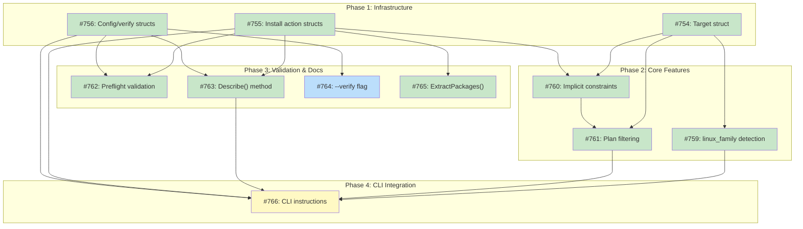

# DESIGN: System Dependency Actions

## Status

Planned

## Implementation Issues

### Milestone: [System Dependency Action Vocabulary](https://github.com/tsukumogami/tsuku/milestone/30)

| Issue | Title | Dependencies |
|-------|-------|--------------|
| [#754](https://github.com/tsukumogami/tsuku/issues/754) | feat(platform): define target struct for plan generation | None |
| [#755](https://github.com/tsukumogami/tsuku/issues/755) | feat(actions): define package installation action structs | None |
| [#756](https://github.com/tsukumogami/tsuku/issues/756) | feat(actions): define configuration and verification action structs | None |
| [#759](https://github.com/tsukumogami/tsuku/issues/759) | feat(platform): implement linux_family detection | [#754](https://github.com/tsukumogami/tsuku/issues/754) |
| [#760](https://github.com/tsukumogami/tsuku/issues/760) | feat(actions): implement implicit constraints for PM actions | [#754](https://github.com/tsukumogami/tsuku/issues/754), [#755](https://github.com/tsukumogami/tsuku/issues/755) |
| [#761](https://github.com/tsukumogami/tsuku/issues/761) | feat(executor): implement plan filtering by target | [#754](https://github.com/tsukumogami/tsuku/issues/754), [#760](https://github.com/tsukumogami/tsuku/issues/760) |
| [#762](https://github.com/tsukumogami/tsuku/issues/762) | feat(actions): implement action preflight validation | [#755](https://github.com/tsukumogami/tsuku/issues/755), [#756](https://github.com/tsukumogami/tsuku/issues/756) |
| [#763](https://github.com/tsukumogami/tsuku/issues/763) | feat(actions): implement Describe() for documentation generation | [#755](https://github.com/tsukumogami/tsuku/issues/755), [#756](https://github.com/tsukumogami/tsuku/issues/756) |
| [#764](https://github.com/tsukumogami/tsuku/issues/764) | feat(cli): add --verify flag for system dependency check | [#756](https://github.com/tsukumogami/tsuku/issues/756) |
| [#765](https://github.com/tsukumogami/tsuku/issues/765) | feat(sandbox): implement ExtractPackages() for sandbox integration | [#755](https://github.com/tsukumogami/tsuku/issues/755) |
| [#766](https://github.com/tsukumogami/tsuku/issues/766) | feat(cli): update CLI to display system dependency instructions | [#759](https://github.com/tsukumogami/tsuku/issues/759), [#761](https://github.com/tsukumogami/tsuku/issues/761), [#763](https://github.com/tsukumogami/tsuku/issues/763), [#755](https://github.com/tsukumogami/tsuku/issues/755), [#756](https://github.com/tsukumogami/tsuku/issues/756) |

### Dependency Graph



**Legend**: Green = done, Blue = ready, Yellow = blocked, Purple = needs-design

## Upstream Design Reference

This design addresses issue [#722](https://github.com/tsukumogami/tsuku/issues/722), which resolves the "Structured System Dependencies" blocker in [DESIGN-golden-plan-testing.md](DESIGN-golden-plan-testing.md).

**Companion design**: [DESIGN-structured-install-guide.md](DESIGN-structured-install-guide.md) (sandbox container building) depends on this design's action vocabulary.

## Context and Problem Statement

The current `require_system` action conflates multiple concerns:

1. **Checking** if a command exists
2. **Installing** system packages if it doesn't
3. **Platform filtering** via embedded platform keys
4. **Post-install configuration** (groups, services)

The result is a polymorphic mess where platform-specific content (`apt`, `brew`) lives inside a generic container (`install_guide` or `packages`), and the action tries to handle every possible installation scenario.

**Current state:**

```toml
[[steps]]
action = "require_system"
command = "docker"

[steps.install_guide]
darwin = "brew install --cask docker"
linux = "See https://docs.docker.com/engine/install/"
```

**Problems identified:**

1. **Platform keys in parameters**: Platform filtering should use `when` clause, not keys inside `install_guide`

2. **Free-form text**: Cannot be machine-executed or validated

3. **Generic container with polymorphic content**: `packages = { apt = [...] }` puts platform-specific content in a generic wrapper

4. **Implicit platform assumptions**: Actions like `require_apt` with implicit `when = { os = ["linux"] }` are wrong - Linux has many distros with different package managers

5. **Rigid ordering**: Baking `repo → packages → group → service` into a single action assumes one workflow fits all

## Scope

This design defines a **machine-readable action vocabulary** for system dependencies. The structured format enables three use cases:

| Use Case | Description | Scope |
|----------|-------------|-------|
| **Documentation Generation** | Generate platform-specific instructions for users | This design |
| **Sandbox Container Building** | Extract dependencies to build minimal test containers | This design |
| **Host Execution** | Guided/automated installation on user's machine | Future design |

**Current scope**: This design focuses on documentation generation and sandbox container building. These features require machine-readable recipes but do NOT execute privileged operations on the user's host.

**Future scope**: Host execution (where tsuku actually runs `apt-get install`, etc. on the user's machine) requires additional design work covering UX, consent flows, and security constraints. The action vocabulary defined here provides the foundation for that future capability.

**Key clarification**: Today, tsuku does not execute system package installations on the host. When a recipe requires system dependencies, tsuku:
1. Detects the user's platform
2. Filters steps to those matching the platform
3. Generates human-readable instructions from the machine-readable specs
4. Displays instructions for the user to follow manually

In sandbox mode, tsuku uses the structured specs to build containers with the required dependencies pre-installed.

## Design Goals

1. **Composable**: Recipe authors control the sequence of operations
2. **Explicit**: No implicit platform assumptions - use `when` clause
3. **Typed**: Each action has its own well-defined schema
4. **Auditable**: Operations can be statically analyzed (no shell commands)
5. **Extensible**: New package managers can be added as new actions

## Decisions

### D1: Action Granularity

**Decision: One action per operation (Option A)**

Each operation is a separate action type: `apt_install`, `apt_repo`, `brew_cask`, `group_add`, etc.

**Rationale:**

- **Consistency**: Each action has exactly one schema, making validation straightforward
- **Learnability**: Naming pattern `<manager>_<operation>` is self-documenting
- **Extensibility**: New package managers are additive; existing actions remain unchanged
- **Error messages**: Precise errors like "apt_install requires 'packages' field"

**Rejected alternatives:**

- Option B (one action per manager with sub-operations): Creates polymorphic schemas where valid fields depend on which operation is intended
- Option C (unified action with manager field): Recreates the original problem of generic containers with platform-specific content

### D2: Linux Family as Targeting Dimension

**Decision: Add `linux_family` as a targeting parameter, not a `when` clause field**

The `linux_family` is a **targeting dimension** for plan generation, not a filtering condition in recipes. Recipe authors never write `when = { linux_family = "debian" }` - instead, they use PM-specific actions (`apt_install`, `dnf_install`) which carry implicit constraints (see D6).

```go
// Targeting tuple for plan generation
type Target struct {
    Platform    string // e.g., "linux/amd64"
    LinuxFamily string // e.g., "debian" (empty for non-Linux)
}

// Generate plan for a specific target
func GeneratePlan(recipe *Recipe, target Target) *Plan
```

**Rationale for `linux_family` over `distro`:**

Research revealed that the meaningful boundary for system dependencies is **package manager**, not individual distro. Ubuntu, Debian, and Linux Mint all use `apt` - distinguishing between them adds noise without benefit. The `linux_family` dimension maps 1:1 to package manager:

| linux_family | Package Manager | Example Distros |
|--------------|-----------------|-----------------|
| debian | apt | Ubuntu, Debian, Linux Mint, Pop!_OS |
| rhel | dnf | Fedora, RHEL, CentOS, Rocky, Alma |
| arch | pacman | Arch, Manjaro, EndeavourOS |
| alpine | apk | Alpine Linux |
| suse | zypper | openSUSE, SLES |

**Detection mechanism:**

Parse `/etc/os-release` on Linux, extracting:
- `ID`: Canonical distro identifier (e.g., "ubuntu", "fedora", "arch")
- `ID_LIKE`: Parent/similar distros (e.g., "debian" for Ubuntu)

**Mapping to family:**

```go
var distroToFamily = map[string]string{
    // Debian family
    "debian": "debian", "ubuntu": "debian", "linuxmint": "debian",
    "pop": "debian", "elementary": "debian", "zorin": "debian",
    // RHEL family
    "fedora": "rhel", "rhel": "rhel", "centos": "rhel",
    "rocky": "rhel", "almalinux": "rhel", "ol": "rhel",
    // Arch family
    "arch": "arch", "manjaro": "arch", "endeavouros": "arch",
    // Alpine
    "alpine": "alpine",
    // SUSE family
    "opensuse": "suse", "opensuse-leap": "suse",
    "opensuse-tumbleweed": "suse", "sles": "suse",
}

func DetectFamily() (string, error) {
    osRelease, err := ParseOSRelease("/etc/os-release")
    if err != nil {
        return "", err
    }

    // Try ID first
    if family, ok := distroToFamily[osRelease.ID]; ok {
        return family, nil
    }

    // Fall back to ID_LIKE chain
    for _, like := range osRelease.IDLike {
        if family, ok := distroToFamily[like]; ok {
            return family, nil
        }
    }

    return "", fmt.Errorf("unknown distro: %s", osRelease.ID)
}
```

**Version constraints: Not in initial implementation.**

Version constraint syntax adds significant complexity due to non-uniform versioning schemes across distros. Defer to feature detection via `require_command` instead.

**Failure mode:**

If `/etc/os-release` is missing or family cannot be determined, steps with `linux_family` conditions are skipped. Fallback `manual` actions can guide users.

**Detection implementation notes:**

- Use `exec.LookPath()` (Go) or `type cmd >/dev/null 2>&1` (shell) for binary detection. The `which` command is not universal (missing on Fedora/Arch base images).
- For RHEL family detection, check for `microdnf` in addition to `dnf`. Minimal RHEL images (AlmaLinux, Rocky Linux) use `microdnf` - a lightweight DNF implementation with identical package names. Treat `microdnf` as `linux_family = "rhel"`.
- Detection order: `dnf` > `microdnf` > `yum` for RHEL family (prefer modern over legacy).

**Targeting vs filtering:**

The `linux_family` is NOT a field in `WhenClause`. Instead:

- **Targeting**: `linux_family` is a parameter to plan generation (e.g., `GeneratePlan(recipe, target)`)
- **Filtering**: PM actions have implicit constraints checked against the target (via D6's `ImplicitConstraint()`)
- **`WhenClause`** remains generic: `os`, `arch`, `platform` only

### D3: Require Semantics

**Decision: Idempotent install + final verify (Option C)**

Package managers handle "already installed" gracefully. Run install actions, then verify with `require_command`:

```toml
# implicit when = { linux_family = "debian" }
[[steps]]
action = "apt_install"
packages = ["docker.io"]

# implicit when = { os = "darwin" }
[[steps]]
action = "brew_cask"
packages = ["docker"]

[[steps]]
action = "require_command"
command = "docker"
```

**Rationale:**

- Simplest mental model: "run installs, then check"
- Package managers are idempotent by design
- `require_command` serves as both assertion and documentation

**Escape hatch:**

For cases where install should be skipped if command exists, add optional `unless_command` field:

```toml
# implicit when = { linux_family = "debian" }
[[steps]]
action = "apt_install"
packages = ["docker.io"]
unless_command = "docker"
```

### D4: Post-Install Configuration

**Decision: Separate actions for each (Option A)**

```toml
# implicit when = { linux_family = "debian" }
[[steps]]
action = "apt_install"
packages = ["docker-ce"]

[[steps]]
action = "group_add"
group = "docker"
when = { os = "linux" }

[[steps]]
action = "service_enable"
service = "docker"
when = { os = "linux" }
```

**Rationale:**

- **Single responsibility**: Each action does one thing
- **Clear errors**: Failures are isolated and easy to diagnose
- **Composability**: Recipe author controls sequence
- **Explicit**: Readers see exactly what will happen

**Rejected alternative:**

Option B (post_install hooks) couples unrelated concerns and bloats the schema.

### D5: Manual/Fallback Instructions

**Decision: Hybrid approach - both `manual` action and `fallback` field**

**`manual` action** for explicit human intervention:

```toml
[[steps]]
action = "manual"
text = "Download CUDA from https://developer.nvidia.com/cuda-downloads"
when = { os = ["darwin"] }
```

**`fallback` field** on install actions for graceful degradation:

```toml
# apt_install has implicit when = { linux_family = "debian" }
[[steps]]
action = "apt_install"
packages = ["nvidia-cuda-toolkit"]
fallback = "For newer CUDA versions, visit https://developer.nvidia.com/cuda-downloads"
```

**Rationale:**

- `manual` expresses "automation not possible"
- `fallback` expresses "automation might fail, here's plan B"
- These are orthogonal concerns that can coexist

### D6: Implicit Constraints for Package Manager Actions

**Decision: Package manager actions have immutable, built-in constraints**

Each `*_install` action carries a hardcoded constraint that determines which targets it applies to. This is NOT a `WhenClause` field - it's a property of the action type itself:

| Action | Implicit Constraint |
|--------|---------------------|
| `apt_install`, `apt_repo`, `apt_ppa` | `linux_family = "debian"` |
| `dnf_install`, `dnf_repo` | `linux_family = "rhel"` |
| `pacman_install` | `linux_family = "arch"` |
| `apk_install` | `linux_family = "alpine"` |
| `zypper_install` | `linux_family = "suse"` |
| `brew_install`, `brew_cask` | `os = "darwin"` |

**Rationale:**

- **Prevents mistakes**: Cannot accidentally use `apt_install` for an `rhel` target
- **Reduces noise**: Recipe authors don't repeat the same obvious constraint
- **Simplifies validation**: Action type determines valid targets
- **Separation of concerns**: `WhenClause` stays generic; PM constraints are action-level

**Implementation:**

```go
// Constraint represents a platform/family requirement
type Constraint struct {
    OS          string // e.g., "darwin", "linux"
    LinuxFamily string // e.g., "debian", "rhel" (only when OS == "linux")
}

// Action interface includes constraint checking
type Action interface {
    ImplicitConstraint() *Constraint  // nil if no constraint
    MatchesTarget(target Target) bool // checks constraint against target
}

// Example: apt_install always requires debian family
func (a *AptInstallAction) ImplicitConstraint() *Constraint {
    return &Constraint{OS: "linux", LinuxFamily: "debian"}
}

func (a *AptInstallAction) MatchesTarget(target Target) bool {
    return target.OS() == "linux" && target.LinuxFamily == "debian"
}
```

**Recipe authors can still add explicit `when` clauses** for additional constraints (e.g., architecture). These are combined with the action's implicit constraint:

```toml
[[steps]]
action = "apt_install"
packages = ["some-x86-only-package"]
when = { arch = "amd64" }  # Explicit: architecture filter
# Implicit: linux_family = "debian" (from action type)
```

**Filtering order:**

1. Check action's `ImplicitConstraint()` against target `(platform, linux_family)`
2. Check step's explicit `when` clause against target platform
3. Include step only if both pass

**Note:** This constraint applies only to package manager actions. Other actions (`require_command`, `group_add`, `manual`, etc.) have no implicit constraint - they rely solely on explicit `when` clauses.

## Decision Outcome

**Chosen: D1-A + D2 + D3-C + D4-A + D5-Hybrid + D6**

### Summary

We replace the polymorphic `require_system` with granular typed actions (`apt_install`, `brew_cask`, etc.), with `linux_family` as a targeting dimension for plan generation (not a `when` clause field), idempotent installation with final `require_command` verification, separate actions for post-install configuration, a hybrid fallback approach (`manual` action + `fallback` field), and implicit constraints on package manager actions.

### Rationale

These choices work together to create a consistent, auditable system:
- Typed actions (D1) enable static analysis and clear error messages
- Linux family as targeting dimension (D2) keeps `WhenClause` generic while enabling family-specific plan generation
- Idempotent install + verify (D3) leverages package manager behavior with explicit verification
- Separate post-install actions (D4) maintain single-responsibility and clear failure isolation
- Hybrid fallback (D5) covers both "automation not possible" and "automation might fail" scenarios
- Implicit constraints (D6) prevent mistakes and reduce recipe noise - PM actions know their valid targets

## Action Vocabulary

### Package Installation

| Action | Fields | Description |
|--------|--------|-------------|
| `apt_install` | packages, fallback? | Install Debian/Ubuntu packages |
| `apt_repo` | url, key_url, key_sha256 | Add APT repository with GPG key |
| `apt_ppa` | ppa | Add Ubuntu PPA |
| `dnf_install` | packages, fallback? | Install Fedora/RHEL packages |
| `dnf_repo` | url, key_url, key_sha256 | Add DNF repository |
| `brew_install` | packages, tap?, fallback? | Install Homebrew formulae |
| `brew_cask` | packages, tap?, fallback? | Install Homebrew casks |
| `pacman_install` | packages, fallback? | Install Arch packages |
| `apk_install` | packages, fallback? | Install Alpine packages |
| `zypper_install` | packages, fallback? | Install openSUSE/SLES packages |

### System Configuration

| Action | Fields | Description |
|--------|--------|-------------|
| `group_add` | group | Add current user to group |
| `service_enable` | service | Enable systemd service |
| `service_start` | service | Start systemd service |

### Verification

| Action | Fields | Description |
|--------|--------|-------------|
| `require_command` | command, version_flag?, version_regex?, min_version? | Verify command exists |

### Fallback

| Action | Fields | Description |
|--------|--------|-------------|
| `manual` | text | Display instructions for manual installation |

## Documentation Generation

Each action implements a `Describe()` method that generates human-readable instructions:

```go
type Action interface {
    // Describe returns human-readable instructions for this action
    Describe() string
}

// Example implementations
func (a *AptInstallAction) Describe() string {
    return fmt.Sprintf("Install packages: sudo apt-get install %s",
        strings.Join(a.Packages, " "))
}

func (a *BrewCaskAction) Describe() string {
    return fmt.Sprintf("Install via Homebrew: brew install --cask %s",
        strings.Join(a.Packages, " "))
}

func (a *GroupAddAction) Describe() string {
    return fmt.Sprintf("Add yourself to '%s' group: sudo usermod -aG %s $USER",
        a.Group, a.Group)
}
```

When `tsuku install docker` runs and Docker is not installed, the output looks like:

```
$ tsuku install docker

Docker requires system dependencies that tsuku cannot install directly.

For Ubuntu/Debian:

  1. Add Docker repository:
     curl -fsSL https://download.docker.com/linux/ubuntu/gpg | sudo gpg --dearmor -o /etc/apt/keyrings/docker.gpg
     echo "deb [signed-by=/etc/apt/keyrings/docker.gpg] https://download.docker.com/linux/ubuntu $(lsb_release -cs) stable" | sudo tee /etc/apt/sources.list.d/docker.list

  2. Install packages:
     sudo apt-get update && sudo apt-get install docker-ce docker-ce-cli containerd.io

  3. Add yourself to docker group:
     sudo usermod -aG docker $USER

  4. Enable Docker service:
     sudo systemctl enable docker

After completing these steps, run: tsuku install docker --verify
```

The structured action vocabulary enables this generation while remaining machine-readable for sandbox container building.

## Sandbox Container Building

In sandbox mode, tsuku extracts package requirements from actions and builds minimal containers. See [DESIGN-structured-install-guide.md - Sandbox Executor Changes](DESIGN-structured-install-guide.md#sandbox-executor-changes) for the `ExtractPackages()` implementation and container building details.

## Targeting Model

Plan generation uses a **target tuple** that includes `linux_family` as a dimension separate from the `WhenClause`:

```go
// Target represents the platform being targeted for plan generation
type Target struct {
    Platform    string // e.g., "linux/amd64", "darwin/arm64"
    LinuxFamily string // e.g., "debian", "rhel" (empty for non-Linux)
}

// WhenClause remains unchanged - no linux_family field
type WhenClause struct {
    Platform []string `toml:"platform,omitempty"`
    OS       []string `toml:"os,omitempty"`
    Arch     string   `toml:"arch,omitempty"`
}
```

**Why this separation?**

- `WhenClause` is a generic filtering mechanism for any step
- `linux_family` is specific to package manager actions
- PM actions carry implicit constraints (D6), so explicit `linux_family` in recipes is unnecessary
- The target is a parameter to plan generation, not a condition in the recipe

**Plan filtering:**

```go
func FilterPlan(recipe *Recipe, target Target) *Plan {
    var steps []Step
    for _, step := range recipe.Steps {
        action := ParseAction(step)

        // 1. Check action's implicit constraint against target
        if constraint := action.ImplicitConstraint(); constraint != nil {
            if !constraint.MatchesTarget(target) {
                continue // Skip: action doesn't apply to this target
            }
        }

        // 2. Check explicit when clause against target platform
        if step.When != nil && !step.When.Matches(target.Platform) {
            continue // Skip: explicit condition not met
        }

        steps = append(steps, step)
    }
    return &Plan{Steps: steps}
}
```

**Family detection for host execution:**

Create `internal/platform/family.go`:

```go
type OSRelease struct {
    ID              string   // e.g., "ubuntu"
    IDLike          []string // e.g., ["debian"]
    VersionID       string   // e.g., "22.04"
    VersionCodename string   // e.g., "jammy"
}

// DetectFamily returns the linux_family for the current system
func DetectFamily() (string, error) {
    osRelease, err := ParseOSRelease("/etc/os-release")
    if err != nil {
        return "", err
    }
    return MapDistroToFamily(osRelease.ID, osRelease.IDLike)
}

// DetectTarget returns the full target tuple for the current host
func DetectTarget() (Target, error) {
    platform := runtime.GOOS + "/" + runtime.GOARCH
    if runtime.GOOS != "linux" {
        return Target{Platform: platform}, nil
    }
    family, err := DetectFamily()
    if err != nil {
        return Target{}, err
    }
    return Target{Platform: platform, LinuxFamily: family}, nil
}
```

## Example: Docker Installation

Complete example showing composable actions:

```toml
# Debian family (Ubuntu, Debian, Mint, etc.) - uses official Docker repo
# Note: apt_* actions have implicit when = { linux_family = "debian" }
[[steps]]
action = "apt_repo"
url = "https://download.docker.com/linux/ubuntu"
key_url = "https://download.docker.com/linux/ubuntu/gpg"
key_sha256 = "1500c1f56fa9e26b9b8f42452a553675796ade0807cdce11975eb98170b3a570"

[[steps]]
action = "apt_install"
packages = ["docker-ce", "docker-ce-cli", "containerd.io"]

# RHEL family (Fedora, RHEL, CentOS, Rocky, etc.)
# Note: dnf_install has implicit when = { linux_family = "rhel" }
[[steps]]
action = "dnf_install"
packages = ["docker"]

# macOS
# Note: brew_cask has implicit when = { os = "darwin" }
[[steps]]
action = "brew_cask"
packages = ["docker"]

# Post-install: add to docker group (Linux only)
[[steps]]
action = "group_add"
group = "docker"
when = { os = "linux" }

# Post-install: enable service (Linux only, not macOS Docker Desktop)
[[steps]]
action = "service_enable"
service = "docker"
when = { os = "linux" }

# Verify
[[steps]]
action = "require_command"
command = "docker"
```

### Additional Examples

#### Simple Package Installation

A minimal example installing a single package:

```toml
# Debian family - implicit when = { linux_family = "debian" }
[[steps]]
action = "apt_install"
packages = ["curl"]

# macOS - implicit when = { os = "darwin" }
[[steps]]
action = "brew_install"
packages = ["curl"]

# Verify
[[steps]]
action = "require_command"
command = "curl"
```

#### Homebrew with Custom Tap

Installing from a third-party tap:

```toml
# implicit when = { os = "darwin" }
[[steps]]
action = "brew_install"
packages = ["some-tool"]
tap = "owner/repo"
```

#### Ubuntu PPA

Adding a PPA and installing packages from it:

```toml
# Both actions have implicit when = { linux_family = "debian" }
# Note: PPAs are Ubuntu-specific but work on Ubuntu derivatives
[[steps]]
action = "apt_ppa"
ppa = "deadsnakes/ppa"

[[steps]]
action = "apt_install"
packages = ["python3.11"]

[[steps]]
action = "require_command"
command = "python3.11"
```

#### Fallback for Graceful Degradation

When automated installation might fail, provide a fallback:

```toml
# implicit when = { linux_family = "debian" }
[[steps]]
action = "apt_install"
packages = ["nvidia-cuda-toolkit"]
fallback = "For newer CUDA versions, visit https://developer.nvidia.com/cuda-downloads"
```

The `fallback` field is shown to users if the installation fails, guiding them to manual alternatives.

## Implementation Approach

Implementation focuses on documentation generation and sandbox container building (current scope).

### Phase 1: Infrastructure

1. Define `Target` struct with `Platform` and `LinuxFamily` fields
2. Implement `DetectFamily()` in `internal/platform/family.go`
3. Implement `DetectTarget()` to get full target tuple for host
4. Implement distro-to-family mapping with ID_LIKE fallback
5. Add unit tests with `/etc/os-release` fixtures

Note: `WhenClause` is NOT modified - it remains generic (os, arch, platform only).

### Phase 2: Action Vocabulary

1. Define action types with `Describe()` method for documentation generation
2. Implement `ImplicitConstraint()` for PM actions (D6)
3. Implement `MatchesTarget(target Target)` for filtering
4. Implement parameter validation for each action
5. Extract `require_command` from existing `require_system`
6. Implement `manual` action for fallback instructions

Actions at this phase do NOT execute on the host - they provide:
- Implicit constraints (target matching)
- Parameter validation (preflight checks)
- Human-readable descriptions (documentation generation)
- Structured data (sandbox container building)

### Phase 3: Documentation Generation

1. Implement `Describe()` for all package actions (`apt_install`, `brew_cask`, etc.)
2. Implement `Describe()` for configuration actions (`group_add`, `service_enable`)
3. Update CLI to detect target via `DetectTarget()` and filter plan accordingly
4. Display target-filtered instructions when system deps are missing
5. Add `--verify` flag to check if system deps are satisfied after manual installation
6. Add `--target-family` flag to override detected family (for documentation preview)

### Phase 4: Sandbox Integration

1. Implement `FilterPlan(recipe, target)` to filter steps by target
2. Implement `ExtractPackages()` to collect dependencies from filtered plans
3. Integrate with sandbox executor for container building
4. Add sandbox execution capability (actions run inside containers)

See [DESIGN-structured-install-guide.md](DESIGN-structured-install-guide.md) for container building details.

## Security Considerations

**Current scope (documentation generation + sandbox execution):**

- **No privileged host operations**: Tsuku does not execute system package installations on the user's machine
- **Documentation generation**: Only reads recipe files to generate human-readable instructions
- **Sandbox isolation**: Actions execute inside ephemeral containers with no host filesystem access
- **Content-addressing**: External resources (GPG keys, repository URLs) require SHA256 hashes

For security constraints on future host execution, see [Future Work: Host Execution](#host-execution).

## Consequences

### Positive

- **Typed actions enable static analysis**: Every recipe can be audited without execution
- **Consistent platform filtering**: `when` clause with `linux_family` support used everywhere
- **Machine-readable format**: Enables both documentation generation and sandbox container building
- **No shell commands**: Eliminates arbitrary code execution risks
- **Extensible**: New actions follow established patterns

### Negative

- **More verbose than polymorphic `require_system`**: Separate steps per platform
- **Requires Go code changes for new actions**: Higher bar than shell commands (by design)
- **Two-design coordination**: This design + sandbox container building design must stay aligned

### Mitigations

- Verbosity traded for explicit, auditable behavior
- New action barrier is intentional security property
- Clear scope boundaries and cross-references between designs

## Future Work

### Host Execution

The action vocabulary defined here provides the foundation for future host execution, where tsuku could actually run installation commands on the user's machine. This requires a dedicated design covering:

**UX Considerations:**
- Consent flow: How does the user approve operations?
- Progress display: How are multi-step installations shown?
- Error recovery: What happens when one step fails?
- Rollback: Can partial installations be undone?

**Security Constraints:**

When host execution is implemented, these constraints will apply:

| Concern | Constraint |
|---------|------------|
| Group allowlisting | Categorize groups by risk (safe/elevated/dangerous) |
| Repository allowlisting | Maintain list of known-safe repository domains |
| Tiered consent | Different confirmation levels for different risk operations |
| Audit logging | Log all privileged operations with timestamps and outcomes |

**Group Risk Categories (for future reference):**

| Category | Groups | Risk | Consent |
|----------|--------|------|---------|
| Safe | dialout, cdrom, floppy, audio, video | Low | Standard y/n |
| Elevated | docker, libvirt, kvm | Medium | Requires typing "yes" |
| Dangerous | wheel, sudo, root | High | Blocked by default |

This is deferred until the documentation generation and sandbox container building features are complete and validated.

### Composite Shorthand Syntax (`system_dependency`)

The current design is verbose for common cases. A high-level shorthand simplifies the ~95% of packages with consistent names across package managers:

**Common case (same package name everywhere):**

```toml
[system_dependency]
command = "curl"
packages = ["curl", "ca-certificates"]
```

This expands to `apt_install`, `dnf_install`, `pacman_install`, `brew_install`, etc. with the same package list for each.

**Exception handling (different names per family):**

```toml
[system_dependency]
command = "gcc"
packages = ["gcc"]
overrides = { debian = ["build-essential"], rhel = ["@development-tools"], arch = ["base-devel"] }
```

The `overrides` map uses `linux_family` keys (not distro names) to specify family-specific package names.

**macOS-specific handling:**

```toml
[system_dependency]
command = "docker"
packages = ["docker"]
darwin = { cask = ["docker"] }  # Uses brew_cask instead of brew_install
```

This syntax provides the ergonomics of a high-level abstraction while respecting the `linux_family` targeting model. Recipe authors who need fine-grained control (custom repos, post-install hooks) continue using individual steps.

### Additional Package Managers

As needed:
- `apk_install` for Alpine Linux - already in scope (alpine family)
- `zypper_install` for openSUSE - already in scope (suse family)

**Explicitly out of scope:**
- `emerge` for Gentoo - source-based, fundamentally different model
- `nix_install` for NixOS - declarative, fundamentally different model

These systems may use nix-portable as a universal fallback in the future (tsuku already supports Nix).

### Version Constraints

If version-specific package requirements become common:

```toml
when = { linux_family = "debian", version = ">=22.04" }
```

Requires defining version comparison semantics across distro versioning schemes. Deferred until there's demonstrated need.

## Relationship to Original Design

This design doc defines the action vocabulary for system dependencies. It feeds back into [DESIGN-structured-install-guide.md](DESIGN-structured-install-guide.md) which addresses:

- Sandbox testing for recipes with system dependencies
- Minimal base container strategy
- Container building from extracted package requirements
- Content-addressing for external resources

The two designs are complementary:

| Design | Focus | Scope |
|--------|-------|-------|
| **This doc** | Action vocabulary, platform filtering, documentation generation | What actions exist and how they compose |
| **Original doc** | Container building, sandbox execution, caching | How to build and run sandbox containers |

Both designs share the same current scope (documentation generation + sandbox container building) and future scope (host execution).

## References

Agent assessments informing this design:
- `wip/research/system-deps_api-design.md` - API granularity analysis
- `wip/research/system-deps_platform-detection.md` - Distro detection approach
- `wip/research/system-deps_security.md` - Security constraints
- `wip/research/system-deps_authoring-ux.md` - Recipe author experience
- `wip/research/system-deps_implementation.md` - Implementation feasibility
- `wip/research/design-fit_current-behavior.md` - Current require_system behavior analysis
- `wip/research/design-fit_sandbox-executor.md` - Sandbox executor architecture
- `wip/research/design-fit_usecase-alignment.md` - Use case alignment assessment
