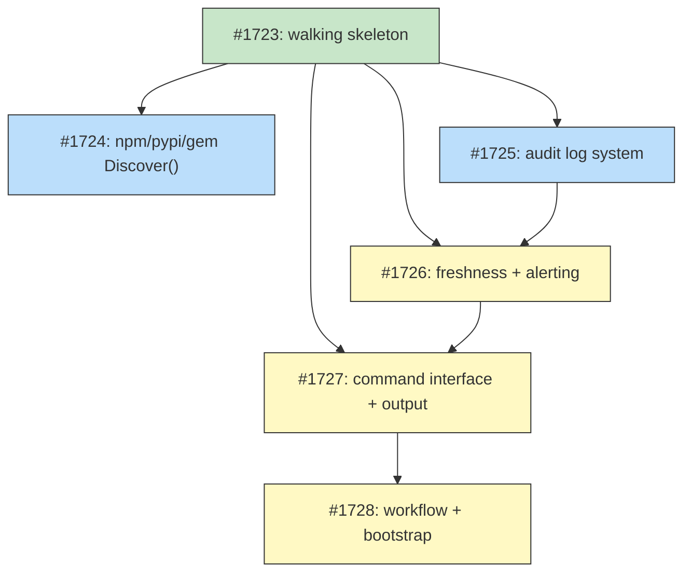

# DESIGN: Automated Seeding Workflow

## Status

Planned

## Implementation Issues

### Milestone: [automated-seeding](https://github.com/tsukumogami/tsuku/milestone/85)

| Issue | Dependencies | Tier |
|-------|--------------|------|
| ~~[#1723: feat(seed): implement walking skeleton for ecosystem discovery and seeding](https://github.com/tsukumogami/tsuku/issues/1723)~~ | None | testable |
| _Walking skeleton: EcosystemDiscoverer interface, CargoBuilder.Discover(), ResolveWithDetails(), Disambiguator wrapper, convert.go with tier assignment, FilterByName, and seed-queue -source cargo e2e flow._ | | |
| [#1724: feat(builders): add Discover() to npm, pypi, and gem builders](https://github.com/tsukumogami/tsuku/issues/1724) | [#1723](https://github.com/tsukumogami/tsuku/issues/1723) | testable |
| _Implements Discover() on NpmBuilder, PyPIBuilder, and GemBuilder using each ecosystem's batch listing APIs with rate limiting and CLI-tool filtering._ | | |
| [#1725: feat(seed): implement audit log system for disambiguation decisions](https://github.com/tsukumogami/tsuku/issues/1725) | [#1723](https://github.com/tsukumogami/tsuku/issues/1723) | testable |
| _Per-package audit files recording full probe results, selected source, and reasoning. Provides HasSource() and ReadAuditEntry() that freshness checking depends on._ | | |
| [#1726: feat(seed): implement freshness checking and source change alerting](https://github.com/tsukumogami/tsuku/issues/1726) | [#1723](https://github.com/tsukumogami/tsuku/issues/1723), [#1725](https://github.com/tsukumogami/tsuku/issues/1725) | critical |
| _Three re-disambiguation triggers (staleness, failures+stale, new audit candidate), source change detection with priority-based alerting, and curated source validation._ | | |
| [#1727: feat(seed): complete seed-queue command interface and output](https://github.com/tsukumogami/tsuku/issues/1727) | [#1723](https://github.com/tsukumogami/tsuku/issues/1723), [#1726](https://github.com/tsukumogami/tsuku/issues/1726) | testable |
| _Full flag set, exit codes (0/1/2), summary JSON to stdout for workflow consumption, and seeding-runs.jsonl persistence. Stabilizes the command contract for CI._ | | |
| [#1728: feat(batch): add seeding workflow and bootstrap Phase B](https://github.com/tsukumogami/tsuku/issues/1728) | [#1727](https://github.com/tsukumogami/tsuku/issues/1727) | critical |
| _Updates seed-queue.yml for all ecosystems, adds source change issue creation with seeding:review label, and documents Bootstrap Phase B procedure._ | | |



**Legend**: Green = done, Blue = ready, Yellow = blocked, Purple = needs-design

## Upstream Design Reference

This design implements Phase 3 of [DESIGN-pipeline-dashboard.md](DESIGN-pipeline-dashboard.md).

**Relevant sections:**
- Decision 4: Seeding Strategy for Multi-Ecosystem Coverage
- Phase 3: Automated Seeding (Needs Design)
- Incremental Seeding Pipeline component diagram

## Context and Problem Statement

The batch pipeline processes packages from a unified queue (`data/queues/priority-queue.json`), but that queue is almost entirely Homebrew. Of 5,275 current entries, 5,137 have `homebrew:` sources. Only 138 entries come from other ecosystems, and most of those were added during bootstrap via curated overrides or recipe scanning.

The `cmd/seed-queue` command fetches package candidates from Homebrew analytics and merges them into the queue. It implements a `Source` interface (`internal/seed/source.go`) with `HomebrewSource` as the sole implementation. The weekly `seed-queue.yml` workflow invokes this command with `-source homebrew`.

This creates three gaps:

**No multi-ecosystem discovery.** Popular Rust CLI tools (ripgrep, fd, bat, eza, hyperfine) exist in the queue routed to `homebrew:` sources. While Homebrew has bottles for these, the batch pipeline could produce better recipes using cargo or github sources that ship pre-built binaries. Tools that only exist on npm (tldr, np), PyPI (httpie, black), or RubyGems (fpm, tmuxinator) aren't in the queue at all.

**No disambiguation at seeding time.** When a package is added to the queue, it gets `source: "homebrew:<name>"` without checking whether a better source exists. The disambiguation infrastructure (`internal/discover/disambiguate.go`) is fully functional but only used during interactive `tsuku install`. Seeding should call disambiguation to pick the right source upfront.

**No freshness tracking.** Queue entries have a `disambiguated_at` field (added during the Phase 1 queue migration) but nothing reads it. If a package's best source changes (e.g., a tool moves from homebrew to a dedicated GitHub release), the queue won't update until someone manually edits it.

### Scope

**In scope:**
- `Discover()` methods on existing builders for crates.io, npm, PyPI, and RubyGems
- Disambiguation integration in `cmd/seed-queue`
- Freshness checking and stale entry re-disambiguation
- Audit log format for disambiguation decisions
- Source change alerting for high-priority packages
- `seed-queue` command extensions (flags, output, exit codes)
- `seed-queue.yml` workflow updates
- Bootstrap Phase B local execution procedure

**Out of scope:**
- Go ecosystem discovery (no popularity API exists; use GitHub curated list instead)
- CPAN ecosystem discovery (low package volume, existing curated entries are sufficient)
- Dashboard seeding stats page (deferred to future work; dashboard already shows disambiguation data)
- Changes to the disambiguation algorithm itself (10x threshold, secondary signals)
- LLM-based package discovery

## Decision Drivers

1. **Existing infrastructure**: The `EcosystemProber` builders already have HTTP clients and API knowledge for each ecosystem. Adding `Discover()` is the natural extension.
2. **Rate limit compliance**: Each ecosystem has different API limits (crates.io: 1 req/s, RubyGems: 10 req/s, npm/PyPI: undocumented). The design must enforce these.
3. **Incremental cost**: Weekly seeding should process only new/stale packages, not the full queue. Initial bootstrap is a one-time local cost.
4. **Security**: Source changes for high-priority packages need manual review. Curated overrides must never be auto-refreshed.
5. **Disambiguation reuse**: The `internal/discover` package already handles ecosystem probing, quality metrics, and the 10x threshold. Seeding should call this directly.
6. **CI budget**: The weekly workflow runs in GitHub Actions. API calls must fit within the workflow timeout (6 hours) and not strain ecosystem APIs.

## Implementation Context

### Existing Patterns

**`internal/builders/probe.go`** -- the ecosystem prober interface:
```go
type EcosystemProber interface {
    SessionBuilder
    Probe(ctx context.Context, name string) (*ProbeResult, error)
}
```

Eight builders implement `EcosystemProber`: `CargoBuilder`, `NpmBuilder`, `PyPIBuilder`, `GemBuilder`, `HomebrewBuilder`, `CaskBuilder`, `GoBuilder`, `CpanBuilder`. Each already has HTTP clients, URL construction, and response parsing for its ecosystem's API. `Probe()` checks whether a specific package exists and returns quality metadata.

**`internal/seed/source.go`** -- the existing seed source interface:
```go
type Source interface {
    Name() string
    Fetch(limit int) ([]Package, error)
}
```

`HomebrewSource` is the sole implementation, fetching from Homebrew analytics. It returns `[]Package` where each package has `ID`, `Source`, `Name`, `Tier`, `Status`, `AddedAt`, and optional `Metadata`.

**`internal/seed/queue.go`** -- queue management:
- `PriorityQueue.Merge(newPackages)` adds packages by ID, skipping duplicates
- `PriorityQueue.Load(path)` / `Save(path)` handle I/O

Note: `Merge()` deduplicates by ID (e.g., `"homebrew:ripgrep"`), which includes the ecosystem prefix. Since a package can be discovered from multiple ecosystems with different IDs, the seed command must deduplicate by **name** (not by ID) before merging. This is handled in the command logic, not in `queue.Merge()` itself.

**`internal/seed/filter.go`** -- recipe existence checking:
- `FilterExistingRecipes(packages, recipesDir, embeddedDir)` removes packages that already have recipes

**`internal/discover/disambiguate.go`** -- the disambiguation function:
```go
func disambiguate(toolName string, matches []probeOutcome, priority map[string]int,
    confirm ConfirmDisambiguationFunc, forceDeterministic bool) (*DiscoveryResult, error)
```
With `forceDeterministic: true`, it auto-selects using 10x threshold + secondary signals, falling back to priority ranking when data is missing.

**`internal/discover/ecosystem_probe.go`** -- probes all 8 ecosystems in parallel with per-ecosystem builders that return `ProbeResult{Source, Downloads, VersionCount, HasRepository}`. The current `Resolve()` method returns only the winning `*DiscoveryResult`; the raw `[]probeOutcome` from all ecosystems is internal. The seeding command needs all probe outcomes for audit logs, so the implementation must add a `ResolveWithDetails()` method that returns both:

```go
type ResolveResult struct {
    Selected  *DiscoveryResult
    AllProbes []ProbeOutcome // expose the internal probeOutcome type
}

func (p *EcosystemProbe) ResolveWithDetails(ctx context.Context, toolName string) (*ResolveResult, error)
```

**`internal/batch/results.go`** -- `DisambiguationRecord` for tracking decisions:
```go
type DisambiguationRecord struct {
    Tool            string   `json:"tool"`
    Selected        string   `json:"selected"`
    Alternatives    []string `json:"alternatives"`
    SelectionReason string   `json:"selection_reason"`
    DownloadsRatio  float64  `json:"downloads_ratio,omitempty"`
    HighRisk        bool     `json:"high_risk"`
}
```

The seeding audit log extends this with additional fields. Rather than modifying `DisambiguationRecord`, the implementation defines a new `AuditEntry` type in `internal/seed/audit.go` that embeds it:

```go
type AuditEntry struct {
    batch.DisambiguationRecord
    ProbeResults    []ProbeResult `json:"probe_results"`
    PreviousSource  *string       `json:"previous_source"`
    DisambiguatedAt time.Time     `json:"disambiguated_at"`
    SeedingRun      time.Time     `json:"seeding_run"`
}
```

### Queue Type Bridging

The codebase has two queue structures: `seed.PriorityQueue` (using `seed.Package` with `ID`, `Source`, `Name`, `Tier`, `Status`) and the unified queue (using `batch.QueueEntry` with `Name`, `Source`, `Priority`, `Status`, `Confidence`, `DisambiguatedAt`, `FailureCount`). The current `cmd/seed-queue` writes to per-ecosystem files (`priority-queue-homebrew.json`) using `seed.Package`, while the batch orchestrator reads the unified queue (`priority-queue.json`) using `batch.QueueEntry`.

This design targets the **unified queue** directly. The seed command will read and write `priority-queue.json` using `batch.QueueEntry`. Builder `Discover()` returns `[]DiscoveryCandidate`, which the command converts to `[]seed.Package` (for filtering) and then to `batch.QueueEntry` (for merging):

- `seed.Package.Tier` maps to `batch.QueueEntry.Priority`
- `seed.Package.Source` maps to `batch.QueueEntry.Source` (as `"ecosystem:name"`)
- New entries get `Confidence: "auto"`, `FailureCount: 0`, `DisambiguatedAt` set to the current timestamp
- The `seed.Package.ID` field is used only for deduplication during discovery, not stored in the unified queue

The per-ecosystem queue files (`priority-queue-homebrew.json`, etc.) remain for backward compatibility but are no longer the primary output.

### Queue State (as of Feb 16)

```
Total: 5,275 entries
- Pending: 5,008 (95%)
- Success: 267 (5%)

Source distribution:
- homebrew: 5,137 (97.4%)
- github: 107 (2.0%)
- npm/go/cpan/pypi/rubygems/cargo/nix: 31 (0.6%)

Confidence: 4,998 auto, 277 curated
Priority: 18 tier-1, 27 tier-2, 5,230 tier-3
```

## Considered Options

### Decision 1: Package Discovery Strategy

Each ecosystem has a different API for finding popular packages. The seeding command needs to discover CLI tool candidates from each, but the APIs vary in what they expose and how they paginate.

The key tension: some ecosystems (crates.io) have excellent filtering and sorting, while others (PyPI) have no search API at all. The design must handle this asymmetry without over-engineering.

#### Chosen: Extend Ecosystem Probers with Batch Discovery

Add an `EcosystemDiscoverer` interface to `internal/builders/` that the four relevant builders implement:

```go
// EcosystemDiscoverer extends EcosystemProber with batch discovery.
// Builders that implement this interface can list popular CLI packages
// from their ecosystem, not just probe for known names.
type EcosystemDiscoverer interface {
    EcosystemProber
    Discover(ctx context.Context, limit int) ([]DiscoveryCandidate, error)
}

type DiscoveryCandidate struct {
    Name      string // package name in this ecosystem
    Downloads int    // popularity metric (0 if unavailable)
}
```

Each builder already has HTTP clients, API URLs, and response parsing for its ecosystem. `Discover()` adds batch listing using different endpoints on the same APIs:

**CargoBuilder.Discover()**: Query `https://crates.io/api/v1/crates?category=command-line-utilities&sort=downloads&per_page=100`. The `command-line-utilities` category contains ~16K crates and can be sorted by downloads. Paginate through the top N (default 500). Reuses the existing `cratesIOBaseURL` and `http.Client` from the builder. Rate limit: 1 request/second (same as `Probe()`).

**NpmBuilder.Discover()**: Query `https://registry.npmjs.org/-/v1/search?text=keywords:cli&popularity=1.0&size=250`. Paginate with `from` offset up to 1000 results. Fetch weekly download counts from `https://api.npmjs.org/downloads/point/last-week/{name}` for the top candidates. Rate limit: 2 requests/second (conservative, since npm doesn't publish limits).

**PyPIBuilder.Discover()**: Fetch the static dump at `https://hugovk.github.io/top-pypi-packages/top-pypi-packages-30-days.min.json` (top 15K packages by downloads, updated monthly). For the top 500 by downloads, fetch `/pypi/{name}/json` and filter locally for `Environment :: Console` in classifiers. Reuses the builder's existing PyPI metadata fetching. Rate limit: 5 requests/second (PyPI is CDN-cached).

**GemBuilder.Discover()**: Fetch the top 50 via `https://rubygems.org/api/v1/downloads/top.json`, plus search via `https://rubygems.org/api/v1/search.json?query=cli`. For each candidate, check if `executables` is present (indicates a CLI tool). Rate limit: 5 requests/second (load balancer limit is 10 req/s; stay at 50%).

**HomebrewBuilder** does not implement `EcosystemDiscoverer`. Homebrew discovery uses the analytics endpoint which has a fundamentally different shape (popularity ranking of all formulae). The existing `HomebrewSource` in `internal/seed/` stays as-is.

**GoBuilder** and **CpanBuilder** don't implement `EcosystemDiscoverer` either -- Go has no popularity API, and CPAN has low volume.

The seed command iterates over all builders, calls `Discover()` on those that support it, and converts the candidates to `seed.Package` for queue merging. Disambiguation then uses the same builders' `Probe()` method via `EcosystemProbe`.

#### Alternatives Considered

**Separate Source implementations in internal/seed/**: Create `CratesIOSource`, `NpmSource`, `PyPISource`, `RubyGemsSource` as new types in `internal/seed/`, each independently querying ecosystem APIs.
Rejected because it duplicates ecosystem API knowledge. The builders in `internal/builders/` already have HTTP clients, URL construction, and response parsing for each ecosystem. Creating parallel implementations in `internal/seed/` means maintaining two sets of code that talk to the same APIs.

**GitHub Stars as universal popularity proxy**: Query GitHub's search API for each ecosystem (`language:rust+topic:cli&sort=stars`).
Rejected because GitHub stars don't correlate well with package registry popularity. A Rust crate can have 50K GitHub stars but be distributed via cargo, not GitHub releases. Each ecosystem's own download metrics are more relevant for seeding.

**Single unified API via libraries.io**: Use libraries.io's cross-ecosystem search API (`/api/search?platforms=Cargo,NPM&sort=stars`).
Rejected because libraries.io is a third-party service with its own rate limits and API key requirements, and its data is often weeks behind the official registries. Direct ecosystem APIs are more reliable and don't add an external dependency.

### Decision 2: Disambiguation Integration

When the seeding command discovers a new package name (e.g., "httpie" from PyPI), it needs to determine the best source before adding it to the queue. The existing disambiguation infrastructure probes all ecosystems and applies the 10x threshold.

The question: should seeding run full disambiguation (8-ecosystem probe) for every new package, or just assign the discovery ecosystem as the source?

#### Chosen: Full Disambiguation for New Packages, Skip for Existing Fresh Entries

For each package discovered by a source that isn't already in the queue, run the `EcosystemProbe` from `internal/discover` to get probe results from all ecosystems. Then call `disambiguate()` with `forceDeterministic: true` to auto-select the best source.

For packages already in the queue with a fresh `disambiguated_at` (within 30 days), skip disambiguation unless a new trigger applies. Three conditions trigger re-disambiguation:

1. **Staleness**: `disambiguated_at` is older than 30 days or null.
2. **Repeated failures**: `failure_count >= 3` AND `disambiguated_at` is stale. This conjunction is an intentional refinement of the pipeline dashboard's `failure_count >= 3` trigger -- it avoids re-disambiguating packages that were recently checked but fail due to builder bugs rather than wrong source selection.
3. **New source discovery**: A source discovers a package already in the queue, and the discovering ecosystem is not present in the package's audit candidates (`data/disambiguations/audit/<name>.json`). This handles the case where a new ecosystem is onboarded and existing entries should be re-evaluated against it, without waiting for the 30-day freshness window.

Entries with `status: "success"` are excluded from freshness checking since they already have working recipes. Entries with `confidence: "curated"` are never re-disambiguated but are validated: the seeding command checks whether the curated source still exists (HTTP HEAD against the ecosystem API). Broken curated sources (404s, timeouts) are reported in the stdout summary under a `curated_invalid` field and create GitHub issues, but the queue entry is left unchanged. This provides the data the pipeline dashboard's curated validation page needs.

The seeding command calls `discover.NewEcosystemProbe()` directly (reusing existing builder infrastructure) rather than going through the full `ChainResolver`. This avoids the registry lookup and LLM stages, which aren't relevant for batch seeding.

**Why full disambiguation**: A package discovered via PyPI (e.g., "black") might have a better source on GitHub (pre-built binaries). Discovery tells us the package exists; disambiguation tells us where to get it.

**Why skip fresh entries**: Running 5K disambiguation probes weekly is wasteful when >99% of results won't change. The 30-day threshold matches what DESIGN-pipeline-dashboard.md specified.

#### Alternatives Considered

**Use discovery ecosystem as source**: When PyPI discovers "httpie", set source to `pypi:httpie` without probing other ecosystems.
Rejected because the discovery ecosystem isn't always the best source. Many Python CLI tools have GitHub releases with pre-built binaries that are easier to install than pip packages.

**Re-disambiguate everything weekly**: Probe all ecosystems for all queue entries every week.
Rejected because it would make ~40K API calls per week (5K packages * 8 probers). At 1 req/s for crates.io alone, that's 5K seconds (~83 minutes) just for one ecosystem. Incremental updates are more practical.

### Decision 3: Audit Log Format and Retention

When disambiguation runs during seeding, operators need to understand why a particular source was selected. The parent design specifies audit logs in `data/disambiguations/audit/<name>.json`, but doesn't define the exact format or retention policy.

#### Chosen: Per-Package JSON Audit Files with Seeding Run Metadata

Write one JSON file per package to `data/disambiguations/audit/<name>.json`. Define a new `AuditEntry` type in `internal/seed/audit.go` that embeds the existing `DisambiguationRecord` from `internal/batch/results.go` and adds seeding-specific fields:

```json
{
  "tool": "ripgrep",
  "selected": "cargo:ripgrep",
  "alternatives": ["homebrew:ripgrep", "github:BurntSushi/ripgrep"],
  "selection_reason": "10x_popularity_gap",
  "downloads_ratio": 14.0,
  "high_risk": false,
  "probe_results": [
    {"source": "cargo:ripgrep", "downloads": 1250000, "version_count": 47, "has_repository": true},
    {"source": "homebrew:ripgrep", "downloads": 89000, "version_count": 12, "has_repository": true}
  ],
  "previous_source": null,
  "disambiguated_at": "2026-02-16T06:00:00Z",
  "seeding_run": "2026-02-16T06:00:00Z"
}
```

**Retention**: Keep audit files indefinitely (they're small, ~500 bytes each). The full audit directory for 5K packages is ~2.5 MB. Git handles this fine.

**When to write**: Write an audit file whenever disambiguation runs for a package (new or re-disambiguation). Don't overwrite; update in place so the file always reflects the most recent decision.

#### Alternatives Considered

**JSONL append log**: Append all disambiguation events to a single `data/disambiguations/audit.jsonl` file.
Rejected because per-package files are easier to inspect (`cat audit/ripgrep.json`) and don't grow unboundedly. JSONL requires scanning the whole file to find one package's history.

**No audit log**: Trust the queue's `source` and `confidence` fields without recording the underlying data.
Rejected because operators need to debug disambiguation decisions. When a package fails, knowing its download ratios and probe results is essential for deciding whether to create a curated override.

### Decision 4: Source Change Alerting

When re-disambiguation selects a different source than what's currently in the queue, this could indicate a legitimate ecosystem shift (tool migrated from homebrew to GitHub releases) or a supply chain attack (attacker registered a popular name on a different ecosystem).

#### Chosen: GitHub Issue for Priority 1-2 Source Changes, Auto-Accept for Priority 3

When re-disambiguation changes a package's source:
- **Priority 1-2 (critical/popular)**: Create a GitHub issue for manual review. Don't update the queue entry's source; keep the existing source. The audit log records the proposed change so operators can apply it manually if approved.
- **Priority 3 (all others)**: Auto-accept the source change. Update the queue entry and log the change in the audit file. Reset `failure_count` to 0 and clear `next_retry_at` since the source change is effectively a fresh attempt.

The seeding command writes a summary of all source changes to stdout. The workflow creates GitHub issues by parsing this output.

**Why this split**: Priority 1 has 18 packages (curated high-impact tools like ripgrep, bat, jq) and priority 2 has 27 packages. These are the targets supply chain attackers would most likely target. The remaining 5,230 priority-3 packages are lower risk and can be auto-updated.

#### Alternatives Considered

**Create issues for all source changes**: Flag every source change for manual review.
Rejected because most source changes at priority 3 are benign (e.g., a formula being removed from Homebrew). Creating hundreds of issues per week would cause alert fatigue.

**Never auto-accept source changes**: Always require manual approval.
Rejected for the same reason. The 30-day freshness cycle means ~200 entries re-disambiguate per week. Most will return the same source, but those that change at priority 3 should be auto-accepted.

### Assumptions

1. **Ecosystem APIs remain stable**: The specific endpoints documented here (crates.io categories, npm search, PyPI static dump, RubyGems top downloads) won't change their response format. If they do, the affected Source will fail and the workflow will report the error.

2. **30-day freshness threshold is appropriate**: The parent design specified 30 days. If >50% of re-disambiguations return the same source, the threshold is too short. If source changes are missed, it's too long. Track this metric in audit logs.

3. **`forceDeterministic: true` with manual review for priority_fallback**: Disambiguation uses `forceDeterministic: true` to avoid prompting. When the result is a clear `10x_popularity_gap` or `single_match`, the entry gets `status: "pending"` with `confidence: "auto"`. When the result is a `priority_fallback` (no clear winner), the entry gets `status: "requires_manual"` instead -- consistent with the pipeline dashboard's constraint that ambiguous matches need human review. These entries are marked `high_risk` in the audit log.

4. **Null `disambiguated_at` means stale**: All existing queue entries have `disambiguated_at: null`. The freshness check treats null as stale, which is load-bearing for Bootstrap Phase B (it causes all entries to be re-disambiguated).

5. **GitHub Actions timeout is sufficient**: The full seeding run (discovery + disambiguation + audit) should complete within 2 hours. With ~260 packages to process weekly and 8 ecosystem probes per package at ~2 seconds each, that's ~35 minutes for probing plus overhead.

### Uncertainties

- **PyPI classifier coverage**: Not all Python CLI tools have `Environment :: Console` in their classifiers. The static dump approach may miss some tools. Mitigation: also check for `console_scripts` entry points in the package metadata.
- **npm rate limits**: npm doesn't publish specific rate limits. The conservative 2 req/s may be too slow (wasting CI time) or too fast (triggering 429s). We'll need to tune based on observed behavior.
- **Disambiguation probe reliability in CI**: The ecosystem probers were designed for interactive use with a single tool. Running 500+ probes in sequence hasn't been tested. Some ecosystems may throttle or timeout.

## Decision Outcome

### Summary

We're extending the existing ecosystem probers to support batch discovery and integrating disambiguation into the seeding workflow. Four builders in `internal/builders/` (CargoBuilder, NpmBuilder, PyPIBuilder, GemBuilder) gain a `Discover()` method that lists popular CLI packages from their ecosystem APIs. These builders already have HTTP clients and response parsing for each ecosystem -- `Discover()` adds batch listing endpoints alongside the existing per-package `Probe()`. The `cmd/seed-queue` command accepts a `-source` flag with `all` as the default, iterating over discoverer-capable builders sequentially.

For each newly discovered package, the seeding command runs disambiguation via `internal/discover.NewEcosystemProbe()` to determine the best source across all ecosystems. It writes per-package audit files to `data/disambiguations/audit/` recording the probe results and selection rationale. Packages already in the queue are re-disambiguated when any trigger applies: stale `disambiguated_at` (>30 days or null), repeated failures with stale data, or a newly discovered source not previously in the audit candidates. When disambiguation produces a clear winner (`10x_popularity_gap` or `single_match`), the entry is auto-queued as `pending`. When it falls back to priority ranking (`priority_fallback`), the entry gets `status: "requires_manual"` for human review.

Source changes for priority 1-2 packages create GitHub issues for manual review. Priority 3 source changes are auto-accepted. Curated entries (`confidence: "curated"`) are never re-disambiguated.

Bootstrap Phase B is a one-time local execution that runs disambiguation for all existing homebrew-sourced queue entries. It produces a PR with updated sources and audit logs. This is the most expensive operation (~5K disambiguation probes) but only runs once.

The weekly workflow runs all sources, processes new packages and stale entries, and commits the updated queue and audit logs. Expected weekly load: ~50 new packages + ~200 stale re-disambiguations = ~260 packages, each requiring one 8-ecosystem probe (~2 seconds). Total runtime: ~15 minutes for probing plus discovery time.

### Rationale

The `EcosystemProber` builders are the natural extension point. They already know how to talk to each ecosystem's API -- `Probe()` does per-package lookup, and `Discover()` adds batch listing on the same APIs. Keeping both operations in the same builder avoids duplicating HTTP clients, URL construction, and response parsing across `internal/seed/` and `internal/builders/`. Each builder handles its own pagination, rate limiting, and CLI-tool filtering because these vary too much across ecosystems to abstract.

Running full disambiguation at seeding time means every queue entry gets the right source before batch generation touches it. This directly addresses the root cause from DESIGN-pipeline-dashboard.md: packages like bat/fd/rg were routed to homebrew when they should use github or cargo. Disambiguation at seeding time fixes this for the entire queue, not just curated overrides.

The 30-day freshness threshold and priority-based alerting balance automation with safety. High-priority packages (the ones attackers target) get manual review on source changes, while the long tail auto-updates.

## Solution Architecture

### Components

```
cmd/seed-queue/main.go
  |-- Accepts: -source (homebrew|cargo|npm|pypi|rubygems|all)
  |            -limit (max packages per source, default 500)
  |            -queue (path to priority-queue.json)
  |            -disambiguate (bool, default true)
  |            -audit-dir (path to audit output)
  |            -dry-run (print changes without writing)
  |
  |-- For each discoverer-capable builder:
  |     1. builder.Discover(limit) -> []DiscoveryCandidate
  |     2. Convert to []seed.Package with tier assignment
  |     3. FilterExistingRecipes() -> remove packages with recipes
  |     4. FilterByName(queue) -> remove packages already in queue (by name, not ID)
  |     5. If -disambiguate: run EcosystemProbe + disambiguate()
  |        for each new package (reuses same builders' Probe())
  |     6. Convert seed.Package -> batch.QueueEntry
  |     7. queue.Merge(disambiguated entries)
  |     8. Write audit logs
  |
  |-- Freshness check (all sources):
  |     1. Find entries with stale disambiguated_at (> 30 days or null)
  |     2. Find entries with failure_count >= 3 AND stale disambiguated_at
  |     3. Find entries where discovered source not in audit candidates
  |     4. Skip curated entries (confidence: "curated")
  |     5. Skip success entries (status: "success")
  |     6. Validate curated sources exist (HTTP HEAD), report broken ones
  |     7. Re-disambiguate triggered entries, update source if changed
  |     8. Reset failure_count/next_retry_at on source change
  |     9. Flag priority 1-2 source changes
  |
  |-- Output:
  |     - Updated priority-queue.json
  |     - Audit files in data/disambiguations/audit/
  |     - Append to data/metrics/seeding-runs.jsonl (run history)
  |     - Summary JSON to stdout (for workflow parsing)

internal/builders/
  |-- probe.go           (existing, add EcosystemDiscoverer interface)
  |-- cargo.go           (existing, add Discover() method)
  |-- npm.go             (existing, add Discover() method)
  |-- pypi.go            (existing, add Discover() method)
  |-- gem.go             (existing, add Discover() method)

internal/seed/
  |-- source.go          (existing Source interface)
  |-- homebrew.go        (existing HomebrewSource, unchanged)
  |-- queue.go           (existing, add FilterByName method)
  |-- convert.go         (NEW: seed.Package -> batch.QueueEntry conversion)
  |-- filter.go          (existing FilterExistingRecipes)
  |-- disambiguator.go   (NEW: wraps discover.EcosystemProbe)
  |-- audit.go           (NEW: AuditEntry type + read/write)

internal/discover/       (existing, add ResolveWithDetails() to EcosystemProbe)

.github/workflows/seed-queue.yml  (MODIFY: add multi-source support)
```

### Data Flow

```
Ecosystem APIs
  |
  v
Builder.Discover(limit) -> []DiscoveryCandidate (names + downloads)
  |   (CargoBuilder, NpmBuilder, PyPIBuilder, GemBuilder)
  |   + HomebrewSource.Fetch() for homebrew
  |
  v
Convert to []seed.Package (with tier assignment)
  |
  v
FilterExistingRecipes() -> remove packages with existing recipes
  |
  v
FilterByName(queue) -> remove packages already in queue (name-based, not ID-based)
  |
  v
Disambiguator.Resolve() -> for each new package:
  |   EcosystemProbe.ResolveWithDetails(name) -> ResolveResult
  |     uses same builders' Probe() methods
  |     .Selected: DiscoveryResult{Source, Metadata, Confidence}
  |     .AllProbes: []ProbeOutcome (all ecosystems, for audit)
  |   Write audit/<name>.json (AuditEntry embedding DisambiguationRecord)
  |
  v
Convert seed.Package -> batch.QueueEntry
  |
  v
queue.Merge() -> add to priority-queue.json with resolved sources
  |
  v
FreshnessCheck() -> for stale/failing/new-source entries:
  |   Triggers: stale (null or >30d), failures+stale, new audit candidate
  |   Skip curated (but validate source exists) + success entries
  |   Re-disambiguate triggered entries, flag source changes
  |   Reset failure_count on source change
  |
  v
queue.Save() -> write updated priority-queue.json
```

### Ecosystem Discovery Details

| Builder | Discover() Endpoint | Rate Limit | CLI Filter | Max Candidates |
|---------|---------------------|------------|------------|----------------|
| HomebrewSource* | `formulae.brew.sh/api/analytics/install-on-request/30d.json` | 3 retries, backoff | None (all are CLI-relevant) | 5,000 |
| CargoBuilder | `/api/v1/crates?category=command-line-utilities&sort=downloads` | 1 req/s | Category filter | 500 |
| NpmBuilder | `/-/v1/search?text=keywords:cli&popularity=1.0` | 2 req/s | Keyword filter | 500 |
| PyPIBuilder | `hugovk.github.io/top-pypi-packages/...30-days.min.json` + `/pypi/{name}/json` | 5 req/s (metadata) | `Environment :: Console` classifier | 500 |
| GemBuilder | `/api/v1/downloads/top.json` + `/api/v1/search.json?query=cli` | 5 req/s | Check `executables` field | 200 |

\* HomebrewSource uses the existing `seed.Source` interface, not `EcosystemDiscoverer`, because its analytics endpoint has a different shape from the builder API.

### Tier Assignment for Non-Homebrew Sources

`HomebrewSource` assigns tiers using a curated `tier1Formulas` map and a `tier2Threshold` (40K monthly installs). Non-homebrew sources don't have equivalent analytics, so they use a simpler scheme:

- **Tier 1**: Only assigned via the shared `tier1Formulas` map (same 27 package names across all sources). If crates.io discovers "ripgrep" and "ripgrep" is in the tier-1 list, it gets tier 1.
- **Tier 2**: Assigned based on per-ecosystem download thresholds: crates.io > 100K recent downloads, npm > 500K weekly downloads, RubyGems > 1M total downloads. PyPI candidates don't have download counts at discovery time, so they start at tier 3.
- **Tier 3**: All other packages.

Tier assignment happens when converting `DiscoveryCandidate` to `seed.Package`, before disambiguation. The candidate's `Downloads` field drives tier-2 assignment. Disambiguation may change the source but preserves the original tier (the tier reflects the tool's popularity, not which ecosystem it installs from).

### Audit File Format

`data/disambiguations/audit/<name>.json`:
```json
{
  "tool": "ripgrep",
  "selected": "cargo:ripgrep",
  "alternatives": ["homebrew:ripgrep", "github:BurntSushi/ripgrep"],
  "selection_reason": "10x_popularity_gap",
  "downloads_ratio": 14.0,
  "high_risk": false,
  "probe_results": [
    {
      "source": "cargo:ripgrep",
      "downloads": 1250000,
      "version_count": 47,
      "has_repository": true
    },
    {
      "source": "homebrew:ripgrep",
      "downloads": 89000,
      "version_count": 12,
      "has_repository": true
    }
  ],
  "previous_source": null,
  "disambiguated_at": "2026-02-16T06:00:00Z",
  "seeding_run": "2026-02-16T06:00:00Z"
}
```

### seed-queue Command Interface

```
Usage: seed-queue [flags]

Flags:
  -source string       Ecosystem source(s) to fetch (homebrew|cargo|npm|pypi|rubygems|all)
                        Default: "all"
  -limit int           Max packages per source (default 500)
  -queue string        Path to priority queue (default "data/queues/priority-queue.json")
  -recipes-dir string  Path to recipes directory (default "recipes")
  -embedded-dir string Path to embedded recipes directory
  -disambiguate        Run disambiguation for new packages (default true)
  -freshness int       Re-disambiguate entries older than N days (default 30)
  -audit-dir string    Path to audit log directory (default "data/disambiguations/audit")
  -dry-run             Print changes without writing files
  -verbose             Print progress for each package

Exit codes:
  0  Success
  1  Fatal error (can't read queue, can't write files)
  2  Partial failure (some sources failed, others succeeded)
```

**Stdout output** (JSON, for workflow parsing):
```json
{
  "sources_processed": ["homebrew", "cargo", "npm", "pypi", "rubygems"],
  "sources_failed": [],
  "new_packages": 52,
  "stale_refreshed": 198,
  "source_changes": [
    {"package": "tokei", "old": "homebrew:tokei", "new": "cargo:tokei", "priority": 3, "auto_accepted": true},
    {"package": "procs", "old": "homebrew:procs", "new": "cargo:procs", "priority": 1, "auto_accepted": false}
  ],
  "curated_skipped": 277,
  "curated_invalid": [
    {"package": "example-tool", "source": "homebrew:example-tool", "error": "404 Not Found"}
  ],
  "errors": []
}
```

### Weekly Workflow

```yaml
# .github/workflows/seed-queue.yml
name: Seed Queue
on:
  schedule:
    - cron: '0 3 * * 0'  # Sunday 03:00 UTC (existing schedule)
  workflow_dispatch:
    inputs:
      source:
        description: 'Ecosystem source'
        type: choice
        options: [all, homebrew, cargo, npm, pypi, rubygems]
        default: 'all'
      limit:
        description: 'Max packages per source'
        default: '500'

permissions:
  contents: write
  issues: write

concurrency:
  group: queue-operations
  cancel-in-progress: false

jobs:
  seed:
    runs-on: ubuntu-latest
    timeout-minutes: 120
    steps:
      - name: Generate token
        id: app-token
        uses: actions/create-github-app-token@v1
        with:
          app-id: ${{ vars.TSUKU_BATCH_GENERATOR_APP_ID }}
          private-key: ${{ secrets.TSUKU_BATCH_GENERATOR_PRIVATE_KEY }}
      - uses: actions/checkout@v4
        with:
          token: ${{ steps.app-token.outputs.token }}
      - uses: actions/setup-go@v5
        with:
          go-version-file: go.mod
      - name: Build seed-queue
        run: go build -o seed-queue ./cmd/seed-queue
      - name: Run seeding
        run: |
          ./seed-queue \
            -source "${{ inputs.source || 'all' }}" \
            -limit "${{ inputs.limit || '500' }}" \
            -queue data/queues/priority-queue.json \
            -recipes-dir recipes \
            -audit-dir data/disambiguations/audit \
            -verbose \
            > seeding-summary.json
      - name: Create source change issues
        if: success()
        env:
          GH_TOKEN: ${{ steps.app-token.outputs.token }}
        run: |
          # Create one issue per priority 1-2 source change
          jq -c '.source_changes[] | select(.auto_accepted == false)' \
            seeding-summary.json | while IFS= read -r change; do
              pkg=$(echo "$change" | jq -r '.package')
              # Skip if an open issue already exists for this package
              existing=$(gh issue list --search "review: source change for $pkg" --state open --json number --jq 'length')
              if [ "$existing" -gt 0 ]; then
                echo "Skipping $pkg: open issue already exists"
                continue
              fi
              old=$(echo "$change" | jq -r '.old')
              new=$(echo "$change" | jq -r '.new')
              pri=$(echo "$change" | jq -r '.priority')
              gh issue create \
                --title "review: source change for $pkg" \
                --body "$(cat <<EOF
## Source Change Review

- **Package**: $pkg
- **Old source**: $old
- **New source**: $new
- **Priority**: $pri

Review the audit log at \`data/disambiguations/audit/$pkg.json\` for probe details.
EOF
)" \
                --label "seeding:review"
          done
      - name: Commit and push
        run: |
          git add data/queues/priority-queue.json data/disambiguations/audit/ data/metrics/seeding-runs.jsonl
          if git diff --cached --quiet; then
            echo "No changes to commit"
            exit 0
          fi
          git config user.name "github-actions[bot]"
          git config user.email "github-actions[bot]@users.noreply.github.com"
          git commit -m "chore(batch): update queue from seeding run"
          # Retry push with rebase (matches existing workflow pattern)
          for i in 1 2 3; do
            git push && break
            echo "Push failed (attempt $i), rebasing..."
            sleep $((i * 5))
            git pull --rebase
          done
```

### Bootstrap Phase B Procedure

Bootstrap Phase B runs locally to backfill disambiguation for existing homebrew-sourced entries. This is a one-time operation.

**Steps:**

1. Build the seed-queue command:
   ```bash
   go build -o seed-queue ./cmd/seed-queue
   ```

2. Run disambiguation for all stale entries (set freshness to 0 to force all):
   ```bash
   ./seed-queue \
     -source homebrew \
     -limit 0 \
     -freshness 0 \
     -queue data/queues/priority-queue.json \
     -audit-dir data/disambiguations/audit \
     -verbose \
     > bootstrap-summary.json
   ```
   This re-disambiguates all homebrew-sourced entries, updating their sources based on the 10x threshold. Expected runtime: ~3-4 hours (5K entries * ~2.5 seconds per 8-prober call).

3. Review the changes:
   ```bash
   jq '.source_changes | length' bootstrap-summary.json
   jq '.source_changes[] | select(.priority <= 2)' bootstrap-summary.json
   ```

4. Create a PR:
   ```bash
   git checkout -b bootstrap-phase-b
   git add data/queues/priority-queue.json data/disambiguations/audit/
   git commit -m "chore(batch): bootstrap Phase B disambiguation"
   gh pr create --title "Bootstrap Phase B: multi-ecosystem disambiguation" \
     --body "Re-disambiguated all homebrew entries using ecosystem probers."
   ```

**Expected results**: Of 5,137 homebrew entries, approximately 200-400 should get better sources (cargo, github, npm) based on the 10x threshold. The remaining ~4,700 will stay as `homebrew:` because Homebrew is genuinely their best source.

## Implementation Approach

### Phase 1: Builder Discovery Methods

Add `EcosystemDiscoverer` interface to `internal/builders/probe.go` and implement `Discover()` on `CargoBuilder`, `NpmBuilder`, `PyPIBuilder`, and `GemBuilder`. Each uses the builder's existing HTTP client and adds batch listing endpoints alongside the per-package `Probe()`.

Each builder's `Discover()` handles its own pagination, rate limiting, and CLI-tool filtering internally.

**Deliverables:**
- `EcosystemDiscoverer` interface + `DiscoveryCandidate` type in `internal/builders/probe.go`
- `Discover()` method + tests on 4 builders
- Per-builder rate limiting and CLI-tool filtering logic

### Phase 2: Disambiguation Integration and Queue Bridging

Add `ResolveWithDetails()` to `internal/discover/ecosystem_probe.go` that returns both the selected result and all probe outcomes. This is the only change to `internal/discover/`.

Add `internal/seed/disambiguator.go` that wraps `discover.NewEcosystemProbe()`. The disambiguator takes the same builder instances used for discovery (they implement both `EcosystemDiscoverer` and `EcosystemProber`), plus any non-discoverer probers (HomebrewBuilder, CaskBuilder, GoBuilder, CpanBuilder). It initializes `EcosystemProbe` with all 8 probers and uses a per-resolve context with 30-second timeout.

```go
type Disambiguator struct {
    probe *discover.EcosystemProbe
}

func NewDisambiguator(ctx context.Context, probers []builders.EcosystemProber) (*Disambiguator, error)
func (d *Disambiguator) Resolve(ctx context.Context, name string) (*AuditEntry, error)
```

The seed command constructs all builders once, passes the discoverer-capable ones to the discovery loop, and passes the full set to `NewDisambiguator`. This avoids creating builders twice and keeps `ChainResolver` out of the seeding path.

Add `internal/seed/convert.go` for `seed.Package` to `batch.QueueEntry` conversion. Add `internal/seed/audit.go` for reading and writing `AuditEntry` files (embedding `DisambiguationRecord` with seeding-specific fields).

**Deliverables:**
- `ResolveWithDetails()` method on `EcosystemProbe` in `internal/discover/`
- `disambiguator.go` + `convert.go` + `audit.go` in `internal/seed/`
- `FilterByName()` method on queue (name-based deduplication)
- Tests for disambiguation integration and type conversion

### Phase 3: Command Extensions

Update `cmd/seed-queue/main.go` to support multiple sources, disambiguation, freshness checking, audit logging, and the summary JSON output.

**Deliverables:**
- Extended `cmd/seed-queue` with new flags
- Freshness check logic
- Source change detection and reporting
- Exit code handling for partial failures

### Phase 4: Workflow and Bootstrap

Update `seed-queue.yml` to run all sources and create GitHub issues for flagged source changes. Document the Bootstrap Phase B procedure.

**Deliverables:**
- Updated `seed-queue.yml` workflow
- Source change issue creation step
- Bootstrap Phase B instructions in README or runbook

## Security Considerations

### Download Verification

**Deferred to batch generation.** The seeding command queries ecosystem APIs for metadata (package names, download counts, version counts) but doesn't download any binaries. Binary verification happens during batch generation, which validates checksums and tests on 11 platform environments before merging recipes.

The seeding command's risk is in source routing, not binary integrity. A corrupted source assignment persists through the queue into batch generation. This is mitigated by the disambiguation threshold, source change alerting (priority 1-2), and the fact that batch generation independently validates recipes.

The seeding command makes HTTPS requests to ecosystem APIs. It validates TLS certificates through Go's standard `net/http` client and enforces `maxResponseBytes` limits to prevent memory exhaustion from malicious responses.

### Execution Isolation

**No new execution surface.** The seeding command reads APIs and writes JSON files. It doesn't execute any downloaded content. It runs in GitHub Actions on ephemeral runners (same as the existing seed-queue workflow).

The `GITHUB_TOKEN` secret is used for creating issues (source change alerts) and has standard GitHub Actions scoping.

### Supply Chain Risks

**Ecosystem API trust.** The seeding command trusts that ecosystem APIs return accurate metadata (download counts, version counts). An attacker who compromises an ecosystem's API could manipulate download counts to trigger favorable disambiguation. Download counts are not directly comparable across ecosystems (npm weekly installs vs. crates.io recent downloads vs. RubyGems lifetime downloads), which the 10x threshold doesn't account for.

**PyPI data source.** `PyPIBuilder.Discover()` uses a third-party static dump (`hugovk.github.io/top-pypi-packages/`) maintained by a single individual. Compromise of this GitHub account could inject arbitrary package names. Mitigation: every candidate from the static dump is validated against the official PyPI API (checking classifiers and metadata) before being added to the queue. The static dump is only used for discovery, not for download counts or source selection.

**PyPI disambiguation blind spot.** The PyPI prober returns `Downloads: 0` because PyPI's API doesn't expose download counts. This means Python-native tools will never win disambiguation via the 10x threshold against ecosystems that report downloads. For packages discovered by `PyPIBuilder.Discover()`, the discovery ecosystem's download data (from the static dump) should be passed as a hint to the disambiguator.

**Cross-ecosystem name squatting.** An attacker can register a popular tool's name on a different ecosystem and inflate downloads. The exact name match filter helps, but doesn't verify that packages on different ecosystems refer to the same upstream project. Future improvement: compare repository URLs across matching packages and flag mismatches.

**Mitigations:**
- The 10x threshold with secondary signals (version_count >= 3, has_repository) makes gaming harder than manipulating downloads alone
- Priority 1-2 source changes require manual review via GitHub issues
- Curated entries are never auto-updated
- Success entries are excluded from re-disambiguation
- Audit logs record all probe data for post-incident analysis
- The seeding command doesn't auto-install anything; it only updates queue sources

**Residual risk:** An attacker who sustains fake downloads and creates multiple versions with a repository link could pass secondary signals. This is mitigated by the fact that batch generation validates recipes on 11 platform environments before merging. The tier-3 auto-accept creates a window where source changes bypass human review, but the batch validation provides a backstop.

### User Data Exposure

**No user data.** The seeding command queries public ecosystem APIs and writes public JSON files. No user data is accessed or transmitted. The audit logs contain only package metadata (names, download counts, sources) from public registries.

API requests include a User-Agent header identifying tsuku (required by crates.io policy). This reveals that tsuku is making the request, which is acceptable for a public project.

## Consequences

### Positive

- **Multi-ecosystem coverage**: Queue gains packages from cargo, npm, pypi, and rubygems automatically
- **Correct routing**: Disambiguation at seeding time means homebrew entries that should use cargo/github get updated
- **Debuggable decisions**: Audit logs explain why each source was selected
- **Incremental cost**: After bootstrap, weekly seeding processes only ~260 packages
- **Builds on existing infrastructure**: Extends EcosystemProber builders with Discover(), keeping ecosystem API knowledge in one place. Reuses discover.EcosystemProbe for disambiguation

### Negative

- **Bootstrap is expensive**: Phase B takes ~3-4 hours locally and touches 5K+ files. This is a one-time cost but creates a large PR.
- **API dependency**: Seeding workflow fails if any ecosystem API is down. Mitigated by exit code 2 (partial failure) and per-source error handling.
- **PyPI coverage gaps**: The static dump + classifier approach may miss CLI tools without `Environment :: Console` classifiers.
- **PyPI disambiguation bias**: PyPI's prober returns `Downloads: 0` since the API doesn't expose download counts. Python-native tools will lose disambiguation against ecosystems that report downloads unless the discovery source's data is used as a hint.
- **Audit log growth**: Over time, 5K+ audit files accumulate. At ~500 bytes each this is ~2.5 MB, manageable for git.

### Neutral

- **Dashboard data available, page deferred**: Seeding run history is persisted to `data/metrics/seeding-runs.jsonl` for future dashboard consumption. The seeding stats page itself (wireframed in the pipeline dashboard design) is deferred to Phase 2 (Observability).
- **Go and CPAN excluded**: These ecosystems lack practical discovery APIs. They'll continue to be served by curated entries and GitHub seed lists.
