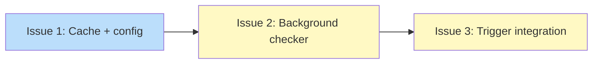

# DESIGN: Background update check infrastructure

## Status

Planned

## Implementation Issues

### Milestone: [Auto-update](https://github.com/tsukumogami/tsuku/milestone/109)

PLAN: `docs/plans/PLAN-background-update-checks.md` (single-pr mode, 3 issues)

### Dependency Graph



**Legend**: Blue = ready, Yellow = blocked

## Context and Problem Statement

Feature 1 established channel-aware version resolution: `ResolveWithinBoundary` respects pin boundaries, `CachedVersionLister` derives latest from cached lists, and `PinLevelFromRequested` computes pin levels at runtime. But there's no way to trigger these checks automatically. Users must run `tsuku outdated` manually, and no cached results exist for downstream features to consume.

The auto-update system needs plumbing that runs checks in the background without adding latency to shell prompts or tool execution. Three trigger entry points (shell hook, shim invocation, direct command) must coordinate to avoid duplicate checks while ensuring timely detection. The background process must query all installed tools' version providers, write structured results to a cache, and respect a configurable check interval.

This design covers PRD requirements R4 (time-cached checks), R5 (layered triggers), and the R19 cross-cutting constraint (zero added latency). It produces the cache that Feature 3 (auto-apply), Feature 5 (notifications), and Feature 6 (outdated polish) consume.

## Decision Drivers

- **Prompt latency budget**: The shell hook fires on every prompt. Any staleness check must complete in <5ms. Network I/O is forbidden on this path.
- **Existing patterns**: The codebase has advisory file locking (`internal/install/filelock.go`), per-provider version caching (`internal/version/cache.go`), and fire-and-forget telemetry (`internal/telemetry/client.go`). The design should compose these, not invent new infrastructure.
- **Downstream consumers**: Feature 3 reads check results to decide what to install. Feature 5 reads them to decide what to display. Feature 6 uses both within-pin and overall versions for dual-column outdated. The cache schema must serve all three.
- **Concurrent access**: Shell hooks, shim invocations, and direct commands can all trigger checks simultaneously. The system must handle this without lock contention or lost updates.
- **Configuration surface**: Users need to control check frequency, enable/disable, and opt out in CI. The config must follow existing patterns in `internal/userconfig/`.

## Decisions Already Made

These choices were settled during exploration and should be treated as constraints:

- **Per-tool cache files** at `$TSUKU_HOME/cache/updates/<toolname>.json` over a single aggregate file. Avoids lock contention on concurrent writes, matches the version cache precedent.
- **Advisory flock for spawn dedup** via existing `filelock.go`. Kernel-managed, auto-cleanup on crash, <1ms non-blocking check. Matches LLM lifecycle pattern.
- **Separate detached process** over goroutine. `hook-env` exits immediately after printing shell code and cannot hold goroutines. `exec.Command().Start()` spawns a process that survives the parent.
- **New hidden `tsuku check-updates` subcommand** as the background process entry point. Dedicated, not piggybacked on existing commands.
- **Shared `CheckUpdateStaleness` function** in `internal/updates/` called by all three trigger layers.
- **Notification throttle state in `$TSUKU_HOME/notices/`**, not in the check cache. Keeps the cache focused on "what's available."
- **Config follows LLMConfig pattern**: pointer types for optional values, getter methods checking env vars first.

## Considered Options

### Decision 1: Cache schema and staleness model

The trigger layer (shell hook, shim, direct command) needs to determine "has enough time passed since the last check?" in under 5ms. But with per-tool cache files, a naive approach would stat every file -- O(N) for N installed tools. The schema also needs to store enough information for three downstream consumers: Feature 3 (auto-apply) needs the available version within pin boundaries, Feature 5 (notifications) needs a list of what's available, and Feature 6 (outdated polish) needs both within-pin and overall latest versions.

Key assumptions:
- Tool names are kebab-case and filesystem-safe (no hashing needed, unlike the version cache's SHA256 approach for freeform source descriptions).
- Feature 3 re-resolves download URLs at install time. The check cache stores resolved versions but not download metadata.
- The `Requested` field must be stored in the cache for pin-change detection: if a user changes their pin after a check, the cache is logically stale even if the sentinel is fresh.

#### Chosen: Per-tool files with sentinel for global staleness

Each tool gets its own file at `$TSUKU_HOME/cache/updates/<toolname>.json` with an `UpdateCheckEntry` struct: tool name, active version, requested constraint, latest within pin, latest overall, source, checked-at, expires-at, and optional error. A separate empty sentinel file at `$TSUKU_HOME/cache/updates/.last-check` tracks global staleness via its mtime. The trigger layer does a single `os.Stat` on the sentinel.

The background process writes per-tool files atomically (temp+rename), then touches the sentinel after all tools are processed. If the process crashes between writing tools and touching the sentinel, the sentinel is stale but tool files are fresh -- this triggers a redundant re-check, not data loss.

#### Alternatives considered

- **Directory mtime for global staleness**: Stats the `cache/updates/` directory instead of a sentinel file. Rejected because directory mtime semantics vary across filesystems -- renaming a file within a directory may not update the directory mtime on all POSIX implementations. Correctness can't depend on filesystem implementation details.
- **Metadata JSON file**: A `.meta.json` file with structured data (tool list, check duration, timestamp). Rejected because reading and parsing JSON adds ~0.5-1ms, eating into the 5ms budget. The trigger only needs "has enough time passed?" -- a stat is enough.
- **In-progress sentinel**: Sentinel written at check start with "in-progress" marker, updated to "complete" on finish. Rejected because the exploration already decided on advisory flock for dedup, making the in-progress state redundant. Adds parse complexity for no benefit.

### Decision 2: Trigger integration and spawn protocol

Three code paths need to trigger update checks: `hook-env` (runs on every prompt), `tsuku run` (shim invocations), and direct commands (`install`, `list`, etc.). Each needs identical behavior: check staleness, attempt flock, spawn if needed. The question is how to package this logic and where to integrate it.

Key assumptions:
- `os.Args[0]` resolves to the tsuku binary in all three trigger contexts.
- The `internal/install.FileLock` type will gain `TryLockExclusive()` or the function uses raw `syscall.Flock` directly (matching the LLM lifecycle pattern).
- Config loading in PersistentPreRun is fast (<1ms, cached or already loaded).

#### Chosen: Package-level CheckAndSpawnUpdateCheck function

A single `updates.CheckAndSpawnUpdateCheck(cfg)` function encapsulates the full stat-flock-spawn protocol. Three call sites:

1. **hook-env.go**: after `ComputeActivation()`, before the nil check. Runs on every prompt regardless of directory change.
2. **cmd_run.go**: after config load, before `runner.Run()`. Covers both shim and direct `tsuku run`.
3. **PersistentPreRun**: with a skip list (`check-updates`, `hook-env`, `run`, `help`, `version`, `completion`). Covers all other direct commands.

The spawn protocol inside the function: stat sentinel (<0.5ms) -> if fresh, return -> open lock file -> non-blocking flock (LOCK_EX|LOCK_NB) -> if held, return (check running) -> release probe lock -> `exec.Command(os.Args[0], "check-updates").Start()` -> return. Total cost: <2ms on the stale+spawn path, <0.5ms on the fresh path.

**Cross-validation reconciliation:** The original decision referenced `update-check.json` and `update-check.lock` paths from before D1's sentinel model was chosen. Reconciled to use D1's paths: sentinel at `cache/updates/.last-check`, lock at `cache/updates/.lock`.

#### Alternatives considered

- **UpdateTrigger struct**: A struct with `ShouldCheck()` and `SpawnIfNeeded()` methods. Rejected because nobody needs `ShouldCheck()` alone -- checking without spawning has no use case. Adds API surface without benefit for three identical call sites.
- **Split functions (bool + spawn)**: `CheckUpdateStaleness() bool` plus `SpawnUpdateCheck()`. Rejected because callers must always pair the two calls; forgetting `SpawnUpdateCheck` silently drops updates. The protocol can't be enforced at compile time.
- **PersistentPreRun only**: Single call site covering all commands. Rejected because it runs on `check-updates` itself (the background process would trigger itself), `help`, and `version`. Exclusion lists are worse than three explicit call sites.

### Decision 3: Configuration surface

The PRD specifies five configuration keys for update behavior, three environment variable overrides, and CI detection. The config layer needs to follow existing patterns while supporting the precedence chain: CLI flag > env var > .tsuku.toml > config.toml > default.

Key assumptions:
- `TSUKU_NO_UPDATE_CHECK=1` is a kill switch for checks only. It doesn't affect `tsuku update` (explicit manual command) or `tsuku outdated`.
- `TSUKU_AUTO_UPDATE=1` only overrides CI suppression of auto-apply. It doesn't force-enable updates if the user set `enabled = false`.
- CLI flags and `.tsuku.toml` precedence are handled at call sites, not in the config layer.

#### Chosen: Flat struct with getter methods (LLMConfig pattern)

An `UpdatesConfig` struct with `*bool` and `*string` pointer fields, nested in the existing `userconfig.Config`. Five getter methods on `Config` check env vars first, then config value, then return defaults. Pointer types distinguish "not set" from "set to default" for TOML serialization.

Fields: `enabled` (*bool, default true), `auto_apply` (*bool, default true), `check_interval` (*string, default "24h"), `notify_out_of_channel` (*bool, default true), `self_update` (*bool, default true). The `UpdatesAutoApplyEnabled()` getter handles CI detection: suppressed when `CI=true` unless `TSUKU_AUTO_UPDATE=1` overrides. The `UpdatesCheckInterval()` getter clamps out-of-range values (1h-30d) with warnings.

#### Alternatives considered

- **Full resolver struct**: A `ResolveUpdatesConfig` function taking CLI flags, env vars, project config, and user config as inputs. Rejected because no precedent exists for this pattern in the codebase. LLMConfig, telemetry, and auto_install_mode all use the getter pattern. Introducing a new pattern for one config section creates inconsistency.
- **Separate middleware layer**: An `updateconfig` package wrapping `UpdatesConfig` with env var resolution. Rejected because it splits one concern across two packages for no practical gain, and is inconsistent with how LLMConfig embeds env var checks directly in getter methods.
- **Non-pointer fields with sentinel values**: Plain `bool` types. Rejected because Go's zero value for `bool` is `false`, making it impossible to distinguish "user set false" from "user didn't set anything." For `enabled` (default `true`), a zero value would incorrectly disable updates.

## Decision Outcome

The three decisions form a layered system: a cache layer that stores results, a trigger layer that detects staleness and launches checks, and a config layer that controls behavior.

The background process (`tsuku check-updates`, a hidden subcommand) acquires an advisory flock on `$TSUKU_HOME/cache/updates/.lock`, iterates all installed tools with a 10-second context deadline, calls `ResolveWithinBoundary` and `ResolveLatest` via ProviderFactory for each, and writes per-tool JSON files atomically to `$TSUKU_HOME/cache/updates/<toolname>.json`. After all tools are processed, it touches the `.last-check` sentinel and releases the flock. Per-tool files store the active version, requested pin constraint, latest-within-pin version, latest-overall version, source description, and timestamps. The `Requested` field enables pin-change detection: Feature 3 compares it against current state.json to detect logical staleness even when the sentinel mtime is fresh.

The trigger layer is a single `updates.CheckAndSpawnUpdateCheck(cfg)` function called at three sites: after `ComputeActivation` in hook-env (every prompt), after config load in `tsuku run` (shim invocations), and in PersistentPreRun with a skip list (all other commands). The function stats the sentinel (<0.5ms), returns immediately if fresh, attempts a non-blocking flock (<0.1ms), returns if held (check already running), then spawns a detached `tsuku check-updates` process via `exec.Command().Start()`. Total hot-path cost: <0.5ms when fresh, <2ms when spawning.

Configuration lives in a `[updates]` section of config.toml with five keys matching the LLMConfig pattern. Getter methods check env vars first (`TSUKU_NO_UPDATE_CHECK`, `TSUKU_AUTO_UPDATE`, `TSUKU_UPDATE_CHECK_INTERVAL`), then config values, then defaults. CI environments (`CI=true`) suppress auto-apply unless explicitly overridden. The check interval is clamped to 1h-30d with warnings for out-of-range values.

The cross-validation between D1 and D2 caught a path mismatch: D2 originally referenced a single `update-check.json` file from before D1's per-tool schema was chosen. The reconciled design uses D1's sentinel model throughout -- the trigger stats `.last-check`, not a per-tool file.

Note: `ListVersions` returns `[]string` (version strings), not `[]*VersionInfo`. When the background process finds a newer version within the pin boundary, it stores the version string in the cache. Feature 3 calls `provider.ResolveVersion(ctx, version)` to get the full `*VersionInfo` with download URLs and checksums at install time.

## Solution Architecture

### Overview

Three components compose the solution: a trigger function that runs at three sites in the tsuku binary, a hidden subcommand that performs the actual checks, and per-tool cache files that store results. No new packages beyond `internal/updates/` are needed. The config surface extends `internal/userconfig/` with five fields.

### Components

**`internal/updates/trigger.go`** (new file)
- `CheckAndSpawnUpdateCheck(cfg *config.Config, userCfg *userconfig.Config) error` -- the single entry point for all triggers. Stats the sentinel, checks config, attempts non-blocking flock, spawns detached process if needed.
- `isCheckStale(cacheDir string, interval time.Duration) bool` -- stats `.last-check` sentinel.
- `spawnChecker(tsukuBinary string, cacheDir string) error` -- flock probe + detached `exec.Command().Start()`.

**`internal/updates/checker.go`** (new file)
- `RunUpdateCheck(ctx context.Context, cfg *config.Config) error` -- the background process entry point. Acquires flock, iterates installed tools, queries providers, writes per-tool cache files, touches sentinel.
- `checkTool(ctx context.Context, tool install.ToolInfo, state *install.State, factory *version.ProviderFactory, res *version.Resolver, cacheDir string) error` -- checks a single tool and writes its cache file.

**`internal/updates/cache.go`** (new file)
- `UpdateCheckEntry` struct (schema from Decision 1)
- `ReadEntry(cacheDir, toolName string) (*UpdateCheckEntry, error)` -- reads a single tool's cache
- `ReadAllEntries(cacheDir string) ([]UpdateCheckEntry, error)` -- scans directory for Feature 5/6
- `WriteEntry(cacheDir string, entry *UpdateCheckEntry) error` -- atomic temp+rename write
- `TouchSentinel(cacheDir string) error` -- updates `.last-check` mtime

**`cmd/tsuku/cmd_check_updates.go`** (new file)
- Hidden `check-updates` subcommand registered in cobra
- Calls `updates.RunUpdateCheck` with a 10-second context deadline
- Stdout/stderr silenced (background process, no user output)

**`internal/userconfig/userconfig.go`** (modified)
- `UpdatesConfig` struct added to `Config`
- Five getter methods: `UpdatesEnabled()`, `UpdatesAutoApplyEnabled()`, `UpdatesCheckInterval()`, `UpdatesNotifyOutOfChannel()`, `UpdatesSelfUpdate()`
- `Get`/`Set`/`AvailableKeys` extended for `updates.*` keys

**`cmd/tsuku/hook_env.go`** (modified)
- One line added after `ComputeActivation`: `_ = updates.CheckAndSpawnUpdateCheck(cfg, userCfg)`

**`cmd/tsuku/cmd_run.go`** (modified)
- One line added after config load: `_ = updates.CheckAndSpawnUpdateCheck(cfg, userCfg)`

**`cmd/tsuku/main.go`** (modified)
- PersistentPreRun extended with skip-list-gated call to `CheckAndSpawnUpdateCheck`

### Key Interfaces

No interface changes. The existing `VersionResolver`, `VersionLister`, and `ProviderFactory` interfaces are used as-is. The new code composes them through `ResolveWithinBoundary` (from Feature 1) and `ResolveLatest`.

```go
// New types -- not interfaces, just data
type UpdateCheckEntry struct {
    Tool            string    `json:"tool"`
    ActiveVersion   string    `json:"active_version"`
    Requested       string    `json:"requested"`
    LatestWithinPin string    `json:"latest_within_pin,omitempty"`
    LatestOverall   string    `json:"latest_overall"`
    Source          string    `json:"source"`
    CheckedAt       time.Time `json:"checked_at"`
    ExpiresAt       time.Time `json:"expires_at"`
    Error           string    `json:"error,omitempty"`
}

// New function -- the single trigger entry point
func CheckAndSpawnUpdateCheck(cfg *config.Config, userCfg *userconfig.Config) error
```

### Data Flow

```
Shell prompt fires
  |
  v
hook-env.go calls CheckAndSpawnUpdateCheck(cfg, userCfg)
  |
  v
isCheckStale: os.Stat("$TSUKU_HOME/cache/updates/.last-check")
  |
  +-- fresh (mtime < interval): return (cost: <0.5ms)
  |
  +-- stale or missing:
        |
        v
      spawnChecker: open ".lock", non-blocking flock(LOCK_EX|LOCK_NB)
        |
        +-- lock held (EWOULDBLOCK): return (check already running, cost: <1ms)
        |
        +-- lock acquired: release probe lock, exec.Command("tsuku", "check-updates").Start()
              |
              v
            Background process (tsuku check-updates):
              1. Acquire exclusive flock on ".lock" (blocking)
              2. Re-check sentinel freshness (double-check after lock)
              3. ctx := context.WithTimeout(10s)
              4. Load state.json -> list installed tools
              5. For each tool (parallel, bounded concurrency):
                   a. Load recipe via loadRecipeForTool
                   b. ProviderFactory.ProviderFromRecipe -> provider
                   c. ResolveWithinBoundary(ctx, provider, requested) -> withinPin
                   d. provider.ResolveLatest(ctx) -> overall
                   e. WriteEntry(cacheDir, &UpdateCheckEntry{...})
              6. TouchSentinel(".last-check")
              7. Release flock, exit
```

## Implementation Approach

### Phase 1: Cache and config

Add the `UpdateCheckEntry` struct, read/write/remove functions, and sentinel management in `internal/updates/cache.go`. Include `RemoveEntry` so `tsuku remove` can clean up stale cache entries. Add the `UpdatesConfig` struct and getter methods to `internal/userconfig/userconfig.go`. Unit tests for both.

Deliverables:
- `internal/updates/cache.go` (includes `ReadEntry`, `ReadAllEntries`, `WriteEntry`, `RemoveEntry`, `TouchSentinel`)
- `internal/updates/cache_test.go`
- `internal/userconfig/userconfig.go` (modified)
- `internal/userconfig/userconfig_test.go` (updated)

### Phase 2: Background checker

Add `internal/updates/checker.go` with `RunUpdateCheck` and the hidden `cmd/tsuku/cmd_check_updates.go` subcommand. The checker iterates tools, queries providers, writes cache files. Integration tests with mock providers.

Deliverables:
- `internal/updates/checker.go`
- `internal/updates/checker_test.go`
- `cmd/tsuku/cmd_check_updates.go`

### Phase 3: Trigger integration

Add `internal/updates/trigger.go` with `CheckAndSpawnUpdateCheck`. Prerequisite: add `TryLockExclusive() (bool, error)` to `internal/install/filelock.go` (with implementations in `filelock_unix.go` and `filelock_windows.go`) for non-blocking flock probes. Wire the trigger into hook-env.go (adding `userconfig.Load()` call), cmd_run.go, and PersistentPreRun. Note: verify no subcommands override PersistentPreRun, or use explicit chaining to avoid silent skips. Integration tests verifying the stat-flock-spawn protocol.

Deliverables:
- `internal/install/filelock.go` (modified: add `TryLockExclusive`)
- `internal/install/filelock_unix.go` (modified)
- `internal/install/filelock_windows.go` (modified)
- `internal/updates/trigger.go`
- `internal/updates/trigger_test.go`
- `cmd/tsuku/hook_env.go` (modified: add `userconfig.Load()` + trigger call)
- `cmd/tsuku/cmd_run.go` (modified)
- `cmd/tsuku/main.go` (modified)

## Security Considerations

**Flock file as a denial-of-service vector.** An attacker with write access to `$TSUKU_HOME/cache/updates/` could hold the flock indefinitely, preventing all update checks. This is bounded by the same-user permission model: the flock file is owned by the user, and an attacker with that level of access already has full control over the user's tools. No mitigation beyond the existing filesystem permission model.

**Cache poisoning via writable cache directory.** If an attacker can write to `$TSUKU_HOME/cache/updates/`, they could inject false version availability data (claiming a newer version exists when it doesn't, or that the current version is latest when it isn't). Feature 3 (auto-apply) would then either skip legitimate updates or attempt to install non-existent versions. This is the same threat model as the version cache poisoning noted in DESIGN-channel-aware-resolution.md. Mitigations: download-time checksum verification (for recipes that define checksums), and the cache lives under the user's home directory with standard permissions.

**Background process inherits parent environment.** The spawned `tsuku check-updates` process inherits all environment variables from the parent (shell hook or command). This includes `TSUKU_HOME`, `PATH`, and any secrets in the environment. Since the process is the same tsuku binary running as the same user, this is expected behavior, not an escalation.

**Upstream provider trust.** A compromised version registry (GitHub API, PyPI, npm) could return fabricated version numbers. The check phase faithfully stores whatever the provider returns. The real defense is Feature 3's download-time checksum verification -- but only for recipes that define per-version checksums. Recipes with dynamic URL templates and no checksums have zero integrity protection in the full check-then-apply pipeline. This isn't a new vulnerability (manual `tsuku update` already trusts provider responses), but background checks increase the attack surface by automating the query cadence.

**Data exposure from automated checks.** The background process sends HTTP requests to version providers on a recurring schedule, revealing which tools are installed and that tsuku is in use. Cache files on disk (`<toolname>.json` filenames) enumerate the user's toolchain. For users in regulated or air-gapped environments, `TSUKU_NO_UPDATE_CHECK=1` provides a full opt-out. This is equivalent to what `tsuku outdated` already does manually, but now automated.

**No network traffic in the trigger path.** The trigger function (stat + flock + spawn) performs zero network I/O. All network activity happens in the background process. This means a compromised DNS or network stack cannot add latency to the user's shell prompt.

## Consequences

### Positive

- Update checks happen automatically without user intervention, once shell integration is enabled
- The <2ms trigger cost is well within the 5ms budget and imperceptible to users
- Per-tool cache files enable independent reads by downstream features without lock contention
- The sentinel model gives O(1) global staleness detection regardless of how many tools are installed
- Existing patterns (filelock, version cache, LLMConfig) are reused without new abstractions
- The hidden `check-updates` subcommand can be called manually for debugging

### Negative

- Users without shell integration only get checks when they run tsuku commands directly, which may be infrequent
- The background process checks all installed tools, even ones the user hasn't used recently, consuming network resources
- Per-tool cache files create O(N) filesystem entries that need eventual cleanup
- The 10-second timeout means users with many tools and slow providers may get incomplete check results

### Mitigations

- The installer recommends enabling shell integration, and `tsuku hook status` shows whether it's active
- Checking all tools is the simplest correct behavior. A "recently used" heuristic could be added later without schema changes (the cache files already have timestamps)
- Cache cleanup is Feature 7's responsibility (old version retention and garbage collection). Per-tool files are small (~200 bytes each)
- The 10-second timeout applies to the entire check run. Tools are checked in parallel with bounded concurrency, so most users won't hit the limit. If a check is interrupted, completed tools still have fresh cache entries

### Resilience to corruption

The update check infrastructure is self-healing: any missing or corrupt state triggers a fresh check cycle rather than a crash or degraded tool execution. No corruption scenario blocks normal tsuku operation.

- **Sentinel missing or unreadable**: `isCheckStale` returns `true` on any `os.Stat` error, treating it as "never checked." The next trigger spawns a fresh check that recreates the sentinel.
- **Per-tool cache files missing**: Consumers (`ReadEntry`, `ReadAllEntries`) treat a missing file as "no check result for this tool" and skip it. The next background check writes a fresh entry.
- **Per-tool cache files corrupt** (invalid JSON, partial write from a previous crash): `json.Unmarshal` fails, `ReadEntry` returns an error, consumers skip the entry. The next background check overwrites the file with valid data via atomic temp+rename.
- **Lock file missing**: `filelock.go` creates it with `O_CREATE` on the next lock attempt. Advisory flock state is kernel-managed, not dependent on file contents.
- **Cache directory missing**: Both `CheckAndSpawnUpdateCheck` and `RunUpdateCheck` call `os.MkdirAll` before any file operations, recreating the directory structure.
- **Atomic writes prevent partial corruption**: All cache file writes use temp-file-then-rename. A crash mid-write leaves either the previous valid file or no file -- never a half-written JSON blob.

The general principle: every read path tolerates missing or malformed data by falling back to "stale" or "unknown," and every write path recreates missing infrastructure. The system converges to a correct state within one check cycle after any corruption event.
