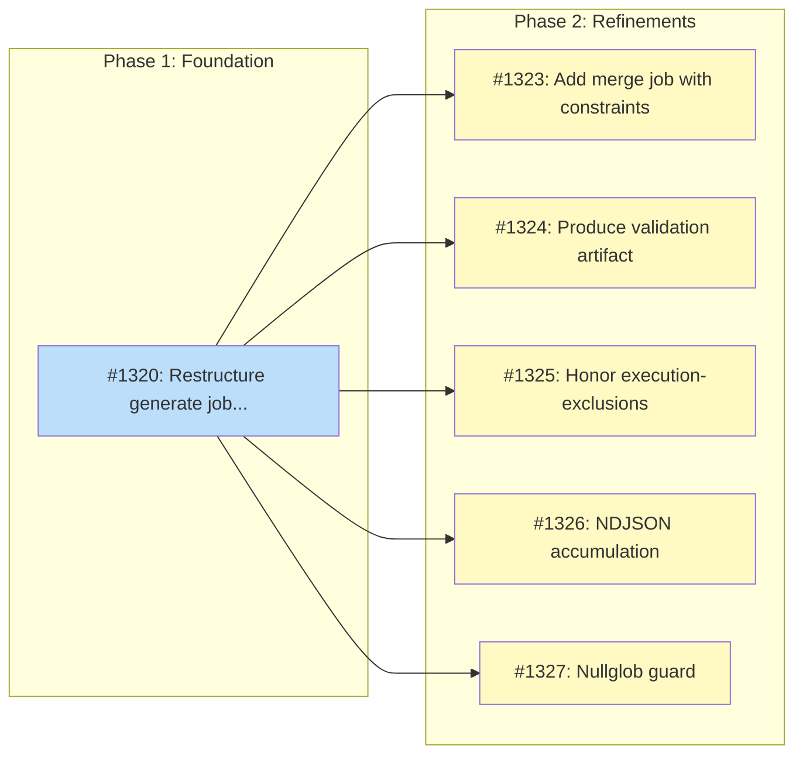

# Batch Multi-Platform Validation

## Status

Planned

## Implementation Issues

### Milestone: [Batch Multi-Platform Validation](https://github.com/tsukumogami/tsuku/milestone/60)

| Issue | Dependencies | Tier |
|-------|--------------|------|
| [#1320: ci(batch): restructure generate job and add platform validation jobs](https://github.com/tsukumogami/tsuku/issues/1320) | None | testable |
| _Split the generate job so it uploads passing recipes as artifacts, add four validation jobs (two Linux with 5-family Docker containers each, two macOS native), and cross-compile tsuku binaries for all target platforms._ | | |
| [#1323: ci(batch): add merge job with platform constraint derivation](https://github.com/tsukumogami/tsuku/issues/1323) | [#1320](https://github.com/tsukumogami/tsuku/issues/1320) | testable |
| _With validation results from all 11 environments available, aggregate pass/fail into a result matrix, derive `supported_os`/`supported_libc`/`unsupported_platforms` constraints for partial-coverage recipes, and create the PR with accurate metadata._ | | |
| [#1324: ci(batch): produce generate job validation result artifact](https://github.com/tsukumogami/tsuku/issues/1324) | [#1320](https://github.com/tsukumogami/tsuku/issues/1320) | testable |
| _The generate job already validates on linux-debian-glibc-x86_64 but doesn't emit a structured result artifact. Add JSON output so the merge job can include generation-time results in its platform matrix._ | | |
| [#1325: ci(batch): honor execution-exclusions.json in validation jobs](https://github.com/tsukumogami/tsuku/issues/1325) | [#1320](https://github.com/tsukumogami/tsuku/issues/1320) | testable |
| _Some recipes can't be tested in CI (e.g., they require interactive input). Load `data/execution-exclusions.json` in each validation job and skip listed recipes, matching the behavior of `test-changed-recipes.yml`._ | | |
| [#1326: ci(batch): use NDJSON accumulation in validation loops](https://github.com/tsukumogami/tsuku/issues/1326) | [#1320](https://github.com/tsukumogami/tsuku/issues/1320) | simple |
| _Replace the current pattern of building a JSON array in a shell variable with append-per-line NDJSON, avoiding shell quoting issues and memory growth for large batches._ | | |
| [#1327: ci(batch): add nullglob guard for recipe collection](https://github.com/tsukumogami/tsuku/issues/1327) | [#1320](https://github.com/tsukumogami/tsuku/issues/1320) | simple |
| _When no recipes match a glob pattern, bash expands the literal glob string into the loop. Add `shopt -s nullglob` so empty matches produce an empty list instead of a spurious iteration._ | | |

### Dependency Graph



**Legend**: Green = done, Blue = ready, Yellow = blocked, Purple = needs-design

## Upstream Design Reference

This design implements the platform validation jobs (Job 3) and merge job platform-constraint writing (Job 4) from [DESIGN-batch-recipe-generation.md](DESIGN-batch-recipe-generation.md).

**Relevant sections:**
- Job Architecture (Jobs 3-4)
- Decision 2A: Progressive validation strategy
- Validation Flow: Platform promotion logic

## Context and Problem Statement

The batch recipe generation pipeline creates recipes from ecosystem package managers (Homebrew, npm, crates.io, etc.) and validates them on a single platform: Linux x86_64 glibc on `ubuntu-latest`. Recipes that pass get included in an auto-generated PR.

These recipes claim to support all platforms by default. A recipe's `os_mapping` and `arch_mapping` resolve to platform-specific download URLs at install time, but nobody verifies those URLs point to working binaries on each platform. Homebrew bottles resolve differently per linux family (debian, rhel, arch, suse, alpine), so a recipe that works on debian may fail on fedora due to different bottle availability or shared library dependencies. When a user on macOS, ARM64, or a non-debian distro runs `tsuku install helm`, the recipe may download a binary that doesn't exist, is the wrong architecture, or fails to execute.

Manually-submitted recipe PRs already get multi-platform validation via `test-changed-recipes.yml`, which runs `tsuku install` on Linux (per-recipe matrix) and macOS (aggregated). But batch-generated PRs skip this effective validation because the batch workflow creates the PR after only Linux x86_64 testing. The PR does trigger `test-changed-recipes.yml`, but auto-merge can happen before those checks complete if the merge job doesn't wait for them.

The core question is where multi-platform validation should happen: inside the batch workflow (before creating the PR) or via PR CI (after creating the PR, before merge).

### Scope

**In scope:**
- Platform validation for batch-generated recipes across 11 target environments (4 linux x86_64 families + 4 linux arm64 families + 1 alpine musl shared + 2 macOS). Note: `archlinux:base` has no ARM64 container image, so arch is x86_64 only.
- Platform constraint writing for partial-coverage recipes
- Integration with the merge job (Job 4) from the batch design

**Out of scope:**
- Sandbox container validation for non-homebrew builders (#1287)
- Circuit breaker integration (#1255)
- SLI metrics collection (#1257, consumes platform results but is separate)
- PR-time golden file diff validation for new registry recipes (separate concern; new recipes can't have diff-based regression detection without a baseline, and execution validation already happens via `test-changed-recipes.yml`)
- Progressive validation (gating macOS jobs on Linux results). All 4 jobs run on the same recipe set in parallel. Progressive filtering can be added later if macOS budget becomes a problem.

## Decision Drivers

- **macOS CI budget**: 1000 minutes/week. macOS runners cost 10x Linux. A 25-recipe batch uses ~110 macOS minutes (2 jobs); Linux jobs are cheap regardless of family count since containers run on the same runner.
- **Progressive savings**: Most failures are platform-independent (bad URL patterns, missing deps). Catching them on Linux first avoids spending macOS minutes on known-broken recipes.
- **Partial coverage acceptable**: A recipe that works on Linux but not macOS is still useful to Linux users. Better to merge with accurate constraints than discard entirely.
- **Platform constraint timing**: The merge job needs to know which platforms each recipe supports so it can write `supported_os`/`unsupported_platforms` fields before creating the PR.
- **Consistency**: Batch and manual recipe PRs should ideally use the same validation, or at least produce equivalent results.
- **CLI boundary**: The batch pipeline shells out to `tsuku` CLI commands, exercising the same code path users run.

## Implementation Context

### Existing Patterns

**Batch orchestrator** (`internal/batch/orchestrator.go`): Runs `tsuku create` then `tsuku install --force --recipe` sequentially per package. Classifies failures by exit code (5=network/retry, 8=missing dep, 9=deterministic insufficient). Records results to JSONL.

**Platform constraint fields** (`internal/recipe/platform.go`): Recipes support `supported_os`, `supported_arch`, `supported_libc`, and `unsupported_platforms`. The planner already respects these. Fully implemented.

**test-changed-recipes.yml**: Runs `tsuku install` on Linux (matrix per recipe) and macOS (aggregated) for PRs that change recipe files. Detects Linux-only recipes and skips macOS for them. Has execution-exclusions.json for recipes that can't be tested.

**publish-golden-to-r2.yml**: Generates golden files on 3 platforms post-merge and uploads to R2. Triggered automatically when recipe files change on main.

### Conventions to Follow

- Workflow jobs pass data via uploaded artifacts
- Failure JSONL uses `schema_version` field and structured categories
- Environment names: `{os}-{libc}-{arch}` (e.g., `linux-glibc-x86_64`)
- All validation jobs always run (no skip flags)

## Considered Options

### Decision 1: Where to run multi-platform validation

The batch workflow currently validates recipes only on Linux x86_64 glibc before creating a PR. Multi-platform validation needs to happen somewhere, and the key question is whether it belongs inside the batch workflow (before the PR exists) or in PR CI (after the PR is created).

The answer depends on when platform results are needed. The merge job must write `supported_os`, `supported_libc`, and `unsupported_platforms` fields to recipe TOML before creating the PR, which means it needs structured per-platform pass/fail data. It also needs to support partial coverage -- a recipe that works on Linux but not macOS should still ship with a `supported_os = ["linux"]` constraint rather than blocking the entire batch.

#### Chosen: Platform matrix jobs in batch workflow

Add four validation jobs to `batch-generate.yml` that run after generation. The x86_64 Linux job runs 5 family containers (debian, rhel, arch, suse, alpine); the arm64 job runs 4 (arch excluded -- no ARM64 image). Each macOS job validates directly on the runner. All jobs produce JSON artifacts with per-recipe, per-family pass/fail results. The merge job collects all results, writes constraints for partial-coverage recipes, and creates the PR.

This gives 11 target environments using only 4 workflow jobs. All jobs run in parallel on the full recipe set; progressive filtering (gating macOS on Linux results) is deferred until macOS budget pressure warrants it. The main trade-off is maintaining two parallel multi-platform validation systems (batch workflow and `test-changed-recipes.yml`), but they serve different purposes -- batch produces structured results for constraint writing, PR CI validates the final constrained recipes.

#### Alternatives Considered

**PR CI reuse**: The batch merge job creates a PR with all Linux-passing recipes, and `test-changed-recipes.yml` (which already watches `recipes/**/*.toml`) validates them. Rejected because `test-changed-recipes.yml` doesn't produce structured per-platform results the merge job can consume, a single macOS failure blocks the entire batch PR with no partial-coverage support, and it only tests on `ubuntu-latest` and `macos-latest` (no ARM64, musl, or non-debian family coverage).

**Tiered validation (plans + URL pre-filter)**: Generate installation plans on a single Linux runner using `tsuku eval`, check that download URLs return HTTP 200, then promote to install validation on a subset of platforms. Rejected because plan generation misses runtime failures (wrong binary format, missing shared libs), and the install subset still requires the same runner infrastructure as the chosen approach. Could be added later as an optimization layer.

**Container matrix on Linux only**: Run all validations inside Docker containers using QEMU for ARM64 emulation, skipping macOS entirely. Rejected because QEMU emulation is unreliable, macOS binaries can't be validated in Linux containers (different binary format, dylibs, codesigning), and marking everything Linux-only defeats multi-platform support.

### Uncertainties

- ARM64 runner availability on GitHub Actions (`ubuntu-24.04-arm` is relatively new)
- What fraction of failures are platform-independent vs platform-specific (determines progressive savings)
- How many recipes will need partial-coverage constraints in practice

## Decision Outcome

**Chosen: Platform matrix jobs in batch workflow**

### Summary

The batch workflow gains four platform validation jobs that run after recipe generation. The x86_64 Linux job (on `ubuntu-latest`) spins up five Docker containers sequentially -- debian, fedora, archlinux, opensuse, and alpine. The arm64 Linux job (on `ubuntu-24.04-arm`) runs four containers -- the same minus archlinux, which has no ARM64 image. Two macOS jobs (arm64 on `macos-14`, x86_64 on `macos-13`) run the same install command natively. This produces 11 target environments from 4 workflow jobs, with each job uploading a `validation-results-<platform>.json` artifact containing per-recipe, per-family pass/fail records.

The generate job cross-compiles tsuku binaries for all four runner platforms (`linux-amd64`, `linux-arm64`, `darwin-arm64`, `darwin-amd64`) and uploads them alongside the passing recipes. Each validation job downloads these artifacts, so there's no redundant compilation. Per-recipe timeouts of 5 minutes and per-job timeouts of 120 minutes bound resource consumption. Network errors (exit code 5) get up to 3 retries with exponential backoff; all other failures are recorded immediately.

The merge job runs after all four validation jobs complete (using `if: always()` to handle infrastructure failures). It downloads all result artifacts, builds a per-recipe, per-platform matrix, and categorizes each recipe: all 11 pass (no constraint changes), partial coverage (derive and write constraints), zero passes (exclude), or contains `run_command` (exclude as security gate). For partial-coverage recipes, a shell script `scripts/write-platform-constraints.sh` writes the minimum constraint set to the recipe TOML -- `supported_os = ["linux"]` when all macOS fails, `supported_libc = ["glibc"]` when all musl fails, or `unsupported_platforms` entries for finer-grained failures. The merge job then creates the PR with constrained recipes and appends platform failures to `data/failures/<eco>.jsonl`.

After the batch PR is created, `test-changed-recipes.yml` still triggers as a secondary validation layer. This provides defense-in-depth: the batch workflow catches platform issues and writes constraints, PR CI validates that the constrained recipes install correctly on the platforms they claim. No changes are needed to `test-changed-recipes.yml` for this to work.

### Rationale

The deciding factor is constraint timing. The merge job must write `supported_os`, `supported_libc`, and `unsupported_platforms` fields to recipe TOML before the PR exists, which requires structured per-platform results that only in-workflow validation can provide. PR CI reuse was the most attractive alternative (zero new infrastructure), but it produces pass/fail per-PR rather than per-recipe per-platform, and blocks the entire batch on any single failure.

The main cost is maintaining two parallel validation systems. This is acceptable because they serve different purposes: batch validation produces structured results for constraint derivation and supports partial-coverage merging, while PR CI validates the final constrained recipes as a safety net. The workflow grows from 1 job to 6, but the jobs are largely mechanical (download artifacts, run install in containers, upload results) and follow patterns already established in `platform-integration.yml`.

## Solution Architecture

### Overview

The batch workflow gains four platform validation jobs (one per target environment) and a merge job. The generation job (existing) validates on Linux x86_64 glibc and uploads passing recipes as artifacts. Platform jobs download those artifacts, validate on their target environment, and upload per-platform results. The merge job aggregates all results, writes platform constraints for partial-coverage recipes, and creates the PR.

### Workflow Structure

```
batch-generate.yml:

  preflight (#1252)
      │
  generate (existing, Linux x86_64 glibc/debian)
      │
      ├── validate-linux-x86_64   (ubuntu-latest, 5 family containers)
      ├── validate-linux-arm64    (ubuntu-24.04-arm, 5 family containers)
      ├── validate-darwin-arm64   (macos-14)
      └── validate-darwin-x86_64  (macos-13)
      │
  merge (aggregates results, writes constraints, creates PR)
```

Each Linux validation job runs all 5 family containers (debian, rhel, arch, suse, alpine) sequentially on the same runner using Docker, following the same pattern as `platform-integration.yml`'s alpine-arm64 job.

### Platform Job Specification

Each platform job:

1. Downloads recipe artifacts from the generation job
2. Builds or downloads `tsuku` for the target platform
3. Validates recipe paths contain no `..` segments (path traversal protection)
4. For each recipe, runs `tsuku install --force --recipe <path>` with a 5-minute per-recipe timeout
5. Classifies exit codes:
   - 0: pass
   - 5 (ExitNetwork): retry up to 3 times with exponential backoff (2s, 4s, 8s)
   - All other non-zero: fail (no retry)
   - Timeout: fail (no retry)
6. Writes results to `validation-results-<platform>.json`
7. Uploads results as workflow artifact
8. Total job timeout: 120 minutes (GitHub Actions `timeout-minutes`)

**Result artifact format:**
```json
[
  {"recipe": "helm", "platform": "linux-debian-glibc-arm64", "status": "pass", "exit_code": 0, "attempts": 1},
  {"recipe": "helm", "platform": "linux-rhel-glibc-arm64", "status": "pass", "exit_code": 0, "attempts": 1},
  {"recipe": "helm", "platform": "linux-alpine-musl-arm64", "status": "fail", "exit_code": 7, "attempts": 1},
  {"recipe": "xz", "platform": "linux-debian-glibc-arm64", "status": "fail", "exit_code": 7, "attempts": 1}
]
```

Platform IDs use the format `{os}-{family}-{libc}-{arch}` for Linux and `{os}-{arch}` for macOS.

### Platform Environments

| Job | Runner | Environments |
|-----|--------|-------------|
| generate (existing) | `ubuntu-latest` | `linux-debian-glibc-x86_64` |
| validate-linux-x86_64 | `ubuntu-latest` | 5 family containers: `linux-{debian,rhel,arch,suse}-glibc-x86_64`, `linux-alpine-musl-x86_64` |
| validate-linux-arm64 | `ubuntu-24.04-arm` | 4 family containers: `linux-{debian,rhel,suse}-glibc-arm64`, `linux-alpine-musl-arm64` (arch excluded -- no ARM64 image) |
| validate-darwin-arm64 | `macos-14` | `darwin-arm64` |
| validate-darwin-x86_64 | `macos-13` | `darwin-x86_64` |

**Container images for Linux family validation:**

| Family | Container Image | Libc |
|--------|----------------|------|
| debian | `debian:bookworm-slim` | glibc |
| rhel | `fedora:41` | glibc |
| arch | `archlinux:base` | glibc |
| suse | `opensuse/tumbleweed` | glibc |
| alpine | `alpine:3.21` | musl |

These are the same images used by `platform-integration.yml`. ARM64 variants exist for all except `archlinux:base`, which is x86_64-only. The arm64 validation job runs 4 families (excluding arch).

### Merge Job Logic

The merge job runs after all four platform validation jobs complete. All jobs always run — there are no skip flags.

1. **Downloads all result artifacts** from platform jobs
2. **Builds the result matrix**: per-recipe, per-platform pass/fail
3. **For each recipe**:
   - If passed all 11 environments: include in PR with no constraint changes
   - If passed some environments (partial coverage): write platform constraints to recipe TOML, include in PR
   - If passed only linux-debian-glibc-x86_64 (generation environment) and failed all validation environments: still include with restrictive constraints
   - If has `run_command` action: exclude from PR (security gate)
4. **Creates PR** with passing/constrained recipes, failure JSONL, and queue updates

### Platform Constraint Derivation

When a recipe has partial coverage, the merge job derives the minimum constraint set. The algorithm aggregates family-level results up to the dimensions that recipe constraints support (`supported_os`, `supported_libc`, `unsupported_platforms`).

**All macOS fails, all Linux passes:**
```
Passed: all 9 linux environments
Failed: darwin-arm64, darwin-x86_64

Result: supported_os = ["linux"]
```

**All musl fails (alpine on both architectures):**
```
Passed: 7 glibc environments + darwin-arm64, darwin-x86_64
Failed: linux-alpine-musl-x86_64, linux-alpine-musl-arm64

Result: supported_libc = ["glibc"]
```

**Specific family fails (e.g., arch has no bottle for this tool):**
```
Passed: all except arch
Failed: linux-arch-glibc-x86_64, linux-arch-glibc-arm64

Result: unsupported_platforms = ["linux/arch"]
```

**ARM64 fails across all families:**
```
Passed: all x86_64 linux + darwin environments
Failed: all arm64 linux environments

Result: unsupported_platforms = ["linux/arm64"]
```

The algorithm prefers broader constraints (`supported_os`) over fine-grained exclusions (`unsupported_platforms`) when the failure pattern aligns to a single dimension. When failures span multiple dimensions, it falls back to explicit per-platform exclusions. Family-level failures use the `unsupported_platforms` field with the `linux/{family}` format.

### Data Flow

```
generation job:
  → recipes/*.toml (new recipe files)
  → data/failures/<eco>.jsonl (generation failures)
  → artifact: passing-recipes (list of recipe paths)

platform jobs:
  ← artifact: passing-recipes
  → artifact: validation-results-<platform>.json

merge job:
  ← artifact: passing-recipes
  ← artifact: validation-results-* (all platforms)
  → recipes/*.toml (with platform constraints added)
  → data/failures/<eco>.jsonl (platform failures appended)
  → PR
```

## Implementation Approach

### Phase 1: Platform Validation Jobs (#1254)

Add the four platform validation jobs to `batch-generate.yml`:
- Retry logic for network errors
- Structured JSON result artifacts
- Job summaries in `$GITHUB_STEP_SUMMARY`

Dependencies: #1252 (preflight job provides recipe list)

### Phase 2: Merge Job with Constraint Writing (#1256)

Add the merge job that:
- Aggregates platform results
- Derives and writes platform constraints
- Creates the PR with accurate metadata

Dependencies: #1254 (platform validation results)

### Phase 3: Validation Coverage for Batch PRs

After the batch PR is created, `test-changed-recipes.yml` still triggers as a secondary validation layer. This provides defense-in-depth: the batch workflow catches platform issues and writes constraints, and PR CI validates that the constrained recipes install correctly on the platforms they claim to support.

No code changes needed for this phase; it's the existing behavior once the PR is created with proper constraints.

## Security Considerations

### Download Verification

Platform validation jobs run `tsuku install`, which downloads binaries from upstream sources (Homebrew bottles, GitHub releases, etc.). These downloads use the same checksum verification as normal installs: the recipe specifies expected checksums, and `tsuku install` verifies them after download.

The batch pipeline doesn't introduce new download sources or bypass existing verification. Platform jobs validate on real platforms, so any checksum mismatches surface as install failures.

### Execution Isolation

Platform validation runs on ephemeral GitHub Actions runners. Each job gets a fresh VM that's destroyed after the run. Installed binaries execute in the runner's user context with no elevated privileges.

The `run_command` security gate in the merge job prevents recipes with arbitrary command execution from being auto-merged. These require manual review.

### Supply Chain Risks

The platform validation jobs don't change the supply chain model. Recipes still download from the same upstream sources (GHCR for Homebrew bottles, GitHub releases, etc.). The validation adds defense: if an upstream binary is malformed or the wrong architecture for a platform, validation catches it before the recipe ships to users.

One risk specific to this design: the platform validation results determine which platforms a recipe claims to support. If a validation runner is compromised, it could report false passes, causing a broken recipe to ship. This is mitigated by the ephemeral runner model and by `test-changed-recipes.yml` running as a secondary check on the PR.

### Resource Exhaustion

A malicious or pathological recipe could consume excessive CI time (large downloads, slow extraction, infinite loops in post-install). Per-recipe timeouts (5 minutes) and per-job timeouts (120 minutes) bound the blast radius. The circuit breaker (#1255) will halt batch runs if failure rates spike, preventing runaway cost.

### User Data Exposure

Platform validation doesn't access or transmit user data. It runs in CI on synthetic environments. The only data produced is pass/fail results per recipe per platform, which are committed to the public repository as failure JSONL and reflected in recipe metadata.

## Consequences

### Positive

- Users on all supported platforms (macOS, ARM64, musl, and every linux family) get recipes that are proven to work on their platform
- Partial-coverage recipes have accurate metadata, so `tsuku install` can give a clear "not supported on this platform" error instead of a cryptic download failure
- Platform failures are caught before merge, not discovered by users
- Failure JSONL provides data for analyzing which ecosystems have platform-specific issues

### Negative

- Batch workflow wall-clock time increases (platform validation runs in parallel but adds ~10 minutes for macOS)
- macOS CI budget consumed by validation (~110 minutes per 25-recipe batch across 2 macOS jobs)
- Linux jobs take longer due to sequential family container testing (5 families per recipe per runner)
- Two multi-platform validation systems to maintain (`batch-generate.yml` and `test-changed-recipes.yml`)

### Mitigations

- Progressive validation minimizes macOS cost (only recipes that pass Linux get promoted)
- `test-changed-recipes.yml` on the PR provides defense-in-depth without additional cost (it runs anyway)
- The two validation systems serve different purposes: batch produces structured per-platform results for constraint writing; PR CI validates the final constrained recipes
