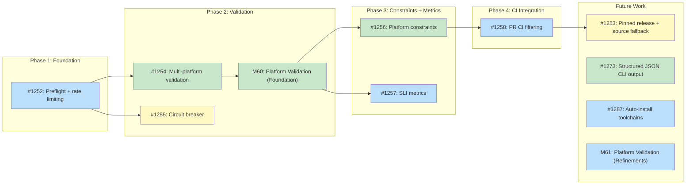

# DESIGN: Batch Recipe Generation CI Pipeline

## Status

Planned

## Implementation Issues

### Milestone: [Batch Pipeline](https://github.com/tsukumogami/tsuku/milestone/52)

| Issue | Title | Dependencies | Tier |
|-------|-------|--------------|------|
| [#1252](https://github.com/tsukumogami/tsuku/issues/1252) | Preflight job and rate limiting | None | testable |
| [#1253](https://github.com/tsukumogami/tsuku/issues/1253) | Pinned release with source fallback | [#1258](https://github.com/tsukumogami/tsuku/issues/1258) | simple |
| ~~[#1254](https://github.com/tsukumogami/tsuku/issues/1254)~~ | ~~Multi-platform validation jobs~~ | ~~[#1252](https://github.com/tsukumogami/tsuku/issues/1252)~~ | ~~testable~~ |
| [#1255](https://github.com/tsukumogami/tsuku/issues/1255) | Circuit breaker integration | [#1252](https://github.com/tsukumogami/tsuku/issues/1252) | testable |
| ~~[#1256](https://github.com/tsukumogami/tsuku/issues/1256)~~ | ~~Platform constraints in merge job~~ | ~~[M60](https://github.com/tsukumogami/tsuku/milestone/60)~~ | ~~testable~~ |
| [#1257](https://github.com/tsukumogami/tsuku/issues/1257) | SLI metrics collection | ~~[M60](https://github.com/tsukumogami/tsuku/milestone/60)~~ | testable |
| [#1258](https://github.com/tsukumogami/tsuku/issues/1258) | PR CI platform filtering | [#1256](https://github.com/tsukumogami/tsuku/issues/1256) | testable |
| ~~[#1273](https://github.com/tsukumogami/tsuku/issues/1273)~~ | ~~Structured JSON CLI output + batch integration~~ | ~~None~~ | ~~testable~~ |
| [#1287](https://github.com/tsukumogami/tsuku/issues/1287) | Auto-install required toolchains for ecosystem builders | None | testable |

### Dependency Graph



**Legend**: Green = done, Blue = ready, Yellow = blocked, Purple = needs-design

## Upstream Design Reference

This design implements part of [DESIGN-registry-scale-strategy.md](DESIGN-registry-scale-strategy.md).

**Relevant sections:**
- Decision 1: Fully deterministic batch generation
- Prioritization Strategy (2A): Popularity-based queue
- Target Environment Validation Matrix
- Rate Limiting (RATE-1) and Circuit Breaker requirements
- Batch Operations Control Plane

**This design must deliver:**
- CI workflow that generates failure records (required by #1190)

**Dependent designs:**
- [DESIGN-batch-operations.md](current/DESIGN-batch-operations.md): Control plane, rollback, emergency stop
- [DESIGN-homebrew-deterministic-mode.md](current/DESIGN-homebrew-deterministic-mode.md): Homebrew DeterministicOnly session option
- [DESIGN-seed-queue-pipeline.md](current/DESIGN-seed-queue-pipeline.md): Queue population and lifecycle model

## Context and Problem Statement

The registry scale strategy calls for automated generation of recipes from 8 deterministic ecosystem builders (Cargo, NPM, PyPI, RubyGems, Go, CPAN, Homebrew Cask, and Homebrew). The priority queue contains packages ranked by popularity, and the failure record schema defines how to capture generation failures. The batch operations control plane provides emergency stop, circuit breaker state, and budget tracking.

What's missing is the CI pipeline that ties these together: reading from the queue, invoking builders, validating across environments, recording failures, and merging passing recipes. The target is 200+ recipes/week across all ecosystems, limited primarily by macOS CI budget and per-ecosystem rate limits.

Three challenges make this non-trivial:

1. **Validation cost asymmetry.** macOS runners cost 10x Linux runners. Validating every recipe on all 5 target environments is expensive. A 100-recipe batch validated on all platforms uses ~1100 CI minutes; the weekly macOS budget is 1000 minutes.

2. **Ecosystem isolation.** Different ecosystems have different failure modes, rate limits, and success rates. A Homebrew API outage shouldn't pause Cargo generation. The circuit breaker must operate per-ecosystem.

3. **Merge safety.** Recipes with `run_command` actions execute arbitrary shell at install time. Auto-merging these without human review is a security risk. The pipeline must distinguish safe-to-merge recipes from those requiring review.

### Scope

**In scope:**
- GitHub Actions workflow for batch recipe generation
- Per-ecosystem generation jobs with rate limiting
- Progressive validation (Linux first, macOS on pass)
- Failure recording to JSONL matching failure-record.schema.json
- Auto-merge with security gates (no `run_command`)
- Circuit breaker integration via batch-control.json
- SLI metrics collection (success rate, validation pass rate)
- Batch ID tracking for rollback support

**Constraints:**
- Single concurrent run enforced via GitHub Actions `concurrency` group. Overlapping dispatches are queued, not parallel. This prevents `batch-control.json` write races and JSONL merge conflicts.

**Prerequisites:**
- `tsuku create` in deterministic-only mode: when no LLM API keys are present in the environment, builders run deterministic-only (no LLM fallback). The CI workflow runs without API keys, so this happens naturally.
- Sandbox validation via `tsuku install --sandbox` (existing infrastructure).
- Priority queue populated at `data/priority-queue.json` via the seed-queue workflow (#1241, completed). The `cmd/seed-queue` Go tool fetches from ecosystem APIs and merges additively into the queue file. See [DESIGN-seed-queue-pipeline.md](current/DESIGN-seed-queue-pipeline.md).

**Out of scope:**
- Failure analysis backend (downstream #1190)
- Builder improvements (separate issues per ecosystem)
- D1/R2 backend integration (Phase 2 of scale strategy)
- Re-queue mechanism (requires failure analysis backend)
- Queue seeding (handled by #1241, completed)

## Decision Drivers

- macOS CI budget: 1000 minutes/week (10x cost of Linux)
- Must produce structured failure records for downstream gap analysis
- Circuit breaker must operate per-ecosystem, not globally
- Recipes with `run_command` must not auto-merge
- Batch ID metadata required in commits for surgical rollback
- Rate limits vary by ecosystem (GitHub API: 5000/hr authenticated)
- Pipeline must work without LLM API keys ($0 per recipe)
- Partial platform coverage is acceptable for merge (>=1 environment)

## Considered Options

### Decision 1: Workflow Trigger Model

How does the batch pipeline get triggered?

#### Option 1A: Manual Dispatch with Parameters

`workflow_dispatch` with inputs for ecosystem, batch size, and queue tier. Operators trigger runs on demand.

**Pros:**
- Full operator control over timing, size, and scope
- No surprise costs from automated runs
- Easy to pause: just don't trigger
- Can target specific ecosystems or tiers

**Cons:**
- Requires operator attention to run batches
- No automatic cadence without a separate scheduler
- Could fall behind if operators forget

#### Option 1B: Scheduled with Override

`schedule` cron (daily 3 AM UTC) plus `workflow_dispatch` for ad-hoc runs. Batch size and ecosystem configured in batch-control.json.

**Pros:**
- Automatic cadence ensures steady progress
- Still supports manual override
- Configuration in version-controlled file

**Cons:**
- Scheduled runs can surprise with costs during inactive periods
- Harder to scale up temporarily (need to change config file)
- Schedule changes require commits

#### Option 1C: Event-Driven (Queue Watcher)

External service (Cloudflare Worker) monitors queue and triggers workflow via GitHub API when packages are pending.

**Pros:**
- Reactive: processes packages as they enter the queue
- Optimal throughput

**Cons:**
- Requires external infrastructure (Worker + API token management)
- Higher operational complexity (debugging distributed triggers across Worker and GitHub Actions)
- Harder to audit trigger history

### Decision 2: Validation Strategy

How do we validate recipes across the target environment matrix?

#### Option 2A: Progressive Validation (Linux First)

Validate on Linux first. Only promote to macOS validation if Linux passes. Record per-environment results.

**Pros:**
- Saves ~80% macOS minutes (most failures surface on Linux)
- Fast feedback: Linux runners start in seconds vs minutes for macOS
- Matches cost reality (macOS is 10x)

**Cons:**
- macOS-only failures discovered later
- Linux pass doesn't guarantee macOS pass
- Slightly more complex workflow logic

#### Option 2B: Full Matrix

Validate every recipe on all 5 environments in parallel.

**Pros:**
- Complete coverage from the start
- Simpler workflow: one matrix job

**Cons:**
- Consumes macOS budget 5x faster than progressive
- Most failed recipes waste macOS minutes on a recipe that would have failed on Linux
- Budget exhaustion leads to pipeline stalls

#### Option 2C: Linux-Only with Periodic macOS Sweeps

Validate only on Linux in normal batches. Run weekly macOS validation sweep on all merged recipes.

**Pros:**
- Near-zero macOS cost for normal operations
- Periodic sweep catches macOS-specific issues

**Cons:**
- macOS failures discovered days late
- Recipes merged without macOS validation may break users
- Sweep creates large batch of fixes

### Decision 3: Merge Strategy

How do validated recipes get merged?

#### Option 3A: One PR Per Batch, Auto-Merge with Gates

Create a single PR per batch run containing all passing recipes. Auto-merge if: all recipes pass validation, none contain `run_command`, and CI checks pass.

**Pros:**
- Single PR for review if auto-merge gates fail
- Batch ID in commit message enables rollback
- Atomic: all recipes from a batch are one commit

**Cons:**
- One failing recipe blocks the entire batch
- Large PRs are harder to review when gates fail

#### Option 3B: One PR Per Recipe

Each validated recipe gets its own PR with auto-merge. This is the pattern Dependabot and similar automation tools use at scale.

**Pros:**
- Failing recipes don't block others
- Easy to review individual recipes
- Proven pattern (Dependabot, Renovate)
- GitHub's auto-merge handles high PR volume

**Cons:**
- High PR volume increases notification noise for maintainers
- Each PR triggers separate CI runs, multiplying CI cost
- Batch provenance requires external tracking (no single commit for rollback)
- GitHub Actions concurrency limits may queue PRs

#### Option 3C: Batch PR with Selective Exclusion

One PR per batch, but automatically exclude recipes that fail validation. Only passing recipes go in the PR.

**Pros:**
- Batch stays atomic (one commit per run)
- Failures don't block passing recipes
- Batch ID covers exactly what merged

**Cons:**
- Non-trivial PR assembly: collecting partial results across ecosystem jobs, tracking exclusions, and maintaining batch ID coherence requires careful workflow orchestration
- Excluded recipes need separate tracking

### Decision 4: Failure Recording

How are structured failure records stored?

#### Option 4A: JSONL Files in Repository

Append failures to `data/failures/<ecosystem>.jsonl` per run. Version-controlled, auditable.

**Pros:**
- No external infrastructure needed
- Full git history of failures
- Easy to query with jq
- Matches existing schema files in `data/schemas/`

**Cons:**
- Files grow over time (need periodic cleanup)
- Merge conflicts if multiple runs overlap
- Git repo size increases

#### Option 4B: GitHub Actions Artifacts

Upload failure records as workflow artifacts. Query via GitHub API.

**Pros:**
- No repo pollution
- Automatic retention policies (90 days)

**Cons:**
- Artifacts disappear after retention period
- Harder to query historically
- Failure analysis backend (#1190) needs API access

#### Option 4C: Direct D1 Database Write

Write failures to Cloudflare D1 via Worker API during batch run.

**Pros:**
- Queryable immediately by failure analysis backend
- No repo size impact

**Cons:**
- Requires Worker infrastructure (Phase 2 dependency)
- Network dependency during CI runs
- Couples CI to external service

### Uncertainties

- Actual macOS runner availability and queue times at scale are untested. Wait times could exceed estimates.
- Per-ecosystem rate limits for some registries (CPAN, Go proxy) aren't well documented. Conservative defaults may throttle unnecessarily.
- The 85-90% Homebrew deterministic success rate is estimated. First batch run will validate this.

## Decision Outcome

**Chosen: 1A + 2A + 3C + 4A**

### Summary

A manually-triggered GitHub Actions workflow reads from the priority queue and runs per-ecosystem generation jobs. Recipes are validated progressively (Linux first, macOS on pass). Failures are recorded to JSONL files in the repository. One PR per batch is created containing only passing recipes, with auto-merge gated on `run_command` absence and CI checks.

### Rationale

Option 1A (manual dispatch) gives operators explicit control over timing and cost without requiring external infrastructure. The existing `batch-control.json` pattern handles configuration. A scheduler can be added later as a thin cron job.

Option 2A (progressive validation) is the only strategy compatible with the macOS budget. At 10x cost, full-matrix validation of 100 recipes would consume the entire weekly macOS budget in one run. Progressive saves ~80% by catching most failures on Linux first.

Option 3C (selective exclusion) balances atomicity with throughput. One recipe failure shouldn't block 99 passing recipes in the same batch. The batch ID in the commit covers exactly what merged.

Option 4A (JSONL in repo) matches the existing `data/schemas/` pattern and avoids infrastructure dependencies. The failure analysis backend (#1190) can read these files directly. D1 integration (4C) is Phase 2 work.

### Trade-offs Accepted

- Manual triggering means no automatic cadence. This is acceptable because operators should control spend until the pipeline proves reliable. A cron trigger can be added once success rates are validated.
- JSONL files grow the repo. Acceptable at expected scale (hundreds of failures per run = kilobytes). A cleanup script can archive old records.
- macOS-specific failures are discovered after Linux validation. Acceptable because most failures are platform-independent, and the 80% cost savings outweigh the delay.

## Solution Architecture

### Overview

The pipeline is a GitHub Actions workflow with three job tiers: queue reading, per-ecosystem generation with Linux validation, and macOS validation for Linux-passing recipes.

### Workflow Structure

```yaml
# .github/workflows/batch-generate.yml
name: Batch Recipe Generation
on:
  workflow_dispatch:
    inputs:
      ecosystem:
        description: 'Ecosystem to process (or "all")'
        required: true
        default: 'all'
        type: choice
        options: [all, cargo, npm, pypi, rubygems, go, cpan, cask, homebrew]
      batch_size:
        description: 'Max recipes per ecosystem'
        required: true
        default: '25'
        type: number
      tier:
        description: 'Queue tier (1=critical, 2=popular, 3=all)'
        required: true
        default: '2'
        type: choice
        options: ['1', '2', '3']
      skip_macos:
        description: 'Skip macOS validation (Linux only)'
        required: false
        default: false
        type: boolean

concurrency:
  group: batch-generate
  cancel-in-progress: false

permissions:
  contents: write
  pull-requests: write
```

### Job Architecture

```
┌─────────────────────────────────────────────────────────┐
│ Job 1: preflight                                         │
│ - Read batch-control.json (circuit breaker, budget)      │
│ - Read priority queue for selected ecosystem/tier        │
│ - Output: package list per ecosystem, batch_id           │
├─────────────────────────────────────────────────────────┤
│ Job 2: generate-<ecosystem> (matrix, per ecosystem)      │
│ - Build tsuku from source (go build)                     │
│ - For each package in ecosystem slice:                   │
│   - Run: tsuku create --from <eco>:<pkg> │
│   - On success: validate on Linux (sandbox)              │
│   - On failure: classify exit code, record failure       │
│ - Output: passing recipes, failure records               │
├─────────────────────────────────────────────────────────┤
│ Job 3: validate-platforms (conditional)                   │
│ - For each Linux x86_64-passing recipe:                  │
│   - linux-arm64 (ubuntu-24.04-arm, if !skip_arm64)       │
│   - linux-musl (alpine container on ubuntu, if !skip_musl│
│   - darwin-arm64 (macos-14, if !skip_macos)              │
│   - darwin-x86_64 (macos-13, if !skip_macos)             │
│ - Retry on exit code 5 (network) up to 3x with backoff  │
│ - Output: per-recipe, per-platform pass/fail artifacts   │
│   (platform jobs NEVER modify recipe files)              │
├─────────────────────────────────────────────────────────┤
│ Job 4: merge (single aggregation point)                  │
│ - Collect full result matrix from all platform jobs      │
│ - For partial-coverage recipes: derive platform          │
│   constraints from passing set, write to recipe TOML     │
│   using existing fields (supported_os, supported_arch,   │
│   supported_libc, unsupported_platforms)                  │
│ - Exclude recipes with run_command actions               │
│ - Create PR with batch_id in commit message              │
│ - Record failures to data/failures/<ecosystem>.jsonl     │
│ - Append per-platform metrics to batch-runs.jsonl        │
│ - Update batch-control.json circuit breaker state        │
│ - Auto-merge if gates pass                               │
└─────────────────────────────────────────────────────────┘
```

### Generation Flow (Per Package)

The batch tool invokes the released `tsuku` CLI binary for each package. This exercises the same code path users run, making the batch pipeline a continuous integration test for the CLI itself.

```bash
# Per-package generation via released CLI
tsuku create --from cargo:ripgrep --output recipes/r/ripgrep.toml

# Exit codes determine failure handling (from cmd/tsuku/exitcodes.go):
#   0 = success (recipe written)
#   5 = network error (timeout, rate limit, DNS) — transient, retry up to 3x
#   6 = install/generation failed — structural, no retry
#   7 = verify failed — structural, no retry
#   8 = dependency failed — structural, no retry
```

The Go orchestrator (`cmd/batch-generate`) manages the loop: reading the queue, invoking `tsuku create` as a subprocess for each package, parsing exit codes and stderr for failure classification, and writing results. This keeps the orchestration logic in Go (testable, type-safe) while exercising the real CLI for the work that matters.

If the CLI crashes or produces unexpected errors, the circuit breaker catches the pattern -- consecutive failures trip the breaker and pause the ecosystem. This is a feature: a broken CLI release gets detected and paused automatically rather than silently generating bad recipes via internal APIs.

### Validation Flow

**Important:** Recipe generation is platform-independent. Recipes contain `os_mapping` and `arch_mapping` that resolve to platform-specific download URLs at install time. The TOML itself is the same regardless of where it was generated. Generation can run on any platform (we use `ubuntu-latest` for cost).

Validation, however, must run on each target platform because it executes the actual binary in a sandbox to verify it works.

```
Recipe generated (on ubuntu-latest, platform-independent TOML)
    │
    ├─ Linux x86_64 glibc validation (ubuntu-latest)
    │   ├─ Schema validation (tsuku validate --strict)
    │   ├─ Plan generation (tsuku eval <recipe>)
    │   └─ Sandbox install (tsuku install --plan --sandbox)
    │       ├─ PASS → promote to additional platform validation
    │       └─ FAIL → record failure (validation_failed)
    │
    ├─ Linux arm64 validation (if x86_64 passed, ubuntu-24.04-arm)
    │   └─ Sandbox install
    │
    ├─ Linux musl validation (if x86_64 passed, alpine container on ubuntu-latest)
    │   └─ Sandbox install in alpine-based container
    │
    └─ macOS validation (if Linux passed && !skip_macos)
        ├─ darwin-arm64 (macos-14)
        │   └─ Sandbox install
        └─ darwin-x86_64 (macos-13)
            └─ Sandbox install
```

The progressive strategy applies across all platforms: Linux x86_64 glibc is the cheapest and catches most failures. arm64 and musl use Linux runners (low cost). macOS runners are last due to 10x cost. A recipe that fails on x86_64 glibc won't be tested on any other platform.

**Retry policy:** Each platform validation job retries only on exit code 5 (`ExitNetwork` — timeouts, rate limits, DNS, connection errors) up to 3 times with exponential backoff. All other non-zero exit codes are structural failures and fail immediately without retry. This avoids wasting CI time on structural failures while catching transient network issues.

### Failure Record Format

```jsonl
{"schema_version":1,"ecosystem":"homebrew","environment":"linux-glibc-x86_64","updated_at":"2026-01-29T10:00:00Z","failures":[{"package_id":"homebrew:imagemagick","category":"missing_dep","blocked_by":["libpng","libjpeg"],"message":"formula imagemagick requires dependencies without tsuku recipes","timestamp":"2026-01-29T10:01:23Z"}]}
```

Per-ecosystem files at `data/failures/<ecosystem>.jsonl`. Each line is a complete failure record for one batch run's failures in one environment.

### Batch ID and Commit Format

```
feat(recipes): add batch 2026-01-29-001 cargo recipes

Batch generation of 25 Cargo packages from tier 2 queue.
- 23 passed validation (Linux + macOS)
- 2 failed (recorded to data/failures/cargo.jsonl)

batch_id: 2026-01-29-001
ecosystem: cargo
batch_size: 25
success_rate: 0.92
```

### Circuit Breaker Integration

The preflight job reads `batch-control.json` and skips ecosystems with open circuit breakers:

```json
{
  "circuit_breaker": {
    "homebrew": {"state": "closed", "consecutive_failures": 0},
    "cargo": {"state": "open", "opened_at": "2026-01-28T15:00:00Z",
              "reason": "5 consecutive failures"}
  }
}
```

The preflight job should also check for open batch PRs (`gh pr list --label batch --state open`) and skip the run if one exists. This prevents conflicting PRs and is a prerequisite for safe auto-merge (see [DESIGN-merge-job-completion.md](DESIGN-merge-job-completion.md)).

After generation, the merge job updates circuit breaker state:
- Track consecutive failures per ecosystem
- Open breaker at 10 consecutive failures (>50% over window)
- Half-open after 60 minutes: test with single package
- Close on success; reopen on failure

### Rate Limiting

Per-ecosystem rate limiting in the generation script:

| Ecosystem | Rate Limit | Mechanism |
|-----------|-----------|-----------|
| Homebrew | 1 req/sec to GHCR + Homebrew API | Sleep between packages |
| Cargo | 1 req/sec to crates.io | Sleep between packages |
| NPM | 1 req/sec to registry.npmjs.org | Sleep between packages |
| PyPI | 1 req/sec to pypi.org | Sleep between packages |
| Go | 1 req/sec to proxy.golang.org | Sleep between packages |
| RubyGems | 10 req/min to rubygems.org | Sleep + counter |
| CPAN | 1 req/sec to metacpan.org | Sleep between packages |

### SLI Collection

Each batch run appends one JSON line to `data/metrics/batch-runs.jsonl` with per-platform breakdown:

```jsonl
{"batch_id":"2026-01-29-001","ecosystem":"cargo","total":25,"generated":23,"platforms":{"linux-glibc-x86_64":{"tested":23,"passed":23,"failed":0},"linux-glibc-arm64":{"tested":23,"passed":20,"failed":3},"linux-musl-x86_64":{"tested":23,"passed":18,"failed":5},"darwin-arm64":{"tested":20,"passed":19,"failed":1},"darwin-x86_64":{"tested":20,"passed":19,"failed":1}},"merged":18,"timestamp":"2026-01-29T10:30:00Z","duration_seconds":450}
```

The merge job also writes a markdown summary table to `$GITHUB_STEP_SUMMARY` for immediate visibility in the GitHub Actions UI. This shows the same per-platform tested/passed/failed counts in a readable table.

The file is append-only and committed to the repo. At weekly runs this grows by ~52 lines/year. A reporting script can be added later to aggregate trends from the accumulated data.

### CLI as the Execution Boundary

The batch pipeline invokes the released `tsuku` binary rather than importing `internal/builders` directly. This means the pipeline exercises the same code path users run, catching CLI-level regressions (flag parsing, environment handling, output formatting) that internal API calls would bypass.

**CLI commands used:**
- `tsuku create --from <eco>:<pkg>` -- generate a recipe
- `tsuku validate --strict <recipe>` -- schema validation
- `tsuku install --plan <recipe> --sandbox` -- sandbox validation

**CLI installation:** Each generate job builds `tsuku` from source (`go build ./cmd/tsuku`). This catches CLI regressions immediately rather than waiting for a release. Version pinning via `install.sh` is deferred to #1253 once the pipeline stabilizes.

**Why not Go API:** If the CLI doesn't work, there's little value in generating recipes that users can't install. A broken CLI release gets caught immediately by batch failures tripping the circuit breaker, rather than being masked by internal API calls that bypass the CLI entirely.

**Orchestrator tool:** A Go tool at `cmd/batch-generate` handles queue reading, package selection, subprocess management, failure classification, and result aggregation. It shells out to `tsuku` for the actual work. This keeps orchestration logic testable in Go while the CLI does the heavy lifting.

### Artifact Passing Between Jobs

Jobs communicate via GitHub Actions artifacts (`actions/upload-artifact` and `actions/download-artifact`):

- **preflight → generate**: Package lists as JSON files (one per ecosystem)
- **generate → validate-platforms**: Recipe TOML files that passed Linux x86_64 validation
- **generate → merge**: Recipe TOML files, failure JSONL records
- **validate-platforms → merge**: Per-recipe, per-platform pass/fail results (JSON artifacts, not modified recipe files)

Each artifact is named with the batch ID and ecosystem for traceability. Artifacts expire after 1 day (they're committed to the repo by the merge job).

### Queue Consumption

The preflight job reads `data/priority-queue.json` and selects packages with `status: "pending"` matching the requested ecosystem and tier. The queue uses a status-based lifecycle (see [DESIGN-seed-queue-pipeline.md](current/DESIGN-seed-queue-pipeline.md)):

- **Before generation**: The batch pipeline sets selected packages to `in_progress`.
- **On success**: The merge job sets packages to `success` after the recipe PR merges.
- **On failure**: The merge job sets packages to `failed` and records the failure in JSONL.

The seed tool only creates `pending` entries and never modifies existing statuses. Items are never removed from the queue -- `success` and `skipped` entries serve as deduplication records. An operator can manually change `failed` back to `pending` to re-queue after fixes.

### Data Flow

```
Priority Queue (data/priority-queue.json)
    │
    ├─ Preflight reads queue, filters by ecosystem/tier
    │
    ├─ Generate jobs build tsuku from source (go build)
    │   ├─ For each package: tsuku create --from <eco>:<pkg>
    │   ├─ Success → recipe TOML file
    │   └─ Failure → failure record (JSONL)
    │
    ├─ Validate jobs invoke:  tsuku install --plan <recipe> --sandbox
    │   ├─ Pass → recipe stays in PR
    │   └─ Fail → recipe excluded, failure recorded
    │
    ├─ Merge job creates PR with passing recipes
    │   ├─ run_command check → manual review if present
    │   └─ auto-merge if clean
    │
    └─ Output artifacts:
        ├─ data/failures/<ecosystem>.jsonl (failure records)
        ├─ data/metrics/batch-runs.jsonl (SLI metrics)
        └─ batch-control.json (circuit breaker state)
```

## Implementation Approach

### Phase 1: End-to-End Pipeline (Generation + Linux Validation + Merge)

Create the Go orchestrator (`cmd/batch-generate`) and GitHub Actions workflow. The orchestrator reads the queue, invokes the `tsuku` CLI (built from source) for generation and validation, records failures, and outputs results. The workflow builds both binaries, runs the orchestrator, and creates a PR with passing recipes.

**Files:** `cmd/batch-generate/main.go`, `internal/batch/`, `.github/workflows/batch-generate.yml`, `data/failures/`

### Phase 2: Multi-Platform Progressive Validation

Add platform validation jobs for Linux x86_64-passing recipes. Each platform job builds tsuku from source and runs sandbox validation. Platforms are tested in cost order: Linux arm64 and musl (cheap), then macOS (expensive). Platform jobs produce pass/fail result artifacts only — the merge job writes platform constraint fields into recipe TOML. Update `test-changed-recipes.yml` to use `tsuku info --json --metadata-only` for filtering recipes per platform runner, so PR CI skips recipes on platforms they don't support.

| Platform | Runner | Cost | Skip Flag |
|----------|--------|------|-----------|
| linux-arm64 | ubuntu-24.04-arm | Low | `skip_arm64` |
| linux-musl | Alpine container on ubuntu-latest | Low | `skip_musl` |
| darwin-arm64 | macos-14 | High (10x) | `skip_macos` |
| darwin-x86_64 | macos-13 | High (10x) | `skip_macos` |

**Files:** `.github/workflows/batch-generate.yml` (platform validation jobs)

### Phase 3: Metrics and Circuit Breaker

Add SLI metrics collection to `data/metrics/batch-runs.jsonl`. Integrate circuit breaker state updates in `batch-control.json` after each run. The circuit breaker serves double duty: pausing ecosystems with high failure rates and detecting broken CLI releases (which manifest as sudden across-the-board failures).

**Files:** `internal/batch/` (metrics, circuit breaker), `data/metrics/`

## Security Considerations

### Download Verification

The batch pipeline downloads artifacts from ecosystem registries (crates.io, npmjs.com, GHCR, etc.). Each ecosystem builder already verifies downloads:
- Homebrew: SHA256 from GHCR manifest annotations
- Cargo/NPM/PyPI/etc.: Checksums from registry APIs
- All downloads use HTTPS

The pipeline reuses existing builder download paths, so checksum verification is inherited. However, the batch pipeline changes the trust model: interactive installs have a human who chose the package, while batch generation removes that decision. The attack surface (number of packages processed without human review) is larger. This is mitigated by the `run_command` gate and sandbox validation, but the changed risk profile should be acknowledged.

### Execution Isolation

Generated recipes are validated in sandbox containers with:
- `--network=none`: No network access during validation
- Resource limits: 2GB RAM, 2 CPU, 5-minute timeout
- Ephemeral containers destroyed after each run
- Read-only mounts for source artifacts

Deterministic-mode recipes produce binary-download-only recipes (no `run_command`, `npm_install`, or `cargo_build` actions). These don't require network during validation. Any recipe that requires network access during sandbox validation (i.e., `RequiresNetwork=true`) fails the auto-merge gate and requires human review.

The batch pipeline itself runs in GitHub Actions runners, which are ephemeral VMs. The workflow declares minimal permissions (`contents: write`, `pull-requests: write`) to limit blast radius if a job is compromised.

### Supply Chain Risks

The pipeline generates recipes from upstream registries. Supply chain risks include:

| Risk | Mitigation | Residual Risk |
|------|------------|---------------|
| Compromised upstream package | Checksums verified against registry; sandbox catches malicious behavior | Zero-day compromise before registry detection |
| Typosquatting in queue | Priority queue populated from official registry APIs, not user input | Malicious package with legitimate-looking name |
| `run_command` injection | Auto-merge gate blocks recipes with `run_command`; human review required | Reviewer oversight |
| Batch poisoning (many bad recipes) | Rollback via batch_id; circuit breaker detects high failure rates (reliability control, not security) | Low-volume poisoning (1-2 recipes/batch) stays under circuit breaker threshold |

### User Data Exposure

The batch pipeline does not access user data. It operates on:
- Public registry APIs (anonymous or authenticated with CI tokens)
- Priority queue data (package names and popularity scores)
- Generated recipe files (TOML definitions)

No user-identifying information is transmitted. CI tokens are GitHub-provided GITHUB_TOKEN with minimal permissions.

### Mitigations

| Risk | Mitigation | Residual Risk |
|------|------------|---------------|
| macOS budget exhaustion | Progressive validation skips macOS for Linux failures; budget tracking in batch-control.json | Unexpected macOS runner costs from long-running validations |
| Rate limit exceeded | Per-ecosystem sleep between requests; conservative defaults | Transient API errors causing false circuit breaker trips |
| Merge of bad recipe | Sandbox validation + schema validation + run_command gate | Recipe works in sandbox but fails in real environment |
| Failure data loss | JSONL committed to repo with full git history | Merge conflicts during concurrent runs (mitigated by per-ecosystem files) |

## Consequences

### Positive

- Automated recipe generation at scale across 8 ecosystems
- Structured failure data enables gap analysis (downstream #1190)
- Progressive validation keeps macOS costs manageable
- Batch ID enables surgical rollback of any batch
- Circuit breaker prevents runaway failures

### Negative

- Manual trigger requires operator attention (no automatic cadence)
- JSONL files in repo increase repo size over time
- macOS-specific failures discovered after Linux validation

### Mitigations

- Add cron trigger once pipeline reliability is proven (1A → 1B transition)
- Archive old failure records periodically (keep last 90 days in repo)
- Weekly macOS sweep validates all recently merged recipes
