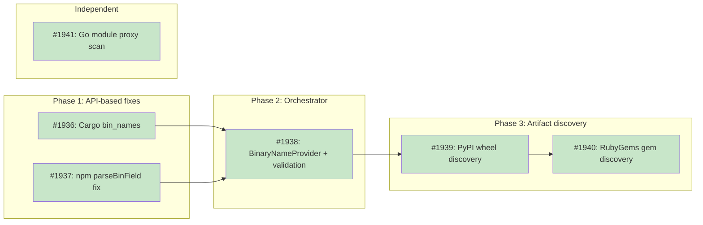

# Deterministic Binary Name Discovery for Recipe Builders

## Status

**Planned**

## Implementation Issues

### Milestone: [binary-name-discovery](https://github.com/tsukumogami/tsuku/milestone/103)

| Issue | Dependencies | Tier |
|-------|--------------|------|
| ~~[#1936: feat(builders): use crates.io `bin_names` for Cargo binary discovery](https://github.com/tsukumogami/tsuku/issues/1936)~~ | None | testable |
| ~~_Read `bin_names` from the crates.io version API response instead of fetching Cargo.toml from GitHub. Adds version struct fields, rewrites `discoverExecutables()`, removes dead code for repo-based fetching, and caches the API response for the orchestrator validation step._~~ | | |
| ~~[#1937: fix(builders): handle string-type `bin` field in npm builder](https://github.com/tsukumogami/tsuku/issues/1937)~~ | None | testable |
| ~~_Fix `parseBinField()` to return the package name when `bin` is a string rather than a map. Strips scope prefixes from scoped packages (`@scope/tool` becomes `tool`) and passes the package name into the parser signature._~~ | | |
| ~~[#1938: feat(builders): add `BinaryNameProvider` and orchestrator validation](https://github.com/tsukumogami/tsuku/issues/1938)~~ | [#1936](https://github.com/tsukumogami/tsuku/issues/1936), [#1937](https://github.com/tsukumogami/tsuku/issues/1937) | testable |
| ~~_Define the `BinaryNameProvider` interface and add a `validateBinaryNames()` step in the orchestrator between recipe generation and sandbox validation. Implements the interface on Cargo and npm builders using their cached registry data, with telemetry for corrections._~~ | | |
| ~~[#1939: feat(builders): add PyPI wheel-based executable discovery](https://github.com/tsukumogami/tsuku/issues/1939)~~ | [#1938](https://github.com/tsukumogami/tsuku/issues/1938) | testable |
| ~~_Create the shared artifact download helper at `internal/builders/artifact.go` and use it to download PyPI wheel files, extract `entry_points.txt` from the ZIP, and parse `[console_scripts]` for executable names. The existing pyproject.toml-from-GitHub path becomes a fallback._~~ | | |
| ~~[#1940: feat(builders): add RubyGems gem-based executable discovery](https://github.com/tsukumogami/tsuku/issues/1940)~~ | [#1939](https://github.com/tsukumogami/tsuku/issues/1939) | testable |
| ~~_Reuse the artifact download helper to download `.gem` files, extract `metadata.gz` from the tar archive, decompress the YAML, and read the `executables` array. The gemspec-from-GitHub path becomes a fallback._~~ | | |
| ~~[#1941: feat(builders): improve Go binary discovery via module proxy](https://github.com/tsukumogami/tsuku/issues/1941)~~ | None | testable |
| ~~_Scan the Go module proxy source listing for `cmd/` directories containing `main.go` to discover binary targets beyond the last-segment heuristic. Does not implement `BinaryNameProvider` since the discovery remains heuristic-based._~~ | | |

### Dependency Graph



**Legend**: Green = done, Blue = ready, Yellow = blocked, Purple = needs-design, Orange = tracks-design

## Context and Problem Statement

When `tsuku create` generates a recipe, each builder must determine what executables the package produces. The current approach fetches source manifests from GitHub repositories:

- **Cargo**: fetches root `Cargo.toml`, parses `[[bin]]` sections
- **npm**: uses the `bin` field from the registry API (partially working)
- **PyPI**: fetches `pyproject.toml` from GitHub, parses `[project.scripts]`
- **RubyGems**: fetches gemspec from GitHub, parses `executables` attribute
- **Go**: infers from the last segment of the module import path

This approach breaks for workspace monorepos. When a crate like `sqlx-cli` lives inside a Cargo workspace, the root `Cargo.toml` contains `[workspace]` configuration, not `[[bin]]` sections. The builder falls back to the crate name (`sqlx-cli`), but the actual binary is `sqlx`. The same pattern affects multi-binary crates like `probe-rs-tools`, which produces `probe-rs`, `cargo-flash`, and `cargo-embed`.

These mismatches were caught manually during PR #1869 testing. Manual review doesn't scale as the recipe count grows.

The existing verification self-repair system (DESIGN-verification-self-repair) handles a related but different problem: tools whose `--version` flag doesn't work. It doesn't attempt to repair wrong binary names because exit code 127 (command not found) is treated as unrecoverable.

### Scope

**In scope:**
- Replacing repository-based binary discovery with registry API/artifact lookups
- Adding orchestrator-level validation of binary names
- Covering all five builder ecosystems (Cargo, npm, PyPI, RubyGems, Go)

**Out of scope:**
- LLM-based recipe generation (GitHub Release, Homebrew, Cask builders)
- Changes to the verification self-repair system
- Standalone `tsuku validate --fix` command for batch repair (can follow later)

## Decision Drivers

- **Accuracy over speed**: wrong binary names cause install failures that users see
- **Use authoritative sources**: registry APIs and published artifacts over repository source files
- **Minimal new network calls**: reuse data from API calls already happening
- **Incremental delivery**: fix the easy wins (crates.io, npm) first, tackle harder registries after
- **Safety net**: catch any builder's mistakes before they reach sandbox validation

## Considered Options

### Decision 1: Source of truth for binary names

Each builder currently parses source files from GitHub to find executable names. The question is whether to keep this approach and fix the monorepo edge cases, or switch to a different data source entirely.

Registry APIs and published package artifacts represent what `cargo install` or `pip install` will actually produce, because they contain the resolved, normalized metadata that the package manager uses at install time. Repository source files represent what the developer wrote, which may use workspace inheritance, build scripts, or other indirection that our TOML parser can't evaluate.

#### Chosen: Registry APIs and published artifacts

Use the registry's own metadata as the primary source for binary names. The availability varies by registry:

| Registry | Source | Field | Extra call needed? |
|----------|--------|-------|--------------------|
| crates.io | Version API response | `bin_names` | No (already fetched) |
| npm | Package metadata | `bin` | No (already fetched) |
| PyPI | Wheel artifact | `entry_points.txt` | Yes (download .whl) |
| RubyGems | Gem artifact | `metadata.gz` | Yes (download .gem) |
| Go | None available | N/A | N/A |

For crates.io and npm, the data is already in API responses we're fetching. For PyPI and RubyGems, we'd need to download the published artifact and extract internal metadata files.

#### Alternatives Considered

**Fix repository parsing for monorepos**: For Cargo, detect workspace manifests and follow member paths to find the right sub-crate Cargo.toml. Rejected because workspace layouts vary widely (path dependencies, virtual manifests, nested workspaces), and we'd be reimplementing part of Cargo's workspace resolution. The registry already did this work when the crate was published.

**Use `cargo metadata` or equivalent tools**: Shell out to `cargo metadata --no-deps` to get resolved binary targets. Rejected because it requires the Rust toolchain to be installed (not guaranteed during recipe generation), and doesn't generalize to other registries.

### Decision 2: Validation architecture

Beyond fixing individual builders, the question is whether to add a cross-cutting validation layer that catches binary name errors regardless of which builder produced them. The current orchestrator runs sandbox validation (which catches wrong names via exit code 127) but doesn't attempt repair.

#### Chosen: Pre-sandbox validation in the orchestrator

Add a validation step between recipe generation and sandbox validation. This step cross-checks the recipe's executable list against registry metadata. If there's a mismatch, it corrects the recipe before the sandbox run. This catches errors from any builder, including future ones, without waiting for a full sandbox cycle.

The validation runs only for deterministic builders (not LLM builders, which have their own repair loop). It's a fast check since the registry data was already fetched during generation.

#### Alternatives Considered

**Rely on sandbox validation alone**: Let wrong binary names fail in the sandbox (exit code 127), then repair. Rejected because sandbox runs are slow (container startup, network, build), and the information to prevent the failure is already available. A 100ms API check beats a 60-second container failure.

**Post-sandbox binary name repair**: Add a new self-repair phase that handles exit code 127 by querying registry metadata and retrying. Viable but slower than pre-validation, and doesn't prevent the wasted sandbox run. Could be added later as a defense-in-depth measure.

### Decision 3: Rollout strategy

The five registries have different levels of API support for binary metadata. The question is whether to implement all at once or incrementally.

#### Chosen: Incremental by registry, all registries in scope

Ship crates.io and npm first because they require no additional network calls -- the binary metadata is already in API responses being fetched. Then add the orchestrator validation layer. Then tackle PyPI and RubyGems, which need artifact downloads and shared infrastructure for in-memory archive reading. Finally, improve the Go heuristic by scanning module source listings for `cmd/` directories.

All five registries are in scope for this design. The incremental delivery lets each phase ship independently while building toward full coverage.

#### Alternatives Considered

**All registries at once**: Implement all five in one pass. Rejected because the crates.io and npm fixes are small, targeted changes that can ship immediately. Bundling them with the more complex PyPI and RubyGems work delays the easy wins without reducing total effort.

**Only fix registries with API support**: Skip PyPI and RubyGems since they lack API fields. Rejected because artifact-based discovery is straightforward (download ZIP/tar, extract one file, parse it) and these registries produce the same class of binary name errors as crates.io.

## Decision Outcome

**Chosen: Registry API lookups + pre-sandbox validation, incremental rollout across all registries**

### Summary

Replace repository-based binary name discovery with registry-authoritative sources across all five builder ecosystems. For crates.io, read the `bin_names` field from the version API response already being fetched -- this fixes workspace monorepo failures without new network calls. For npm, fix the `parseBinField()` parser to handle string-type `bin` values and scoped package names. For PyPI and RubyGems, download the published artifact (`.whl` or `.gem`) and extract executable metadata from internal files (`entry_points.txt` and `metadata.gz`). For Go, improve the heuristic by scanning the module source listing from the Go module proxy for `cmd/` directories containing `main.go`.

Add a `ValidateBinaryNames()` step in the orchestrator between generation and sandbox validation. Builders that can provide authoritative binary names implement a `BinaryNameProvider` interface. The orchestrator cross-checks the recipe's executable list against this data and corrects mismatches before the sandbox run. This prevents wasted sandbox cycles and catches errors from any builder, including future ones.

The work ships incrementally: crates.io and npm first (no new downloads), then the orchestrator validation layer, then PyPI and RubyGems (artifact downloads with shared infrastructure), and finally the Go heuristic improvement. Each phase is independently shippable.

### Rationale

The incremental approach lets crates.io and npm ship immediately since they require no new downloads -- they fix the most common failure mode (Cargo workspace monorepos were the source of every binary name error found in PR #1869). The orchestrator validation layer adds a safety net that catches any builder's mistakes. PyPI and RubyGems share the same artifact-download pattern, so a common helper reduces duplication. The Go improvement is the weakest of the five (still heuristic-based) but covers the remaining ecosystem.

## Solution Architecture

### Component Changes

**1. Cargo builder (`internal/builders/cargo.go`)**

Replace the `discoverExecutables()` function. Instead of constructing a GitHub URL, fetching root Cargo.toml, and parsing `[[bin]]` sections, read `bin_names` directly from the crates.io API response that `fetchCrateInfo()` already returns.

The `cratesIOCrateResponse` struct needs a `BinNames` field added to capture the version-level `bin_names` array. The builder should use `bin_names` from the latest non-yanked version (which is the version it resolves to), falling back to the crate name only if `bin_names` is empty or null (which indicates a library-only crate). The builder must cache the API response from `fetchCrateInfo()` so that `AuthoritativeBinaryNames()` can return the data later when the orchestrator calls it.

Remove `buildCargoTomlURL()`, `fetchCargoTomlExecutables()`, and the `cargoToml`/`cargoTomlBinSection` structs once the new approach is validated.

**2. npm builder (`internal/builders/npm.go`)**

Fix `parseBinField()` to handle the string-type `bin` value. When `bin` is a string (not a map), it means there's a single executable whose name matches the package name. The function should return `[]string{packageName}` in this case instead of `nil`. For scoped packages (`@scope/tool`), the executable name is the unscoped part (`tool`), so the function needs the package name passed in to strip the scope prefix.

**3. Orchestrator (`internal/builders/orchestrator.go`)**

Add a `validateBinaryNames()` method that runs after `buildRecipe()` and before `validateInSandbox()`. The method takes the generated recipe and a `BinaryNameMetadata` interface (implemented by each builder that has registry data) and compares the recipe's executable list against the authoritative source.

When a mismatch is detected, log a warning, emit a telemetry event (following the pattern in `attemptVerifySelfRepair`), and correct the recipe's executables. The telemetry provides signal on how often the safety net fires. The orchestrator should type-assert the `SessionBuilder` to `BinaryNameProvider` in `Create()` before creating the session, since the builder reference isn't retained after session creation.

**4. Builder interface extension**

Add an optional interface that builders can implement to provide authoritative binary name data:

```go
type BinaryNameProvider interface {
    AuthoritativeBinaryNames() []string
}
```

Builders that have registry metadata (Cargo, npm, PyPI, RubyGems) implement this interface. The orchestrator checks if the builder satisfies it and runs validation when available. Builders without metadata (Go, LLM builders) skip this step.

**5. PyPI builder (`internal/builders/pypi.go`)**

Replace the current `discoverExecutables()` that fetches `pyproject.toml` from GitHub with artifact-based discovery. The PyPI JSON API (`/pypi/{package}/json`) already returns a `urls` array with download links for each distribution. Find the wheel (`.whl`) artifact for the latest version, download it in-memory, and extract the `{package}.dist-info/entry_points.txt` file. Parse the `[console_scripts]` section to get executable names.

Wheels are ZIP archives, so Go's `archive/zip` can read individual entries without extracting the full file. The builder should:
- Prefer `bdist_wheel` over `sdist` (wheels have normalized metadata)
- Prefer the platform-independent wheel (`py3-none-any`) when multiple are available
- Bound the download to a reasonable size limit (most pure-python wheels are under 5MB; set a 20MB cap)
- Read only the `entry_points.txt` entry from the ZIP, not the full archive
- Fall back to the current pyproject.toml approach if no wheel is available or the download fails

The current `buildPyprojectURL()` and `fetchPyprojectExecutables()` functions become the fallback path, not the primary one.

**6. RubyGems builder (`internal/builders/gem.go`)**

Replace the current `discoverExecutables()` that fetches gemspec from GitHub with artifact-based discovery. Download the `.gem` file from `https://rubygems.org/gems/{name}-{version}.gem`, which is a tar archive containing `metadata.gz`. Decompress and parse the YAML to extract the `executables` array.

The builder should:
- Use the version already resolved by `fetchGemInfo()`
- Bound the download (gems vary widely; set a 50MB cap)
- Read only `metadata.gz` from the tar stream, skip all other entries
- Fall back to the current gemspec-from-GitHub approach if the download fails
- Validate each executable name through `isValidExecutableName()`

The current `buildGemspecURL()` and `fetchGemspecExecutables()` functions become the fallback path.

**7. Go builder (`internal/builders/go.go`)**

The Go module proxy doesn't expose binary names, and there's no published artifact equivalent to wheels or gems that contains executable metadata. The current heuristic (last path segment of the module import path) works for the common case but fails for multi-binary modules and modules where the binary name differs from the directory name.

Improve the heuristic by fetching the module's source listing from the Go module proxy (`/{module}/@v/{version}.zip`) and scanning for `cmd/` subdirectories that contain `main.go` files. Each such directory is a binary target, and the directory name is the executable name. This is how `go install` resolves targets.

The builder should:
- Try the source listing approach first for modules with `cmd/` paths in their import
- Fall back to the current last-segment heuristic if the proxy doesn't respond or parsing fails
- Bound the download (Go module ZIPs can be large; only scan directory entries, don't read file contents)
- Not implement `BinaryNameProvider` initially since the discovery is still heuristic

### Data Flow

```
Builder.Build()
  ├── fetchCrateInfo()          // Already happening
  │     └── bin_names in response  // New: capture this
  ├── discoverExecutables()     // Changed: read registry data instead of repo files
  └── generateRecipe()
        └── recipe with executables

Orchestrator.Generate()
  ├── builder.Build()           // Gets recipe
  ├── validateBinaryNames()     // New: cross-check against registry
  │     ├── builder implements BinaryNameProvider?
  │     │     └── compare recipe executables vs authoritative names
  │     └── mismatch? → correct recipe, log warning
  └── validateInSandbox()       // Existing: sandbox validates installation
```

### Artifact Download Infrastructure

PyPI and RubyGems both need to download published artifacts and extract specific files from archives. The shared requirements are:

- HTTPS-only downloads with content-type verification
- Configurable size limits per registry (wheels tend to be smaller than gems)
- In-memory archive reading (no extraction to disk)
- Hash verification against registry-provided digests where available (PyPI provides SHA256 in the `digests` field; RubyGems provides SHA256 via the versions API)
- Timeout matching the existing builder HTTP client configuration
- All extracted binary names validated through `isValidExecutableName()`
- Upper bound on executable count per package (sanity check against malformed metadata)

This logic can live in a shared `internal/builders/artifact.go` helper that both PyPI and RubyGems builders call.

## Implementation Approach

The work breaks into five phases, each independently shippable:

1. **Crates.io binary names from API**: Add `BinNames` field to `cratesIOCrateResponse`, rewrite `discoverExecutables()` to read it instead of fetching Cargo.toml. Remove `buildCargoTomlURL()`, `fetchCargoTomlExecutables()`, and related structs. Add tests using the crates.io API response format. This alone fixes all known failures from PR #1869.

2. **npm `parseBinField()` fix**: Handle string-type `bin` values and scoped package name stripping. Small, isolated change with unit tests.

3. **Orchestrator validation**: Add `BinaryNameProvider` interface and `validateBinaryNames()` step. Implement `BinaryNameProvider` on Cargo and npm builders. Add telemetry for corrections. Depends on phases 1-2 for the first implementations of the interface.

4. **PyPI wheel-based discovery**: Add artifact download helper (`internal/builders/artifact.go`). Implement wheel download, ZIP entry extraction for `entry_points.txt`, and `[console_scripts]` parsing. Implement `BinaryNameProvider` on PyPI builder. Keep the pyproject.toml-from-GitHub approach as fallback.

5. **RubyGems gem-based discovery**: Reuse the artifact download helper. Implement `.gem` tar reading, `metadata.gz` decompression, and YAML `executables` parsing. Implement `BinaryNameProvider` on RubyGems builder. Keep the gemspec-from-GitHub approach as fallback.

The Go builder improvement (scanning `cmd/` directories from the module proxy ZIP) can be done in parallel with any phase after 3, but doesn't implement `BinaryNameProvider` since its discovery remains heuristic.

### Validation Strategy

Each phase needs validation that the improved discovery actually produces correct binary names for real-world packages. Three complementary approaches cover this:

**1. Unit tests with known-mismatch packages**

Add parametrized unit tests to each builder's `*_test.go` using the existing mock HTTP server pattern. Each test provides a mock registry response for a package where the binary name differs from the package name, and asserts the builder produces the correct executables.

Test cases per ecosystem:

| Ecosystem | Package | Package name | Expected binaries |
|-----------|---------|-------------|-------------------|
| Cargo | sqlx-cli | sqlx-cli | sqlx, cargo-sqlx |
| Cargo | probe-rs-tools | probe-rs-tools | probe-rs, cargo-flash, cargo-embed |
| Cargo | fd-find | fd-find | fd |
| npm | typescript | typescript | tsc, tsserver |
| PyPI | black | black | black, blackd |
| PyPI | httpie | httpie | http, https |
| RubyGems | bundler | bundler | bundle, bundler |
| Go | golangci-lint | github.com/.../cmd/golangci-lint | golangci-lint |

These tests are fast (no network calls), run in CI, and serve as regression tests against future changes.

**2. Regression against previously-fixed recipes**

For crates.io specifically, run the builder against the packages that were manually corrected during PR #1869 and compare the output. This validates that the `bin_names` API path produces the same result as the manual fix. The existing cargo builder integration test workflow (`cargo-builder-tests.yml`) provides the infrastructure -- extend it with additional test packages.

**3. Batch retry of failed recipes**

The batch generation pipeline writes failures to `data/failures/batch-*.jsonl`. Filter these logs for binary-name-related failures (exit code 127, "command not found" in sandbox output) and retry the failed packages locally with the improved builder. This discovers cases beyond the known failures and validates the fix against real-world diversity.

For PyPI and RubyGems, this is particularly valuable since we don't have a pre-existing set of known failures to regress against. Running the builder against the current recipe queue with artifact-based discovery reveals whether the improvement catches real mismatches.

Each phase ships when its unit tests pass and at least one regression/retry test confirms the fix works against a real package.

## Security Considerations

### Download verification

No new downloads for crates.io and npm. PyPI and RubyGems require downloading published artifacts over HTTPS. Content types must be verified (`.whl` is `application/zip`, `.gem` is `application/octet-stream`). Download sizes are bounded per registry (20MB for wheels, 50MB for gems). Where available, verify SHA256 digests against registry-provided hashes (PyPI includes `digests` in the `urls` array; RubyGems provides SHA256 via the versions API). The Go module proxy serves over HTTPS with GOPROXY verification.

### Execution isolation

Binary names flow from registry APIs into recipe TOML files, then into verify commands that are interpolated into shell scripts. The existing `isValidExecutableName()` regex (`^[a-zA-Z0-9_][a-zA-Z0-9._-]*$`) blocks all shell metacharacters and must be applied to every binary name from `bin_names` before it enters a recipe. This is the same validation applied to the current Cargo.toml parsing path.

### Supply chain risks

Registry APIs are the same ones already used for version resolution. The `bin_names` field comes from the same crates.io response as version data. No new trust boundaries introduced.

### User data exposure

No change. Binary name discovery doesn't access or transmit user data.

## Consequences

### Positive

- Fixes workspace monorepo binary name discovery for Cargo (the most common failure case)
- Fixes single-executable npm packages that use string-type `bin` field
- Adds authoritative binary name discovery for PyPI (from wheels) and RubyGems (from gems)
- Improves Go binary name discovery beyond the single-segment heuristic
- Adds a safety net that catches any builder's binary name errors before sandbox validation
- `BinaryNameProvider` interface makes adding new registries straightforward
- No new network calls for crates.io and npm (reuses existing API responses)

### Negative

- Adds a dependency on the `bin_names` field existing in crates.io API responses (field has been present since at least 2016, well-documented in OpenAPI spec)
- PyPI and RubyGems artifact downloads add latency to recipe generation (mitigated by keeping repo-based fallback)
- Go builder discovery is improved but still heuristic-based (no authoritative metadata source exists)
- Artifact download infrastructure (`internal/builders/artifact.go`) is new code with its own testing surface
