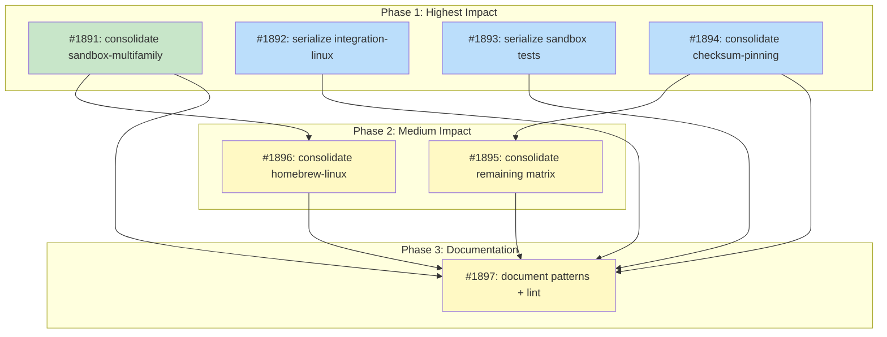

# DESIGN: CI Job Consolidation

## Status

**Status:** Planned

## Implementation Issues

### Milestone: [CI Job Consolidation](https://github.com/tsukumogami/tsuku/milestone/99)

| Issue | Dependencies | Tier |
|-------|--------------|------|
| ~~[#1891: ci(build-essentials): consolidate sandbox-multifamily into container loops](https://github.com/tsukumogami/tsuku/issues/1891)~~ | ~~None~~ | ~~testable~~ |
| ~~_Replace the 5x2 family/tool matrix with 2 container-loop jobs (one per tool), each iterating through 5 Linux families sequentially. First application of the test-recipe.yml container loop pattern to build-essentials.yml._~~ | | |
| [#1892: ci(test): serialize integration-linux tests with GHA groups](https://github.com/tsukumogami/tsuku/issues/1892) | None | testable |
| _Collapse the 9-job integration-linux matrix into a single serialized job following the integration-macos pattern already in the same file. Reads test entries from test-matrix.json and wraps each in GHA groups._ | | |
| [#1893: ci(sandbox-tests): serialize sandbox tests with GHA groups](https://github.com/tsukumogami/tsuku/issues/1893) | None | testable |
| _Same serialization pattern as #1892, applied to sandbox-tests.yml. Replaces 9 matrix jobs that use the same test-matrix.json linux entries with a single aggregated job._ | | |
| [#1894: ci(integration-tests): consolidate checksum-pinning into container loop](https://github.com/tsukumogami/tsuku/issues/1894) | None | testable |
| _Replace the 5-family checksum-pinning matrix with a container loop. Passes GITHUB_TOKEN into containers since the test script needs API access for checksum verification._ | | |
| [#1895: ci(integration-tests): consolidate remaining matrix jobs](https://github.com/tsukumogami/tsuku/issues/1895) | [#1894](https://github.com/tsukumogami/tsuku/issues/1894) | testable |
| _Consolidates 5 remaining matrix groups in integration-tests.yml: homebrew-linux (4->1), dlopen-glibc (3->1), dlopen-macos (3->1), dlopen-musl (3->1), and library-integrity (2->1). Uses a mix of container loops and GHA group serialization depending on the job's runner type._ | | |
| [#1896: ci(build-essentials): consolidate homebrew-linux tests](https://github.com/tsukumogami/tsuku/issues/1896) | [#1891](https://github.com/tsukumogami/tsuku/issues/1891) | testable |
| _Serializes 4 homebrew tool tests into a single job with GHA groups, following the macOS pattern already in build-essentials.yml. Depends on #1891 since both modify the same file._ | | |
| [#1897: ci: document consolidation patterns and add drift-prevention lint](https://github.com/tsukumogami/tsuku/issues/1897) | [#1891](https://github.com/tsukumogami/tsuku/issues/1891), [#1892](https://github.com/tsukumogami/tsuku/issues/1892), [#1893](https://github.com/tsukumogami/tsuku/issues/1893), [#1894](https://github.com/tsukumogami/tsuku/issues/1894), [#1895](https://github.com/tsukumogami/tsuku/issues/1895), [#1896](https://github.com/tsukumogami/tsuku/issues/1896) | simple |
| _Documents the container loop and GHA group patterns as the standard for new workflows. Adds a grep-based CI lint check that validates required elements (timeout, exit code capture, failure arrays) to prevent drift._ | | |

### Dependency Graph



**Legend**: Green = done, Blue = ready, Yellow = blocked, Purple = needs-design, Orange = tracks-design

## Context and Problem Statement

The tsuku repository has 53 GitHub Actions workflow files that define roughly 180 job definitions. A worst-case PR (touching Go code, recipes, sandbox code, and test scripts simultaneously) triggers up to 87 jobs across `test.yml` (19), `sandbox-tests.yml` (10), `integration-tests.yml` (20), `build-essentials.yml` (23), and various validation workflows (~10). A more typical PR touching only Go code triggers 28-40 jobs from `test.yml` and `sandbox-tests.yml`. Many of these jobs test Linux distribution families (debian, rhel, arch, suse, alpine) by creating one runner per family, even though all five families run on `ubuntu-latest` using Docker containers. Each job incurs queue wait time and redundant setup overhead (checkout, Go install, binary build), typically 1-2 minutes of shared work that gets repeated 5-10 times across the matrix.

Queue wait times are substantial. A recent `test.yml` run (2026-02-22, run ID 22285437491) shows: the Matrix job completed at 21:18:12, but the first integration-linux job didn't start until 21:25:06 (6m54s queue wait). The last integration-linux job didn't start until 21:29:17 (11m05s queue wait). Each integration test takes 30-50 seconds to run, meaning queue wait exceeds execution time by 8-20x. Note that `test.yml` already caps integration-linux at `max-parallel: 4`, so only 4 of 9 jobs compete for runners at once. Even with this throttle, queue waits are significant.

The concrete cost: `integration-tests.yml` spawns 20 jobs, 9 of which test the same checksum-pinning and homebrew logic across 5 and 4 families respectively, all on ubuntu-latest. `build-essentials.yml` creates 10 jobs from a 5 families x 2 tools matrix, again all on ubuntu-latest. `test.yml` creates 9 separate jobs to install 9 different tools, each doing its own Go build. `sandbox-tests.yml` does the same with 9 more jobs from the same test matrix. That's 37 jobs doing substantially the same setup before running tests that differ only in the container image or tool name.

Meanwhile, `test-recipe.yml` already solves this correctly: it runs all 5 Linux families in a single job by looping through Docker containers sequentially. Each test gets its own `docker run`, results are aggregated in one step summary, and the whole thing takes one runner. `build-essentials.yml` does something similar for macOS, aggregating all tool tests into a single job with GHA groups for structured output.

The problem isn't test coverage. It's that identical coverage is achievable with a fraction of the runners. Jobs waiting in the queue while runners are occupied by redundant setup time is waste that grows with every new workflow added.

### Scope

**In scope:**
- Consolidating family-per-job matrices into single-runner containerized loops
- Serializing tool-per-job matrices with GHA groups
- Applying patterns from test-recipe.yml and build-essentials.yml macOS to other workflows
- Reducing worst-case PR job count by ~47% (typical Go-only PRs by ~55%)

**Out of scope:**
- Changing what gets tested (coverage stays identical)
- Merging workflows across different trigger conditions
- Changing macOS runner allocation beyond serializing same-runner-type tests (darwin-arm64 and darwin-x86_64 genuinely need separate runners, but tests within the same macOS runner type can be serialized)
- Scheduled/nightly workflow changes (batch-generate, recipe-validation-core)

## Decision Drivers

- **Queue pressure**: Job count directly affects queue wait time. Fewer jobs means shorter waits.
- **Runner minute cost**: Each job has fixed overhead (checkout + Go setup + build). Consolidation amortizes this.
- **Proven patterns exist**: test-recipe.yml and build-essentials.yml macOS already demonstrate the target pattern.
- **Incremental adoption**: Each workflow can be migrated independently, with CI validating each change.
- **Output readability**: GHA groups provide collapsible, structured output equivalent to separate job views.
- **Genuine architecture splits must remain**: linux-x86_64, linux-arm64, darwin-arm64, and darwin-x86_64 require separate runners.

## Considered Options

### Decision 1: How to Handle Linux Family Testing

Every workflow that tests across Linux distribution families faces the same question: should each family get its own runner, or should one runner iterate through containers?

The five Linux families (debian, rhel, arch, suse, alpine) all run on `ubuntu-latest`. The only difference is the Docker image pulled for each test. Setup steps (checkout, Go install, binary build) are identical. Running these as separate matrix entries means five runners doing the same 1-2 minutes of setup before diverging for the actual test, which often takes 30 seconds to 5 minutes.

#### Chosen: Single-runner container loop

Run all Linux families sequentially within one runner using Docker containers, following the pattern in `test-recipe.yml` lines 110-208. The runner builds tsuku once, then iterates through container images. Each family test runs in its own `docker run` invocation, providing the same isolation as separate runners. Results are collected and written to the step summary.

This matches exactly what `test-recipe.yml` already does for recipe testing. The pattern is proven: it correctly handles per-family package manager differences (apt vs dnf vs pacman vs zypper vs apk), captures exit codes, and produces structured summaries.

For arm64, the same approach applies using `ubuntu-24.04-arm` as the runner, iterating through arm64 container images. Arch Linux is excluded on arm64 since no arm64 image exists, same as today.

#### Alternatives Considered

**Family-per-job matrix (current approach)**: Each family gets its own runner via `matrix.family: [debian, rhel, arch, alpine, suse]`. Rejected because it creates 5x the runners with identical setup, and the project already demonstrated the containerized alternative works in test-recipe.yml. The parallelism benefit is minimal since most family tests complete in under 5 minutes and the queue wait often exceeds that.

**Docker Compose multi-container**: Run all families in parallel using docker-compose within a single runner. Rejected because it adds complexity without clear benefit over sequential execution. The families don't need to run simultaneously, and sequential execution is simpler to debug when one family fails.

### Decision 2: How to Handle Tool-Level Integration Tests

`test.yml` runs 9 integration tests on Linux, each as a separate job. All run on `ubuntu-latest`, each doing checkout + Go setup + build before installing one tool. The macOS equivalent already aggregates all tests into one job.

#### Chosen: Serialize with GHA groups

Aggregate all Linux integration tests into a single job that iterates through the test matrix, using GHA `::group::` markers for collapsible output per test. This matches the pattern already used by `test-macos-arm64` and `test-macos-intel` in build-essentials.yml (lines 375-463).

The approach: build tsuku once, then loop through each test entry. Each test gets its own GHA group (`echo "::group::Testing $tool"` ... `echo "::endgroup::"`), a fresh `$TSUKU_HOME`, and a shared download cache. Failures are collected and reported at the end.

The test-matrix.json file already defines the test entries with tool names, descriptions, and optional recipe paths. The consolidated job reads this JSON and iterates, rather than expanding it into a matrix.

#### Alternatives Considered

**Keep tool-per-job matrix**: Each tool gets its own runner for maximum parallelism. Rejected because even with `max-parallel: 4` throttling, 9 matrix entries still create queue contention. The queue data from run 22285437491 shows 7-11 minutes of queue wait for jobs whose tests take 30-50 seconds. The macOS integration tests already serialize in a single job without complaints about wall time.

**Artifact-based binary sharing**: Build tsuku once in a setup job, upload as an artifact, download in each matrix job. This is the pattern test-recipe.yml and platform-integration.yml already use for cross-platform builds. It eliminates the 1-2 minute build overhead per matrix job while preserving parallel execution. Rejected as the primary strategy because it addresses runner-minute waste but not queue pressure -- the same number of jobs still compete for slots. However, this pattern is complementary: workflows that remain multi-job after consolidation (e.g., the 4-runner-type split) should adopt artifact sharing for the tsuku binary.

**Batch into groups of 3**: Split the 9 tests into 3 jobs of 3 tests each, balancing parallelism with consolidation. Rejected because partial consolidation captures less benefit (3 jobs vs 1) and adds maintenance cost deciding which tests go in which batch. The trade-off this preserves -- finer-grained failure signal from separate jobs -- is adequately handled by GHA group output and failure arrays in the consolidated approach.

### Decision 3: Migration Strategy

With 53 workflows and multiple consolidation targets, the question is how to roll out changes without disrupting active development.

#### Chosen: Incremental, one workflow per PR

Migrate one workflow at a time, ordered by job count savings (highest impact first). Each PR refactors a single workflow file, validates that test results match the pre-migration baseline, and merges independently.

Priority order based on job savings:
1. `build-essentials.yml` test-sandbox-multifamily: 10 -> 2 jobs (save 8)
2. `test.yml` integration-linux: 9 -> 1 job (save 8)
3. `sandbox-tests.yml` sandbox-linux: 9 -> 1 job (save 8)
4. `integration-tests.yml` checksum-pinning: 5 -> 1 job (save 4)
5. `integration-tests.yml` homebrew-linux: 4 -> 1 job (save 3)
6. `build-essentials.yml` test-homebrew-linux: 4 -> 1 job (save 3)
7. `integration-tests.yml` dlopen tests: 6 -> 2 jobs (save 4)

#### Alternatives Considered

**All-at-once refactor**: One large PR touching all workflows. Rejected because a failure in one workflow change would block all others, and reviewing 6+ workflow changes in one PR is error-prone. The incremental approach lets each change be validated and reverted independently.

**Create reusable workflow for container loop**: Extract the container loop scaffolding (image array, docker run, exit code capture, failure collection) into a reusable workflow, then have all callers use it. This has genuine appeal since copying ~30 lines into 6+ files creates drift risk -- the exact problem this design addresses. However, the variation between workflows is in what runs inside each container (different env vars, package installs, verification scripts, test commands), not in the loop scaffolding. A reusable workflow would need to accept the inner test command as a multi-line input parameter, which GHA handles poorly (quoting, escaping, multi-step commands). The resulting abstraction would be harder to debug than inline bash. As a mitigation against drift, the implementation approach includes documenting the canonical pattern and adding CI checks that validate loop structure in new workflows.

## Decision Outcome

**Chosen: 1A + 2A + 3A**

### Summary

All Linux family matrices get replaced with single-runner container loops following the test-recipe.yml pattern. A runner builds tsuku once, then iterates through Docker containers for each family, collecting results into a summary. Integration tests that install multiple tools serialize within one runner using GHA groups for structured output, following the build-essentials.yml macOS pattern.

The four genuine runner types remain: linux-x86_64 (`ubuntu-latest`), linux-arm64 (`ubuntu-24.04-arm`), darwin-arm64 (`macos-14`), and darwin-x86_64 (`macos-15-intel`). Within each Linux runner type, family variation happens through Docker containers. Within each runner type, tool-level tests serialize with GHA groups.

The migration happens incrementally: one workflow per PR, ordered by job savings. Each PR validates that the consolidated job produces the same test results as the pre-migration matrix. Total expected reduction is roughly 41 jobs for a worst-case PR run, from ~87 to ~46 (about 47%). A typical Go-only PR saves ~16 jobs.

Container loop implementation follows a common shape: iterate over an array of (family, image, package-manager-command) tuples, run each test in `docker run --rm`, capture exit codes, aggregate results. The specific verification commands differ per workflow, but the loop scaffolding is the same ~30 lines.

For GHA group serialization, the pattern is: iterate over test entries, wrap each in `::group::` / `::endgroup::`, use a fresh `$TSUKU_HOME` per test with a shared download cache, collect failures into an array, report all at end.

### Rationale

The three decisions reinforce each other. Container loops eliminate the family matrix dimension, group serialization eliminates the tool matrix dimension, and incremental rollout lets each change be validated before moving to the next. Together they reduce job count without changing what gets tested.

The proven-pattern argument is strong: test-recipe.yml has been running container loops since it was created, and build-essentials.yml macOS has aggregated tool tests with groups for months. Extending these patterns to other workflows is a mechanical transformation, not a design experiment.

The trade-off is wall time vs queue time. A consolidated job runs tests sequentially where they previously ran in parallel. But queue wait often dominates wall time for smaller tests: a 2-minute test that waits 5 minutes in the queue loses more time to queuing than it saves from parallelism. Only the longest-running tests (builds over 10 minutes) benefit from dedicated runners, and those aren't in the consolidation scope.

### Trade-offs Accepted

By choosing this option, we accept:
- **Longer wall time for consolidated jobs**: A single linux-x86_64 job testing 5 families takes 5x longer than one family alone. Total wall time for a PR increases slightly, but queue wait time decreases substantially because 30 fewer jobs compete for runners.
- **Single-family failures block the whole job**: If debian fails, rhel/arch/suse/alpine results are still produced (the loop continues), but the job reports failure. In the matrix approach, other families show green. This is mitigated by `continue-on-error` at the loop level and summary reporting.
- **More complex bash in workflow files**: The container loop is ~30 lines vs a 3-line matrix definition. However, this complexity is already proven in test-recipe.yml and is straightforward bash (for loop, docker run, exit code capture).
- **Correlated failure risk**: Sequential tests on one runner share network state. If the runner hits a GitHub API rate limit during test 3, tests 4-9 may also fail. In the parallel model, each runner has its own rate-limit budget. This is mitigated by per-test `$TSUKU_HOME` isolation and by the fact that most tests download from GitHub releases (which has separate rate limits from the API).
- **Per-test timeouts required**: If one test hangs (e.g., a package manager blocks waiting for input), it blocks all subsequent tests. Each test must be wrapped in `timeout` (as test-recipe.yml already does with `timeout 300`).

These are acceptable because the queue pressure problem is more impactful than any of these costs, and the project already lives with these trade-offs in test-recipe.yml and build-essentials.yml macOS without issues.

## Solution Architecture

### Overview

The solution is a series of workflow file edits, not new infrastructure. Each target workflow gets its family-per-job or tool-per-job matrix replaced with a container loop or GHA group serialization pattern.

### Container Loop Pattern

Used for all Linux family testing. Shape (from test-recipe.yml):

```yaml
runs-on: ubuntu-latest
steps:
  - uses: actions/checkout@v6
  - uses: actions/setup-go@v6
  - name: Build tsuku
    run: CGO_ENABLED=0 go build -o tsuku ./cmd/tsuku
  - name: Test across Linux families
    run: |
      IMAGES=("debian:bookworm-slim" "fedora:41" "archlinux:base" "opensuse/tumbleweed" "alpine:3.21")
      FAMILIES=("debian" "rhel" "arch" "suse" "alpine")
      FAILED=()
      for idx in "${!FAMILIES[@]}"; do
        family="${FAMILIES[$idx]}"
        image="${IMAGES[$idx]}"
        echo "::group::Testing on $family"
        timeout 300 docker run --rm -e GITHUB_TOKEN -v "$PWD:/workspace" -w /workspace "$image" sh -c "
          # family-specific package install
          # run actual test
        "
        EXIT_CODE=$?
        if [ "$EXIT_CODE" != "0" ]; then FAILED+=("$family"); fi
        echo "::endgroup::"
      done
      if [ ${#FAILED[@]} -gt 0 ]; then exit 1; fi
```

### GHA Group Serialization Pattern

Used for tool-level integration tests. Shape (from build-essentials.yml macOS):

```yaml
runs-on: ubuntu-latest
steps:
  - uses: actions/checkout@v6
  - uses: actions/setup-go@v6
  - name: Build tsuku
    run: CGO_ENABLED=0 go build -o tsuku ./cmd/tsuku
  - name: Run integration tests
    run: |
      FAILED=()
      CACHE_DIR="${{ runner.temp }}/tsuku-cache/downloads"
      mkdir -p "$CACHE_DIR"

      run_test() {
        local tool="$1" recipe="$2"
        echo "::group::Testing $tool"
        export TSUKU_HOME="${{ runner.temp }}/tsuku-$tool"
        mkdir -p "$TSUKU_HOME"
        # install and verify
        echo "::endgroup::"
      }

      run_test "actionlint" ""
      run_test "btop" ""
      # ... more tests
      if [ ${#FAILED[@]} -gt 0 ]; then exit 1; fi
```

### Job Topology After Consolidation

For `test.yml`:
```
matrix (1 job) --> unit-tests (1)
              --> lint-tests (1)
              --> functional-tests (1)
              --> rust-test (2: ubuntu + macos)
              --> validate-recipes (1)
              --> integration-linux (1)      # was 9
              --> integration-macos (1)      # already aggregated
```

For `sandbox-tests.yml`:
```
matrix (1 job) --> sandbox-linux (1)         # was 9
```

For `integration-tests.yml`:
```
checksum-pinning-linux (1)           # was 5
homebrew-linux (1)                   # was 4
library-integrity (1)                # was 2 (combine)
library-dlopen-glibc (1)            # was 3
library-dlopen-musl (1)              # was 3 (serialize within container runner)
library-dlopen-macos (1)            # was 3
```

For `build-essentials.yml`:
```
test-homebrew-linux (1)              # was 4
test-meson-build-linux (1)           # stays 1
test-cmake-build-linux (1)           # stays 1
test-sqlite-source-linux (1)         # stays 1
test-git-source-linux (1)            # stays 1
test-tls-cacerts-linux (1)           # stays 1
test-zig-linux (1)                   # stays 1
test-no-gcc (1)                      # stays 1
test-sandbox-multifamily (2)         # was 10 (1 per tool, families in containers)
test-macos-arm64 (1)                 # already aggregated
test-macos-intel (1)                 # already aggregated
```

### Expected Job Counts

| Workflow | Before | After | Saved |
|----------|--------|-------|-------|
| test.yml | 19 | 11 | 8 |
| sandbox-tests.yml | 10 | 2 | 8 |
| integration-tests.yml | 20 | 6 | 14 |
| build-essentials.yml | 23 | 12 | 11 |
| test-recipe.yml | 5 | 5 | 0 |
| Validation workflows | 10 | 10 | 0 |
| **Total** | **87** | **46** | **41** |

Note: "Before" counts assume a worst-case PR that triggers all workflows (excluding LLM-specific conditional jobs). Job counts include housekeeping jobs (matrix, check-artifacts, lint-workflows) since they consume runner slots. A typical Go-only PR triggers test.yml and sandbox-tests.yml (29 jobs before, 13 after, saving 16). PRs that also touch recipe or sandbox code trigger integration-tests.yml and build-essentials.yml.

### Wall-Time Trade-off

The consolidation trades parallelism for fewer queue slots. Concrete comparison for integration-linux (test.yml):

**Before (9 parallel jobs with max-parallel: 4):**
- Build overhead: 1-2 min per job (repeated 9 times)
- Queue wait: 7-11 min (measured from run 22285437491)
- Test execution: 30-50 sec per job
- Wall time: ~12-13 min (queue wait dominates)

**After (1 serialized job):**
- Build overhead: 1-2 min (once)
- Queue wait: ~2-4 min (one job instead of 9)
- Test execution: ~5-8 min (9 tests x 30-50 sec)
- Wall time: ~8-12 min

For tests with 30-50 second execution times, serialization is faster end-to-end because queue wait savings exceed the parallelism loss. For longer-running tests (builds over 10 minutes), the balance shifts toward parallelism, which is why those remain as separate jobs.

## Implementation Approach

### Phase 1: Highest Impact (save 28 jobs)

Consolidate the four biggest matrix offenders:

1. **build-essentials.yml test-sandbox-multifamily**: Replace the 5x2 matrix with 2 jobs (one per tool), each running all families in containers. Saves 8 jobs.
2. **test.yml integration-linux**: Replace the 9-job matrix with 1 aggregated job using GHA groups. Follows the integration-macos pattern already in the same file. Saves 8 jobs.
3. **sandbox-tests.yml sandbox-linux**: Replace the 9-job matrix (same test-matrix.json entries as test.yml) with 1 aggregated job. Saves 8 jobs.
4. **integration-tests.yml checksum-pinning**: Replace the 5-family matrix with 1 container-loop job. Saves 4 jobs.

### Phase 2: Medium Impact (save 13 jobs)

5. **integration-tests.yml homebrew-linux**: Replace 4-family matrix with 1 container-loop job. Saves 3 jobs.
6. **build-essentials.yml test-homebrew-linux**: Replace 4-tool matrix with 1 serialized job. Saves 3 jobs.
7. **integration-tests.yml dlopen tests**: Consolidate 3 glibc and 3 macos library-dlopen jobs into 1 each. Saves 4 jobs.
8. **integration-tests.yml library-dlopen-musl**: Consolidate 3 library tests into 1 serialized job within the existing `golang:1.23-alpine` container runner. Uses GHA group serialization (Decision 2 pattern), not container loop, since the job already runs inside a container via GHA's `container:` directive. Saves 2 jobs.
9. **integration-tests.yml library-integrity**: Consolidate 2 library tests into 1 serialized job. Saves 1 job.

### Validation Strategy

Each migration PR must exercise the modified workflow and produce passing results before merge. The validation approach for each PR:

1. **Self-triggering**: All four target workflows trigger on changes to their own workflow file. `test.yml` and `sandbox-tests.yml` have no path filter (trigger on all PRs). `integration-tests.yml` and `build-essentials.yml` include their own file path in their triggers. So changing any target workflow file in a PR will cause that workflow to run with the new configuration.

2. **Result comparison**: Before creating the migration PR, record the test results from a recent passing run of the pre-migration workflow (which tests passed, which families/tools were covered). After the PR's CI runs, compare results: every test that passed before must still pass, and the set of families/tools tested must be identical.

3. **Job count verification**: After the PR's CI completes, count the actual jobs created by the modified workflow. The count should match the "After" column in the Expected Job Counts table. This is a manual check during review.

4. **Step summary inspection**: Verify that the consolidated job's step summary produces structured output (pass/fail per family or per tool) that's equivalent to the information previously visible as separate job statuses.

5. **Failure mode testing**: For at least the first migration PR, intentionally break one family/tool test to confirm that (a) the loop continues to test remaining entries, (b) the failure is visible in the step summary, and (c) the job exits non-zero. Revert before merge.

### Phase 3: Documentation and Drift Prevention

10. Compare before/after job counts for a sample PR that triggers all workflows.
11. Document the containerization and group patterns as the standard for new workflows.
12. Add a CI lint check (grep-based) that verifies container loops in workflow files include `timeout`, exit code capture, and failure array patterns. This prevents drift as new workflows are added.

## Security Considerations

### Download Verification

Not applicable. This change modifies workflow structure (how tests are orchestrated) but doesn't alter how any binaries are downloaded, verified, or installed. The actual test commands remain identical; only their execution topology changes.

### Execution Isolation

Container-based tests retain the same isolation they have today. Each `docker run --rm` creates an ephemeral container that's destroyed after the test. The volume mount (`-v "$PWD:/workspace"`) is read-write -- containers write exit code files and test artifacts back to the workspace, and could in principle modify the tsuku binary or test scripts on the host. This is the same mount mode and risk profile as test-recipe.yml today; consolidation doesn't change it. No privilege escalation occurs, and `--rm` ensures no state leaks between family tests.

GHA-group-serialized tests use separate `$TSUKU_HOME` directories per test, same as the current matrix approach. Each test installs into its own temporary directory.

### Supply Chain Risks

Not applicable. This change doesn't alter the source of any binaries or test infrastructure. The same Docker images (debian:bookworm-slim, fedora:41, etc.) are used, pulled from Docker Hub as they are today. No new supply chain dependencies are introduced.

### User Data Exposure

CI workflows don't access user data. The only secret involved in the target workflows is `GITHUB_TOKEN` (for API rate limits). Some test scripts (checksum-pinning, homebrew-linux) currently pass `GITHUB_TOKEN` into Docker containers via `-e GITHUB_TOKEN`. The consolidated container loop must preserve this -- the loop template should include `-e GITHUB_TOKEN` where tests need it. This is the same token exposure as the current per-job approach; consolidation doesn't change the risk.

## Consequences

### Positive

- **~47% fewer jobs per worst-case PR**: From ~87 to ~46, directly reducing queue contention. Typical Go-only PRs save ~16 jobs.
- **Lower runner-minute cost**: Amortizing setup (checkout + Go + build) across multiple tests instead of repeating it per family/tool.
- **Faster CI feedback loop**: Fewer jobs in the queue means faster start times for the remaining jobs.
- **Consistent patterns**: All workflows follow the same 4-runner-type model with container loops for families.

### Negative

- **Longer wall time for consolidated jobs**: A job that tests 5 families sequentially takes longer than testing 1 family. However, queue wait time savings typically exceed this cost.
- **Single-family failures are less visible**: In a matrix, a failing family shows as a red job name. In a container loop, the failure appears in logs and the step summary. Mitigated by clear `::group::` output and failure arrays.
- **Bash complexity in workflow files**: Container loops are more complex than matrix declarations. Mitigated by copying the proven test-recipe.yml pattern.
- **Correlated failure risk**: Sequential tests share a runner's network state. A transient issue (rate limit, download timeout) during one test can cascade to subsequent tests. Mitigated by per-test isolation (`$TSUKU_HOME` directories) and per-test timeouts.

### Mitigations

- Step summaries provide per-family/per-tool pass/fail tables, equivalent to matrix job status.
- Container loops use `continue-on-error` at the bash level (collecting failures in an array), so all families/tools complete even if one fails.
- Each migration PR can be validated by comparing its test results against the pre-migration run.
