# DESIGN: Curated Recipe System

## Status

Planned

## Context and Problem Statement

tsuku's recipe registry contains roughly 1,400 TOML files organized in alphabetical
subdirectories (`recipes/a/` through `recipes/z/`). Of these, approximately 184 are
handcrafted recipes authored by contributors, while the remaining ~1,218 are output
from a batch pipeline that generates recipes from Homebrew package metadata using an
LLM. The two groups are visually distinguishable only by the absence of `tier = 0`
and `llm_validation = "skipped"` fields — fields that were never designed to carry
this semantic, and which go unread by any runtime code.

This distribution creates a structural problem. The batch pipeline optimizes for
breadth: it can produce a recipe for almost any Homebrew package. But it produces
Homebrew-bottle-based recipes that fail outside the narrow set of environments where
Homebrew works. Many high-profile tools end up with recipes that only install on
Linux with glibc, explicitly excluding macOS in `supported_os` or
`unsupported_platforms` fields. kubectl (`kubernetes-cli.toml`) and helm (`helm.toml`)
are prominent examples: both appear in `tsuku search kubernetes-cli` results but fail
on macOS, which is where most Kubernetes practitioners work.

A second category is tools that have `recipes/discovery/` entries — they appear in
search results — but no recipe at all. bat, starship, neovim, cmake, and awscli fall
here. A user who finds `neovim` in search and runs `tsuku install neovim` receives an
error rather than an installation. This is strictly worse than no search result,
because it implies coverage that isn't there.

A third category is missing entirely. The tools that tsuku users are most likely to
install after setting up tsuku itself — node, claude, gcloud, aider, gemini-cli — have
no recipe and no discovery entry. The `claude` case is especially visible: because
there's no registry entry, the ecosystem probe stage searches for a package literally
named "claude" across all ecosystems and returns five unrelated npm packages, producing
an `AmbiguousMatchError` that terminates the install flow with no clear path forward.

The common thread is that there is no system to identify which recipes are
high-quality, protect them from regressions, or create accountability for keeping them
current. A recipe that ships in a PR, passes CI, and then never changes will receive
no further install testing. Silent rot — a broken download URL, a renamed release
artifact, a changed binary path — is only discovered when a user hits it.

## Decision Drivers

- **Zero infrastructure change preferred** for the curation signal: adding a new
  registry URL layout or provider chain slot requires changes across `registry.go`,
  `loader.go`, and the cache path derivation, and affects all existing recipes.
- **Incremental adoption**: the approach must work for 184 existing handcrafted recipes
  without requiring all of them to be touched immediately.
- **CI-enforceable**: the curation signal must be machine-readable so CI can gate on
  it (e.g., requiring `curated = true` in PRs that touch handcrafted recipes).
- **Nightly testing cadence**: curated recipes must get cross-platform install testing
  at least nightly, on the full platform matrix, not just on push.
- **Discovery correctness for scoped packages**: tools where the binary name differs
  from the ecosystem package name need a separate mechanism to prevent the ecosystem
  probe from resolving to the wrong package.
- **Scope**: this design covers the registry, CI, and initial recipe authoring. It does
  not cover the tsuku CLI consumer path (the `Loader` and `Resolver` layers are not
  changed by this design), the batch pipeline, or the website.

## Considered Options

### Decision 1: Curated Recipe Provenance Signal

The registry currently has no machine-readable way to distinguish a handcrafted recipe
from a batch-generated one. The implicit signal — absence of `tier = 0` and
`llm_validation = "skipped"` — was never designed for this purpose and can't be
enforced. Three structural approaches exist: a metadata flag in the TOML file, a
dedicated subdirectory in the registry, or accepting the implicit signal as-is.

#### Chosen: `curated = true` flag in `[metadata]`

Add a boolean `curated` field to the `[metadata]` section of handcrafted recipe TOML:

```toml
[metadata]
name = "gh"
description = "GitHub CLI"
curated = true
```

The flag is an opt-in signal. Existing handcrafted recipes work without it; they can
be tagged incrementally. CI cannot distinguish a handcrafted recipe from a
batch-generated one by file inspection alone — the enforcement boundary is the
`ci.curated` array: any recipe listed there is required to carry `curated = true`.
Batch-generated recipes (like those in PRs from the automation pipeline) are never
added to `ci.curated`, so the lint check never fires for them. The flag has no runtime
effect on the install path — it's metadata-only, parsed by `MetadataSection` in
`internal/recipe/types.go` where `Tier` and other metadata fields already live.

This approach is backward-compatible with all 184 existing handcrafted recipes (they
continue to work and can be tagged in a follow-up batch commit), requires no changes
to the provider chain or URL construction, and produces a machine-readable signal that
CI scripts, linters, and the batch pipeline can all consume.

#### Alternatives Considered

**`recipes/core/` dedicated subdirectory**: Create a separate directory
`recipes/core/` for curated recipes, distinct from the alphabetical `recipes/{letter}/`
layout. Rejected because the registry provider in `registry.go` constructs fetch URLs
as `{BaseURL}/recipes/{letter}/{name}.toml`; a flat `recipes/core/` layout would
require a new URL variant and a new provider chain slot inserted between the embedded
and central registry, touching multiple packages (`registry/`, `recipe/`, `cmd/tsuku/`).
The structural signal is stronger, but the change surface is significantly larger. This
remains a viable future path when the registry URL architecture is revisited.

**Rely on absence of generated fields (status quo)**: The current implicit signal
(handcrafted = no `tier`, no `llm_validation`) is already reliable as a provenance
marker. Rejected because it's a negative signal, unenforced, and invisible to tooling.
Any recipe that accidentally omits `tier = 0` would appear handcrafted. There is no
way to write a lint rule that says "this recipe must be curated" without an explicit
positive signal.

### Decision 2: Periodic Install Testing

The current nightly workflow (`test.yml` schedule trigger) executes a sample of about
26 recipes per night, one per letter directory. The sample is alphabetically
deterministic within each letter (the first recipe not on an exclusion list), not
importance-weighted. A curated recipe for `gh` only receives nightly testing if it
happens to be the first non-excluded recipe under `g/`. Silent rot between PR-time
validation and the next time the recipe is explicitly changed is possible and has
occurred (the `pwned.toml` saga being one example from the batch pipeline).

Three mechanisms exist to extend this: an opt-in array in the existing
`test-matrix.json`, a separate nightly workflow file, or the status quo.

#### Chosen: `ci.curated` array in `test-matrix.json`

Extend `test-matrix.json` with a `ci.curated` array listing recipe paths that should
receive full nightly cross-platform install testing:

```json
{
  "ci": {
    "scheduled": ["recipes/g/golang.toml", ...],
    "curated": [
      "recipes/c/claude.toml",
      "recipes/g/gh.toml",
      "recipes/n/node.toml",
      "recipes/k/kubectl.toml",
      ...
    ]
  }
}
```

The nightly workflow reads this array and executes each listed recipe against the full
11-platform matrix (5 Linux x86_64, 4 Linux arm64, 2 macOS). On failure, the workflow
creates a GitHub issue with platform, recipe, and failure log attached. The `ci.curated`
array is the authoritative declaration of what is considered curated from a testing
perspective; it complements (but is separate from) the `curated = true` TOML flag.

This approach extends an existing pattern (`ci.scheduled` is already in `test-matrix.json`),
keeps all nightly testing configuration in one file, and is incrementally adoptable
(start with 5-10 recipes, expand as more are authored).

#### Alternatives Considered

**Separate nightly workflow file** (`curated-recipes-nightly.yml`): A standalone
workflow file dedicated to curated recipe testing, with the recipe list hardcoded or
read from a separate manifest. Rejected because it fragments CI configuration across
multiple files, duplicates the platform matrix already defined in `test-matrix.json`,
and creates maintenance burden when the platform matrix changes (it must be updated in
two places). The `test-matrix.json` pattern exists precisely to centralize this.

**Status quo (alphabetical nightly sample)**: Keep the current nightly sample,
relying on CI coverage from recipe change PRs. Rejected because a recipe that ships,
passes PR CI, and then never changes receives no further testing. Download URLs change,
release artifacts get renamed, binary paths shift — none of these are caught by PR CI
which only runs when the recipe file changes.

### Decision 3: Discovery Entry Strategy for Name-Mismatch Tools

Some tools have a binary name that differs from their canonical ecosystem package name.
The primary example is claude: the installed binary is `claude`, but the npm package
is `@anthropic-ai/claude-code`. A second example is gemini-cli: the binary is
`gemini`, installed via the npm package `@google/gemini-cli`.

When a user runs `tsuku install claude`, the resolution chain works as follows:
1. Registry lookup: checks `recipes/discovery/c/cl/claude.json` — miss (no entry)
2. Ecosystem probe: queries all ecosystems for a package named "claude"
3. npm returns a real (but unrelated) npm package named "claude"
4. `AmbiguousMatchError`: multiple ecosystem matches, install terminates

The question is whether fixing this requires only a handcrafted recipe, a discovery
entry alongside the recipe, or a fix to `NpmBuilder.Build()` so it uses `req.SourceArg`
instead of `req.Package` for the npm registry fetch.

#### Chosen: Handcrafted recipe + companion discovery entry; NpmBuilder fix deferred

Two artifacts are required for tools with name-mismatch:

1. **Handcrafted recipe** (`recipes/c/claude.toml`) with the `npm_install` action and
   an explicit `package = "@anthropic-ai/claude-code"` field. The `NpmInstallAction`
   reads `package` directly from the TOML step, so this bypasses the `NpmBuilder` path
   entirely. The recipe name matches the binary name (`claude`, not `claude-code`),
   consistent with the `wrangler.toml` precedent (recipe name = command name).

2. **Discovery entry** (`recipes/discovery/c/cl/claude.json`) with
   `{"builder": "npm", "source": "@anthropic-ai/claude-code"}`. This entry short-circuits
   the ecosystem probe stage: a registry hit returns immediately with
   `ConfidenceRegistry`, preventing the probe from searching for a package literally
   named "claude" and finding the wrong one.

The `NpmBuilder.Build()` gap (it uses `req.Package` not `req.SourceArg` for the npm
fetch, so auto-generation from a discovery entry alone would query the wrong package)
is acknowledged as a real issue but treated as separate scope. Fixing it would enable
auto-generation for scoped npm tools without handcrafted recipes — valuable for
gemini-cli and similar tools — but it is a behavior change in `NpmBuilder` that
requires its own review.

#### Alternatives Considered

**Handcrafted recipe only (no discovery entry)**: If a handcrafted recipe exists at
`recipes/c/claude.toml`, the registry provider returns it on the first lookup and the
ecosystem probe never runs. Rejected because discovery entries serve a second purpose:
they populate `tsuku search` results with the correct package source, enabling the
CLI to show accurate context even if the user runs `tsuku search claude` without
installing. A discovery entry with no recipe is harmful (the tool appears but fails),
but a recipe with no discovery entry leaves a gap in search accuracy.

**Fix `NpmBuilder` to use `req.SourceArg` when set**: Change `NpmBuilder.Build()` to
prefer `req.SourceArg` over `req.Package` for the npm metadata fetch. This would make
auto-generation from discovery entries work correctly for scoped packages, eliminating
the need for handcrafted recipes for tools like gemini-cli. Deferred because it is a
behavior change in the builder layer, touches the auto-generation path, and carries
risk of unintended side effects on other npm tools. It should be a dedicated PR with
its own test coverage, not bundled into initial recipe authoring.

## Decision Outcome

**Chosen: D1 (curated flag) + D2 (ci.curated array) + D3 (recipe + discovery entry)**

### Summary

The curated recipe system introduces three coordinated changes. First, handcrafted
recipes gain a `curated = true` field in `[metadata]` — a boolean provenance signal
that CI can enforce, linters can read, and the batch pipeline can use to avoid
overwriting manually authored content. The enforcement boundary is the `ci.curated`
array: recipes listed there are required to carry the flag. Batch-generated recipes
(never in `ci.curated`) are unaffected. Existing handcrafted recipes can be tagged
incrementally in a follow-up commit.

Second, `test-matrix.json` gains a `ci.curated` array listing recipes by path. The
nightly workflow reads this array and runs full cross-platform install tests for each
listed recipe, creating an issue on failure. This turns the nightly test from an
alphabetically-random sample into a targeted health check for the recipes most users
depend on.

Third, an initial batch of high-priority handcrafted recipes addresses the most
significant coverage gaps. For npm tools where the binary name differs from the package
name (claude, gemini-cli), each recipe is paired with a companion discovery entry to
prevent ecosystem probe collisions. The initial batch targets the 7-13 tools where a
missing or broken recipe has the highest user impact: claude, node, neovim, kubectl
(replacing the Linux-only batch version), helm (replacing Linux-only), bat, and
starship.

### Rationale

These three changes are deliberately minimal in scope. The `curated = true` flag
formalizes an existing implicit convention without touching the provider chain or
URL construction — unlike a `recipes/core/` directory, which would require changes
across `registry.go`, `loader.go`, and the cache path derivation. The `ci.curated`
array uses recipe paths (not test IDs) — a small schema divergence from the existing
`ci.scheduled` pattern, but avoids polluting the `tests` object with entries that are
not test-pattern demonstrations. The new `curated-nightly.yml` wrapper calls the
existing `recipe-validation-core.yml` via `workflow_call`, reusing the 11-platform
sandbox matrix without modifying the PR-triggered workflow. The initial batch of 7-13
recipes is achievable as a focused sprint and validates the pattern before scaling to
the broader gap of 20+ tools.

The key trade-off accepted: the `curated = true` flag is advisory unless CI enforces
it. A recipe that arrives without the flag isn't automatically rejected — it requires
an explicit lint rule in the validation workflow. This enforcement should be
implemented in the same PR that introduces the first curated recipes, not deferred.

## Solution Architecture

### Overview

The curated recipe system operates at three layers: the recipe files themselves (TOML
metadata), the CI configuration (`test-matrix.json` + nightly workflow), and the
discovery registry (JSON entries in `recipes/discovery/`). No changes are made to the
Go source code in this design.

### Components

**1. Recipe TOML (`recipes/{letter}/{name}.toml`)**

The `[metadata]` section gains a `curated` boolean:

```toml
[metadata]
name = "claude"
description = "Claude Code - Anthropic's AI coding assistant"
homepage = "https://github.com/anthropics/claude-code"
curated = true

[[steps]]
action = "npm_install"
package = "@anthropic-ai/claude-code"
executables = ["claude"]

[verify]
command = "claude --version"
mode = "output"
reason = "Version flag behavior varies across releases"
```

The `MetadataSection` struct in `internal/recipe/types.go` gains a `Curated bool`
field after `LLMValidation string` (line 165), consistent with existing advisory
metadata fields. No other runtime code reads this field; it is metadata for CI and
tooling. Note: `ToTOML()` does not serialize advisory fields (`Tier`, `LLMValidation`)
and will not serialize `Curated` either. This is intentional — `ToTOML` is not used
to round-trip handcrafted recipes; the batch pipeline reads the parsed struct directly.

**2. Discovery Entry (`recipes/discovery/{letter}/{two-letter}/{name}.json`)**

For tools with binary-name ≠ package-name, a companion JSON entry in the discovery
registry:

```json
{
  "builder": "npm",
  "source": "@anthropic-ai/claude-code",
  "description": "Claude Code AI coding assistant",
  "homepage": "https://github.com/anthropics/claude-code"
}
```

Path derivation: `RegistryEntryPath("claude")` → `c/cl/claude.json`.

Handcrafted discovery entries omit pipeline-managed fields (`downloads`,
`has_repository`) that the batch pipeline populates from Homebrew metrics. These fields
are optional analytics metadata and do not affect install behavior.

**3. `test-matrix.json` (`test-matrix.json`)**

New `ci.curated` array under the existing `ci` key. Unlike `ci.linux`, `ci.macos`, and
`ci.scheduled` (which hold test IDs referencing the `tests` object), `ci.curated` holds
recipe paths directly. Corresponding entries in the `tests` object are not required.

```json
{
  "ci": {
    "scheduled": ["...existing test IDs..."],
    "curated": [
      "recipes/c/claude.toml",
      "recipes/g/gh.toml",
      "recipes/n/neovim.toml",
      "recipes/n/node.toml",
      "recipes/k/kubectl.toml",
      "recipes/h/helm.toml",
      "recipes/b/bat.toml",
      "recipes/s/starship.toml"
    ]
  }
}
```

The nightly workflow reads this array with `jq '.ci.curated[]'` — different from the
existing `jq -c '[.ci.scheduled[] as $id | {id: $id, tool: .tests[$id].tool}]'`
pattern used for test-ID arrays.

**4. Nightly CI Workflow (`curated-nightly.yml`)**

A new `curated-nightly.yml` workflow (rather than modifying the existing PR-triggered
`recipe-validation-core.yml`) runs on a nightly schedule. It reads `ci.curated`,
generates a recipe path matrix, and calls `recipe-validation-core.yml` via
`workflow_call` with the filtered recipe set. This reuses the existing 11-platform
sandbox matrix without adding a schedule trigger to the PR workflow. On failure, a
GitHub issue is created with:
- Recipe name and path
- Failing platform(s)
- Sandbox container output / error
- Automatic label `curated-recipe-failure`

Required permissions: `issues: write` (for failure issue creation), `contents: read`.
If `recipe-validation-core.yml`'s PR-creation step (which auto-adds platform
constraints after sandbox failures) is inherited, `pull-requests: write` and
`contents: write` are also required and must be declared explicitly in the wrapper.

**5. Lint Rule (recipe validation CI)**

A new step in `recipe-validation-core.yml`'s `prepare` job: for each recipe in
`ci.curated`, validate that `curated = true` is present in `[metadata]`. This is a
CI script check (not a `tsuku validate` rule, which would require the validator to
read `test-matrix.json`). The check gates any PR that adds a recipe to `ci.curated`
without the flag.

### Key Interfaces

**`MetadataSection.Curated bool`** (`internal/recipe/types.go`): TOML-parsed field,
tagged `toml:"curated"`. Default zero value (`false`) means "not explicitly curated";
any recipe without the field continues to work unchanged.

**`RegistryEntryPath(name string) string`** (`internal/discover/registry.go`): No
change. Discovery entries for curated tools follow the same path derivation as any
other discovery entry.

**`test-matrix.json` schema**: The `ci.curated` array is a flat list of recipe paths
relative to the repo root. The nightly workflow script reads this with `jq
'.ci.curated[]'`.

### Data Flow

For a curated npm tool (e.g., `tsuku install claude`):

```
tsuku install claude
    ↓
registry.Loader.Get("claude")
    ↓ fetches recipes/c/claude.toml from central registry (24hr TTL cache)
    ↓ returns Recipe{Metadata.Name: "claude", Metadata.Curated: true, ...}
executor.Plan(recipe)
    ↓
NpmInstallAction.Execute()
    → npm install -g --prefix=$TSUKU_HOME/tools/claude-{version} @anthropic-ai/claude-code
    → symlinks claude binary to $TSUKU_HOME/bin/claude
```

The discovery entry is **not** consulted on a normal install. It serves two purposes:

1. **Search**: `tsuku search claude` reads discovery entries directly to show package
   source and description before any install is attempted.
2. **Probe fallback**: if `tryDiscoveryFallback` is invoked (recipe not in local cache
   and not found via central registry), the discovery entry short-circuits the ecosystem
   probe from matching a wrong npm package named "claude".

In the fallback path, however, a known gap applies: `NpmBuilder.Build()` uses
`req.Package` (the tool name, "claude") not `req.SourceArg` (the scoped package name)
for the npm registry fetch. Until the NpmBuilder fix is shipped, the fallback path
would query npm for "claude" rather than "@anthropic-ai/claude-code". This makes the
handcrafted recipe at `recipes/c/claude.toml` in the central registry critical —
the recipe path is always used on installs once the registry is populated, which
happens on the first install or update-registry invocation.

## Implementation Approach

### Phase 1: Foundation (curated flag + CI infrastructure)

Add `Curated bool` to `MetadataSection` in `internal/recipe/types.go`. Add
`ci.curated` array to `test-matrix.json` with placeholder entries. Update the nightly
workflow to read the array and run full matrix testing for listed recipes. Add the
lint check to `recipe-validation-core.yml`. No handcrafted recipes yet.

Deliverables:
- `internal/recipe/types.go`: `Curated bool \`toml:"curated"\`` after `LLMValidation`
- `test-matrix.json`: `ci.curated` array (initially with `recipes/g/gh.toml` as a
  known-good canary)
- `.github/workflows/curated-nightly.yml`: new wrapper workflow calling
  `recipe-validation-core.yml` with filtered recipe set; declares `issues: write`,
  `contents: read`, and (if inheriting PR-creation step) `pull-requests: write`,
  `contents: write`
- Lint check step in `recipe-validation-core.yml`'s `prepare` job: cross-checks
  `ci.curated` recipe paths against `curated = true` presence

### Phase 2: First wave — npm tools (claude, gemini-cli)

Author `recipes/c/claude.toml` and `recipes/discovery/c/cl/claude.json`. Add to
`ci.curated`. Optionally add gemini-cli using the same pattern.

Deliverables:
- `recipes/c/claude.toml`
- `recipes/discovery/c/cl/claude.json`
- (optional) `recipes/g/gemini-cli.toml` + discovery entry
- `test-matrix.json` update: add claude to `ci.curated`

### Phase 3: High-impact replacements (kubectl, helm, bat, starship, neovim)

Replace the Linux-only batch-generated recipes for kubectl and helm with handcrafted
multi-platform versions using direct binary download (kubectl from `dl.k8s.io`, helm
from `get.helm.sh`). Author bat, starship, and neovim using the `github_archive`
action following the `fzf.toml` pattern (each has clean GitHub releases).

Deliverables:
- `recipes/k/kubectl.toml` (new additive recipe; `kubernetes-cli.toml` remains as the
  Linux-only batch recipe, since it already has `supported_os = ["linux"]`)
- `recipes/h/helm.toml` (replacement of existing Linux-only batch recipe)
- `recipes/b/bat.toml`
- `recipes/s/starship.toml`
- `recipes/n/neovim.toml`
- All five added to `ci.curated`

### Phase 4: Node.js and broader expansion

Node.js requires downloading from `nodejs.org` with platform-specific tarballs — not
a GitHub release pattern. Author `recipes/n/node.toml` following the Go recipe pattern
(`golang.toml`). Add additional tools from the priority list (awscli, pyenv, ripgrep
replacement, fd replacement) based on capacity.

Deliverables:
- `recipes/n/node.toml`
- Priority-ordered additional recipes
- Remaining tools added to `ci.curated`

## Security Considerations

This design adds recipes that download and install software from external sources. The
security considerations apply to the recipe content (what URLs are used, whether
checksums are verified) and to the CI changes (whether the nightly testing creates new
attack surface).

**External artifact handling and checksum verification**: Handcrafted recipes must
specify download URLs from official sources (npm registry for npm tools, `dl.k8s.io`
for kubectl, `nodejs.org` for Node.js) rather than third-party mirrors. The codebase
classifies checksum verification into three levels: `ChecksumStatic` (SHA256 baked
into the TOML — used by `terraform.toml` and `golang.toml`), `ChecksumDynamic`
(computed at plan-generation time and stored in golden files), and `ChecksumEcosystem`
(the ecosystem's own integrity mechanism, e.g., npm's `integrity` field). For the
initial curated recipes, npm tools use `ChecksumEcosystem`, GitHub-release tools
(bat, starship, neovim, kubectl, helm) use `ChecksumDynamic` at minimum, and tools
that publish official checksums (kubectl publishes SHA256SUMS, helm publishes
checksums) should use `ChecksumStatic`. Advisory: new curated recipes should use the
highest verification level available for their upstream.

**Supply chain trust for npm packages**: The `@anthropic-ai/claude-code` package is
published under Anthropic's verified npm organization scope. Scope ownership means an
attacker cannot publish to that scope without compromising Anthropic's npm credentials
— a meaningful signal of provenance, but not a cryptographic guarantee. The actual
integrity control is `npm ci` with pinned lockfile hashes: `NpmInstallAction` runs
`npm install --package-lock-only` at plan-generation time to capture a lockfile (stored
in the golden file), then runs `npm ci` at install time which enforces the pinned
content hashes of all transitive dependencies. This is deterministic reproducibility,
not just "industry practice." Residual risks: npm organization account compromise would
bypass scope protection; npm Provenance attestation (introduced 2023) is not enforced
by default and `npm ci` does not verify publication provenance.

**CI nightly testing scope**: The `curated-nightly.yml` workflow executes recipes in
the existing sandboxed container environment. The curated array adds more recipes to
this execution context with no new permissions or network scope beyond what
`recipe-validation-core.yml` already uses. Nightly curated tests should use
golden-file plans (deterministic, hash-verified) rather than live installs — the
golden file pins the exact package versions and content hashes, preventing a malicious
version published between runs from being installed silently. Golden files must be
regenerated when the recipe's target version changes. Required workflow permissions:
`issues: write`, `contents: read`, and — if the PR-creation step from
`recipe-validation-core.yml` is inherited — `pull-requests: write` and
`contents: write`. All permissions must be declared explicitly in `curated-nightly.yml`.

**Discovery entry trust and the NpmBuilder fallback**: Discovery entries in
`recipes/discovery/` are code-reviewed on merge into the central registry. A malicious
entry would require a PR passing review. User-local recipe directories (`$TSUKU_HOME/`)
have always had higher implicit trust; a local attacker with write access to
`$TSUKU_HOME` could inject discovery entries — this is pre-existing and accepted.
The known gap in the fallback path (NpmBuilder uses `req.Package` not `req.SourceArg`,
so a cold install that hits the discovery fallback would query npm for "claude" rather
than "@anthropic-ai/claude-code") has a security dimension beyond a correctness bug:
it could install a wrong package if the fallback is reached. The handcrafted recipe at
`recipes/c/claude.toml` in the central registry is the mitigation: once the registry
is populated (first install or update-registry), the recipe path is always used and
the fallback never fires. The NpmBuilder fix (deferred to a separate PR) eliminates
this residual risk entirely.

## Consequences

### Positive

- **Discovery gaps become actionable**: the `ci.curated` array creates a single place
  to declare which recipes matter, and automated testing creates accountability for
  keeping them healthy.
- **Silent rot is detected**: broken download URLs, renamed release artifacts, and
  changed binary paths are caught by nightly testing before users hit them.
- **Claude and other npm tools install correctly**: the recipe + discovery entry
  pattern resolves the `AmbiguousMatchError` for `tsuku install claude` and provides
  a reusable pattern for gemini-cli and similar tools.
- **Incremental adoption**: existing recipes continue to work unchanged; the flag and
  array are opt-in.

### Negative

- **Maintenance overhead for the curated list**: every recipe in `ci.curated` that
  fails nightly creates a GitHub issue. The team must triage these issues or the queue
  grows stale.
- **The `curated = true` flag is advisory without enforcement**: until the lint rule
  is shipped, a recipe can claim curated status without the flag, or have the flag
  without being in `ci.curated`. The two signals are separate and can drift.
- **Node.js recipe complexity**: a correct multi-platform Node.js recipe downloading
  from `nodejs.org` requires handling `.tar.gz` (Linux) vs `.pkg`/`.tar.gz` (macOS)
  and platform-specific filenames. It is more complex than the GitHub-release pattern
  used for most other recipes.

### Mitigations

- **Nightly failure triage**: use the `curated-recipe-failure` label and a designated
  weekly triage rotation. Keep `ci.curated` small enough (start at 8-10 recipes) that
  weekly triage is feasible.
- **Lint enforcement shipped with first curated recipes**: Phase 1 includes the lint
  check, so by the time curated recipes exist, the signal is enforced.
- **Node.js deferred to Phase 4**: by the time Node.js is authored, the team has
  already established patterns from the GitHub-release recipes in Phase 3.

## Implementation Issues

Plan: [docs/plans/PLAN-curated-recipes.md](../plans/PLAN-curated-recipes.md)

| Issue | Dependencies | Tier |
|-------|--------------|------|
| ~~[#2259: feat(recipe): add curated flag to recipe metadata and CI infrastructure](https://github.com/tsukumogami/tsuku/issues/2259)~~ | ~~None~~ | ~~testable~~ |
| ~~_Adds `curated = true` to recipe metadata, `ci.curated` array to test-matrix.json, curated-nightly.yml workflow, and lint check in recipe-validation-core.yml._~~ | | |
| ~~[#2260: docs(recipes): produce top-100 developer tool priority list](https://github.com/tsukumogami/tsuku/issues/2260)~~ | ~~None~~ | ~~simple~~ |
| ~~_Researches and ranks the top 100 most-used developer tools, categorizing each by coverage status (handcrafted, batch-generated, discovery-only, or missing)._~~ | | |
| ~~[#2261: feat(recipes): add handcrafted recipes for claude and gemini-cli](https://github.com/tsukumogami/tsuku/issues/2261)~~ | ~~[#2259](https://github.com/tsukumogami/tsuku/issues/2259)~~ | ~~testable~~ |
| ~~_Adds `recipes/c/claude.toml` and `recipes/g/gemini.toml` using npm_install with glibc-only constraint, plus discovery entries for both tools._~~ | | |
| ~~[#2262: feat(recipes): add cross-platform kubectl recipe](https://github.com/tsukumogami/tsuku/issues/2262)~~ | ~~[#2259](https://github.com/tsukumogami/tsuku/issues/2259)~~ | ~~testable~~ |
| ~~_Replaces or supplements the existing kubectl recipe with a cross-platform version supporting Linux and macOS via direct download from the Kubernetes release server._~~ | | |
| ~~[#2263: feat(recipes): replace Linux-only helm recipe with cross-platform version](https://github.com/tsukumogami/tsuku/issues/2263)~~ | ~~[#2259](https://github.com/tsukumogami/tsuku/issues/2259)~~ | ~~testable~~ |
| ~~_Rewrites the helm recipe to download from official Helm GitHub releases for both Linux and macOS, replacing the Linux-only version._~~ | | |
| ~~[#2264: feat(recipes): add handcrafted recipes for bat, starship, and neovim](https://github.com/tsukumogami/tsuku/issues/2264)~~ | ~~[#2259](https://github.com/tsukumogami/tsuku/issues/2259)~~ | ~~testable~~ |
| ~~_Adds curated handcrafted recipes for bat, starship, and neovim using github_archive with proper platform-specific asset patterns._~~ | | |
| ~~[#2265: feat(recipes): add handcrafted node.js recipe](https://github.com/tsukumogami/tsuku/issues/2265)~~ | ~~[#2259](https://github.com/tsukumogami/tsuku/issues/2259)~~ | ~~testable~~ |
| ~~_Adds `recipes/n/node.toml` using direct download from nodejs.org with platform-specific tarballs for Linux (glibc and musl) and macOS._~~ | | |
| ~~[#2266: feat(recipes): backfill curated recipes — cloud CLIs and build tools](https://github.com/tsukumogami/tsuku/issues/2266)~~ | ~~[#2259](https://github.com/tsukumogami/tsuku/issues/2259), [#2260](https://github.com/tsukumogami/tsuku/issues/2260)~~ | ~~testable~~ |
| ~~_Ships `recipes/a/awscli.toml` using download+PGP-verify from awscli.amazonaws.com and `recipes/c/cmake.toml` using download+extract with SHA-256.txt checksum from Kitware's GitHub releases._~~ | | |
| ~~[#2267: feat(recipes): backfill curated recipes — modern CLI tools and AI assistants](https://github.com/tsukumogami/tsuku/issues/2267)~~ | ~~[#2259](https://github.com/tsukumogami/tsuku/issues/2259), [#2260](https://github.com/tsukumogami/tsuku/issues/2260)~~ | ~~testable~~ |
| ~~_Replaces batch-generated recipes for ripgrep, fd, eza, zoxide, and delta with handcrafted versions, and adds missing AI tool recipes (aider, ollama)._~~ | | |
| ~~[#2268: feat(recipes): backfill curated recipes — remaining top-100 gaps](https://github.com/tsukumogami/tsuku/issues/2268)~~ | ~~[#2259](https://github.com/tsukumogami/tsuku/issues/2259), [#2260](https://github.com/tsukumogami/tsuku/issues/2260), [#2266](https://github.com/tsukumogami/tsuku/issues/2266), [#2267](https://github.com/tsukumogami/tsuku/issues/2267)~~ | ~~testable~~ |
| ~~_Superseded by #2281–#2297; see `docs/plans/PLAN-curated-recipes.md` for the full decomposition into 17 category-sized batches._~~ | | |
| ~~[#2281: feat(recipes): backfill curated recipes — security scanners](https://github.com/tsukumogami/tsuku/issues/2281)~~ | ~~[#2259](https://github.com/tsukumogami/tsuku/issues/2259), [#2260](https://github.com/tsukumogami/tsuku/issues/2260)~~ | ~~testable~~ |
| ~~_Curates trivy, grype, cosign, syft, and tflint — 5 handcrafted recipes needing upstream asset re-verification and the `curated = true` flag._~~ | | |
| ~~[#2282: feat(recipes): backfill curated recipes — Kubernetes core CLIs](https://github.com/tsukumogami/tsuku/issues/2282)~~ | ~~[#2259](https://github.com/tsukumogami/tsuku/issues/2259), [#2260](https://github.com/tsukumogami/tsuku/issues/2260)~~ | ~~testable~~ |
| ~~_Curates k9s, flux, stern, kubectx, and kustomize — 5 handcrafted recipes needing re-verification and the `curated = true` flag._~~ | | |
| ~~[#2283: feat(recipes): backfill curated recipes — Kubernetes ecosystem tools](https://github.com/tsukumogami/tsuku/issues/2283)~~ | ~~[#2259](https://github.com/tsukumogami/tsuku/issues/2259), [#2260](https://github.com/tsukumogami/tsuku/issues/2260)~~ | ~~testable~~ |
| ~~_Curates eksctl, skaffold, and velero, and replaces the batch-generated recipes for cilium-cli and istioctl with handcrafted `github_archive` versions._~~ | | |
| ~~[#2284: feat(recipes): backfill curated recipes — HashiCorp and infra tools](https://github.com/tsukumogami/tsuku/issues/2284)~~ | ~~[#2259](https://github.com/tsukumogami/tsuku/issues/2259), [#2260](https://github.com/tsukumogami/tsuku/issues/2260)~~ | ~~testable~~ |
| ~~_Curates terraform, vault, packer, and pulumi, and adds new handcrafted recipes for consul and vagrant using the HashiCorp releases pattern._~~ | | |
| ~~[#2285: feat(recipes): backfill curated recipes — terminal UI and TUI tools](https://github.com/tsukumogami/tsuku/issues/2285)~~ | ~~[#2259](https://github.com/tsukumogami/tsuku/issues/2259), [#2260](https://github.com/tsukumogami/tsuku/issues/2260)~~ | ~~testable~~ |
| ~~_Curates fzf, lazygit, and btop, and replaces the batch-generated recipes for lazydocker and htop with handcrafted cross-platform versions._~~ | | |
| ~~[#2286: feat(recipes): backfill curated recipes — shell utilities](https://github.com/tsukumogami/tsuku/issues/2286)~~ | ~~[#2259](https://github.com/tsukumogami/tsuku/issues/2259), [#2260](https://github.com/tsukumogami/tsuku/issues/2260)~~ | ~~testable~~ |
| ~~_Curates git, curl, and httpie; rewrites the batch recipes for wget and jq; and authors a new recipe for tmux._~~ | | |
| ~~[#2287: feat(recipes): backfill curated recipes — environment and version managers](https://github.com/tsukumogami/tsuku/issues/2287)~~ | ~~[#2259](https://github.com/tsukumogami/tsuku/issues/2259), [#2260](https://github.com/tsukumogami/tsuku/issues/2260)~~ | ~~testable~~ |
| ~~_Curates direnv and mise, rewrites the batch recipe for asdf, and authors new recipes for pyenv and rbenv._~~ | | |
| ~~[#2288: feat(recipes): backfill curated recipes — JS and Node.js ecosystem](https://github.com/tsukumogami/tsuku/issues/2288)~~ | ~~[#2259](https://github.com/tsukumogami/tsuku/issues/2259), [#2260](https://github.com/tsukumogami/tsuku/issues/2260)~~ | ~~testable~~ |
| ~~_Curates bun, rewrites the batch recipe for yarn, and authors new recipes for deno, pnpm, and nvm._~~ | | |
| ~~[#2289: feat(recipes): backfill curated recipes — Go and shell linters](https://github.com/tsukumogami/tsuku/issues/2289)~~ | ~~[#2259](https://github.com/tsukumogami/tsuku/issues/2259), [#2260](https://github.com/tsukumogami/tsuku/issues/2260)~~ | ~~testable~~ |
| ~~_Curates actionlint and golangci-lint, and replaces the batch-generated recipes for shellcheck and shfmt._~~ | | |
| [#2290: feat(recipes): backfill curated recipes — Python and JS linters and formatters](https://github.com/tsukumogami/tsuku/issues/2290) | [#2259](https://github.com/tsukumogami/tsuku/issues/2259), [#2260](https://github.com/tsukumogami/tsuku/issues/2260) | testable |
| _Curates ruff and black, rewrites the batch recipe for prettier, and authors a new `npm_install` recipe for eslint._ | | |
| [#2291: feat(recipes): backfill curated recipes — crypto, secrets, and certificate tools](https://github.com/tsukumogami/tsuku/issues/2291) | [#2259](https://github.com/tsukumogami/tsuku/issues/2259), [#2260](https://github.com/tsukumogami/tsuku/issues/2260) | testable |
| _Curates caddy and age, rewrites the batch recipe for mkcert, and authors new recipes for sops and step._ | | |
| [#2292: feat(recipes): backfill curated recipes — CI/CD automation tools](https://github.com/tsukumogami/tsuku/issues/2292) | [#2259](https://github.com/tsukumogami/tsuku/issues/2259), [#2260](https://github.com/tsukumogami/tsuku/issues/2260) | testable |
| _Rewrites the batch recipes for act, earthly, and goreleaser, and authors a new recipe for the GitHub copilot CLI._ | | |
| [#2293: feat(recipes): backfill curated recipes — container and image tools](https://github.com/tsukumogami/tsuku/issues/2293) | [#2259](https://github.com/tsukumogami/tsuku/issues/2259), [#2260](https://github.com/tsukumogami/tsuku/issues/2260) | testable |
| _Curates the docker CLI recipe and authors new recipes for ko, dive, and hadolint._ | | |
| [#2294: feat(recipes): backfill curated recipes — language runtimes](https://github.com/tsukumogami/tsuku/issues/2294) | [#2259](https://github.com/tsukumogami/tsuku/issues/2259), [#2260](https://github.com/tsukumogami/tsuku/issues/2260) | testable |
| _Curates the golang toolchain recipe and authors new recipes for python, rust, and ruby._ | | |
| [#2295: feat(recipes): backfill curated recipes — C++ and JVM build tools](https://github.com/tsukumogami/tsuku/issues/2295) | [#2259](https://github.com/tsukumogami/tsuku/issues/2259), [#2260](https://github.com/tsukumogami/tsuku/issues/2260) | testable |
| _Authors new recipes for make, ninja-build, meson, gradle, maven, and sbt._ | | |
| [#2296: feat(recipes): backfill curated recipes — cloud CLIs and orchestration](https://github.com/tsukumogami/tsuku/issues/2296) | [#2259](https://github.com/tsukumogami/tsuku/issues/2259), [#2260](https://github.com/tsukumogami/tsuku/issues/2260) | testable |
| _Authors new recipes for gcloud, azure-cli, ansible, and argocd, and replaces the batch-generated recipe for bazel._ | | |
| [#2297: feat(recipes): backfill curated recipes — IaC quality and policy tools](https://github.com/tsukumogami/tsuku/issues/2297) | [#2259](https://github.com/tsukumogami/tsuku/issues/2259), [#2260](https://github.com/tsukumogami/tsuku/issues/2260) | testable |
| _Rewrites the batch recipes for terragrunt and infracost, and authors new recipes for pre-commit, lefthook, and checkov._ | | |

```mermaid
graph TD
    I2259["#2259: curated flag + CI infrastructure"]
    I2260["#2260: top-100 priority list"]
    I2261["#2261: claude + gemini-cli recipes"]
    I2262["#2262: cross-platform kubectl"]
    I2263["#2263: cross-platform helm"]
    I2264["#2264: bat + starship + neovim"]
    I2265["#2265: node.js recipe"]
    I2266["#2266: backfill — cloud CLIs + build tools"]
    I2267["#2267: backfill — modern CLIs + AI tools"]
    I2268["#2268: superseded by #2281–#2297"]
    I2281["#2281: security scanners"]
    I2282["#2282: K8s core CLIs"]
    I2283["#2283: K8s ecosystem"]
    I2284["#2284: HashiCorp + infra"]
    I2285["#2285: terminal UI"]
    I2286["#2286: shell utilities"]
    I2287["#2287: env/version managers"]
    I2288["#2288: JS/Node ecosystem"]
    I2289["#2289: Go/shell linters"]
    I2290["#2290: Python/JS formatters"]
    I2291["#2291: crypto + certs"]
    I2292["#2292: CI/CD automation"]
    I2293["#2293: container tools"]
    I2294["#2294: language runtimes"]
    I2295["#2295: C++/JVM build tools"]
    I2296["#2296: cloud CLIs"]
    I2297["#2297: IaC quality"]

    I2259 --> I2261
    I2259 --> I2262
    I2259 --> I2263
    I2259 --> I2264
    I2259 --> I2265
    I2259 --> I2266
    I2259 --> I2267
    I2260 --> I2266
    I2260 --> I2267
    I2259 --> I2281
    I2259 --> I2282
    I2259 --> I2283
    I2259 --> I2284
    I2259 --> I2285
    I2259 --> I2286
    I2259 --> I2287
    I2259 --> I2288
    I2259 --> I2289
    I2259 --> I2290
    I2259 --> I2291
    I2259 --> I2292
    I2259 --> I2293
    I2259 --> I2294
    I2259 --> I2295
    I2259 --> I2296
    I2259 --> I2297
    I2260 --> I2281
    I2260 --> I2282
    I2260 --> I2283
    I2260 --> I2284
    I2260 --> I2285
    I2260 --> I2286
    I2260 --> I2287
    I2260 --> I2288
    I2260 --> I2289
    I2260 --> I2290
    I2260 --> I2291
    I2260 --> I2292
    I2260 --> I2293
    I2260 --> I2294
    I2260 --> I2295
    I2260 --> I2296
    I2260 --> I2297

    classDef done fill:#c8e6c9
    classDef ready fill:#bbdefb
    classDef blocked fill:#fff9c4

    class I2259,I2260,I2261,I2262,I2263,I2264,I2265,I2266,I2267,I2268,I2281,I2282,I2283,I2284,I2285,I2286,I2287,I2288,I2289 done
    class I2290,I2291,I2292,I2293,I2294,I2295,I2296,I2297 ready
```



**Legend**: Green = done, Blue = ready, Yellow = blocked, Purple = needs-design.
