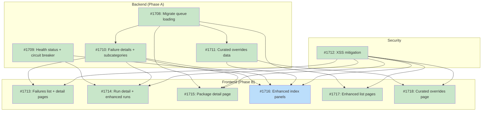
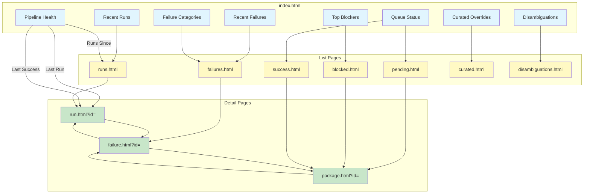
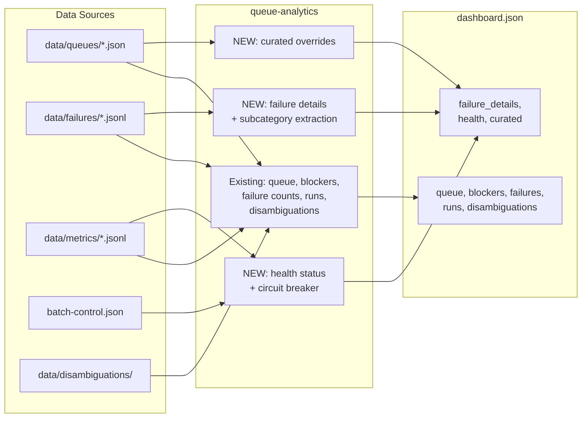

# DESIGN: Dashboard Observability Enhancements

## Status

Planned

## Implementation Issues

### Milestone: [dashboard-observability](https://github.com/tsukumogami/tsuku/milestone/84)

| Issue | Dependencies | Tier |
|-------|--------------|------|
| ~~[#1708: feat(dashboard): migrate queue loading to unified schema](https://github.com/tsukumogami/tsuku/issues/1708)~~ | None | testable |
| _Switch `dashboard.go` from the legacy `seed.PriorityQueue` loader to `batch.UnifiedQueue`, picking up priority, failure count, and confidence fields that downstream pages need._ | | |
| ~~[#1709: feat(dashboard): add health status with circuit breaker and run tracking](https://github.com/tsukumogami/tsuku/issues/1709)~~ | None | testable |
| _Parse `batch-control.json` and metrics JSONL to produce a `health` map in `dashboard.json` with circuit breaker state, last success timestamp, and runs-since-success per ecosystem._ | | |
| ~~[#1710: feat(dashboard): add failure details with subcategory extraction](https://github.com/tsukumogami/tsuku/issues/1710)~~ | [#1708](https://github.com/tsukumogami/tsuku/issues/1708) | critical |
| _Read both JSONL failure formats, classify errors into subcategories using bracketed tags, regex, and exit code fallbacks, deduplicate per-recipe, and emit a capped `failure_details` array in `dashboard.json`._ | | |
| ~~[#1711: feat(dashboard): add curated overrides to dashboard data](https://github.com/tsukumogami/tsuku/issues/1711)~~ | [#1708](https://github.com/tsukumogami/tsuku/issues/1708) | simple |
| _Filter the unified queue for `confidence == "curated"` entries and emit a `curated` array with package name, source, reason, and validation status._ | | |
| ~~[#1712: fix(dashboard): add XSS mitigation to all dashboard pages](https://github.com/tsukumogami/tsuku/issues/1712)~~ | None | critical |
| _Add an `esc()` HTML-escaping utility to every dashboard page that uses `innerHTML`, covering all existing and new pages against data-driven XSS._ | | |
| ~~[#1713: feat(dashboard): add failures list and detail pages](https://github.com/tsukumogami/tsuku/issues/1713)~~ | [#1710](https://github.com/tsukumogami/tsuku/issues/1710), [#1712](https://github.com/tsukumogami/tsuku/issues/1712) | testable |
| _Create `failures.html` (filterable list of recent failures) and `failure.html` (single-failure detail with error message, platform, and logs link). Redirect legacy `failed.html` to `failures.html`._ | | |
| ~~[#1714: feat(dashboard): add run detail page and enhance runs list](https://github.com/tsukumogami/tsuku/issues/1714)~~ | [#1709](https://github.com/tsukumogami/tsuku/issues/1709), [#1710](https://github.com/tsukumogami/tsuku/issues/1710), [#1712](https://github.com/tsukumogami/tsuku/issues/1712) | testable |
| _Create `run.html` (single-run detail showing per-package outcomes and duration breakdown) and enhance `runs.html` with health badges and navigation to the new detail page._ | | |
| ~~[#1715: feat(dashboard): add package detail page](https://github.com/tsukumogami/tsuku/issues/1715)~~ | [#1708](https://github.com/tsukumogami/tsuku/issues/1708), [#1710](https://github.com/tsukumogami/tsuku/issues/1710), [#1712](https://github.com/tsukumogami/tsuku/issues/1712) | testable |
| _Create `package.html` that joins queue state, failure history, run participation, and disambiguation data into a single-package view with client-side data from `dashboard.json`._ | | |
| [#1716: feat(dashboard): enhance index with health, failures, and curated panels](https://github.com/tsukumogami/tsuku/issues/1716) | [#1709](https://github.com/tsukumogami/tsuku/issues/1709), [#1710](https://github.com/tsukumogami/tsuku/issues/1710), [#1711](https://github.com/tsukumogami/tsuku/issues/1711), [#1712](https://github.com/tsukumogami/tsuku/issues/1712) | testable |
| _Add Health Status, Recent Failures, and Curated Overrides panels to `index.html`, each linking to their respective detail pages for drill-down navigation._ | | |
| ~~[#1717: feat(dashboard): enhance list pages with filters and navigation](https://github.com/tsukumogami/tsuku/issues/1717)~~ | [#1708](https://github.com/tsukumogami/tsuku/issues/1708), [#1712](https://github.com/tsukumogami/tsuku/issues/1712) | testable |
| _Add ecosystem/status/date filters, summary panels, and `package.html` navigation links to the four existing list pages (pending, blocked, success, disambiguations)._ | | |
| ~~[#1718: feat(dashboard): add curated overrides page](https://github.com/tsukumogami/tsuku/issues/1718)~~ | [#1711](https://github.com/tsukumogami/tsuku/issues/1711), [#1712](https://github.com/tsukumogami/tsuku/issues/1712) | simple |
| _Create `curated.html` displaying curated overrides with validation status badges, status filters, and GitHub action links for managing the override list._ | | |

### Dependency Graph



**Legend**: Green = done, Blue = ready, Yellow = blocked, Purple = needs-design

## Upstream Design Reference

This design implements Phase 2 (Observability) from [DESIGN-pipeline-dashboard.md](DESIGN-pipeline-dashboard.md).

**Relevant sections:**
- Decision 1: Drill-Down Dashboard with Full Detail Pages
- Decision 2: Structured Failure Subcategories
- Solution Architecture: page wireframes, navigation flow, data structures
- Implementation Approach: Phase 2 scope and key questions

## Context and Problem Statement

The pipeline dashboard at tsuku.dev/pipeline/ displays aggregate statistics (failure counts by category, queue totals, recent runs) but doesn't support debugging individual failures. When all 10 packages fail in an hourly batch, the dashboard shows "validation_failed: 10" without explaining whether the problem is missing bottles, verify pattern mismatches, or something else entirely.

Operators currently debug by:
1. Opening the dashboard to see which categories have failures
2. Finding the relevant JSONL file in `data/failures/` (sorted by timestamp)
3. Grepping through the file for the specific package
4. Cross-referencing with GitHub Actions workflow logs (which have 90-day retention)

This takes 3-5 minutes per failure. For a batch of 10 failures, that's 30-50 minutes of manual investigation. And some information simply isn't available: circuit breaker state lives in `batch-control.json` but never reaches the dashboard, so operators can't tell if an ecosystem is being rate-limited.

The parent design (DESIGN-pipeline-dashboard.md) specified high-level requirements for drill-down navigation, failure subcategories, and new dashboard pages. This design provides the implementation spec: exact page layouts, dashboard.json schema extensions, queue-analytics changes, and failure subcategory taxonomy.

### Scope

**In scope:**
- New dashboard pages: `failures.html`, `failure.html`, `run.html`, `package.html`, `curated.html`
- Enhanced existing pages: `index.html`, `pending.html`, `blocked.html`, `success.html`, `runs.html`, `disambiguations.html`
- Navigation flows between panels, list pages, and detail pages
- `dashboard.json` schema extensions for `health`, `failure_details`, and `curated` sections
- Failure subcategory taxonomy with mapping from CLI exit codes and JSON output
- `queue-analytics` command changes to populate new fields
- URL parameter patterns for filtering and deep linking
- Pipeline Health panel with circuit breaker state, last success tracking, runs-since-success
- XSS mitigation via `esc()` utility applied to all pages

**Out of scope:**
- Seeding workflow implementation and `seeding.html` (Phase 3, separate design)
- Queue schema migration (Phase 1, shipped as #1697/#1704)
- Dashboard CSS/styling redesign
- Alerting system (mentioned in parent design but not part of observability pages)
- Backend service or database (everything stays as static JSON + HTML)

## Decision Drivers

1. **Debug in seconds**: An operator should go from "something failed" to "here's the exact error message and CLI output" in under 30 seconds, entirely through the dashboard
2. **No new infrastructure**: The dashboard is static HTML served from Cloudflare Pages. No servers, databases, or monitoring services. Everything flows through `dashboard.json`
3. **Extend, don't rebuild**: `queue-analytics` already reads failure JSONL, metrics JSONL, queue files, and disambiguations. Add new aggregations to the existing tool
4. **Data fidelity**: Failure detail pages should show the recorded error message (up to 500 chars), category, platform, and batch context -- not just aggregate counts. The JSONL files have this data; it just doesn't reach the dashboard
5. **Deep linkable**: Every page state (filters, selected items) should be representable as a URL so operators can share links when discussing failures
6. **Predictable navigation**: Follow the panel -> list -> detail pattern consistently across all data types (failures, runs, packages, curated overrides)

## Implementation Context

### Existing Patterns

**Dashboard data flow:**
- `cmd/queue-analytics/` calls `internal/dashboard/` to generate `website/pipeline/dashboard.json`
- Workflow `update-dashboard.yml` triggers on changes to `data/`
- Frontend pages fetch `dashboard.json` and render client-side with vanilla JavaScript

**Current `Dashboard` struct** (`internal/dashboard/dashboard.go`):
```go
type Dashboard struct {
    GeneratedAt     string                `json:"generated_at"`
    Queue           QueueStatus           `json:"queue"`
    Blockers        []Blocker             `json:"blockers"`
    Failures        map[string]int        `json:"failures"`       // category -> count only
    Runs            []RunSummary          `json:"runs,omitempty"` // last 10 runs
    Disambiguations *DisambiguationStatus `json:"disambiguations,omitempty"`
}
```

The `Failures` field is a flat `map[string]int` -- it knows "validation_failed: 30" but not which packages, what the error messages are, or when they happened. This is the core gap.

**Failure recording** (`internal/batch/results.go`):
```go
type FailureRecord struct {
    PackageID string    `json:"package_id"`
    Category  string    `json:"category"`
    BlockedBy []string  `json:"blocked_by,omitempty"`
    Message   string    `json:"message"`
    Timestamp time.Time `json:"timestamp"`
}
```

Two JSONL formats exist in `data/failures/`:
- **Legacy batch format**: Contains `failures[]` array with `package_id`, `category`, `message`, and `timestamp` per entry. The `message` field has error text, but it's truncated to 500 characters by `truncateOutput()` in the orchestrator.
- **Per-recipe format**: Contains `recipe`, `platform`, `category`, `exit_code`, and `blocked_by` fields but **no `message` field**. These files are more recent (Feb 2026+).

Both formats get reduced to category counts during dashboard generation. Package IDs, timestamps, and any available error text are all lost.

**Exit code mapping** (`internal/batch/orchestrator.go`):
- Exit 5 -> `api_error` (with 3 retries before recording)
- Exit 6 -> `validation_failed` (covers verify pattern mismatch AND install failures)
- Exit 7 -> `validation_failed` (same bucket as exit 6)
- Exit 8 -> `missing_dep`
- Exit 9 -> `deterministic_insufficient`
- Default -> `validation_failed`

Exit codes 6 and 7 both map to `validation_failed`, merging at least 4 distinct failure modes. The CLI's `--json` output includes a more specific `category` field that `parseInstallJSON` already extracts, but it doesn't distinguish subcategories within a category.

**Existing HTML pages** (7 pages, all fetching `dashboard.json`):
- `index.html` -- main dashboard with panels
- `failed.html` -- table of failed packages (category + name only)
- `success.html`, `pending.html`, `blocked.html` -- status-specific lists
- `runs.html` -- batch run history (last 10 runs)
- `disambiguations.html` -- disambiguation decisions with risk flags

**Pattern**: Each list page loads `dashboard.json`, filters the relevant data, renders a sortable table. No detail pages exist yet -- every item is a row in a table, not a link to deeper information.

**`batch-control.json`** contains circuit breaker state per ecosystem:
```json
{
    "circuit_breaker": {
        "homebrew": {
            "state": "closed",
            "failures": 0,
            "last_failure": "2026-02-08T09:31:11Z",
            "opens_at": "2026-02-08T10:31:11Z"
        }
    }
}
```

This file is read by the orchestrator but not by `queue-analytics`. Circuit breaker state doesn't appear anywhere in `dashboard.json`.

### Conventions to Follow

- Static HTML with inline `<style>` and `<script>` tags (no build step)
- CSS variables from `/assets/style.css` for consistent theming
- Client-side rendering with vanilla JavaScript (no frameworks)
- URL parameters for filtering (e.g., `?ecosystem=homebrew`)
- Dashboard.json as the single data source for all pages

## Considered Options

### Decision 1: Failure Detail Storage Strategy

The dashboard needs to show individual failure records with full error messages. Currently, `dashboard.json` is 788KB and contains only aggregate counts. Adding full failure records (with error messages averaging 200-500 bytes each) for the 42 recent failures would add roughly 20-40KB. But if we retain more history, the file grows fast: 1000 failures with full CLI output could push it past 2MB.

The question is where to put the detail data: inline in `dashboard.json`, or in separate per-failure files that detail pages fetch individually.

#### Chosen: Inline Failures with Retention Cap

Store the last N failure records directly in `dashboard.json` as a new `failure_details` array. Each record includes the recorded error message (up to 500 chars, as truncated by the orchestrator), subcategory, platform, batch ID, and workflow URL. For per-recipe format entries that lack a `message` field, the detail shows category, exit code, and platform -- less rich, but still far more useful than a bare count.

Cap at the 200 most recent failures (roughly 100-200KB of additional JSON, keeping total `dashboard.json` under 1.5MB). Older failures remain in the source JSONL files but drop off the dashboard. This is acceptable because debugging focuses on recent failures -- if something failed 3 weeks ago, the pipeline has moved on.

The failure detail page (`failure.html?id=<id>`) reads from this same array by filtering client-side on the `id` field. No separate fetch needed.

**Trade-off**: Dashboard.json grows from ~800KB to ~1MB. This is fine for a page that loads once and caches. Error messages are truncated rather than full CLI output, but 500 characters is enough to identify the root cause in most cases.

#### Alternatives Considered

**Separate per-failure JSON files**: Generate `website/pipeline/failures/<id>.json` for each failure. Detail pages fetch the individual file.
Rejected because it creates thousands of small files in the deploy directory, complicates the build process (queue-analytics would need to write N files instead of 1), and adds HTTP requests for each detail page view. The total data volume doesn't justify the complexity.

**Summary in dashboard.json + lazy-load from JSONL**: Keep counts in dashboard.json but have detail pages fetch raw JSONL files from `data/failures/`.
Rejected because the JSONL files are in the repo's `data/` directory, not deployed to the website. Detail pages would need to fetch from GitHub's raw content service, adding a runtime dependency on GitHub availability and cross-origin request complexity. The repo is public so authentication isn't an issue, but coupling the dashboard's functionality to GitHub uptime defeats the purpose of a self-contained static site.

### Decision 2: Failure Subcategory Implementation

The `categoryFromExitCode` function maps 5 exit codes to 4 categories. Exit code 6 (install failed) and exit code 7 (verify failed) both produce `validation_failed`. The CLI's `--json` output already includes a `category` field, and `parseInstallJSON` extracts it, but neither the CLI nor the parser distinguishes subcategories within a category.

The parent design specifies subcategories like `no_bottle`, `verify_pattern_mismatch`, `install_failed`, and `schema_invalid`. The question is how to populate these.

#### Chosen: Post-Hoc Parsing in queue-analytics

Add subcategory extraction to `queue-analytics` (not the batch orchestrator) using a two-level parsing strategy:

**Level 1 -- Bracketed subcategories (high confidence):**
Deterministic generation failures already emit structured subcategories in square brackets within the message field: `[api_error]`, `[no_bottles]`, `[complex_archive]`. Parse these first. If a bracketed tag is found, use it directly as the subcategory.

**Level 2 -- Message pattern matching (lower confidence):**
For records without bracketed tags (or with empty messages), fall back to regex matching:

- `"no bottle"` or `"bottle not found"` -> `no_bottle`
- `"no executables found"` or `"no binaries"` -> `binary_discovery_failed`
- `"version pattern"` or `"verify"` -> `verify_pattern_mismatch`
- `"already exists"` or `"Use --force"` -> `recipe_already_exists`
- `"rate limit"` or `"429"` -> `rate_limited`
- `"5xx"` or `"server error"` or `"unavailable"` -> `upstream_unavailable`
- `"timeout"` or `"deadline"` -> `timeout`

**Level 3 -- Exit code fallback:**
For per-recipe format records that have no message at all, the exit code combined with the category gives a coarse subcategory. This is the weakest signal but still better than nothing.

The subcategory taxonomy is derived from what actually appears in the JSONL data, not hypothesized. Records that don't match any pattern get an empty subcategory, and the dashboard shows the parent category only.

This approach doesn't change the batch infrastructure or the CLI. Over time, the CLI should add a `subcategory` field to its JSON output so the classification is authoritative rather than heuristic. When that field exists, queue-analytics should prefer it over any parsing logic.

#### Alternatives Considered

**Add subcategory to CLI `--json` output**: Have the CLI emit a `subcategory` field, then pass it through the batch orchestrator to the failure JSONL.
Rejected for now because it requires changes across three components (CLI, orchestrator, failure records) before any dashboard improvement ships. The message-parsing approach is less precise but ships independently. The CLI change should still happen eventually, and when it does, queue-analytics can prefer the explicit field over heuristic parsing.

**Expand exit codes**: Add exit codes 10-16 for each subcategory.
Rejected because exit codes are a blunt instrument (0-255 range, no metadata) and the CLI already has structured JSON output. Adding more exit codes doesn't solve the problem as well as parsing existing JSON.

### Decision 3: Pipeline Health Data Source

Circuit breaker state, last successful run, and runs-since-success are all useful for the Pipeline Health panel. The data exists in `batch-control.json` (circuit breaker) and `data/metrics/` (run history), but `queue-analytics` doesn't read `batch-control.json`.

#### Chosen: Extend queue-analytics to Read batch-control.json

Add a new `--control-file` flag to `queue-analytics` (defaulting to `batch-control.json`). The tool reads circuit breaker state and includes it in a new `health` section of `dashboard.json`.

For last-run and last-success tracking, `queue-analytics` already reads metrics JSONL files. It currently keeps the last 10 runs. Extend it to also compute:
- `last_run`: most recent metrics entry (regardless of success)
- `last_successful_run`: most recent entry where `merged > 0`
- `runs_since_last_success`: count of entries after last successful run

All derived from data that's already being loaded.

#### Alternatives Considered

**Separate health-check workflow**: A dedicated workflow that reads batch-control.json and writes a `health.json` file alongside dashboard.json.
Rejected because it duplicates the "data -> JSON -> website" pipeline that queue-analytics already provides. Having two tools writing to the same directory invites race conditions and doubles the maintenance surface.

**Client-side computation**: Have the dashboard JavaScript compute health metrics from the runs array.
Rejected because the runs array only has the last 10 entries. Computing "runs since last success" requires the full history, which lives in the metrics JSONL files. Only the backend aggregator has access to all the data.

### Assumptions

1. **Bracketed subcategories are reliable**: The `[tag]` pattern in failure messages (e.g., `[no_bottles]`, `[complex_archive]`) is the primary classification signal. Regex fallback handles records without brackets. If neither works, the subcategory is empty and the dashboard shows the parent category only.

2. **Two JSONL formats coexist**: Legacy batch format has rich `message` fields; per-recipe format has `exit_code` but no message. The dashboard must handle both gracefully -- richer detail for legacy records, category + exit code + platform for per-recipe records.

3. **200 failures is sufficient history**: Operators debugging the pipeline care about recent failures, not failures from weeks ago. A 200-record cap covers roughly 2-3 days of hourly batches with 10 packages each.

4. **dashboard.json size is acceptable at ~1MB**: The dashboard loads once and caches. A 1MB JSON file is fine on modern connections and doesn't need pagination or lazy loading.

5. **batch-control.json is accessible during dashboard generation**: The `update-dashboard.yml` workflow runs in a context where both `data/` and `batch-control.json` are available. This is true because the workflow checks out the full repo.

### Uncertainties

- **Message pattern stability**: The CLI's error messages may change between versions. If they do, the subcategory regex patterns need updating. The eventual fix is having the CLI emit subcategories explicitly.
- **JSONL retention**: How far back do failure JSONL files go? If they're pruned aggressively, the 200-record cap in dashboard.json may be the only source of failure history. Need to verify retention policy.
- **dashboard.json caching**: Cloudflare Pages may cache dashboard.json. If the cache TTL is long, operators won't see updated health data promptly. May need cache-busting headers or a version parameter.

## Decision Outcome

### Summary

We're turning the dashboard from a status board into a debugging tool by extending `queue-analytics` and adding five new pages, without changing the static HTML architecture.

The core change is in `queue-analytics`. Today it reads failure JSONL files and reduces them to `{"validation_failed": 30}`. After this design, it reads those same files plus `batch-control.json` and produces three new sections in `dashboard.json`: a `failure_details` array with the last 200 individual failure records (including error messages up to 500 chars, subcategories, platforms, and batch IDs), a `health` object with circuit breaker state and last-success tracking, and a `curated` array listing all curated overrides with validation status. Summary counts (by category, by subcategory) are computed client-side from the failure_details array.

Subcategory classification happens at dashboard generation time, not in the batch orchestrator. The parser first looks for bracketed tags (`[no_bottles]`, `[complex_archive]`) that deterministic generation already emits, then falls back to regex matching on the message text, and finally uses exit code + category as a last resort. This ships without any CLI or orchestrator changes while producing useful subcategories for most failure records.

Five new HTML pages use this data: `failures.html` lists all failures with filtering; `failure.html?id=<id>` shows a single failure's full record; `run.html?id=<batch-id>` shows batch summary; `package.html?id=<pkg>` shows per-package status, failure history, and disambiguation; `curated.html` lists curated overrides with validation status. Six existing pages get enhancements: `index.html` gains Pipeline Health, Recent Failures, and Curated Overrides panels; `pending.html`, `blocked.html`, and `success.html` gain filters and link rows to `package.html`; `runs.html` gains filters and summary stats; `disambiguations.html` gains filter dropdowns. `seeding.html` is deferred to Phase 3. All pages use an HTML-escaping utility to prevent XSS via data values or URL parameters.

Every panel on the main dashboard links to a list page. Every row in a list page links to a detail page. Every detail page cross-links to related items (a failure links to its batch run, a run links to its failures). URL parameters control filtering, so links are shareable.

### Rationale

The three decisions fit together because they're all about moving existing data from opaque files into the dashboard without adding infrastructure.

Inline failure details (Decision 1) works because the volume is manageable. At 200 records with truncated messages, we add ~200KB to a file that's already ~800KB. This avoids the complexity of per-failure files or fetching from GitHub's raw content service. The 200-record cap is generous -- operators only need the last day or two of failures to debug the current pipeline state.

Post-hoc subcategory parsing (Decision 2) decouples dashboard improvements from CLI changes. The bracket-first strategy gives high-confidence subcategories for deterministic generation failures (the most common type), while regex fallback handles legacy records. Records that match nothing display their parent category, which is no worse than the current behavior.

Extending queue-analytics to read batch-control.json (Decision 3) keeps one tool responsible for dashboard data. The alternative (a separate health workflow) would mean two tools writing to the same deploy directory, creating coordination problems that aren't worth solving for a single extra data source.

## Solution Architecture

### Components

```
┌─────────────────────────────────────────────────────────────────────┐
│                     queue-analytics (modified)                        │
├─────────────────────────────────────────────────────────────────────┤
│                                                                     │
│  Inputs:                                                            │
│    data/queues/*.json           (existing)                          │
│    data/failures/*.jsonl        (existing)                          │
│    data/metrics/*.jsonl         (existing)                          │
│    data/disambiguations/*.jsonl (existing)                          │
│    batch-control.json           (NEW input)                         │
│                                                                     │
│  Processing (new):                                                  │
│    loadFailureDetails()   -> parse both JSONL formats               │
│                              group per-recipe by (pkg, batch)       │
│                              extract subcategories                  │
│                              cap at 200 most recent                 │
│    loadHealth()           -> read batch-control.json                │
│                              compute last_run, last_success         │
│                              compute runs_since_last_success        │
│    loadCurated()          -> filter queue entries with               │
│                              confidence="curated"                   │
│                                                                     │
│  Output: dashboard.json (extended)                                  │
│    .failure_details[]     -> individual failure records              │
│    .health                -> circuit breaker, run tracking           │
│    .curated[]             -> override list with validation           │
│    (existing fields unchanged)                                      │
│                                                                     │
└─────────────────────────────────────────────────────────────────────┘

┌─────────────────────────────────────────────────────────────────────┐
│                     Dashboard Pages (website/pipeline/)               │
├─────────────────────────────────────────────────────────────────────┤
│                                                                     │
│  MODIFIED:                                                          │
│    index.html          -> add Pipeline Health, Recent Failures,     │
│                           Curated Overrides panels                  │
│    failed.html         -> rename to failures.html, add subcategory  │
│                           column, filters, link rows to detail      │
│    runs.html           -> add ecosystem/status filters, summary     │
│    pending.html        -> add ecosystem filter, search, ecosystem   │
│                           breakdown, link rows to package.html      │
│    blocked.html        -> add Top Blockers analysis panel,          │
│                           link rows to package.html                 │
│    success.html        -> add date filters, Success Timeline chart, │
│                           recipe links, link rows to package.html   │
│    disambiguations.html-> add status/reason filters, by-reason      │
│                           breakdown summary                         │
│                                                                     │
│  NEW:                                                               │
│    failure.html   -> single failure detail (by ?id= param)         │
│    run.html       -> single batch run detail (by ?id= param)       │
│    package.html   -> per-package detail with history (?id= param)  │
│    curated.html   -> curated overrides with validation status       │
│                                                                     │
│  All pages:                                                         │
│    - Fetch dashboard.json                                           │
│    - Filter/render client-side with vanilla JS                     │
│    - URL params for filtering (?category=, ?ecosystem=, ?id=)      │
│    - Back navigation to parent page                                 │
│    - esc() utility for all innerHTML interpolation                  │
│                                                                     │
└─────────────────────────────────────────────────────────────────────┘
```

### Data Structures

**Extended Dashboard struct** (`internal/dashboard/dashboard.go`):

```go
type Dashboard struct {
    GeneratedAt     string                `json:"generated_at"`
    Queue           QueueStatus           `json:"queue"`
    Blockers        []Blocker             `json:"blockers"`
    Failures        map[string]int        `json:"failures"`        // existing: category -> count
    FailureDetails  []FailureDetail       `json:"failure_details"` // NEW: last 200 records
    Health          *HealthStatus         `json:"health,omitempty"`// NEW
    Curated         []CuratedOverride     `json:"curated,omitempty"` // NEW
    Runs            []RunSummary          `json:"runs,omitempty"`
    Disambiguations *DisambiguationStatus `json:"disambiguations,omitempty"`
}
```

**FailureDetail** (new, represents one failure record):

```go
type FailureDetail struct {
    ID          string `json:"id"`          // e.g. "homebrew-2026-02-15T13-45-21Z-neovim"
    Package     string `json:"package"`
    Ecosystem   string `json:"ecosystem"`
    Category    string `json:"category"`
    Subcategory string `json:"subcategory,omitempty"` // from bracket/regex/exit-code parsing
    Message     string `json:"message,omitempty"`     // up to 500 chars (legacy format only)
    ExitCode    int    `json:"exit_code,omitempty"`   // per-recipe format
    Platform    string `json:"platform,omitempty"`
    BatchID     string `json:"batch_id,omitempty"`
    Timestamp   string `json:"timestamp"`
    WorkflowURL string `json:"workflow_url,omitempty"`
}
```

The `ID` field is generated deterministically: `<ecosystem>-<timestamp>-<package>` with timestamp formatted as `2006-01-02T15-04-05Z`. This serves as the URL parameter for `failure.html?id=`.

**JSONL format normalization:**
- **Legacy batch format**: `Package` = looked up from the unified queue by matching `PackageFailure.PackageID` against `QueueEntry.Source`, falling back to the last segment of `PackageID` after the first `:`. Multi-part sources like `github:sharkdp/bat` need the queue lookup to get `Name` = `bat` (splitting on `:` gives `sharkdp/bat`). `Ecosystem` = extracted from `PackageID` prefix before `:`. `Message` = `PackageFailure.Message`.
- **Per-recipe format**: `Package` = `FailureRecord.Recipe`, `Ecosystem` = inferred from filename prefix (currently always `"homebrew"`), `Message` = empty (format has no message field)

**Per-recipe deduplication**: A single recipe can fail on multiple platforms (up to 11), generating one JSONL record per platform. These are grouped by `(package, batch_id)` into a single `FailureDetail` record with `Platform` set to `"multiple"` and a `Platforms` field listing all platforms. This prevents one package from consuming 11 of the 200 record slots.

```go
type FailureDetail struct {
    // ... existing fields ...
    Platforms []string `json:"platforms,omitempty"` // when grouped from per-recipe multi-platform
}
```

Summary counts (by category, by subcategory, by ecosystem) are computed client-side from the `failure_details` array. The existing dashboard already does this pattern -- `index.html` computes failure category counts from package arrays client-side. For 200 records, the computation is trivial.

**HealthStatus** (new):

```go
type HealthStatus struct {
    Ecosystems           map[string]EcosystemHealth `json:"ecosystems"`
    LastRun              *RunInfo                    `json:"last_run"`
    LastSuccessfulRun    *RunInfo                    `json:"last_successful_run"`
    RunsSinceLastSuccess int                         `json:"runs_since_last_success"`
    HoursSinceLastRun    int                         `json:"hours_since_last_run"`
}

type EcosystemHealth struct {
    BreakerState string `json:"breaker_state"` // "closed", "open", "half-open"
    Failures     int    `json:"failures"`       // consecutive failure count
    LastFailure  string `json:"last_failure,omitempty"`
    OpensAt      string `json:"opens_at,omitempty"` // timestamp when breaker will open
}

type RunInfo struct {
    BatchID       string `json:"batch_id"`
    Ecosystem     string `json:"ecosystem"`
    Timestamp     string `json:"timestamp"`
    Succeeded     int    `json:"succeeded"`
    Failed        int    `json:"failed"`
    Total         int    `json:"total"`
    RecipesMerged int    `json:"recipes_merged,omitempty"` // for last_successful_run
}
```

**CuratedOverride** (new):

```go
type CuratedOverride struct {
    Name             string `json:"name"`
    Source           string `json:"source"`
    Reason           string `json:"reason,omitempty"`
    ValidationStatus string `json:"validation_status"` // "valid", "invalid", "unknown"
}
```

**Extended RunSummary** (add fields to existing struct):

```go
type RunSummary struct {
    BatchID   string  `json:"batch_id"`
    Ecosystem string  `json:"ecosystem,omitempty"` // NEW: from metrics JSONL
    Total     int     `json:"total"`
    Merged    int     `json:"merged"`
    Rate      float64 `json:"rate"`
    Timestamp string  `json:"timestamp"`
    Duration  int     `json:"duration,omitempty"` // NEW: seconds, from metrics JSONL
}
```

Note: The metrics JSONL doesn't include `workflow_url` or per-package lists. If those are needed on `run.html` detail pages, the batch orchestrator would need to be updated to write them -- that's an upstream change outside this design's scope. For now, `run.html` shows the data that's available: batch ID, ecosystem, counts, duration, and timestamp.

### Subcategory Extraction Logic

```go
// knownSubcategories validates bracket-extracted tags against an allowlist.
var knownSubcategories = map[string]bool{
    "api_error": true, "no_bottles": true, "complex_archive": true,
    "no_binaries": true, "verify_failed": true, "install_failed": true,
    "timeout": true, "rate_limited": true,
}

func extractSubcategory(category, message string, exitCode int) string {
    // Level 1: Bracketed tags after "failed: " prefix (highest confidence)
    // Matches patterns like "deterministic generation failed: [no_bottles] ..."
    if idx := strings.Index(message, "["); idx >= 0 {
        if end := strings.Index(message[idx:], "]"); end > 1 {
            tag := message[idx+1 : idx+end]
            if knownSubcategories[tag] {
                return tag
            }
        }
    }

    // Level 2: Regex pattern matching
    msg := strings.ToLower(message)
    switch {
    case strings.Contains(msg, "no bottle") || strings.Contains(msg, "bottle not found"):
        return "no_bottle"
    case strings.Contains(msg, "no executables") || strings.Contains(msg, "no binaries"):
        return "binary_discovery_failed"
    case strings.Contains(msg, "version pattern") || strings.Contains(msg, "verify"):
        return "verify_pattern_mismatch"
    case strings.Contains(msg, "already exists") || strings.Contains(msg, "use --force"):
        return "recipe_already_exists"
    case strings.Contains(msg, "rate limit") || strings.Contains(msg, "429"):
        return "rate_limited"
    case strings.Contains(msg, "5xx") || strings.Contains(msg, "unavailable"):
        return "upstream_unavailable"
    case strings.Contains(msg, "timeout") || strings.Contains(msg, "deadline"):
        return "timeout"
    }

    // Level 3: Exit code fallback (lowest confidence)
    if message == "" {
        switch exitCode {
        case 6:
            return "install_failed"
        case 7:
            return "verify_failed"
        case 9:
            return "deterministic_failed"
        }
    }

    return "" // unknown subcategory, dashboard shows parent category
}
```

### Navigation Flow



### URL Parameter Patterns

| Page | Parameters | Example |
|------|-----------|---------|
| `failures.html` | `?category=`, `?subcategory=`, `?ecosystem=`, `?batch_id=` | `failures.html?category=validation_failed&ecosystem=homebrew` |
| `failure.html` | `?id=` | `failure.html?id=homebrew-2026-02-15T13-45-21Z-neovim` |
| `run.html` | `?id=` | `run.html?id=homebrew-20260215T130000Z` |
| `runs.html` | `?ecosystem=`, `?status=`, `?since_success=true` | `runs.html?ecosystem=cargo` |
| `package.html` | `?id=` | `package.html?id=homebrew:neovim` |
| `pending.html` | `?ecosystem=`, `?priority=`, `?search=` | `pending.html?ecosystem=homebrew` |
| `blocked.html` | `?blocker=` | `blocked.html?blocker=glib` |
| `success.html` | `?ecosystem=`, `?from=`, `?to=` | `success.html?ecosystem=homebrew` |
| `disambiguations.html` | `?status=`, `?reason=` | `disambiguations.html?status=needs_review` |
| `curated.html` | `?status=` | `curated.html?status=invalid` |

### Page Specifications

Visual layouts for all pages are in the [parent design wireframes](DESIGN-pipeline-dashboard.md) (Page Wireframes section). A copy is in `wip/wireframes.md` for implementation reference. This section specifies data sources, content, and interactions.

**`index.html` (enhanced):** Add three new panels. Pipeline Health shows circuit breaker state per ecosystem (from `health.ecosystems`), last run / last success / runs-since-success (from `health`), with each metric linking to the relevant detail or list page. Recent Failures shows the 5 most recent entries from `failure_details`, each linking to `failure.html?id=`. Curated Overrides shows count and invalid count from `curated`, linking to `curated.html`. Failure Categories panel gains subcategory breakdown computed client-side from `failure_details`. Seeding Stats panel is deferred to Phase 3.

**`failures.html` (new, renamed from `failed.html`):** Source: `failure_details` array. Filter dropdowns for category, subcategory, ecosystem. Table columns: package, ecosystem, category, subcategory, timestamp. Each row links to `failure.html?id=`. Client-side pagination for >20 rows. Add `_redirects` entry for `failed.html` 301 redirect.

**`failure.html` (new, detail):** Source: `failure_details` filtered by `?id=`. Shows full record: package (links to `package.html`), ecosystem (links to filtered `failures.html`), category, subcategory, message (up to 500 chars, empty for per-recipe format), exit code, platform(s), batch (links to `run.html`), timestamp. Actions section: "File issue" link to GitHub with pre-filled context; "Retry" and "Mark as won't fix" link to GitHub workflow_dispatch or PR templates (no direct execution from dashboard).

**`run.html` (new, detail):** Source: `runs` filtered by `?id=`, cross-referenced with `failure_details` filtered by `batch_id`. Shows batch summary (ecosystem, timestamp, duration, succeeded/failed counts). Packages Processed table lists failures from this batch, each linking to `failure.html?id=`. Note: per-package success/fail status and platform breakdown require data not currently in metrics JSONL; show what's available now, extend when orchestrator is updated.

**`package.html` (new, detail):** Source: client-side join across `queue` packages, `failure_details`, `disambiguations`, and `blockers`. Status section shows package name, ecosystem, queue status (which list the package appears in), priority, failure count, and next retry time (from unified queue, available since #1697 merged). Disambiguation section shows override status and available sources (from `disambiguations`). Attempt History table shows failures for this package (filtered from `failure_details` by package name), each linking to `failure.html?id=`. Actions: GitHub links for retry, skip, exclude, file issue (same pattern as `failure.html` -- link to GitHub, don't execute directly).

**`pending.html` (enhanced):** Add ecosystem filter dropdown and search box. Add priority and failure count columns (from unified queue, available since #1697 merged). Add "By Ecosystem" summary chips at bottom, each linking to filtered view. Each table row links to `package.html?id=`.

**`blocked.html` (enhanced):** Add "Top Blockers" analysis panel. Compute client-side from `blockers` array: invert the dependency graph to show which missing dependencies block the most packages. Each dependency links to `package.html?id=`. Each blocked package row also links to `package.html?id=`.

**`success.html` (enhanced):** Add ecosystem and date range filter dropdowns. Add "Success Timeline" visualization: daily recipe count as a simple bar chart (computed client-side by grouping successes by date). Each row links to `package.html?id=` and has a "View recipe" link to the recipe file on GitHub.

**`runs.html` (enhanced):** Add ecosystem and status filter dropdowns. Add "since last success" checkbox filter. Add summary panel showing last-24h and last-7d aggregates computed client-side from the runs array. Each row links to `run.html?id=`.

**`disambiguations.html` (enhanced):** Add status and reason filter dropdowns. Add "By Reason" summary chips at bottom. Existing table gains links to `package.html?id=` for each package.

**`curated.html` (new):** Source: `curated` array (populated from unified queue entries with `confidence == "curated"`, available since #1697 merged). Table columns: package, source, reason, validation status (badges for valid/invalid/unknown). Actions: GitHub links for add override (PR template), remove override (PR template), fix invalid (issue template). Summary panel shows total, valid, invalid counts.

**`seeding.html`:** Deferred to Phase 3 (seeding workflow design). No placeholder page.

### Data Flow



## Implementation Approach

### Phase A: Backend (queue-analytics changes)

Extend `internal/dashboard/` to populate the new struct fields. Ordered by independence for incremental review:

0. **Migrate dashboard to unified queue** (prerequisite): `dashboard.go` currently imports `internal/seed` and loads old-format queues via a `priority-queue-*.json` glob pattern. This doesn't match the new `priority-queue.json` file produced by Phase 1's bootstrap. Migrate `loadQueueFromPathOrDir()` to use `batch.LoadUnifiedQueue()` and `batch.QueueEntry` instead of `seed.PriorityQueue` and `seed.Package`. This unblocks curated override extraction and access to Phase 1 fields (failure_count, next_retry_at, confidence).

1. **HealthStatus** (independent, small): Read `batch-control.json` for circuit breaker state; scan metrics records for last_run, last_successful_run, runs_since_last_success. Add `--control-file` flag to `cmd/queue-analytics/main.go` (defaults to `batch-control.json`). This can ship as its own small PR to validate the pattern.

2. **FailureDetail loading + subcategory extraction** (core deliverable): Read all JSONL files, normalize both formats into `FailureDetail` structs, group per-recipe records by (package, batch_id), run `extractSubcategory()`, sort by timestamp descending, cap at 200. Summary counts (by_category, by_subcategory, by_ecosystem) are computed client-side.

3. **RunSummary extension**: Add ecosystem and duration fields from metrics JSONL. The metrics data doesn't include workflow URLs or per-package lists; those fields can be added if the batch orchestrator is updated to write them.

4. **CuratedOverride**: Filter queue entries where `Confidence == "curated"` from the unified queue (available since Phase 1 shipped #1697). Each curated entry maps to a `CuratedOverride` struct with validation status derived from the entry's `Status` field.

### Phase B: Frontend (new pages + modified pages)

All new and modified pages must use an HTML-escaping utility function for all data values and URL parameters interpolated via `innerHTML` (see Security Considerations). See `wip/wireframes.md` for visual layouts.

1. **Add `esc()` utility**: HTML-escaping function shared across all dashboard pages. Apply retroactively to existing pages in the same PR.
2. **Modify `index.html`**: Add Pipeline Health panel, Recent Failures panel (last 5 from `failure_details`), Curated Overrides panel, subcategory breakdown in Failure Categories panel. Seeding Stats panel deferred to Phase 3.
3. **Rename `failed.html` to `failures.html`**: Add subcategory column, filter dropdowns (category, subcategory, ecosystem), client-side pagination, make each row link to `failure.html?id=`. Add redirect to `_redirects`.
4. **New `failure.html`**: Single failure detail by `?id=`. Cross-links to `package.html`, `run.html`, filtered `failures.html`. GitHub action links (file issue, retry, won't-fix).
5. **New `run.html`**: Single batch run detail by `?id=`. Shows batch summary and lists failures from `failure_details` filtered by `batch_id`.
6. **New `package.html`**: Per-package detail by `?id=`. Client-side join: queue status from package arrays (including priority, failure_count, next_retry_at from unified queue), failure history from `failure_details`, disambiguation from `disambiguations`, blocker status from `blockers`. GitHub action links.
7. **Enhance `pending.html`**: Add ecosystem filter, search box, ecosystem breakdown summary chips. Link rows to `package.html?id=`.
8. **Enhance `blocked.html`**: Add Top Blockers analysis panel (inverted dependency graph computed client-side). Link rows and blocker dependencies to `package.html?id=`.
9. **Enhance `success.html`**: Add ecosystem and date range filters. Add Success Timeline bar chart (daily recipe count). Link rows to `package.html?id=` and recipe files on GitHub.
10. **Enhance `runs.html`**: Add ecosystem and status filters, since-success checkbox. Add 24h/7d summary panel.
11. **Enhance `disambiguations.html`**: Add status/reason filter dropdowns and by-reason breakdown summary.
12. **New `curated.html`**: Override table with validation status badges (populated from unified queue entries with `confidence == "curated"`). GitHub links for add/remove/fix actions. Summary panel.

Note: `seeding.html` is deferred to Phase 3 (seeding workflow design). The Seeding Stats panel on `index.html` will be added when there's data to show.

### Dependencies

- Phase A step 0 (queue migration) must complete before steps 2 and 4 can access unified queue fields
- Phase A and Phase B can otherwise proceed in parallel after the data structures are agreed
- **Phase 1 (#1697) has shipped**: The unified queue schema is available. Curated data, priority, failure_count, and next_retry_at fields are all accessible from `batch.QueueEntry`. Phase A step 0 migrates dashboard.go to use the new schema.
- **Workflow trigger update**: `update-dashboard.yml` currently triggers on changes to `data/`. If `batch-control.json` lives outside `data/`, the workflow's path filter needs updating to also watch the control file location.
- `seeding.html` deferred to Phase 3
- Everything else has no external dependencies and can ship independently

## Security Considerations

### Download Verification

**Not applicable.** This design doesn't download or install any artifacts. It generates and renders JSON data from files already in the repository. All data processing happens in `queue-analytics` during CI, and the output is a static JSON file served from Cloudflare Pages.

### Execution Isolation

**Not applicable.** No new execution capabilities are added. The `queue-analytics` command runs in the existing `update-dashboard.yml` workflow with the same permissions it has today. The new `--control-file` flag reads one additional JSON file from the repo checkout. No privilege escalation.

### Supply Chain Risks

**Minimal, existing pattern.** The new data sources (`batch-control.json`) are checked into the repository and modified only through reviewed PRs or automated workflows with limited permissions. The `failure_details` array contains data from `data/failures/` JSONL files, which are written by the batch generation workflow. An attacker who could modify these files could inject misleading failure data into the dashboard, but they'd need write access to the `data/` directory, which requires repo push access.

### Cross-Site Scripting (XSS) Mitigation

**Required for this design.** The existing dashboard pages render data values via `innerHTML` with template literal interpolation (e.g., `${pkg.name}`). Go's JSON encoding doesn't HTML-encode characters like `<`, `>`, or `'`. This creates two XSS vectors:

1. **Stored XSS via data**: A malicious package name like `` in JSONL files would execute when rendered. Exploitability is limited because it requires repository write access.

2. **Reflected XSS via URL parameters**: Existing pages interpolate URL query parameters (e.g., `?blocker=`, `?category=`) directly into HTML. An attacker can craft a malicious link -- no write access needed.

**Mitigation (required as part of this design's implementation):**

All dashboard pages (existing and new) must use an HTML-escaping utility function for every value interpolated into `innerHTML`:

```javascript
function esc(s) {
    if (s == null) return '';
    const div = document.createElement('div');
    div.textContent = String(s);
    return div.innerHTML;
}
// Usage: ${esc(pkg.name)} instead of ${pkg.name}
```

This should be applied to:
- All data values from `dashboard.json`
- All URL query parameter values
- Error messages in catch blocks

Adding this utility is Phase B step 1 and is applied retroactively to existing pages in the same PR.

### User Data Exposure

**Minimal operational data.** The dashboard displays pipeline operational data: package names, failure categories, error messages, platform identifiers, and batch timestamps. No personally identifiable information (PII). Error messages from CI environments contain ephemeral runner paths with no user association.

The `failure_details` array is more detailed than the current aggregate counts, but all the underlying data is already public in the repository's `data/failures/` directory. The dashboard just makes it more accessible.

## Consequences

### Positive

- **Debugging is self-service**: Operators can identify failure root causes from the dashboard without opening JSONL files or workflow logs
- **Circuit breaker is visible**: Pipeline Health panel shows which ecosystems are rate-limited and why
- **Subcategories distinguish failure modes**: "no_bottle" vs "verify_pattern_mismatch" tells operators whether the fix is a source change or a pattern adjustment
- **Deep linking enables collaboration**: Operators can share `failure.html?id=...` URLs when discussing failures
- **No new infrastructure**: Everything stays as static JSON + HTML, no new services to deploy or monitor
- **Incremental**: Built on existing queue-analytics, existing HTML patterns, existing data sources

### Negative

- **dashboard.json grows ~25%**: From ~800KB to ~1MB. Acceptable for a page that loads once, but worth monitoring
- **Subcategory parsing is heuristic**: Until the CLI emits explicit subcategories, classification depends on message patterns that could change. Unknown patterns produce empty subcategories
- **Two JSONL formats yield different detail levels**: Legacy batch records have rich messages; per-recipe records have only category + exit code. Failure detail pages will look different depending on which format the record came from
- **200-record cap is arbitrary**: If the pipeline starts processing more packages per hour, 200 records may cover less time. The cap is configurable, but the right value depends on operational needs

### Neutral

- **Existing `failures` field stays**: The `map[string]int` field remains for any consumers that depend on it. New code should compute counts from `failure_details` instead
- **Redirect from `failed.html`**: Existing bookmarks still work via `_redirects`
- **Phase 1 shipped**: The unified queue schema (#1697) has merged. All queue fields (priority, failure_count, next_retry_at, confidence) are available. `curated.html` can be fully populated. Phase A step 0 migrates `dashboard.go` from `seed.PriorityQueue` to `batch.UnifiedQueue` to access these fields.
- **`seeding.html` deferred entirely to Phase 3**: No placeholder page, no dead-end navigation link
- **XSS fix is retroactive**: The `esc()` utility gets applied to all existing pages, not just the new ones. This improves security posture for the whole dashboard
