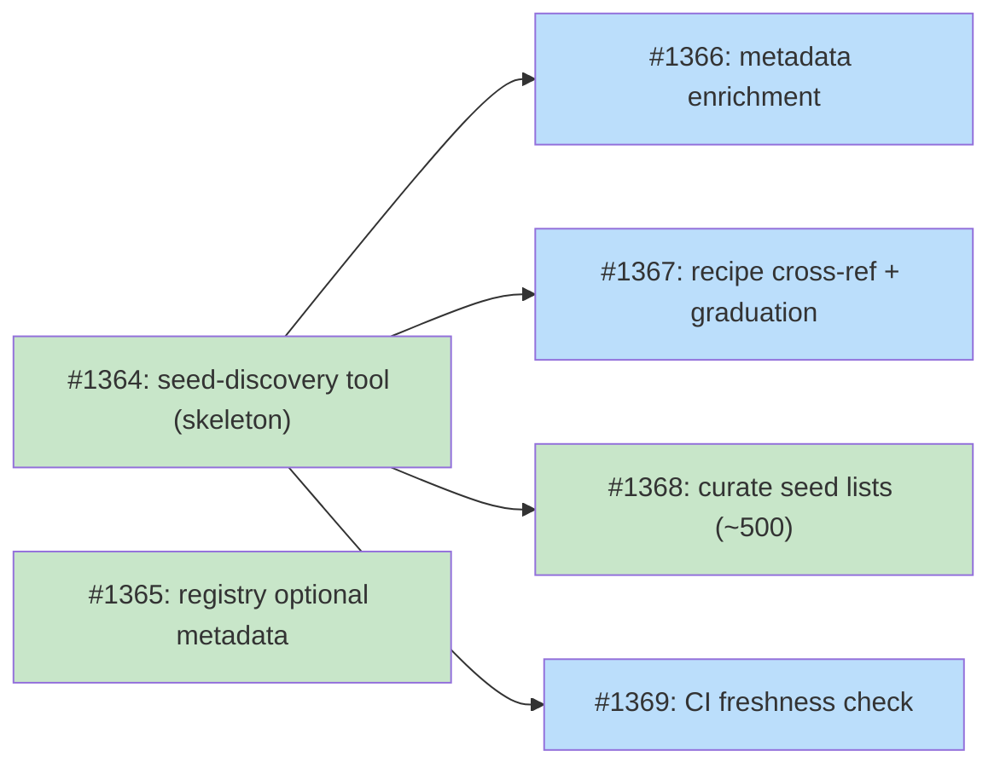

# DESIGN: Discovery Registry Bootstrap

## Status

Planned

## Implementation Issues

### Milestone: [Discovery Registry Bootstrap](https://github.com/tsukumogami/tsuku/milestone/62)

| Issue | Dependencies | Tier |
|-------|--------------|------|
| ~~[#1364: feat(discover): add seed-discovery tool with schema v2 registry output](https://github.com/tsukumogami/tsuku/issues/1364)~~ | ~~None~~ | ~~testable~~ |
| ~~[#1365: feat(discover): add optional metadata fields to registry schema](https://github.com/tsukumogami/tsuku/issues/1365)~~ | ~~None~~ | ~~testable~~ |
| [#1366: feat(discover): add metadata enrichment to seed-discovery tool](https://github.com/tsukumogami/tsuku/issues/1366) | [#1364](https://github.com/tsukumogami/tsuku/issues/1364) | testable |
| _Enriches discovery entries with description, homepage, and repo URL from GitHub and Homebrew API responses during validation. Uses the same API calls already made for validation, so the cost is extracting additional fields from existing responses._ | | |
| [#1367: feat(discover): add recipe cross-reference and graduation logic](https://github.com/tsukumogami/tsuku/issues/1367) | [#1364](https://github.com/tsukumogami/tsuku/issues/1364) | testable |
| _Excludes entries from `discovery.json` when a recipe already exists in `recipes/`, except for disambiguation entries which persist regardless. Implements the graduation model that keeps the registry lean as the batch pipeline generates recipes._ | | |
| ~~[#1368: feat(discover): curate seed lists for ~500 discovery entries](https://github.com/tsukumogami/tsuku/issues/1368)~~ | ~~[#1364](https://github.com/tsukumogami/tsuku/issues/1364)~~ | ~~simple~~ |
| [#1369: ci(discover): add weekly discovery registry freshness check](https://github.com/tsukumogami/tsuku/issues/1369) | [#1364](https://github.com/tsukumogami/tsuku/issues/1364) | simple |
| _Adds a GitHub Actions workflow that validates existing `discovery.json` entries weekly, checking that referenced repositories and packages still exist, and creates an issue listing any stale entries._ | | |

### Dependency Graph



**Legend**: Green = done, Blue = ready, Yellow = blocked, Purple = needs-design

## Upstream Design Reference

This design implements Phase 2 of [DESIGN-discovery-resolver.md](DESIGN-discovery-resolver.md), extending the discovery registry schema with optional metadata fields.

**Relevant upstream sections:**
- Discovery Registry Format (current): `{builder, source, binary?}`
- Two entry categories: GitHub-release tools and disambiguation overrides
- Target size: ~500 entries at launch
- Registry is fetched from recipes repository, cached locally

**Related designs:**
- [DESIGN-registry-scale-strategy.md](DESIGN-registry-scale-strategy.md): Batch recipe generation from priority queue. As recipes get generated, tools graduate out of the discovery registry.
- [DESIGN-batch-recipe-generation.md](DESIGN-batch-recipe-generation.md): CI pipeline for deterministic recipe generation.

## Context and Problem Statement

When a user runs `tsuku install <tool>` and no recipe exists, the discovery resolver tries to figure out which builder and source to use. The resolver has three stages: registry lookup, ecosystem probe, and LLM discovery. Only the registry stage is implemented today. The other two don't exist yet.

The registry currently has 1 entry (`jq`). It needs ~500 to be useful.

Meanwhile, the batch pipeline (DESIGN-registry-scale-strategy) is generating *recipes* for popular tools from ecosystem builders (homebrew, cargo, npm, pypi, etc.). Once a recipe exists, the discovery resolver isn't invoked at all — `tsuku install <tool>` finds the recipe directly.

This creates a question: if the batch pipeline generates recipes for ecosystem tools, and the ecosystem probe (once built) can discover them at runtime, what's the discovery registry actually for?

Three things:

1. **Bridge until recipes exist.** The batch pipeline will generate hundreds of recipes, but not overnight. Until a recipe exists for a tool, the registry provides the mapping. As recipes get generated, those entries become redundant and can be removed.

2. **Disambiguation overrides.** Some tool names exist in multiple ecosystems (`bat` on npm vs sharkdp/bat on GitHub, `serve` on npm vs cargo). The registry pins the correct resolution. These entries persist even after a recipe exists, because they prevent the ecosystem probe from resolving to the wrong package.

3. **GitHub Release tools.** The batch pipeline only automates deterministic builders. The GitHub Release builder requires LLM assistance and isn't part of automation. But many popular tools (ripgrep, fd, delta, lazygit) distribute pre-built binaries via GitHub Releases. The registry maps these tools to their `github:owner/repo` source until a recipe is created manually or via `tsuku create`.

The current schema (`{builder, source, binary?}`) captures only the install mapping. Adding optional metadata fields (repo URL, homepage, description) is useful for disambiguation UX, `tsuku info`/`search`, and future builders that could infer install paths from metadata alone.

### Scope

**In scope:**
- Discovery registry schema evolution (metadata fields)
- Population strategy leveraging the priority queue and seed lists
- Go tool for validation and enrichment
- Graduation model: how entries leave the registry
- CI validation
- Contributor workflow

**Out of scope:**
- Resolver chain architecture (parent design)
- Ecosystem probe and LLM discovery implementation
- LLM-based builder
- Recipe format changes

## Decision Drivers

- **Serve today's resolver**: Entries must have builder+source for RegistryLookup
- **Align with batch pipeline**: Don't duplicate what the batch pipeline already provides or will provide
- **Disambiguation correctness**: Name collision overrides are the registry's durable value
- **Entry accuracy**: Every entry must resolve to a working builder+source pair
- **Graduation path**: Entries should become redundant as recipes are generated
- **Enable future evolution**: Optional metadata fields support future builders and UX
- **Reuse infrastructure**: Leverage priority queue data and seed-queue patterns

## Considered Options

### Decision 1: Registry Schema

#### Chosen: Required Install Info + Optional Metadata Fields

Keep `builder` and `source` as required. Add optional fields: `description`, `homepage`, `repo`, `disambiguation`. Since tsuku is pre-GA with no external consumers of the schema, the fields are added in place without a version bump.

The existing `RegistryLookup` code reads `builder` and `source` and ignores everything else. Optional fields are populated during generation from the same API calls used for validation — no extra cost.

```json
{
  "schema_version": 1,
  "tools": {
    "ripgrep": {
      "builder": "github",
      "source": "BurntSushi/ripgrep",
      "description": "Fast line-oriented search tool",
      "repo": "https://github.com/BurntSushi/ripgrep"
    },
    "jq": {
      "builder": "homebrew",
      "source": "jq",
      "description": "Lightweight command-line JSON processor",
      "homepage": "https://jqlang.github.io/jq/",
      "repo": "https://github.com/jqlang/jq"
    },
    "bat": {
      "builder": "github",
      "source": "sharkdp/bat",
      "description": "A cat clone with syntax highlighting",
      "repo": "https://github.com/sharkdp/bat",
      "disambiguation": true
    }
  }
}
```

#### Alternatives Considered

**Make builder+source optional now**: Allow metadata-only entries for a future LLM builder. Rejected — no consumer exists for metadata-only entries. A future schema version can make install fields optional when an LLM builder ships.

**Nested install object**: `{"install": {"builder": "...", "source": "..."}, "repo": "..."}`. Cleaner separation but breaks the existing `RegistryEntry` struct for no functional benefit. Rejected.

### Decision 2: Population Strategy

The core question is where ~500 entries come from. The batch pipeline already has a priority queue (`data/priority-queue.json`) with 204 homebrew entries. That's the starting point.

#### Chosen: Derive from Priority Queue + Curated GitHub Release Seeds

Two sources, matching the registry's two durable purposes:

**Ecosystem tools (transitional entries):** Derive directly from the priority queue. Each priority queue entry already has a tool name and homebrew source. The seed-discovery tool converts these to registry entries. These entries serve the resolver until the batch pipeline generates recipes, then they graduate out.

**GitHub Release tools (durable entries):** Curated seed lists with `{name, builder: "github", source: "owner/repo"}`. These are the tools the batch pipeline can't automate. The curation work is identifying the correct GitHub repo for each tool — the same work a user would do with `tsuku create --from github:owner/repo`.

**Disambiguation overrides (durable entries):** A separate seed list of known name collisions. Each entry pins the correct resolution. These persist indefinitely.

#### Alternatives Considered

**LLM-assisted bulk generation**: Use an LLM to generate tool-to-repo mappings. Rejected — hallucinated repo names are a security risk and accuracy is non-negotiable.

**Scrape awesome-lists**: Parse curated GitHub lists for tool names. Rejected as primary source — too noisy and stale. Useful as a reference when building seed lists.

### Decision 3: Graduation Model

#### Chosen: Exclude Entries with Existing Recipes (Except Disambiguation)

When the seed-discovery tool generates `discovery.json`, it cross-references the recipes directory. If a recipe already exists for a tool, the entry is excluded — the recipe takes precedence. Exception: entries marked `disambiguation: true` are always included, because they prevent the ecosystem probe from overriding the correct resolution.

This means the registry naturally shrinks as the batch pipeline generates recipes. The seed lists remain the source of truth (they're not modified), but the output only includes entries that still provide value.

#### Alternatives Considered

**Keep all entries regardless of recipes**: Simple but wasteful — the registry grows without bound and contains redundant entries. Rejected.

**Remove from seed lists when recipe exists**: Adds maintenance burden and loses the curated data. Rejected.

### Decision 4: Validation

#### Chosen: Builder-Aware Validation + API Enrichment

Validate each entry using builder-specific API checks:
- `github`: repo exists, not archived, has releases with platform binaries
- `homebrew`: formula exists via Homebrew API
- Ecosystem builders: package exists via ecosystem registry API

Enrich metadata from the same API responses (description, homepage, stars). Enrichment is best-effort — missing metadata doesn't fail the entry.

## Decision Outcome

### Summary

The discovery registry is a pre-computed cache of name-to-builder mappings that bridges the gap between "user wants a tool" and "a recipe exists for that tool." Its entries fall into three categories with different lifespans:

1. **Ecosystem tools** (transitional): Derived from the priority queue. Serve the resolver until the batch pipeline generates recipes, then graduate out.
2. **GitHub Release tools** (durable): Curated manually because the batch pipeline can't automate them. Persist until a recipe is created via `tsuku create` or similar.
3. **Disambiguation overrides** (permanent): Pin the correct resolution for ambiguous names. Persist regardless of recipe existence.

The schema adds optional metadata fields. A Go CLI tool (`cmd/seed-discovery`) reads the priority queue and curated seed lists, validates entries, enriches metadata, cross-references recipes, and outputs `discovery.json`. CI runs weekly freshness checks.

### Rationale

Deriving ecosystem entries from the priority queue avoids duplicating the curation work that's already been done for the batch pipeline. The priority queue already maps tool names to homebrew sources — converting those to discovery registry entries is mechanical. GitHub Release tools require separate curation because they're outside the batch pipeline's scope, but that's a smaller, more focused effort than curating all 500 entries from scratch.

The graduation model keeps the registry lean. As the batch pipeline generates recipes, ecosystem entries disappear from the output. The registry converges toward its durable content: disambiguation overrides and GitHub Release tools.

### Trade-offs Accepted

- **builder+source still required**: No metadata-only entries. Acceptable — no consumer exists for them yet.
- **Priority queue dependency**: Ecosystem entries depend on the priority queue being maintained. Acceptable — the batch pipeline already depends on it.
- **Manual GitHub Release curation**: ~200-300 tool-to-repo mappings need manual identification. This is the same work users would do one-at-a-time via `tsuku create --from github:owner/repo`, done in bulk.

## Solution Architecture

### Overview

Three components: schema evolution, a Go CLI tool for population, and a CI workflow for freshness.

### Registry Schema

**Required fields:**
- `builder`: Builder name (`github`, `homebrew`, `cargo`, `npm`, `pypi`, `gem`, `go`, `cpan`, `cask`)
- `source`: Builder-specific source argument (`owner/repo` for github, formula name for homebrew, etc.)

**Optional fields:**
- `binary`: Binary name when it differs from the tool name
- `description`: Short description (enriched from API)
- `homepage`: Documentation or marketing URL
- `repo`: Source code repository URL (may differ from install source — jq's repo is GitHub but builder is homebrew)
- `disambiguation`: When `true`, entry persists even when a recipe exists

**Builder selection guidance:**

The `builder` field describes how to install the tool, not where the source code lives:
- `github`: Tool publishes pre-built platform binaries in GitHub releases
- `homebrew`: Tool has Homebrew bottles (or formula with complex deps)
- Ecosystem builders (`cargo`, `npm`, etc.): Tool is distributed through that ecosystem's registry

### Go Code Changes

Update `internal/discover/registry.go`:

```go
type RegistryEntry struct {
    Builder        string `json:"builder"`
    Source         string `json:"source"`
    Binary         string `json:"binary,omitempty"`
    Description    string `json:"description,omitempty"`
    Homepage       string `json:"homepage,omitempty"`
    Repo           string `json:"repo,omitempty"`
    Disambiguation bool   `json:"disambiguation,omitempty"`
}
```

The `RegistryLookup` resolver is unchanged — it reads `Builder` and `Source` as before. Optional fields are ignored by existing consumers.

### Components

```
data/priority-queue.json           # Existing: 204 homebrew entries (input)
data/discovery-seeds/              # Curated seed lists (input)
├── github-release-tools.json      # Tools distributed via GitHub releases
├── github-release-tools-2.json    # Additional GitHub release tools (split for review)
└── disambiguations.json           # Known name collisions

cmd/seed-discovery/                # Go CLI tool (processor)
└── main.go

recipes/discovery.json             # Output: validated registry

.github/workflows/
└── discovery-freshness.yml        # Weekly CI validation
```

### Seed List Format

Seed lists contain the human-curated mapping. Minimal required fields:

```json
{
  "category": "github-release-tools",
  "entries": [
    {"name": "ripgrep", "builder": "github", "source": "BurntSushi/ripgrep"},
    {"name": "fd", "builder": "github", "source": "sharkdp/fd"},
    {"name": "bat", "builder": "github", "source": "sharkdp/bat", "disambiguation": true},
    {"name": "kubectl", "builder": "github", "source": "kubernetes/kubernetes", "binary": "kubectl"}
  ]
}
```

Required per entry: `name`, `builder`, `source`. Optional: `binary`, `disambiguation`, `repo` (when repo differs from install source).

### Processing Pipeline

```
Read inputs:
  - data/priority-queue.json (ecosystem entries)
  - data/discovery-seeds/*.json (GitHub release + disambiguation entries)
    |
    v
Convert priority queue entries to registry format:
  - name -> name, source -> source, builder = "homebrew"
    |
    v
Merge all entries (deduplicate by name; seed list wins over priority queue)
    |
    v
For each entry:
  1. Cross-reference: recipe exists in recipes/?
     - If yes and not disambiguation -> skip (graduated)
     - If yes and disambiguation -> keep
  2. Builder-specific validation:
     - github: repo exists, not archived, has releases with platform binaries
     - homebrew: formula exists
     - ecosystem: package exists
     All API calls: exponential backoff, 3 retries, in-memory response cache
  3. Metadata enrichment (from same API response):
     - description, homepage, repo URL
  4. Redirect detection (github): compare API full_name against source field
    |
    v
Output:
  - Valid entries -> recipes/discovery.json
  - Graduated (has recipe, not disambiguation) -> logged, excluded
  - Failed validation -> logged with reason, excluded
```

### CLI Interface

```
Usage: seed-discovery [flags]

Flags:
  -seeds-dir      Seed list directory (default: data/discovery-seeds)
  -queue          Priority queue path (default: data/priority-queue.json)
  -output         Output path (default: recipes/discovery.json)
  -recipes-dir    Recipe directory for cross-reference (default: recipes)
  -validate-only  Validate existing discovery.json without regenerating
  -verbose        Detailed output
```

### CI Freshness Workflow

```yaml
name: Discovery Registry Freshness
on:
  schedule:
    - cron: '0 6 * * 1'  # Weekly Monday 6 AM UTC
  workflow_dispatch: {}

jobs:
  validate:
    runs-on: ubuntu-latest
    steps:
      - uses: actions/checkout@v4
      - uses: actions/setup-go@v5
        with:
          go-version-file: go.mod
      - run: go build -o seed-discovery ./cmd/seed-discovery
      - run: ./seed-discovery --validate-only --verbose
        env:
          GITHUB_TOKEN: ${{ secrets.GITHUB_TOKEN }}
```

### Data Flow

```
Priority queue (data/priority-queue.json)
    |  204 homebrew entries
    v
cmd/seed-discovery  <-- also reads data/discovery-seeds/*.json
    |  validates, enriches, cross-references recipes
    v
recipes/discovery.json (~500 entries)
    |
    v
tsuku update-registry (fetches to $TSUKU_HOME/registry/)
    |
    v
RegistryLookup -> DiscoveryResult -> create pipeline -> install
```

### Entry Lifecycle

```
                  seed list / priority queue
                         |
                         v
                  discovery.json entry
                    (serves resolver)
                         |
            batch pipeline generates recipe
                         |
              +----------+----------+
              |                     |
         not disambiguation    disambiguation
              |                     |
              v                     v
        entry graduates      entry persists
       (removed on next     (prevents wrong
        regeneration)        probe resolution)
```

### Relationship to Batch Pipeline

| Aspect | Discovery Registry | Batch Pipeline |
|--------|-------------------|----------------|
| Purpose | Name resolution at install time | Recipe generation |
| Input | Priority queue + seed lists | Priority queue |
| Builder scope | All builders | Deterministic only (no github) |
| Output | `recipes/discovery.json` | `recipes/*.toml` |
| Entry lifespan | Until recipe exists | Until recipe generated |
| Shared data | Priority queue entries | Priority queue entries |

The priority queue is the shared data source. The batch pipeline turns queue entries into recipes; the discovery registry turns the same entries into resolver mappings. As recipes appear, the registry entries graduate.

### Future Evolution

**Multi-builder entries (per-platform source mapping):** Today each registry entry maps a tool name to a single builder+source pair. In practice, a tool often has multiple viable install paths — `jq` could come from homebrew bottles on macOS, GitHub releases on Linux, and a distro package elsewhere. The schema should evolve to support multiple builder sources per tool, ordered by preference:

```json
{
  "jq": {
    "sources": [
      {"builder": "homebrew", "source": "jq", "platforms": ["darwin"]},
      {"builder": "github", "source": "jqlang/jq", "platforms": ["linux", "windows"]}
    ],
    "repo": "https://github.com/jqlang/jq",
    "description": "Lightweight command-line JSON processor"
  }
}
```

This creates a tension with the current design's simplicity goals. Populating multi-builder entries requires knowing which builders work on which platforms for each tool — testing and validation work that belongs to the recipe consumer (the batch pipeline or `tsuku create`), not the registry author. The registry's job during bootstrap is to map names to sources, not to solve platform coverage.

The resolution: the current schema keeps a single builder+source per entry (the "best default" for the tool). A future schema version adds a `sources` array for tools where platform-specific routing matters. The single-builder entries remain valid — they're just the degenerate case of a one-element sources array. This lets the registry accumulate platform knowledge incrementally as recipes get tested, without requiring it upfront.

This also surfaces a gap in how the priority queue and discovery registry interact. The priority queue doesn't choose between builders — it builds whatever it sees. The discovery registry *does* choose, by picking one builder. As multi-builder entries evolve, the registry becomes the place where builder preference is expressed, and the priority queue becomes one of several consumers that can read those preferences. But that's a design for when the batch pipeline and resolver are both mature enough to consume richer data.

**Optional install fields (when LLM builder ships):** Make `builder`+`source` optional. Metadata-only entries can be resolved by an LLM builder that infers install paths. The registry becomes a general tool knowledge base.

**Automated population from probe results:** Once the ecosystem probe ships and collects resolution data, new entries could be generated automatically from probe hits.

**Priority queue convergence:** Both the discovery registry and batch pipeline consume the priority queue. They could share more infrastructure over time, or the priority queue format could be extended to serve both directly.

## Implementation Approach

### Phase 1: Schema Evolution and Go Tool

Add optional metadata fields to registry schema, modify Go code, build `cmd/seed-discovery`. Start with priority queue entries + ~50 GitHub release tools to validate end-to-end.

**Files:**
- `internal/discover/registry.go` (add optional metadata fields)
- `internal/discover/registry_test.go`
- `cmd/seed-discovery/main.go`
- `data/discovery-seeds/github-release-tools.json` (initial seed list)
- `recipes/discovery.json` (regenerated output)

### Phase 2: Scale to ~500 Entries

Expand GitHub release seed lists. Run the tool, review output, add disambiguation entries where needed.

**Files:**
- `data/discovery-seeds/*.json`
- `recipes/discovery.json` (~500 entries)

### Phase 3: CI Freshness

Add weekly validation workflow.

**Files:**
- `.github/workflows/discovery-freshness.yml`

## Security Considerations

### Download Verification

The seed-discovery tool doesn't download binaries. It queries APIs over HTTPS to verify metadata. No artifacts are downloaded or executed. The entries it produces are consumed by the resolver, which delegates to builders with their own verification.

### Execution Isolation

Read-only API calls, writes a JSON file. No code execution, no elevated permissions.

### Supply Chain Risks

**Registry poisoning via seed lists.** A malicious PR could map a tool name to a compromised source. Mitigations:
- CODEOWNERS review for `data/discovery-seeds/` changes
- Automated validation: tool verifies source exists and has legitimate release history
- Redirect detection: compare GitHub API's `full_name` against seed list's `source` field
- PR size limit: PRs adding more than 100 entries require additional review

**Stale entries pointing to transferred repos.** Weekly freshness check compares current repo owner against entry. Up to 7-day detection window.

**Disambiguation errors.** Wrong override sends users to wrong tool. Collision detection surfaces both sides with metadata for human review.

**Metadata poisoning.** Enriched fields come from API responses controlled by repo owners. Mitigated: metadata is informational only — `builder`+`source` (which control what gets installed) come from the human-curated seed list.

### Mitigations

| Risk | Mitigation | Residual Risk |
|------|------------|---------------|
| Registry poisoning | CODEOWNERS review, automated validation, redirect detection | Sophisticated attack with legitimate-looking source |
| Stale entry | Weekly freshness with ownership check | 7-day window |
| Wrong disambiguation | Human review with metadata from both sides | Obscure collisions |
| Metadata poisoning | Metadata is informational; install fields from curated seed | Misleading description (no install impact) |

## Consequences

### Positive

- Discovery resolver has ~500 entries for instant tool resolution
- Priority queue reuse avoids duplicating curation work
- Clear graduation model keeps registry lean over time
- Optional metadata fields support future features without breaking changes
- Durable value: disambiguation and GitHub Release mappings persist long-term

### Negative

- Optional fields add complexity to the registry entry struct
- GitHub Release seed list curation requires manual effort (~200-300 entries)
- Dependency on priority queue means registry inherits any issues with that data
- Weekly freshness has up to 7-day staleness window
