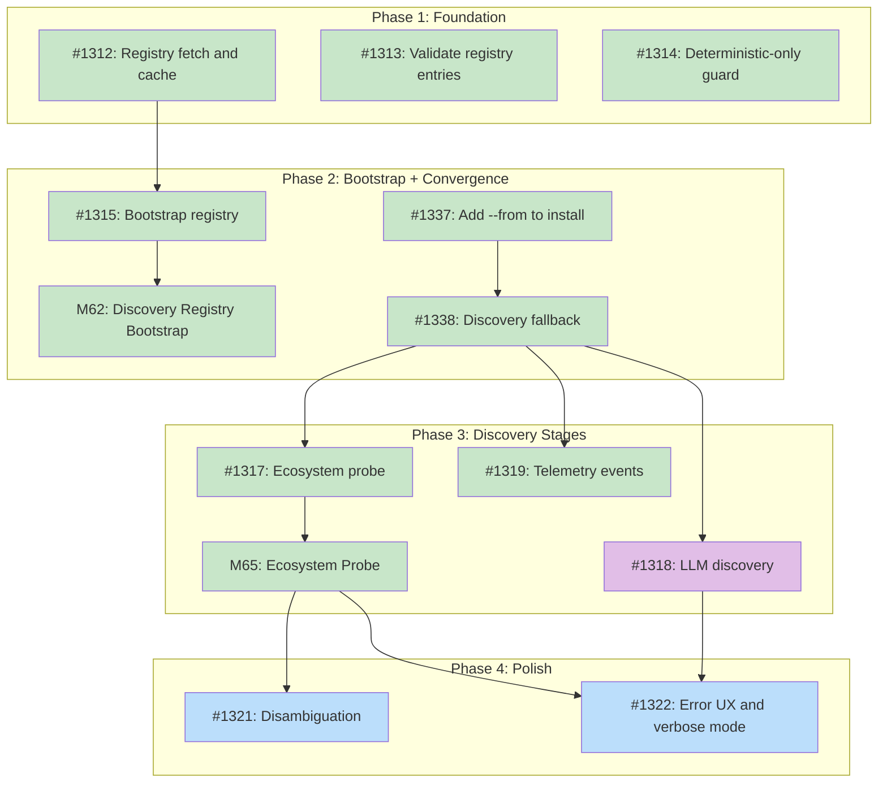

# DESIGN: Discovery Resolver

## Status

Planned

## Implementation Issues

### Milestone: [M59: Discovery Resolver](https://github.com/tsukumogami/tsuku/milestone/59)

| Issue | Dependencies | Tier |
|-------|--------------|------|
| [#1312: Registry fetch and cache](https://github.com/tsukumogami/tsuku/issues/1312) | None | testable |
| _Extend `tsuku update-registry` to fetch `discovery.json` alongside recipe data, cache it at `$TSUKU_HOME/registry/discovery.json`, and load it into the `RegistryLookup` resolver. Establishes the remote-fetch-and-cache pattern that all registry reads depend on._ | | |
| [#1313: Validate registry entries on load](https://github.com/tsukumogami/tsuku/issues/1313) | None | testable |
| _Add schema validation when loading `discovery.json`: check required fields (`builder`, `source`), reject unknown builders, and surface clear errors for malformed entries. Prevents silent failures from bad registry data._ | | |
| [#1314: --deterministic-only guard](https://github.com/tsukumogami/tsuku/issues/1314) | None | testable |
| _Add the early check in the create pipeline that rejects builders where `RequiresLLM()` returns true when `--deterministic-only` is set, producing the actionable error message from the UX table instead of a confusing "no LLM providers available" failure._ | | |
| ~~[#1315: Bootstrap registry ~500 entries](https://github.com/tsukumogami/tsuku/issues/1315)~~ | ~~[#1312](https://github.com/tsukumogami/tsuku/issues/1312)~~ | ~~testable~~ |
| _Populate `discovery.json` with ~500 entries covering GitHub-release tools not in any ecosystem registry and disambiguation overrides for known name collisions. Decomposed into [milestone 62](https://github.com/tsukumogami/tsuku/milestone/62) with 6 implementation issues._ | | |
| ~~[#1337: Add --from flag to install](https://github.com/tsukumogami/tsuku/issues/1337)~~ | None | testable |
| _Add `--from` flag to `tsuku install` that forwards to the create pipeline, skipping recipe lookup. Passes through `--yes` and `--deterministic-only`. First step toward converging install and create under a single command._ | | |
| ~~[#1338: Discovery fallback in install](https://github.com/tsukumogami/tsuku/issues/1338)~~ | ~~[#1337](https://github.com/tsukumogami/tsuku/issues/1337)~~ | ~~testable~~ |
| _Wire the discovery resolver chain into `tsuku install` so unknown tools trigger automatic source discovery and recipe generation. Shows which resolver stage matched and provides actionable errors on failure._ | | |
| ~~[#1317: Ecosystem probe](https://github.com/tsukumogami/tsuku/issues/1317)~~ | ~~[#1338](https://github.com/tsukumogami/tsuku/issues/1338)~~ | ~~testable~~ |
| _Implement the `EcosystemProber` interface and `EcosystemProbe` resolver that queries all seven ecosystem builders in parallel with a 3-second timeout. Includes the `ProbeResult` type with source, downloads, version count, and repository info._ | | |
| [#1318: LLM discovery](https://github.com/tsukumogami/tsuku/issues/1318) | [#1338](https://github.com/tsukumogami/tsuku/issues/1338) | critical |
| _Implement the `LLMDiscovery` resolver: web search via LLM, structured JSON extraction, GitHub API verification (existence, archived status, ownership), rich confirmation prompt with metadata, and prompt injection defenses (HTML stripping, URL validation)._ | | |
| ~~[#1319: Telemetry events](https://github.com/tsukumogami/tsuku/issues/1319)~~ | ~~[#1338](https://github.com/tsukumogami/tsuku/issues/1338)~~ | ~~simple~~ |
| _Emit telemetry events for discovery usage: which stage resolved the tool, whether disambiguation was needed, LLM discovery usage rates. Hooks into the install fallback path from #1338._ | | |
| [#1321: Disambiguation](https://github.com/tsukumogami/tsuku/issues/1321) | [#1317](https://github.com/tsukumogami/tsuku/issues/1317) | critical |
| _Implement edit-distance checking against registry entries, popularity ranking by download count, the 10x auto-select rule, interactive prompting for close matches, and non-interactive error handling. Consumes `ProbeResult` metadata from #1317._ | | |
| [#1322: Error UX and verbose mode](https://github.com/tsukumogami/tsuku/issues/1322) | [#1338](https://github.com/tsukumogami/tsuku/issues/1338), [#1317](https://github.com/tsukumogami/tsuku/issues/1317), [#1318](https://github.com/tsukumogami/tsuku/issues/1318) | testable |
| _Implement all error and fallback messages from the UX specification table, add `--verbose` output showing resolver chain progress (registry lookup, ecosystem probe, LLM discovery), and wire debug/info/error log levels through a consistent logger._ | | |
| ~~[M65: Ecosystem Probe](https://github.com/tsukumogami/tsuku/milestone/65)~~ | ~~[#1338](https://github.com/tsukumogami/tsuku/issues/1338)~~ | |
| _Add Probe() methods to all seven ecosystem builders, wire them into a parallel resolver with 3-second timeout, integrate into the discovery chain, and add integration tests. See [DESIGN-ecosystem-probe.md](DESIGN-ecosystem-probe.md)._ | | |
| ~~[M62: Discovery Registry Bootstrap](https://github.com/tsukumogami/tsuku/milestone/62)~~ | ~~None~~ | |
| _Extend registry schema with optional metadata, build the `seed-discovery` CLI tool, populate ~500 entries from the priority queue and curated seed lists, and add CI freshness checks. See [DESIGN-discovery-registry-bootstrap.md](current/DESIGN-discovery-registry-bootstrap.md)._ | | |

### Dependency Graph



**Legend**: Green = done, Blue = ready, Yellow = blocked, Purple = needs-design

## Context and Problem Statement

tsuku v0.4.x has eight recipe builders (cargo, gem, pypi, npm, go, cpan, github, homebrew) and a growing recipe registry. But every `tsuku create` invocation requires the user to specify `--from github:owner/repo` or `--from crates.io`. Users also need to know whether a recipe already exists before choosing between `tsuku install` and `tsuku create`.

For new users, this is a poor first experience. Users expect `tsuku install stripe-cli` to work without knowing that stripe-cli is distributed as a GitHub release. They don't care about the source, and they shouldn't need to distinguish between "install an existing recipe" and "generate a new recipe."

The problem breaks into four parts:

1. **Command convergence**: `tsuku install` should be the single entry point, falling back to recipe generation when no recipe exists.
2. **Source resolution**: Given a tool name, figure out where it comes from (which builder and which source argument).
3. **Disambiguation**: When multiple ecosystem registries claim to have "bat", pick the right one.
4. **Graceful degradation**: Work without API keys for registry and ecosystem tools; degrade to clear error messages when LLM isn't available.

### Scope

**In scope:**
- `tsuku install` convergence with `tsuku create`
- Resolver interface and `DiscoveryResult` type
- Discovery registry format, scope, bootstrap, and update mechanism
- Parallel ecosystem probe with timeout and filtering
- Disambiguation strategy (registry overrides, popularity ranking, user prompt)
- LLM discovery as last resort (web search, user confirmation, prompt injection defense)
- Error and fallback UX for every failure mode
- Integration points with existing builder and recipe infrastructure
- Post-launch evolution path toward a unified tool index

**Out of scope:**
- Documentation builder (separate design: DESIGN-documentation-builder.md)
- Recipe contribution workflow (separate design: DESIGN-recipe-contribution.md)
- Checksum verification (separate issue)
- Individual builder improvements
- Windows support

## Decision Drivers

- **First-impression reliability**: The top ~500 developer tools must resolve without LLM, instantly
- **No API key requirement for common tools**: Deterministic and ecosystem builders should work without API keys
- **Latency budget**: Registry hits under 100ms, ecosystem probes under 3 seconds, LLM discovery under 15 seconds
- **Disambiguation correctness**: Wrong resolution (installing npm's `bat` instead of sharkdp/bat) destroys trust
- **Build on existing infrastructure**: Eight builders, sandbox validation, repair loop, recipe loader all exist
- **Graceful degradation**: Each resolver stage should fail independently without blocking subsequent stages
- **Minimal maintenance burden**: The discovery registry should stay small and shrink as recipe coverage grows

## Implementation Context

### Existing Patterns

**Recipe Loader** (`internal/recipe/loader.go`): Already implements a priority chain (cache → local → embedded → registry). The discovery resolver follows a similar pattern but resolves `{builder, source}` pairs instead of recipes.

**Builder Registry** (`internal/builders/registry.go`): Thread-safe map of `SessionBuilder` implementations with `Get(name)` lookup. The discovery result's `Builder` field maps directly to this registry.

**SessionBuilder interface** (`internal/builders/builder.go`): Defines `CanBuild(ctx, req)` which validates that a package exists on the ecosystem. The ecosystem probe can use this directly.

**Version Provider Factory** (`internal/version/provider_factory.go`): Strategy-based provider selection with priorities. The resolver uses a similar priority pattern.

**`parseFromFlag()`** in `cmd/tsuku/create.go`: Parses `builder:arg` syntax. The discovery result produces the same pair that `--from` would parse to.

### Conventions to Follow

- New packages go in `internal/discover/` (parallel to `internal/builders/`, `internal/recipe/`)
- Interfaces defined in a `resolver.go` file, implementations in separate files per stage
- Context-aware with `context.Context` for cancellation and timeouts
- Errors wrap with `fmt.Errorf("...: %w", err)` for chain inspection

## Considered Options

### Decision 1: Resolver Architecture

The resolver needs to orchestrate three distinct stages — registry lookup, ecosystem probe, and LLM discovery — each with different latency profiles and failure modes. The key question is whether these stages should run sequentially (each stage only fires if the previous one missed) or in parallel (all fire simultaneously, highest-priority result wins).

Sequential execution avoids wasting API calls and LLM budget on tools that would have been found by an earlier stage. Parallel execution minimizes worst-case latency but at the cost of unnecessary API traffic and complexity. Since the registry lookup is effectively instant (<1ms for an in-memory map), the practical latency difference between sequential and parallel is negligible for registry hits — the real question is whether to start ecosystem probing before the registry check completes.

#### Chosen: Registry-then-Parallel with LLM Gating

Registry lookup runs first (instant). On miss, ecosystem probe runs. On miss, LLM runs. The ecosystem probe itself queries all ecosystems in parallel internally, but the three top-level stages are sequential.

This gives the best resource efficiency: no ecosystem API calls for registry-hit tools, no LLM cost for ecosystem-hit tools. The ecosystem probe stays fast because it's internally parallel (all seven registries queried simultaneously within a 3-second timeout). Two levels of concurrency — stage sequencing at the top, parallelism within the ecosystem probe — keep the implementation tractable.

#### Alternatives Considered

**Sequential chain with short-circuit**: Each stage runs in strict sequence. This is functionally identical to the chosen approach once you clarify that "ecosystem probe" means parallel queries. Rejected as a distinct option because it's the same design stated less precisely.

**Parallel resolution with priority merge**: All stages fire simultaneously, with registry results taking priority over ecosystem, which takes priority over LLM. Rejected because it wastes API calls (ecosystem APIs queried for tools already in the registry) and LLM budget (invoked even when ecosystem finds the tool). The latency savings are negligible since the registry check is <1ms.

### Decision 2: Discovery Registry Storage

The discovery registry maps ~500 tool names to their builder and source. It needs to be fast to read, updatable between binary releases, and simple to maintain. The question is where the canonical copy lives: embedded in the binary, fetched from a remote repository, or both.

Embedding guarantees offline availability but locks updates to binary releases. Remote-only keeps a single source of truth but requires network on first use. A hybrid approach (embedded baseline + remote override) offers both but adds complexity around precedence and integrity verification.

#### Chosen: Remote-Only Registry

No embedded registry. Individual discovery entries are fetched on demand from the recipes repository and cached locally at `$TSUKU_HOME/registry/discovery/`. Each entry is a separate JSON file fetched when `tsuku install` needs it.

This keeps a single source of truth and allows registry updates without releasing a new binary. The trade-off is that first run requires network access, but tsuku already requires network for recipe fetching and tool installation — offline use was never a supported scenario.

#### Alternatives Considered

**Embedded in binary**: Ship the registry as a `//go:embed` resource. Zero network requests, works offline, integrity guaranteed by binary signing. Rejected because registry updates would require a new binary release, and bad entries couldn't be fixed without a release cycle.

**Embedded with registry-sync override**: Embed a baseline, allow `tsuku update-registry` to fetch a newer version that takes precedence. Rejected because maintaining two sources of truth (embedded vs. local override) adds complexity for little value when the remote-fetch-and-cache pattern is already proven by the recipe registry.

### Decision 3: Ecosystem Probe Filtering

When the ecosystem probe returns matches, some may be typosquats or abandoned packages with the same name as a legitimate tool. The question is how aggressively to filter results before presenting them to the user or auto-selecting.

Filtering is noise reduction, not a security boundary. A patient attacker can register a package, wait 90 days, and game download counts. The real security comes from registry overrides for the top 500 tools, disambiguation UX showing metadata, and user confirmation for ambiguous results. But filtering still provides value by keeping the common case clean.

#### Chosen: Threshold Filtering (Age + Downloads)

Reject ecosystem matches below minimum thresholds: >90 days old AND >1000 downloads/month. These are conservative enough to exclude most typosquats while keeping legitimate tools.

Simple, deterministic rules that are easy to explain. The thresholds aren't perfect — 1000 downloads/month is large on CPAN but tiny on npm — but they catch the obvious cases. Per-ecosystem tuning can be added later if collision data shows it's needed. Users can always bypass filtering with `--from`.

#### Alternatives Considered

**Ecosystem-specific thresholds**: Each ecosystem gets its own thresholds (npm: 10K/month, CPAN: 100/month). More accurate per ecosystem but adds configuration to maintain and thresholds become stale as ecosystems grow. Rejected as premature optimization — start with global thresholds and tune if needed.

**No filtering, rely on disambiguation UX**: Show all matches with metadata, let the user pick. No false negatives from over-filtering, but typosquats appear as options and automated/scripted usage (`--yes` flag) becomes harder. Rejected because it shifts the security burden to users who may not notice metadata differences.

### Uncertainties

- **Ecosystem API reliability**: We haven't measured probe latency under real-world conditions across all seven ecosystems simultaneously
- **Popularity data availability**: Not all ecosystem APIs return download counts in the same format; some may not expose it at all
- **Name collision frequency**: We don't know how often tool names collide across ecosystems in practice
- **Registry bootstrap quality**: One-time import from external registries may include stale or incorrect entries
- **LLM web search reliability**: Web search tool accuracy for finding official tool sources hasn't been validated

## Decision Outcome

**Chosen: Sequential chain + Remote-only registry + Threshold filtering**

### Summary

When `tsuku install <tool>` finds no existing recipe, it falls back to a `ChainResolver` that tries three stages in order: `RegistryLookup` (single file read from `$TSUKU_HOME/registry/discovery/`, ~800 entries), `EcosystemProbe` (parallel queries to cargo/gem/pypi/npm/go/cpan/cask with a 3-second timeout, filtered by age >90 days and >1000 downloads/month), and `LLMDiscovery` (web search via LLM, structured JSON extraction, GitHub API verification, 15-second timeout). Each stage implements a `Resolver` interface returning a `DiscoveryResult` with builder name, source argument, confidence level, and optional metadata.

Errors are soft or hard. Soft errors (API timeouts, rate limits, empty results) log a warning and try the next stage. Hard errors (context cancelled, LLM budget exhausted, homoglyph detection) stop the chain. Input is normalized before resolution: lowercased and checked for Unicode homoglyphs. The `--deterministic-only` flag skips LLM discovery and rejects builders where `RequiresLLM()` returns true. When multiple ecosystems match, disambiguation ranks by download count, auto-selects at >10x the runner-up, and prompts otherwise. LLM-discovered sources require user confirmation with repo metadata unless `--yes` is set.

### Rationale

The sequential chain and remote-only registry work together: the registry handles the top 500 tools with zero API calls and sub-millisecond latency, so ecosystem probing only fires for the middle ground, and LLM only fires for the true long tail. This minimizes cost and external dependencies for the common case. Remote-only storage avoids the complexity of embedded-vs-local precedence while matching a pattern tsuku already uses for recipe registry updates.

Threshold filtering at the ecosystem stage is simple noise reduction that catches obvious typosquats without requiring per-ecosystem configuration. It's deliberately not a security boundary — the real defense layers are registry overrides for known tools, disambiguation UX that surfaces metadata, and mandatory user confirmation for LLM-discovered sources. Starting with global thresholds keeps the implementation simple; per-ecosystem tuning can be added later if collision data warrants it.

## Solution Architecture

### Overview

The discovery resolver sits between `tsuku install` and the existing builder infrastructure. When a user runs `tsuku install <tool>` and no recipe exists, the resolver determines which builder and source to use, then delegates to the existing `tsuku create` pipeline.

### Command Convergence

`tsuku install` gains a fallback path:

```
tsuku install <tool>
    |
    v
Recipe exists? --yes--> Install directly (existing behavior)
    |
    no
    |
    v
DiscoveryResolver.Resolve(tool)
    |
    v
DiscoveryResult{Builder, Source, Confidence}
    |
    v
Existing create pipeline (builder → sandbox → install)
```

`tsuku create` remains available for explicit use: `--from` overrides discovery entirely, `--force` regenerates even when a recipe exists. The typical user never needs `create`.

`tsuku install` also accepts `--from` to override discovery without switching to `create`. Internally, `install --from` forwards to the create pipeline, keeping `install` as the single entry point even for power users.

`tsuku install` inherits the `--deterministic-only` flag from `create`. When set, the resolver skips the LLM discovery stage entirely, and if the selected builder requires LLM (`RequiresLLM() == true`), the create pipeline fails with an actionable error rather than silently falling back. This is distinct from the "no API key" case: `--deterministic-only` is an explicit choice to avoid LLM, while a missing key is a configuration gap.

### Components

```
internal/discover/
├── resolver.go           # Resolver interface and DiscoveryResult type
├── chain.go              # ChainResolver orchestrating the three stages
├── registry.go           # Registry data types and JSON loading
├── registry_lookup.go    # Stage 1: registry lookup
├── ecosystem_probe.go    # Stage 2: parallel ecosystem API queries
├── llm_discovery.go      # Stage 3: LLM web search fallback
├── disambiguation.go     # Popularity ranking and user prompting
└── normalize.go          # Input normalization and homoglyph detection
```

### Key Interfaces

```go
// DiscoveryResult describes where a tool can be sourced from.
type DiscoveryResult struct {
    Builder    string   // Builder name (maps to builders.Registry)
    Source     string   // Builder-specific source arg (e.g., "owner/repo")
    Confidence string   // "registry", "ecosystem", or "llm"
    Reason     string   // Human-readable explanation for display
    Metadata   Metadata // Optional: stars, downloads, age (for confirmation UX)
}

// Resolver resolves a tool name to a source.
type Resolver interface {
    Resolve(ctx context.Context, toolName string) (*DiscoveryResult, error)
}
```

Each stage implements `Resolver`. `ChainResolver` wraps them:

```go
type ChainResolver struct {
    stages []Resolver // registry, ecosystem, llm - tried in order
}

func (c *ChainResolver) Resolve(ctx context.Context, name string) (*DiscoveryResult, error) {
    for _, stage := range c.stages {
        result, err := stage.Resolve(ctx, name)
        if err != nil {
            // Hard errors (context cancelled, budget exhausted) stop the chain
            if ctx.Err() != nil || isFatalError(err) {
                return nil, err
            }
            // Soft errors (timeout, API error) log and continue
            continue
        }
        if result != nil {
            return result, nil
        }
    }
    return nil, &NotFoundError{Tool: name}
}
```

Errors fall into two categories:
- **Soft errors** (stage couldn't find the tool, API timeout, rate limit on a single ecosystem): log and try the next stage
- **Hard errors** (context cancelled, LLM budget exhausted, invalid tool name): stop the chain and return the error

Tool name input is normalized before resolution: Unicode homoglyph detection and lowercasing prevent confusable-character attacks (e.g., `kubеctl` with a Cyrillic "е").

### Discovery Registry Format

```json
{
  "schema_version": 1,
  "tools": {
    "kubectl": {"builder": "github", "source": "kubernetes/kubernetes", "binary": "kubectl"},
    "ripgrep": {"builder": "github", "source": "BurntSushi/ripgrep"},
    "bat": {"builder": "github", "source": "sharkdp/bat"},
    "jq": {"builder": "github", "source": "jqlang/jq"},
    "stripe-cli": {"builder": "github", "source": "stripe/stripe-cli"}
  }
}
```

The registry is stored as per-tool JSON files in `recipes/discovery/` in the repository. Entries are fetched on demand and cached locally at `$TSUKU_HOME/registry/discovery/`. Fields:

- `builder` (required): Builder name from the builder registry
- `source` (required): Builder-specific source argument
- `binary` (optional): Binary name when it differs from the tool name

Two categories of entries:
1. **GitHub-release tools** not in any ecosystem registry (kubectl, terraform, stripe-cli, jq)
2. **Disambiguation overrides** for tools whose names collide across ecosystems (bat, fd, serve)

Target size: ~500 entries at launch, bootstrapped from a one-time import of external registry data.

### Ecosystem Probe

The probe queries all ecosystem registries in parallel with a shared 3-second timeout:

```go
type EcosystemProbe struct {
    builders []builders.SessionBuilder
    timeout  time.Duration // 3 seconds
}

func (p *EcosystemProbe) Resolve(ctx context.Context, name string) (*DiscoveryResult, error) {
    ctx, cancel := context.WithTimeout(ctx, p.timeout)
    defer cancel()

    // Query all builders in parallel using CanBuild()
    // Collect matches, filter by thresholds, disambiguate
}
```

The probe runs against **ecosystem builders only** (cargo, gem, pypi, npm, go, cpan, cask). The github and homebrew builders are excluded because they require a source argument (`owner/repo` or formula name) that discovery is trying to find.

Each ecosystem builder's `CanBuild()` checks whether a package exists, but returns only `bool`. The ecosystem probe needs metadata (downloads, age) for filtering and disambiguation. This requires a new optional interface:

```go
// EcosystemProber extends SessionBuilder with metadata for discovery.
type EcosystemProber interface {
    SessionBuilder
    Probe(ctx context.Context, name string) (*ProbeResult, error)
}

type ProbeResult struct {
    Exists    bool
    Downloads int    // Monthly downloads (0 if unavailable)
    Age       int    // Days since first publish (0 if unavailable)
    Source    string // Builder-specific source arg
}
```

Builders that implement `EcosystemProber` participate in discovery. Others are skipped. This avoids changing the existing `SessionBuilder` interface.

**Filtering**: Matches below the age/download threshold (>90 days, >1000 downloads/month) are discarded. These thresholds are noise reduction, not a security boundary. Patient attackers can bypass them. The real security comes from registry overrides for the top 500 tools, disambiguation UX showing metadata, and user confirmation for ambiguous results.

### Disambiguation Strategy

When multiple ecosystems match:

1. **Registry wins**: If the tool is in the discovery registry, use that (no ambiguity)
2. **Edit-distance check**: Flag results whose name is suspiciously close to a registry entry (Levenshtein distance <=2). Display a warning: `"Did you mean 'ripgrep'? Found 'rigrep' on npm (23 downloads/month)."`
3. **Single match**: If only one ecosystem passes filters, use it
4. **Popularity ranking**: Rank by download count. If the top result has >10x the runner-up's downloads, auto-select it
5. **User prompt**: If the top two are close, prompt the user to choose
6. **Ecosystem priority tiebreaker**: When popularity data is unavailable, fall back to: Homebrew > crates.io > PyPI > npm > RubyGems > Go > CPAN

Display on auto-select: `"Found bat (sharkdp/bat via crates.io, 45K downloads/day). Also available: npm (bat-cli, 200 downloads/day). Use --from to override."`

**Non-interactive mode** (piped stdin or `--yes`): Auto-select the top match by popularity. If the top two are within 10x, error with a message listing the options and suggesting `--from`.

### LLM Discovery

When registry and ecosystem probe both miss:

1. Invoke LLM with web search tool to find the official source
2. LLM returns a structured JSON response (`extract_source` tool call) with builder, source, and reasoning
3. **Verify the source**: For GitHub sources, query the GitHub API to confirm the repo exists, isn't archived, and matches the expected tool. This catches prompt injection attempts that steer the LLM toward non-existent or malicious repos.
4. Display confirmation with metadata: repo age, star count, last commit, owner
5. User must confirm unless `--yes` is set
6. On confirmation, delegate to the recommended builder

The LLM can recommend any builder type (including the documentation builder once available).

### Error and Fallback UX

| Scenario | Message |
|----------|---------|
| No match anywhere | `Could not find 'foo'. Try tsuku install foo --from github:owner/repo if you know the source.` |
| LLM not configured | `No match in registry or ecosystems. Set ANTHROPIC_API_KEY to enable web search discovery, or use --from to specify the source directly.` |
| `--deterministic-only`, no ecosystem match | `No deterministic source found for 'foo'. Remove --deterministic-only to enable LLM discovery, or use --from to specify the source.` |
| `--deterministic-only`, builder requires LLM | `'foo' resolved to GitHub releases (owner/repo), which requires LLM for recipe generation. Remove --deterministic-only or wait for a recipe to be contributed.` |
| Ecosystem probe timeout | Silently fall through to LLM. Show timeout warning in `--verbose` mode. |
| LLM rate limit/budget | `LLM discovery unavailable (rate limit). Try --from <source> to specify the source directly.` |
| Ecosystem ambiguity (close) | Interactive prompt listing matches with metadata |

### Data Flow: Integration with Existing Code

**`cmd/tsuku/install.go`**: After recipe lookup fails, call `discover.NewChainResolver().Resolve(ctx, toolName)`. On success, convert `DiscoveryResult` to a `builders.BuildRequest` and delegate to the existing create pipeline.

**`cmd/tsuku/create.go`**: When `--from` is omitted, call the resolver instead of erroring. The resolver result produces the same `{builder, source}` pair that `parseFromFlag()` would.

**`internal/builders/registry.go`**: No changes. `DiscoveryResult.Builder` maps to `registry.Get(name)`.

**`internal/recipe/loader.go`**: No changes to the loader. Discovery only runs after the loader confirms no recipe exists.

### Post-Launch Evolution

The discovery registry and the batch pipeline's priority queue serve related purposes: both map tool names to sources. Post-launch, they can converge into a unified tool index:

1. **Automated scraping** of ecosystem registries produces a catalog of tool names and sources
2. **Offline disambiguation** resolves name collisions (batch LLM, not real-time)
3. **The index replaces both** the curated discovery registry and the batch pipeline's seed list

This convergence is a future concern. The current design anticipates it by keeping the registry format simple and the `Resolver` interface stable.

## Implementation Approach

### Phase 1: Resolver Interface and Registry Lookup

Define the `Resolver` interface, `DiscoveryResult` type, and `ChainResolver`. Implement the registry lookup stage with embedded JSON. This is the foundation everything else builds on.

- Define `internal/discover/` package with core types
- Implement registry loading from remote JSON (cached locally, same pattern as recipe registry)
- Implement `RegistryLookup` resolver
- Implement `ChainResolver` with soft/hard error distinction
- Add input normalization (Unicode homoglyph detection, lowercasing)
- Extend `tsuku update-registry` to fetch discovery registry alongside recipe registry

### Phase 2: Discovery Registry Bootstrap

Populate the registry with ~500 entries. This must happen before convergence so the install fallback has data to resolve against.

- One-time import from external registry data
- Validate entries against actual GitHub repos (existence, not archived)
- Add disambiguation overrides for known collisions
- Embed in binary

### Phase 3: Install/Create Convergence

Make `tsuku install` the universal entry point by adding the discovery fallback path.

- Modify `tsuku install` to fall back to discovery + create when no recipe exists
- Add `--from` flag to `tsuku install` (forwards to create pipeline)
- Keep `tsuku create --from` as explicit override
- Display discovery confidence to user
- Handle `--yes` and non-interactive (piped) mode
- Fix `--deterministic-only` guard: when `--deterministic-only` is set and the resolved builder has `RequiresLLM() == true` (e.g., github), reject immediately with the actionable error from the UX table before attempting session creation. Currently the create pipeline doesn't check this combination, so it tries to create an LLM session that fails with a confusing "no LLM providers available" error instead of the intended deterministic-mode message. The check belongs after builder selection, before `NewSession()`.

### Phase 4: Ecosystem Probe

Add parallel ecosystem probing as the second resolver stage.

- Define `EcosystemProber` interface (extends `SessionBuilder` with `Probe()` method)
- Implement `EcosystemProbe` resolver with parallel queries and 3-second timeout
- Implement threshold filtering (age, downloads)
- Implement disambiguation logic (edit-distance check, popularity ranking, user prompt, non-interactive mode)
- Wire into the chain resolver

### Phase 5: LLM Discovery

Add web search and LLM analysis as the final resolver fallback.

- Implement `LLMDiscovery` using existing LLM client
- Add web search tool for the LLM conversation
- Structured JSON output from LLM (`extract_source` tool call)
- GitHub API verification of LLM-recommended sources
- Rich confirmation display (stars, age, owner)
- User confirmation requirement (unless `--yes`)
- Prompt injection defenses (HTML stripping, URL validation)

### Phase 6: Error UX and Verbose Mode

Polish the error messages and add `--verbose` debugging.

- Implement all error/fallback messages from the table above
- Add `--verbose` output showing resolver chain progress
- Add telemetry events for discovery usage patterns

## Security Considerations

### Download Verification

The discovery resolver doesn't download artifacts itself. It determines `{builder, source}` which the existing builder pipeline then uses. However, **discovery misdirection is equivalent to download misdirection**: pointing a user at the wrong source is as dangerous as corrupting a download. The resolver's integrity is part of the supply chain.

Mitigation: The registry is fetched from the recipes repository over HTTPS and cached locally, following the same trust model as recipe registry updates. Ecosystem results are filtered by age/download thresholds. LLM results require user confirmation with repo metadata.

### Execution Isolation

The resolver runs read-only queries:
- Registry lookup: file read (no network)
- Ecosystem probe: HTTP GET to public APIs (crates.io, PyPI, npm, etc.)
- LLM discovery: API call to LLM provider + web search

No code execution happens during discovery. Generated recipes go through existing sandbox validation before installation.

### Supply Chain Risks

**Discovery misdirection / dependency confusion.** An attacker could register a tool name on an ecosystem registry to hijack discovery. Mitigations:
- Registry entries override ecosystem results for the top ~500 tools
- Ecosystem probe filters by age (>90 days) and download count (>1000/month), excluding newly-registered typosquats
- Disambiguation shows multiple matches with metadata, letting the user spot imposters
- LLM discovery requires explicit user confirmation with repo age, stars, and owner
- Sandbox validation catches recipes with unexpected behavior

**LLM prompt injection.** Web pages fetched during LLM discovery could contain hidden text steering the LLM toward malicious sources. Mitigations:
- Strip hidden HTML elements before passing to LLM
- Validate LLM-extracted URLs against expected patterns (e.g., `github.com/owner/repo`)
- User confirmation required for all LLM-discovered sources
- Sandbox validation as defense in depth

**Registry integrity.** The discovery registry controls what gets installed for the top ~500 tools. It's fetched over HTTPS from the recipes repository and cached locally, following the same trust model as the recipe registry. An attacker who compromises the repository or performs a MITM attack on the HTTPS connection could modify registry entries. Mitigation: the registry lives in the same repository as recipes, so its integrity is covered by the same review and access controls. The HTTPS transport prevents tampering in transit.

**Registry staleness.** A registry entry pointing to a compromised repo continues directing users there until updated. Mitigations:
- `tsuku update-registry` fetches the latest registry
- Automated freshness checks (verifying repos still exist and aren't archived) can run as a periodic CI job
- Registry entries don't pin ownership: a transferred GitHub repo could become malicious. Post-launch, freshness checks should verify that the repo owner hasn't changed since the entry was created

### User Data Exposure

**Ecosystem API queries**: Tool names are sent to crates.io, PyPI, npm, etc. during ecosystem probing. This is equivalent to searching those registries directly. No authentication is required.

**LLM queries**: When LLM discovery is used, the tool name is sent as a web search query via the LLM provider. Users who don't set an API key never trigger this. The existing telemetry opt-out controls tsuku's own telemetry but doesn't affect data sent to the LLM provider.

### Mitigations

| Risk | Mitigation | Residual Risk |
|------|------------|---------------|
| Discovery misdirection | Curated registry for top 500, edit-distance checking, disambiguation UX, sandbox | Sophisticated typosquatting with clean sandbox behavior |
| Typosquatting via ecosystem | Age/download thresholds (noise reduction), edit-distance vs. registry entries | Patient attacker with gameable downloads |
| LLM prompt injection | HTML stripping, structured JSON output, GitHub API verification, user confirmation | Novel injection via visible text in search results |
| Registry staleness | update-registry, freshness checks, ownership change detection | Zero-day repo compromise |
| LLM recommends malicious source | Rich confirmation display, GitHub API verification, sandbox validation | User ignores warning signs |
| Registry integrity | HTTPS transport, same repo access controls as recipes | Repository compromise |
| Unicode/homoglyph confusion | Input normalization before resolution | Novel Unicode attacks |
| Ecosystem API abuse | 3-second timeout, no authentication required | API-side rate limiting |

## Consequences

### Positive

- `tsuku install <tool>` becomes the single entry point, matching user expectations
- The top ~500 tools resolve instantly from the embedded registry without API keys
- Ecosystem probing covers thousands of tools under 3 seconds
- LLM discovery handles the long tail for users with API keys
- The resolver interface is stable and extensible for future stages
- Discovery registry scope is narrow and shrinks as recipe coverage grows

### Negative

- Discovery adds complexity to the install path (encapsulated behind the `Resolver` interface)
- The registry requires curation (~500 entries, shrinking over time)
- Global filtering thresholds won't be perfect for every ecosystem
- `install`/`create` convergence changes a user-visible interface (mitigated by keeping `create` as explicit command)
- Users without API keys can't discover tools outside the registry and ecosystem registries
