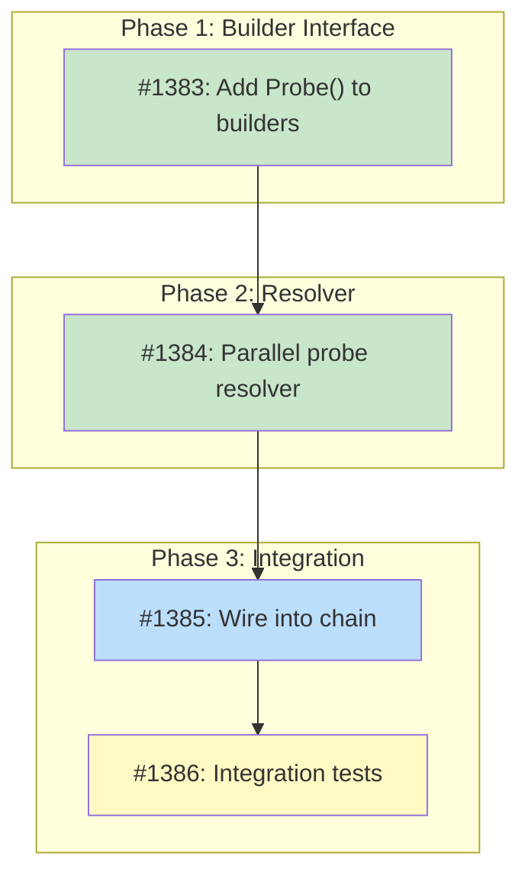

# DESIGN: Ecosystem Probe for Discovery Resolver

## Status

Planned

## Implementation Issues

### Milestone: [Ecosystem Probe](https://github.com/tsukumogami/tsuku/milestone/65)

| Issue | Dependencies | Tier |
|-------|--------------|------|
| ~~[#1383: Add Probe() to ecosystem builders](https://github.com/tsukumogami/tsuku/issues/1383)~~ | ~~None~~ | ~~testable~~ |
| _Adds `Probe()` to all 7 ecosystem builders (npm, pypi, cargo, gem, go, cpan, cask), wrapping existing fetch methods to return `ProbeResult` with existence, source, and age (Go only)._ | | |
| ~~[#1384: Implement parallel ecosystem probe resolver](https://github.com/tsukumogami/tsuku/issues/1384)~~ | ~~[#1383](https://github.com/tsukumogami/tsuku/issues/1383)~~ | ~~testable~~ |
| ~~_Replaces the stub resolver with goroutine-per-builder fan-out, shared 3-second timeout, buffered channel collection, and static priority-based disambiguation._~~ | | |
| [#1385: Wire ecosystem probe into chain resolver](https://github.com/tsukumogami/tsuku/issues/1385) | [#1384](https://github.com/tsukumogami/tsuku/issues/1384) | testable |
| _Updates `runDiscovery()` to construct `NewEcosystemProbe()` with the list of builder probers, connecting the probe to the live discovery chain._ | | |
| [#1386: Add integration tests for ecosystem probe](https://github.com/tsukumogami/tsuku/issues/1386) | [#1385](https://github.com/tsukumogami/tsuku/issues/1385) | testable |
| _Covers parallel execution, timeout behavior, priority disambiguation, and full chain integration with mock HTTP responses._ | | |

### Dependency Graph



**Legend**: Green = done, Blue = ready, Yellow = blocked, Purple = needs-design

## Upstream Design Reference

This design implements the Ecosystem Probe stage described in [DESIGN-discovery-resolver.md](DESIGN-discovery-resolver.md) (Solution Architecture: Ecosystem Probe section). It addresses the design questions raised in issue 1317.

## Context and Problem Statement

The discovery resolver chain has three stages: registry lookup, ecosystem probe, and LLM discovery. The registry lookup (#1315, #1338) is complete and working. The ecosystem probe is a stub that always returns `(nil, nil)`, meaning every tool not in the curated registry (~500 entries) falls through to LLM-based search.

This creates two problems. First, LLM discovery requires an API key and costs money per query. Many developer tools exist in npm, PyPI, crates.io, or other package registries that can be queried for free. Second, LLM responses are non-deterministic and slower. A tool that's published on crates.io should be found in under 3 seconds without touching an LLM.

The parent design specified filtering by download counts (>1000/month) and package age (>90 days) to reduce typosquat risk. But after examining all seven ecosystem builder implementations, **none of the registry APIs expose download counts** in their standard response, and only Go's proxy provides a publish timestamp. This design must reconcile the filtering intent with actual API capabilities.

### Scope

**In scope:**
- Parallel queries to ecosystem registries with shared timeout
- Result collection and disambiguation when multiple ecosystems match
- Integration with the existing `ChainResolver` as stage 2
- Handling partial results from timeouts and API failures

**Out of scope:**
- Disambiguation UI (#1321) — this design produces ranked results; #1321 handles prompting
- LLM discovery (#1318) — separate stage, unaffected by this work
- Telemetry events (#1319) — hooks into the probe but designed separately
- Adding new ecosystem builders

## Decision Drivers

- **API reality**: Registry APIs don't expose popularity data; the design must work without it
- **Latency budget**: 3 seconds total for all ecosystem queries, shared timeout
- **Interface stability**: Can't change `SessionBuilder` without affecting all builders
- **Determinism**: The probe should produce the same result for the same input every time
- **Graceful degradation**: Individual API failures shouldn't block the chain

## Considered Options

### Decision 1: How to Get Metadata from Builders

The parent design defines `EcosystemProber.Probe()` returning `ProbeResult{Exists, Downloads, Age, Source}`. But builders currently only have `CanBuild()` which returns `(bool, error)`. The question is whether the new `Probe()` method should try to extract metadata, or just confirm existence.

#### Chosen: Existence-first with optional metadata

`Probe()` reuses the same API call that `CanBuild()` makes, but returns a `ProbeResult` with whatever metadata the API provides. For most builders, `Downloads` and `Age` will be 0. Go builder can populate `Age` from its `Time` field. This avoids secondary API calls while leaving the door open for builders to add metadata as APIs evolve.

#### Alternatives Considered

**Make secondary API calls for popularity data**: npm has `api.npmjs.org/downloads`, PyPI has `pypistats.org`, etc. Rejected because it doubles the number of HTTP requests per probe, adds latency, and creates dependencies on stats services that may rate-limit or go down. The marginal value of download counts for filtering doesn't justify the cost.

**Use CanBuild() directly without Probe()**: Skip the new interface entirely and just call `CanBuild()`. Rejected because we lose the ability to return the `Source` string (builder-specific package identifier) and any future metadata. The `ProbeResult` struct is cheap to add and avoids a second round of API calls when we already have the data.

### Decision 2: Filtering Without Download Counts

The parent design specified `>90 days AND >1000 downloads/month` as noise reduction. Since download counts aren't available, we need a different approach to reduce false positives from typosquats and placeholder packages.

#### Chosen: Static ecosystem priority with name-match validation

Instead of popularity thresholds, use two signals:
1. **Exact name match**: The queried tool name must exactly match the package name in the registry (case-insensitive). This rejects packages where the tool name is a substring or slight variation.
2. **Static priority ranking**: When multiple ecosystems match, rank by ecosystem reliability rather than per-package popularity. The order reflects which ecosystems are most likely to contain the "canonical" version of a tool: Homebrew Cask > crates.io > PyPI > npm > RubyGems > Go > CPAN.

The age threshold from the parent design (>90 days) can be applied to the Go builder since it exposes `Time`. For other builders, age is unknown and not filtered.

#### Alternatives Considered

**Skip all filtering**: Accept any match from any ecosystem. Rejected because it increases typosquat risk and would auto-select placeholder packages that happen to share a name with a legitimate tool.

**Add secondary API calls for stats**: Query npm downloads API, pypistats, etc. Rejected for the same latency/reliability reasons as Decision 1.

**Require user confirmation for all matches**: Always prompt, never auto-select. Rejected because it breaks non-interactive usage (`--yes` flag, CI pipelines) and creates a bad experience for unambiguous single-match results.

### Decision 3: Parallel Execution Model

The probe needs to query 5-6 ecosystem APIs simultaneously within a 3-second window.

#### Chosen: goroutine-per-builder with shared context timeout

Launch one goroutine per ecosystem builder, all sharing a `context.WithTimeout(ctx, 3*time.Second)`. Collect results via a channel. When the context expires, any in-flight requests are cancelled. Results that arrive before the deadline are collected.

#### Alternatives Considered

**Sequential queries with per-builder timeout**: Query ecosystems one at a time, each with a 500ms timeout. Rejected because total worst-case latency becomes N * 500ms. Parallel execution means worst case is just the timeout duration (3 seconds).

**Worker pool with limited concurrency**: Limit to 3 concurrent queries. Rejected because we only have 5-6 builders; the overhead of a pool isn't warranted, and we'd waste time waiting for pool slots when all queries could run simultaneously.

### Uncertainties

- The static priority ranking may not match user expectations in all cases. A Go developer probably expects `go install` over `cargo install` for a tool that exists in both. We won't know until real usage data surfaces.
- Cask's inclusion is borderline. It requires a formula name (like Homebrew) but the API can be queried by tool name. Including it for now; can exclude if it produces too many false positives.

## Decision Outcome

### Summary

The ecosystem probe queries all participating builders in parallel with a 3-second shared timeout. Each builder implements `Probe()`, which reuses its existing registry API call and returns `ProbeResult` with existence, source string, and whatever metadata the API happens to provide (usually just existence). Results are filtered by exact name match, then disambiguated using a static ecosystem priority ranking when multiple ecosystems contain the same tool name.

Single matches are returned directly to the chain resolver with `Confidence: "ecosystem"`. Multiple matches are ranked and the top result returned, with the full list available in `DiscoveryResult.Metadata` for downstream disambiguation (#1321) to present to the user. When no ecosystem matches, the probe returns `(nil, nil)` to let the chain fall through to LLM discovery.

The implementation adds `Probe()` to each ecosystem builder (npm, pypi, cargo, gem, go, cpan) as a thin wrapper around their existing `fetchPackageInfo()` / `fetchCrateInfo()` / etc. methods. Cask is included initially. Homebrew and GitHub builders are excluded because they require source arguments that discovery is trying to find.

### Rationale

The parent design's filtering thresholds assumed API metadata that doesn't exist. Rather than bolt on fragile secondary API calls for popularity stats, we accept that filtering must be coarser and rely on exact name matching plus ecosystem priority. This keeps the probe fast (single API call per builder), deterministic (no stats services that may be stale or down), and simple to test. The priority ranking can be replaced with popularity-based ranking later if ecosystem APIs add download counts or if we build our own usage database from telemetry.

### Trade-offs Accepted

- **Less precise disambiguation**: Without download counts, we can't distinguish between a popular crate and an obscure one. A static priority list is a rough proxy. This is acceptable because disambiguation (#1321) will present options to the user in ambiguous cases.
- **No age filtering for most ecosystems**: Only Go provides publish dates. Young typosquat packages on npm or PyPI won't be filtered by age. Mitigated by exact name matching and the curated registry taking precedence.
- **Cask may produce noise**: Including Cask means macOS GUI apps might match tool names. Can be excluded in a follow-up if it's a problem.

## Solution Architecture

### Overview

The ecosystem probe sits between registry lookup and LLM discovery in the chain resolver. It holds a list of builders that implement `EcosystemProber`, launches parallel queries, collects results, and returns the best match.

### Components

```
ChainResolver
  ├── Stage 1: RegistryLookup (existing, O(1) map lookup)
  ├── Stage 2: EcosystemProbe (this design)
  │     ├── npm.Probe()
  │     ├── pypi.Probe()
  │     ├── cargo.Probe()
  │     ├── gem.Probe()
  │     ├── go.Probe()
  │     ├── cpan.Probe()
  │     └── cask.Probe()
  └── Stage 3: LLMDiscovery (stub, future #1318)
```

### Key Interfaces

The `EcosystemProber` interface already exists in `internal/discover/ecosystem_probe.go`:

```go
type EcosystemProber interface {
    builders.SessionBuilder
    Probe(ctx context.Context, name string) (*ProbeResult, error)
}

type ProbeResult struct {
    Exists    bool
    Downloads int    // Monthly downloads (0 if unavailable)
    Age       int    // Days since first publish (0 if unavailable)
    Source    string // Builder-specific source arg
}
```

The `EcosystemProbe` resolver struct gains fields and a constructor:

```go
type EcosystemProbe struct {
    probers  []EcosystemProber
    timeout  time.Duration
    priority map[string]int // builder name → priority rank (lower = better)
}

func NewEcosystemProbe(probers []EcosystemProber, timeout time.Duration) *EcosystemProbe {
    return &EcosystemProbe{
        probers: probers,
        timeout: timeout,
        priority: map[string]int{
            "cask":  1, // macOS apps, well-curated
            "cargo": 2, // Rust CLI tools (bat, fd, ripgrep)
            "pypi":  3, // Large ecosystem, many CLI tools
            "npm":   4, // Largest but noisiest
            "gem":   5, // Declining but has CLI tools
            "go":    6, // Many CLI tools but needs module path
            "cpan":  7, // Legacy, fewest CLI tools
        },
    }
}
```

### Data Flow

1. `ChainResolver.Resolve("bat")` → registry miss → calls `EcosystemProbe.Resolve("bat")`
2. `EcosystemProbe` creates `context.WithTimeout(ctx, 3s)`
3. Launches goroutine per prober: `prober.Probe(ctx, "bat")`
4. Each goroutine sends `probeOutcome{builderName, result, err}` to a buffered channel (sized to `len(probers)` to prevent goroutine leaks on timeout)
5. Collector waits for all goroutines or timeout, whichever comes first
6. Filter: discard results where `!result.Exists` or name doesn't match
7. If 0 results → return `(nil, nil)` (chain falls through to LLM)
8. If 1 result → return `DiscoveryResult` with `Confidence: "ecosystem"`
9. If N results → rank by priority map, return top result with alternatives in metadata

### Builder Probe Implementation Pattern

Each builder's `Probe()` reuses the existing fetch method:

```go
// In cargo builder:
func (b *CargoBuilder) Probe(ctx context.Context, name string) (*ProbeResult, error) {
    info, err := b.fetchCrateInfo(ctx, name)
    if err != nil {
        return &ProbeResult{Exists: false}, nil // soft error
    }
    return &ProbeResult{
        Exists: true,
        Source: name, // cargo source is the crate name
    }, nil
}
```

For Go builder, the `Time` field populates `Age`:

```go
func (b *GoBuilder) Probe(ctx context.Context, name string) (*ProbeResult, error) {
    info, err := b.fetchModuleInfo(ctx, name)
    if err != nil {
        return &ProbeResult{Exists: false}, nil
    }
    age := 0
    if t, err := time.Parse(time.RFC3339, info.Time); err == nil {
        age = int(time.Since(t).Hours() / 24)
    }
    return &ProbeResult{
        Exists: true,
        Age:    age,
        Source: name,
    }, nil
}
```

### Error Handling

- Individual builder failures are soft errors: logged at debug level, don't stop the probe
- Context cancellation (timeout) stops all in-flight requests
- If all builders fail with hard errors, return an error (not nil, nil) so the chain can decide how to handle it
- Network errors from individual builders are not exposed to the user unless `--verbose` is set

## Implementation Approach

### Phase 1: Probe Interface on Builders

Add `Probe()` to each of the 6 ecosystem builders (npm, pypi, cargo, gem, go, cpan) plus cask. Each implementation wraps the existing fetch method and returns a `ProbeResult`. This is the bulk of the mechanical work but low-risk since it reuses existing API logic.

Files: `internal/builders/{npm,pypi,cargo,gem,go_builder,cpan,cask}/*.go`

### Phase 2: EcosystemProbe Resolver

Replace the stub in `internal/discover/ecosystem_probe.go` with the parallel query logic. This is the core of the design: goroutine fan-out, channel collection, timeout handling, and priority-based ranking.

Files: `internal/discover/ecosystem_probe.go`

### Phase 3: Wire into ChainResolver

Update the chain resolver construction in `cmd/tsuku/create.go` (`runDiscovery()`) to pass the list of ecosystem probers to `EcosystemProbe`. Currently the stub takes no arguments.

Files: `cmd/tsuku/create.go`, `internal/discover/chain.go`

### Phase 4: Tests

Unit tests for each builder's `Probe()` method (mock HTTP responses), the parallel execution logic, timeout behavior, and priority ranking. Integration test with the chain resolver.

Files: `internal/builders/*/probe_test.go`, `internal/discover/ecosystem_probe_test.go`

## Security Considerations

### Download Verification

Not directly applicable to the probe itself. The probe only queries registry APIs to check whether a package exists; it doesn't download binaries. Binary downloads happen later in the create pipeline, which already handles checksum verification. However, the probe does influence *which* binary gets downloaded by choosing a builder and source, so the accuracy of the probe matters for supply chain safety.

### Execution Isolation

The probe makes outbound HTTPS requests to a fixed set of package registry APIs (registry.npmjs.org, pypi.org, crates.io, rubygems.org, proxy.golang.org, fastapi.metacpan.org, formulae.brew.sh). It doesn't execute any code or modify the filesystem. The 3-second timeout limits how long these connections can stay open.

The probe does NOT follow repository URLs from registry responses or fetch secondary resources like Cargo.toml or pyproject.toml. Those fetches happen later during `Build()`, not during `Probe()`. This means the probe's HTTP traffic is limited to well-known registry endpoints with hardcoded base URLs, which limits SSRF risk. DNS rebinding and redirect-based SSRF attacks against registry endpoints are theoretically possible but require compromising major package registries themselves.

### Supply Chain Risks

The primary risk is **name confusion**: a tool named `bat` exists on both crates.io (the popular file viewer) and npm (an unrelated package). If the probe returns the wrong one, the user installs something they didn't intend.

Mitigations:
- The curated registry (~500 entries) handles the most popular tools, so they never reach the probe
- Exact name matching rejects partial matches
- Static priority ranking favors ecosystems more likely to contain CLI tools (crates.io, PyPI) over those with more namespace squatting (npm)
- Disambiguation (#1321) prompts when multiple matches exist and are close in ranking
- Users can always override with `--from`

Residual risk: A malicious package with the exact name of a legitimate tool, published in a higher-priority ecosystem, could be auto-selected. This is mitigated by the registry covering popular tools and by the create pipeline's existing verification steps.

### User Data Exposure

The probe sends the tool name (user input) to up to 7 external package registries. This reveals what tools the user is trying to install. No other user data (system info, installed tools, file paths) is transmitted. Telemetry (#1319) will separately track probe usage, but that's governed by tsuku's telemetry consent model.

## Consequences

### Positive

- Tools in package registries are found without LLM keys or API costs
- Sub-3-second resolution for ecosystem packages
- Deterministic: same input always produces same output (no LLM variance)
- No changes to the existing `SessionBuilder` interface

### Negative

- Without download counts, disambiguation is coarser than the parent design intended
- Static priority ranking may surprise users whose primary ecosystem doesn't rank highest
- 7 parallel HTTP requests on every probe (when registry misses) creates load on package registries

### Mitigations

- Priority ranking can be replaced with popularity-based ranking if metadata becomes available
- The curated registry covers the most common tools, reducing probe frequency
- Package registry APIs are designed for high-volume queries; 1 extra request per tsuku install is negligible
