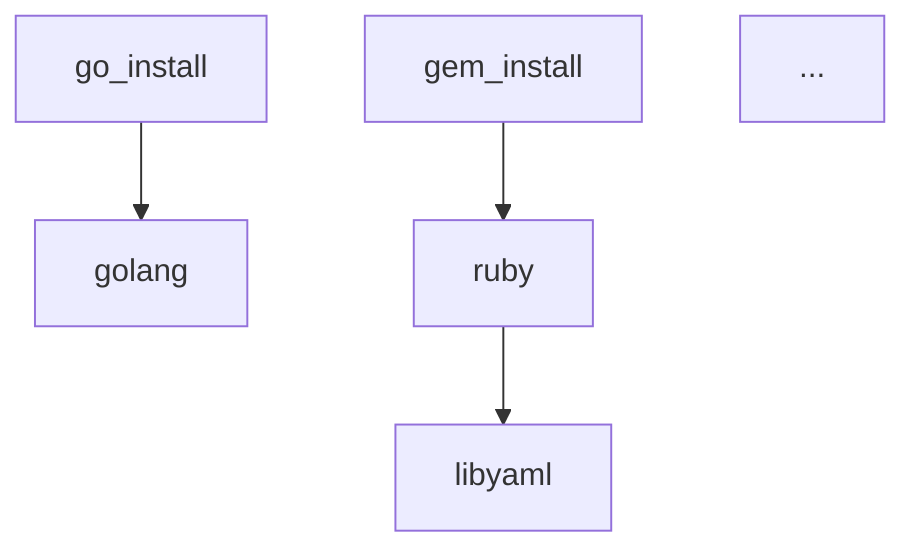

# Embedded Recipe List Generation

## Status

**Proposed**

## Upstream Design Reference

This design implements Stage 0 of [DESIGN-recipe-registry-separation.md](DESIGN-recipe-registry-separation.md).

**Relevant sections:**
- Stage 0: Embedded Recipe List Validation (Prerequisite)
- Implementation Approach: Steps 1-5 for generating and validating EMBEDDED_RECIPES.md

## Context and Problem Statement

The recipe registry separation design requires splitting tsuku's 171 recipes into two categories:
- **Embedded**: Action dependencies needed for bootstrap (stay in `internal/recipe/recipes/`)
- **Registry**: All other recipes (move to `recipes/`)

Before migration can proceed, we need a definitive list of which recipes must remain embedded. The current estimate (15-20 recipes) is based on manual analysis of action Dependencies() implementations. This manual approach has risks:

1. **Incomplete coverage**: Transitive dependencies could be missed (e.g., ruby needs libyaml)
2. **Stale documentation**: As actions change, the embedded list could drift from reality
3. **No CI validation**: Nothing prevents merging code that adds a new action dependency without updating the embedded list

Issue #644 (composite action dependency aggregation) is fully resolved and deployed. The resolver.go infrastructure correctly handles transitive action dependencies via `aggregatePrimitiveDeps()`. The TODO comments in `homebrew.go` and `homebrew_relocate.go` are stale and can be removed.

We still need a tool to:
1. Extract which recipes each action depends on (using existing infrastructure)
2. Compute transitive recipe closure (recipes that depend on other recipes)
3. Generate documented output explaining why each recipe is embedded
4. Validate the list stays in sync with action code

### Success Criteria

The implementation is complete when:
1. **Complete coverage**: Every action's Dependencies() return is captured
2. **Transitive closure**: Recipe-level dependencies (e.g., ruby→libyaml) are included
3. **Platform awareness**: Platform-specific deps are clearly annotated (e.g., patchelf→linux)
4. **Documented output**: EMBEDDED_RECIPES.md explains why each recipe is embedded
5. **CI validation**: Changes to action code trigger validation; drift fails the build
6. **Recipe count in range**: Final count is 15-25 recipes (sanity check on estimate)

### Scope

**In scope:**
- Build-time script/tool to generate embedded recipe list
- Transitive dependency computation (recipes depending on recipes)
- EMBEDDED_RECIPES.md documentation with dependency graph
- CI validation script (verify-embedded-recipes.sh)
- Platform-specific dependency handling (e.g., patchelf is Linux-only)
- Cleanup of stale TODO comments referencing resolved issue #644

**Out of scope:**
- Changes to the Dependencies() infrastructure (already working)
- Recipe migration to new locations (handled in issue #1033)
- Golden file reorganization (handled in issue #1034)
- Integration test recipes in `testdata/recipes/` (Stage 3, issue #1035)

### Platform Handling

EMBEDDED_RECIPES.md will contain a single combined list with platform annotations:
- Recipes required on all platforms are marked "all"
- Linux-only recipes (e.g., patchelf) are marked "linux"
- The output format allows filtering by platform for downstream tooling

## Decision Drivers

- **Accuracy**: Must capture ALL action dependencies including transitive recipe dependencies
- **Maintainability**: CI validation to prevent embedded list drift when actions change
- **Visibility**: Human-readable documentation explaining why each recipe is embedded
- **Simplicity**: Tool should be easy to understand and maintain
- **Speed**: Should complete quickly (< 5 seconds) for CI integration
- **No external dependencies**: Should work with Go standard library only

## Implementation Context

### Existing Infrastructure

The resolver.go module already provides:
- `ResolveDependencies(recipe)` - collects action dependencies for a recipe
- `ResolveTransitive(deps)` - computes transitive closure with cycle detection
- `GetActionDeps(action)` - returns ActionDeps for any action

The action.go module provides:
- Action registry with all 22+ actions
- ActionDeps struct with InstallTime, Runtime, EvalTime, and platform-specific variants
- Each action implements Dependencies() returning its tool requirements

### Key Actions and Their Tool Dependencies

| Action | Tool Dependency | Platform |
|--------|----------------|----------|
| `go_install`, `go_build` | golang | all |
| `cargo_install`, `cargo_build` | rust | all |
| `npm_install`, `npm_exec` | nodejs | all |
| `pip_install`, `pipx_install` | python-standalone | all |
| `gem_install`, `gem_exec` | ruby | all |
| `cpan_install` | perl | all |
| `homebrew_relocate`, `meson_build` | patchelf | linux |
| `configure_make`, `cmake_build`, `meson_build` | make, zig, pkg-config | all |
| `cmake_build` | cmake | all |
| `meson_build` | meson, ninja | all |

### Transitive Recipe Dependencies

Some embedded recipes depend on other recipes:
- `ruby` → `libyaml`
- `cmake` → `openssl`, `patchelf`
- `openssl` → `zlib`

These transitive dependencies must be included in the embedded list.

## Considered Options

### Decision 1: Implementation Language

#### Option 1A: Go Program (cmd/analyze-deps)

Create a Go program that uses the existing resolver infrastructure directly.

```go
// cmd/analyze-deps/main.go
func main() {
    actions := actions.Registry()
    for _, action := range actions {
        deps := action.Dependencies()
        // Process and output
    }
}
```

**Pros:**
- Directly uses existing Go infrastructure (type-safe)
- Catches compile-time errors if action interface changes
- Runs as part of `go generate` workflow
- Single source of truth (no parsing Go code externally)

**Cons:**
- Binary must be built before running analysis
- Adds a new cmd/ entry point to maintain

#### Option 1B: Go Test as Generator

Use a Go test file that generates EMBEDDED_RECIPES.md.

```go
// internal/actions/generate_embedded_test.go
func TestGenerateEmbeddedRecipes(t *testing.T) {
    if os.Getenv("GENERATE_EMBEDDED") == "" {
        t.Skip("Set GENERATE_EMBEDDED=1 to regenerate")
    }
    // Generate EMBEDDED_RECIPES.md
}
```

**Pros:**
- No new binary to maintain
- Uses existing test infrastructure
- Clear pattern (test files that generate)

**Cons:**
- Somewhat unconventional (test that writes files)
- Requires environment variable to enable generation
- Test failures could be confusing

#### Option 1C: Shell Script with go run

Create a shell script that runs a Go program inline.

```bash
#!/usr/bin/env bash
go run ./scripts/analyze-deps/main.go > EMBEDDED_RECIPES.md
```

**Pros:**
- Simple, familiar pattern
- No pre-built binary needed
- Easy to integrate with CI

**Cons:**
- Slower (compiles on every run, though module cache helps)
- Still requires Go code (just invoked differently)

#### Option 1D: Leverage Existing Resolver Infrastructure

Create a thin wrapper around the proven resolver.go code rather than building parallel extraction logic.

```go
// scripts/analyze-deps/main.go
func main() {
    registry := actions.Registry()
    allDeps := make(map[string]ActionDeps)

    for name, action := range registry {
        allDeps[name] = action.Dependencies()
    }

    // Use existing ResolveTransitive for recipe-level closure
    // Output markdown with dependency graph
}
```

**Pros:**
- Reuses proven, tested infrastructure
- Guaranteed consistency with runtime behavior
- Minimal new code (just output formatting)
- Benefits from existing cycle detection and platform handling

**Cons:**
- Couples to internal APIs (acceptable for internal tool)
- Must be updated if resolver changes (but so would any approach)

### Decision 2: Output Format

#### Option 2A: Markdown Only (EMBEDDED_RECIPES.md)

Generate only the human-readable markdown file.

```markdown
# Embedded Recipes

| Recipe | Direct Dependency Of | Transitive Dependency Of | Platform |
|--------|---------------------|-------------------------|----------|
| golang | go_install, go_build | - | all |
| libyaml | - | ruby | all |
```

**Pros:**
- Simple, single artifact
- Easy to review in PRs
- Matches upstream design spec

**Cons:**
- Harder to programmatically consume
- Must parse markdown to validate

#### Option 2B: JSON Manifest + Markdown

Generate both a machine-readable JSON and human-readable markdown.

```json
{
  "recipes": [
    {"name": "golang", "actions": ["go_install"], "platform": "all"},
    {"name": "libyaml", "transitiveOf": ["ruby"], "platform": "all"}
  ]
}
```

**Pros:**
- JSON for CI validation (easy to parse)
- Markdown for human review
- Clear separation of concerns

**Cons:**
- Two files to keep in sync
- More complex generation

#### Option 2C: Markdown as Source of Truth with Validation Script

Generate markdown, use regex parsing in validation script.

**Pros:**
- Single file
- Validation extracts what it needs

**Cons:**
- Fragile parsing
- Format changes break validation

### Decision 3: CI Validation Approach

#### Option 3A: Regenerate and Compare

CI regenerates the list and compares to committed version.

```bash
./scripts/analyze-deps.sh > /tmp/generated.md
diff EMBEDDED_RECIPES.md /tmp/generated.md
```

**Pros:**
- Simple and reliable
- Clear failure message: "regenerate with: ..."
- Catches any drift

**Cons:**
- Slower (runs full generation)
- May fail on non-deterministic output (timestamps)

#### Option 3B: Validate Against Action Code

CI parses action code to extract dependencies, validates against committed list.

**Pros:**
- Faster (just validation, no generation)
- Could validate from source without building

**Cons:**
- Duplicates extraction logic
- Must keep validation in sync with generation

### Evaluation Against Decision Drivers

| Driver | 1A (Go Program) | 1B (Go Test) | 1C (Shell) | 1D (Resolver Wrapper) |
|--------|-----------------|--------------|------------|----------------------|
| Accuracy | Good | Good | Good | Good |
| Maintainability | Good | Fair | Fair | Good |
| Simplicity | Good | Fair | Good | Good |
| Speed | Good (built) | Fair | Fair (cached) | Good |
| Code Reuse | Poor | Poor | Poor | Good |

| Driver | 2A (Markdown) | 2B (JSON + MD) | 2C (MD + Regex) |
|--------|---------------|----------------|-----------------|
| Visibility | Good | Good | Good |
| Maintainability | Fair | Good | Poor |
| Simplicity | Good | Fair | Poor |
| PR Reviewability | Good | Fair | Good |

| Driver | 3A (Regenerate) | 3B (Validate) |
|--------|-----------------|---------------|
| Accuracy | Good | Good |
| Maintainability | Good | Fair |
| Speed | Fair | Good |

### Dependency Category Handling

**All three dependency categories are included:**
- **InstallTime**: Tools needed during `tsuku install` (e.g., rust for cargo_install)
- **Runtime**: Tools needed when the installed tool runs (e.g., nodejs for npm_install)
- **EvalTime**: Tools needed for plan generation (e.g., go for go_install's Decompose method)

EvalTime dependencies are critical because actions like `go_install` and `cargo_install` call package manager commands during their `Decompose()` phase. Without these tools at eval time, plan generation fails.

### Platform Merging Logic

Recipes appearing in multiple platform fields are handled as follows:
- LinuxInstallTime only → Platform: "linux"
- DarwinInstallTime only → Platform: "darwin"
- Both LinuxInstallTime AND DarwinInstallTime → Platform: "all"
- InstallTime (non-platform-specific) → Platform: "all"

### Uncertainties

- **Binary size impact**: Unknown until implemented. Should measure before/after recipe migration.
- **Circular recipe dependencies**: The resolver handles action cycles; recipe-level cycles are theoretically possible but none exist in current data.

## Decision Outcome

**Chosen: 1D (Resolver Wrapper) + 2A (Markdown Only) + 3A (Regenerate and Compare)**

### Summary

A Go program in `scripts/analyze-deps/` wraps the existing resolver infrastructure to extract action dependencies and compute transitive recipe closure. It outputs a single EMBEDDED_RECIPES.md file. CI validation regenerates this file and compares to the committed version, failing if drift is detected.

### Rationale

**1D (Resolver Wrapper) chosen because:**
- Reuses proven, tested code from resolver.go rather than building parallel logic
- Guarantees consistency between the embedded list and actual runtime dependency resolution
- Minimal new code - only output formatting and recipe-level transitive computation needed
- Benefits from existing platform handling and cycle detection

**2A (Markdown Only) chosen because:**
- Matches upstream design specification (EMBEDDED_RECIPES.md at repo root)
- Single artifact is simpler to maintain
- Human-readable format is ideal for PR reviews where the embedded list changes
- Validation script can parse markdown tables with simple grep/awk

**3A (Regenerate and Compare) chosen because:**
- Simple and reliable - same code path for generation and validation
- Clear failure message with actionable fix ("regenerate with: ...")
- Avoids maintaining separate validation logic that could drift
- Speed is acceptable (< 5s with module cache)

**Alternatives rejected:**

- **1A/1B/1C**: Would duplicate extraction logic that already exists in resolver.go; higher maintenance burden
- **2B (JSON + MD)**: Two files to keep in sync; unnecessary complexity for this use case
- **2C (MD + Regex)**: Fragile parsing; format changes would break validation
- **3B (Validate-only)**: Duplicates extraction logic; risks validation diverging from generation

### Trade-offs Accepted

By choosing this option, we accept:

1. **Internal API coupling**: The tool depends on internal action package APIs. If the resolver changes, the tool must be updated.
   - *Acceptable because*: This is an internal tool, not a public API. Changes to the resolver would require updating the embedded list anyway.

2. **Go compilation required**: CI must compile the Go program to run validation.
   - *Acceptable because*: CI already has Go toolchain; module cache makes this fast.

3. **Markdown parsing fragility**: Validation parses markdown tables which could break if format changes.
   - *Acceptable because*: Format is stable and well-defined; any format change would be intentional and would update both generation and validation.

## Solution Architecture

### Overview

The solution consists of two artifacts:

1. **`scripts/analyze-deps/main.go`**: Go program that extracts action dependencies and generates EMBEDDED_RECIPES.md
2. **`scripts/verify-embedded-recipes.sh`**: Shell script that validates EMBEDDED_RECIPES.md matches generated output

These integrate with existing CI workflows to prevent drift between action code and the embedded recipe list.

### Components

```
┌─────────────────────────────────────────────────────────────────┐
│                    scripts/analyze-deps/                        │
│  ┌─────────────┐    ┌─────────────┐    ┌──────────────────────┐│
│  │ Action      │───▶│ Recipe      │───▶│ Markdown             ││
│  │ Extraction  │    │ Closure     │    │ Generation           ││
│  └─────────────┘    └─────────────┘    └──────────────────────┘│
│        │                  │                      │              │
│        ▼                  ▼                      ▼              │
│  actions.Registry()  recipe.Load()    fmt.Fprintf()            │
│  action.Dependencies() ResolveTransitive()                     │
└─────────────────────────────────────────────────────────────────┘
                                │
                                ▼
                      EMBEDDED_RECIPES.md
                                │
                                ▼
┌─────────────────────────────────────────────────────────────────┐
│              scripts/verify-embedded-recipes.sh                 │
│  ┌─────────────┐    ┌─────────────┐    ┌──────────────────────┐│
│  │ Generate    │───▶│ Compare     │───▶│ Report               ││
│  │ to /tmp     │    │ with diff   │    │ Success/Failure      ││
│  └─────────────┘    └─────────────┘    └──────────────────────┘│
└─────────────────────────────────────────────────────────────────┘
```

### Key Interfaces

**ActionDeps struct** (from internal/actions/action.go):
```go
type ActionDeps struct {
    InstallTime []string // Tools needed during installation
    Runtime     []string // Tools needed at runtime
    EvalTime    []string // Tools needed for plan generation

    LinuxInstallTime  []string
    DarwinInstallTime []string
    LinuxRuntime      []string
    DarwinRuntime     []string
}
```

**Output format** (EMBEDDED_RECIPES.md):
```markdown
# Embedded Recipes

Generated by `go run ./scripts/analyze-deps/main.go`

Total embedded recipes: N

## Recipe List

| Recipe | Direct Dependency Of | Transitive Dependency Of | Platform |
|--------|---------------------|-------------------------|----------|
| golang | go_install, go_build | - | all |
| libyaml | - | ruby | all |
| patchelf | homebrew_relocate, meson_build | - | linux |
...

## Dependency Graph


```

### Data Flow

1. **Extraction**: Iterate action registry, call Dependencies() on each action
2. **Collection**: Build map of action→tools for InstallTime, Runtime, EvalTime categories
3. **Deduplication**: Union all tool names across categories
4. **Recipe loading**: For each tool, load the recipe and extract its dependencies field
5. **Transitive closure**: Recursively follow recipe dependencies until no new recipes
6. **Platform annotation**: Mark recipes as "all", "linux", or "darwin" based on which fields declared them
7. **Output**: Format as markdown table and mermaid graph

## Implementation Approach

### Step 1: Create Analysis Tool

Create `scripts/analyze-deps/main.go`:

```go
package main

import (
    "fmt"
    "os"
    "sort"
    "strings"

    "github.com/tsukumogami/tsuku/internal/actions"
    "github.com/tsukumogami/tsuku/internal/recipe"
)

type EmbeddedRecipe struct {
    Name         string
    DirectOf     []string // Actions that directly require this
    TransitiveOf []string // Recipes that transitively require this
    Platform     string   // "all", "linux", or "darwin"
}

func main() {
    embedded := collectEmbeddedRecipes()
    generateMarkdown(os.Stdout, embedded)
}

func collectEmbeddedRecipes() []EmbeddedRecipe {
    // 1. Get all action dependencies
    // 2. Compute transitive recipe closure
    // 3. Annotate platform requirements
    // 4. Return sorted list
}

func generateMarkdown(w io.Writer, recipes []EmbeddedRecipe) {
    // Generate markdown table and mermaid graph
}
```

### Step 2: Create Validation Script

Create `scripts/verify-embedded-recipes.sh`:

```bash
#!/usr/bin/env bash
set -euo pipefail

SCRIPT_DIR="$(cd "$(dirname "${BASH_SOURCE[0]}")" && pwd)"
REPO_ROOT="$(cd "$SCRIPT_DIR/.." && pwd)"

echo "=== Verifying EMBEDDED_RECIPES.md ===" >&2

# Generate fresh output
go run "$REPO_ROOT/scripts/analyze-deps/main.go" > /tmp/embedded-recipes-generated.md

# Compare with committed file
if ! diff -q "$REPO_ROOT/EMBEDDED_RECIPES.md" /tmp/embedded-recipes-generated.md > /dev/null 2>&1; then
    echo "FAIL: EMBEDDED_RECIPES.md is out of date" >&2
    echo "" >&2
    echo "Diff:" >&2
    diff "$REPO_ROOT/EMBEDDED_RECIPES.md" /tmp/embedded-recipes-generated.md || true
    echo "" >&2
    echo "Regenerate with: go run ./scripts/analyze-deps/main.go > EMBEDDED_RECIPES.md" >&2
    exit 1
fi

# Verify all listed recipes exist in embedded directory
count=$(grep -E '^\| [a-z]' "$REPO_ROOT/EMBEDDED_RECIPES.md" | wc -l)
echo "Verified $count embedded recipes" >&2

# Sanity check: count should be in expected range
if [[ $count -lt 10 || $count -gt 30 ]]; then
    echo "WARNING: Recipe count ($count) outside expected range (10-30)" >&2
    echo "This may indicate a bug or major architecture change" >&2
fi

echo "=== All checks passed ===" >&2
```

### Step 3: Add CI Workflow

Add to `.github/workflows/validate-embedded-recipes.yml`:

```yaml
name: Validate Embedded Recipes

on:
  push:
    paths:
      - 'internal/actions/**/*.go'
      - 'EMBEDDED_RECIPES.md'
      - 'scripts/analyze-deps/**'
      - 'scripts/verify-embedded-recipes.sh'
  pull_request:
    paths:
      - 'internal/actions/**/*.go'
      - 'EMBEDDED_RECIPES.md'
      - 'scripts/analyze-deps/**'
      - 'scripts/verify-embedded-recipes.sh'

jobs:
  validate:
    runs-on: ubuntu-latest
    steps:
      - uses: actions/checkout@v4
      - uses: actions/setup-go@v5
        with:
          go-version-file: go.mod
      - name: Validate embedded recipe list
        run: ./scripts/verify-embedded-recipes.sh
```

### Step 4: Generate Initial EMBEDDED_RECIPES.md

Run the tool to generate the initial file:

```bash
go run ./scripts/analyze-deps/main.go > EMBEDDED_RECIPES.md
```

Commit along with the tool and validation script.

## Consequences

### Positive

- **Automated accuracy**: Embedded list is always derived from actual action code
- **Drift prevention**: CI fails if action dependencies change without updating the list
- **Visibility**: EMBEDDED_RECIPES.md provides clear documentation for contributors
- **Single source of truth**: No manual maintenance of the embedded recipe list
- **Reuses existing code**: Leverages proven resolver infrastructure

### Negative

- **Build dependency**: Tool requires Go compilation (mitigated by module cache)
- **Internal API coupling**: Changes to action interfaces require tool updates
- **Additional CI step**: Adds validation time to PR checks

### Mitigations

- **Module cache**: CI and local development benefit from Go's module cache, keeping compile time under 5s
- **Co-located code**: Tool lives in scripts/, making it easy to update alongside action changes
- **Clear error messages**: Validation failures include exact diff and regeneration command

## Security Considerations

### Download Verification

**Not applicable** - This feature does not download external artifacts. The analysis tool reads only local files:
- Action source code in `internal/actions/`
- Recipe files in `internal/recipe/recipes/`
- No network requests are made during analysis or validation

### Execution Isolation

**Low risk** - The analysis tool:
- Runs at build/CI time, not runtime
- Has read-only access to source code (no file writes except stdout redirect)
- Requires no special permissions beyond Go toolchain
- Does not execute any downloaded code

The validation script:
- Runs with standard CI permissions
- Writes only to `/tmp` for comparison
- Does not modify the repository

### Supply Chain Risks

**Bootstrap integrity focus** - The purpose of this feature is to IMPROVE supply chain security by ensuring the embedded recipe list is accurate. If the list is incomplete:
- Action dependencies could fail to install due to missing embedded recipes
- Users would fall back to registry fetch, which has network dependency
- Offline installation would break for affected actions

The tool itself has minimal supply chain exposure:
- Uses only Go standard library (no external dependencies)
- Committed to the tsuku repository (same trust model as other code)
- CI validation ensures changes are reviewed

### User Data Exposure

**Not applicable** - This feature:
- Does not access user data
- Does not transmit any data externally
- Processes only source code and recipe definitions
- Output (EMBEDDED_RECIPES.md) contains no user-specific information

### Security Summary

| Dimension | Risk Level | Notes |
|-----------|------------|-------|
| Download Verification | N/A | No external downloads |
| Execution Isolation | Low | Build-time only, read-only access |
| Supply Chain | Low | Improves security by ensuring complete bootstrap |
| User Data | N/A | No user data accessed |

The primary security benefit of this feature is ensuring bootstrap integrity - all action dependencies are available embedded, reducing reliance on network fetches during installation.
