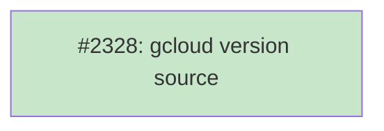

# DESIGN: Google Cloud SDK Version Source

## Status

Planned

## Context and Problem Statement

The `gcloud` CLI is distributed by Google directly. The release channel lives
at `https://dl.google.com/dl/cloudsdk/channels/rapid/`. Each release is
published as a per-platform tarball (`google-cloud-cli-{version}-{os}-{arch}.tar.gz`)
that bundles a Python interpreter and the SDK source tree (~120 MB). The
intended install pattern in tsuku is `download_archive` with
`install_mode = "directory"`, the same shape used successfully by `golang`
and `python`.

The blocker is version resolution. Google publishes the current SDK
version in a JSON manifest at
`https://dl.google.com/dl/cloudsdk/channels/rapid/components-2.json` as a
top-level `version` field (currently `566.0.0`). tsuku's version-provider
system in `internal/version/` supports the following sources:

- GitHub tags and releases (`github_repo`, `tag_prefix`)
- npm (`npm_install` action or `source = "npm"`)
- PyPI (`pipx_install` action or `source = "pypi"`)
- crates.io (`cargo_install` action or `source = "crates_io"`)
- RubyGems (`gem_install` action or `source = "rubygems"`)
- Homebrew formulae and casks (`homebrew`, `cask`, `tap` actions)
- Goproxy (`go_install` action or `source = "goproxy"`)
- Fossil SCM (`fossil_archive` action)
- MetaCPAN (`cpan_install` action or `source = "metacpan"`)
- Nixpkgs (`source = "nixpkgs"`)
- Go toolchain (`source = "go_toolchain"`)
- Custom named sources via `Registry`, currently registering only `nodejs_dist`

None of these can read Google's distribution channel. Without a path to
resolve the latest gcloud version, the curated `gcloud` recipe deferred
from #2296 cannot be authored — the `download_archive` URL has a
`{version}` placeholder that must be filled in at eval time.

The unofficial `twistedpair/google-cloud-sdk` GitHub mirror does publish
git tags that track Google's releases. At the time of writing, Google
publishes `566.0.0` and the mirror has `562.0.0` — a four-release lag
that has been roughly consistent over time.

## Decision Drivers

1. **Authoritative version of truth.** The recipe should resolve to
   Google's actual current version, not a third-party shadow that may
   lag or stop being maintained.
2. **Match existing patterns.** tsuku already has a registry of named
   custom sources (`nodejs_dist`). A new Google-specific source should
   slot into this registry without inventing a new abstraction.
3. **Minimal new surface.** Adding a custom source is ~50 lines of
   focused code. Inventing a generic JSON-URL recipe field would touch
   the schema, the validator, and the eval path.
4. **No new external attack surface.** The version provider already
   makes network requests to upstream sources at version-resolution
   time. Adding one more well-known endpoint is consistent with that
   model.

Out of scope:
- Supporting arbitrary version pinning at the version-provider level
  (e.g., `tsuku versions gcloud`). The existing `nodejs_dist` source is
  also latest-only; we match that.
- Fetching from non-rapid channels (alpha, beta). gcloud's `rapid`
  channel is the public stable channel; users who need other channels
  can pin a specific version manually.

## Considered Options

### Option A: Add a `gcloud_dist` custom source (chosen)

Add `internal/version/gcloud.go` with a `(r *Resolver) ResolveGCloud(ctx)`
method that fetches the components-2.json manifest, decodes the
top-level `version` field, and returns a `VersionInfo`. Register it in
`internal/version/registry.go:NewRegistry()` under the key
`"gcloud_dist"`. The recipe declares `[version] source = "gcloud_dist"`
and uses `download_archive` against `dl.google.com`.

- Pro: Authoritative — reads Google's actual current version.
- Pro: Matches `nodejs_dist` exactly. Same shape, same complexity, same
  registration pattern.
- Pro: ~50 lines of focused code, no new schema surface.
- Pro: Future Google products with similar manifests (cosign? gke-gcloud-auth-plugin?)
  can register additional named sources cheaply.
- Con: Custom code per source — does not generalize across upstreams
  with different manifest formats.
- Con: Latest-only. `tsuku versions gcloud` cannot enumerate all
  available SDK versions. Same limitation as `nodejs_dist`.

### Option B: Use `twistedpair/google-cloud-sdk` mirror via existing GitHub provider

Recipe declares `[version] github_repo = "twistedpair/google-cloud-sdk"`.
No code changes; the existing GitHub provider does the work.

- Pro: Zero code changes — purely a recipe.
- Pro: Reuses existing infrastructure: tag listing, latest resolution,
  explicit version pinning, etc.
- Con: Third-party trust dependency. The mirror is unofficial and runs
  on a community-maintained schedule.
- Con: Lags Google's releases by several versions (currently 4 behind).
  Recipe users get a stale gcloud unless they manually pin a newer
  version using a URL the mirror may not host.
- Con: If the mirror stops, gcloud silently breaks. The recipe has no
  fallback path.

### Option C: Generic `[version] source = "json_url"` recipe field

Add a new generic source that accepts a `url` and a `version_path`
(JSONPath or struct path) and fetches arbitrary JSON manifests.

- Pro: Reusable for any future tool with a similar release manifest.
- Pro: No per-source code; new sources are pure recipes.
- Con: Significantly more schema surface. The recipe must specify the
  URL, the path expression, and any auth handling.
- Con: Recipe authors design and debug JSON-path expressions per recipe.
  Mistakes are runtime errors at eval time, not compile-time errors.
- Con: Trust scope changes — recipes can now point the version
  resolver at arbitrary URLs. Existing custom sources are hardcoded;
  anyone who can land a recipe could not previously cause a fetch from
  an arbitrary URL during eval.

### Option D: Use Homebrew's `google-cloud-sdk` cask

Recipe declares `[version] cask = "google-cloud-sdk"` and uses the
existing cask provider.

- Pro: Existing infrastructure.
- Con: Casks are macOS-specific. Linux is the dominant gcloud platform;
  this option does not solve the linux/amd64 and linux/arm64 case.
- Con: The cask installs an interactive macOS package, not the
  cross-platform tarball that the recipe wants to use.

## Decision Outcome

Chose **Option A: Add a `gcloud_dist` custom source**.

Option A is the smallest, most consistent path. It satisfies all four
decision drivers: authoritative source (driver 1), matches the
`nodejs_dist` pattern (driver 2), minimal new surface — one Go file plus
one registry entry (driver 3), and reuses the existing
network-at-eval-time model for a well-known endpoint (driver 4).

Option B was rejected because the `twistedpair/google-cloud-sdk` mirror
lags Google's releases by several versions and depends on a single
external maintainer. tsuku users would get a stale gcloud or a silently
broken install if the mirror stops.

Option C was rejected as more general than the problem requires. We
have one Google-distributed product needing version resolution today;
we do not yet have a pattern that justifies the schema cost.

Option D was rejected because casks are macOS-only, and Linux is the
dominant gcloud platform.

## Solution Architecture

The implementation lives in three contained slices in
`internal/version/`. No runtime, executor, or recipe-action changes are
involved.

### New version source

Add `internal/version/gcloud.go`:

```go
package version

import (
    "context"
    "encoding/json"
    "fmt"
    "net/http"
    "strings"
)

// gcloudManifestURL is the JSON manifest published by Google for the
// public stable channel. The top-level `version` field gives the
// current SDK release.
const gcloudManifestURL = "https://dl.google.com/dl/cloudsdk/channels/rapid/components-2.json"

// ResolveGCloud resolves the latest Google Cloud SDK version by fetching
// Google's components manifest and reading the top-level `version` field.
func (r *Resolver) ResolveGCloud(ctx context.Context) (*VersionInfo, error) {
    req, err := http.NewRequestWithContext(ctx, "GET", gcloudManifestURL, nil)
    if err != nil {
        return nil, fmt.Errorf("failed to create request: %w", err)
    }

    resp, err := r.httpClient.Do(req)
    if err != nil {
        if strings.Contains(err.Error(), "network is unreachable") ||
            strings.Contains(err.Error(), "no such host") ||
            strings.Contains(err.Error(), "dial tcp") {
            return nil, fmt.Errorf("network unavailable: %w", err)
        }
        return nil, fmt.Errorf("failed to fetch gcloud manifest: %w", err)
    }
    defer resp.Body.Close()

    if resp.StatusCode != http.StatusOK {
        return nil, fmt.Errorf("gcloud manifest returned status %d", resp.StatusCode)
    }

    var manifest struct {
        Version string `json:"version"`
    }
    if err := json.NewDecoder(resp.Body).Decode(&manifest); err != nil {
        return nil, fmt.Errorf("failed to decode gcloud manifest: %w", err)
    }

    if manifest.Version == "" {
        return nil, fmt.Errorf("gcloud manifest missing version field")
    }

    return &VersionInfo{
        Version: manifest.Version,
        Tag:     manifest.Version,
    }, nil
}
```

### Registry registration

Update `internal/version/registry.go:NewRegistry()` to register the new
source alongside `nodejs_dist`:

```go
return &Registry{
    resolvers: map[string]ResolverFunc{
        "nodejs_dist": func(ctx context.Context, r *Resolver) (*VersionInfo, error) {
            return r.ResolveNodeJS(ctx)
        },
        "gcloud_dist": func(ctx context.Context, r *Resolver) (*VersionInfo, error) {
            return r.ResolveGCloud(ctx)
        },
    },
    versionResolvers: map[string]VersionResolverFunc{},
}
```

### Recipe shape

The new `recipes/g/gcloud.toml` declares:

```toml
[metadata]
name = "gcloud"
description = "Google Cloud command-line tool"
homepage = "https://cloud.google.com/sdk/gcloud"
version_format = "semver"
curated = true

[version]
source = "gcloud_dist"

# Linux: per-arch tarball. Note Google uses "arm" (not "arm64") in the
# arm64 asset filename.
[[steps]]
action = "download_archive"
when = { os = ["linux"], libc = ["glibc"] }
url = "https://dl.google.com/dl/cloudsdk/channels/rapid/downloads/google-cloud-cli-{version}-linux-{arch}.tar.gz"
arch_mapping = { amd64 = "x86_64", arm64 = "arm" }
strip_dirs = 1
install_mode = "directory"
binaries = ["bin/gcloud", "bin/gsutil", "bin/bq"]

# macOS: per-arch tarball with the same arm64-to-arm rename.
[[steps]]
action = "download_archive"
when = { os = ["darwin"] }
url = "https://dl.google.com/dl/cloudsdk/channels/rapid/downloads/google-cloud-cli-{version}-darwin-{arch}.tar.gz"
arch_mapping = { amd64 = "x86_64", arm64 = "arm" }
strip_dirs = 1
install_mode = "directory"
binaries = ["bin/gcloud", "bin/gsutil", "bin/bq"]

[verify]
command = "gcloud --version"
pattern = "Google Cloud SDK {version}"
```

The recipe is glibc-linux-only because the bundled Python interpreter
links against glibc; musl alpine cannot run the binary. macOS works on
both Intel and Apple Silicon.

### What is explicitly out of scope

- **Listing all available gcloud versions.** Google's manifest only
  exposes the current release; there is no pagination or history API
  that we plan to consume. `tsuku versions gcloud` will return the
  single latest version. Same shape as `nodejs_dist`.
- **Channel selection (alpha, beta).** The recipe is hardcoded to the
  `rapid` channel, which is gcloud's public stable channel. Users who
  need a different channel can pin a specific historical version via
  `tsuku install gcloud@<version>` (the URL substitutes `{version}`
  directly).
- **Hash verification of the tarball.** Google's manifest does not
  publish per-file checksums in the same JSON. tsuku's
  `download_archive` action computes the checksum at first download
  and pins it in the plan, which is sufficient for reproducibility
  within a plan; cross-version reproducibility relies on Google not
  changing a published version's tarball, which they do not.

## Implementation Approach

The implementation lands in #2328 in three contained slices:

1. **Add the version source.**
   - Create `internal/version/gcloud.go` with `ResolveGCloud` modeled
     on `ResolveNodeJS`.
   - Add a unit test in `internal/version/gcloud_test.go` using
     `httptest.NewServer` to mock the manifest endpoint, mirroring the
     existing pattern in `internal/version/fossil_provider_test.go`.

2. **Register the source.**
   - Update `internal/version/registry.go:NewRegistry()` to add the
     `"gcloud_dist"` entry to `resolvers`.
   - Update `internal/version/registry_test.go` to assert the source
     is registered.

3. **Author the recipe.**
   - Create `recipes/g/gcloud.toml` with the shape shown above.
   - Verify with `tsuku validate --strict --check-libc-coverage
     recipes/g/gcloud.toml`.
   - Verify with `tsuku eval --recipe recipes/g/gcloud.toml --os
     linux --arch amd64` (must produce a deterministic plan with the
     resolved version in the URL).
   - Mark the recipe `curated = true`.

The three slices land in a single PR.

## Security Considerations

- **No new external attack surface.** The version provider already
  fetches from upstream sources at version-resolution time. Adding the
  Google manifest endpoint is consistent with the existing model and
  uses the same HTTP client and timeout handling as `ResolveNodeJS`.
- **Hardcoded URL, not user-controlled.** Unlike Option C, the recipe
  cannot direct the version resolver at an arbitrary URL. The URL is
  baked into the source's implementation and reviewed at code-review
  time.
- **No code-execution paths.** The new code is pure HTTP-fetch,
  JSON-decode, and string return. No template evaluation, shell-out,
  or reflective behavior.
- **Plan-time integrity.** `download_archive` already computes the
  archive checksum at first eval and pins it in the resolved plan.
  An attacker who compromises Google's distribution channel between
  eval and install would not be able to substitute a different
  tarball without the plan's checksum mismatching.

## Consequences

### Positive

- gcloud recipe can be authored with the same idioms (`source = "..."`,
  `download_archive`) used by every other curated recipe.
- The `nodejs_dist` precedent gets a sibling, demonstrating the
  registry pattern handles a second case cleanly. Future Google
  products (or similarly-distributed tools) follow the same shape with
  one new file each.
- Users get the actual current SDK version, not a stale mirror.

### Negative

- **One more network endpoint to maintain awareness of.** If Google
  changes the manifest schema or moves the URL, the source breaks. The
  same risk applies to every source in the registry; we mitigate by
  pinning to a well-known, stable channel URL Google has published for
  many years.
- **Custom code per source does not generalize.** If a third Google
  product (or any non-GitHub-distributed tool) needs version
  resolution, we add another file. After the second case, we may want
  to revisit Option C — at that point the schema cost is amortized
  over multiple recipes.
- **Latest-only.** `tsuku versions gcloud` will return one version. The
  recipe still supports manual pinning via
  `tsuku install gcloud@<version>` because the URL substitutes
  `{version}` directly; users who need an older release can specify it
  on the command line.

### Affected Components

- `internal/version/gcloud.go` (new file)
- `internal/version/gcloud_test.go` (new test)
- `internal/version/registry.go` (one line)
- `internal/version/registry_test.go` (one assertion)
- `recipes/g/gcloud.toml` (new recipe)
- `docs/curated-tools-priority-list.md` (move gcloud from "author recipe" to "no action needed")
- `docs/plans/PLAN-curated-recipes.md` (mark #2328 done)

## Implementation Issues

### Milestone: [Curated Recipe System](https://github.com/tsukumogami/tsuku/milestone/113)

| Issue | Dependencies | Tier |
|-------|--------------|------|
| ~~[#2328: feat(version): add a version source for Google Cloud SDK to enable gcloud recipe](https://github.com/tsukumogami/tsuku/issues/2328)~~ | ~~None~~ | ~~testable~~ |
| ~~_Adds `internal/version/gcloud.go` with a `ResolveGCloud` method that fetches Google's components-2.json manifest and reads the top-level `version` field. Registers `gcloud_dist` in the version registry alongside `nodejs_dist`. Authors `recipes/g/gcloud.toml` using `download_archive` against `dl.google.com` with full coverage for linux/amd64, linux/arm64, darwin/amd64, and darwin/arm64._~~ | | |



**Legend**: Green = done, Blue = ready, Yellow = blocked, Purple = needs-design
