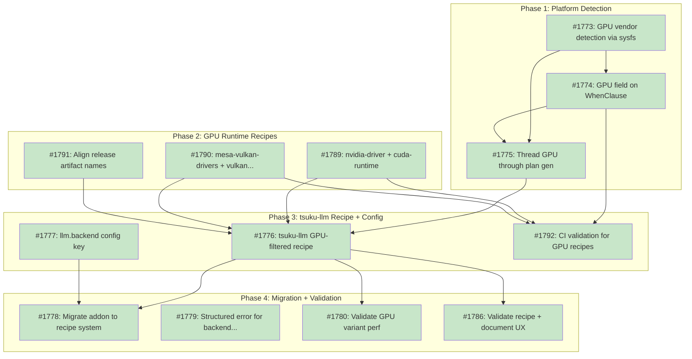

# Design Document: GPU Backend Selection

## Status

Planned

**Source Issue**: [#1769 - feat(llm): GPU backend selection and multi-variant addon distribution](https://github.com/tsukumogami/tsuku/issues/1769)

## Implementation Issues

### Milestone: [gpu-backend-selection](https://github.com/tsukumogami/tsuku/milestone/90)

| Issue | Dependencies | Tier |
|-------|--------------|------|
| ~~[#1773: feat(platform): add GPU vendor detection via PCI sysfs](https://github.com/tsukumogami/tsuku/issues/1773)~~ | ~~None~~ | ~~testable~~ |
| ~~_Adds `DetectGPU()` to the platform package using PCI sysfs on Linux, returning vendor strings (nvidia, amd, intel, apple, none). Updates `platform.Target` and `recipe.MatchTarget` with a `gpu` field and `GPU()` method on the `Matchable` interface. Handles the constructor cascade across ~76 callsites._~~ | | |
| ~~[#1774: feat(recipe): add gpu field to WhenClause](https://github.com/tsukumogami/tsuku/issues/1774)~~ | ~~[#1773](https://github.com/tsukumogami/tsuku/issues/1773)~~ | ~~testable~~ |
| ~~_With GPU exposed on `Matchable`, adds `GPU []string` to `WhenClause` following the libc pattern. Updates `Matches()`, `IsEmpty()`, `ToMap()`, `UnmarshalTOML()`, and `MergeWhenClause()` so recipes can write `when = { gpu = ["nvidia"] }`._~~ | | |
| ~~[#1775: refactor(executor): thread GPU through plan generation](https://github.com/tsukumogami/tsuku/issues/1775)~~ | ~~[#1773](https://github.com/tsukumogami/tsuku/issues/1773), [#1774](https://github.com/tsukumogami/tsuku/issues/1774)~~ | ~~testable~~ |
| ~~_Adds a `GPU` field to `PlanConfig` and wires auto-detection into `GeneratePlan()`, including dependency plan propagation via `depCfg`. After this, recipe steps with `gpu` conditions actually filter at plan time._~~ | | |
| ~~[#1789: feat(recipe): add nvidia-driver and cuda-runtime dependency recipes](https://github.com/tsukumogami/tsuku/issues/1789)~~ | ~~None~~ | ~~testable~~ |
| ~~_Creates `nvidia-driver.toml` (system PM actions per distro) and `cuda-runtime.toml` (download from NVIDIA redistributable tarballs). Establishes the CUDA dependency chain: cuda-runtime depends on nvidia-driver. First recipes to use `download_archive` for GPU compute runtimes._~~ | | |
| ~~[#1790: feat(recipe): add mesa-vulkan-drivers and vulkan-loader dependency recipes](https://github.com/tsukumogami/tsuku/issues/1790)~~ | ~~None~~ | ~~testable~~ |
| ~~_Creates `vulkan-loader.toml` and `mesa-vulkan-drivers.toml` using system PM actions. The Vulkan loader discovers ICD drivers at runtime, and Mesa provides the AMD/Intel ICD implementations. Completes the Vulkan dependency chain for non-NVIDIA GPUs._~~ | | |
| ~~[#1791: fix(ci): align tsuku-llm release artifacts with recipe asset patterns](https://github.com/tsukumogami/tsuku/issues/1791)~~ | ~~None~~ | ~~simple~~ |
| ~~_Updates the tsuku-llm release pipeline so artifact filenames include version and match the `asset_pattern` values in the recipe (e.g., `tsuku-llm-v{version}-linux-amd64-cuda`). Without this, the recipe can't find release assets._~~ | | |
| ~~[#1776: feat(recipe): add tsuku-llm recipe with GPU-filtered variant selection](https://github.com/tsukumogami/tsuku/issues/1776)~~ | ~~[#1775](https://github.com/tsukumogami/tsuku/issues/1775), [#1789](https://github.com/tsukumogami/tsuku/issues/1789), [#1790](https://github.com/tsukumogami/tsuku/issues/1790), [#1791](https://github.com/tsukumogami/tsuku/issues/1791)~~ | ~~testable~~ |
| ~~_Creates `recipes/t/tsuku-llm.toml` with GPU-filtered `when` clauses for variant selection. NVIDIA steps depend on cuda-runtime, AMD/Intel steps depend on vulkan-loader, CPU and Metal steps have no GPU dependencies. First real consumer of the `gpu` WhenClause field._~~ | | |
| ~~[#1777: feat(llm): add llm.backend config key](https://github.com/tsukumogami/tsuku/issues/1777)~~ | ~~None~~ | ~~simple~~ |
| ~~_Registers `llm.backend` in userconfig with `cpu` as the only valid override value. Adds `LLMBackend()` to the `LLMConfig` interface. Independent of GPU detection, can start in parallel._~~ | | |
| ~~[#1792: test(ci): add recipe validation for GPU when clauses and dependency chains](https://github.com/tsukumogami/tsuku/issues/1792)~~ | ~~[#1774](https://github.com/tsukumogami/tsuku/issues/1774), [#1789](https://github.com/tsukumogami/tsuku/issues/1789), [#1790](https://github.com/tsukumogami/tsuku/issues/1790)~~ | ~~testable~~ |
| ~~_Adds CI tests that validate GPU `when` clause matching logic, step-level dependency resolution for GPU recipes, and TOML syntax for all new recipe files. Runs as part of `go test` without requiring GPU hardware._~~ | | |
| ~~[#1778: refactor(llm): migrate addon from embedded manifest to recipe system](https://github.com/tsukumogami/tsuku/issues/1778)~~ | ~~[#1776](https://github.com/tsukumogami/tsuku/issues/1776), [#1777](https://github.com/tsukumogami/tsuku/issues/1777)~~ | ~~critical~~ |
| ~~_Removes the embedded manifest, download, platform key, and verification code from the addon package. Replaces `EnsureAddon()` with recipe-based installation via an injected `Installer` interface. Wires `llm.backend=cpu` override and cleans up legacy addon paths._~~ | | |
| ~~[#1779: feat(llm): add structured error for backend init failure](https://github.com/tsukumogami/tsuku/issues/1779)~~ | ~~None~~ | ~~simple~~ |
| ~~_Adds a clear stderr message in the Rust binary when the compiled-in GPU backend fails to initialize, suggesting `tsuku config set llm.backend cpu`. Informational only, no protocol changes. Independent work in the tsuku-llm repo._~~ | | |
| ~~[#1780: test(llm): validate GPU variant performance on shipped models](https://github.com/tsukumogami/tsuku/issues/1780)~~ | ~~[#1776](https://github.com/tsukumogami/tsuku/issues/1776)~~ | ~~testable~~ |
| ~~_Validates CUDA variant on NVIDIA hardware and Vulkan variant on AMD/Intel for 0.5B/1.5B/3B models, measuring tokens/second. Confirms GPU acceleration provides meaningful speedup over CPU. Must pass before this design is marked Current._~~ | | |
| ~~[#1786: test(recipe): validate tsuku-llm recipe against release pipeline and document user experience](https://github.com/tsukumogami/tsuku/issues/1786)~~ | ~~[#1776](https://github.com/tsukumogami/tsuku/issues/1776)~~ | ~~testable~~ |
| ~~_Validates every `asset_pattern` against actual release artifact names, configures `supported_os`/`supported_arch`/`supported_libc` metadata so unsupported platforms get clear errors, and documents the user-facing experience this milestone delivers vs. what's deferred._~~ | | |

### Dependency Graph



**Legend**: Green = done, Blue = ready, Yellow = blocked, Purple = needs-design, Orange = tracks-design

### What Ships

When this milestone is complete, users get:

- **Linux with NVIDIA GPU (glibc)**: `tsuku install tsuku-llm` detects the GPU, installs the CUDA variant, and provisions the CUDA runtime libraries as a managed dependency. The nvidia driver is verified (and installed if needed) via system package manager.
- **Linux with AMD/Intel GPU (glibc)**: `tsuku install tsuku-llm` detects the GPU and installs the Vulkan variant. The Vulkan loader is verified (and installed if needed) via system package manager.
- **Linux without GPU (glibc)**: `tsuku install tsuku-llm` installs the CPU variant automatically.
- **macOS (ARM64 or AMD64)**: `tsuku install tsuku-llm` installs the Metal variant (all Macs have Metal-capable GPUs).
- **Manual override**: `tsuku config set llm.backend cpu` forces the CPU variant regardless of detected GPU.
- **Unsupported platforms**: Users on unsupported platforms get a clear error message explaining what's supported and why. See the table below for details.
- **Runtime failures**: If the GPU backend fails at startup, the Rust binary prints a clear error to stderr suggesting the CPU override.
- **Ecosystem-wide GPU filtering**: Any recipe can use `when = { gpu = ["nvidia", "amd"] }` for GPU-aware step selection.
- **Reusable GPU runtime recipes**: `nvidia-driver`, `cuda-runtime`, and `vulkan-loader` are standard recipes available to any tool that needs GPU compute dependencies.

#### Platform support matrix

**Supported platforms:**
- macOS ARM64 -- Metal variant
- macOS AMD64 -- Metal variant
- Linux AMD64 (glibc) + NVIDIA -- CUDA variant
- Linux AMD64 (glibc) + AMD/Intel -- Vulkan variant
- Linux AMD64 (glibc) + no GPU -- CPU variant
- Linux ARM64 (glibc) + NVIDIA -- CUDA variant
- Linux ARM64 (glibc) + AMD/Intel -- Vulkan variant
- Linux ARM64 (glibc) + no GPU -- CPU variant

**Not supported:**
- Linux (musl/Alpine) -- all variants are built against glibc; llama.cpp and CUDA runtime libraries require glibc
- Windows -- the release pipeline does not produce Windows artifacts
- Other architectures (386, riscv64, etc.) -- the release pipeline only builds for amd64 and arm64

What's deferred to future work:

- **Vulkan variant for NVIDIA**: NVIDIA hardware gets CUDA by default. Users who want Vulkan on NVIDIA would need a future variant selection mechanism.
- **Windows support**: No Windows artifacts are produced by the release pipeline. Adding Windows would require cross-compilation or Windows CI runners.
- **Automatic runtime fallback**: If the GPU backend fails, users must manually set `llm.backend cpu`. Automatic detection and reinstallation is deferred.
- **musl/Alpine Linux**: All variants link against glibc. Building musl-compatible binaries would require static linking or musl cross-compilation, plus musl-compatible CUDA runtime libraries (which NVIDIA doesn't provide).
- **Multiple CUDA versions**: Only the CUDA version matching the CI build is shipped. Older driver compatibility isn't addressed.
- **Selective CUDA components**: The cuda-runtime recipe installs the minimal runtime. Recipes needing cuBLAS, cuFFT, or cuDNN would need additional component recipes.

## Upstream Design Reference

This design implements part of [DESIGN-local-llm-runtime.md](current/DESIGN-local-llm-runtime.md) from the Production Ready milestone.

**Relevant sections:**
- Acknowledged as open question: "Haven't fully validated the CI infrastructure for this"
- Build pipeline (issue #1633) produces 10 platform variants but manifest maps only 5 platforms

## Context and Problem Statement

The tsuku-llm addon delivers local LLM inference by bundling llama.cpp in a Rust binary. The CI release pipeline already builds 10 variants across platforms and GPU backends:

| Platform | Variants |
|----------|----------|
| darwin-arm64 | metal |
| darwin-amd64 | metal |
| linux-amd64 | cuda, vulkan, cpu |
| linux-arm64 | cuda, vulkan, cpu |
| windows-amd64 | cpu |

But the addon download system has a 1:1 mapping from `GOOS-GOARCH` to a single binary URL. The manifest schema, embedded in the Go binary via `//go:embed`, has no backend dimension. `PlatformKey()` returns `runtime.GOOS + "-" + runtime.GOARCH` and that's the only key used to look up download info.

This creates concrete problems:

**Wrong binary for the hardware.** On Linux, there's no way to specify whether to download the CUDA, Vulkan, or CPU variant. A user with an NVIDIA GPU gets the same binary as a user with no GPU at all.

**Detection happens too late.** Hardware detection (`hardware.rs`) runs inside the Rust binary at server startup. By that point, the binary is already downloaded. If it was compiled with CUDA but the system only has Vulkan, the detection code correctly identifies Vulkan but the binary can't use it.

**CUDA version coupling.** The CI builds against CUDA 12.4. Users need a compatible NVIDIA driver (>= 525.60). If the driver is older, CUDA initialization fails silently. We hit this on our own development machine: `ggml_cuda_init: failed to initialize CUDA: forward compatibility was attempted on non supported HW`.

**No GPU awareness at the platform level.** Beyond the addon, tsuku has no concept of GPU hardware. The platform detection system (`platform.Target`) knows OS, architecture, Linux distribution family, and libc implementation. But it doesn't know whether the machine has an NVIDIA, AMD, or Intel GPU. This means no recipe can conditionally select download URLs or dependencies based on GPU hardware. The addon works around this with its own embedded manifest, but that's a one-off mechanism that doesn't help other tools or the broader recipe ecosystem.

### Scope

**In scope:**
- GPU vendor detection in the `platform` package (Linux sysfs, macOS system profiler)
- `gpu` field added to `Matchable` interface and `WhenClause`
- tsuku-llm converted from addon-with-embedded-manifest to standard recipe
- GPU compute runtimes as standard recipes: `cuda-runtime` (download from NVIDIA redist), `nvidia-driver` (system PM actions), `vulkan-loader` (system PM actions)
- NVIDIA hardware gets the CUDA variant by default (better native performance)
- AMD/Intel hardware gets the Vulkan variant
- Cleanup of addon manifest/download code (replaced by recipe system)
- Addon lifecycle code retained for daemon management

**Out of scope:**
- Automatic runtime fallback when GPU backend fails (deferred until detection accuracy is measured; manual override via `llm.backend` config is the escape hatch)
- Vulkan VRAM detection fix (standalone Rust bug, separate issue)
- Windows GPU support (only CPU variant exists today)
- Shipping multiple CUDA versions (e.g., CUDA 11 + CUDA 12; only the version matching the CI build is shipped)
- Dynamic backend loading within a single binary (llama.cpp's `GGML_BACKEND_DL` mode)
- General recipe "variant selection" mechanism (tsuku-llm handles override via LLM-specific config)
- Vulkan variant for NVIDIA hardware (CUDA is preferred; users who want Vulkan on NVIDIA would need a future variant selection mechanism)

## Decision Drivers

- **Consistency**: tsuku already has a pattern for platform-specific filtering. Libc detection in the `platform` package feeds `WhenClause.Libc`, and recipes like `gcc-libs.toml` and `openssl.toml` use `when = { libc = ["glibc"] }` to pick the right binary. GPU detection should follow the same pattern rather than inventing a parallel mechanism in the addon package.
- **Ecosystem value**: Other tools need GPU awareness too. Machine learning frameworks, GPU compute libraries, and graphics tools all have platform-specific binaries. Making GPU a first-class platform dimension lets any recipe filter on it, not just tsuku-llm.
- **Supply chain security**: Manifest is currently embedded at compile time. Moving to the recipe system changes the security model. Each approach has trade-offs that need explicit analysis.
- **Self-contained philosophy**: Users shouldn't need to know their GPU vendor or install SDKs manually. Detection should be automatic.
- **Existing CI pipeline**: 10 variants are already built. The solution should use what exists.
- **Download size**: Binaries are 50-200MB each. Bundling all variants would mean 500MB+ downloads.

## Considered Options

### Decision 1: Where GPU Awareness Lives

GPU variant selection needs to happen somewhere. The question is whether it lives in the addon package (tool-specific) or the platform package (system-wide).

The addon currently has its own manifest, its own platform key format (`linux-amd64` vs the recipe system's `linux/amd64`), its own download and verification code, and zero overlap with the recipe system. Adding GPU detection to the addon would mean writing detection code that only benefits tsuku-llm. Adding it to the platform package makes it available to every recipe.

#### Chosen: Extend the platform package

Add GPU vendor detection alongside the existing OS, architecture, Linux family, and libc detection. The `platform.Target` struct gains a `gpu` field. `DetectTarget()` gains a GPU detection step. The `Matchable` interface gains a `GPU() string` method.

This follows the exact pattern established by libc detection:
- `DetectLibc()` reads an ELF binary to determine glibc vs musl
- `DetectGPU()` reads PCI sysfs to determine GPU vendor
- Both return a string that flows through `Matchable` into `WhenClause.Matches()`

The detection runs once per command invocation (same as libc), at `DetectTarget()` time. The result flows into plan generation, where `WhenClause` matching uses it to filter recipe steps.

#### Alternatives Considered

**Tool-specific detection in the addon package**: Keep detection in `internal/llm/addon/` with its own manifest schema and download code.
Rejected because it creates a parallel platform detection path that only benefits one tool. The addon already duplicates platform logic (`PlatformKey()` vs `platform.Target`). Adding GPU detection there deepens the divergence. Any future tool that needs GPU filtering would face the same problem.

**No detection (manual config only)**: Require users to set `llm.backend` explicitly.
Rejected as the sole mechanism because it violates tsuku's self-contained philosophy. Included as an override for edge cases.

### Decision 2: How to Detect GPU Hardware

The platform package needs to identify what GPU hardware is present. The detection should return the most basic, immutable fact about the system: what GPU vendor's hardware is installed. Not which drivers are loaded, not which APIs are available, just the hardware.

This matters because drivers can be installed or removed, but the physical GPU doesn't change. Detecting at the hardware level means the result is stable across driver installations and upgrades.

#### Chosen: PCI vendor identification via sysfs (Linux) and system profiler (macOS)

On Linux, read PCI device information from sysfs:
1. Scan `/sys/bus/pci/devices/*/class` for display controller class codes (`0x0300xx` for VGA, `0x0302xx` for 3D controller)
2. For each GPU-class device, read `/sys/bus/pci/devices/*/vendor` for the PCI vendor ID
3. Map vendor IDs: `0x10de` = NVIDIA, `0x1002` = AMD, `0x8086` = Intel

When multiple GPUs are present (common: Intel iGPU + NVIDIA dGPU), prefer discrete GPUs over integrated. Priority: NVIDIA > AMD > Intel. The result is a single vendor string.

On macOS, Apple Silicon always has an Apple GPU. Intel Macs may have AMD discrete GPUs or Intel integrated. Detection uses `system_profiler SPDisplaysDataType` or the IOKit framework.

On Windows, return `"none"` for now (only CPU variant exists).

This approach uses only stdlib filesystem reads. No drivers, no shared libraries, no subprocess spawning. The sysfs files are world-readable and available even before any GPU driver is installed.

**Values returned by `GPU()`**: `nvidia`, `amd`, `intel`, `apple`, `none`

#### Alternatives Considered

**Library file probing** (`os.Stat` on `/usr/lib/libcuda.so`): Check for GPU runtime libraries at known filesystem paths.
Rejected because it detects software, not hardware. A system with an NVIDIA GPU but no CUDA toolkit would probe as "no GPU." Path lists are distro-specific (Debian puts libraries in `/usr/lib/x86_64-linux-gnu/`, Fedora in `/usr/lib64/`, Arch in `/usr/lib/`). And library presence doesn't mean the library works; CUDA might be installed but the driver version incompatible.

**Shell out to `nvidia-smi` / `lspci`**: Run GPU query tools and parse output.
Rejected because these tools may not be installed. `nvidia-smi` ships with NVIDIA drivers (not present before driver install), and `lspci` requires the `pciutils` package. Subprocess spawning adds latency and error handling complexity. The sysfs approach gives the same information without external tools.

### Decision 3: How Tools Use GPU Information

With GPU detection in the platform package, the question is how recipes consume it. The existing pattern for platform-specific filtering is `WhenClause` matching: recipe steps declare conditions, the plan generator filters steps that don't match the current target.

The addon currently has its own manifest schema, its own download code, and no connection to the recipe system. There are two paths: extend the addon's custom system, or migrate to the recipe system.

#### Chosen: Extend WhenClause with `gpu` field; convert tsuku-llm to a recipe

Add a `gpu` field to `WhenClause` following the same pattern as `libc`:

```go
type WhenClause struct {
    Platform       []string `toml:"platform,omitempty"`
    OS             []string `toml:"os,omitempty"`
    Arch           string   `toml:"arch,omitempty"`
    LinuxFamily    string   `toml:"linux_family,omitempty"`
    PackageManager string   `toml:"package_manager,omitempty"`
    Libc           []string `toml:"libc,omitempty"`
    GPU            []string `toml:"gpu,omitempty"`            // NEW
}
```

Matching semantics: if `GPU` is non-empty and the target's `GPU()` returns a non-empty string, the target's GPU value must be in the list. Same AND semantics as other fields.

Then convert tsuku-llm from an addon with an embedded manifest into a standard recipe. The recipe uses `when` clauses with the `gpu` field for variant selection:

```toml
[metadata]
name = "tsuku-llm"
description = "Local LLM inference engine"

[version]
source = "github_releases"
github_repo = "tsukumogami/tsuku-llm"

# macOS: Metal variant (all Mac GPUs)
[[steps]]
action = "github_file"
when = { os = ["darwin"], arch = "arm64" }
repo = "tsukumogami/tsuku-llm"
asset_pattern = "tsuku-llm-v{version}-darwin-arm64"

[[steps]]
action = "github_file"
when = { os = ["darwin"], arch = "amd64" }
repo = "tsukumogami/tsuku-llm"
asset_pattern = "tsuku-llm-v{version}-darwin-amd64"

# Linux AMD64: CUDA for NVIDIA (native performance, tsuku provisions runtime)
[[steps]]
action = "github_file"
when = { os = ["linux"], arch = "amd64", gpu = ["nvidia"] }
dependencies = ["cuda-runtime"]
repo = "tsukumogami/tsuku-llm"
asset_pattern = "tsuku-llm-v{version}-linux-amd64-cuda"

# Linux AMD64: Vulkan for AMD/Intel
[[steps]]
action = "github_file"
when = { os = ["linux"], arch = "amd64", gpu = ["amd", "intel"] }
dependencies = ["vulkan-loader"]
repo = "tsukumogami/tsuku-llm"
asset_pattern = "tsuku-llm-v{version}-linux-amd64-vulkan"

# Linux AMD64: CPU for systems without a GPU
[[steps]]
action = "github_file"
when = { os = ["linux"], arch = "amd64", gpu = ["none"] }
repo = "tsukumogami/tsuku-llm"
asset_pattern = "tsuku-llm-v{version}-linux-amd64-cpu"

# Linux ARM64: same pattern
[[steps]]
action = "github_file"
when = { os = ["linux"], arch = "arm64", gpu = ["nvidia"] }
dependencies = ["cuda-runtime"]
repo = "tsukumogami/tsuku-llm"
asset_pattern = "tsuku-llm-v{version}-linux-arm64-cuda"

[[steps]]
action = "github_file"
when = { os = ["linux"], arch = "arm64", gpu = ["amd", "intel"] }
dependencies = ["vulkan-loader"]
repo = "tsukumogami/tsuku-llm"
asset_pattern = "tsuku-llm-v{version}-linux-arm64-vulkan"

[[steps]]
action = "github_file"
when = { os = ["linux"], arch = "arm64", gpu = ["none"] }
repo = "tsukumogami/tsuku-llm"
asset_pattern = "tsuku-llm-v{version}-linux-arm64-cpu"

# Windows: CPU only
[[steps]]
action = "github_file"
when = { os = ["windows"], arch = "amd64" }
repo = "tsukumogami/tsuku-llm"
asset_pattern = "tsuku-llm-v{version}-windows-amd64-cpu.exe"

[verify]
command = "tsuku-llm --version"
pattern = "{version}"
```

The `gpu` conditions are mutually exclusive because `GPU()` returns exactly one value. On a system with an NVIDIA GPU, `GPU()` returns `"nvidia"`, which matches the CUDA step. On a system with an AMD GPU, `GPU()` returns `"amd"`, which matches the Vulkan step. On a system with no GPU, `GPU()` returns `"none"`, which matches the CPU step. No step matches more than one hardware configuration.

The recipe maps each GPU vendor to the best backend for that hardware. NVIDIA hardware gets the CUDA variant because CUDA is NVIDIA's native compute API and provides the best performance on NVIDIA GPUs. AMD and Intel hardware get the Vulkan variant because Vulkan is the cross-vendor GPU compute API that works across both. Users who want CPU-only regardless of hardware can override via `llm.backend = cpu` config.

Step-level dependencies pull in the right GPU runtime for each variant. The CUDA step depends on `cuda-runtime` (which tsuku downloads from NVIDIA's redistributable tarballs). The Vulkan steps depend on `vulkan-loader` (which tsuku verifies via system package manager actions). On no-GPU systems, no GPU runtime dependency is installed. This uses existing recipe dependency filtering (steps that don't match the target have their dependencies skipped).

The addon lifecycle code (server start/stop, gRPC socket, health checks, idle timeout) stays in `internal/llm/`. It doesn't move to the recipe system because daemon management has no recipe equivalent. What changes is how it finds the binary: instead of downloading via embedded manifest, it looks for the recipe-installed binary at the standard `$TSUKU_HOME/tools/tsuku-llm-<version>/` path.

#### Alternatives Considered

**Expand the addon's custom manifest schema**: Keep the embedded `manifest.json` and add a nested variant map with backend dimensions.
Rejected because it deepens the divergence between the addon and recipe systems. The addon already duplicates platform detection, download logic, and verification code. Adding a custom schema for GPU variants means maintaining two parallel distribution paths. Converting to a recipe eliminates this duplication and gives tsuku-llm the same install experience as every other tool.

**Add when-clause-style filtering to the addon manifest but keep it separate**: The manifest gains `when`-like conditions without fully becoming a recipe.
Rejected for the same reason as above, just more incrementally. If we're going to add conditional filtering, we should use the system that already has it rather than reimplementing it.

### Decision 4: Runtime Failure Handling

Even with good pre-download detection, things can go wrong. A Vulkan library might exist on disk but the GPU might not support the required Vulkan version. CUDA libraries might be present but the driver version incompatible.

#### Chosen: Informative error + manual override (automatic fallback deferred)

When the Rust binary can't initialize its compiled-in GPU backend, it logs a clear error message to stderr explaining what failed and suggesting the config override: `tsuku config set llm.backend cpu`. The Go side surfaces this message to the user.

This is deliberately simple. Automatic fallback (detecting the failure, reinstalling the CPU variant, and relaunching) adds `BackendFailedError` types, Rust exit code changes, process exit monitoring in `waitForReady()`, and retry logic in `Complete()`. That's significant complexity for a case that should be uncommon once hardware detection works. Ship detection + manual override first, measure how often detection picks wrong in practice, then add automatic fallback if needed.

#### Alternatives Considered

**Automatic CPU fallback**: Detect backend failure via exit code 78, auto-install and launch CPU variant.
Deferred (not rejected). This is the right long-term answer but adds complexity that isn't justified until we know how accurate sysfs detection is. Tracked as a future enhancement.

**Pre-download CPU alongside GPU**: Always download both the GPU variant and CPU variant.
Rejected because it doubles download size for every Linux user to cover an uncommon failure case.

### Decision 5: How GPU Compute Runtimes Are Provisioned

GPU hardware detection tells us what GPU is present, but running a GPU-accelerated binary also requires compute runtime libraries (CUDA for NVIDIA, Vulkan loader for cross-vendor). The question is how tsuku handles these: are they system dependencies the user must install manually, or can tsuku manage them?

The distinction matters because of a precedent: tsuku treats glibc/musl as system identity (detect and adapt, never install). GPU compute runtimes could follow that same pattern, or they could follow the pattern of dependencies like openssl and zlib that tsuku actively manages.

#### Chosen: GPU runtimes are standard recipes; action types match distribution method

GPU compute runtimes follow the existing convention: **everything is a recipe, and the action type determines the installation mechanism.** This is the same pattern used by the docker recipe (brew_cask on macOS, apt_install on Debian, dnf_install on Fedora) and library recipes like openssl (homebrew bottles on glibc, apk on musl).

Unlike glibc/musl (which are the system's identity and can't be swapped), GPU runtimes are installable software. CUDA is more like zlib than like glibc — it's a dependency tsuku can provision. NVIDIA provides standalone redistributable tarballs at `developer.download.nvidia.com/compute/cuda/redist/` with per-component downloads, JSON manifests, and SHA256 checksums. This is the same distribution model that conda uses to install CUDA in user space, proven at scale.

The dependency chain for each GPU variant:

```
tsuku-llm (cuda step, nvidia hardware)
  └── cuda-runtime recipe (download_archive from NVIDIA redist → $TSUKU_HOME)
        └── nvidia-driver recipe (apt_install / dnf_install / pacman_install)

tsuku-llm (vulkan step, amd/intel hardware)
  └── vulkan-loader recipe (apt_install / dnf_install / pacman_install)

tsuku-llm (cpu step, no GPU)
  └── (no GPU dependencies)
```

Each component uses the action type that matches how it's distributed:

| Component | Action type | Why |
|-----------|------------|-----|
| CUDA runtime libs | `download_archive` | NVIDIA provides redistributable tarballs, installable to `$TSUKU_HOME` without root |
| NVIDIA GPU driver | `apt_install` / `dnf_install` / etc. | Kernel-coupled, requires root, distributed via system package managers |
| Vulkan loader | `apt_install` / `dnf_install` / etc. | Already installed on most GPU-equipped Linux systems, distributed via system PMs |

The key boundary: `libcuda.so` (the driver-level CUDA interface) is kernel-coupled and must come from the system's nvidia-driver package. Everything above it in the CUDA stack — `libcudart`, `libcublas`, etc. — can live in user space.

#### Alternatives Considered

**System dependency only (verify, don't install)**: Treat CUDA like the current cuda.toml recipe: `require_command` + manual instructions.
Rejected because NVIDIA explicitly provides redistributable tarballs for this use case. Telling users to "go install CUDA yourself" when tsuku can download the exact components needed is a poor UX that violates tsuku's self-contained philosophy.

**Detect installed runtimes instead of hardware**: Probe for `libcuda.so`, `libvulkan.so` on the filesystem and select the binary that matches available runtimes.
Rejected because it detects software state, not hardware fact. A system with an NVIDIA GPU but no CUDA installed yet would probe as "no CUDA" and get the wrong binary. Since tsuku can install CUDA as a dependency, the right approach is: detect hardware, pick the best backend for that hardware, and provision the runtime.

## Decision Outcome

### Summary

The platform detection system gains GPU vendor identification as a new dimension alongside OS, architecture, Linux family, and libc. On Linux, detection reads PCI device class and vendor files from sysfs, returning one of `nvidia`, `amd`, `intel`, or `none`. On macOS, detection returns `apple`. The `Matchable` interface gains `GPU() string`, `platform.Target` gains a `gpu` field populated during `DetectTarget()`, and `WhenClause` gains a `gpu []string` filter.

tsuku-llm becomes a standard recipe with `when` clauses that filter on the `gpu` field. NVIDIA hardware gets the CUDA variant (best native performance), AMD/Intel get Vulkan, no-GPU systems get CPU, and macOS gets Metal. GPU compute runtimes are provisioned as standard recipes: `cuda-runtime` downloads NVIDIA's redistributable tarballs to `$TSUKU_HOME`, `nvidia-driver` and `vulkan-loader` use system package manager actions. This follows the existing convention that everything is a recipe — the action type determines the installation mechanism.

The addon lifecycle code stays in `internal/llm/`. It still manages the gRPC server, socket, health checks, and idle timeout. But binary installation moves from the embedded manifest to the recipe system. `EnsureAddon()` checks whether `tsuku-llm` is installed via the recipe system, triggers installation if needed, and finds the binary at the standard tools path.

Users who want to force the CPU variant set `llm.backend = cpu` in `$TSUKU_HOME/config.toml`. The LLM lifecycle code handles this override by setting the target's GPU to `"none"` before plan generation, which selects the CPU recipe step.

When a GPU variant fails at runtime, the Rust binary logs a clear error to stderr suggesting `tsuku config set llm.backend cpu` as a workaround. Automatic fallback is deferred.

### Rationale

These decisions form a coherent stack. At the bottom, platform-level GPU detection identifies hardware — an immutable fact about the system, like OS or architecture. In the middle, `WhenClause` filtering lets recipes map hardware to the right binary variant, using the same mechanism that handles libc, Linux family, and architecture filtering. At the top, GPU compute runtimes are managed as standard recipes with action types matching how each component is distributed.

The separation between hardware detection (platform layer) and runtime provisioning (recipe layer) is important. tsuku detects that the system has NVIDIA hardware. The tsuku-llm recipe decides that NVIDIA hardware should get the CUDA variant. The cuda-runtime recipe provisions the CUDA libraries. The nvidia-driver recipe ensures the kernel driver is present. Each layer does one thing.

CUDA is the right default for NVIDIA because it's NVIDIA's native compute API. Unlike the Vulkan path (which requires a cross-vendor loader and ICD driver layer), CUDA talks directly to the NVIDIA driver. Since tsuku can install the CUDA runtime libraries in user space (NVIDIA provides redistributable tarballs for exactly this purpose), there's no reason to add a Vulkan indirection layer on hardware that has a better native option. AMD and Intel get Vulkan because Vulkan is their cross-vendor compute API.

Converting tsuku-llm to a recipe eliminates the only non-recipe binary distribution path in tsuku. The addon package loses its embedded manifest, download code, platform key translation, and verification code. What remains is the daemon lifecycle, which is genuinely unique to tsuku-llm (no other recipe manages a long-running server).

## Solution Architecture

### Platform Detection

New file `internal/platform/gpu.go`:

```go
// DetectGPU returns the primary GPU vendor for the current system.
// Returns one of: "nvidia", "amd", "intel", "apple", "none".
//
// On Linux, scans PCI devices via sysfs for display controllers.
// When multiple GPUs are present, prefers discrete over integrated
// (nvidia > amd > intel).
//
// On macOS, returns "apple" unconditionally (Apple GPU or Metal-capable Intel/AMD).
// On Windows, returns "none" (no GPU variants built yet).
func DetectGPU() string
```

With platform-specific implementations:

**`gpu_linux.go`**: Reads `/sys/bus/pci/devices/*/class` for GPU device classes (`0x0300xx` VGA, `0x0302xx` 3D controller). For each GPU device, reads `vendor` file and maps PCI vendor IDs: `0x10de` → `nvidia`, `0x1002` → `amd`, `0x8086` → `intel`. When multiple vendors are present, returns the highest-priority discrete GPU. Uses only `os.ReadFile` and `filepath.Glob`.

**`gpu_darwin.go`**: Returns `"apple"` unconditionally. Apple Silicon has Apple GPU; Intel Macs have Metal-capable GPUs. No variant selection needed on macOS.

**`gpu_windows.go`**: Returns `"none"`. Only CPU variant exists for Windows.

`DetectTarget()` in `family.go` gains a GPU detection step:

```go
func DetectTarget() (Target, error) {
    platform := runtime.GOOS + "/" + runtime.GOARCH
    gpu := DetectGPU()
    if runtime.GOOS != "linux" {
        return NewTarget(platform, "", "", gpu), nil
    }
    family, err := DetectFamily()
    if err != nil {
        return Target{}, err
    }
    libc := DetectLibc()
    return NewTarget(platform, family, libc, gpu), nil
}
```

### Matchable Interface and WhenClause Extension

`recipe/types.go` changes:

```go
type Matchable interface {
    OS() string
    Arch() string
    LinuxFamily() string
    Libc() string
    GPU() string  // NEW: "nvidia", "amd", "intel", "apple", "none"
}
```

Both implementations update:
- `platform.Target` gains a `gpu` field and `GPU() string` method
- `recipe.MatchTarget` gains a `gpu` field, updated constructor, and `GPU() string` method

`WhenClause.Matches()` gains a GPU check following the same pattern as libc:

```go
// In WhenClause.Matches():
if len(w.GPU) > 0 {
    gpu := target.GPU()
    gpuMatch := false
    for _, g := range w.GPU {
        if g == gpu {
            gpuMatch = true
            break
        }
    }
    if !gpuMatch {
        return false
    }
}
```

### Addon Lifecycle Refactor

The `internal/llm/addon/` package loses:
- `manifest.go` and `manifest.json` (embedded manifest, Go types, parsing)
- `platform.go` (`PlatformKey()`, `GetCurrentPlatformInfo()`)
- `download.go` (download, verify, atomic rename logic)
- `verify.go` (SHA256 verification, `VerifyBeforeExecution()`)

The addon package retains:
- `manager.go` (refactored: `EnsureAddon()` delegates to recipe system)
- `lifecycle.go` (server start/stop, socket, health checks, idle timeout)

`EnsureAddon()` changes from "download binary via embedded manifest" to:

```go
func (m *AddonManager) EnsureAddon(ctx context.Context) (string, error) {
    // Check if tsuku-llm is already installed
    binaryPath := m.findInstalledBinary()
    if binaryPath != "" {
        return binaryPath, nil
    }

    // Install via recipe system
    if err := m.installViaRecipe(ctx); err != nil {
        return "", fmt.Errorf("installing tsuku-llm: %w", err)
    }

    return m.findInstalledBinary()
}
```

`findInstalledBinary()` looks for the tsuku-llm binary at the standard recipe installation path. This could check `state.json` for the installed version, or look for the binary in `$TSUKU_HOME/tools/tsuku-llm-<version>/`.

`installViaRecipe()` loads the tsuku-llm recipe, generates a plan for the current target (applying `llm.backend` override if set), and executes it. This reuses the existing executor pipeline.

The `llm.backend` override works by modifying the target's GPU value before plan generation:

| Config value | Target GPU override | Effect |
|---|---|---|
| (unset) | (no override, use detected value) | Auto-selects CUDA/Vulkan/CPU based on hardware |
| `cpu` | `none` | Forces CPU step regardless of GPU hardware |

Only the `cpu` override is needed initially. Each GPU vendor maps to exactly one backend (NVIDIA → CUDA, AMD/Intel → Vulkan), so there's no ambiguity to resolve. A future variant selection mechanism could allow forcing Vulkan on NVIDIA hardware, but that's out of scope.

**Edge case**: If a user sets `llm.backend = cpu` on a system that already has a GPU variant installed, the LLM code should reinstall with the CPU variant.

### GPU Runtime Dependency Recipes

GPU compute runtimes are standard recipes. The action type in each step determines the installation mechanism, following the same convention used by docker.toml (brew_cask on macOS, apt_install on Debian, dnf_install on Fedora) and library recipes like openssl.

**`recipes/n/nvidia-driver.toml`** (sketch):
```toml
[metadata]
name = "nvidia-driver"
description = "NVIDIA GPU kernel driver"
supported_os = ["linux"]

# Debian/Ubuntu
[[steps]]
action = "apt_install"
packages = ["nvidia-driver"]

# Fedora/RHEL
[[steps]]
action = "dnf_install"
packages = ["akmod-nvidia"]

# Arch Linux
[[steps]]
action = "pacman_install"
packages = ["nvidia"]

# openSUSE
[[steps]]
action = "zypper_install"
packages = ["nvidia-driver-G06-kmp-default"]

# Verify driver is functional
[[steps]]
action = "require_command"
command = "nvidia-smi"

[verify]
command = "nvidia-smi --query-gpu=driver_version --format=csv,noheader"
pattern = "{version}"
```

**`recipes/c/cuda-runtime.toml`** (sketch):
```toml
[metadata]
name = "cuda-runtime"
description = "NVIDIA CUDA runtime libraries"
type = "library"
supported_os = ["linux"]
dependencies = ["nvidia-driver"]

# Download CUDA runtime from NVIDIA redistributable tarballs
# The NVIDIA redist index provides per-component .tar.xz archives
# with JSON manifests and SHA256 checksums
[[steps]]
action = "download_archive"
url = "https://developer.download.nvidia.com/compute/cuda/redist/cuda_cudart/linux-x86_64/cuda_cudart-linux-x86_64-{version}-archive.tar.xz"
when = { os = ["linux"], arch = "amd64" }
archive_format = "tar.xz"
strip_dirs = 1

[[steps]]
action = "download_archive"
url = "https://developer.download.nvidia.com/compute/cuda/redist/cuda_cudart/linux-aarch64/cuda_cudart-linux-aarch64-{version}-archive.tar.xz"
when = { os = ["linux"], arch = "arm64" }
archive_format = "tar.xz"
strip_dirs = 1

[[steps]]
action = "install_binaries"
install_mode = "directory"
outputs = ["lib/libcudart.so"]
```

The `cuda-runtime` recipe depends on `nvidia-driver`. When tsuku resolves this dependency chain, the nvidia-driver recipe's system PM steps verify (and can install) the kernel driver, then the cuda-runtime recipe downloads the user-space CUDA libraries from NVIDIA's redistributable archive to `$TSUKU_HOME`. The `libcuda.so` driver interface is provided by the nvidia-driver package — it's kernel-coupled and must come from the system's package manager.

**`recipes/v/vulkan-loader.toml`** (sketch):
```toml
[metadata]
name = "vulkan-loader"
description = "Vulkan ICD loader library"
type = "library"
supported_os = ["linux"]

# Debian/Ubuntu
[[steps]]
action = "apt_install"
packages = ["libvulkan1"]

# Fedora/RHEL
[[steps]]
action = "dnf_install"
packages = ["vulkan-loader"]

# Arch Linux
[[steps]]
action = "pacman_install"
packages = ["vulkan-icd-loader"]

# Alpine
[[steps]]
action = "apk_install"
packages = ["vulkan-loader"]

# openSUSE
[[steps]]
action = "zypper_install"
packages = ["libvulkan1"]

[verify]
command = "ldconfig -p"
mode = "output"
pattern = "libvulkan"
```

The vulkan-loader recipe uses system PM actions because the Vulkan loader is distributed via system package managers on every major Linux distribution. Most systems with a GPU already have it installed. The recipe ensures it's present and provides the right installation command per distro if it's missing.

The tsuku-llm recipe's CUDA steps declare `dependencies = ["cuda-runtime"]` (which transitively pulls in nvidia-driver). The Vulkan steps declare `dependencies = ["vulkan-loader"]`. The CPU steps have no GPU dependencies. Step-level dependencies mean only the dependencies for the matching step are resolved.

### Rust-side Error Reporting

When the Rust binary detects that its compiled-in backend doesn't match available hardware, it logs a structured error to stderr:

```
ERROR: Backend "vulkan" failed to initialize.
  Detected hardware supports: None
  Suggestion: tsuku config set llm.backend cpu
```

This is an informational message, not a protocol change. The Go side doesn't parse it. Automatic fallback (exit code 78, reinstall, relaunch) is deferred to a follow-up design.

### Legacy Cleanup

The deprecated `AddonPath()` at `manager.go:232` and its caller in `lifecycle.go` build paths for the old directory layout. These are removed as part of the addon refactor. `NewServerLifecycleWithManager()` accepts the binary path from the recipe-installed location instead of computing it from the addon manifest.

The embedded `manifest.json` and all its supporting code are removed. The platform key translation (`linux-amd64` vs `linux/amd64`) is no longer needed because the recipe system uses the standard `platform.Target` format.

## Implementation Approach

### Phase 1: GPU Platform Detection + WhenClause Extension

This phase can ship independently. It adds a new platform dimension and recipe filtering capability without changing the addon system.

1. Add `gpu.go` with `DetectGPU()` function signature
2. Add `gpu_linux.go` with PCI sysfs scanning (accept test root parameter for mock sysfs)
3. Add `gpu_darwin.go` (returns `"apple"`)
4. Add `gpu_windows.go` (returns `"none"`)
5. Add `gpu` field to `platform.Target`, update `NewTarget()` and `DetectTarget()`
6. Add `GPU() string` to `Matchable` interface
7. Update `recipe.MatchTarget` with `gpu` field and `NewMatchTarget()` constructor

**Constructor cascade**: `NewTarget()` gains a `gpu` parameter. Production callsites that must update:
- `executor/plan_generator.go:111` and `:668` (plan generation)
- `cmd/tsuku/install_sandbox.go:94`, `verify.go:573`, `verify_deps.go:74` (commands)
- `internal/builders/orchestrator.go:260` (pipeline validation)
- `cmd/tsuku/info.go:447`, `sysdeps.go:212` (info display)

`NewMatchTarget()` gains a `gpu` parameter. Update all callers in `executor/` and `cmd/tsuku/`.

To minimize churn across test files, consider adding a `TargetWithGPU(target Target, gpu string) Target` helper or a `SetGPU` setter so existing tests that don't care about GPU can pass `""` without changing constructor calls everywhere.

8. Add `GPU []string` to `WhenClause`, update `Matches()`, `IsEmpty()`, `ToMap()`, and TOML unmarshaling
9. Update `MergeWhenClause()` for GPU constraint checking
10. Update `PlanConfig` with `GPU` field, pass through to target construction in `GeneratePlan()`
11. Unit tests for GPU detection (mock sysfs directory structure)
12. Unit tests for WhenClause GPU matching

### Phase 2: GPU Runtime Dependency Recipes

Depends on Phase 1 being validated. Can be developed in parallel with the addon refactor.

1. Create `recipes/n/nvidia-driver.toml` (system PM actions per distro family)
2. Create `recipes/c/cuda-runtime.toml` (download from NVIDIA redist, depends on nvidia-driver)
3. Create `recipes/v/vulkan-loader.toml` (system PM actions per distro family)
4. Test dependency chains: cuda-runtime → nvidia-driver, vulkan-loader standalone
5. Test that missing system packages give clear error with installation commands

### Phase 3: tsuku-llm Recipe + Addon Refactor

Depends on Phases 1 and 2.

1. Create `recipes/t/tsuku-llm.toml` with GPU-filtered steps (CUDA for nvidia, Vulkan for amd/intel, CPU for none)
2. Add `llm.backend` config key to `userconfig` (Get/Set/AvailableKeys) — initially only `cpu` override
3. Add `LLMBackend() string` to `LLMConfig` interface in `factory.go`
4. Refactor `AddonManager`: remove manifest/download code, add recipe-based installation via injected `Installer` interface (not direct import of `internal/executor/`)
5. Update `EnsureAddon()` to check recipe installation state and trigger install if needed
6. Wire `llm.backend = cpu` override into plan generation (set target GPU to `"none"`)
7. Update `ServerLifecycle` to accept binary path from recipe installation
8. Remove embedded `manifest.json`, `platform.go`, `download.go`, `verify.go` from addon package
9. Integration test: verify correct variant selection on current host

### Phase 4: Testing and Validation

1. End-to-end test: `tsuku install tsuku-llm` on systems with different GPU vendors
2. Test `llm.backend` config override path
3. Test no-GPU fallback to CPU variant
4. Validate CUDA performance on NVIDIA hardware for shipped models
5. Validate Vulkan performance on AMD/Intel hardware

### Performance Validation

Run the CUDA variant on NVIDIA hardware for the models we ship (0.5B, 1.5B, 3B). Measure tokens/second and compare against the CPU variant to confirm GPU acceleration works as expected. This validation can be informal (run on a dev machine, confirm meaningful speedup) but must happen before this design is marked Current.

## Security Considerations

### Download verification

With the addon, SHA256 checksums are embedded in the Go binary at compile time via `//go:embed manifest.json`. This is tamper-proof: you can't change the checksums without rebuilding tsuku.

With the recipe approach, checksums live in the recipe file (`recipes/t/tsuku-llm.toml`). Recipe checksums are git-tracked and CI-validated, but they can be updated via `tsuku update-registry`. This is the same security model used by every other recipe in tsuku (all 200+ tools). If the registry is compromised, all tools are at risk, not just tsuku-llm.

The cuda-runtime recipe downloads from NVIDIA's redistributable archive (`developer.download.nvidia.com`). These tarballs have SHA256 checksums in NVIDIA's JSON manifests. The recipe should pin specific component versions and validate checksums, same as any other download action.

The pre-execution SHA256 verification (`VerifyBeforeExecution`) can be retained by reading the plan's stored checksum and re-verifying before each server launch. This catches binary tampering after installation.

The net security change: tsuku-llm moves from "checksums embedded in binary" (stronger, specific to this one tool) to "checksums in recipe" (standard model, consistent with everything else). This is a deliberate trade-off for consistency and maintainability.

### Execution isolation

No change to the runtime model. The tsuku-llm binary runs with the same permissions as the tsuku process.

GPU detection uses `os.ReadFile` on sysfs files (`/sys/bus/pci/devices/*/class`, `*/vendor`). These files are world-readable. No special permissions needed, no libraries loaded, no processes spawned.

### Supply chain risks

The release pipeline produces signed binaries with checksums. Adding more variants (from 5 to 10 entries in the recipe) doesn't change the signing infrastructure. Each variant's URL points to the same GitHub release page. The `github_file` action computes checksums dynamically during plan generation (standard recipe behavior), and the plan is cached.

New risk surfaces: The `nvidia-driver` and `vulkan-loader` recipes use system package manager actions (`apt_install`, `dnf_install`, etc.). These trust the system's package manager and its configured repositories — the same trust model used by the existing docker recipe and other system dependency recipes. The `cuda-runtime` recipe downloads from NVIDIA's CDN (`developer.download.nvidia.com`), which is a new download origin but one operated by the GPU vendor. The NVIDIA redist JSON manifests include SHA256 checksums for verification.

### User data exposure

No change. GPU detection reads only PCI device metadata from sysfs (vendor ID, device class). No network calls beyond the existing download flow. The `llm.backend` config value is stored in `$TSUKU_HOME/config.toml` alongside other settings.

## Consequences

### Positive

- GPU becomes a first-class platform dimension. Any recipe can use `when = { gpu = ["nvidia"] }` to filter steps, not just tsuku-llm.
- Users with GPUs automatically get GPU-accelerated inference without manual configuration.
- NVIDIA users get the CUDA variant (native performance) with the runtime libraries managed by tsuku. No manual CUDA installation needed.
- Download size stays small (one variant per user, plus runtime libraries as needed).
- tsuku-llm becomes a regular recipe, removing the only non-recipe binary distribution path in tsuku.
- The addon package shrinks significantly. Manifest parsing, download logic, platform key translation, and verification code are removed.
- GPU runtimes follow the existing "everything is a recipe" convention. nvidia-driver uses system PM actions (like docker), cuda-runtime uses download actions (like any tool), vulkan-loader uses system PM actions. No new patterns.
- The separation of hardware detection (platform layer) from runtime provisioning (recipe layer) means tsuku doesn't have opinions about backends — recipes make that choice.

### Negative

- The security model weakens slightly: embedded checksums (compile-time guarantee) are replaced by recipe checksums (git-tracked, CI-validated, but updatable). This is the standard model for all other tools. The plan cache is user-writable, so local tampering after installation is not caught unless pre-execution verification re-checks against a trusted source.
- The addon refactor is a significant change. `EnsureAddon()` changes from direct download to recipe system delegation. The addon package must use an injected installer interface rather than importing `internal/executor/` directly, to preserve dependency direction.
- PCI sysfs detection is Linux-specific. macOS returns a constant (`apple`), Windows returns `none`. If Windows GPU support is needed later, a new detection backend (DXGI or WMI) must be added.
- Existing tsuku-llm installations re-download on first run after upgrading, since the binary moves from the addon path to the recipe tools path.
- CUDA runtime libraries add download size for NVIDIA users. The minimal set (`cuda_cudart`) is ~1 MB, but if the tsuku-llm binary links against additional CUDA libraries, the dependency could grow.
- System PM actions for nvidia-driver and vulkan-loader may require sudo. tsuku's current system PM actions verify/install via the system package manager, which may prompt for elevated privileges. This matches the docker recipe precedent but is a step beyond tsuku's "no sudo" default.

### Risks

- PCI sysfs detection doesn't verify driver functionality. A system with an NVIDIA GPU but no driver installed would get the CUDA variant, triggering nvidia-driver installation via system PM. If the user can't install the driver (no sudo, unsupported GPU), the `llm.backend cpu` override is the escape hatch.
- CUDA runtime version must be compatible with the installed NVIDIA driver. Newer CUDA requires newer drivers. The cuda-runtime recipe should detect the driver version (via `nvidia-smi`) and warn if incompatible.
- The addon-to-recipe migration touches the LLM initialization path, which is timing-sensitive (server startup, socket readiness, health checks). The refactor must preserve the existing lifecycle guarantees.
- Adding `GPU() string` to the `Matchable` interface is a breaking change. Both implementations are internal, but any code that constructs `MatchTarget` or `Target` must be updated.
