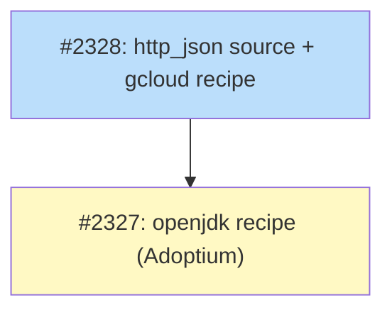

# DESIGN: HTTP/JSON Version Source

## Status

Planned

## Context and Problem Statement

tsuku's version-provider system in `internal/version/` resolves the latest
version of a recipe's tool from one of:

- GitHub tags or releases (`github_repo`, `tag_prefix`)
- Package registries (npm, PyPI, crates.io, RubyGems, MetaCPAN, Goproxy, Nixpkgs)
- Homebrew formulae and casks (`homebrew`, `cask`, `tap`)
- Fossil SCM timelines (`fossil_archive`)
- A `Registry` of named custom sources, currently registering `nodejs_dist` only
- A bare placeholder for HashiCorp at `internal/version/resolver.go:323`
  (`ResolveHashiCorp`) that returns hardcoded known versions and is not
  wired up to anything

A growing set of upstreams publish their current release version in a
JSON manifest served over HTTPS, without using any of the registries
tsuku knows about. The pattern is simple: GET the URL, parse JSON, read
a field. The field path is the only thing that varies.

**Concrete consumers identified by this design:**

| Upstream | Endpoint | Path to current version |
|----------|----------|-------------------------|
| Google Cloud SDK | `https://dl.google.com/dl/cloudsdk/channels/rapid/components-2.json` | `version` |
| HashiCorp checkpoint | `https://checkpoint-api.hashicorp.com/v1/check/<product>` | `current_version` |
| Adoptium (LTS major) | `https://api.adoptium.net/v3/info/available_releases` | `most_recent_lts` |
| Adoptium (binary version) | `https://api.adoptium.net/v3/assets/latest/<n>/hotspot` | `[0].version.openjdk_version` |

These four endpoints all read a single field. The first three need only
dotted access; the Adoptium binary endpoint additionally needs array
indexing.

**Stretch consumers identified but not satisfied by v1:**

| Upstream | Endpoint | Why bespoke is needed |
|----------|----------|-----------------------|
| Postgres | `https://www.postgresql.org/versions.json` | Needs filter (`current && supported`) and composition (`{major}.{latestMinor}`) |
| Elasticsearch | `https://artifacts-api.elastic.co/v1/versions` | Needs filter (drop `*-SNAPSHOT`) |

Postgres and Elasticsearch motivate a v2 of the path syntax (filters,
output composition) but do not block this design. They keep bespoke
registry entries when their recipes are authored.

The current per-source bespoke pattern would require one Go file plus
one registry entry for each consumer in the v1 list — three files for
three structurally identical extractions. This design replaces that
duplication with one generic source whose configuration lives in the
recipe.

## Decision Drivers

1. **Recipes describe data, not code.** Adding a new HTTP/JSON-backed
   tool should be a recipe change, not a Go change.
2. **Cover the v1 consumers without overshooting.** gcloud, HashiCorp
   checkpoint, and Adoptium all read a single field reachable via dotted
   access plus array index. The minimum syntax that covers them is the
   right scope.
3. **Reuse the existing registry pattern.** The version system already
   has a `Registry` of named sources for `nodejs_dist`; the new source
   slots into the same map.
4. **Don't break or replace `nodejs_dist`.** The Node LTS filter
   (`first entry with lts != null`) needs predicate evaluation that is
   genuinely outside the v1 scope. Leave it alone.
5. **Don't fetch from arbitrary user-controlled URLs at install time.**
   The URL lives in the recipe, which is already a trusted artifact
   reviewed at merge.

Out of scope:
- Filter expressions in the path syntax (`[?attr]`, `[?attr==value]`).
  Captured as a v2 follow-up motivated by Postgres/Elasticsearch.
- Output composition (`{major}.{minor}`). Same v2 follow-up.
- ListVersions support. Like `nodejs_dist`, this source is latest-only.
- ResolveVersion (specific-version resolution). Matches `nodejs_dist`.

## Considered Options

### Option A: Generic `http_json` source with dotted+index path syntax (chosen)

Add a single named source with three recipe fields:

```toml
[version]
source = "http_json"
url = "https://dl.google.com/dl/cloudsdk/channels/rapid/components-2.json"
version_path = "version"
```

The path syntax supports dotted access (`current.version`) and
zero-based array indexing (`releases[0].version.openjdk_version`). No
filters or composition.

- Pro: One file covers all three v1 consumers (gcloud, HashiCorp
  checkpoint, Adoptium). Future tools with similar shape are pure
  recipe changes.
- Pro: Replaces the `ResolveHashiCorp` dead code with a real path.
- Pro: Path syntax is small enough to implement and document
  exhaustively (~80 lines of Go for the walker plus a small parser).
- Con: Doesn't cover Postgres or Elasticsearch (filter/composition).
- Con: Adds a new schema-level concept (URL + path expression) that
  recipe authors and reviewers need to understand.
- Con: Trust: recipes can now point version resolution at any HTTPS
  URL. Mitigation: the URL is in the recipe and reviewed at merge,
  same as the dozens of download URLs every recipe already declares.
  A validator hook checks the URL is HTTPS and the response is
  reasonable size before parsing.

### Option B: Bespoke `gcloud_dist` source (originally proposed, now rejected)

Add `internal/version/gcloud.go` with a Google-specific resolver,
register it as `"gcloud_dist"`. Same shape as `nodejs_dist`.

- Pro: Smallest immediate code change (~50 lines).
- Pro: Authoritative — reads Google's own manifest.
- Con: Single-product scope. Adoptium and HashiCorp checkpoint each
  need their own file with structurally identical code.
- Con: Doesn't address the underlying scaling problem with
  bespoke-per-source.

### Option C: Use the unofficial `twistedpair/google-cloud-sdk` GitHub mirror

Recipe declares `[version] github_repo = "twistedpair/google-cloud-sdk"`.

- Pro: Zero code changes for gcloud.
- Con: Third-party trust; the mirror lags Google's releases by several
  versions and depends on a single external maintainer.
- Con: Doesn't help Adoptium or HashiCorp at all.
- Con: If the mirror stops, gcloud silently breaks.

### Option D: Embed a JSONPath or jq library

Adopt full JSONPath/jq syntax to cover every present and future case.

- Pro: Maximum expressiveness; covers Postgres, Elasticsearch, future
  upstreams in one mechanism.
- Con: Significantly more implementation surface. JSONPath
  implementations vary in semantics; jq embedding adds a non-trivial
  dependency or in-tree implementation.
- Con: Recipe authors design and debug JSONPath/jq expressions per
  recipe. Errors surface at eval time.
- Con: Most consumers don't need it. Premature for the v1 scope.

## Decision Outcome

Chose **Option A: Generic `http_json` source with dotted+index path syntax**.

Option A satisfies all five decision drivers. Recipes can describe new
HTTP/JSON-backed tools without Go changes (driver 1). The dotted+index
syntax is the minimum that covers all three v1 consumers without going
further (driver 2). The new source slots into the existing `Registry`
alongside `nodejs_dist` (driver 3). `nodejs_dist` is not touched
(driver 4). The URL lives in the recipe and is reviewed at merge time;
a validator hook enforces HTTPS and a reasonable response size
(driver 5).

Option B was rejected after the discussion in PR #2347 made clear that
gcloud is one of three near-term consumers with structurally identical
extraction. Adding three bespoke files for three identical patterns is
the duplication this design avoids.

Option C was rejected because the unofficial mirror lags Google's
releases and does not address Adoptium or HashiCorp at all.

Option D was rejected as more expressive than the v1 consumers
require. Postgres and Elasticsearch motivate filter and composition
support, but they are not blockers; they keep bespoke registry entries
for now and we revisit when their recipes are authored.

## Solution Architecture

The implementation lives entirely in `internal/version/`. No runtime,
executor, or recipe-action changes are involved.

### Recipe shape

The recipe declares the URL and path in `[version]`:

```toml
[version]
source = "http_json"
url = "https://dl.google.com/dl/cloudsdk/channels/rapid/components-2.json"
version_path = "version"
```

For Adoptium's binary-version endpoint:

```toml
[version]
source = "http_json"
url = "https://api.adoptium.net/v3/assets/latest/21/hotspot"
version_path = "[0].version.openjdk_version"
```

For HashiCorp checkpoint (e.g., terraform):

```toml
[version]
source = "http_json"
url = "https://checkpoint-api.hashicorp.com/v1/check/terraform"
version_path = "current_version"
```

### Recipe schema

`recipe.VersionSection` gains two optional fields:

```go
URL         string `toml:"url"`
VersionPath string `toml:"version_path"`
```

Both are required when `source = "http_json"`. Strict validation
rejects:

- Missing `url` when source is `http_json`
- `url` not starting with `https://`
- Missing `version_path` when source is `http_json`
- `version_path` failing to parse

### Path syntax

The path syntax has three constructs:

| Construct | Meaning |
|-----------|---------|
| `name` | Look up key `name` in the current map |
| `.name` | Same; the leading dot is permitted but optional after `]` |
| `[N]` | Index N (zero-based) in the current array |

Composing these:

- `version` — top-level field
- `current.version` — nested field
- `releases[0].version` — first element of array, then field
- `[0].version.openjdk_version` — when the top level is an array

The path is parsed once at provider construction. A walker descends
through `map[string]any` for keys and `[]any` for indices, returning a
clear error at the failing step (`failed to descend into "releases":
expected array, got map`).

The walker stops at the first non-object non-array leaf and converts
the value to a string. Numeric values (e.g., Adoptium's
`most_recent_lts` returns `21`) are formatted via `strconv`.

### New provider

`internal/version/http_json.go` (new):

```go
package version

import (
    "context"
    "encoding/json"
    "fmt"
    "io"
    "net/http"
    "strings"
)

// maxHTTPJSONResponseSize caps the response body to prevent decompression bombs.
const maxHTTPJSONResponseSize = 5 * 1024 * 1024 // 5 MB

// HTTPJSONProvider resolves a version by fetching a JSON document and
// extracting a single field via a small path syntax.
type HTTPJSONProvider struct {
    resolver    *Resolver
    url         string
    versionPath string // raw path, kept for SourceDescription
    pathSteps   []pathStep
}

func NewHTTPJSONProvider(resolver *Resolver, url, versionPath string) (*HTTPJSONProvider, error) {
    steps, err := parseVersionPath(versionPath)
    if err != nil {
        return nil, fmt.Errorf("invalid version_path %q: %w", versionPath, err)
    }
    return &HTTPJSONProvider{
        resolver:    resolver,
        url:         url,
        versionPath: versionPath,
        pathSteps:   steps,
    }, nil
}

func (p *HTTPJSONProvider) ResolveLatest(ctx context.Context) (*VersionInfo, error) {
    // Fetch URL (with timeout, 5MB limit; HTTPS-only enforced at validator level).
    // Decode JSON into any.
    // Walk pathSteps to find the value.
    // Stringify the leaf.
    // Return VersionInfo{Version: leaf, Tag: leaf}.
    // ...
}

func (p *HTTPJSONProvider) SourceDescription() string {
    return fmt.Sprintf("http_json:%s", p.url)
}
```

### Wiring

`http_json` cannot live cleanly in the existing `Registry.resolvers`
map because that signature only takes the `Resolver` (not the recipe).
The cleanest place is a new strategy in `provider_factory.go`:

```go
type HTTPJSONSourceStrategy struct{}

func (s *HTTPJSONSourceStrategy) Priority() int { return PriorityKnownRegistry }

func (s *HTTPJSONSourceStrategy) CanHandle(r *recipe.Recipe) bool {
    return r.Version.Source == "http_json"
}

func (s *HTTPJSONSourceStrategy) Create(resolver *Resolver, r *recipe.Recipe) (VersionProvider, error) {
    return NewHTTPJSONProvider(resolver, r.Version.URL, r.Version.VersionPath)
}
```

Register it alongside the other source strategies in `NewProviderFactory()`.

### Removed dead code

Delete `(r *Resolver) ResolveHashiCorp` from
`internal/version/resolver.go:321-356`. The function is unused and the
HashiCorp checkpoint API is now expressed in recipes via `http_json`.

## Implementation Approach

The implementation lands in #2328 (whose scope expands from "gcloud
version source" to "http_json source") in four contained slices:

1. **Path parser and walker.**
   - Add `internal/version/http_json_path.go` with the path-syntax
     parser and walker.
   - Tests in `internal/version/http_json_path_test.go` covering:
     plain top-level, nested dotted, array index at top, array index
     after dot, leading-dot tolerance, errors (unknown key, out-of-range
     index, type mismatch).

2. **HTTP/JSON provider.**
   - Add `internal/version/http_json.go` with `HTTPJSONProvider` and
     `NewHTTPJSONProvider`.
   - Tests using `httptest.NewServer` to serve fixture manifests:
     gcloud-shaped, HashiCorp-shaped, Adoptium-shaped (both
     endpoints), various error cases (network failure, non-200, bad
     JSON, path miss, oversized response).

3. **Schema and validator.**
   - Add `URL` and `VersionPath` fields to
     `recipe.VersionSection` in `internal/recipe/types.go`.
   - Add validation in `internal/recipe/validator.go`:
     `source = "http_json"` requires both fields; `url` must start
     with `https://`; `version_path` must parse via
     `parseVersionPath`.

4. **Wiring and consumers.**
   - Add `HTTPJSONSourceStrategy` to
     `internal/version/provider_factory.go`.
   - Delete `ResolveHashiCorp` from `resolver.go`.
   - Author `recipes/g/gcloud.toml` (closes #2328's recipe portion).
   - Update the openjdk design (#2327) to use `http_json` + Adoptium.
   - Optional: migrate one HashiCorp recipe (e.g., terraform) to
     `[version] source = "http_json"` against the checkpoint API as a
     proof, leaving the rest as `github_repo` until there's a reason
     to change.

The four slices land in a single PR for review coherence — the path
parser, provider, schema, and at least one consumer recipe ship
together so the mechanism is exercised end-to-end.

## Security Considerations

- **URL is recipe-controlled but reviewed at merge.** Recipes can now
  cause tsuku to fetch any HTTPS URL during version resolution. This
  is consistent with the existing model: every recipe already declares
  download URLs that tsuku fetches at install time. The validator
  enforces HTTPS-only.
- **Response size cap.** The provider reads at most 5 MB of response
  body. Manifests that legitimately exceed that size should be split
  upstream or use a different mechanism.
- **No code execution.** The path syntax is data-only; no expressions,
  no template substitution. The walker descends through known JSON
  types (`map[string]any`, `[]any`, leaf scalars) and returns a string.
- **No auth.** The provider does not send authentication headers; if a
  manifest requires auth, the recipe cannot use it. All four v1
  consumers are public manifests.
- **Plan-time integrity preserved.** The version is resolved into the
  download URL via `{version}` substitution at eval time. The
  `download_archive` action computes the archive checksum during eval
  and pins it in the resolved plan, so a later compromise of the
  upstream cannot substitute a different binary without the plan's
  checksum mismatching.

## Consequences

### Positive

- One mechanism unblocks gcloud (#2328), Adoptium (which #2327 needs
  for the openjdk recipe), and any HashiCorp tool that wants to use
  the checkpoint API for version resolution.
- New tools with JSON manifests follow the same pattern: a recipe
  change, no Go change.
- Removes the `ResolveHashiCorp` dead code in `resolver.go`.
- Provides a clear seam for future v2 work (filters, composition) when
  Postgres/Elasticsearch become priorities.

### Negative

- **Recipe authors learn a new mini-syntax.** The path expression is
  small but it is one more thing to know. Mitigation: examples in the
  recipe-author skill, validator gives clear error messages.
- **Doesn't cover Postgres or Elasticsearch.** Their recipes will
  either get bespoke registry entries when authored, or wait for v2 of
  the path syntax. The design explicitly defers this.
- **Two ways to do version resolution for HashiCorp.** Existing
  recipes use `github_repo`; the new mechanism could resolve from the
  checkpoint API. We keep `github_repo` for now and only migrate if
  there's a concrete reason (e.g., a HashiCorp tool whose tags lag
  the checkpoint API).
- **One more network call shape during version resolution.** Same
  failure modes as existing sources; the new code uses the same
  `Resolver.httpClient` and timeout handling.

### Affected Components

- `internal/version/http_json.go` (new file)
- `internal/version/http_json_path.go` (new file)
- `internal/version/http_json_test.go` (new test)
- `internal/version/http_json_path_test.go` (new test)
- `internal/version/provider_factory.go` (`HTTPJSONSourceStrategy`)
- `internal/version/resolver.go` (delete `ResolveHashiCorp`)
- `internal/recipe/types.go` (`VersionSection.URL`, `VersionPath`)
- `internal/recipe/validator.go` (new validation rules)
- `recipes/g/gcloud.toml` (new recipe, closes the gcloud portion of #2328)

## Implementation Issues

### Milestone: [Curated Recipe System](https://github.com/tsukumogami/tsuku/milestone/113)

| Issue | Dependencies | Tier |
|-------|--------------|------|
| [#2328: feat(version): add a version source for Google Cloud SDK to enable gcloud recipe](https://github.com/tsukumogami/tsuku/issues/2328) | None | testable |
| _Expanded scope: implements the generic `http_json` version source described in this design (path parser, walker, provider, validator, recipe-factory strategy), removes the `ResolveHashiCorp` dead code, and authors `recipes/g/gcloud.toml` as the first consumer._ | | |
| [#2327: feat(recipes): add openjdk recipe to enable JVM tool verification](https://github.com/tsukumogami/tsuku/issues/2327) | [#2328](https://github.com/tsukumogami/tsuku/issues/2328) | testable |
| _Authors the openjdk recipe using `http_json` against Adoptium's API. Unblocks the JVM-tool verification (maven, gradle, sbt) currently deferred from #2295._ | | |



**Legend**: Green = done, Blue = ready, Yellow = blocked, Purple = needs-design
