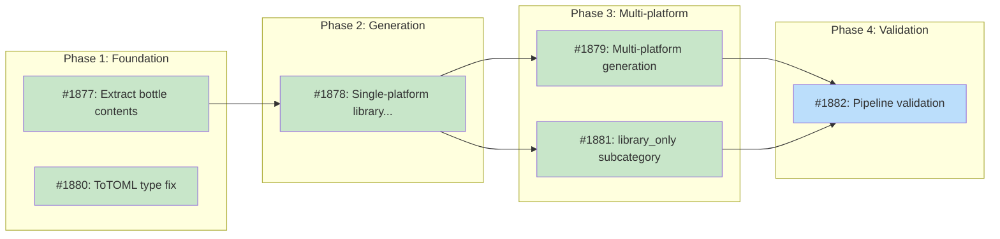

# Deterministic Library Recipe Generation

## Status

Planned

## Implementation Issues

### Milestone: [library-recipe-generation](https://github.com/tsukumogami/tsuku/milestone/98)

| Issue | Dependencies | Tier |
|-------|--------------|------|
| ~~[#1877: refactor(homebrew): extract bottle contents into structured type](https://github.com/tsukumogami/tsuku/issues/1877)~~ | ~~None~~ | ~~testable~~ |
| ~~_Refactors `extractBottleBinaries` into `extractBottleContents`, returning a `bottleContents` struct with `Binaries`, `LibFiles`, and `Includes` fields. Adds `isLibraryFile` filter with `matchesVersionedSo` regex and a backward-compatible `listBottleBinaries` wrapper._~~ | | |
| ~~[#1878: feat(homebrew): generate single-platform library recipes](https://github.com/tsukumogami/tsuku/issues/1878)~~ | ~~[#1877](https://github.com/tsukumogami/tsuku/issues/1877)~~ | ~~testable~~ |
| ~~_With bottle contents available, adds `generateLibraryRecipe` producing `type = "library"` recipes with `install_mode = "directory"` and `outputs` key. Wires into `generateDeterministicRecipe` as the fallback when `bin/` is empty but `lib/` has files. Changes `Verify` from value to pointer type so library recipes omit the `[verify]` section._~~ | | |
| ~~[#1879: feat(homebrew): add multi-platform library recipe generation](https://github.com/tsukumogami/tsuku/issues/1879)~~ | ~~[#1878](https://github.com/tsukumogami/tsuku/issues/1878)~~ | ~~testable~~ |
| ~~_Implements `scanMultiplePlatforms` to download Linux and macOS bottles from GHCR and scan each independently. Updates `generateLibraryRecipe` to produce platform-conditional step pairs with `when` clauses, matching the pattern in existing recipes like `gmp.toml`._~~ | | |
| ~~[#1880: fix(recipe): emit metadata type in ToTOML serializer](https://github.com/tsukumogami/tsuku/issues/1880)~~ | ~~None~~ | ~~testable~~ |
| ~~_Fixes the hand-coded `ToTOML()` serializer to emit `type` in `[metadata]` when set. The primary `WriteRecipe` path already handles this via struct tags, but `ToTOML()` is used by sandbox validation and was missing the field._~~ | | |
| ~~[#1881: feat(dashboard): add library_only failure subcategory](https://github.com/tsukumogami/tsuku/issues/1881)~~ | ~~[#1878](https://github.com/tsukumogami/tsuku/issues/1878)~~ | ~~testable~~ |
| ~~_Adds `library_only` to the `knownSubcategories` map in the dashboard and tags library detection error messages with `[library_only]` for `extractSubcategory()` parsing. Distinguishes "detected a library but generation failed" from "genuinely unclassifiable bottle."_~~ | | |
| [#1882: test(homebrew): validate library recipe generation against pipeline data](https://github.com/tsukumogami/tsuku/issues/1882) | [#1879](https://github.com/tsukumogami/tsuku/issues/1879), [#1881](https://github.com/tsukumogami/tsuku/issues/1881) | testable |
| _Runs the generator against known library packages (bdw-gc, tree-sitter) from the `complex_archive` queue. Verifies generated recipes match existing library recipe structure and confirms the `library_only` subcategory appears correctly in failure data._ | | |

### Dependency Graph



**Legend**: Green = done, Blue = ready, Yellow = blocked, Purple = needs-design, Orange = tracks-design

## Context and Problem Statement

The `tsuku create --from homebrew --deterministic-only` command generates recipes by downloading a Homebrew bottle from GHCR, extracting it, and scanning the tarball for executables in `bin/`. When it finds binaries, it builds a recipe with `install_binaries` pointing to those files. When `bin/` is empty, it returns a `complex_archive` error and gives up.

This works for tools like `jq` or `gh` that ship a single binary in `bin/`. But library packages don't ship executables. `bdw-gc` puts `libgc.so`, `libgc.a`, and `gc.h` in `lib/` and `include/`. `tree-sitter` does the same with `libtree-sitter.so` and its headers. The generator sees an empty `bin/`, classifies the bottle as `complex_archive`, and fails.

Recipe authors then have to construct library recipes manually, following the pattern established by `gmp.toml` and 21 other library recipes in the registry: `type = "library"`, platform-conditional `homebrew` actions, and `install_binaries` with `install_mode = "directory"` listing every `.so`, `.a`, `.dylib`, `.pc`, and `.h` file. It's tedious but mechanical -- exactly the kind of work the deterministic generator should handle.

The batch pipeline compounds the problem. It runs `tsuku create` with `--deterministic-only` on thousands of Homebrew formulas. Library packages consistently fail with `complex_archive` and end up in the `requires_manual` queue. 70 unique packages have hit this classification in failure data. Not all are true libraries -- some are Python packages, multi-tool bundles, or other non-standard layouts. Based on sampling, an estimated 20-40 of these are pure library packages that match the automatable pattern. The remaining 30-50 will continue to require manual authoring or other generator improvements.

### Scope

**In scope:**
- Extending bottle inspection to scan `lib/` and `include/` directories
- Generating `type = "library"` recipes with `install_mode = "directory"`
- Multi-platform recipe generation (Linux glibc + macOS) from a single invocation
- Adding a `library_only` subcategory under `complex_archive` for pipeline observability

**Out of scope:**
- Wildcard or glob patterns in outputs lists (future research)
- musl Linux / Alpine package steps (added manually when needed)
- Handling non-library `complex_archive` cases (Python, multi-tool bundles)
- Changes to the `install_binaries` action itself

## Decision Drivers

- **Minimize manual work**: library recipes follow a mechanical pattern that doesn't need human judgment
- **Follow established patterns**: 22 library recipes exist as reference; the generator should produce the same structure
- **Self-contained**: no LLM fallback needed for library detection or recipe generation
- **Multi-platform**: recipes should work on both Linux and macOS from day one
- **Pipeline observability**: distinguish library failures from genuinely complex bottles in failure data
- **Accepted fragility**: enumerating specific files means recipes may need updates when libraries change their file layout between versions. This is a known trade-off, documented for future research into more resilient formats.

## Implementation Context

### Existing Patterns

**`extractBottleBinaries`** (`internal/builders/homebrew.go:1565`): Downloads and scans a bottle tarball, looking for files where `parts[2] == "bin"`. Returns a string slice of binary names. When empty, the caller (`generateDeterministicRecipe`) returns `"no binaries found in bottle"`, which gets classified as `complex_archive`.

**`generateDeterministicRecipe`** (`internal/builders/homebrew.go:1832`): Builds a `recipe.Recipe` struct from bottle inspection results. Currently only handles the binary case: sets `install_binaries` with `binaries` list and generates a `[verify]` section using `binary --version`. Libraries need a different recipe shape.

**Library recipe structure** (all 22 existing recipes follow this):
```toml
[metadata]
type = "library"

[[steps]]
action = "homebrew"
formula = "..."
when = { os = ["linux"], libc = ["glibc"] }

[[steps]]
action = "install_binaries"
install_mode = "directory"
outputs = ["lib/libfoo.so", "lib/libfoo.a", "include/foo.h"]
when = { os = ["linux"], libc = ["glibc"] }
```

Libraries are exempt from the `[verify]` section requirement (`install_binaries.go:93`) because shared objects can't be executed to verify installation.

**Platform tags**: `getCurrentPlatformTag()` maps `runtime.GOOS`/`runtime.GOARCH` to Homebrew bottle tags (`x86_64_linux`, `arm64_sonoma`, etc.). The GHCR manifest contains blobs for all platforms, so a Linux runner can download macOS bottles -- they're just tar.gz archives readable on any OS.

### Known Gaps

The `complex_archive` category conflates several distinct failure modes: library-only bottles, Python frameworks, multi-tool bundles, and other non-standard layouts. Only the library case has a clear, automatable pattern. After this change, `complex_archive` narrows to genuinely unclassifiable bottles.

**Two serialization paths**: The primary recipe-writing path is `WriteRecipe` in `internal/recipe/writer.go`, which uses BurntSushi struct encoding and already handles `type` correctly. The `ToTOML()` method in `internal/recipe/types.go` is a hand-coded serializer used by sandbox validation -- it writes `name`, `description`, `homepage`, and `version_format` but skips `type`. `ToTOML()` should be updated to emit `type` when set for correctness, though the generated recipe file is written via `WriteRecipe`.

**`outputs` vs `binaries` key**: The current `generateDeterministicRecipe` uses `"binaries"` as the step params key. Existing library recipes use `outputs`, and `binaries` is deprecated in the `install_binaries` action. This design uses `outputs` for library recipes, matching the established convention. The existing tool recipe path continues to use `binaries` for now (separate migration).

**No `[version]` section in existing library recipes**: All 22 existing library recipes omit the `[version]` section. The tool recipe generation path produces a `[version]` section with `source = "homebrew"`. Generated library recipes should also include it -- the version section enables `tsuku outdated` checks and is the right default for generated recipes, even though hand-written recipes historically omitted it.

**`[verify]` serialization**: `WriteRecipe` serializes the `Verify` field even when empty. Generated library recipes must set `Verify` to nil (not an empty struct) to avoid emitting a bare `[verify]` section. Most existing library recipes omit `[verify]` entirely.

## Considered Options

### Decision 1: Detection Strategy

When the deterministic generator encounters a bottle with no files in `bin/`, it needs to determine whether the package is a library or something else entirely. The bottle tarball is already downloaded and available as a temp file, so any scan of additional directories is cheap -- no extra network requests.

#### Chosen: Scan lib/ in the bottle tarball

Extend the existing `extractBottleBinaries` function (or create a companion function) to also scan `lib/` and `include/` directories in the tarball. If `bin/` is empty but `lib/` contains files matching library extensions (`.so`, `.a`, `.dylib`, `.pc`), classify the bottle as a library and generate a library recipe. If both `bin/` and `lib/` are empty, keep the existing `complex_archive` classification.

The scan collects both regular files and symlinks from the tarball (skipping directory entries), matching extensions `.so`, `.so.*` (versioned shared objects), `.a`, `.dylib`, and `.pc` in `lib/`, and all files in `include/`. Symlinks must be included because unversioned library names (e.g., `libfoo.so`) are typically symlinks to versioned files (e.g., `libfoo.so.1.2.3`), and downstream consumers link against the unversioned name. The `pkgconfig/` subdirectory within `lib/` is included since `.pc` files are part of the library's public interface.

#### Alternatives Considered

**Homebrew API metadata**: Use the formula JSON's `keg_only` flag to identify libraries without downloading the bottle. Rejected because `keg_only` isn't reliable for this purpose -- tools like `python@3.12` are keg-only but aren't libraries. The bottle download is needed anyway to get the actual file list for the outputs array.

**Hybrid API hint + bottle scan**: Use `keg_only` as a pre-filter, then confirm via bottle scan. Rejected because the `keg_only` gate would miss non-keg libraries, and the added complexity provides little benefit over a pure bottle scan. The bottle is already downloaded.

### Decision 2: Output List Generation

The generated recipe needs an `outputs` array listing every file to symlink from the installed directory to `$TSUKU_HOME/libs/`. This determines what downstream dependents can find.

#### Chosen: Enumerate all lib/ and include/ files

List every matching file from the bottle scan: `.so`, `.so.*`, `.a`, `.dylib`, and `.pc` files from `lib/`, plus all files from `include/`. This matches the pattern in `gmp.toml`, `abseil.toml`, and every other existing library recipe.

Versioned shared objects (e.g., `libgc.so.1.5.0`) are included alongside the unversioned symlink target (`libgc.so`). The outputs list reflects what's actually in the bottle. For a typical library this produces 10-30 entries.

This approach is fragile: when a library adds or removes files between versions, the recipe's outputs list becomes stale. The `satisfies` mechanism and version-pinned bottles mitigate this in practice (recipes are generated against a specific version, and the Homebrew action downloads the matching bottle). But it's a known limitation that future work should address -- either through glob patterns in `install_mode = "directory"` or a version-aware outputs mechanism.

#### Alternatives Considered

**Only lib/ files, skip include/**: Shorter outputs list, but breaks convention. All 22 existing library recipes include headers. Dependents that compile against the library need the headers symlinked into `$TSUKU_HOME/libs/`.

**Filter versioned symlinks**: Exclude versioned shared objects (e.g., `libreadline.so.8.2`, `libreadline.so.8`) and only keep the unversioned `.so`, `.a`, `.dylib`, `.pc`, and headers. This would reduce the fragility risk since versioned symlinks are the entries most likely to change between versions. Rejected because existing library recipes (readline.toml, gmp.toml, etc.) include versioned symlinks, and matching the established convention matters more than durability at this stage. The fragility concern is documented for future research alongside the glob pattern approach.

**Wildcard patterns**: Use globs like `lib/*.so` instead of enumerating files. Rejected because it requires adding glob support to the `install_binaries` action, which is scope creep for this design. Worth exploring separately.

### Decision 3: Platform Handling

Library file extensions are platform-specific: `.so` on Linux, `.dylib` on macOS, `.a` on both. Existing library recipes use two patterns: about half use platform-conditional step pairs with `when` clauses (gmp.toml, cairo.toml), while the rest use a single unconditional step pair listing both `.so` and `.dylib` in one outputs list (brotli.toml, zstd.toml). The unconditional pattern is simpler but mixes files that don't exist on the other platform. The conditional pattern is more precise and maps cleanly to per-platform bottle scanning.

#### Chosen: Multi-platform generation with when clauses

Download bottles for two platforms (Linux x86_64 and macOS arm64), scan each independently, and generate platform-conditional steps. The GHCR registry serves bottles for all platforms regardless of the requesting host, so a Linux CI runner can download and scan a macOS bottle. The tarball format is the same -- only the file extensions inside differ.

The generated recipe has four steps: `homebrew` + `install_binaries` for Linux glibc, then `homebrew` + `install_binaries` for macOS. Each `install_binaries` step has its own `outputs` list reflecting the platform-specific files. The `include/` files are typically identical across platforms (headers are platform-independent), but we list them per-platform anyway to match the established convention.

If a bottle isn't available for one platform (the GHCR manifest has no entry for that platform tag), the recipe is generated with only the available platform's steps. A warning is emitted so the author knows to add the missing platform later.

#### Alternatives Considered

**Single-platform recipe**: Generate only for the current platform. Simpler, but produces incomplete recipes that always need manual macOS additions. The batch pipeline runs on Linux, so every generated recipe would be Linux-only.

**Template with TODOs**: Generate one platform with TODO comments for the other. Rejected because TODO comments in committed recipe files are messy and may confuse recipe validation CI.

### Decision 4: Failure Category

The `complex_archive` failure category currently covers everything from library-only bottles to Python frameworks. After this change, libraries get recipes instead of failing, but the category distinction still matters for pipeline analysis.

#### Chosen: Add library_only as a subcategory of complex_archive

Add `library_only` as a subcategory of the existing `complex_archive` failure category rather than a new top-level `DeterministicFailureCategory`. The dashboard already has `extractSubcategory()` in `internal/dashboard/failures.go` that parses finer-grained classifications from the `knownSubcategories` map. Adding a subcategory is a one-line map entry with no schema migration.

When bottle inspection finds `lib/` files but library recipe generation fails for another reason (e.g., no bottle available for any platform, unexpected tarball structure), the failure is recorded as `complex_archive` with subcategory `library_only`. This keeps the top-level category stable while giving the dashboard the ability to filter library-specific failures.

In the success case (library recipe generated), no failure is recorded at all. The subcategory only appears when we detected a library but couldn't produce a recipe -- useful for debugging.

#### Alternatives Considered

**New top-level category**: Add `FailureCategoryLibraryOnly` to the `DeterministicFailureCategory` enum and the `failure-record.schema.json` enum. Rejected because it requires a schema migration, Go constant changes, and dashboard parsing updates. The subcategory approach achieves the same observability with no schema contract change.

**No new category**: Let `complex_archive` naturally shrink as library packages get recipes. Rejected because `complex_archive` is a catch-all that lumps libraries with Python packages and multi-tool bundles. Without the subcategory distinction, gap analysis can't tell "we know it's a library but something else went wrong" from "we have no idea what this bottle contains."

## Decision Outcome

**Chosen: 1 (bottle scan) + 2 (enumerate files) + 3 (multi-platform) + 4 (library_only subcategory)**

### Summary

We're extending the deterministic generator to recognize and handle library-only Homebrew bottles. When the existing `bin/` scan returns empty, the generator scans `lib/` and `include/` in the same downloaded tarball. If it finds library files (`.so`, `.a`, `.dylib`, `.pc`), it generates a `type = "library"` recipe instead of failing with `complex_archive`.

The generator downloads bottles for two platforms (Linux x86_64 and macOS arm64) from GHCR. Both tarballs are scanned independently, and the resulting recipe contains platform-conditional steps with `when` clauses. Each platform section has its own `homebrew` action and `install_binaries` with `install_mode = "directory"` listing the platform-specific outputs. Headers from `include/` are listed per-platform even though they're typically identical, matching the convention in existing library recipes.

When library detection succeeds but recipe generation fails for some other reason (missing platform bottle, unparseable tarball), the failure is classified as `complex_archive` with subcategory `library_only`. This gives the batch pipeline better signal about what went wrong without requiring a schema migration.

The outputs list is an explicit enumeration of every file found in the bottle scan. This is fragile across library versions -- a library that adds a new `.so` in a later version won't have it in the outputs list until the recipe is regenerated. For now, this matches how all 22 existing library recipes work and is the simplest correct approach. Future work should explore more resilient formats (globs, version-aware manifests).

### Rationale

Scanning the bottle for `lib/` files is the natural extension of what the generator already does for `bin/`. The tarball is already downloaded, so the marginal cost is zero. Enumerating files matches the established pattern rather than inventing something new. Multi-platform generation avoids the tedious manual step of adding macOS sections to every library recipe -- the GHCR registry serves cross-platform bottles without restriction, so there's no technical barrier.

The `library_only` subcategory costs almost nothing to add (one map entry in the dashboard) but gives the batch pipeline the ability to distinguish "we know what this is" from "we're lost." Combined with the generation fix, it narrows `complex_archive` to cases that genuinely need investigation.

## Solution Architecture

### Modified Function: `extractBottleContents`

Rename `extractBottleBinaries` to `extractBottleContents` and return a richer struct:

```go
type bottleContents struct {
    Binaries []string // Files in bin/ (e.g., ["jq"])
    LibFiles []string // Files in lib/ (e.g., ["lib/libgc.so", "lib/libgc.a"])
    Includes []string // Files in include/ (e.g., ["include/gc.h"])
}

func (b *HomebrewBuilder) extractBottleContents(tarballPath string) (*bottleContents, error) {
    // Scan the tarball once, collecting files from bin/, lib/, and include/
    // Filter lib/ for: .so, .so.*, .a, .dylib, .pc (regular files and symlinks)
    // Filter include/ for: all regular files and symlinks
    // Skip directory entries only
}
```

The existing `listBottleBinaries` calls `extractBottleContents` and returns only `contents.Binaries` for backward compatibility with the tool recipe path.

### New Function: `generateLibraryRecipe`

```go
func (b *HomebrewBuilder) generateLibraryRecipe(
    ctx context.Context,
    packageName string,
    genCtx *homebrewGenContext,
    platforms []platformContents,
) (*recipe.Recipe, error)
```

Where `platformContents` pairs a platform with its scanned outputs:

```go
type platformContents struct {
    OS       string        // "linux" or "darwin"
    Libc     string        // "glibc" or "" (macOS has no libc distinction)
    Contents *bottleContents
}
```

The function builds a recipe with:
- `metadata.type = "library"` (handled by `WriteRecipe`; `ToTOML()` also needs update for sandbox validation path)
- No `[verify]` section (libraries can't be executed; unlike readline.toml's file-check approach, omitting verify is simpler and matches the majority of existing library recipes)
- Per-platform `homebrew` + `install_binaries` step pairs with `when` clauses
- `install_mode = "directory"` on each `install_binaries` step
- `outputs` key (not the deprecated `binaries`) populated from the platform's `LibFiles` + `Includes`

### Modified Function: `generateDeterministicRecipe`

The main generation function gets a library fallback path:

```go
func (b *HomebrewBuilder) generateDeterministicRecipe(...) (*recipe.Recipe, error) {
    // Step 1: Try current platform (existing logic)
    contents := b.extractBottleContents(tarball)

    if len(contents.Binaries) > 0 {
        return b.generateToolRecipe(...)  // Existing path, renamed
    }

    // Step 2: Library detection
    if len(contents.LibFiles) == 0 {
        return nil, fmt.Errorf("no binaries or library files found in bottle")
    }

    // Step 3: Multi-platform scan
    platforms := b.scanMultiplePlatforms(ctx, info, contents)

    return b.generateLibraryRecipe(ctx, packageName, genCtx, platforms)
}
```

### New Function: `scanMultiplePlatforms`

```go
func (b *HomebrewBuilder) scanMultiplePlatforms(
    ctx context.Context,
    info *formulaInfo,
    currentContents *bottleContents,
) []platformContents
```

Downloads bottles for additional platforms (beyond the one already downloaded) and scans each. Returns a slice of `platformContents` including the current platform's already-scanned results.

Target platforms:
- `x86_64_linux` (Linux glibc x86_64)
- `arm64_sonoma` (macOS arm64)

If a platform's bottle isn't available in the GHCR manifest, it's skipped with a log warning. The current platform is always included (its bottle is already downloaded).

### Modified Error Classification

In `classifyDeterministicFailure`, both cases remain `FailureCategoryComplexArchive`. The library detection failure includes a `[library_only]` tag in the error message that the dashboard's `extractSubcategory()` can parse:

```go
case strings.Contains(msg, "no binaries or library files found"):
    category = FailureCategoryComplexArchive
    // Truly unclassifiable -- no bin/, no lib/

case strings.Contains(msg, "library recipe generation failed"):
    category = FailureCategoryComplexArchive
    // Subcategory "library_only" extracted by dashboard from error message tag
```

Add `"library_only"` to the `knownSubcategories` map in `internal/dashboard/failures.go`.

### File Extension Filtering

Library file matching uses a simple suffix check:

```go
func isLibraryFile(name string) bool {
    switch {
    case strings.HasSuffix(name, ".a"):
        return true
    case strings.HasSuffix(name, ".dylib"):
        return true
    case strings.HasSuffix(name, ".pc"):
        return true
    case strings.HasSuffix(name, ".so"):
        return true
    case matchesVersionedSo(name):
        return true // versioned .so (e.g., libgc.so.1.5.0)
        // Uses regex `\.so\.\d` to avoid false positives from
        // paths that happen to contain ".so." as a substring
    default:
        return false
    }
}
```

## Implementation Approach

### Phase 1: Bottle content scanning

Refactor `extractBottleBinaries` into `extractBottleContents` returning `bottleContents`. Update callers. Add `isLibraryFile` filter. Unit tests for scanning bottles with only lib/ files.

### Phase 2: Library recipe generation

Implement `generateLibraryRecipe` for a single platform first. Wire it into `generateDeterministicRecipe` as the fallback when `bin/` is empty but `lib/` has files. Use `outputs` (not `binaries`) as the step params key. Update `ToTOML()` to emit `metadata.type` when set. Add `library_only` to the dashboard's `knownSubcategories` map. Test with real library bottles (bdw-gc, tree-sitter).

### Phase 3: Multi-platform support

Implement `scanMultiplePlatforms` to download and scan cross-platform bottles. Update `generateLibraryRecipe` to produce platform-conditional steps with `when` clauses. Handle missing platform bottles gracefully.

### Phase 4: Pipeline integration

Run the updated generator against the current `complex_archive` failures in the queue. Verify generated recipes match the structure of existing library recipes. Update dashboard metrics to track the new `library_only` category.

## Security Considerations

### Download verification

The generator downloads additional bottles (macOS bottle from Linux) using the same GHCR authentication and SHA256 verification as the existing single-bottle path. The `downloadBottleBlob` function computes a SHA256 hash during download and compares it against the blob SHA from the GHCR manifest. No change to the verification model.

### Execution isolation

No change. Library recipes use `install_mode = "directory"` which copies files and creates symlinks. No shell execution, no elevated permissions. The generator itself runs in the same context as before -- it reads tarball contents without executing anything from the bottle.

### Supply chain risks

Same trust model as existing deterministic generation: bottles come from GHCR (`ghcr.io/homebrew/core/`), authenticated via the anonymous GHCR token flow. The generator doesn't execute bottle contents, only inspects file paths in the tarball. A compromised bottle could list unexpected files in `lib/`, but these would only end up as symlinks in `$TSUKU_HOME/libs/` -- the same exposure as any other recipe.

### User data exposure

No user data is accessed or transmitted. The generator reads bottle metadata from GHCR (public registry) and writes recipe files locally.

## Consequences

### Positive

- Library packages like bdw-gc, tree-sitter, and similar get recipes automatically instead of requiring manual authoring
- The `library_only` subcategory lets the dashboard distinguish library failures from genuinely unclassifiable bottles, improving pipeline signal
- Multi-platform recipes from day one reduce the manual steps needed after generation
- Follows the exact same pattern as all 22 existing library recipes, so generated and hand-written recipes look the same

### Negative

- Enumerated outputs lists are fragile across library versions. When a library adds or removes files, the recipe needs regeneration. All existing library recipes share this limitation.
- Downloading an extra bottle per library package increases generation time by a few seconds per package. For the batch pipeline processing thousands of packages, this adds up to a few extra minutes per run.
- musl Linux (Alpine) steps aren't generated. Libraries that need `apk_install` steps still require manual additions.

### Mitigations

- **Version fragility**: The `[version]` section pins the Homebrew formula, and the `homebrew` action downloads the matching bottle. Stale outputs lists don't cause installation failures -- they just mean some files aren't symlinked. Regenerating the recipe with `tsuku create` picks up new files. Future work on glob patterns in `install_mode = "directory"` would eliminate this entirely.
- **Extra download time**: Bottles are typically 1-10 MB compressed. At 2 platforms per library, the overhead is modest. The batch pipeline already handles much larger downloads (some tools are 100+ MB). No mitigation needed.
- **Missing musl steps**: musl/Alpine support uses `apk_install` which can't be auto-detected from Homebrew bottles. This is a known limitation shared with existing library recipes. Recipe authors add musl steps manually.
