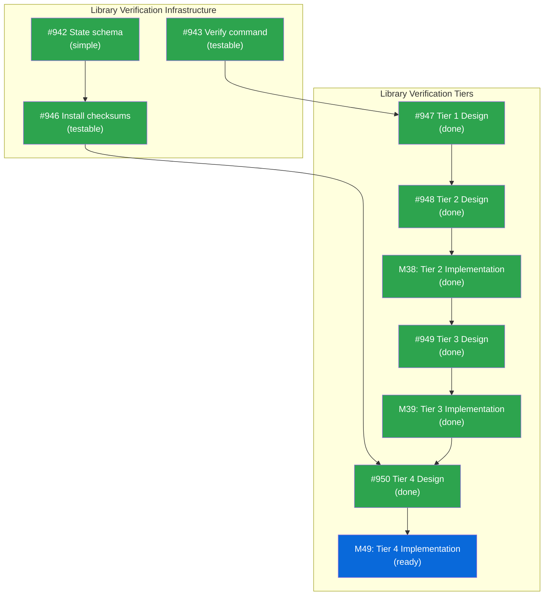

# DESIGN: Library Verification for tsuku verify Command

## Status

Planned

## Implementation Issues

| Issue | Title | Dependencies | Tier |
|-------|-------|--------------|------|
| ~~[#942](https://github.com/tsukumogami/tsuku/issues/942)~~ | ~~feat(state): add checksums field to library version state~~ | ~~None~~ | ~~simple~~ |
| ~~[#943](https://github.com/tsukumogami/tsuku/issues/943)~~ | ~~feat(verify): add library type detection and flag routing~~ | ~~None~~ | ~~testable~~ |
| ~~[#946](https://github.com/tsukumogami/tsuku/issues/946)~~ | ~~feat(install): compute and store library checksums at install time~~ | ~~[#942](https://github.com/tsukumogami/tsuku/issues/942)~~ | ~~testable~~ |
| ~~[#947](https://github.com/tsukumogami/tsuku/issues/947)~~ | ~~docs: design header validation for library verification (Tier 1)~~ | ~~[#943](https://github.com/tsukumogami/tsuku/issues/943)~~ | ~~critical~~ |
| ~~[#948](https://github.com/tsukumogami/tsuku/issues/948)~~ | ~~docs: design dependency resolution for library verification (Tier 2)~~ | ~~[#947](https://github.com/tsukumogami/tsuku/issues/947)~~ | ~~critical~~ |
| ~~[M38](https://github.com/tsukumogami/tsuku/milestone/38)~~ | ~~Tier 2 Dependency Validation (12 issues)~~ | ~~[#948](https://github.com/tsukumogami/tsuku/issues/948)~~ | ~~milestone~~ |
| ~~[#949](https://github.com/tsukumogami/tsuku/issues/949)~~ | ~~docs: design dlopen load testing for library verification (Tier 3)~~ | ~~[M38](https://github.com/tsukumogami/tsuku/milestone/38)~~ | ~~critical~~ |
| ~~[M39](https://github.com/tsukumogami/tsuku/milestone/39)~~ | ~~Tier 3 dlopen Verification (7 issues)~~ | ~~[#949](https://github.com/tsukumogami/tsuku/issues/949)~~ | ~~milestone~~ |
| ~~[#950](https://github.com/tsukumogami/tsuku/issues/950)~~ | ~~docs: design integrity verification for library verification (Tier 4)~~ | ~~[#946](https://github.com/tsukumogami/tsuku/issues/946)~~, ~~[M39](https://github.com/tsukumogami/tsuku/milestone/39)~~ | ~~testable~~ |
| [M49](https://github.com/tsukumogami/tsuku/milestone/49) | Tier 4 Implementation (3 issues) | [#950](https://github.com/tsukumogami/tsuku/issues/950) | milestone |



## Context and Problem Statement

Tsuku now supports library recipes (`type = "library"`) for installing shared libraries that tools depend on at runtime. For example, `gcc-libs` provides `libstdc++` and `libgcc_s` for binaries compiled with GCC. Libraries are installed to `$TSUKU_HOME/libs/{name}-{version}/` and are linked at runtime by dependent tools.

However, the `tsuku verify` command does not support libraries. When users run `tsuku verify gcc-libs`, the command fails with "Recipe for 'gcc-libs' does not define verification" because:

1. Libraries have no executables to run for verification
2. Library recipes have no `[verify]` section (the validator explicitly skips this check for libraries)
3. The verify command's design assumes all tools produce an executable output

**The core question is: what does "verification" mean for libraries?**

Users don't just want to know "is the file present?" - they want to know "will this library actually work when my tools try to use it?" This requires verifying:

1. The file is a valid shared library (not corrupted or wrong type)
2. The library is for the correct architecture
3. The library's dependencies can be resolved
4. The library can actually be loaded by the dynamic linker

### Scope

**In scope:**
- Verification that library files are valid shared objects
- Architecture compatibility checking
- Dependency resolution verification
- Dynamic loading verification (dlopen)
- Optional integrity checking (checksums)

**Out of scope:**
- Symbol table validation against expected APIs (too maintenance-heavy)
- ABI compatibility checking between library versions
- Functional testing with compilation (requires compiler toolchain)
- Transitive dependency verification (`tsuku verify nodejs` does not verify `gcc-libs`)

## Decision Drivers

- **Usefulness**: Verification should answer "will this library work?" not just "is the file present?"
- **Speed**: Default verification should be fast enough to run routinely
- **No external dependencies**: Should work without requiring ldd, nm, or other tools
- **Cross-platform**: Must work on both Linux (ELF) and macOS (Mach-O)
- **Graduated depth**: Users should be able to choose verification thoroughness

## Implementation Context

### Existing Patterns

**Go standard library support:**
- `debug/elf` - Full ELF parsing (Linux shared objects)
- `debug/macho` - Full Mach-O parsing (macOS dylibs)
- Both provide: file type, architecture, imported libraries, dynamic symbols

**Binary integrity verification (verify.go:17-51):**
- Computes SHA256 checksums of installed binaries
- Compares against checksums stored at installation time
- Can be extended to libraries

**Library installation (library.go:23-51):**
- Copies library files to `$TSUKU_HOME/libs/{name}-{version}/`
- Tracks `used_by` relationships in state
- Preserves symlinks for library versioning

### Research Summary

Research was conducted across five approaches. Key findings:

**Header Validation (debug/elf, debug/macho):**
- 20-75x faster than checksumming
- Catches: wrong file type, truncation, architecture mismatch, corrupted headers
- Go stdlib only, no external tools needed

**Dynamic Linker Tools (ldd/otool):**
- **Security risk**: `ldd` executes code from the binary's `.init` sections
- Go's `debug/elf.ImportedLibraries()` is safe and 300x faster than ldd
- Can verify dependencies without execution

**Symbol Table Verification:**
- Fast (~50-850μs per library)
- **Critical finding**: Zeroing function code passes symbol validation - corruption only crashes when the function is called
- Useful as sanity check, not integrity guarantee

**dlopen Testing:**
- Actually loads the library via dynamic linker
- Most practical "does it work?" test
- Requires helper binary to avoid cgo in main tsuku

**Checksum Verification:**
- Answers "has file changed since install?" not "is file valid?"
- Industry standard (RPM, dpkg, pacman) but always as complement, never standalone
- Good for detecting post-install tampering

### Platform-Specific Considerations

**macOS Big Sur+ dyld Shared Cache:**
Starting with macOS Big Sur, Apple moved most system libraries into a shared cache (`/System/Library/dyld/dyld_shared_cache_*`). System libraries like `libSystem.B.dylib` no longer exist as individual files on disk. This has implications for dependency resolution:

- Dependency checking (Level 2) cannot verify system library existence by file path
- The dyld cache contains: libc, libm, libpthread, CoreFoundation, and most system frameworks
- Solution: Skip file existence checks for libraries in system paths (`/usr/lib/`, `/System/Library/`)
- dlopen (Level 3) still works correctly - the dynamic linker knows how to load from the cache

**Linux System Library Paths:**
Linux system libraries remain on disk but may be in various locations depending on distribution:
- `/lib`, `/lib64`, `/usr/lib`, `/usr/lib64`
- Multiarch paths like `/usr/lib/x86_64-linux-gnu/`

### Anti-patterns to Avoid

- Shelling out to `ldd` (security risk - executes untrusted code)
- Requiring recipe changes for basic verification
- Making verification so slow it's never used
- Giving false confidence (file exists != file works)
- Checking file existence for macOS system libraries (they're in dyld cache)

## Considered Options

### Option 1: File Existence Only

Check that expected library files exist.

**Pros:**
- Simplest implementation
- Very fast

**Cons:**
- Doesn't verify files are valid libraries
- Truncated or corrupted files pass
- Wrong architecture files pass

### Option 2: Checksum Verification Only

Store SHA256 checksums at install time, verify they match.

**Pros:**
- Detects any file modification
- Industry-standard approach

**Cons:**
- Doesn't verify initial validity (checksums a bad file = bad checksum)
- Doesn't verify loadability
- Gives false confidence about functionality

### Option 3: Header Validation Only

Parse ELF/Mach-O headers to verify valid shared library format.

**Pros:**
- Fast (~50μs per file)
- Catches most practical issues (wrong type, architecture, truncation)
- No external dependencies

**Cons:**
- Doesn't verify code section integrity
- Doesn't verify dependencies resolve
- Doesn't confirm library actually loads

### Option 4: dlopen Verification Only

Actually load the library using the dynamic linker.

**Pros:**
- Definitive "does it load?" answer
- Catches missing dependencies, invalid format, architecture mismatch

**Cons:**
- Requires helper binary (cgo or separate tool)
- Slower than header validation
- Doesn't detect code corruption until function is called

### Option 5: Tiered Verification (Recommended)

Combine approaches in layers, with configurable depth:

| Level | What | Speed | Default | Flag |
|-------|------|-------|---------|------|
| 1. Header | Valid format, correct architecture | ~50μs | Yes | - |
| 2. Dependencies | Required libraries exist | ~100μs | Yes | - |
| 3. Loadable | dlopen succeeds | ~1ms | Yes | `--skip-dlopen` to disable |
| 4. Integrity | Checksum unchanged | 1-3ms | No | `--integrity` to enable |

**Pros:**
- Fast default catches most issues
- Users can opt into deeper verification or skip dlopen
- Each layer adds meaningful assurance
- No single point of false confidence
- Graceful degradation when helper unavailable

**Cons:**
- More complex implementation
- Requires helper binary for dlopen layer (auto-installed)

### Evaluation Against Decision Drivers

| Option | Usefulness | Speed | No Ext Deps | Cross-Platform | Graduated |
|--------|------------|-------|-------------|----------------|-----------|
| 1. Existence | Poor | Excellent | Yes | Yes | No |
| 2. Checksum | Fair | Good | Yes | Yes | No |
| 3. Header | Good | Excellent | Yes | Yes | No |
| 4. dlopen | Good | Good | Needs helper | Yes | No |
| 5. Tiered | Excellent | Good | Needs helper | Yes | Yes |

## Decision Outcome

**Chosen option: Option 5 (Tiered Verification)**

This provides meaningful verification by default while allowing users to choose their depth. The default (levels 1-3) answers "will this library work?" rather than just "is the file present?"

### Rationale

- **Header validation** catches most practical issues (wrong type, architecture, truncation) with minimal overhead
- **Dependency checking** verifies the library's requirements can be satisfied
- **dlopen testing** provides definitive "it loads" confirmation
- **Checksum verification** is available for users who need integrity assurance but isn't required by default since it doesn't verify functionality

### Trade-offs Accepted

- `tsuku-dltest` helper binary auto-installed on first use (follows existing pattern for zig, nix-portable)
- Pre-existing libraries won't have stored checksums (graceful degradation)
- Symlink chain modifications not detected by checksum (only real files)
- macOS system library dependencies assumed valid (cannot verify files in dyld cache)

### Fallback Behavior

If the `tsuku-dltest` helper cannot be installed (network issues, platform not supported), verification degrades gracefully:

| Scenario | Behavior |
|----------|----------|
| Helper available | Levels 1-3 run by default |
| Helper unavailable | Levels 1-2 run, Level 3 skipped with warning |
| `--skip-dlopen` flag | Levels 1-2 run, Level 3 explicitly skipped |
| `--integrity` flag | Adds Level 4 to whichever levels run |

Warning message when helper unavailable:
```
Warning: tsuku-dltest helper not available, skipping load test
  Run 'tsuku install tsuku-dltest' to enable full verification
```

This ensures verification is always useful even in constrained environments.

## Solution Architecture

### Overview

```
┌─────────────────────────────────────────────────────────────────┐
│                    tsuku verify <library>                        │
│                    [--skip-dlopen] [--integrity]                 │
├─────────────────────────────────────────────────────────────────┤
│  Level 1: Header Validation (~50μs)                              │
│  ├── Parse ELF/Mach-O headers                                    │
│  ├── Verify file type is shared library                          │
│  └── Verify architecture matches platform                        │
├─────────────────────────────────────────────────────────────────┤
│  Level 2: Dependency Check (~100μs)                              │
│  ├── Extract DT_NEEDED / LC_LOAD_DYLIB entries                   │
│  ├── Verify tsuku-provided dependencies exist on disk            │
│  └── Skip existence check for system paths (macOS dyld cache)    │
├─────────────────────────────────────────────────────────────────┤
│  Level 3: Load Test (~1ms) [skipped if --skip-dlopen]            │
│  ├── Check if tsuku-dltest helper available                      │
│  ├── Invoke helper with batched library paths                    │
│  └── Attempt dlopen() on each library file                       │
├─────────────────────────────────────────────────────────────────┤
│  Level 4: Integrity Check (--integrity flag, 1-3ms)              │
│  ├── Load stored checksums from state.json                       │
│  └── Recompute and compare SHA256                                │
└─────────────────────────────────────────────────────────────────┘
```

### Component Changes

**New file: `internal/verify/library.go`**
- `VerifyLibrary(libDir string, opts VerifyOptions) (*VerifyResult, error)`
- Orchestrates tiered verification
- Returns detailed results for each level

**New file: `internal/verify/header.go`**
- `ValidateELF(path string) (*HeaderInfo, error)`
- `ValidateMachO(path string) (*HeaderInfo, error)`
- Uses `debug/elf` and `debug/macho` from stdlib
- Returns: file type, architecture, dependencies, symbol count

**New file: `internal/verify/deps.go`**
- `CheckDependencies(libs []string, searchPaths []string) []DepResult`
- Resolves dependencies against tsuku libs and system paths
- Handles $ORIGIN/@loader_path/@rpath expansion
- Skips file existence check for macOS system paths (dyld cache)

**New file: `cmd/tsuku-dltest/main.go`** (separate binary)
- Minimal cgo program that calls dlopen/dlclose
- Invoked by tsuku verify for load testing
- Exit code indicates success/failure

**Modified: `internal/install/state.go`**
- Add `Checksums map[string]string` to `LibraryVersionState`

**Modified: `internal/install/library.go`**
- Compute and store checksums after installation

**Modified: `cmd/tsuku/verify.go`**
- Detect library type from recipe metadata
- Call `verify.VerifyLibrary()` instead of running command

### Verification Output

**Default verification (levels 1-3):**
```
$ tsuku verify gcc-libs
Verifying gcc-libs (version 15.2.0)...

  lib/libstdc++.so.6.0.33
    Format: ELF shared object (x86_64) ✓
    Dependencies: libm.so.6, libc.so.6, libgcc_s.so.1 ✓
    Loadable: yes ✓

  lib/libgcc_s.so.1
    Format: ELF shared object (x86_64) ✓
    Dependencies: libc.so.6 ✓
    Loadable: yes ✓

gcc-libs is working correctly (2 libraries verified)
```

**With integrity flag:**
```
$ tsuku verify gcc-libs --integrity
Verifying gcc-libs (version 15.2.0)...

  lib/libstdc++.so.6.0.33
    Format: ELF shared object (x86_64) ✓
    Dependencies: libm.so.6, libc.so.6, libgcc_s.so.1 ✓
    Loadable: yes ✓
    Integrity: unchanged ✓

  lib/libgcc_s.so.1
    Format: ELF shared object (x86_64) ✓
    Dependencies: libc.so.6 ✓
    Loadable: yes ✓
    Integrity: unchanged ✓

gcc-libs is working correctly (2 libraries verified, integrity confirmed)
```

**Failure example:**
```
$ tsuku verify gcc-libs
Verifying gcc-libs (version 15.2.0)...

  lib/libstdc++.so.6.0.33
    Format: ELF shared object (x86_64) ✓
    Dependencies: libm.so.6, libc.so.6, libgcc_s.so.1 ✓
    Loadable: FAILED
      Error: libgcc_s.so.1: cannot open shared object file

gcc-libs verification failed
  Run 'tsuku install gcc-libs --reinstall' to restore
```

### Helper Binary Design

The `tsuku-dltest` helper is a minimal cgo program that supports batched verification:

```go
// cmd/tsuku-dltest/main.go
package main

/*
#cgo LDFLAGS: -ldl
#include <dlfcn.h>
#include <stdlib.h>
*/
import "C"
import (
    "encoding/json"
    "os"
    "unsafe"
)

type Result struct {
    Path  string `json:"path"`
    OK    bool   `json:"ok"`
    Error string `json:"error,omitempty"`
}

func main() {
    if len(os.Args) < 2 {
        os.Exit(2)
    }

    // Support batched verification: multiple paths as arguments
    var results []Result
    exitCode := 0

    for _, path := range os.Args[1:] {
        result := Result{Path: path, OK: true}
        cpath := C.CString(path)
        handle := C.dlopen(cpath, C.RTLD_LAZY)
        C.free(unsafe.Pointer(cpath))

        if handle == nil {
            result.OK = false
            result.Error = C.GoString(C.dlerror())
            exitCode = 1
        } else {
            C.dlclose(handle)
        }
        results = append(results, result)
    }

    // Output JSON for structured parsing
    json.NewEncoder(os.Stdout).Encode(results)
    os.Exit(exitCode)
}
```

**Batching rationale**: Spawning a process per library adds ~2-5ms overhead. For libraries with many files (e.g., Qt with 50+ dylibs), batching reduces verification time from 100-250ms to ~10ms.

**Installation and Trust Chain:**

The helper is installed automatically on first use to `$TSUKU_HOME/tools/tsuku-dltest-{version}/`, following the same pattern as other action dependencies (zig, nix-portable). This keeps the main tsuku binary pure Go (CGO_ENABLED=0) while providing dlopen capability when needed.

The helper binary is built and published as a GitHub release asset, with checksums pinned in tsuku's source code:

```go
// internal/verify/dltest.go
var dltestChecksums = map[string]string{
    "linux-amd64":  "sha256:abc123...",
    "linux-arm64":  "sha256:def456...",
    "darwin-amd64": "sha256:789abc...",
    "darwin-arm64": "sha256:cde012...",
}
```

**Why embedded checksums**: Unlike regular recipes that can be updated independently, the helper binary is a security-sensitive component. Embedding checksums in tsuku's source code means:
1. Helper updates require a tsuku release (reviewed code change)
2. Users can audit exactly which helper binary their tsuku version uses
3. No dependency on external checksum files that could be modified

This mirrors how Go embeds checksums in `go.sum` for module verification.

## Implementation Approach

### Step 1: Header Validation Module

Create `internal/verify/header.go`:

```go
type HeaderInfo struct {
    Format       string   // "ELF" or "Mach-O"
    Type         string   // "shared object", "executable", etc.
    Architecture string   // "x86_64", "arm64", etc.
    Dependencies []string // Required libraries
    SymbolCount  int      // Number of exported symbols
}

func ValidateHeader(path string) (*HeaderInfo, error) {
    // Try ELF first
    if f, err := elf.Open(path); err == nil {
        defer f.Close()
        return validateELF(f)
    }

    // Try Mach-O
    if f, err := macho.Open(path); err == nil {
        defer f.Close()
        return validateMachO(f)
    }

    return nil, fmt.Errorf("not a valid ELF or Mach-O file")
}
```

### Step 2: Dependency Resolution Module

Create `internal/verify/deps.go`:

```go
// System paths where we trust libraries exist (macOS dyld cache, Linux system dirs)
var systemPaths = map[string][]string{
    "darwin": {"/usr/lib/", "/System/Library/"},
    "linux":  {"/lib/", "/lib64/", "/usr/lib/", "/usr/lib64/"},
}

func CheckDependencies(deps []string, libDir string, cfg *config.Config) []DepResult {
    var results []DepResult

    searchPaths := buildSearchPaths(libDir, cfg)

    for _, dep := range deps {
        result := DepResult{Name: dep}

        // Check if this is a system library (macOS dyld cache, Linux base)
        if isSystemLibrary(dep) {
            result.Found = true
            result.Path = "(system)"
            result.Note = "assumed present in system paths"
        } else {
            result.Found, result.Path = findLibrary(dep, searchPaths)
        }
        results = append(results, result)
    }

    return results
}

func isSystemLibrary(name string) bool {
    // Common system libraries that are always present
    // On macOS Big Sur+, these are in the dyld shared cache
    systemLibs := []string{
        "libc.so", "libm.so", "libpthread.so", "libdl.so",     // Linux
        "libSystem.B.dylib", "libobjc.A.dylib",                 // macOS
    }
    // Also match versioned variants like libc.so.6
    for _, sysLib := range systemLibs {
        if strings.HasPrefix(name, strings.TrimSuffix(sysLib, ".so")) ||
           strings.HasPrefix(name, strings.TrimSuffix(sysLib, ".dylib")) {
            return true
        }
    }
    return false
}

func buildSearchPaths(libDir string, cfg *config.Config) []string {
    // 1. Library's own directory (for $ORIGIN/@loader_path)
    // 2. Other tsuku libraries in $TSUKU_HOME/libs/
    // 3. System library paths (only checked for non-system libraries)
}
```

### Step 3: dltest Helper Binary

Create `cmd/tsuku-dltest/main.go` (cgo program shown above).

Build configuration in Makefile/goreleaser:
```makefile
tsuku-dltest:
    CGO_ENABLED=1 go build -o bin/tsuku-dltest ./cmd/tsuku-dltest
```

### Step 4: State Schema Extension

Add checksums to `LibraryVersionState`:

```go
type LibraryVersionState struct {
    UsedBy    []string          `json:"used_by"`
    Checksums map[string]string `json:"checksums,omitempty"`
}
```

### Step 5: Library Installation Update

Modify `InstallLibrary()` to compute checksums:

```go
// After copying files...
checksums, err := ComputeLibraryChecksums(libDir)
if err != nil {
    return fmt.Errorf("computing checksums: %w", err)
}
m.state.SetLibraryChecksums(name, version, checksums)
```

### Step 6: Verify Command Integration

Modify `cmd/tsuku/verify.go`:

```go
// New flags for library verification
var (
    integrityFlag  bool // --integrity: enable checksum verification
    skipDlopenFlag bool // --skip-dlopen: skip load testing
)

// After loading recipe...
if r.Metadata.Type == "library" {
    opts := verify.Options{
        CheckIntegrity: integrityFlag,
        SkipDlopen:     skipDlopenFlag,
    }
    result, err := verify.VerifyLibrary(libDir, opts, cfg)
    // ... handle result
    return
}
```

**Flag behavior:**
- `--integrity`: Enables Level 4 (checksum verification)
- `--skip-dlopen`: Disables Level 3 (load testing), useful for:
  - Users who don't want `.init` sections to execute
  - Environments where the helper can't be installed
  - Quick verification when header+deps checks are sufficient

### Step 7: Add Tests

- Unit tests for header validation (ELF and Mach-O)
- Unit tests for dependency resolution
- Integration test with tsuku-dltest helper
- Test graceful degradation for pre-existing libraries

## Security Considerations

### Download Verification

**Not applicable.** Library download verification uses existing recipe mechanisms (checksums, signatures). This design only addresses post-installation verification.

### Execution Isolation

**Medium consideration.** The `tsuku-dltest` helper uses `dlopen()` which executes library initialization code:

**What runs during dlopen:**
- `.init` sections (ELF) / `__mod_init_func` (Mach-O)
- C++ global constructors
- `__attribute__((constructor))` functions

**Mitigations:**
1. **Process isolation**: The helper runs as a separate process; crashes or hangs don't affect tsuku
2. **Only tsuku-installed libraries**: We only verify libraries in `$TSUKU_HOME/libs/`, not arbitrary paths
3. **User opt-out**: `--skip-dlopen` flag allows users to skip load testing entirely
4. **Timeout**: Helper invocation has a 5-second timeout to prevent hangs

**Residual risk**: A malicious library could execute arbitrary code when dlopen'd. This is inherent to dynamic loading - users must trust the libraries they install. The `--skip-dlopen` flag is provided for paranoid users or automated pipelines where code execution is unacceptable.

The main tsuku binary never executes library code - it only parses headers using Go's `debug/elf` and `debug/macho` packages.

### Supply Chain Risks

**Partially addressed through two mechanisms:**

**Helper binary trust chain:**
- Checksums are embedded in tsuku source code (not downloaded from a URL)
- Updating the helper requires a reviewed PR to tsuku
- Users can audit exactly which helper their tsuku version uses
- macOS binaries should be code-signed for Gatekeeper (future consideration)

**Library verification limitations:**
- Header and dlopen verification confirm structural validity but cannot detect:
  - Malicious code inserted by compromised upstream
  - Backdoors that only trigger under specific conditions
- Checksum verification (with `--integrity`) detects post-installation tampering but not supply chain attacks

### User Data Exposure

**Not applicable.** Library verification reads library files and state.json. No user data is accessed or transmitted.

## Consequences

### Positive

- **Meaningful verification**: Answers "does this work?" not just "does this exist?"
- **Fast by default**: Header validation + dependency check completes in <1ms
- **Graduated depth**: Users can choose verification thoroughness via flags
- **Cross-platform**: Works on Linux (ELF) and macOS (Mach-O), handles dyld cache
- **No external tools**: Uses Go stdlib for parsing, self-contained helper for dlopen
- **Graceful degradation**: Works even if helper unavailable (levels 1-2 still run)
- **Batched verification**: Efficient for libraries with many files

### Negative

- **Helper binary dependency**: `tsuku-dltest` is auto-installed on first use (transparent to users, ~1MB download)
- **dlopen executes code**: Library `.init` sections run during load test (mitigated by isolation and `--skip-dlopen`)
- **More complex than checksum-only**: Multiple verification levels to implement and test
- **macOS system libraries assumed valid**: Cannot verify files in dyld cache exist

### Neutral

- **Checksums optional**: Users who want integrity verification must use `--integrity` flag
- **Pre-existing libraries**: Show "integrity: unknown" until reinstalled
- **`--skip-dlopen` tradeoff**: Users who skip dlopen get faster verification but less confidence
