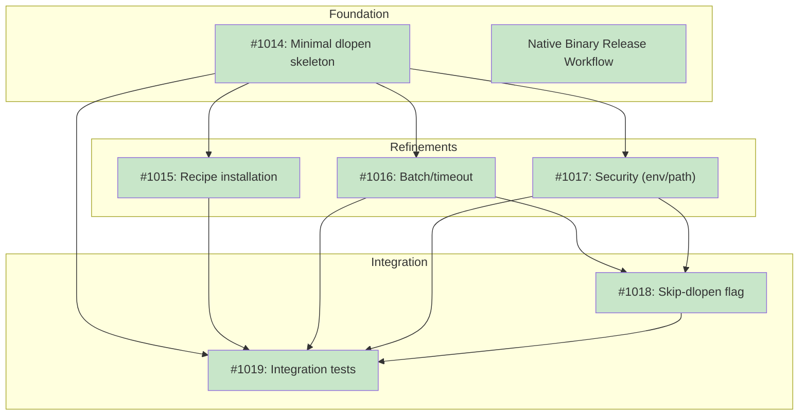

# DESIGN: dlopen Load Testing for Library Verification (Level 3)

**Status:** Planned

## Implementation Issues

### Milestone: [Library Verification Level 3 (dlopen)](https://github.com/tsukumogami/tsuku/milestone/39)

| Issue | Title | Dependencies | Tier |
|-------|-------|--------------|------|
| [#1014](https://github.com/tsukumogami/tsuku/issues/1014) | feat(verify): add minimal dlopen verification skeleton | None | testable |
| [#1015](https://github.com/tsukumogami/tsuku/issues/1015) | feat(verify): add tsuku-dltest recipe for helper installation | [#1014](https://github.com/tsukumogami/tsuku/issues/1014) | testable |
| [#1016](https://github.com/tsukumogami/tsuku/issues/1016) | feat(verify): add batch processing and timeout handling | [#1014](https://github.com/tsukumogami/tsuku/issues/1014) | testable |
| [#1017](https://github.com/tsukumogami/tsuku/issues/1017) | feat(verify): add environment sanitization and path validation | [#1014](https://github.com/tsukumogami/tsuku/issues/1014) | critical |
| [#1018](https://github.com/tsukumogami/tsuku/issues/1018) | feat(verify): add --skip-dlopen flag and fallback behavior | [#1014](https://github.com/tsukumogami/tsuku/issues/1014), [#1016](https://github.com/tsukumogami/tsuku/issues/1016), [#1017](https://github.com/tsukumogami/tsuku/issues/1017) | testable |
| [#1019](https://github.com/tsukumogami/tsuku/issues/1019) | test(verify): add integration tests for dlopen verification | [#1014](https://github.com/tsukumogami/tsuku/issues/1014), [#1015](https://github.com/tsukumogami/tsuku/issues/1015), [#1016](https://github.com/tsukumogami/tsuku/issues/1016), [#1017](https://github.com/tsukumogami/tsuku/issues/1017), [#1018](https://github.com/tsukumogami/tsuku/issues/1018) | testable |
| ~~[Native Binary Release Workflow](https://github.com/tsukumogami/tsuku/milestone/43)~~ | ~~Design and implement native binary release process~~ | ~~None~~ | ~~milestone~~ |

### Dependency Graph



**Legend**: Green = done, Blue = ready, Yellow = blocked, Purple = needs-design

## Upstream Design Reference

This design implements Level 3 (Load Test) from [DESIGN-library-verification.md](DESIGN-library-verification.md).

**Relevant sections:**
- Solution Architecture: Level 3 specification (~1ms, dlopen via helper binary)
- Helper Binary Design: Batched verification, JSON output, embedded checksums
- Security Considerations: Execution Isolation (dlopen executes library initialization code)
- Fallback Behavior: Graceful degradation when helper unavailable

## Context and Problem Statement

Levels 1-2 of tsuku's library verification can identify structural problems (corrupt headers, missing dependencies) but can't definitively answer "will this library actually load?" A library might pass header validation and have all dependencies resolved, yet still fail when the dynamic linker attempts to load it:

- Linker version incompatibilities not caught by PT_INTERP validation
- Corrupted code sections (header parsing doesn't read code)
- Runtime-only link failures (symbol versioning, TLS issues)

The only way to confirm a library will work is to ask the dynamic linker to load it. The `dlopen()` system call does exactly this—it performs all the same resolution and relocation that happens when a process starts.

**Why a helper binary?**

Tsuku is built with `CGO_ENABLED=0` to avoid C library dependencies and simplify distribution. But `dlopen()` is a C library function that requires cgo. Rather than compromise the main binary, we use a small helper (`tsuku-dltest`) that's installed on first use.

**Security implications:**

When `dlopen()` loads a library, it executes initialization code:
- ELF: `.init` sections, `DT_INIT` function
- Mach-O: `__mod_init_func` sections
- Both: C++ global constructors, `__attribute__((constructor))` functions

This means Level 3 verification executes code from the libraries being verified. The design must address this through process isolation, user opt-out, and trust chain verification.

### Scope

**In scope:**
- Helper binary architecture and JSON protocol
- Trust chain verification (embedded checksums)
- Invocation protocol with timeout handling
- Fallback behavior when helper is unavailable
- User opt-out via `--skip-dlopen`
- Error handling and reporting

**Out of scope:**
- Levels 1, 2, or 4 of verification (covered by their own designs)
- Verification output formatting (covered by umbrella design)
- Installation flow for the helper (follows existing tsuku patterns)
- macOS code signing (documented as future consideration)

## Decision Drivers

- **Security**: Code execution during verification must be isolated and opt-out-able
- **Trust chain**: Helper binary must be verifiable without external network requests
- **Performance**: Batching must reduce overhead for libraries with many files
- **Graceful degradation**: Missing helper shouldn't block verification entirely
- **Cross-platform**: Must work on Linux (glibc/musl) and macOS (arm64/x86_64)
- **Debuggability**: Errors from dlopen must surface clearly to users

## Implementation Context

### Why Not CGO_ENABLED=1 for Main Tsuku?

An alternative to a helper binary is enabling cgo in the main tsuku build. This would simplify the design by eliminating the need for a separate binary. However, it would have significant distribution consequences:

| Concern | CGO_ENABLED=0 (current) | CGO_ENABLED=1 |
|---------|-------------------------|---------------|
| **Glibc version** | N/A (static) | Binary tied to build system's glibc |
| **Alpine/musl support** | Works out of box | Requires separate musl build |
| **Cross-compilation** | Simple (`GOOS=linux GOARCH=amd64`) | Requires C cross-compiler toolchain |
| **Binary portability** | Runs anywhere | "GLIBC_2.XX not found" errors on older systems |
| **Build infrastructure** | Standard Go | Needs musl-gcc or zig for portable builds |

The current tsuku binary is built with `CGO_ENABLED=0` and runs on any Linux system regardless of libc version. Switching to cgo would either limit portability or require complex build infrastructure (musl static linking, zig cross-compiler).

**Verdict**: The helper binary approach keeps the main tsuku distribution simple while isolating native code (dlopen FFI) in a separate, platform-specific binary.

### Existing Helper Binary Pattern

Tsuku already uses the helper binary pattern for nix-portable (`internal/actions/nix_portable.go`). Key patterns to follow:

**Trust chain:**
```go
var nixPortableChecksums = map[string]string{
    "amd64": "b409c55904c909ac3aeda3fb1253319f86a89ddd1ba31a5dec33d4a06414c72a",
    "arm64": "af41d8defdb9fa17ee361220ee05a0c758d3e6231384a3f969a314f9133744ea",
}
```

Checksums are embedded in source code, requiring a code change (and review) to update the helper.

**Installation flow:**
1. Check if helper exists at expected path
2. If not, download from GitHub releases
3. Verify SHA256 checksum before execution
4. Atomic rename to prevent partial writes
5. File locking prevents concurrent download races

**Version tracking:**
```go
versionPath := filepath.Join(internalDir, "version")
if string(versionData) == nixPortableVersion {
    return path, nil  // Already have correct version
}
```

### dlopen Semantics

The `dlopen()` function performs these steps:
1. Locate the library file (or use provided path)
2. Map the library into memory
3. **Execute initialization code** (`.init`, constructors)
4. Return handle for `dlsym()` lookups

Step 3 is the security concern—initialization code runs with the calling process's privileges. For verification, we only need to know if step 3 succeeds, then immediately `dlclose()`.

**RTLD_LAZY vs RTLD_NOW:**
- `RTLD_LAZY`: Defer symbol resolution until used (faster, but may hide missing symbols)
- `RTLD_NOW`: Resolve all symbols immediately (catches more errors)

For verification, `RTLD_NOW` is preferred to catch symbol resolution failures.

**Critical: dlerror() semantics:**

Per POSIX, `dlerror()` has subtle behavior that must be handled correctly:
1. `dlerror()` returns error from most recent `dlopen/dlsym/dlclose` call
2. Calling `dlerror()` **clears** the error state
3. The returned pointer is to static/thread-local storage that may be overwritten

**Correct pattern:**
```c
// Clear any previous error
dlerror();
void *handle = dlopen(path, RTLD_NOW | RTLD_LOCAL);
char *error = dlerror();  // Capture immediately and clear
if (handle == NULL) {
    // error contains the failure reason (or NULL if unknown)
}
```

**Incorrect pattern (bug):**
```c
void *handle = dlopen(path, RTLD_NOW | RTLD_LOCAL);
if (handle == NULL) {
    char *error = dlerror();  // May contain stale error from previous call!
}
```

The helper MUST:
1. Call `dlerror()` before each `dlopen()` to clear stale errors
2. Copy the error string immediately after `dlerror()` returns
3. Remain single-threaded to avoid thread-local storage races

**dlclose() return value:**

`dlclose()` returns 0 on success, non-zero on failure. Failure typically means:
- Invalid handle
- Library destructor (`DT_FINI`) threw an exception

The helper should check `dlclose()` and report failures, as a library that fails to unload is a red flag.

### Platform Differences

**Linux:**
- `dlopen()` via `-ldl` linkage
- Error messages from `dlerror()`
- Supports `RTLD_LAZY`, `RTLD_NOW`, `RTLD_GLOBAL`, `RTLD_LOCAL`
- glibc vs musl: `dlerror()` returns thread-local on glibc, global (with lock) on musl. Helper works with both since it's single-threaded.
- **glibc version binding**: Binaries link against specific glibc symbols (e.g., `GLIBC_2.34`). Building on ubuntu-latest (glibc 2.35+) may fail on older distros. Release process design should address this.

**macOS:**
- `dlopen()` built into libSystem (no separate libdl, no `-ldl` needed)
- Same API as Linux
- Handles dyld shared cache transparently
- System Integrity Protection (SIP) strips `DYLD_*` variables for system binaries, but doesn't affect user-installed helpers in `$TSUKU_HOME`
- **Gatekeeper**: Unsigned binaries trigger security warnings. Users must right-click > Open or run `xattr -d com.apple.quarantine`. Release process design should address code signing.

### Language Choice for Helper Binary

Since the helper is a separate binary with a JSON interface, any language can implement it. The helper logic is minimal (~50 lines): call dlopen, capture dlerror, output JSON.

| Language | Binary Size | Cross-Compilation | Memory Safety | New Toolchain |
|----------|-------------|-------------------|---------------|---------------|
| **Rust** | ~400KB | Excellent (cross-rs) | Yes | Yes |
| **Go+cgo** | ~5MB | Broken (requires native runners) | Yes | No |
| **C** | ~10KB | Requires platform toolchains | Manual | No |

**Decision: Rust**

After expert review, Rust is the clear choice for this helper:

**Why Rust over Go+cgo:**
- CGO cross-compilation doesn't work in practice. Building darwin-arm64 from Linux requires osxcross and macOS SDK (legally available only on macOS). Go+cgo would require 4 native CI runners regardless.
- The Go+cgo code has subtle bugs: `dlerror()` returns thread-local storage that can be clobbered if Go's runtime schedules anything between `dlopen` failure and `dlerror` call. Requires explicit `runtime.LockOSThread()` and careful sequencing.
- 5MB binary for 50 lines of logic is excessive. Rust's 400KB includes everything needed.

**Why Rust over C:**
- Rust's `CString` handles null-byte validation and automatic deallocation (RAII)
- Memory safety for dlopen/dlerror sequencing is enforced by the type system
- No manual memory management for error strings

**What Rust adds to the repo:**
- `cmd/tsuku-dltest/Cargo.toml` and `src/` directory
- CI needs `cargo` installed (via rustup action)
- Separate build step in release workflow

This is acceptable because:
- The helper is isolated in its own directory
- Release workflow already builds 4 platform binaries
- GitHub provides free native runners for all 4 platforms (including ARM64 Linux for public repos)

### Anti-patterns to Avoid

- **Shelling out to ldd**: Security risk—ldd executes the binary's `.init` sections
- **Trying dlopen in tsuku directly**: Would require CGO_ENABLED=1
- **Unbounded batching**: Process memory grows with loaded libraries; need batch size limits
- **Ignoring dlerror()**: The error string contains the actual failure reason
- **Not clearing dlerror() before dlopen()**: Can report stale errors from previous calls
- **Ignoring dlclose() return value**: A library that fails to unload is worth reporting
- **Multi-threading**: dlerror() uses thread-local storage; concurrent dlopen calls corrupt error state

## Considered Options

### Decision 1: How to Invoke dlopen

#### Option 1A: Dedicated Helper Binary (tsuku-dltest)

Build a minimal Rust binary that accepts library paths and returns dlopen results. Distributed as GitHub release assets with checksums verified via tsuku's recipe system.

**Pros:**
- Full control over behavior, error messages, and output format
- Memory-safe FFI bindings (Rust's libc crate)
- Correct dlerror() handling enforced by type system
- Small binary (~400KB)
- Can be versioned and updated with tsuku releases
- No external dependencies at runtime

**Cons:**
- Requires building and distributing 4 binaries (linux-amd64, linux-arm64, darwin-amd64, darwin-arm64)
- Users must download helper on first use
- Helper binary updates require tsuku release
- Adds Rust toolchain to release workflow

#### Option 1B: Python ctypes Fallback

Use Python's ctypes module to call dlopen if available, falling back to skipping Level 3 if Python isn't installed.

**Pros:**
- No binary distribution needed
- Python is commonly available
- Already has cross-platform dlopen bindings

**Cons:**
- Python version differences (2 vs 3, ctypes API changes)
- Python may not be installed in minimal environments
- Slower startup time (~100ms vs ~5ms)
- Less control over error handling

#### Option 1C: CGO_ENABLED=1 for Main Tsuku

Enable cgo in the main tsuku build and call dlopen directly.

**Pros:**
- Simplest implementation (no IPC, no helper binary)
- No additional downloads or trust chain concerns
- Verification always available

**Cons:**
- Would require musl static linking or per-glibc-version builds
- Cross-compilation becomes complex (needs C cross-compiler)
- Alpine/older Linux support would need separate builds
- Increases main binary size and build complexity

### Decision 2: Communication Protocol

#### Option 2A: JSON over stdout

Helper accepts paths as arguments, outputs JSON array of results to stdout.

```json
[
  {"path": "/path/to/lib.so", "ok": true},
  {"path": "/path/to/broken.so", "ok": false, "error": "undefined symbol: foo"}
]
```

**Pros:**
- Human-readable for debugging
- Easy to parse in Go (`encoding/json`)
- Extensible (can add fields without breaking compatibility)
- Standard pattern for CLI tools

**Cons:**
- Slightly larger output than binary format
- JSON parsing adds ~100us overhead (negligible)

#### Option 2B: Exit Codes Only

Exit 0 if all libraries load, non-zero otherwise. No detailed output.

**Pros:**
- Simplest possible implementation
- No parsing needed

**Cons:**
- Can't identify which library failed in a batch
- Can't report error messages
- Not debuggable

#### Option 2C: Line-Based Text

One line per library: `OK /path/to/lib.so` or `FAIL /path/to/lib.so: error message`

**Pros:**
- Human-readable
- Streamable (can process as output arrives)

**Cons:**
- Fragile parsing (what if error message contains newlines?)
- Less structured than JSON
- Harder to extend

### Decision 3: Batching Strategy

#### Option 3A: Multiple Paths Per Invocation

Accept multiple library paths as command-line arguments, verify all in one process.

**Pros:**
- Reduces process spawn overhead (2-5ms per invocation)
- Much faster for libraries with many files (Qt: ~50 dylibs)
- Single IPC round-trip

**Cons:**
- If one library crashes the helper, partial results are lost
- Memory usage grows with batch size (libraries stay loaded until dlclose)
- Need to decide batch size limit

#### Option 3B: One Path Per Invocation

Spawn helper once per library file.

**Pros:**
- Maximum isolation (crash affects only one result)
- Simple implementation
- Predictable memory usage

**Cons:**
- Slow for many files (50 files × 5ms = 250ms vs ~10ms batched)
- More process spawning overhead

### Evaluation Against Decision Drivers

| Option | Security | Trust Chain | Performance | Graceful Degradation | Cross-Platform | Debuggability |
|--------|----------|-------------|-------------|----------------------|----------------|---------------|
| **1A: Helper binary** | Good (isolated) | Good (embedded checksums) | Good | Good (skip if unavailable) | Good (4 builds) | Good |
| **1B: Python ctypes** | Fair (Python risk) | N/A | Poor (~100ms startup) | Fair (Python may not exist) | Good | Fair |
| **1C: CGO in tsuku** | Good | N/A | Excellent | Excellent (always available) | Poor (build complexity) | Good |
| **2A: JSON stdout** | N/A | N/A | Good | N/A | Good | Excellent |
| **2B: Exit codes** | N/A | N/A | Excellent | N/A | Good | Poor |
| **2C: Line-based** | N/A | N/A | Good | N/A | Good | Fair |
| **3A: Batched** | Fair (batch crash) | N/A | Excellent | N/A | Good | Good |
| **3B: Per-file** | Excellent | N/A | Poor | N/A | Good | Good |

### Uncertainties

- **Batch size limits**: Need to respect ARG_MAX (~128KB-2MB depending on OS). With 256-byte average paths, that's 500-8000 libraries per batch. Will use conservative default (50 libraries) with option to tune.
- **macOS Gatekeeper**: Unsigned binaries may trigger security warnings on macOS. Code signing may be needed for good UX.
- **Helper binary size**: Expected ~400KB for release Rust binary with LTO and stripping.
- **dlopen memory behavior**: Some libraries may not fully unload on dlclose, causing memory growth across batches.
- **Environment inheritance**: Unclear whether helper should inherit tsuku's environment or run in a clean environment. Libraries with `$ORIGIN` dependencies need the former.
- **Timeout edge cases**: A library taking 4.9 seconds to initialize will succeed, but is that good? Users may want tighter timeouts for faster feedback.

## Decision Outcome

**Chosen: 1A (Helper Binary in Rust) + 2A (JSON Protocol) + 3A (Batched)**

A dedicated Rust helper binary with JSON output and batched invocation provides the best balance of security, performance, and debuggability while maintaining tsuku's simple distribution model.

### Rationale

**Helper binary (1A) chosen because:**
- Preserves tsuku's `CGO_ENABLED=0` build simplicity and portability
- Process isolation comes free (separate process means crashes don't affect tsuku)
- Trust chain verification through recipe-based installation with version pin

**Rust chosen for helper because:**
- Memory-safe dlopen bindings with RAII (no manual C.free() calls)
- Correct dlerror() handling enforced by type system
- ~400KB binary vs 5MB for Go+cgo
- No global error state race conditions (unlike Go+cgo with dlerror())

**Python ctypes (1B) rejected because:**
- Python availability varies (minimal containers, CI environments)
- ~100ms startup time adds up for many libraries
- Version differences create support burden

**CGO in main tsuku (1C) rejected because:**
- Would require musl static linking or zig cross-compiler for portability
- Complicates the main binary build for a single feature
- Existing CGO_ENABLED=0 policy serves the project well

**JSON protocol (2A) chosen because:**
- Extensible without breaking compatibility (can add fields)
- Human-readable for debugging failed verifications
- serde_json is mature and well-tested

**Batching (3A) chosen because:**
- 50 libraries × 5ms = 250ms unbatched vs ~10ms batched
- Crash risk acceptable with reasonable batch limits
- Memory issues mitigated by dlclose after each library

### Trade-offs Accepted

- **Helper download on first use**: Users need network access to download ~400KB binary. Acceptable because verification is not a critical path and tsuku already downloads tools.
- **Helper binary maintenance**: Requires building 4 platform-specific binaries. Acceptable because the helper is small and changes rarely.
- **Batch crash risk**: If a library crashes the helper, partial results are lost. Acceptable because crashes are rare and can be retried with smaller batches.
- **5-second timeout**: Some legitimate libraries may take longer to initialize. Acceptable because users can retry with `--skip-dlopen` if needed.

## Solution Architecture

### Overview

```
┌─────────────────────────────────────────────────────────────────┐
│                    tsuku verify <library>                        │
│                    [--skip-dlopen] [--integrity]                 │
├─────────────────────────────────────────────────────────────────┤
│  Level 1: Header Validation (Tier 1 design)                      │
│  Level 2: Dependency Check (Tier 2 design)                       │
├─────────────────────────────────────────────────────────────────┤
│  Level 3: Load Test [this design]                                │
│  ┌─────────────────────────────────────────────────────────┐    │
│  │ 1. Check if helper available                             │    │
│  │    └─ If not: download, verify checksum, install         │    │
│  │ 2. Batch library paths (max 50 per invocation)           │    │
│  │ 3. Invoke helper with timeout (5 seconds)                │    │
│  │ 4. Parse JSON results, report per-library status         │    │
│  └─────────────────────────────────────────────────────────┘    │
├─────────────────────────────────────────────────────────────────┤
│  Level 4: Integrity Check (Tier 4 design)                        │
└─────────────────────────────────────────────────────────────────┘

                              │
                              │ exec with timeout
                              ▼
┌─────────────────────────────────────────────────────────────────┐
│                    tsuku-dltest helper                           │
│                    (Rust binary with libc FFI)                   │
├─────────────────────────────────────────────────────────────────┤
│  Input: library paths as command-line arguments                  │
│  Output: JSON array to stdout                                    │
│                                                                 │
│  For each path:                                                  │
│    1. dlopen(path, RTLD_NOW | RTLD_LOCAL)                       │
│    2. If success: dlclose(handle)                               │
│    3. If failure: capture dlerror() message                     │
│    4. Append result to output array                             │
│                                                                 │
│  Exit codes:                                                     │
│    0: All libraries loaded successfully                          │
│    1: At least one library failed                               │
│    2: Usage error (no paths provided)                           │
└─────────────────────────────────────────────────────────────────┘
```

### Helper Binary Protocol

**Input**: Library paths as command-line arguments

```bash
tsuku-dltest /path/to/lib1.so /path/to/lib2.so /path/to/lib3.so
```

**Output**: JSON array to stdout

```json
[
  {"path": "/path/to/lib1.so", "ok": true},
  {"path": "/path/to/lib2.so", "ok": true},
  {"path": "/path/to/lib3.so", "ok": false, "error": "libfoo.so: cannot open shared object file"}
]
```

**JSON Schema**:

```json
{
  "$schema": "http://json-schema.org/draft-07/schema#",
  "type": "array",
  "items": {
    "type": "object",
    "required": ["path", "ok"],
    "properties": {
      "path": {"type": "string", "description": "Absolute path to library"},
      "ok": {"type": "boolean", "description": "True if dlopen succeeded"},
      "error": {"type": "string", "description": "Error message from dlerror() if ok=false"}
    }
  }
}
```

**Exit codes**:
- `0`: All libraries loaded successfully (every result has `ok: true`)
- `1`: At least one library failed to load (at least one `ok: false`)
- `2`: Usage error (e.g., no paths provided, invalid arguments)

**Version protocol**: Helper outputs version on stderr when run with `--version`:

```bash
$ tsuku-dltest --version
tsuku-dltest v1.0.0
```

### Trust Chain Verification

The helper is installed via tsuku's standard recipe system, but with a version pin embedded in tsuku's source code:

```go
// internal/verify/dltest.go

// pinnedDltestVersion is updated with each tsuku release
// to ensure helper version matches tsuku version
var pinnedDltestVersion = "v1.0.0"
```

**Recipe**: `recipes/t/tsuku-dltest.toml` (part of the standard registry)

```toml
[metadata]
name = "tsuku-dltest"
description = "dlopen verification helper for tsuku verify"
homepage = "https://github.com/tsukumogami/tsuku"
# Internal tool, not listed in search results
internal = true

[version]
provider = "github-release"
owner = "tsukumogami"
repo = "tsuku"
asset_pattern = "tsuku-dltest-{os}-{arch}"

[[steps]]
action = "download"
url = "https://github.com/tsukumogami/tsuku/releases/download/{version}/tsuku-dltest-{os}-{arch}"
checksum = "{checksums.tsuku-dltest-{os}-{arch}}"
checksum_algo = "sha256"

[[steps]]
action = "chmod"
path = "tsuku-dltest-{os}-{arch}"
mode = "755"

[[steps]]
action = "install_binaries"
files = ["tsuku-dltest-{os}-{arch}"]
rename = { "tsuku-dltest-{os}-{arch}" = "tsuku-dltest" }
```

**Installation flow**:

1. Check if `tsuku-dltest` is installed with correct version (`pinnedDltestVersion`)
2. If not installed or version mismatch:
   - Call `tsuku install tsuku-dltest@{pinnedDltestVersion}` internally
   - This uses the standard recipe flow with checksum verification
3. Return path to installed helper

```go
func EnsureDltest() (string, error) {
    // Check current installation
    installed, version := state.GetToolVersion("tsuku-dltest")
    if installed && version == pinnedDltestVersion {
        return state.GetToolPath("tsuku-dltest"), nil
    }

    // Install pinned version using standard recipe flow
    if err := install.InstallTool("tsuku-dltest", pinnedDltestVersion); err != nil {
        return "", fmt.Errorf("failed to install tsuku-dltest: %w", err)
    }

    return state.GetToolPath("tsuku-dltest"), nil
}
```

**Why recipe-based installation:**
- Uses existing checksum verification infrastructure
- Follows standard installation patterns (symlinks, state.json tracking)
- Recipe can be inspected by users (`tsuku info tsuku-dltest`)
- Checksums are in release checksums.txt file (standard pattern)

**Why pinned version in tsuku:**
- Ensures helper version matches tsuku version (security-critical)
- Version pin is updated in same release workflow that publishes helper
- Users can't accidentally use mismatched versions

**Compatibility guarantee:** The helper API is versioned. Breaking changes require:
1. New major version of helper
2. Updated version pin in tsuku
3. Simultaneous release of both

### Invocation Protocol

```go
func invokeHelper(ctx context.Context, paths []string, tsukuHome string) ([]DlopenResult, error) {
    // Validate paths are within $TSUKU_HOME/libs/
    for _, p := range paths {
        canonical, err := filepath.EvalSymlinks(p)
        if err != nil || !strings.HasPrefix(canonical, filepath.Join(tsukuHome, "libs")) {
            return nil, fmt.Errorf("invalid library path: %s", p)
        }
    }

    helperPath, err := ensureHelper()
    if err != nil {
        return nil, fmt.Errorf("helper unavailable: %w", err)
    }

    // Create context with timeout
    ctx, cancel := context.WithTimeout(ctx, 5*time.Second)
    defer cancel()

    cmd := exec.CommandContext(ctx, helperPath, paths...)

    // Build sanitized environment
    cmd.Env = sanitizeEnvForHelper(tsukuHome)

    var stdout, stderr bytes.Buffer
    cmd.Stdout = &stdout
    cmd.Stderr = &stderr

    err = cmd.Run()

    if ctx.Err() == context.DeadlineExceeded {
        return nil, fmt.Errorf("helper timed out after 5 seconds")
    }

    // Parse JSON even on non-zero exit (may have partial results)
    var results []DlopenResult
    if err := json.Unmarshal(stdout.Bytes(), &results); err != nil {
        return nil, fmt.Errorf("failed to parse helper output: %w", err)
    }

    return results, nil
}

// sanitizeEnvForHelper creates a safe environment for the helper.
// Strips dangerous loader variables while preserving necessary paths.
func sanitizeEnvForHelper(tsukuHome string) []string {
    // Variables that allow code injection or information leakage - MUST be stripped
    dangerous := map[string]bool{
        // Linux ld.so injection vectors
        "LD_PRELOAD": true, "LD_AUDIT": true, "LD_DEBUG": true,
        "LD_DEBUG_OUTPUT": true, "LD_PROFILE": true, "LD_PROFILE_OUTPUT": true,
        // macOS dyld injection vectors
        "DYLD_INSERT_LIBRARIES": true, "DYLD_FORCE_FLAT_NAMESPACE": true,
        "DYLD_PRINT_LIBRARIES": true, "DYLD_PRINT_LIBRARIES_POST_LAUNCH": true,
    }

    var env []string
    for _, e := range os.Environ() {
        key := strings.SplitN(e, "=", 2)[0]
        if !dangerous[key] {
            env = append(env, e)
        }
    }

    // Ensure tsuku libs are in search path
    libsDir := filepath.Join(tsukuHome, "libs")
    env = append(env, fmt.Sprintf("LD_LIBRARY_PATH=%s:%s",
        libsDir, os.Getenv("LD_LIBRARY_PATH")))
    env = append(env, fmt.Sprintf("DYLD_LIBRARY_PATH=%s:%s",
        libsDir, os.Getenv("DYLD_LIBRARY_PATH")))

    return env
}
```

**Environment sanitization**: The helper runs with a sanitized environment:
- **Stripped (Linux)**: `LD_PRELOAD`, `LD_AUDIT`, `LD_DEBUG`, `LD_DEBUG_OUTPUT`, `LD_PROFILE`, `LD_PROFILE_OUTPUT` (code injection and information leakage vectors)
- **Stripped (macOS)**: `DYLD_INSERT_LIBRARIES`, `DYLD_FORCE_FLAT_NAMESPACE`, `DYLD_PRINT_LIBRARIES`, `DYLD_PRINT_LIBRARIES_POST_LAUNCH`
- **Preserved**: `LD_LIBRARY_PATH`, `DYLD_LIBRARY_PATH` (needed for dependency resolution)
- **Added**: `$TSUKU_HOME/libs` prepended to library paths

**Path validation**: All library paths are canonicalized via `filepath.EvalSymlinks()` and verified to be within `$TSUKU_HOME/libs/`. This prevents:
- Path traversal attacks (`../../../etc/malicious.so`)
- Symlink escapes pointing outside the install directory

### Batch Size Limits

Default batch size: 50 libraries per invocation

**Rationale**:
- ARG_MAX is typically 128KB-2MB
- 50 paths × 256 bytes average = 12.8KB (well under limit)
- 50 libraries × ~200KB average memory = 10MB (acceptable)
- If batch crashes, max loss is 50 results (retryable)

For libraries with >50 files, split into multiple batches and aggregate results.

### Fallback Behavior

| Scenario | Behavior |
|----------|----------|
| Helper not installed | Attempt download; if fails, skip Level 3 with warning |
| Checksum mismatch | Error: "helper binary checksum verification failed, refusing to execute" |
| Helper times out | Error: "load test timed out" for affected batch |
| Helper crashes | Retry batch in smaller chunks; if still fails, report crash |
| `--skip-dlopen` flag | Skip Level 3 entirely, no warning |
| Network unavailable | Skip Level 3 with warning: "helper unavailable, skipping load test" |

**Warning message format**:

```
Warning: tsuku-dltest helper not available, skipping load test
  Run 'tsuku install tsuku-dltest' to enable full verification
```

## Implementation Approach

### Step 1: Helper Binary (Rust)

Create `cmd/tsuku-dltest/Cargo.toml`:

```toml
[package]
name = "tsuku-dltest"
version = "1.0.0"
edition = "2021"

[dependencies]
libc = "0.2"
serde = { version = "1.0", features = ["derive"] }
serde_json = "1.0"

[profile.release]
opt-level = "z"      # Optimize for size
lto = true           # Link-time optimization
strip = true         # Strip symbols
panic = "abort"      # Smaller panic handling
```

Create `cmd/tsuku-dltest/src/main.rs`:

```rust
use libc::{c_void, dlclose, dlerror, dlopen, RTLD_LOCAL, RTLD_NOW};
use serde::Serialize;
use std::env;
use std::ffi::{CStr, CString};
use std::io::{self, Write};
use std::process::ExitCode;

#[derive(Serialize)]
struct Output {
    path: String,
    ok: bool,
    #[serde(skip_serializing_if = "Option::is_none")]
    error: Option<String>,
}

fn main() -> ExitCode {
    let args: Vec<String> = env::args().skip(1).collect();

    if args.is_empty() {
        eprintln!("usage: tsuku-dltest <path>...");
        return ExitCode::from(2);
    }

    if args.len() == 1 && args[0] == "--version" {
        eprintln!("tsuku-dltest v1.0.0");
        return ExitCode::from(0);
    }

    let mut all_ok = true;
    let mut results = Vec::with_capacity(args.len());

    for path in &args {
        let result = match try_load(path) {
            Ok(()) => Output { path: path.clone(), ok: true, error: None },
            Err(e) => {
                all_ok = false;
                Output { path: path.clone(), ok: false, error: Some(e) }
            }
        };
        results.push(result);
    }

    serde_json::to_writer(io::stdout(), &results).unwrap();
    io::stdout().flush().unwrap();

    if all_ok { ExitCode::from(0) } else { ExitCode::from(1) }
}

/// Attempt to load a library with dlopen, then immediately unload it.
fn try_load(path: &str) -> Result<(), String> {
    let c_path = CString::new(path)
        .map_err(|_| "path contains null byte".to_string())?;

    unsafe {
        // Clear any previous error (critical for correct error reporting)
        dlerror();

        let handle = dlopen(c_path.as_ptr(), RTLD_NOW | RTLD_LOCAL);

        if handle.is_null() {
            let err = dlerror();
            if err.is_null() {
                return Err("dlopen failed with unknown error".to_string());
            }
            return Err(CStr::from_ptr(err).to_string_lossy().into_owned());
        }

        // Check dlclose return value - failure is worth reporting
        if dlclose(handle) != 0 {
            let err = dlerror();
            if !err.is_null() {
                return Err(format!("dlclose failed: {}",
                    CStr::from_ptr(err).to_string_lossy()));
            }
        }
    }

    Ok(())
}
```

**Build**: `cargo build --release` (produces `target/release/tsuku-dltest`)

All 4 platforms build natively on GitHub Actions runners (including `ubuntu-24.04-arm` for Linux ARM64).

### Step 2: Trust Chain Module

Create `internal/verify/dltest.go`:

- `EnsureDltest()` - download and verify helper if needed
- `ResolveDltest()` - return path if installed
- Embedded checksums and version constant

### Step 3: Invocation Module

Add to `internal/verify/dltest.go`:

- `InvokeDltest(paths []string) ([]DlopenResult, error)`
- Batch splitting logic
- Timeout handling
- JSON parsing

### Step 4: Integration

Modify `internal/verify/library.go`:

- Call `InvokeDltest()` in Level 3 phase
- Handle `--skip-dlopen` flag
- Handle fallback when helper unavailable

### Step 5: Build Infrastructure

**IMPORTANT: This design requires a separate release process design.**

The helper binary cannot be cross-compiled via goreleaser. CGO cross-compilation from Linux to macOS requires osxcross and the macOS SDK, which is legally available only on macOS hardware. Similarly, Rust's cross-rs cannot cross-compile to macOS from Linux due to SDK licensing.

**Required: Native matrix runners**

The release workflow must build on native runners for each platform:

| Platform | Runner | Toolchain |
|----------|--------|-----------|
| linux-amd64 | ubuntu-latest | rustup |
| linux-arm64 | ubuntu-24.04-arm | rustup |
| darwin-amd64 | macos-13 | rustup |
| darwin-arm64 | macos-latest | rustup |

**Note:** GitHub provides free ARM64 Linux runners for public repos (`ubuntu-24.04-arm`), so all 4 platforms can build natively. cross-rs is not required.

**Blocking dependency:** A separate design document is required to define:
1. Multi-runner release workflow structure
2. Artifact aggregation from parallel builds
3. Draft release + finalize pattern (don't publish partial releases)
4. Version pin injection via ldflags (not source modification)
5. Integration test before finalizing release
6. glibc version considerations (build on ubuntu-20.04 for broader compatibility)
7. macOS code signing strategy (Gatekeeper warnings without it)

See "Consequences" section for the blocking issue.

### Step 6: Release Workflow (High-Level)

**This section is intentionally high-level.** The detailed workflow is out of scope for this design and will be specified in the release process design.

**Release structure:**

```
1. [build-dltest] Build helper on matrix runners (parallel)
   - linux-amd64: ubuntu-latest, cargo build --release
   - linux-arm64: ubuntu-24.04-arm, cargo build --release
   - darwin-amd64: macos-13, cargo build --release
   - darwin-arm64: macos-latest, cargo build --release

2. [build-tsuku] Build main binary with goreleaser (existing workflow)

3. [integration-test] Test tsuku + dltest together
   - Verify trust chain works
   - Run dltest on real library

4. [publish] Upload all assets to draft release

5. [finalize] Mark release as published (only if all succeed)
```

**Version pin via ldflags (not source modification):**

```go
// internal/verify/dltest.go
var pinnedDltestVersion = "dev"  // Injected at build time
```

```yaml
ldflags:
  - -X github.com/tsukumogami/tsuku/internal/verify.pinnedDltestVersion={{.Version}}
```

This avoids modifying source during release, preserving reproducibility.

**Pre-release testing:**

1. **Local testing**: Build helper with `cargo build --release`, then:
   ```bash
   TSUKU_DLTEST_PATH=./target/release/tsuku-dltest ./tsuku verify gcc-libs
   ```

2. **CI integration tests**: Use `TSUKU_DLTEST_PATH` environment variable to override.

3. **Dev version bypass**: When `pinnedDltestVersion == "dev"`, accept any installed version.

4. **Pre-release tags**: `v1.0.0-rc.1` triggers full release workflow, publishes as pre-release.

### Step 7: Tests

- Unit tests for JSON parsing (Go side)
- Integration tests invoking the Rust helper on real libraries
- Timeout behavior tests
- Fallback behavior tests
- Release workflow tests (checksum generation, version pin injection)

## Blocking Dependencies

This design cannot be fully implemented until the following design is completed:

### DESIGN-release-workflow-native.md (Required)

**Problem:** The current release workflow uses goreleaser with CGO_ENABLED=0, cross-compiling from a single ubuntu-latest runner. Adding a Rust helper binary (or any native binary) requires a fundamentally different approach with native matrix runners.

**Scope:**
- Multi-runner CI matrix (linux-amd64, linux-arm64, darwin-amd64, darwin-arm64)
- Artifact aggregation from parallel build jobs
- Draft release pattern (don't publish until all builds succeed)
- Version pin injection via ldflags
- Integration test gate before release finalization
- glibc version compatibility strategy (ubuntu-20.04 vs ubuntu-latest)
- macOS code signing and notarization (Gatekeeper warnings without it)

**Why blocking:** Without this design, the helper binary cannot be released. The current goreleaser configuration cannot produce native macOS binaries from Linux runners.

**Issue tracking:** Create a `needs-design` issue for this work when transitioning to Planned status.

## Consequences

### Positive

- **Definitive "does it load?" answer**: dlopen is what the OS uses; if it works here, it'll work at runtime
- **Process isolation for free**: Crashes in library initialization don't affect tsuku
- **Preserves distribution simplicity**: Main tsuku binary stays CGO_ENABLED=0
- **Batched performance**: ~10ms for 50 libraries vs ~250ms unbatched
- **Debuggable errors**: JSON output includes actual dlerror() messages
- **User opt-out**: `--skip-dlopen` for paranoid users or CI pipelines
- **Graceful degradation**: Verification works (Levels 1-2) even without helper

### Negative

- **First-use download**: Users must download ~400KB helper on first verification
- **4 platform builds**: Requires multi-runner CI matrix (release process design needed)
- **Library code execution**: Initialization code runs during verification (mitigated by isolation and opt-out)
- **5-second timeout**: May be too short for some legitimate libraries
- **Blocking dependency**: Cannot implement until release process design is complete
- **Rust toolchain in CI**: Release workflow needs rustup and cargo

### Mitigations

| Negative | Mitigation |
|----------|------------|
| First-use download | Cache in `$TSUKU_HOME/tools/`; only needed once per version |
| 4 platform builds | Release process design will define CI matrix |
| Code execution | Process isolation, user opt-out, timeout limit |
| Timeout too short | Users can skip with `--skip-dlopen` and verify manually |
| Blocking dependency | Release process design is well-scoped; can proceed in parallel |
| Rust toolchain in CI | Single `actions/setup-rust` step; toolchain is stable |

## Security Considerations

This section addresses the security checklist from issue #949. Level 3 verification is security-sensitive because it executes code during `dlopen()`.

### Download Verification (Helper Binary Trust Chain)

The `tsuku-dltest` helper is installed via tsuku's standard recipe system with a pinned version.

**Verification mechanism:**
1. Version pin (`pinnedDltestVersion`) is embedded in tsuku source code
2. Recipe specifies checksums from release `checksums.txt` file
3. Standard recipe checksum verification runs before execution
4. Verification failure aborts with error (fail closed)

**Why version-pinned recipe:**
- Uses existing checksum verification infrastructure
- Version pin updated in same release that publishes helper
- Checksums verified via standard recipe flow (same as all other tools)
- Users can inspect installation via `tsuku info tsuku-dltest`

**Why version pin in source:**
- Ensures helper version matches tsuku version (security-critical)
- Pin is updated atomically in release workflow
- Prevents users from accidentally using mismatched versions

**Failure behavior:**
```
Error: Failed to install tsuku-dltest@v1.2.3
  Checksum verification failed for tsuku-dltest-linux-amd64
  Expected: sha256:abc123...
  Got: sha256:def456...
```

### Execution Isolation

**What code runs during dlopen():**

When `dlopen()` is called, the dynamic linker executes initialization code before returning:

| Platform | Initialization Code |
|----------|---------------------|
| ELF (Linux) | `.init` section, `DT_INIT` function, `DT_INIT_ARRAY` functions |
| Mach-O (macOS) | `__mod_init_func` section entries |
| Both | C++ global constructors, `__attribute__((constructor))` functions |

This code runs with the helper process's privileges (same as tsuku user).

**Mitigations:**

1. **Process isolation**: The helper runs as a separate process. If library initialization crashes, hangs, or behaves maliciously, only the helper process is affected. Tsuku receives an error and can report it without being compromised.

2. **Timeout protection**: 5-second timeout prevents infinite loops or hangs from blocking verification indefinitely.

3. **Only tsuku-installed libraries**: Level 3 verification only tests libraries in `$TSUKU_HOME/libs/`. Users must have already chosen to install these libraries via tsuku.

4. **User opt-out**: `--skip-dlopen` flag allows users to skip Level 3 entirely if they don't want initialization code to execute.

5. **Environment sanitization**: Dangerous environment variables (`LD_PRELOAD`, `LD_AUDIT`, `DYLD_INSERT_LIBRARIES`) are stripped before invoking the helper, preventing code injection via environment.

6. **Path validation**: Library paths are canonicalized and verified to be within `$TSUKU_HOME/libs/`, preventing path traversal attacks.

**User expectation warning**: Level 3 verification is a functional test, not a security scan. "Verification" means "the library loads correctly," not "the library is safe." Users should understand that installed libraries' initialization code will execute during verification.

**What the helper cannot do:**
- Affect tsuku's memory or state (separate process)
- Persist beyond the verification (process exits)
- Access files that tsuku can't already access (same user)

**What the helper can do (residual risk):**
- Execute arbitrary code from the library's initialization sections
- Make network requests, write files, etc. during the ~5 second window
- Crash in ways that might leave partial state

### Supply Chain Risks

**Helper binary source:**
- Built by tsuku's CI (GitHub Actions)
- Published as GitHub release assets
- Same trust model as tsuku itself

**Threat model:**

| Threat | Mitigation |
|--------|------------|
| Compromised GitHub release | Checksums embedded in source; attacker would need to compromise tsuku repo |
| MITM during download | HTTPS only; checksum verification catches modifications |
| Compromised build environment | Same risk as main tsuku binary; use reproducible builds |

**Residual risk**: If an attacker compromises the tsuku repository, they could update both the helper binary and its checksum. This is the same trust level as the main tsuku binary—users already trust the repository.

**Future consideration**: macOS code signing would add an additional verification layer (Apple notarization). Not implemented in this design but documented for future work.

### User Data Exposure

**What the helper accesses:**
- Library files in `$TSUKU_HOME/libs/` (read-only, via dlopen)
- Standard library search paths (read-only)

**What the helper does NOT access:**
- User documents, credentials, or personal data
- Network resources (other than what library initialization might do)
- Tsuku's configuration or state

**Data transmission:**
- No telemetry or external network requests from the helper itself
- Library initialization code may make network requests (out of our control)
- Results returned only via stdout to parent tsuku process

### Security Mitigations Summary

| Risk | Mitigation | Residual Risk |
|------|------------|---------------|
| Malicious helper binary | Embedded checksums, fail-closed verification | Compromised tsuku repo |
| Library runs malicious .init code | Process isolation, timeout, opt-out | 5-second window for code execution |
| Helper crashes tsuku | Separate process, error handling | None (crashes isolated) |
| Helper hangs forever | 5-second timeout | Legitimate slow libraries may fail |
| MITM during helper download | HTTPS, checksum verification | None |
| Privilege escalation | Helper runs as same user as tsuku | None (no escalation) |
| Environment injection (LD_PRELOAD) | Environment sanitization strips dangerous vars | None |
| Path traversal attack | Path canonicalization, $TSUKU_HOME/libs/ validation | None |
| Concurrent download race | File locking during helper install | None |

### Security Checklist Resolution

Per issue #949 requirements:

- [x] **dlopen code execution documented**: See "Execution Isolation" above
- [x] **Helper binary trust chain defined**: Embedded checksums, fail-closed verification
- [x] **Process isolation ensured**: Helper is separate process; crashes don't affect tsuku
- [x] **Timeout handling defined**: 5-second timeout with context cancellation
- [x] **User opt-out mechanism**: `--skip-dlopen` flag documented
