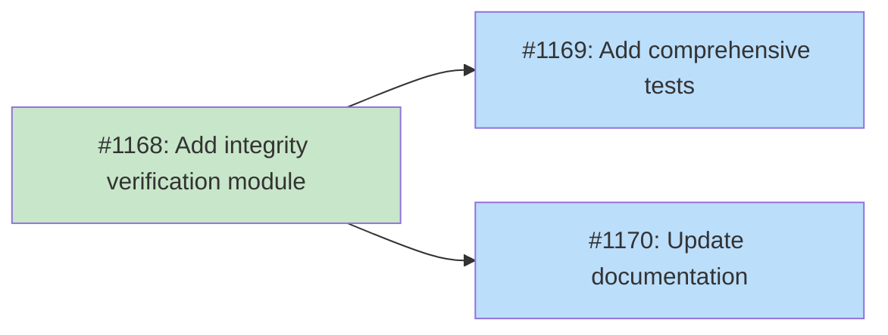

# DESIGN: Library Verification Tier 4 - Integrity Verification

## Status

Planned

## Implementation Issues

### Milestone: [Tier 4 Integrity Verification](https://github.com/tsukumogami/tsuku/milestone/49)

| Issue | Title | Dependencies | Tier |
|-------|-------|--------------|------|
| ~~[#1168](https://github.com/tsukumogami/tsuku/issues/1168)~~ | ~~feat(verify): add integrity verification module for Tier 4~~ | ~~None~~ | ~~testable~~ |
| [#1169](https://github.com/tsukumogami/tsuku/issues/1169) | test(verify): add comprehensive tests for integrity verification | [#1168](https://github.com/tsukumogami/tsuku/issues/1168) | testable |
| [#1170](https://github.com/tsukumogami/tsuku/issues/1170) | docs(verify): update documentation for Tier 4 integrity verification | [#1168](https://github.com/tsukumogami/tsuku/issues/1168) | simple |

### Dependency Graph



**Legend**: Green = done, Blue = ready, Yellow = blocked, Purple = needs-design

## Upstream Design Reference

This design implements Level 4 of the tiered library verification system defined in [DESIGN-library-verification.md](docs/designs/DESIGN-library-verification.md).

**Relevant sections:**
- Solution Architecture: Level 4 - Integrity Check
- Decision Outcome: Optional integrity checking via `--integrity` flag

## Context and Problem Statement

Tiers 1-3 of library verification answer "will this library work?":
- Tier 1 (Header): Is this a valid shared library for the current platform?
- Tier 2 (Dependencies): Can all dependencies be resolved?
- Tier 3 (dlopen): Does the dynamic linker successfully load this library?

None of these detect post-installation modification. A library could be tampered with, corrupted, or replaced, and as long as the resulting file remains a valid, loadable library, Tiers 1-3 would pass.

Tier 4 answers a different question: "is this library unchanged since installation?"

### Why This Matters

Post-installation tampering scenarios include:
- **Malware injection**: Attacker modifies library to inject malicious code
- **Disk corruption**: Storage failure corrupts library files
- **Accidental modification**: User or script accidentally overwrites library
- **Supply chain late-stage attack**: Attacker with filesystem access replaces library

Checksum verification detects all of these by comparing current file contents against values stored at installation time.

### Scope

**In scope:**
- Load stored checksums from `LibraryVersionState.Checksums`
- Recompute SHA256 for library files
- Compare and report mismatches
- Handle pre-existing libraries gracefully
- Handle symlink chains correctly

**Out of scope:**
- Automatic remediation (reinstallation is a separate command)
- Signed checksum storage (future enhancement)
- Periodic automatic verification (future enhancement)
- Verification of non-library files in the library directory
- Verification of externally-managed libraries (see below)

### External Dependencies

Tier 4 **only verifies tsuku-managed libraries** - those installed to `$TSUKU_HOME/libs/`. It does not verify libraries installed by system package managers (apt, dnf, brew, etc.).

When a tsuku-managed library depends on external libraries, the dependency relationship is handled by earlier tiers:
- **Tier 2** discovers and classifies dependencies as system, tsuku-managed, or externally-managed
- **Tier 3** validates the library loads correctly with all dependencies

But Tier 4 integrity verification only applies to files tsuku installed because:
1. External libraries aren't in `$TSUKU_HOME/libs/`
2. They don't have a `LibraryVersionState` in tsuku's state.json
3. Tsuku has no stored checksums to compare against
4. Verifying files tsuku didn't install would be overstepping responsibility

**Users who want integrity verification for external libraries should use their package manager's tools:**
- `dpkg --verify <package>` (Debian/Ubuntu)
- `rpm -V <package>` (Fedora/RHEL)
- `pacman -Qkk <package>` (Arch)
- Homebrew doesn't have built-in verification, but bottles have checksums in formulae

This separation of concerns keeps tsuku focused on what it manages while respecting the system package manager's domain

## Decision Drivers

1. **Consistency**: Follow patterns from binary checksum verification
2. **Performance**: Keep default verification fast; integrity check is opt-in
3. **Clarity**: Output should clearly distinguish "modified" from "corrupted"
4. **Backward compatibility**: Libraries installed before checksum support must work
5. **Security**: Clearly document threat model and limitations

## Considered Options

### Option 1: Checksum All Files in Library Directory

Compute checksums for every file in `$TSUKU_HOME/libs/{name}-{version}/`.

**Pros:**
- Complete coverage
- Detects any modification

**Cons:**
- Slower for libraries with many files
- May include non-library files (READMEs, licenses)
- Inconsistent with how checksums are stored (only library files)

### Option 2: Checksum Only Stored Files (Chosen)

Verify only files that have checksums in `LibraryVersionState.Checksums`.

**Pros:**
- Exact match between stored and verified
- Consistent with installation behavior
- Handles the "new file added" case cleanly (ignored)

**Cons:**
- Files added post-installation are not verified
- Requires installation to have computed checksums

### Option 3: Checksum All .so/.dylib Files

Find all library files in the directory and checksum them.

**Pros:**
- Doesn't depend on stored checksums
- Catches new files

**Cons:**
- What to compare against if file wasn't in original checksums?
- May checksum different files than installation did

## Decision Outcome

**Chosen option: Option 2 - Checksum Only Stored Files**

This approach:
1. Verifies exactly what was installed
2. Handles missing checksums gracefully (pre-existing libraries)
3. Aligns with binary verification patterns from DESIGN-checksum-pinning.md
4. Avoids false positives from legitimately added files

## Solution Architecture

### Data Flow

```
┌─────────────────────────────┐
│   tsuku verify <lib>        │
│      --integrity            │
├─────────────────────────────┤
│  1. Load LibraryVersionState│
│  2. Extract Checksums map   │
│     nil/empty → skip tier 4 │
├─────────────────────────────┤
│  3. For each stored entry:  │
│     - Resolve symlinks      │
│     - Read file contents    │
│     - Compute SHA256        │
│     - Compare to stored     │
├─────────────────────────────┤
│  4. Report results:         │
│     - All match → OK        │
│     - Mismatch → MODIFIED   │
│     - Missing → ERROR       │
│     - No checksums → SKIP   │
└─────────────────────────────┘
```

### State Schema (Existing)

The `LibraryVersionState` already includes checksum storage:

```go
type LibraryVersionState struct {
    UsedBy    []string          `json:"used_by"`
    Checksums map[string]string `json:"checksums,omitempty"` // relative path -> SHA256 hex
    Sonames   []string          `json:"sonames,omitempty"`
}
```

**Key format**: Relative paths from library directory (e.g., `lib/libstdc++.so.6.0.33`)

**Value format**: Hex-encoded SHA256 hash (64 characters)

### Symlink Handling

Library directories often contain symlink chains:
```
libstdc++.so → libstdc++.so.6
libstdc++.so.6 → libstdc++.so.6.0.33
libstdc++.so.6.0.33 (actual file)
```

Checksums are stored only for real files. During verification:
1. For each key in the Checksums map, resolve the full path
2. If the path is a symlink, follow the chain to the real file
3. Checksum the real file content
4. This matches installation behavior where only real files are checksummed

### Component Changes

**New file: `internal/verify/integrity.go`**

```go
package verify

import (
    "crypto/sha256"
    "encoding/hex"
    "fmt"
    "io"
    "os"
    "path/filepath"
)

// IntegrityResult represents the outcome of integrity verification.
type IntegrityResult struct {
    // Verified is the count of files that passed verification.
    Verified int

    // Mismatches contains files where checksums didn't match.
    Mismatches []IntegrityMismatch

    // Missing contains files that no longer exist.
    Missing []string

    // Skipped is true if verification was skipped (no stored checksums).
    Skipped bool

    // Reason explains why verification was skipped.
    Reason string
}

// IntegrityMismatch records a checksum mismatch.
type IntegrityMismatch struct {
    Path     string // Relative path
    Expected string // Stored checksum
    Actual   string // Computed checksum
}

// VerifyIntegrity compares current file checksums against stored values.
//
// Parameters:
//   - libDir: Absolute path to library directory
//   - stored: Map of relative path -> expected SHA256 hex
//
// Returns IntegrityResult with verification outcome.
func VerifyIntegrity(libDir string, stored map[string]string) (*IntegrityResult, error) {
    // No checksums stored - skip with informative reason
    if stored == nil || len(stored) == 0 {
        return &IntegrityResult{
            Skipped: true,
            Reason:  "no stored checksums (pre-checksum installation)",
        }, nil
    }

    result := &IntegrityResult{}

    for relPath, expected := range stored {
        fullPath := filepath.Join(libDir, relPath)

        // Check if file exists (resolve symlinks)
        realPath, err := filepath.EvalSymlinks(fullPath)
        if err != nil {
            if os.IsNotExist(err) {
                result.Missing = append(result.Missing, relPath)
                continue
            }
            return nil, fmt.Errorf("resolving %s: %w", relPath, err)
        }

        // Compute current checksum
        actual, err := computeFileChecksum(realPath)
        if err != nil {
            return nil, fmt.Errorf("computing checksum for %s: %w", relPath, err)
        }

        // Compare
        if actual != expected {
            result.Mismatches = append(result.Mismatches, IntegrityMismatch{
                Path:     relPath,
                Expected: expected,
                Actual:   actual,
            })
        } else {
            result.Verified++
        }
    }

    return result, nil
}

// computeFileChecksum returns the SHA256 hex digest of a file.
func computeFileChecksum(path string) (string, error) {
    f, err := os.Open(path)
    if err != nil {
        return "", err
    }
    defer f.Close()

    h := sha256.New()
    if _, err := io.Copy(h, f); err != nil {
        return "", err
    }

    return hex.EncodeToString(h.Sum(nil)), nil
}
```

**Modified: `cmd/tsuku/verify.go`**

Add Tier 4 integration after Tier 3:

```go
// After dlopen verification...

// Tier 4: Integrity verification (only if --integrity flag)
if integrityFlag {
    intResult, err := verify.VerifyIntegrity(libDir, libState.Checksums)
    if err != nil {
        return fmt.Errorf("integrity verification failed: %w", err)
    }

    if intResult.Skipped {
        fmt.Printf("    Integrity: SKIPPED (%s)\n", intResult.Reason)
    } else if len(intResult.Missing) > 0 || len(intResult.Mismatches) > 0 {
        fmt.Printf("    Integrity: FAILED\n")
        for _, m := range intResult.Mismatches {
            fmt.Printf("      %s: MODIFIED\n", m.Path)
            fmt.Printf("        expected: %s\n", m.Expected[:16]+"...")
            fmt.Printf("        actual:   %s\n", m.Actual[:16]+"...")
        }
        for _, p := range intResult.Missing {
            fmt.Printf("      %s: MISSING\n", p)
        }
        exitCode = 1
    } else {
        fmt.Printf("    Integrity: unchanged ✓\n")
    }
}
```

### Output Format

**Successful verification:**
```
$ tsuku verify gcc-libs --integrity
Verifying gcc-libs (version 15.2.0)...

  lib/libstdc++.so.6.0.33
    Format: ELF shared object (x86_64) ✓
    Dependencies: libm.so.6, libc.so.6, libgcc_s.so.1 ✓
    Loadable: yes ✓
    Integrity: unchanged ✓

  lib/libgcc_s.so.1
    Format: ELF shared object (x86_64) ✓
    Dependencies: libc.so.6 ✓
    Loadable: yes ✓
    Integrity: unchanged ✓

gcc-libs is working correctly (2 libraries verified, integrity confirmed)
```

**Checksum mismatch:**
```
$ tsuku verify gcc-libs --integrity
Verifying gcc-libs (version 15.2.0)...

  lib/libstdc++.so.6.0.33
    Format: ELF shared object (x86_64) ✓
    Dependencies: libm.so.6, libc.so.6, libgcc_s.so.1 ✓
    Loadable: yes ✓
    Integrity: MODIFIED
      expected: a1b2c3d4e5f6...
      actual:   9f8e7d6c5b4a...

WARNING: Library file has been modified since installation.
Run 'tsuku install gcc-libs --reinstall' to restore original.
```

**Pre-existing library (no checksums):**
```
$ tsuku verify gcc-libs --integrity
Verifying gcc-libs (version 15.2.0)...

  lib/libstdc++.so.6.0.33
    Format: ELF shared object (x86_64) ✓
    Dependencies: libm.so.6, libc.so.6, libgcc_s.so.1 ✓
    Loadable: yes ✓
    Integrity: SKIPPED (no stored checksums - pre-checksum installation)

gcc-libs verification passed (integrity check skipped - reinstall to enable)
```

**Without --integrity flag (default):**
```
$ tsuku verify gcc-libs
Verifying gcc-libs (version 15.2.0)...

  lib/libstdc++.so.6.0.33
    Format: ELF shared object (x86_64) ✓
    Dependencies: libm.so.6, libc.so.6, libgcc_s.so.1 ✓
    Loadable: yes ✓

gcc-libs is working correctly (2 libraries verified)
```

Note: Integrity line is not shown when `--integrity` is not specified.

## Implementation Approach

### Step 1: Create Integrity Verification Module

1. Create `internal/verify/integrity.go` with:
   - `VerifyIntegrity(libDir, checksums)` function
   - `IntegrityResult` and `IntegrityMismatch` types
   - Helper for computing file checksums

2. Add unit tests in `internal/verify/integrity_test.go`:
   - Normal file verification
   - Symlink resolution
   - Missing file handling
   - Empty/nil checksums (graceful skip)
   - Mismatch detection

### Step 2: Integrate with Verify Command

1. Modify `cmd/tsuku/verify.go`:
   - Add Tier 4 invocation after Tier 3
   - Only run when `--integrity` flag is set
   - Format output consistently with other tiers

2. Add integration test for full verify flow with `--integrity`

### Step 3: Documentation

1. Update `tsuku verify --help` to document `--integrity` flag
2. Ensure README mentions Tier 4 capability

## Security Considerations

### Download Verification

**Not applicable.** This feature verifies files already installed. Download verification occurs during installation via recipe checksums.

### Execution Isolation

**Minimal risk.** Integrity verification only reads files and computes checksums. It does not execute library code. The only filesystem access is:
- Read `$TSUKU_HOME/state.json` (for stored checksums)
- Read files in `$TSUKU_HOME/libs/{name}-{version}/` (to compute checksums)

No elevated privileges required. No network access.

### Supply Chain Risks

**Threat model - what this protects against:**
- Post-installation binary modification by malware
- Disk corruption affecting library files
- Unauthorized modifications by other users (shared systems)
- Accidental file overwrites

**What this does NOT protect against:**
- Compromised download that passed initial verification (handled by Layer 1)
- Modification of state.json alongside libraries (same permissions)
- Time-of-check to time-of-use (TOCTOU) during verification
- Kernel-level attacks intercepting file reads

**State file trust concern:** An attacker with write access to `$TSUKU_HOME` could modify both the library and its stored checksum in state.json.

**Mitigation:** None in this design. The state file has the same filesystem permissions as libraries. Future enhancement: signed state file using a key stored outside `$TSUKU_HOME`.

### User Data Exposure

**Not applicable.** This feature reads library files to compute checksums. No user data is accessed or transmitted. No telemetry.

## Consequences

### Positive

- **Tamper detection**: Users can verify libraries haven't been modified post-installation
- **Corruption detection**: Catches disk corruption affecting library files
- **Minimal overhead**: Only runs when explicitly requested via `--integrity`
- **Consistent pattern**: Follows binary checksum verification approach
- **Graceful degradation**: Pre-existing libraries work without checksums

### Negative

- **Limited threat model**: Cannot detect state.json tampering (same permissions as libraries)
- **Opt-in only**: Users must know to use `--integrity` flag
- **Pre-existing gap**: Libraries installed before checksum support don't have stored values

### Neutral

- **Reinstall enables checksums**: Users can enable integrity verification for old libraries by reinstalling
- **Symlink handling**: Only real files are checksummed; symlink modifications not detected
