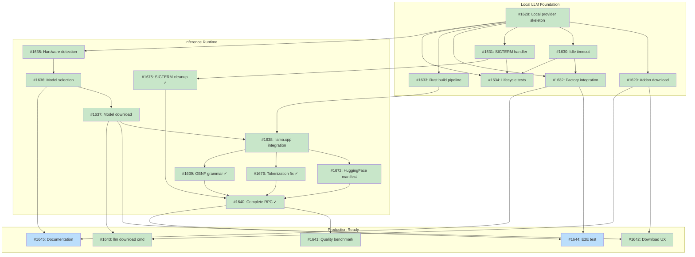

# Design Document: Local LLM Runtime

## Status

Planned

**Source Issue**: [#1421 - feat: local LLM runtime via Rust addon](https://github.com/tsukumogami/tsuku/issues/1421)

## Implementation Issues

### Milestone: [Local LLM Foundation](https://github.com/tsukumogami/tsuku/milestone/78)

| Issue | Dependencies | Tier |
|-------|--------------|------|
| ~~[#1628: feat(llm): complete local provider skeleton with lifecycle management](https://github.com/tsukumogami/tsuku/issues/1628)~~ | ~~None~~ | ~~testable~~ |
| ~~_Establishes gRPC contract, LocalProvider implementing Provider interface, ServerLifecycle with lock file protocol, and AddonManager stub. This is the walking skeleton that all other issues refine._~~ | | |
| ~~[#1629: feat(llm): implement addon download and verification](https://github.com/tsukumogami/tsuku/issues/1629)~~ | ~~[#1628](https://github.com/tsukumogami/tsuku/issues/1628)~~ | ~~testable~~ |
| ~~_AddonManager downloads platform-specific tsuku-llm binary from CDN with SHA256 verification at download and before each execution._~~ | | |
| ~~[#1630: feat(llm): add configurable idle timeout](https://github.com/tsukumogami/tsuku/issues/1630)~~ | ~~[#1628](https://github.com/tsukumogami/tsuku/issues/1628)~~ | ~~simple~~ |
| ~~_Server shuts down after configurable idle period (default 5m). Supports TSUKU_LLM_IDLE_TIMEOUT env var override for testing._~~ | | |
| ~~[#1631: feat(llm): implement SIGTERM handler for graceful shutdown](https://github.com/tsukumogami/tsuku/issues/1631)~~ | ~~[#1628](https://github.com/tsukumogami/tsuku/issues/1628)~~ | ~~simple~~ |
| ~~_Rust server handles SIGTERM, waits for in-flight requests (10s grace), cleans up socket and lock files on exit._~~ | | |
| ~~[#1632: feat(llm): integrate LocalProvider into factory with config](https://github.com/tsukumogami/tsuku/issues/1632)~~ | ~~[#1628](https://github.com/tsukumogami/tsuku/issues/1628), [#1630](https://github.com/tsukumogami/tsuku/issues/1630)~~ | ~~testable~~ |
| ~~_Factory registers LocalProvider as fallback when local_enabled=true. Reads idle_timeout from config.toml with env var override._~~ | | |
| ~~[#1633: ci(llm): add Rust addon build pipeline](https://github.com/tsukumogami/tsuku/issues/1633)~~ | ~~[#1628](https://github.com/tsukumogami/tsuku/issues/1628)~~ | ~~critical~~ |
| ~~_GitHub Actions workflow builds tsuku-llm for macOS (Metal), Linux (CUDA/Vulkan/CPU). Produces signed binaries with SHA256 checksums._~~ | | |
| ~~[#1634: test(llm): add lifecycle integration tests](https://github.com/tsukumogami/tsuku/issues/1634)~~ | ~~[#1628](https://github.com/tsukumogami/tsuku/issues/1628), [#1630](https://github.com/tsukumogami/tsuku/issues/1630), [#1631](https://github.com/tsukumogami/tsuku/issues/1631)~~ | ~~testable~~ |
| ~~_Tests verify lock file prevents duplicates, stale socket cleanup, short timeout behavior, and SIGTERM shutdown._~~ | | |

### Milestone: [Inference Runtime](https://github.com/tsukumogami/tsuku/milestone/79)

| Issue | Dependencies | Tier |
|-------|--------------|------|
| ~~[#1635: feat(llm): implement hardware detection](https://github.com/tsukumogami/tsuku/issues/1635)~~ | ~~[#1628](https://github.com/tsukumogami/tsuku/issues/1628)~~ | ~~testable~~ |
| ~~_Detect GPU type (CUDA/Metal/Vulkan/none), VRAM, system RAM, and CPU features (AVX2/AVX-512) at server startup._~~ | | |
| ~~[#1636: feat(llm): implement model selection based on hardware](https://github.com/tsukumogami/tsuku/issues/1636)~~ | ~~[#1635](https://github.com/tsukumogami/tsuku/issues/1635)~~ | ~~testable~~ |
| ~~_ModelSelector maps HardwareProfile to appropriate model (3B/1.5B/0.5B). Supports local_model config override._~~ | | |
| ~~[#1637: feat(llm): implement model download with progress](https://github.com/tsukumogami/tsuku/issues/1637)~~ | ~~[#1636](https://github.com/tsukumogami/tsuku/issues/1636)~~ | ~~testable~~ |
| ~~_Download GGUF models from CDN with progress callback. SHA256 verification at download and before each load._~~ | | |
| ~~[#1638: feat(llm): integrate llama.cpp for inference](https://github.com/tsukumogami/tsuku/issues/1638)~~ | ~~[#1633](https://github.com/tsukumogami/tsuku/issues/1633), [#1637](https://github.com/tsukumogami/tsuku/issues/1637)~~ | ~~critical~~ |
| ~~_Build llama.cpp via cc crate. Safe Rust wrappers for model loading and inference with proper context management._~~ | | |
| ~~[#1672: feat(llm): configure model manifest with HuggingFace URLs](https://github.com/tsukumogami/tsuku/issues/1672)~~ | ~~[#1637](https://github.com/tsukumogami/tsuku/issues/1637), [#1638](https://github.com/tsukumogami/tsuku/issues/1638)~~ | ~~testable~~ |
| ~~_Update manifest with real HuggingFace download URLs and SHA256 checksums. Enables end-to-end model download and inference._~~ | | |
| ~~[#1675: fix(llm): daemon socket not cleaned up on SIGTERM](https://github.com/tsukumogami/tsuku/issues/1675)~~ | ~~[#1631](https://github.com/tsukumogami/tsuku/issues/1631)~~ | ~~testable~~ |
| ~~_Fix SIGTERM handler to properly clean up socket and lock files. Daemon should exit with status 0 after graceful shutdown._~~ | | |
| ~~[#1676: fix(llm): tokenization fails with negative count from llama_tokenize](https://github.com/tsukumogami/tsuku/issues/1676)~~ | ~~[#1638](https://github.com/tsukumogami/tsuku/issues/1638)~~ | ~~testable~~ |
| ~~_Fix tokenization error when processing completion requests. llama_tokenize returns negative count indicating configuration or encoding issue._~~ | | |
| ~~[#1639: feat(llm): implement GBNF grammar constraints for JSON](https://github.com/tsukumogami/tsuku/issues/1639)~~ | ~~[#1638](https://github.com/tsukumogami/tsuku/issues/1638)~~ | ~~testable~~ |
| ~~_Generate GBNF grammar from JSON Schema. Forces model output to valid JSON matching tool schemas._~~ | | |
| ~~[#1640: feat(llm): wire Complete RPC to llama.cpp inference](https://github.com/tsukumogami/tsuku/issues/1640)~~ | ~~[#1639](https://github.com/tsukumogami/tsuku/issues/1639), [#1672](https://github.com/tsukumogami/tsuku/issues/1672), [#1675](https://github.com/tsukumogami/tsuku/issues/1675), [#1676](https://github.com/tsukumogami/tsuku/issues/1676)~~ | ~~testable~~ |
| ~~_Complete RPC invokes llama.cpp with grammar constraints. Includes local E2E validation: run `tsuku create` with LocalProvider on dev machine to verify full flow._~~ | | |

### Milestone: [Production Ready](https://github.com/tsukumogami/tsuku/milestone/80)

| Issue | Dependencies | Tier |
|-------|--------------|------|
| ~~[#1641: test(llm): add quality benchmark suite](https://github.com/tsukumogami/tsuku/issues/1641)~~ | ~~[#1640](https://github.com/tsukumogami/tsuku/issues/1640)~~ | ~~testable~~ |
| ~~_Compare local model recipe quality against Claude/Gemini baselines. Document quality expectations per hardware profile._~~ | | |
| ~~[#1642: feat(llm): add download permission prompts and progress UX](https://github.com/tsukumogami/tsuku/issues/1642)~~ | ~~[#1629](https://github.com/tsukumogami/tsuku/issues/1629), [#1637](https://github.com/tsukumogami/tsuku/issues/1637)~~ | ~~simple~~ |
| ~~_Prompt user before addon/model downloads. Show progress bars during downloads and spinner during inference._~~ | | |
| ~~[#1643: feat(llm): implement tsuku llm download command](https://github.com/tsukumogami/tsuku/issues/1643)~~ | ~~[#1629](https://github.com/tsukumogami/tsuku/issues/1629), [#1637](https://github.com/tsukumogami/tsuku/issues/1637)~~ | ~~simple~~ |
| ~~_CLI command to pre-download addon and models for CI/offline use. Hardware detection selects appropriate model._~~ | | |
| [#1644: test(llm): add end-to-end integration test without cloud keys](https://github.com/tsukumogami/tsuku/issues/1644) | [#1640](https://github.com/tsukumogami/tsuku/issues/1640), [#1632](https://github.com/tsukumogami/tsuku/issues/1632) | testable |
| _Test creates recipe using local inference with no cloud API keys configured. Validates full flow from factory fallback to recipe output._ | | |
| [#1645: docs(llm): update documentation for local inference](https://github.com/tsukumogami/tsuku/issues/1645) | [#1632](https://github.com/tsukumogami/tsuku/issues/1632), [#1636](https://github.com/tsukumogami/tsuku/issues/1636) | simple |
| _Document config options, hardware requirements table, and troubleshooting guide for local LLM runtime._ | | |

### Dependency Graph



**Legend**: Green = done, Blue = ready, Yellow = blocked, Purple = needs-design

## Context and Problem Statement

tsuku currently requires users to bring their own API keys for recipe generation features. Both Claude and Gemini providers work well, but using them requires:

1. Creating an account with Anthropic or Google
2. Setting up billing
3. Generating API keys
4. Configuring environment variables

This friction contradicts tsuku's core promise: users should only need tsuku to install anything. The current LLM features are hidden behind an account wall.

Meanwhile, open-source models have matured considerably. Models in the 1.5B-3B parameter range now handle structured extraction tasks well - exactly what tsuku needs. Recipe generation involves:

- Analyzing GitHub release asset names (pattern matching to platform/arch)
- Parsing documentation for installation steps
- Extracting structured JSON that maps to recipe format

These tasks have small context windows (~4K tokens), constrained outputs (JSON schema), and don't require creative generation. They're within reach of quantized models running on consumer hardware.

The opportunity: ship a local LLM runtime that works out of the box, with cloud providers remaining available for users who want them.

### Scope

**In scope:**

- Separate Rust addon binary (`tsuku-llm`) bundling llama.cpp
- gRPC communication between tsuku (Go) and tsuku-llm (Rust)
- On-demand server lifecycle with idle timeout
- Hardware detection and model selection
- Model download, caching, and verification
- Integration with existing Provider interface

**Out of scope:**

- Replacing cloud providers (they remain available)
- Supporting custom/user-provided models (fixed model selection)
- GPU drivers or CUDA installation (addon includes necessary runtime)
- Fine-tuning or training

**Download Considerations**: First-time use requires downloading the addon (~50MB) and a model (500MB-2.5GB depending on hardware). tsuku prompts for confirmation before the initial download. Users in bandwidth-constrained environments can pre-download via `tsuku llm download` or configure cloud providers instead.

### Configuration Options

Users can control local LLM behavior via `$TSUKU_HOME/config.toml`:

```toml
[llm]
# Disable local LLM entirely - addon won't be downloaded, LocalProvider won't be registered
# Users who only want cloud providers or no LLM can set this to avoid the download prompt
local_enabled = true  # default: true

# Preemptively start the addon server at the beginning of `tsuku create`
# When true: server starts early, model loads while tsuku fetches metadata (hides latency)
# When false: server starts only when first inference is needed (saves resources if LLM not used)
local_preemptive = true  # default: true

# Override automatic model selection (optional)
local_model = "qwen2.5-1.5b-instruct-q4"

# Override automatic backend selection (optional)
local_backend = "cuda"  # or "metal", "vulkan", "cpu"

# Idle timeout before server auto-shuts down (default: 5m)
# Shorter values useful for development/testing
idle_timeout = "5m"
```

**Environment variable override**: `TSUKU_LLM_IDLE_TIMEOUT` overrides the config file value. This is useful for testing (`TSUKU_LLM_IDLE_TIMEOUT=10s go test ./...`) and CI pipelines that need different timeout behavior without modifying config files.

**Behavior when `local_enabled = false`**:
- `LocalProvider` is not registered in the factory
- Addon binary is never downloaded
- No download prompts appear
- Users must configure cloud API keys or LLM features are unavailable

**Behavior when `local_preemptive = false`**:
- Addon server starts lazily on first inference call
- Model load latency is visible to user (2-5 seconds on GPU)
- Useful for users who rarely use LLM features and want to avoid resource usage

## Decision Drivers

- **Self-contained default**: LLM features should work without accounts or API keys
- **Minimal integration burden**: tsuku's Go codebase shouldn't grow in complexity
- **Reasonable hardware floor**: Target 8GB RAM systems as minimum (most dev machines)
- **Compile-time API contracts**: Go and Rust binaries should stay in sync
- **Batch-friendly performance**: Repeated inference calls shouldn't reload the model
- **Graceful degradation**: If local inference fails, suggest cloud fallback with clear guidance

## Considered Options

### Decision 1: Runtime Architecture

tsuku needs to run small language models (0.5B-3B parameters) for structured JSON extraction. The runtime must work across macOS (Apple Silicon and Intel), Linux (NVIDIA, AMD, CPU-only), and eventually Windows. GPU acceleration should be used where available, with CPU fallback.

The core tension is between tsuku's pure Go build and the C/C++ inference runtime (llama.cpp). Embedding llama.cpp via CGo would require C toolchains for every target, break `go install`, and add 10-50MB to every user's binary -- even those who never use local inference. But shipping a separate tool that users must install manually defeats the self-contained promise.

There's a middle path: tsuku downloads the inference binary on demand using its own tool management. The addon is self-contained (bundles llama.cpp, handles GPU detection), and tsuku manages its lifecycle. This way tsuku's core binary stays pure Go, and the CGo build complexity lives in a separate CI pipeline.

#### Chosen: Separate Rust Addon Binary (`tsuku-llm`)

Ship the inference runtime as a separate Rust binary that tsuku downloads on first use. The addon bundles llama.cpp compiled with GPU support for each platform. tsuku's core binary contains only a lightweight gRPC client that communicates with the addon over localhost.

Rust rather than Go for the addon because:
- Zero-overhead C FFI with llama.cpp (no CGo bridge with its goroutine stack switching)
- The `cc` crate handles building llama.cpp's C/C++ sources as part of `cargo build`
- No garbage collector to pause during inference
- tsuku already has Rust in its CI pipeline for the dlopen utility

The addon runs as a short-lived local server. When `tsuku create` needs local inference, the `LocalProvider` starts `tsuku-llm serve` in the background. The server loads the model, accepts inference requests over localhost gRPC, and shuts itself down after an idle timeout (5 minutes). Multiple `tsuku create` calls within that window reuse the warm server.

Preemptive startup hides loading latency: tsuku kicks off `tsuku-llm serve` at the beginning of `tsuku create`, before the LLM is needed. While the model loads (2-5 seconds on GPU), tsuku fetches GitHub metadata and probes registries. By the time inference is needed, the server is usually ready.

#### Alternatives Considered

**Embedded llama.cpp via CGo**: Write the addon in Go with CGo linking llama.cpp. Go is tsuku's primary language. But CGo adds ~100ns overhead per C call due to goroutine stack switching, Go's GC can cause latency spikes during inference, and managing C build flags across platforms is harder than Rust's `cc` crate. Rejected because the separate addon already isolates the C build complexity, so Go's cross-compilation advantage doesn't help.

**Embedded llama.cpp in tsuku binary**: Link llama.cpp directly into tsuku's Go binary. No IPC overhead, but breaks cross-compilation, breaks `go install`, adds 10-50MB to every user's binary, and requires C headers to build locally. Rejected because it contradicts the "minimal integration burden" driver.

**Bundled Ollama**: Ship Ollama alongside tsuku. Rejected because Ollama adds ~500MB+, duplicates model management, and introduces port conflicts if the user already runs Ollama.

**External Ollama/LM Studio**: Support local inference through user-installed tools. Rejected because it doesn't solve the self-contained problem.

**Hybrid Ollama Detection**: Detect if Ollama is already running and use it; otherwise download the addon. This would reduce download size for existing Ollama users. Rejected because it adds complexity (detecting Ollama's API, handling version mismatches, two code paths for inference) while only benefiting users who already have Ollama - and those users can simply configure Ollama as their provider explicitly if they want.

**WebAssembly Runtime**: Run llama.cpp compiled to WASM via Go's wazero runtime. This would eliminate platform-specific builds (one .wasm binary for all platforms) and the build matrix complexity. Rejected because WASM inference is 30-50% slower than native, has no GPU acceleration, and the performance penalty compounds over the 3-5 inference turns per recipe. For CPU-only inference where this might be tolerable, native builds still perform better.

### Decision 2: Model Selection Strategy

The quality gap between model sizes is significant for structured extraction. Qwen 2.5 3B produces near-cloud-quality JSON extraction, while 0.5B is adequate but noticeably worse on complex release layouts. Users with a discrete GPU and 8GB+ VRAM can run 3B comfortably, while CPU-only systems with limited RAM need 0.5B.

The question is whether tsuku should detect hardware and pick automatically, ship a single model, or ask the user. This affects the first-use experience -- the wrong choice means either poor quality on capable machines or OOM crashes on limited ones.

#### Chosen: Hardware-Aware Automatic Selection

Detect available hardware at runtime (GPU type, VRAM, system RAM) and select the largest model that fits:

| Available Resources | Model | Size (Q4) | Expected Quality |
|-------------------|-------|-----------|-----------------|
| 8GB+ VRAM (CUDA/Metal) | Qwen 2.5 3B | ~2.5GB | Near-cloud |
| 4-8GB VRAM | Qwen 2.5 1.5B | ~1.5GB | Good |
| CPU only, 8GB+ RAM | Qwen 2.5 1.5B | ~1.5GB | Good, slow |
| CPU only, <8GB RAM | Qwen 2.5 0.5B | ~500MB | Adequate |

Users don't need to make decisions. They can override via config if auto-detection picks wrong.

**Model Selection Rationale**: Qwen 2.5 is the primary choice because it leads benchmarks for structured output at these sizes (75%+ on JSON extraction tasks), uses Apache 2.0 licensing, and has strong instruction-following even at 1.5B. Alternatives considered:
- **Llama 3.2 1B/3B**: Competitive but slightly weaker on structured extraction in early benchmarks
- **Phi-3.5**: Strong reasoning but larger memory footprint for equivalent quality
- **Gemma 2 2B**: Good quality but non-standard size point complicates the selection table

The manifest system allows swapping models without code changes if better options emerge.

#### Alternatives Considered

**Single Default Model**: Ship one model (e.g., Qwen 2.5 1.5B Q4) everywhere. Simpler to test, but under-utilizes powerful GPUs and may OOM on limited systems. Rejected because the quality difference between 0.5B and 3B is real enough to justify hardware detection.

**User-Prompted Selection**: Ask the user on first run. Rejected because it adds friction, users don't know which model to pick, and it defeats the "just works" goal.

### Decision 3: Addon Lifecycle

With the addon as a local server, the remaining question is lifecycle management. The server needs to start when needed, stay alive long enough to serve a session, and clean up when done. This affects both interactive use (single `tsuku create`, 3-5 inference turns) and batch use (hundreds of sequential `tsuku create` calls in CI).

#### Chosen: On-Demand Start with Idle Timeout

`tsuku-llm serve` starts on demand when `LocalProvider` first needs inference. The server binds to a Unix domain socket at `$TSUKU_HOME/llm.sock` (or named pipe on Windows), loads the model, and accepts requests. After a configurable idle timeout (default 5 minutes with no requests), it shuts itself down.

Startup is preemptive: `tsuku create` launches the server early in execution, before inference is needed. While the model loads, tsuku does non-LLM work. The `LocalProvider` checks for a running server before attempting to start one, so concurrent or sequential `tsuku create` calls share the same instance.

For batch pipelines in CI, the idle timeout means the server stays warm between sequential calls without explicit lifecycle management. A pipeline of 500 tools just calls `tsuku create` in a loop -- the first starts the server, the rest find it immediately.

**Reliable Daemon State Detection**: The server uses a lock file (`$TSUKU_HOME/llm.sock.lock`) in addition to the socket file. The server acquires an exclusive lock on startup and holds it until shutdown. This solves stale socket detection: if the lock can be acquired, the daemon isn't running (even if an orphaned socket file exists). The kernel automatically releases the lock on process death, making this more reliable than PID files or socket probing alone.

**Configurable Timeout for Testing**: The idle timeout is configurable via `TSUKU_LLM_IDLE_TIMEOUT` environment variable. Development and test workflows use short timeouts (e.g., `10s`) for quick cleanup, while production uses the default `5m`. This eliminates the need for crude process killing during development.

**Signal Handling**: The server handles SIGTERM for graceful shutdown, allowing in-flight requests to complete before exit. This makes the addon well-behaved in systemd, Docker, and orchestrator contexts where SIGTERM is the standard shutdown signal.

#### Alternatives Considered

**CLI Addon (no server)**: The addon runs as a one-shot CLI, loading and unloading the model per call. Model loading takes 2-5 seconds on GPU, 5-10 seconds on CPU. A single `tsuku create` makes 3-5 inference calls through the repair loop, meaning 6-50 seconds of pure loading overhead per recipe. Rejected because this overhead compounds - a user creating recipes for 10 tools would spend 1-8 minutes just loading models.

**Always-On Daemon**: The server starts at login and runs permanently. Rejected because it wastes resources when tsuku isn't being used and adds platform-specific daemon registration complexity.

### Decision 4: Communication Protocol

The addon runs as a localhost server, and tsuku communicates with it via IPC. The protocol choice affects type safety, serialization overhead, and boilerplate. tsuku's side is Go, the addon's side is Rust, so the protocol must work well in both languages.

The API surface is small: three endpoints (complete, health, shutdown) with structured request/response types. No streaming requirement -- tsuku sends a prompt and waits for the full response.

#### Chosen: gRPC

Define the API contract as a protobuf service. `protoc` generates typed client stubs in Go and server stubs in Rust (`tonic` crate). Request and response types are defined once in `.proto` files and compiled into both languages.

The main benefit is the shared contract. When the API changes, both sides get compile-time errors if out of sync. Binary serialization via protobuf is more efficient than JSON, though this matters little for the sizes involved. The generated code also handles connection management and error codes cleanly.

Go uses `google.golang.org/grpc` (mature). Rust uses `tonic` (standard async gRPC). Both have good tooling for health checking.

#### Alternatives Considered

**HTTP/JSON REST**: Simple to implement, easy to debug with curl, no code generation required. Type drift could be addressed with OpenAPI/Swagger generating clients for both languages. Rejected because: (1) gRPC's health checking protocol is a standard that both Go and Rust libraries implement natively, vs custom health endpoints for HTTP; (2) gRPC connection management handles reconnection and keepalive automatically; (3) while this is a small API, the protobuf contract catches breaking changes at compile time rather than runtime; (4) future needs like streaming completions would be straightforward with gRPC, harder to retrofit into REST.

**Unix domain sockets with custom protocol**: Lower overhead than TCP. Rejected because it requires custom serialization and doesn't provide protobuf's type safety.

### Uncertainties

- **Quality parity**: We believe Qwen 2.5 1.5B-3B can handle tsuku's structured extraction tasks based on benchmarks, but haven't tested against tsuku's actual prompts. The multi-turn repair loop may behave differently with small models.
- **Inference speed**: CPU-only inference on a 1.5B model takes 5-30 seconds per turn depending on hardware. We assume this is acceptable since cloud APIs already take 10-30 seconds.
- **Addon build matrix**: The Rust addon needs platform-specific builds (CUDA, Metal, Vulkan, CPU-only). Haven't fully validated the CI infrastructure for this.
- **Model licensing**: Qwen 2.5 uses Apache 2.0, but we should verify all candidates are permissively licensed.

## Decision Outcome

**Chosen: Separate Rust Addon + Hardware-Aware Selection + On-Demand Server + gRPC**

### Summary

When a user runs `tsuku create <tool>` without cloud API keys configured, the Provider factory falls through to `LocalProvider`. On first use, tsuku downloads the `tsuku-llm` addon binary (~50MB, platform-specific with GPU support) using its own tool management, then downloads the selected model (~0.5-2.5GB GGUF file, SHA256 verified). The addon detects available hardware and picks the best model: 3B for 8GB+ VRAM, 1.5B for 4-8GB or CPU-only with 8GB+ RAM, 0.5B for constrained systems, disabled below 4GB RAM.

The `LocalProvider` starts `tsuku-llm serve` preemptively at the beginning of `tsuku create`, before inference is needed. While the model loads (2-5 seconds on GPU), tsuku fetches GitHub metadata and probes registries. By the time the first inference call happens, the server is typically ready. All inference goes over localhost gRPC with the contract defined in protobuf -- the addon constrains output via GBNF grammars that force valid JSON matching tool schemas, the same way the repair loop works with cloud providers.

The server stays alive after `tsuku create` finishes, with a 5-minute idle timeout. If the user runs `tsuku create` again within that window, the server is already warm. Batch pipelines just loop `tsuku create` calls; the first starts the server, the rest hit it immediately, and it shuts down 5 minutes after the last call. tsuku's core binary stays pure Go -- the addon is written in Rust for zero-overhead C FFI with llama.cpp, has its own build pipeline, and can update independently (new llama.cpp version, new GPU support, new models) without a tsuku release.

### Rationale

The decisions reinforce each other. Separating the addon preserves tsuku's pure Go build while isolating C/C++ complexity in a Rust binary with zero-cost FFI. gRPC gives the Go-to-Rust boundary a typed contract that catches mismatches at compile time. The server lifecycle makes the addon practical -- without it, model loading would dominate recipe generation time. Hardware-aware selection ensures the addon works across the full hardware spectrum without user decisions.

The key trade-off is the two-binary architecture. Users download both tsuku and the addon (on first local inference use). But users who never use local inference never download it, and users with cloud API keys configured bypass it entirely. The idle timeout means the server isn't a permanent resource cost.

### Trade-offs Accepted

- **First-use download**: Addon (~50MB) + model (0.5-2.5GB) on first local inference. Acceptable because this is a one-time cost, users are prompted for consent, and cloud providers remain available.
- **Two release pipelines**: tsuku (Go) and tsuku-llm (Rust) have separate CI. Acceptable because the gRPC contract enforces compatibility, and independent releases allow faster iteration on inference.
- **IPC overhead**: ~0.5-2ms per gRPC call. Acceptable because inference takes 5-30 seconds per turn -- IPC is negligible.
- **Local inference quality**: May be lower than cloud APIs on edge cases. Acceptable because cloud providers remain available as fallback, and the sandbox validation catches broken recipes regardless of source.

## Solution Architecture

### Overview

A new `LocalProvider` in tsuku implements the existing `Provider` interface. Instead of running inference in-process, it communicates with the `tsuku-llm` addon over localhost gRPC. The addon is a separate Rust binary that bundles llama.cpp via C FFI, handles hardware detection, model management, and inference. tsuku downloads the addon on first use.

```
tsuku (pure Go)                          tsuku-llm (Rust + llama.cpp)
┌─────────────────────┐                  ┌──────────────────────────┐
│ Provider Factory     │                  │ gRPC Server (localhost)  │
│   ├─ ClaudeProvider  │                  │   ├─ HardwareDetector    │
│   ├─ GeminiProvider  │                  │   ├─ ModelSelector       │
│   └─ LocalProvider ──┼── gRPC ──────────┼─► ├─ ModelManager        │
│       (gRPC client)  │                  │   └─ LlamaRuntime        │
└─────────────────────┘                  └──────────────────────────┘
```

The API contract is defined in protobuf (`llm.proto`), with generated Go client stubs and Rust server stubs (via `tonic`). The `LocalProvider` is transparent to the rest of tsuku -- the Provider interface is unchanged.

### Responsibility Split

**tsuku CLI (Go)** handles:
- Reading `local_enabled` and `local_preemptive` config options
- Downloading the addon binary (not models)
- Starting/stopping the addon server process
- gRPC client communication
- User prompts ("Download addon? Y/n")
- The `tsuku llm download` command for pre-downloading the addon

**tsuku-llm addon (Rust)** handles:
- Hardware detection (GPU type, VRAM, system RAM, CPU features)
- Model selection based on detected hardware
- Model download, caching, and checksum verification
- Model loading and inference via llama.cpp
- Idle timeout and server lifecycle

This split keeps tsuku's Go codebase simple (just a gRPC client) while the addon owns all inference complexity. Hardware detection lives in the addon because llama.cpp has the best understanding of what hardware it can use. Model management lives in the addon because model selection depends on hardware detection results and model formats are specific to llama.cpp.

### Components in tsuku (pure Go)

**LocalProvider** (`internal/llm/local.go`):

Implements the `Provider` interface as a gRPC client to the addon server. Only registered in the factory when `local_enabled = true` in config:

```go
type LocalProvider struct {
    addonManager *AddonManager  // downloads/manages tsuku-llm binary
    lifecycle    *ServerLifecycle
    conn         *grpc.ClientConn
    client       llmpb.InferenceServiceClient  // generated from llm.proto
}

// NewLocalProvider returns nil if local_enabled = false in config
func NewLocalProvider(cfg *config.Config) *LocalProvider {
    if !cfg.LLM.LocalEnabled {
        return nil  // LocalProvider won't be registered in factory
    }
    return &LocalProvider{...}
}

func (p *LocalProvider) Complete(ctx context.Context, req *CompletionRequest) (*CompletionResponse, error) {
    // Ensure addon is downloaded (prompts user on first use)
    if err := p.addonManager.EnsureAddon(); err != nil {
        return nil, err
    }

    // Ensure server is running (start if needed)
    if err := p.lifecycle.EnsureRunning(); err != nil {
        return nil, err
    }

    // Send request via gRPC
    return p.grpcComplete(ctx, req)
}
```

**AddonManager** (`internal/llm/addon.go`):

Manages the `tsuku-llm` binary using tsuku's existing tool management:
- Downloads the platform-specific addon binary on first use (~50MB)
- Verifies checksums at download and before each execution
- Updates independently of tsuku (addon has its own version in manifest)
- Stores in `$TSUKU_HOME/tools/tsuku-llm/`
- **Version compatibility**: The addon manifest embedded in tsuku specifies minimum compatible addon version. If the installed addon is older, AddonManager re-downloads. The gRPC proto version is also checked at connection time (server reports proto version in health response).

**ServerLifecycle** (`internal/llm/lifecycle.go`):

Handles starting, detecting, and health-checking the addon server:
- Uses lock file (`$TSUKU_HOME/llm.sock.lock`) to reliably detect running daemon
- Attempts non-blocking exclusive lock: if acquired, daemon isn't running
- If lock fails (held by daemon): connect to socket at `$TSUKU_HOME/llm.sock`
- Health check: gRPC health checking protocol before sending inference requests
- If no server found: starts `tsuku-llm serve` as a background process
- Stale socket cleanup: if lock acquired but socket exists, remove orphaned socket
- **Preemptive start**: When `local_preemptive = true` (default), `tsuku create` calls `ServerLifecycle.StartPreemptively()` early in execution. When false, server only starts on first `Complete()` call.
- **Timeout override**: Reads `TSUKU_LLM_IDLE_TIMEOUT` env var and passes to addon via `--idle-timeout` flag

### Components in tsuku-llm (Rust + llama.cpp)

**HardwareDetector** (`src/hardware.rs`):

Runs at server startup. Detects:
- **GPU**: CUDA (NVIDIA), Metal (Apple Silicon), Vulkan (AMD/Intel), or none
- **VRAM**: Available video memory (or unified memory on Apple Silicon)
- **System RAM**: Available physical memory
- **CPU features**: AVX2/AVX-512 for optimized CPU inference

**ModelSelector** (`src/model.rs`):

Takes the hardware profile and returns a model spec:

1. VRAM >= 8GB + GPU: 3B Q4 with GPU backend
2. VRAM 4-8GB + GPU: 1.5B Q4 with GPU backend
3. VRAM < 4GB + GPU: 0.5B Q4 with GPU backend
4. CPU only, RAM >= 16GB: 3B Q4 (slow but best quality)
5. CPU only, RAM >= 8GB: 1.5B Q4
6. CPU only, RAM >= 4GB: 0.5B Q4
7. RAM < 4GB: local inference disabled

Users can override via `$TSUKU_HOME/config.toml`:
```toml
[llm]
local_model = "qwen2.5-3b-instruct-q4"
local_backend = "cuda"
```

**ModelManager** (`src/models.rs`):

Manages model downloads in `$TSUKU_HOME/models/`. Downloads from tsuku's CDN, verifies SHA256 checksums, shows progress. The manifest maps model names to download URLs and checksums.

**InferenceServer** (`src/server.rs`):

gRPC server on localhost (via `tonic`) implementing the `InferenceService`:

```protobuf
service InferenceService {
  rpc Complete(CompletionRequest) returns (CompletionResponse);
  rpc Shutdown(ShutdownRequest) returns (ShutdownResponse);
}
// Plus standard gRPC health checking protocol
```

The server performs the following on startup:
1. Acquires exclusive lock on `$TSUKU_HOME/llm.sock.lock` (prevents duplicate instances)
2. Creates Unix domain socket at `$TSUKU_HOME/llm.sock` (permissions 0600)
3. Registers SIGTERM handler for graceful shutdown
4. Starts idle timeout timer (configurable via `--idle-timeout` flag, default 5 minutes)

On shutdown (idle timeout, SIGTERM, or gRPC Shutdown call):
1. Stops accepting new connections
2. Waits for in-flight requests to complete (with 10-second grace period)
3. Removes socket file
4. Releases lock file

Tool calling is implemented through GBNF grammar constraints that force valid JSON matching tool schemas. Temperature 0 for deterministic extraction.

### Key Interfaces

`LocalProvider` implements the existing `Provider` interface unchanged:

```go
// Existing interface - unchanged
type Provider interface {
    Name() string
    Complete(ctx context.Context, req *CompletionRequest) (*CompletionResponse, error)
}

// Factory priority:
// 1. Claude (if ANTHROPIC_API_KEY set)
// 2. Gemini (if GOOGLE_API_KEY set)
// 3. Local (if local_enabled = true in config, starts addon on demand)
```

The circuit breaker handles failover. If the addon fails, the error propagates like any other provider failure.

### Data Flow

**First-time user (no API keys, default config):**

1. User runs `tsuku create ripgrep`
2. Factory finds no cloud API keys, falls through to LocalProvider (registered because `local_enabled = true`)
3. LocalProvider checks for addon, prompts user, triggers download (~50MB)
4. Because `local_preemptive = true`, server starts early in `tsuku create` pipeline
5. While model loads, tsuku fetches GitHub metadata in parallel
6. Addon detects hardware, selects Qwen 2.5 3B Q4, downloads model (~2.5GB)
7. Model ready, tsuku sends inference requests over localhost gRPC
8. Recipe generated (3-5 turns), validated in sandbox, written to local recipes
9. Server stays alive, idle timeout starts (5 minutes)

**Returning user (addon and model cached, preemptive enabled):**

1. User runs `tsuku create jq`
2. Because `local_preemptive = true`, server starts early (model loads in 2-5 seconds)
3. Meanwhile, tsuku fetches metadata in parallel
4. Inference requests hit warm server
5. Recipe generated
6. Server stays alive for 5 more minutes

**User with `local_preemptive = false`:**

1. User runs `tsuku create jq`
2. tsuku fetches metadata, probes registries
3. When inference is first needed, server starts (user sees 2-5 second pause)
4. Inference proceeds normally
5. This mode is useful for users who rarely use LLM features

**User with `local_enabled = false`:**

1. User has set `local_enabled = false` in config (wants cloud-only or no LLM)
2. LocalProvider is not registered in factory
3. Addon is never downloaded, no prompts appear
4. If no cloud API keys configured, LLM features return "no provider available" error

**Batch pipeline (CI):**

1. CI runs `for tool in $(cat tools.txt); do tsuku create "$tool"; done`
2. First iteration starts server, model loads once (5 seconds)
3. Subsequent iterations find server warm
4. 500 tools x ~15 seconds inference each
5. Server idles out 5 minutes after last tool

### Error Handling

- **Addon download fails**: Retry with exponential backoff. After 3 failures, inform user and suggest configuring a cloud provider.
- **Server fails to start**: Check if socket file exists. If stale socket, clean up and retry. If persistent failure, report error.
- **Server crashes mid-session**: LocalProvider detects via failed health check, cleans up stale socket, restarts. Circuit breaker counts consecutive failures.
- **OOM during inference**: Addon catches error, restarts with next smaller model. If 0.5B also fails, reports that local inference isn't viable on this system.
- **Grammar constraint timeout**: 30-second token generation timeout per turn. If exceeded, return error.

## Implementation Approach

### Phase 1: gRPC Contract and LocalProvider

Define the gRPC service contract shared between tsuku and the addon:

- `proto/llm.proto` with `InferenceService` (Complete, Shutdown, health checking)
- Request/response message types matching existing `CompletionRequest`/`CompletionResponse`
- Generate Go client stubs (`protoc-gen-go-grpc`)
- `LocalProvider` implementing `Provider` interface as gRPC client
- `AddonManager` for downloading tsuku-llm binary
- Server lifecycle manager (start, detect, health check, cleanup)
- Factory priority update (local as fallback after cloud providers)
- Integration tests with a mock gRPC server

### Phase 2: Addon Scaffold and Build Pipeline

Set up the Rust addon binary and its CI:

- New `tsuku-llm/` directory as a Rust project
- llama.cpp integration via `cc` crate
- Build matrix: macOS Metal, Linux CUDA, Linux Vulkan, CPU-only
- gRPC server skeleton via `tonic` implementing `InferenceService`
- Release pipeline producing platform-specific binaries

### Phase 2.5: Daemon Lifecycle Management

Implement reliable daemon state detection and graceful shutdown:

**Lock file mechanism (Rust server)**:
- Acquire exclusive lock on `$TSUKU_HOME/llm.sock.lock` at startup
- Hold lock until shutdown (kernel releases on process death)
- Prevents duplicate daemon instances

**Lock file validation (Go client)**:
- Attempt non-blocking exclusive lock to detect running daemon
- If lock acquired: daemon not running, clean up stale socket if present
- If lock fails: daemon running, proceed to connect

**Configurable idle timeout**:
- `--idle-timeout` flag on `tsuku-llm serve` (default: 5m)
- `TSUKU_LLM_IDLE_TIMEOUT` environment variable override
- Go client passes timeout to addon when starting

**Signal handling (Rust server)**:
- SIGTERM handler triggers graceful shutdown
- Wait for in-flight requests (10-second grace period)
- Clean up socket and lock files on exit

**Integration tests**:
- Test lock file prevents duplicate daemons
- Test stale socket cleanup when lock available
- Test short timeout for deterministic test behavior
- Test SIGTERM triggers graceful shutdown

### Phase 3: Hardware Detection and Model Selection

Implement hardware detection in the addon:

- GPU detection: CUDA (library probe), Metal (macOS ARM), Vulkan (library probe)
- VRAM and RAM detection
- Model selection table
- Config overrides from `$TSUKU_HOME/config.toml`

### Phase 4: Model Manager and Inference

Wire up model management and inference:

- Model manifest format (JSON, bundled in addon)
- Download from CDN with progress display
- SHA256 verification
- GGUF model loading via llama.cpp C API
- Tool calling via GBNF grammar constraints
- Temperature and sampling settings

### Phase 5: Testing and Quality Validation

Validate that local models produce acceptable recipes:

- Run tsuku's existing recipe test suite against local models
- Compare recipe quality: local vs Claude vs Gemini
- Measure inference latency across hardware profiles
- End-to-end test: `tsuku create` with addon, no cloud keys

### Phase 6: First-Use Experience Polish

Smooth the onboarding flow:

- Permission prompt before addon and model downloads
- Progress bars during downloads
- Status messages during inference
- Error messages when hardware isn't sufficient
- `tsuku llm download` command for manual pre-download

## Security Considerations

### Download Verification

Both the addon binary and model files are downloaded from tsuku-controlled infrastructure. Each download includes SHA256 checksum verification.

**Addon binary**: The addon manifest is embedded in tsuku. When downloading `tsuku-llm`, tsuku verifies the downloaded binary against the checksum in the manifest. If verification fails, the download is rejected. Critically, tsuku re-verifies the addon checksum before each execution, not just at download time -- this prevents post-download binary replacement attacks.

**Model files**: The model manifest is bundled inside the addon binary. The addon verifies each downloaded GGUF file against its SHA256 checksum before loading, and re-verifies before each model load (not just at download time). Models are stored read-only after download with permissions verified before loading.

**Trust model**: Users verify tsuku via GitHub release signatures (signed releases) or OS package manager signatures (Homebrew, apt). The addon manifest is embedded in the verified tsuku binary. Users who don't verify tsuku are trusting GitHub's release integrity -- this is the standard trust model for developer tools.

**Risk**: CDN compromise could serve a malicious addon or model file.

**Mitigation**: SHA256 checksum from embedded manifest, verified at download and before each execution. An attacker would need to compromise both the CDN and the tsuku binary to serve a file that passes verification.

**Residual risk**: Supply chain attack on tsuku's build pipeline. Mitigated by: reproducible builds (future), build transparency logs (future), code review on release branches.

### Execution Isolation

The addon runs as a separate process with the same user permissions as tsuku. This provides a natural isolation boundary:

- A crash in llama.cpp's C code doesn't take down tsuku
- The addon can be restarted cleanly after failures
- Memory corruption in the inference runtime is contained to the addon process

**Permissions required**:
- Network: None (gRPC uses Unix domain socket on Linux/macOS, named pipe on Windows)
- File system: Read/write to `$TSUKU_HOME/` (addon binary, models, socket file, config)
- No elevated privileges required

**Socket-based communication**: The addon uses a Unix domain socket at `$TSUKU_HOME/llm.sock` instead of TCP ports. This eliminates port file race conditions, port hijacking attacks, and accidental network exposure. The socket file has restrictive permissions (0600) preventing other users from connecting.

**Risk**: A crafted GGUF file could exploit a vulnerability in llama.cpp's GGUF parser. The format is binary with complex tensor metadata, and parser bugs have occurred in practice.

**Mitigation**: Only load models that pass SHA256 checksum verification against the bundled manifest. The addon doesn't load arbitrary user-provided model files by default -- only manifest-listed models. Track llama.cpp security advisories and update the addon when security fixes land.

**Residual risk**: Zero-day in llama.cpp's GGUF parser combined with a supply chain attack that serves a crafted file with a valid checksum. The separate-process model means such an exploit is contained to the addon process, not tsuku.

### Supply Chain Risks

The supply chain has three links:

**1. Model training (upstream: Alibaba for Qwen)**: We trust model weights from established organizations based on reputation and community verification. Model outputs are structured JSON interpreted by tsuku -- we don't execute model outputs as code.

**2. Model hosting (tsuku CDN)**: We control this infrastructure. Checksum verification protects against tampering in transit or at rest.

**3. llama.cpp (in addon)**: Pinned to a specific commit in the addon build. Updated deliberately with review of release notes. **Security update SLA**: Critical CVEs in llama.cpp trigger addon updates within 48 hours; high-severity within 1 week.

**Risk**: A poisoned model could generate malicious recipes (pointing to malware downloads).

**Mitigation**: This is the same risk as cloud LLM providers. The existing sandbox validation catches malicious recipes by running them in isolation first. Local models don't bypass any validation -- the output goes through the same recipe validation, sandbox testing, and repair loop as cloud-generated recipes.

### User Data Exposure

Local inference is a privacy improvement over cloud providers:

- **Tool names**: Not sent externally (inference is local)
- **GitHub/ecosystem data**: Still fetched from public APIs (same as without LLM)
- **Model files**: Downloaded once, no ongoing phone-home
- **Telemetry**: Existing opt-out mechanism applies; local vs cloud usage is tracked but not tool names

**No new user data exposure.** This is strictly better for privacy than cloud providers.

### Prompt Injection via Input Data

Small models are more susceptible to prompt injection than large cloud models. tsuku's LLM inputs include data from public sources: GitHub release descriptions, README files, ecosystem registry metadata (PyPI descriptions, npm package.json). An attacker could craft a malicious tool description that manipulates model output.

**Risk**: A PyPI package description containing hidden prompt injection text could cause the model to generate a recipe pointing at a malicious binary instead of the legitimate one.

**Mitigation layers**:
1. **Input sanitization**: Strip HTML, limit description length to 4000 chars, remove common injection patterns (base64-encoded instructions, Unicode homoglyphs, "ignore previous" phrases)
2. **URL validation**: Extracted download URLs are validated against known-good patterns (official GitHub orgs, npmjs.com, pypi.org, crates.io). Unknown domains trigger user confirmation with the full URL displayed prominently
3. **Sandbox validation**: All generated recipes run in isolation before installation
4. **User confirmation**: LLM-generated recipes show the extracted download URL and require explicit approval before installation
5. **Quality gate**: More than 2 repair attempts fails the operation and suggests cloud provider

Note: Grammar constraints enforce valid JSON structure but don't prevent semantically malicious content (valid JSON with a malicious URL). They're defense-in-depth, not a primary mitigation.

**Residual risk**: Novel injection techniques combined with typosquatting (e.g., `rippgrep` instead of `ripgrep`) could bypass URL validation if the typosquatted domain is plausible. Mitigated by user confirmation displaying the full URL.

### Mitigations Summary

| Risk | Mitigation | Residual Risk |
|------|------------|---------------|
| CDN compromise | SHA256 verification at download AND execution | Supply chain attack on build pipeline |
| GGUF parser exploit | Only load manifest-listed models, 48-hour security SLA | Zero-day + supply chain attack |
| Binary replacement | Re-verify checksum before each execution | None (verified at use time) |
| Port hijacking | Unix domain sockets instead of TCP | None (eliminated) |
| Poisoned model output | Sandbox validation, URL validation, user confirmation | Typosquatting with plausible domains |
| Prompt injection | Input sanitization, URL validation, user confirmation | Novel techniques + typosquatting |
| Privacy leakage | Inference is local; no tool names sent externally | None - this is an improvement |

## Consequences

### Positive

- **Self-contained by default**: Recipe generation works without accounts or API keys
- **Pure Go build preserved**: tsuku's core binary has no CGo, `go install` works, contributors don't need C toolchains
- **Privacy improvement**: Tool names never leave the machine for local inference
- **Independent addon updates**: New llama.cpp, GPU support, or models ship without tsuku releases
- **Zero overhead for non-users**: Users who never use local inference never download the addon
- **Batch-friendly**: Server with idle timeout handles both interactive and batch use cases
- **Crash isolation**: llama.cpp bugs crash the addon, not tsuku
- **Cloud fallback**: Cloud providers remain available for users who want higher quality

### Negative

- **First-use download**: Addon (~50MB) + model (0.5-2.5GB) on first local inference use
- **Two release pipelines**: tsuku (Go) and tsuku-llm (Rust) with protobuf compatibility contract
- **IPC overhead**: ~0.5-2ms per gRPC call (negligible vs inference time)
- **Server lifecycle complexity**: Socket management, health checks, idle timeout, stale socket cleanup
- **Local inference is slower**: 5-30 seconds per turn vs 1-5 seconds for cloud APIs
- **Quality gap on edge cases**: Small models may struggle with unusual GitHub release layouts

### Mitigations

- **Download size**: Users are prompted for consent; `tsuku llm download` for pre-download in CI
- **Two pipelines**: gRPC contract enforces compatibility at compile time
- **Quality gap**: Cloud providers remain available; sandbox validation catches broken recipes
- **Lifecycle complexity**: All complexity is in the addon; tsuku just checks socket and sends gRPC
