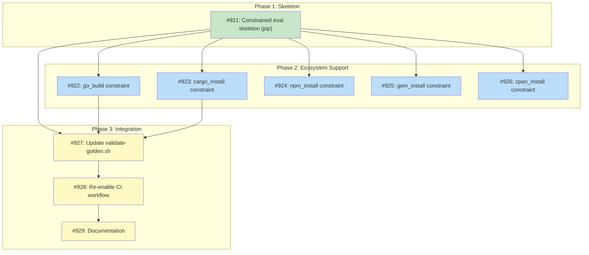

# DESIGN: Non-Deterministic Golden File Validation

## Status

Planned

## Implementation Issues

### Milestone: [Constrained Golden File Validation](https://github.com/tsukumogami/tsuku/milestone/35)

| Issue | Title | Dependencies | Tier |
|-------|-------|--------------|------|
| [#921](https://github.com/tsukumogami/tsuku/issues/921) | feat(eval): add constrained evaluation skeleton with pip support | None | testable |
| [#922](https://github.com/tsukumogami/tsuku/issues/922) | feat(eval): add go_build constraint support | [#921](https://github.com/tsukumogami/tsuku/issues/921) | testable |
| [#923](https://github.com/tsukumogami/tsuku/issues/923) | feat(eval): add cargo_install constraint support | [#921](https://github.com/tsukumogami/tsuku/issues/921) | testable |
| [#924](https://github.com/tsukumogami/tsuku/issues/924) | feat(eval): add npm_install constraint support | [#921](https://github.com/tsukumogami/tsuku/issues/921) | testable |
| [#925](https://github.com/tsukumogami/tsuku/issues/925) | feat(eval): add gem_install constraint support | [#921](https://github.com/tsukumogami/tsuku/issues/921) | simple |
| [#926](https://github.com/tsukumogami/tsuku/issues/926) | feat(eval): add cpan_install constraint support | [#921](https://github.com/tsukumogami/tsuku/issues/921) | simple |
| [#927](https://github.com/tsukumogami/tsuku/issues/927) | feat(scripts): update validate-golden.sh | [#921](https://github.com/tsukumogami/tsuku/issues/921), [#922](https://github.com/tsukumogami/tsuku/issues/922), [#923](https://github.com/tsukumogami/tsuku/issues/923) | testable |
| [#928](https://github.com/tsukumogami/tsuku/issues/928) | ci(golden): re-enable validate-golden-code.yml | [#927](https://github.com/tsukumogami/tsuku/issues/927) | critical |
| [#929](https://github.com/tsukumogami/tsuku/issues/929) | docs: add constrained evaluation documentation | [#928](https://github.com/tsukumogami/tsuku/issues/928) | simple |

### Dependency Graph



**Legend**: Green = done, Blue = ready, Yellow = blocked, Purple = needs-design

## Context and Problem Statement

Golden files for ecosystem recipes (pip_exec, cargo_install, go_build, cpan_install, gem_install, npm_install, etc.) drift over time because dependency resolution happens at eval time and picks up new transitive dependency versions from upstream registries. This causes CI failures in `validate-golden-code.yml` that require manual regeneration, even when neither the recipe nor tsuku code has changed.

**Current state**: The `validate-golden-code.yml` workflow is disabled. Ecosystem recipes like `ruff`, `black`, `httpie`, `poetry`, and `meson` have golden files that frequently become stale due to upstream dependency changes.

### Clarification: Eval-Time vs Exec-Time Determinism

The codebase has a `deterministic` flag on actions and plans, but it measures **execution-time determinism** (will the same plan produce identical binaries?), NOT **eval-time stability** (will the same recipe produce the same plan?). These are orthogonal concepts:

| Concept | Question | Example |
|---------|----------|---------|
| **Exec-time determinism** (what flag measures) | Same plan → same binary? | `go_build` produces different binaries with different Go compiler versions |
| **Eval-time stability** (actual problem) | Same recipe → same plan? | `pip download httpie==3.2.4` resolves different transitive deps over time |

The golden file drift is an **eval-time stability** problem. The `deterministic` flag is correctly applied for its intended purpose (marking execution variance), but it does not predict or solve eval-time drift.

**Key insight**: Constrained evaluation (Option 9) solves eval-time drift by pinning dependency versions while still exercising all code paths. The `deterministic` flag becomes metadata only - it doesn't drive the validation strategy.

### Scope

**In scope:**
- Validation strategy for golden files that exhibit eval-time drift
- Changes to validation scripts and CI workflows
- Documentation of which recipes/actions have eval-time variability

**Out of scope:**
- Making ecosystem actions produce identical binaries (exec-time determinism - different problem)
- Changes to the lockfile generation approach (already implemented in #609)
- Version provider changes

## Decision Drivers

1. **CI stability**: Validation should not fail due to upstream dependency changes unrelated to recipe or code changes
2. **Regression detection**: Changes to recipes or tsuku code that affect plan structure should still be caught
3. **Maintainability**: The solution should not require frequent manual intervention
4. **Execution confidence**: Plans with eval-time variability should still be executable when validated
5. **Minimal complexity**: Prefer solutions that build on existing infrastructure
6. **Clean CLI ergonomics**: Users should not need to provide existing plans to generate reproducible plans

## Considered Options

### Option 1: Skip Validation for Ecosystem Recipes

Skip comparison entirely for recipes that use ecosystem actions (pip_exec, go_build, etc.).

**How it works:**
- `validate-golden.sh` checks if the plan contains ecosystem actions
- If yes, skip the regenerate-and-compare step
- Only validate that the file exists and is valid JSON

**Pros:**
- Simple implementation
- No false positive failures
- JSON validity checks still catch file corruption
- Execution validation (`validate-golden-execution.yml`) provides defense-in-depth

**Cons:**
- No regression detection for ecosystem recipes at plan-generation level
- Recipe changes that break ecosystem plans go unnoticed until execution
- Structural changes (new fields, action ordering) are not validated

**Note on the `deterministic` flag:** While the codebase has a `deterministic` flag, it measures exec-time variance, not eval-time drift. Using it as a validation switch would be semantically incorrect. See "Clarification" section above.

**When this option makes sense:**
- Early-stage development where execution validation coverage is strong
- When structural validation produces too many false positives due to high variance
- When the cost of maintaining schema definitions exceeds the benefit

### Option 2: Structural Validation (Schema Comparison)

Validate non-deterministic plans by comparing structure only: tool, version, action types, and step ordering. Ignore content that varies (checksums, locked_requirements, go_sum).

**How it works:**
- Define a "structural schema" extraction that keeps:
  - `tool`, `version`, `platform`, `format_version`
  - Step `action` types and ordering
  - Dependency structure (tool names, versions, action types)
- Ignore fields known to vary:
  - `checksum` values in download steps
  - `locked_requirements` in pip_exec
  - `go_sum` in go_build
  - `size` fields
- Compare extracted schemas instead of full content

**Pros:**
- Catches structural regressions (action ordering, missing steps, wrong dependencies)
- Tolerates expected variation in non-deterministic content
- Recipe changes that affect structure are detected

**Cons:**
- Requires defining and maintaining the "varying fields" list
- May miss subtle content changes that matter
- More complex than simple skip
- New non-deterministic fields need to be added to the ignore list

### Option 3: Automated Regeneration with Diff Review

Automatically regenerate non-deterministic golden files in CI and create a PR if they differ, rather than failing the build.

**How it works:**
- `validate-golden-code.yml` regenerates all golden files
- If non-deterministic files differ, create an automated PR with the updates
- Deterministic file differences still fail the build
- Human reviews the automated PR before merge

**Pros:**
- No manual regeneration burden
- Changes are visible in PR for review
- CI never fails due to upstream drift

**Cons:**
- Requires bot/automation infrastructure for PR creation
- Review burden shifts to approving automated PRs
- Merge conflicts if multiple PRs touch golden files
- Does not distinguish intentional changes from drift

### Option 4: Freeze Lockfiles at Authoring Time

Require non-deterministic recipes to include frozen lockfiles in the recipe itself, making them deterministic at eval time.

**How it works:**
- Recipes with `pip_exec`, `cargo_install`, etc. must include the full lockfile content
- Eval phase reads lockfile from recipe instead of resolving from registry
- Golden files become deterministic
- Version bumps require updating the recipe's embedded lockfile

**Pros:**
- Golden files become fully deterministic
- No validation strategy changes needed
- Execution uses exact same dependencies as golden file
- Well-established pattern: Cargo uses `Cargo.lock` with `--locked --offline`, Go uses `go.sum` with MVS
- Many production systems already commit lockfiles as standard practice

**Cons:**
- Significant recipe authoring burden for pip/npm where lockfiles are verbose
- Lockfiles can be large (hundreds of lines for complex deps)
- Recipe format changes required
- Does not help with build actions (go_build, cargo_build) where output varies due to compiler
- Requires tooling to update lockfiles during version bumps

**When this option makes sense:**
- Registry dominated by Cargo/Go recipes where lockfile freezing is well-supported
- When reproducibility is paramount and the authoring cost is acceptable
- For recipes with minimal transitive dependencies where lockfiles are small

### Option 5: Tiered Validation by Recipe Type

Apply different validation strategies based on whether the recipe uses ecosystem actions:
- Core-only recipes (download_file, extract, etc.): exact comparison
- Ecosystem recipes (pip_exec, go_build, etc.): structural validation (Option 2)

**How it works:**
- Validation script checks if plan contains ecosystem actions
- Routes to appropriate comparison function
- Single workflow handles both cases
- Structural validation uses jq to extract comparable fields

**Pros:**
- Best of both worlds: strict for core recipes, flexible for ecosystem recipes
- Single unified workflow
- Maintains regression detection for both types

**Cons:**
- Two validation paths to maintain
- Need to keep structural schema definition updated
- Slightly more complex than pure skip
- Need to maintain list of "ecosystem" vs "core" actions

**Note on the `deterministic` flag:** The flag measures exec-time variance (binary reproducibility), not eval-time drift (plan reproducibility). Using it as the tier switch would be semantically incorrect - a `download_file` action could have eval-time drift if the URL template resolves differently, while a `pip_exec` with cached lockfile could be eval-stable.

### Option 6: Semantic Diff with Equivalence Classes

Parse lockfile formats natively (Cargo.lock TOML, pip requirements) and compare package sets semantically rather than as strings. Only flag changes that are semantically significant: new packages added, packages removed, or major version changes.

**How it works:**
- For pip: parse `locked_requirements` to extract package names and versions, compute digest
- For cargo: parse `Cargo.lock` semantically, extract crate names and versions
- For go: parse `go.sum` to extract module paths and versions
- Compare semantic fingerprints rather than raw content
- Only fail on semantic drift (new deps, removed deps, major version changes)

**Pros:**
- Catches real issues (dependency changes) while ignoring expected drift (hash updates)
- More precise than pure structural validation
- Maintains security visibility into dependency changes

**Cons:**
- Requires parsing multiple lockfile formats (pip requirements, Cargo.lock, go.sum, package-lock.json)
- Additional complexity per ecosystem
- May need ecosystem-specific "significant change" definitions

### Option 7: Split Plan Format

Separate plans into distinct sections: `immutable` (recipe-derived, exactly validated) and `mutable` (resolved dependencies, structurally validated). The plan format itself encodes validation intent.

**How it works:**
- Plan JSON gains `immutable` and `mutable` top-level sections
- Immutable section: tool, version, platform, action types, ordering
- Mutable section: checksums, lockfile content, sizes
- Validation applies exact comparison to immutable, structural to mutable

**Pros:**
- Architecturally clean, makes validation intent explicit in the format
- No heuristics about what varies - it's declared in the schema
- Self-documenting plans

**Cons:**
- Requires plan format version bump
- All golden files need regeneration
- Higher implementation effort
- Adds complexity to plan generation code

### Option 8: Snapshot Testing with Time-Boxing

Accept that golden files have limited validity and introduce a freshness model. Fresh files use exact match; older files use structural match; expired files trigger automatic regeneration.

**How it works:**
- Golden files include a `valid_until` timestamp (e.g., 30 days from generation)
- Fresh files (within validity): exact comparison catches immediate regressions
- Stale files (past validity): structural comparison tolerates expected drift
- Expired files (far past validity): automatic regeneration with review

**Pros:**
- Pragmatic approach that matches reality (dependencies do drift)
- Good developer ergonomics - recent changes are strictly validated
- Automatic freshness without constant manual regeneration

**Cons:**
- Time-based logic can be confusing to debug
- CI behavior changes based on when it runs
- Requires infrastructure for "time since generation" tracking

### Option 9: Constrained Evaluation (Recommended)

Pass version constraints to `tsuku eval` so all evaluation code runs but dependency resolution produces deterministic versions. This exercises the full code path while enabling exact comparison with golden files.

**How it works:**
1. Extract constraints from existing golden file (pip requirements, go.sum, Cargo.lock)
2. Pass constraints to `tsuku eval` via `--pin-from` flag
3. Each ecosystem's Decompose() uses constraints instead of live resolution:
   - pip: Uses `--constraint` flag with extracted package versions
   - go: Reuses captured `go.sum` content
   - cargo: Reuses captured `Cargo.lock` content
4. All eval code executes (Decompose, version resolution, template expansion)
5. Output is deterministic and can be compared exactly to golden file

**CLI interface:**
```bash
# Constrained evaluation for validation
tsuku eval httpie@3.2.4 --pin-from golden.json --os darwin --arch arm64

# Normal evaluation (unconstrained, for generating new golden files)
tsuku eval httpie@3.2.4 --os darwin --arch arm64
```

**What gets exercised:**
- Recipe parsing and validation
- Version provider calls
- All Decompose() code paths
- Template variable expansion
- Platform filtering (when clauses)
- Step ordering logic
- Determinism flag computation

**What stays deterministic:**
- Dependency versions (from constraints)
- Download checksums (from constraints)
- Lockfile content (from constraints)

**Pros:**
- **Full code exercise**: All eval code runs, not skipped - we're actually testing the code
- **Deterministic output**: Constraints pin versions to match golden files exactly
- **Clean CLI**: Single `--pin-from` flag, no complex constraint files to manage
- **Regression detection**: If eval code breaks, output differs from golden file
- **Leverages ecosystem mechanisms**: pip `--constraint`, go.sum reuse, Cargo.lock reuse

**Cons:**
- Requires extracting constraints from golden files (parsing locked_requirements, go.sum, etc.)
- Ecosystem-specific constraint logic in each Decompose() method
- May need to handle toolchain version differences (go_version, python_version)

**Constraint extraction:**
```go
// Extract constraints from golden file
constraints, err := ExtractConstraints("golden.json")
// Returns: {
//   PipConstraints: {"requests": "2.31.0", "certifi": "2023.12.0", ...},
//   GoSum: "github.com/foo/bar v1.0.0 h1:...\n...",
//   CargoLock: "[package]\nname = ...",
// }
```

## Decision Outcome

**Chosen: Option 9 - Constrained Evaluation**

### Summary

Pass version constraints from existing golden files to `tsuku eval` so all evaluation code runs but dependency resolution produces deterministic versions. This exercises the full code path (Decompose, version resolution, template expansion) while enabling exact comparison with golden files.

### Rationale

Option 9 provides the correct solution because:

1. **Full code exercise**: Unlike caching which skips eval, constrained evaluation runs all code paths. This is the point of golden file testing - validating that eval code works correctly.

2. **Deterministic output**: Constraints pin dependency versions to match golden files exactly. pip uses `--constraint`, go reuses `go.sum`, cargo reuses `Cargo.lock`.

3. **Regression detection**: If eval code breaks (wrong step order, missing params, bad template expansion), output differs from golden file and validation fails.

4. **Leverages ecosystem mechanisms**: Each package manager already supports constrained resolution. We're using their intended features.

5. **Clean interface**: Single `--pin-from golden.json` flag extracts all needed constraints.

### Why Not Other Options

- **Caching (previous Option 9 variant)**: Skips eval code entirely - defeats the purpose of testing.
- **Option 5 (Structural validation)**: Doesn't exercise code fully, tolerates rather than prevents drift.
- **Option 1 (Skip)**: No regression detection at all.
- **Option 4 (Freeze in recipes)**: High authoring burden, doesn't scale.

### What This Validates

When `tsuku eval httpie@3.2.4 --pin-from golden.json` runs:
- Recipe TOML parsing ✓
- Version provider logic ✓
- pipx_install.Decompose() ✓
- pip constraint handling ✓
- Template expansion ✓
- Platform filtering ✓
- Step ordering ✓
- Output matches golden file ✓

## Solution Architecture

### Constrained Evaluation Design

The constrained evaluation approach passes dependency version constraints from golden files to `tsuku eval`, ensuring all code paths execute while producing deterministic output.

```
┌─────────────────────────────────────────────────────────────────────────────┐
│      tsuku eval httpie@3.2.4 --pin-from golden.json --os darwin --arch arm64│
└─────────────────────────────────────────────────────────────────────────────┘
                                    │
                                    ▼
                    ┌───────────────────────────────┐
                    │  Parse --pin-from file        │
                    │  Extract constraints:         │
                    │  - pip: locked_requirements   │
                    │  - go: go_sum content         │
                    │  - cargo: cargo_lock content  │
                    └───────────────────────────────┘
                                    │
                                    ▼
                    ┌───────────────────────────────┐
                    │  Load recipe (httpie.toml)    │
                    │  Parse version, actions       │
                    └───────────────────────────────┘
                                    │
                                    ▼
                    ┌───────────────────────────────┐
                    │  Create EvalContext with      │
                    │  Constraints field populated  │
                    └───────────────────────────────┘
                                    │
                                    ▼
                    ┌───────────────────────────────┐
                    │  Run Decompose() for each     │
                    │  action - ALL CODE EXECUTES   │
                    └───────────────────────────────┘
                                    │
                                    ▼
                    ┌───────────────────────────────┐
                    │  Dependency resolution uses   │
                    │  constraints instead of live  │
                    │  registry queries             │
                    └───────────────────────────────┘
                                    │
                                    ▼
                    ┌───────────────────────────────┐
                    │  Output: deterministic plan   │
                    │  matching golden file         │
                    └───────────────────────────────┘
```

### Constraint Extraction

Extract constraints from golden files to pass to eval:

```go
// EvalConstraints holds version constraints extracted from golden files
type EvalConstraints struct {
    // PipConstraints maps package names to pinned versions
    // Extracted from locked_requirements in pip_exec steps
    PipConstraints map[string]string

    // GoSum contains the full go.sum content for go_build steps
    GoSum string

    // CargoLock contains the full Cargo.lock content for cargo_install steps
    CargoLock string

    // NpmLock contains package-lock.json content for npm_install steps
    NpmLock string
}

// ExtractConstraints parses a golden file and extracts all constraints
func ExtractConstraints(goldenPath string) (*EvalConstraints, error) {
    plan, err := LoadPlan(goldenPath)
    if err != nil {
        return nil, err
    }

    constraints := &EvalConstraints{
        PipConstraints: make(map[string]string),
    }

    // Walk all steps (including dependencies) to extract constraints
    for _, step := range plan.AllSteps() {
        switch step.Action {
        case "pip_exec":
            // Parse locked_requirements: "requests==2.31.0\ncertifi==2023.12.0\n..."
            if reqs, ok := step.Params["locked_requirements"].(string); ok {
                constraints.PipConstraints = parsePipRequirements(reqs)
            }
        case "go_build":
            if goSum, ok := step.Params["go_sum"].(string); ok {
                constraints.GoSum = goSum
            }
        case "cargo_install", "cargo_build":
            if lock, ok := step.Params["cargo_lock"].(string); ok {
                constraints.CargoLock = lock
            }
        case "npm_install", "npm_exec":
            if lock, ok := step.Params["package_lock"].(string); ok {
                constraints.NpmLock = lock
            }
        }
    }

    return constraints, nil
}
```

### Ecosystem Constraint Application

Each ecosystem's Decompose() method uses constraints when available:

#### pip_exec

```go
func (a *PipExecAction) Decompose(ctx *EvalContext) ([]*Step, error) {
    if ctx.Constraints != nil && len(ctx.Constraints.PipConstraints) > 0 {
        // Use --constraint flag with extracted versions
        constraintFile := generateConstraintFile(ctx.Constraints.PipConstraints)
        // pip download --constraint constraints.txt httpie==3.2.4
        return a.decomposeWithConstraints(ctx, constraintFile)
    }
    // Normal resolution (unconstrained)
    return a.decompose(ctx)
}
```

#### go_build

```go
func (a *GoBuildAction) Decompose(ctx *EvalContext) ([]*Step, error) {
    if ctx.Constraints != nil && ctx.Constraints.GoSum != "" {
        // Reuse captured go.sum content
        // go mod download with existing go.sum
        return a.decomposeWithGoSum(ctx, ctx.Constraints.GoSum)
    }
    // Normal resolution (unconstrained)
    return a.decompose(ctx)
}
```

#### cargo_install

```go
func (a *CargoInstallAction) Decompose(ctx *EvalContext) ([]*Step, error) {
    if ctx.Constraints != nil && ctx.Constraints.CargoLock != "" {
        // Reuse captured Cargo.lock content
        // cargo install --locked
        return a.decomposeWithCargoLock(ctx, ctx.Constraints.CargoLock)
    }
    // Normal resolution (unconstrained)
    return a.decompose(ctx)
}
```

### CI Validation Flow

```bash
#!/bin/bash
# validate-golden.sh <recipe>

RECIPE="$1"
GOLDEN_DIR="testdata/golden/plans"

for golden in "$GOLDEN_DIR"/*/"$RECIPE"/*.json; do
    version=$(jq -r '.version' "$golden")
    os=$(jq -r '.platform.os' "$golden")
    arch=$(jq -r '.platform.arch' "$golden")

    # Generate plan with constraints from golden file
    actual=$(mktemp)
    ./tsuku eval "$RECIPE@$version" \
        --pin-from "$golden" \
        --os "$os" \
        --arch "$arch" > "$actual"

    # Exact comparison - constrained eval should match golden
    if ! diff -q "$golden" "$actual" > /dev/null; then
        echo "MISMATCH: $golden"
        diff -u "$golden" "$actual"
        exit 1
    fi
done

echo "All golden files validated successfully"
```

### What Gets Exercised

With constrained evaluation, the following code paths execute during validation:

| Component | Exercised? | Notes |
|-----------|------------|-------|
| Recipe TOML parsing | Yes | Full recipe loaded |
| Version provider calls | Yes | Version resolved (pinned by constraint) |
| Action Decompose() | Yes | Full decomposition logic runs |
| Template expansion | Yes | Variables interpolated |
| Platform filtering | Yes | When clauses evaluated |
| Step ordering | Yes | Dependencies resolved |
| Determinism computation | Yes | Flag computed from steps |
| Constraint application | Yes | New code path for pinning |

### Recipe Hash Validation

Plans include `recipe_hash` computed from the recipe file. During constrained evaluation:

1. Load golden file, extract `recipe_hash`
2. Compute current recipe hash from recipe.toml
3. If hashes differ: recipe changed, golden file may need regeneration
4. If hashes match: proceed with constrained evaluation

This catches cases where the recipe changed but golden files weren't updated.

### Structural Schema (Fallback)

If Option 9 implementation is delayed, Option 5 (structural validation) remains as a viable fallback. The structural schema definition is preserved below for reference.

**Note on flag usage in fallback:** The fallback implementation uses the `deterministic` flag to route validation. This is not semantically ideal since the flag measures exec-time variance, not eval-time drift. However, in practice there's high correlation: ecosystem actions (pip_exec, go_build) are both exec-non-deterministic AND eval-variable, while core actions (download_file, extract) are both exec-deterministic AND eval-stable. The flag works as an imperfect proxy. If implementing the fallback, consider detecting ecosystem actions directly instead of relying on the flag.

#### Structural Schema Definition

The structural schema extracts comparable elements while filtering out varying content. Critically, it includes **structurally significant params** that identify what is being installed, while ignoring content that varies (checksums, lockfile text).

```
Structural Schema:
├── format_version (required to match)
├── tool (required to match)
├── version (required to match)
├── platform.os (required to match)
├── platform.arch (required to match)
├── deterministic (metadata, not compared)
├── recipe_hash (required to match - same recipe should produce same structure)
├── dependencies[] (recursive structural schema)
│   ├── tool
│   ├── version
│   ├── recipe_hash
│   └── steps[] (structural + significant params)
└── steps[] (structural + significant params)
    ├── action
    ├── evaluable
    ├── deterministic
    └── significant_params (per action type - see below)

Significant Params by Action Type:
├── pip_exec: package, version, executables, python_version
├── go_build: module, install_module, version, executables, go_version
├── cargo_install/cargo_build: crate, version, executables
├── npm_install/npm_exec: package, version, executables
├── gem_install/gem_exec: gem, version, executables
├── cpan_install: distribution, executables
├── download_file: dest (not checksum)
├── extract: archive, format, strip_dirs
├── install_binaries: binaries, install_mode

Ignored Fields (vary for non-deterministic plans):
├── steps[].params.checksum
├── steps[].params.checksum_algo
├── steps[].params.locked_requirements (full text)
├── steps[].params.go_sum (full text)
├── steps[].params.has_native_addons
├── steps[].url
├── steps[].checksum
├── steps[].size
└── dependencies[].steps[] (same rules recursively)

Lockfile Fingerprint (for semantic change detection):
For pip_exec: extract package names + versions from locked_requirements, compute digest
For go_build: extract module paths + versions from go_sum, compute digest
This fingerprint IS included in structural comparison to detect semantic dep changes.
```

**Why significant params matter:**

Without including significant params, the schema would match two plans that:
- Install different packages (e.g., `package: "black"` vs `package: "ruff"`)
- Pull from different modules (e.g., `module: "github.com/legit/tool"` vs `module: "github.com/attacker/tool"`)
- Produce different executables

This would be a security issue. The significant params ensure we catch changes to **what** is installed while tolerating changes to **how it resolves** (checksums, lockfile text).

### Validation Flow

**Important clarification**: Structural validation exists for **CI stability**, not security. The security backstop is execution-time checksum verification, which remains unchanged. Structural validation catches regressions in plan generation while tolerating expected drift in non-deterministic content.

```
┌─────────────────────────────────────────────────────────────────────────────┐
│                        validate-golden.sh <recipe>                          │
└─────────────────────────────────────────────────────────────────────────────┘
                                    │
                                    ▼
                    ┌───────────────────────────────┐
                    │  For each golden file:        │
                    │  1. Regenerate to temp file   │
                    │  2. Read deterministic flags  │
                    │     from BOTH golden & actual │
                    └───────────────────────────────┘
                                    │
                                    ▼
                    ┌───────────────────────────────┐
                    │  Determinism transition?      │
                    │  (golden.det != actual.det)   │
                    └───────────────────────────────┘
                            │               │
                          Yes               No
                            │               │
                            ▼               ▼
                ┌───────────────┐   ┌───────────────────────────────┐
                │ FAIL: Require │   │ Route by deterministic flag   │
                │ human review  │   └───────────────────────────────┘
                └───────────────┘               │
                                    ┌──────────┴──────────┐
                                    │                     │
                            deterministic: true    deterministic: false
                                    │                     │
                                    ▼                     ▼
                        ┌───────────────────┐   ┌───────────────────────┐
                        │ Exact Comparison  │   │ Structural Comparison │
                        │ (byte-for-byte)   │   │ (schema extraction)   │
                        └───────────────────┘   └───────────────────────┘
                                    │                     │
                                    └──────────┬──────────┘
                                               ▼
                                    ┌───────────────────────────────┐
                                    │  Exit codes:                  │
                                    │  0 = match                    │
                                    │  1 = mismatch (show diff)     │
                                    │  2 = error (parse failure)    │
                                    └───────────────────────────────┘
```

### Schema Extraction Script

Create `scripts/extract-structural-schema.sh` to extract the comparable schema with significant params:

```bash
#!/bin/bash
# scripts/extract-structural-schema.sh
# Extracts structural schema from a golden plan file for comparison
# Usage: ./scripts/extract-structural-schema.sh <plan.json>

jq '
# Known action types - fail if we encounter unknown actions
def known_actions: [
  "pip_exec", "pip_install", "go_build", "go_install",
  "cargo_install", "cargo_build", "npm_install", "npm_exec",
  "gem_install", "gem_exec", "cpan_install",
  "download_file", "extract", "install_binaries", "chmod",
  "set_env", "set_rpath", "link_dependencies", "text_replace", "apply_patch",
  "configure_make", "cmake_build", "meson_build"
];

# Extract significant params based on action type
# MVP scope: no lockfile fingerprinting (can be added later)
def extract_significant_params:
  if .action == "pip_exec" then
    { package: .params.package, version: .params.version,
      executables: .params.executables, python_version: .params.python_version }
  elif .action == "go_build" then
    { module: .params.module, install_module: .params.install_module,
      version: .params.version, executables: .params.executables,
      go_version: .params.go_version }
  elif .action == "cargo_install" or .action == "cargo_build" then
    { crate: .params.crate, version: .params.version, executables: .params.executables }
  elif .action == "npm_install" or .action == "npm_exec" then
    { package: .params.package, version: .params.version, executables: .params.executables }
  elif .action == "gem_install" or .action == "gem_exec" then
    { gem: .params.gem, version: .params.version, executables: .params.executables }
  elif .action == "cpan_install" then
    { distribution: .params.distribution, executables: .params.executables }
  elif .action == "download_file" then
    { dest: .params.dest }
  elif .action == "extract" then
    { archive: .params.archive, format: .params.format, strip_dirs: .params.strip_dirs }
  elif .action == "install_binaries" then
    { binaries: .params.binaries, install_mode: .params.install_mode }
  elif .action == "chmod" then
    { files: .params.files }
  elif (.action | IN(known_actions[])) then
    # Known action but no security-critical params
    {}
  else
    # Unknown action type - halt extraction to prevent silent security degradation
    error("Unknown action type: \(.action) - update extract-structural-schema.sh")
  end;

def extract_step_schema:
  {
    action: .action,
    evaluable: .evaluable,
    deterministic: .deterministic,
    significant_params: extract_significant_params
  };

def extract_dep_schema:
  {
    tool: .tool,
    version: .version,
    recipe_hash: .recipe_hash,
    steps: [.steps[] | extract_step_schema]
  };

{
  format_version: .format_version,
  tool: .tool,
  version: .version,
  platform: .platform,
  recipe_hash: .recipe_hash,
  dependencies: [.dependencies[]? | extract_dep_schema],
  steps: [.steps[] | extract_step_schema]
}
' "$1"
```

The `lockfile_fingerprint` and `gosum_fingerprint` fields extract package/module names and versions while ignoring exact hashes, providing semantic change detection without exact string matching.

### Modified Validation Script

Update `scripts/validate-golden.sh` to use tiered validation:

```bash
# In validate-golden.sh, after regenerating to $ACTUAL:

# Check determinism flag
IS_DETERMINISTIC=$(jq -r '.deterministic' "$GOLDEN")

if [[ "$IS_DETERMINISTIC" == "true" ]]; then
    # Exact comparison for deterministic plans
    GOLDEN_HASH=$(sha256sum "$GOLDEN" | cut -d' ' -f1)
    ACTUAL_HASH=$(sha256sum "$ACTUAL" | cut -d' ' -f1)

    if [[ "$GOLDEN_HASH" != "$ACTUAL_HASH" ]]; then
        MISMATCH=1
        echo "MISMATCH (exact): $GOLDEN"
        diff -u "$GOLDEN" "$ACTUAL" || true
    fi
else
    # Structural comparison for non-deterministic plans
    GOLDEN_SCHEMA=$(./scripts/extract-structural-schema.sh "$GOLDEN")
    ACTUAL_SCHEMA=$(./scripts/extract-structural-schema.sh "$ACTUAL")

    if [[ "$GOLDEN_SCHEMA" != "$ACTUAL_SCHEMA" ]]; then
        MISMATCH=1
        echo "MISMATCH (structural): $GOLDEN"
        diff -u <(echo "$GOLDEN_SCHEMA" | jq -S .) <(echo "$ACTUAL_SCHEMA" | jq -S .) || true
    fi
fi
```

### Handling Determinism Transitions

When a recipe changes between deterministic and non-deterministic (e.g., adding a pip_exec step), the validation script must handle this correctly:

```bash
# In validate-golden.sh, check for determinism transition FIRST

GOLDEN_DET=$(jq -r '.deterministic' "$GOLDEN")
ACTUAL_DET=$(jq -r '.deterministic' "$ACTUAL")

if [[ "$GOLDEN_DET" != "$ACTUAL_DET" ]]; then
    echo "DETERMINISM CHANGE: $GOLDEN"
    echo "  Golden: deterministic=$GOLDEN_DET"
    echo "  Actual: deterministic=$ACTUAL_DET"
    echo "  This change requires review."
    MISMATCH=1
    # Show full diff for review
    diff -u "$GOLDEN" "$ACTUAL" || true
    continue
fi
```

Determinism transitions are flagged for explicit review because:
- A non-deterministic → deterministic change may indicate the recipe now produces stable output (good)
- A deterministic → non-deterministic change may indicate a regression or intentional recipe change (needs review)

### Validation Mode Override

For cases where a non-deterministic plan should have exact comparison (e.g., maintainer intentionally froze the lockfile), add a `validation_mode` field:

```json
{
  "format_version": 3,
  "tool": "black",
  "deterministic": false,
  "validation_mode": "exact",  // Override: force exact comparison
  ...
}
```

The validation script respects this override:
```bash
VALIDATION_MODE=$(jq -r '.validation_mode // "auto"' "$GOLDEN")
if [[ "$VALIDATION_MODE" == "exact" ]]; then
    # Use exact comparison regardless of deterministic flag
    ...
elif [[ "$VALIDATION_MODE" == "structural" ]]; then
    # Use structural comparison regardless of deterministic flag
    ...
else
    # Auto: use deterministic flag to decide
    ...
fi
```

This is an optional enhancement - the MVP can launch without it.

### CI Workflow Re-enablement

After implementing tiered validation, re-enable `validate-golden-code.yml`:

```yaml
# Remove the `if: false` condition from line 67
jobs:
  validate-all:
    # if: false  # REMOVE THIS LINE
    name: Validate All Golden Files
    runs-on: ubuntu-latest
```

## Implementation Approach

### Phase 1: EvalConstraints Infrastructure

Add constraint data structure and extraction:

1. **EvalConstraints struct**: Define in `internal/actions/decomposable.go`
2. **ExtractConstraints function**: Parse golden files to extract constraints
3. **EvalContext extension**: Add `Constraints` field to EvalContext

**Key files to modify:**
- `internal/actions/decomposable.go` - Add EvalConstraints struct, extend EvalContext
- `internal/executor/constraints.go` (new) - ExtractConstraints implementation

### Phase 2: CLI Flag

Add `--pin-from` flag to `tsuku eval`:

1. **Flag definition**: `--pin-from <path>` accepts path to golden file
2. **Constraint loading**: Extract constraints from golden file before eval
3. **Context propagation**: Pass constraints to EvalContext

**Key files to modify:**
- `cmd/tsuku/eval.go` - Add flag definition and constraint loading

### Phase 3: pip_exec Constraint Support

Implement constraint application for pip ecosystem:

1. **Parse locked_requirements**: Extract package==version pairs from golden file
2. **Generate constraint file**: Create temporary constraints.txt
3. **Modify pip download command**: Add `--constraint constraints.txt` flag
4. **Test with httpie, black, ruff golden files**

**Key files to modify:**
- `internal/actions/pipx_install.go` - Modify Decompose() for constraint support

### Phase 4: go_build Constraint Support

Implement constraint application for Go ecosystem:

1. **Capture go.sum content**: Extract from golden file go_build steps
2. **Reuse go.sum during resolution**: Write captured content before `go mod download`
3. **Test with dlv, gh, gopls golden files**

**Key files to modify:**
- `internal/actions/go_build.go` - Modify Decompose() for go.sum reuse

### Phase 5: cargo_install Constraint Support

Implement constraint application for Cargo ecosystem:

1. **Capture Cargo.lock content**: Extract from golden file cargo_install steps
2. **Use --locked flag**: Pass captured lockfile to cargo install
3. **Test with ripgrep, fd, bat golden files**

**Key files to modify:**
- `internal/actions/cargo_install.go` - Modify Decompose() for Cargo.lock reuse

### Phase 6: Validation Script Update

Update validation to use constrained evaluation:

1. **Modify validate-golden.sh**: Use `--pin-from` flag
2. **Remove structural validation**: Exact comparison is now sufficient
3. **Test full golden file suite**

**Key files to modify:**
- `scripts/validate-golden.sh` - Rewrite validation logic
- `scripts/validate-all-golden.sh` - Update to use new validation

### Phase 7: Re-enable CI Workflow

1. Remove `if: false` from `validate-golden-code.yml`
2. Update workflow to use `--pin-from` flag
3. Monitor for a few PRs to confirm stability

### Phase 8: Documentation

1. Update CONTRIBUTING.md to explain constrained evaluation
2. Document `--pin-from` flag usage
3. Add troubleshooting guide for constraint extraction failures

### Fallback: Structural Validation

If constrained evaluation proves insufficient for some ecosystems, the structural validation approach from Option 5 can be implemented as a fallback. The schema extraction script and validation logic are preserved in this design document for reference.

## Security Considerations

### Download Verification

**Not affected.** This design changes validation comparison logic only. Actual download verification using checksums remains unchanged during execution. The structural schema still validates that plans have the expected structure for download steps.

### Execution Isolation

**Not affected.** Validation changes do not affect how plans are executed. The `validate-golden-execution.yml` workflow continues to run `tsuku install --plan` which performs full checksum verification.

### Supply Chain Risks

**Minimal impact.** Structural validation ignores checksum values and lockfile text for non-deterministic plans during CI comparison. However:

- **Checksums validated at execution**: Checksums are still verified during actual installation
- **Deterministic plans retain exact comparison**: Binary downloads have full checksum validation
- **Recipe hash comparison**: Ensures recipe logic hasn't changed
- **Significant params validated**: Package names, module paths, and executables are compared exactly
- **Lockfile fingerprints**: Semantic changes (new packages added, packages removed) are detected via fingerprint comparison
- **Step injection detection**: Unexpected steps or dependencies are caught by structural comparison

The trade-off is accepting that checksum values and hash strings within lockfiles may change between golden file generation and execution. This is inherent to non-deterministic builds and acceptable because:
1. Execution still verifies checksums
2. Semantic changes (different packages) are detected via fingerprints
3. Package identity (names, versions) is validated structurally

**What IS caught:**
- Different package installed (e.g., `black` vs `ruff`)
- Different module source (e.g., `github.com/legit/tool` vs `github.com/attacker/tool`)
- Different version installed
- New transitive dependency added (via fingerprint change)

**What is NOT caught during CI (caught at execution):**
- Same package with different checksum (e.g., republished tarball)

### User Data Exposure

**Not applicable.** Golden file validation operates only on plan JSON files in the repository. No user data is accessed or transmitted.

## Consequences

### Positive

- **CI stability restored**: `validate-golden-code.yml` can be re-enabled without false failures
- **Full code exercise**: All eval code paths execute during validation, not skipped
- **True regression detection**: Any change to Decompose() logic that affects output will be caught
- **Exact comparison works**: Constrained eval produces deterministic output, no structural validation complexity
- **Leverages ecosystem mechanisms**: Uses pip `--constraint`, go.sum reuse, Cargo.lock reuse
- **Clean CLI ergonomics**: Single `--pin-from` flag extracts all needed constraints
- **No recipe format changes**: Existing recipes work without modification
- **No caching complexity**: No cache invalidation, staleness detection, or storage management

### Negative

- **Ecosystem-specific constraint logic**: Each ecosystem needs its own constraint application code
- **Constraint extraction complexity**: Must parse different lockfile formats (pip requirements, go.sum, Cargo.lock)
- **Toolchain version sensitivity**: If Go/Python/Rust toolchain versions change, constraints may not apply identically
- **New code paths to test**: Constrained evaluation is a new code path that needs thorough testing

### Mitigations

- **Ecosystem-specific logic**: Each ecosystem already has constraint mechanisms; we're using their intended features
- **Constraint extraction**: Start with simple regex/line parsing; can evolve to proper parsers if needed
- **Toolchain versions**: Golden files can include toolchain version metadata; validation can warn on mismatch
- **New code paths**: Integration tests with real golden files validate the full flow

### Future Enhancements

- **Registry-hosted constraints**: Store blessed constraints alongside recipes for offline validation
- **Constraint file format**: Support standalone constraint files (not just extraction from golden)
- **Structural validation fallback**: If constraints prove insufficient, Option 5 can be layered on top
- **Cross-ecosystem constraint sharing**: Share dependency versions across related recipes
