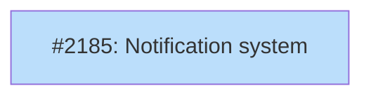

# DESIGN: Notification system

## Status

Implemented

## Context and Problem Statement

Tsuku's auto-update system (Features 1-4) can check for updates, apply them, and self-update the binary. But it has no coherent notification layer. The current `DisplayUnshownNotices` function in `internal/updates/apply.go` handles failure notices and self-update results, but it runs unconditionally on stderr with no suppression logic, no TTY awareness, and no "update available" messages for the common case where `auto_apply = false`.

Three gaps exist:

1. **No suppression.** Notifications print to stderr regardless of context. CI pipelines, piped output (`tsuku list | grep node`), and `--quiet` mode all see update noise. The PRD requires layered suppression: non-TTY stdout, `CI=true`, `--quiet`, and `TSUKU_NO_UPDATE_CHECK=1` (R12, R16).

2. **No "available update" notifications.** When `auto_apply = false`, users who check for updates but don't auto-apply get no indication that updates exist. The cached check results sit unused until the user runs `tsuku outdated` manually.

3. **No shared framework.** Self-update success, self-update failure, tool update failure, and tool update available are four distinct notification types with different formatting needs. They're currently handled by ad-hoc `fmt.Fprintf` calls with no common structure.

This is Feature 5 of the [auto-update roadmap](../roadmaps/ROADMAP-auto-update.md), implementing PRD requirements R12 (update notifications) and R16 (CI environment detection). It depends on Feature 2 (check infrastructure, done) and Feature 3 (auto-apply with rollback, done).

## Decision Drivers

- **CI safety is non-negotiable.** CI pipelines must never see unexpected stderr output from update notifications. The `CI=true` convention is standard across GitHub Actions, GitLab CI, CircleCI, and others. Suppression must be the default in these environments.
- **Explicit opt-in overrides suppression.** `TSUKU_AUTO_UPDATE=1` must override CI detection so users who want update behavior in CI can get it (PRD R16).
- **Notifications go to stderr, suppression checks stdout.** The PRD specifies suppression "when stdout is not a TTY" even though notifications write to stderr. This is deliberate: piped stdout means scripted context, so stderr noise should be suppressed too.
- **Existing infrastructure to build on.** The `internal/notices/` package, `DisplayUnshownNotices`, `UpdateCheckEntry` cache, and the `quietFlag` global in `cmd/tsuku/main.go` all exist. The design should extend these, not replace them.
- **Feature 7 (resilience) adds consecutive-failure suppression later.** This design handles one-shot display logic. Consecutive-failure counting is out of scope.
- **Self-update PR (#2199) changes.** PR #2199 moves `DisplayUnshownNotices` to be called independently from PersistentPreRun (outside the MaybeAutoApply gate) and adds self-update-specific formatting. This design should subsume and formalize that pattern.

## Considered Options

### Decision 1: Suppression gate architecture

Five signals can suppress notification output: non-TTY stdout, `CI=true`, `--quiet`, `TSUKU_NO_UPDATE_CHECK=1`, and the `TSUKU_AUTO_UPDATE=1` override that re-enables in CI. The question is how these compose and where the gate function lives.

The existing codebase has per-subsystem suppression scattered across userconfig methods: `UpdatesEnabled()` checks `TSUKU_NO_UPDATE_CHECK`, `UpdatesAutoApplyEnabled()` checks CI with `TSUKU_AUTO_UPDATE` override. But those control whether subsystems *run*, not whether *output is visible*. A separate gate is needed for notification rendering.

The cmd/internal package boundary adds a constraint: the `--quiet` flag lives in `cmd/tsuku/main.go` and can't be imported by internal packages.

Key assumptions:
- The gate applies to update-related stderr output, not operation error messages. Errors from `tsuku install` still print regardless.
- `TSUKU_AUTO_UPDATE=1` overrides CI detection for notifications, not just auto-apply. CI users who opt in should see what happened.
- `progress.IsTerminalFunc` remains the canonical stdout TTY check.

#### Chosen: Single ShouldSuppressNotifications function in internal/updates

A single `ShouldSuppressNotifications(quiet bool) bool` function in `internal/updates/suppress.go`. The `quiet` parameter bridges the cmd/internal boundary -- callers in cmd/tsuku pass the flag value.

Precedence order (first match wins):
1. `TSUKU_AUTO_UPDATE=1` -- explicit opt-in, never suppress
2. `TSUKU_NO_UPDATE_CHECK=1` -- explicit opt-out, always suppress
3. `CI=true` -- environmental suppression
4. `quiet` parameter -- user chose silence
5. Non-TTY stdout -- scripted context
6. Default -- don't suppress

The function is called at render time, not at startup, so it always reflects current state. The duplicated env var checks (CI, TSUKU_NO_UPDATE_CHECK also appear in userconfig) are acceptable because the responsibilities differ: userconfig answers "should this subsystem run?" while this function answers "should output be visible?"

#### Alternatives considered

**Extend userconfig with NotificationsEnabled() method.** Follows the existing pattern of `UpdatesEnabled()` and `UpdatesAutoApplyEnabled()`. Rejected because the method wouldn't use any Config fields -- it only reads env vars and parameters. A Config method that ignores its receiver is a code smell. The two required parameters (`quiet`, stdout TTY) make the signature awkward next to the zero-parameter methods.

**Notification context struct passed through.** Pre-compute suppression signals into a `NotificationContext` struct created once in PersistentPreRun, threaded to all call sites. Rejected because threading a struct through all callers adds plumbing cost for negligible gain. Env var lookups cost nanoseconds. A bool return is sufficient; the struct doesn't carry enough information to justify a new concept.

### Decision 2: Notification lifecycle and content

Four notification types need rendering: tool updates applied (success), tool update failures (with rollback), self-update results, and "updates available" summaries. The PRD says notifications should appear "after the primary command's output" (R12), but Cobra's `PersistentPostRun` doesn't fire when a command returns an error. Auto-apply results happen during `PersistentPreRun` (before the command runs).

The existing auto-apply design (DESIGN-auto-apply-rollback.md) already evaluated and rejected PostRun for auto-apply execution, citing the error-path gap. That reasoning applies equally to notifications produced by auto-apply.

Key assumptions:
- Cobra's PersistentPostRun non-firing on error is stable, documented behavior.
- Users tolerate pre-command notifications. Homebrew and apt show update reminders at the start of commands.
- The PRD's "after command output" language is a preference, not a hard constraint. The PRD doesn't address Cobra's error-path gap.

#### Chosen: Split timing with PreRun primary, PostRun best-effort supplement

All four notification types render in `PersistentPreRun` by default, extending the existing `DisplayUnshownNotices` pattern. This guarantees notifications always display, even when the subsequent command fails.

For "available update" summaries specifically, an optional `PersistentPostRun` hook can display them after command output on successful exits. This supplements PreRun, it doesn't replace it.

The four notification types and their data sources:

| Type | Data source | Format | Deduplication |
|------|------------|--------|---------------|
| Tool update applied | `[]ApplyResult` returned by MaybeAutoApply | `Updated <tool> <old> -> <new>` | Consumed on render |
| Tool update failed | `$TSUKU_HOME/notices/<tool>.json` | `Update failed: <tool> -> <ver>: <error>` | MarkShown flag |
| Self-update result | `$TSUKU_HOME/notices/tsuku.json` | Success: `tsuku updated to <ver>`. Failure: `self-update failed: <error>` | MarkShown flag |
| Updates available | `$TSUKU_HOME/cache/updates/<tool>.json` entries | `N updates available. Run 'tsuku update' to apply.` | Sentinel timestamp; resets when new check results arrive |

"Available update" summaries aggregate across tools. If 5 tools have updates, the user sees one line ("5 updates available"), not five. `tsuku outdated` provides the per-tool breakdown.

#### Alternatives considered

**All notifications in PostRun via deferred rendering.** Auto-apply writes results to notice files during PreRun, then a single PostRun handler renders everything. Rejected because Cobra's PersistentPostRun doesn't fire when the command returns an error. This creates a silent notification loss path that's hard to detect. The error path is precisely when notifications matter most (failed auto-apply with rollback). Workarounds like `defer` in main() are fragile and don't compose well with Cobra's error handling.

**All notifications in PreRun only.** Keep everything in PersistentPreRun with no PostRun involvement. This is the simplest option and fully reliable. Not rejected outright -- Option A is a strict superset. If PostRun adds complexity during implementation, it can be dropped without affecting the core design.

### Decision 3: Available-update summary format

When cache entries show updates are available (and `auto_apply = false`), the notification needs to tell the user. The question is how much detail to show in the pre-command notification versus deferring to `tsuku outdated`.

#### Chosen: Aggregated count with command hint

Show a single line: `N updates available. Run 'tsuku update' to apply.` This keeps PreRun output compact. Users who want per-tool details run `tsuku outdated`. The count is computed by iterating cache entries where `LatestWithinPin` is set and differs from `ActiveVersion`.

#### Alternatives considered

**Per-tool listing with versions.** Show each tool on its own line: `node 20.14.0 -> 20.15.0`. More informative but generates N lines of output before the user's command runs. For users with many tools installed, this dominates the terminal. Rejected for PreRun; could be added to the PostRun supplement later if users want it.

### Decision 4: Available-update deduplication

The "available updates" summary shouldn't appear on every command for the entire check interval (default 24h). The question is how to track whether the current check cycle's results have been shown.

#### Chosen: Sentinel file mtime comparison

A `.notified` sentinel file in `$TSUKU_HOME/cache/updates/`. `DisplayNotifications` touches this file after showing the summary. On the next command, it compares the sentinel mtime to the cache directory mtime. If the cache is newer (new check results arrived), the summary shows again. Zero parsing overhead -- just two `stat` calls.

#### Alternatives considered

**Per-entry "notified" field in cache JSON.** Add a `notified` boolean to `UpdateCheckEntry`. Rejected because it requires reading and rewriting every cache file after showing the summary. The sentinel approach is a single `stat` comparison.

## Decision Outcome

**Chosen: Single suppression gate + split PreRun/PostRun timing**

### Summary

A single `ShouldSuppressNotifications(quiet bool) bool` function in `internal/updates/suppress.go` gates all notification output. It evaluates five signals in precedence order: `TSUKU_AUTO_UPDATE=1` (never suppress), `TSUKU_NO_UPDATE_CHECK=1` (always suppress), `CI=true` (suppress), `--quiet` (suppress), non-TTY stdout (suppress). The function is called at render time before any stderr write.

Notification rendering happens in two places. `PersistentPreRun` is the primary path: after `MaybeAutoApply` runs, `DisplayNotifications` reads notice files (failures, self-update results) and cache entries (available updates when `auto_apply = false`), calls the suppression gate, and formats output to stderr. `PersistentPostRun` is a best-effort supplement that shows "N updates available" after command output on successful exits. If PostRun adds complexity, it can be dropped -- PreRun handles everything.

The four notification types use two existing data sources. Failure and self-update notices come from `$TSUKU_HOME/notices/<tool>.json` files (the `Notice` struct with `Shown` flag for one-time display). "Available update" summaries come from `$TSUKU_HOME/cache/updates/<tool>.json` entries (the `UpdateCheckEntry` struct with `LatestWithinPin` set). Tool update success is printed inline during `MaybeAutoApply`, not through the notice system.

"Available update" summaries aggregate: "5 updates available" rather than listing each tool. A "last-notified" sentinel file tracks whether the current check cycle's results have been shown, preventing the same summary from appearing on every command until the next check.

### Rationale

These decisions reinforce each other. The suppression gate is a pure function that doesn't depend on timing -- it works identically in PreRun and PostRun. The PreRun-primary timing means the gate is always evaluated, even when PostRun doesn't fire. And the aggregated "available update" format keeps PreRun output compact (one line) so it doesn't clutter pre-command output.

The key trade-off is showing notifications before command output rather than after. This contradicts the PRD's R12 language ("after the primary command's output") but is necessary because Cobra's PostRun is unreliable on error paths. Homebrew, apt, and other package managers show update reminders at command start, so users have an established mental model for this pattern.

## Solution Architecture

### Overview

The notification system adds a suppression gate and a unified rendering function to the existing update infrastructure. It doesn't introduce a new package -- the changes land in `internal/updates/` alongside the existing `DisplayUnshownNotices` and notice-writing code. The rendering function replaces the current ad-hoc `fmt.Fprintf` calls with type-aware formatting gated by the suppression function.

### Components

```
cmd/tsuku/main.go (PersistentPreRun)
  |
  +-- updates.CheckAndSpawnUpdateCheck(...)       [existing]
  +-- results := updates.MaybeAutoApply(...)      [existing, now returns []ApplyResult]
  +-- updates.DisplayNotifications(cfg, quiet, results)  [new, replaces DisplayUnshownNotices]
  |     |
  |     +-- ShouldSuppressNotifications(quiet)    [new gate]
  |     +-- renderApplyResults(results)            [success/failure from auto-apply]
  |     +-- renderNotices(noticesDir)               [self-update results from notices/]
  |     +-- renderAvailableUpdates(cacheDir)        [from cache entries]
  |
cmd/tsuku/main.go (PersistentPostRun, optional)
  +-- updates.DisplayAvailableSummary(cfg, quiet)  [new, best-effort]
```

### Key interfaces

**Suppression gate** (`internal/updates/suppress.go`):

```go
// ShouldSuppressNotifications returns true when notification output should be
// silenced. Precedence: TSUKU_AUTO_UPDATE=1 (never suppress) > TSUKU_NO_UPDATE_CHECK=1
// (always suppress) > CI=true (suppress) > quiet flag (suppress) > non-TTY stdout
// (suppress) > default (don't suppress).
func ShouldSuppressNotifications(quiet bool) bool
```

**Unified renderer** (`internal/updates/notify.go`):

```go
// ApplyResult captures the outcome of a single auto-apply attempt.
// Returned by MaybeAutoApply for rendering by DisplayNotifications.
type ApplyResult struct {
    Tool        string
    OldVersion  string
    NewVersion  string
    Err         error
}

// DisplayNotifications renders all pending notification types to stderr.
// Replaces the existing DisplayUnshownNotices. Called from PersistentPreRun.
// The quiet parameter is the value of the --quiet flag from cmd/tsuku.
// The results parameter carries auto-apply outcomes from MaybeAutoApply.
func DisplayNotifications(cfg *config.Config, quiet bool, results []ApplyResult)

// DisplayAvailableSummary renders available-update summaries to stderr.
// Best-effort supplement called from PersistentPostRun. Shows "N updates
// available" if any cache entries have LatestWithinPin set and the summary
// hasn't been shown yet this check cycle.
func DisplayAvailableSummary(cfg *config.Config, quiet bool)
```

**Available-update sentinel** (`$TSUKU_HOME/cache/updates/.notified`):

A sentinel file whose mtime tracks when the "available updates" summary was last shown. When the update checker runs and writes new cache entries, it touches the sentinel's parent directory, making the sentinel older than the directory. `DisplayNotifications` compares the sentinel mtime to the cache directory mtime to decide whether to show the summary again.

**MaybeAutoApply result reporting:**

`MaybeAutoApply` in `apply.go` returns `[]ApplyResult` instead of printing directly. Each result carries the tool name, old version, new version, and any error. `DisplayNotifications` reads these results and renders "Updated X" lines for successes alongside failure notices. This keeps `MaybeAutoApply` as a pure infrastructure function with no output responsibility.

### Data flow

1. Background check writes per-tool cache entries to `$TSUKU_HOME/cache/updates/<tool>.json`
2. `MaybeAutoApply` reads cache entries, installs updates, writes failure notices to `$TSUKU_HOME/notices/`, returns `[]ApplyResult`
3. `DisplayNotifications` receives `[]ApplyResult`, renders "Updated X" for successes and failure details for errors (gated by suppression)
4. `DisplayNotifications` reads unshown notices (self-update results) and displays them (gated by suppression), marks them shown
5. `DisplayNotifications` reads cache entries, counts tools with `LatestWithinPin` set, prints "N updates available" if the sentinel is stale (gated by suppression), touches sentinel
6. User's command runs
7. `DisplayAvailableSummary` (PostRun, optional) re-checks and shows the summary if not shown in step 5

## Implementation Approach

### Phase 1: Suppression gate

Add `ShouldSuppressNotifications(quiet bool) bool` in `internal/updates/suppress.go` with tests. The function evaluates the five signals in precedence order. Uses `progress.IsTerminalFunc` for stdout TTY detection (already used elsewhere in the codebase).

Deliverables:
- `internal/updates/suppress.go`
- `internal/updates/suppress_test.go`

### Phase 2: Unified renderer

Replace `DisplayUnshownNotices` with `DisplayNotifications(cfg, quiet)` in `internal/updates/notify.go`. This function:
- Calls the suppression gate first
- Renders failure notices (existing logic from `DisplayUnshownNotices`)
- Renders self-update notices (existing logic from `DisplayUnshownNotices`)
- Reads cache entries and renders "N updates available" summary with sentinel tracking

Change `MaybeAutoApply` to return `[]ApplyResult` instead of printing directly. Update `cmd/tsuku/main.go` to call `DisplayNotifications(cfg, quietFlag, results)` instead of `DisplayUnshownNotices(cfg)`.

Deliverables:
- `internal/updates/notify.go` (new, replaces display logic in apply.go)
- `internal/updates/notify_test.go`
- Edit `internal/updates/apply.go` (remove `DisplayUnshownNotices`, change MaybeAutoApply signature to return `[]ApplyResult`)
- Edit `cmd/tsuku/main.go` (update call site, pass results)

### Phase 3: PostRun supplement and functional tests

Add `DisplayAvailableSummary` called from `PersistentPostRun` in main.go. Add functional test scenarios covering suppression (quiet flag, CI env) and notification display.

Deliverables:
- Edit `cmd/tsuku/main.go` (add PersistentPostRun)
- `test/functional/features/notifications.feature`
- Update README if notification behavior is user-facing

## Security Considerations

The notification system is a display layer that reads locally-generated JSON from user-owned directories (`$TSUKU_HOME/notices/`, `$TSUKU_HOME/cache/updates/`) and writes formatted text to stderr. It introduces no new external inputs, no network access, no privilege changes, and no sensitive data handling. The suppression gate correctly prevents output leakage in CI environments by checking `CI=true` before any stderr writes.

One hardening consideration: error messages from failed updates flow through to stderr notifications. These can contain URLs with query parameters or sensitive path components. Implementation should sanitize URLs in error strings (strip auth and query parameters) before rendering.

## Consequences

### Positive

- CI pipelines stop receiving unexpected stderr output from update notifications
- Users with `auto_apply = false` learn about available updates without running `tsuku outdated`
- The suppression gate is reusable by future notification types (Feature 6 out-of-channel, Feature 7 consecutive-failure)
- Aggregated "N updates available" keeps output compact compared to per-tool lines

### Negative

- Notifications appear before command output (PreRun), contradicting PRD R12's "after command output" language
- The suppression gate duplicates some env var checks from `userconfig.UpdatesEnabled()` and `UpdatesAutoApplyEnabled()`
- The "last-notified" sentinel adds another file to `$TSUKU_HOME/cache/updates/`

### Mitigations

- The PostRun supplement shows available-update summaries after output on happy paths, partially satisfying R12
- Duplication is intentional: userconfig methods control subsystem execution, the gate controls output visibility. Different responsibilities, shared signals.
- The sentinel is a zero-byte file with no parsing overhead; it's created in a directory that already exists

## Implementation Issues

PLAN: `docs/plans/PLAN-notification-system.md` (single-pr mode)

| Issue | Dependencies | Tier |
|-------|--------------|------|
| [#2185: notification system](https://github.com/tsukumogami/tsuku/issues/2185) | [#2183](https://github.com/tsukumogami/tsuku/issues/2183), [#2184](https://github.com/tsukumogami/tsuku/issues/2184) | testable |
| _Suppression gate, unified renderer, PostRun supplement. Single-pr implementation with 3 internal issues tracked in PLAN doc._ | | |



**Legend**: Blue = ready, Yellow = blocked
