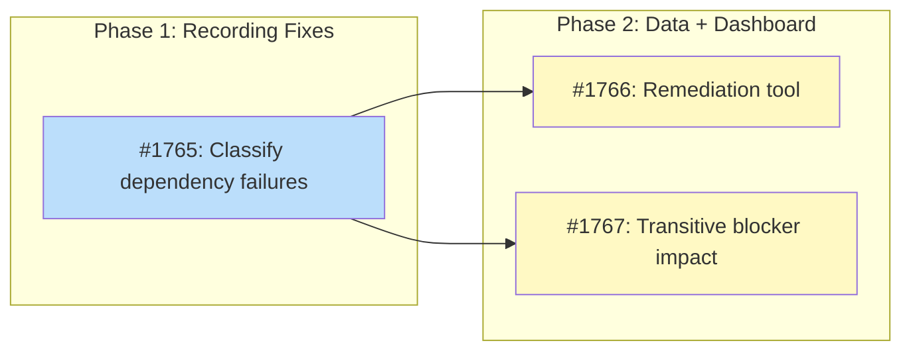

# DESIGN: Pipeline Blocker Tracking

## Status

Planned

## Implementation Issues

### Milestone: [pipeline-blocker-tracking](https://github.com/tsukumogami/tsuku/milestone/89)

| Issue | Dependencies | Tier |
|-------|--------------|------|
| [#1765: fix(batch): classify dependency failures correctly in CLI and orchestrator](https://github.com/tsukumogami/tsuku/issues/1765) | None | testable |
| _Reorders the CLI's `classifyInstallError()` so dependency errors get exit code 8, adds exit code 3 to the orchestrator's category mapping, and extracts `blocked_by` from generate-phase output. Establishes the regex pattern and validation logic that the remediation tool and dashboard fixes build on._ | | |
| [#1766: feat(batch): add remediation tool for misclassified failure records](https://github.com/tsukumogami/tsuku/issues/1766) | [#1765](https://github.com/tsukumogami/tsuku/issues/1765) | testable |
| _Patches hundreds of existing failure records that were misclassified as `validation_failed` with empty `blocked_by`. Flips corresponding queue entries from `failed` to `blocked` and regenerates the dashboard so operators see accurate data immediately._ | | |
| [#1767: fix(dashboard): compute transitive blocker impact with normalized keys](https://github.com/tsukumogami/tsuku/issues/1767) | [#1765](https://github.com/tsukumogami/tsuku/issues/1765) | testable |
| _Rewrites `computeTransitiveBlockers()` to normalize blocker keys (stripping ecosystem prefixes) and compute recursive impact with cycle detection. Adds `direct_count` and `total_count` fields to the Blocker struct and updates the frontend to display `total_count` as the primary metric._ | | |

### Dependency Graph



**Legend**: Green = done, Blue = ready, Yellow = blocked, Purple = needs-design, Orange = tracks-design

## Context and Problem Statement

The pipeline dashboard's "Top Blockers" panel shows which missing dependencies are blocking the most recipe generation. In practice, this panel is nearly empty despite hundreds of failed recipes, many of which fail precisely because a dependency recipe doesn't exist in the registry.

The root cause spans three layers of the pipeline:

**1. Recording gap in the generate phase.** The orchestrator's `generate()` method runs `tsuku create` and classifies failures using `categoryFromExitCode()` without parsing structured output. When recipe creation fails because a dependency like `bdw-gc` doesn't exist, the failure gets categorized as `validation_failed` with no `blocked_by` data -- even though the error message clearly says "recipe bdw-gc not found in registry."

**2. CLI exit code precedence bug.** In `classifyInstallError()`, the `errors.As` check for `RegistryError{NotFound}` fires before the string-based "failed to install dependency" check. When a dependency recipe is missing, the wrapped error chain (using `%w`) contains both the "failed to install dependency" wrapper and the underlying `RegistryError`, but `errors.As` unwraps through `%w` and returns exit code 3 (`ExitRecipeNotFound`) instead of 8 (`ExitDependencyFailed`). Note: there are two separate `categoryFromExitCode()` functions -- the CLI version (`cmd/tsuku/install.go`) already handles exit code 3 correctly, but the orchestrator's version (`internal/batch/orchestrator.go`) does not, so it falls through to the default `validation_failed`.

**3. Broken transitive blocker computation.** The dashboard's `computeTransitiveBlockers()` function looks up blocked packages (format: `"homebrew:ffmpeg"`) in the blockers map, but the map's keys are dependency names (format: `"dav1d"`). This key format mismatch means transitivity never triggers in practice -- every blocker shows only its direct dependents.

The combined effect: the dashboard can't answer basic pipeline questions like "what should we unblock next to get the most recipes through?" Missing this information means operators make ad-hoc decisions about which dependencies to prioritize, reducing pipeline throughput.

### Scope

**In scope:**
- Fix failure recording to populate `blocked_by` for dependency-related failures
- Fix CLI exit code classification for dependency errors
- Remediate existing failure records and queue entries
- Fix transitive blocker computation in dashboard generation
- Improve blocker display on the dashboard

**Out of scope:**
- Changes to the circuit breaker or retry logic
- New dashboard pages (changes are to existing panels and data)
- Failure JSONL retention or rotation policy
- Alerting system for unresolved blockers
- Updating `requeue-unblocked.sh` to use the unified queue format (it currently references the legacy per-ecosystem queue files; this predates and is independent of this design)

## Decision Drivers

- **Recording accuracy**: dependency failures must be classified correctly at the source so that downstream consumers (dashboard, requeue scripts, operators) all see consistent data
- **Data completeness**: hundreds of existing failure records need remediation; the fix can't only apply to future runs
- **Dashboard utility**: the blocker panel should help operators decide what to unblock next, which requires transitive impact counts
- **Backward compatibility**: changes must not break existing queue processing, CI workflows, or the `requeue-unblocked.sh` script
- **Minimal disruption**: prefer targeted fixes in existing code paths over pipeline architecture changes

## Considered Options

### Decision 1: Where to fix dependency failure classification

The current classification logic spreads across three locations: the CLI's `classifyInstallError()`, the orchestrator's `categoryFromExitCode()` fallback, and the orchestrator's `generate()` method which skips JSON parsing entirely. The fix needs to ensure that all paths through which a dependency failure can occur produce both the correct category and a populated `blocked_by` list.

#### Chosen: Fix at both CLI and orchestrator levels

Fix the CLI's `classifyInstallError()` to check for the "failed to install dependency" string *before* the `errors.As` check for `RegistryError`. This ensures dependency failures always get exit code 8 regardless of the underlying error type. Additionally, add exit code 3 to the orchestrator's `categoryFromExitCode()` switch so that even if a recipe-not-found error escapes the dependency check, it maps to `"recipe_not_found"` instead of the catch-all `"validation_failed"`.

For the generate phase, add dependency extraction from the error message. The `generate()` method currently creates a `FailureRecord` without any `blocked_by` data. Since `tsuku create` doesn't support `--json` output, parse the combined stderr/stdout for "recipe X not found in registry" patterns (reusing the same regex from `extractMissingRecipes`) and populate the `FailureRecord.BlockedBy` field. When `blocked_by` is non-empty, override the category to `"missing_dep"`.

#### Alternatives Considered

**Fix only at the dashboard level (parse error messages during dashboard generation).** Extract dependency names from failure record messages when computing blockers, treating the message as a fallback data source.
Rejected because this treats the symptom rather than the cause. The queue status would still be wrong (`failed` instead of `blocked`), `requeue-unblocked.sh` wouldn't know to check these entries, and every new consumer of failure data would need to duplicate the message-parsing logic.

**Add `--json` output to `tsuku create` and parse it in `generate()`.** This would provide structured output from the create command, matching how `validate()` uses `--json` from `tsuku install`.
Rejected because it's more work than needed. The create command's error messages already contain the dependency names in a parseable format, and the regex extraction approach is battle-tested in `extractMissingRecipes()`. Adding `--json` to create is a good future improvement but not required to solve this problem.

### Decision 2: How to remediate existing data

Hundreds of failure records in `data/failures/*.jsonl` have `category: "validation_failed"` and no `blocked_by` despite containing "recipe X not found in registry" in their message text. The unified queue also has entries stuck in `failed` status that should be `blocked`. Operators need correct data for the dashboard to be useful, so we can't wait for natural data turnover.

#### Chosen: One-time Go remediation tool

Write a Go tool (in `cmd/remediate-blockers/` or as a `--remediate` flag on `cmd/batch-generate`) that:

1. Scans all `data/failures/*.jsonl` files for records where the message matches `recipe (\S+) not found in registry` but `blocked_by` is empty or the category isn't `missing_dep`/`recipe_not_found`. Only legacy batch-format records (with `failures[]` array and `message` fields) can be remediated; per-recipe format records (with `recipe`, `platform`, `exit_code` but no `message`) lack the text needed for extraction and are skipped.
2. Skips records that already have `category: "missing_dep"` with non-empty `blocked_by` (idempotent).
3. Updates matching records in-place: sets `category` to `"missing_dep"`, populates `blocked_by` with extracted dependency names. Validates extracted names -- rejects any containing `/`, `\`, `..`, `<`, or `>` to prevent path traversal in downstream consumers like `requeue-unblocked.sh`.
4. Scans `data/queues/priority-queue.json` for entries whose name matches a remediated failure record and whose status is `failed`. Updates their status to `blocked`.
5. Regenerates `dashboard.json` to reflect the corrected data.
6. Prints a summary report: records scanned, records updated, unique dependency names found.

Go is preferred over bash+jq because it shares the regex directly with the orchestrator code, provides type-safe JSON parsing for the complex JSONL formats (which contain messages with special characters), and is consistent with the rest of the pipeline tooling. The tool runs as part of the implementation PR, so the data fix is reviewed alongside the code fix.

#### Alternatives Considered

**Let data self-correct over time.** Once the recording fix is deployed, new batch runs will produce correct failure records, eventually replacing the bad ones.
Rejected because the pipeline processes each package at most once (or rarely via retry with backoff). Many of the miscategorized entries won't be re-run for weeks or months, leaving the dashboard inaccurate for the foreseeable future.

**Fix only in dashboard generation (parse messages at render time).** The dashboard's `loadFailures()` could extract dependency names from messages as a secondary data source.
Rejected because this creates a discrepancy between what the JSONL files say and what the dashboard shows. Other consumers (requeue scripts, future tooling) would still see wrong data.

### Decision 3: How to compute and display transitive blocker impact

The current `computeTransitiveBlockers()` function has a key format mismatch that prevents transitivity from working. Beyond fixing this bug, the user wants the dashboard to show the full transitive impact of each missing dependency -- not just how many recipes directly need it, but how many total recipes would be unblocked if it were available.

#### Chosen: Normalize blocker keys and compute transitive counts in dashboard generation

Fix the blocker computation to use normalized dependency names (without ecosystem prefix) as keys. When building the blockers map, strip the ecosystem prefix from package IDs so that both blocker keys and blocked package lookups use the same format (e.g., `"ffmpeg"` rather than `"homebrew:ffmpeg"`).

For the transitive computation, build a two-level dependency graph:
1. **Direct blockers**: dependency name -> list of packages that list it in `blocked_by`
2. **Package-as-blocker**: for each blocked package, check if other packages list it in their `blocked_by` (i.e., the blocked package is itself a dependency of something else)

The `Blocker` struct gets two count fields: `direct_count` (immediate dependents) and `total_count` (including transitive). The dashboard display shows `total_count` as the primary number with `direct_count` available on hover or in the detail view.

On the dashboard, sort blockers by `total_count` descending. This surfaces the dependencies that would unblock the most downstream work if resolved, which directly answers the "what should we unblock next?" question.

#### Alternatives Considered

**Build a full dependency graph at queue load time.** Read all recipe files to build a complete dependency tree, then compute blocker impact from the graph.
Rejected because recipe files aren't available at dashboard generation time (they live in `$TSUKU_HOME/registry/`, not in the repo). The failure records' `blocked_by` field is the right data source for this computation.

**Keep the flat (non-transitive) model.** Fix the key mismatch but don't compute transitive impact; just show direct dependent counts.
Rejected because the user explicitly wants transitive aggregation, and it's the more useful metric for prioritization. A dependency that directly blocks 2 packages but transitively blocks 20 should be prioritized over one that directly blocks 5 but has no transitive impact.

## Decision Outcome

### Summary

The fix addresses all three layers of the problem. At the CLI level, `classifyInstallError()` gets reordered so the "failed to install dependency" string check runs before the `errors.As` type check, ensuring dependency failures consistently get exit code 8. The orchestrator's `categoryFromExitCode()` gains a case for exit code 3 (`recipe_not_found`), closing the fallback gap. In the `generate()` method, a new `extractBlockedBy()` helper applies the existing `reNotFoundInRegistry` regex to the combined output, populating `blocked_by` and overriding the category to `missing_dep` when matches are found.

For existing data, a remediation script scans all failure JSONL files and the unified queue. It patches records that have dependency-related error messages but wrong categories and missing `blocked_by` fields. It also flips queue entries from `failed` to `blocked` when their corresponding failure records indicate dependency issues. The script runs once as part of the implementation PR and produces a summary for review.

The dashboard computation gets two fixes. First, blocker map keys are normalized to plain dependency names (stripping ecosystem prefixes) so that the transitive lookup works correctly. Second, the `Blocker` struct gains `DirectCount` and `TotalCount` fields. `TotalCount` includes packages blocked transitively -- if `openssl@3` blocks `curl` and `curl` blocks `wget`, then `openssl@3` has `DirectCount: 1` (curl) and `TotalCount: 2` (curl + wget). The dashboard sorts by `TotalCount` and displays it as the primary metric.

### Rationale

Fixing at the recording level rather than the display level ensures that all data consumers -- the dashboard, `requeue-unblocked.sh`, future tooling -- see consistent, correct data. The CLI fix is small (reorder two conditions) and eliminates the most common misclassification path. The orchestrator fixes close the remaining gaps: the `categoryFromExitCode()` addition handles edge cases where exit code 3 reaches the fallback, and the `generate()` extraction handles the many failures that occur during recipe creation rather than validation.

The remediation script is necessary because the pipeline processes packages infrequently; waiting for natural data turnover would leave the dashboard inaccurate for weeks. Running it as part of the implementation PR ensures the data fix is reviewed and reversible.

Transitive counting is the right model for prioritization because dependency chains in package ecosystems can be deep. A single missing foundational library (like `glib` or `openssl@3`) can block dozens of packages through intermediate dependencies. Showing only direct counts would undervalue these high-impact blockers.

### Trade-offs Accepted

- The remediation script modifies committed data files, producing a potentially large diff in the PR. This is acceptable because the data is already committed and the changes are mechanical (verifiable by reviewing the script logic rather than each record).
- The generate-phase extraction uses regex on stderr output, which is less reliable than structured JSON. This is acceptable because the same regex (`reNotFoundInRegistry`) is already used and proven in `extractMissingRecipes()`, and `tsuku create` doesn't support `--json`.
- Transitive computation adds complexity to `computeTopBlockers()`. The current implementation is ~30 lines; the transitive version will be ~50-60 lines. This is acceptable given the direct user value.

## Solution Architecture

### Overview

The changes touch four areas: CLI error classification, orchestrator recording, data remediation, and dashboard computation/display.

```
CLI (cmd/tsuku/)               Orchestrator (internal/batch/)
+---------------------------+  +-------------------------------+
| classifyInstallError()    |  | generate()                    |
|  - Reorder: string check  |  |  - Add extractBlockedBy()     |
|    before errors.As       |  |  - Populate BlockedBy field   |
|                           |  |  - Override category when     |
+---------------------------+  |    blocked_by is non-empty    |
                               |                               |
                               | categoryFromExitCode()        |
                               |  - Add case for exit code 3   |
                               +-------------------------------+

Remediation (cmd/)             Dashboard (internal/dashboard/)
+---------------------------+  +-------------------------------+
| remediate-blockers        |  | computeTopBlockers()          |
|  - Scan failure JSONLs    |  |  - Normalize blocker keys     |
|  - Patch categories +     |  |  - Two-count Blocker struct   |
|    blocked_by             |  |  - Transitive computation     |
|  - Update queue statuses  |  |                               |
|  - Regenerate dashboard   |  | Blocker JSON schema           |
+---------------------------+  |  - direct_count, total_count  |
                               +-------------------------------+

Frontend (website/pipeline/)
+---------------------------+
| index.html                |
|  - Show total_count as    |
|    primary blocker metric |
|  - Direct count on hover  |
+---------------------------+
```

### Components

**1. CLI: `classifyInstallError()` reorder** (`cmd/tsuku/install.go`)

Move the `strings.Contains(err.Error(), "failed to install dependency")` check before the `errors.As(err, &regErr)` check. This ensures that wrapped dependency errors get exit code 8 even when the inner error is a `RegistryError`.

```go
func classifyInstallError(err error) int {
    // Check for dependency wrapper FIRST -- a dependency failure
    // wrapping a RegistryError should be classified as dependency,
    // not by the inner error's type.
    if strings.Contains(err.Error(), "failed to install dependency") {
        return ExitDependencyFailed // 8
    }
    var regErr *registry.RegistryError
    if errors.As(err, &regErr) {
        switch regErr.Type {
        case registry.ErrTypeNotFound:
            return ExitRecipeNotFound // 3
        case registry.ErrTypeNetwork, registry.ErrTypeDNS,
            registry.ErrTypeTimeout, registry.ErrTypeConnection, registry.ErrTypeTLS:
            return ExitNetwork // 5
        }
    }
    return ExitInstallFailed // 6
}
```

**2. Orchestrator: `categoryFromExitCode()` addition** (`internal/batch/orchestrator.go`)

Add exit code 3 to the switch. Note: the exit code constants (`ExitRecipeNotFound`, etc.) live in `cmd/tsuku/exitcodes.go` and can't be imported by `internal/batch/` due to Go's import rules. The orchestrator already uses integer literals with comments; add exit code 3 following the same pattern:

```go
func categoryFromExitCode(exitCode int) string {
    switch exitCode {
    case 3: // ExitRecipeNotFound
        return "recipe_not_found"          // NEW
    case 5: // ExitNetwork
        return "api_error"
    case 6: // ExitInstallFailed
        return "validation_failed"
    case 7: // ExitVerifyFailed
        return "validation_failed"
    case 8: // ExitDependencyFailed
        return "missing_dep"
    case 9:
        return "deterministic_insufficient"
    default:
        return "validation_failed"
    }
}
```

**3. Orchestrator: `generate()` dependency extraction** (`internal/batch/orchestrator.go`)

After creating the `FailureRecord` in `generate()`, apply regex extraction to the output:

```go
// Extract blocked_by from generate output when message indicates
// missing dependencies. Reuses the same regex as extractMissingRecipes.
blockedBy := extractBlockedByFromOutput(output)
failure := FailureRecord{
    PackageID: pkg.Source,
    Category:  categoryFromExitCode(exitCode),
    BlockedBy: blockedBy,
    Message:   truncateOutput(output),
    Timestamp: nowFunc(),
}
if len(blockedBy) > 0 && failure.Category == "validation_failed" {
    failure.Category = "missing_dep"
}
```

The `extractBlockedByFromOutput()` function uses the same `reNotFoundInRegistry` regex pattern compiled in the CLI (`recipe (\S+) not found in registry`). Since the orchestrator is in `internal/batch/` (not `cmd/tsuku/`), the pattern is copied locally with a cross-referencing comment pointing to the CLI's canonical definition. Moving the regex to a shared internal package is unnecessary for a single pattern; if more patterns need sharing later, refactor then.

The function validates extracted dependency names, rejecting any containing `/`, `\`, `..`, `<`, or `>` to prevent path traversal or injection in downstream consumers.

**4. Orchestrator: `Run()` status logic update** (`internal/batch/orchestrator.go`)

The generate-phase failure handling in `Run()` currently always calls `recordFailure()`. When the generate phase produces a failure with non-empty `BlockedBy`, set `StatusBlocked` instead:

```go
if genResult.Err != nil {
    result.Failures = append(result.Failures, genResult.Failure)
    if len(genResult.Failure.BlockedBy) > 0 {
        result.Blocked++
        pkg.Status = StatusBlocked
    } else {
        result.Failed++
        ecoResult.Failed++
        o.recordFailure(idx)
    }
    result.PerEcosystem[eco] = ecoResult
    continue
}
```

**5. Remediation tool** (`cmd/remediate-blockers/main.go`)

A Go program that:
1. Reads each `.jsonl` file in `data/failures/`, parsing both legacy batch format (with `failures[]` array) and per-recipe format records
2. For legacy batch records: checks if `message` matches `recipe (\S+) not found in registry` and `blocked_by` is empty or category is not `missing_dep`/`recipe_not_found`. Skips records already correctly categorized (idempotent).
3. For per-recipe records: skips entirely (no `message` field to extract from)
4. Updates matching records in-place: sets `category` to `"missing_dep"`, populates `blocked_by` with validated dependency names
5. Cross-references with `data/queues/priority-queue.json` to flip `failed` entries to `blocked` when their failure records indicate dependency issues
6. Regenerates `dashboard.json`
7. Prints summary report: files scanned, records updated, unique dependency names found, queue entries flipped

**6. Dashboard: normalized blocker computation** (`internal/dashboard/dashboard.go`)

In `loadFailures()`, normalize the blocked-by dependency names. Currently the blockers map uses raw dependency names from the failure records. The blocked packages are stored as full package IDs (e.g., `"homebrew:ffmpeg"`). For transitive lookups to work, we need to also check if a blocked package name (without ecosystem prefix) appears as a blocker.

Update `computeTopBlockers()`:

```go
type Blocker struct {
    Dependency  string   `json:"dependency"`
    Count       int      `json:"count"`        // Total (transitive) -- kept for backward compat
    DirectCount int      `json:"direct_count"`
    TotalCount  int      `json:"total_count"`   // Same as Count; explicit name for clarity
    Packages    []string `json:"packages"`      // First 5 package names
}
```

`Count` is retained as an alias for `TotalCount` to avoid breaking any existing consumers of `dashboard.json`. Both fields emit the same value. New code should use `total_count`; `count` can be removed once all consumers are updated.

Build a reverse index: for each package ID in the blockers map values, extract the bare name (after the colon) and check if that name is also a key in the blockers map. If so, the transitive chain continues.

```go
func computeTransitiveBlockers(dep string, blockers map[string][]string,
    pkgToBare map[string]string, memo map[string]int) int {

    if count, ok := memo[dep]; ok {
        return count
    }
    // Mark as in-progress to detect cycles
    memo[dep] = 0

    total := 0
    for _, pkgID := range blockers[dep] {
        total++ // Direct dependent
        // Check if this package itself blocks others
        bare := pkgToBare[pkgID]
        if _, isBlocker := blockers[bare]; isBlocker && bare != dep {
            total += computeTransitiveBlockers(bare, blockers, pkgToBare, memo)
        }
    }
    memo[dep] = total
    return total
}
```

**7. Frontend: display changes** (`website/pipeline/index.html`)

Update the blocker rendering to show `total_count`:

```javascript
const blockerItems = (data.blockers || []).slice(0, 10).map(b => `
    <a href="/pipeline/blocked.html?blocker=${encodeURIComponent(b.dependency)}" class="status-row">
        <span class="blocker-name">${esc(b.dependency)}</span>
        <span class="blocker-count" title="${esc(b.direct_count)} direct">
            ${esc(b.total_count)} blocked
        </span>
    </a>
`).join('') || '<div class="no-data">No blocking dependencies</div>';
```

### Data Flow

```
tsuku create (fails)
  |
  v
generate() extracts blocked_by from output
  |
  v
FailureRecord{category: "missing_dep", blocked_by: ["glib"]}
  |
  v
Run() sets pkg.Status = StatusBlocked
  |
  v
WriteFailures() -> data/failures/<eco>-<timestamp>.jsonl
SaveUnifiedQueue() -> data/queues/priority-queue.json
  |
  v
update-dashboard workflow triggers
  |
  v
dashboard.Generate() reads failures, builds normalized blocker map
  |
  v
computeTopBlockers() calculates direct + transitive counts
  |
  v
dashboard.json -> website/pipeline/index.html renders Top Blockers
```

## Implementation Approach

### Phase 1: CLI and Orchestrator Fixes

Changes to core recording logic. Must be done first because Phase 2 depends on correct categorization.

- Reorder `classifyInstallError()` in `cmd/tsuku/install.go`
- Add exit code 3 case to orchestrator's `categoryFromExitCode()` in `internal/batch/orchestrator.go`
- Add `extractBlockedByFromOutput()` to `internal/batch/orchestrator.go`
- Update `generate()` to use the new extraction
- Update `Run()` to set `StatusBlocked` for generate failures with non-empty `blocked_by`
- Update existing tests; add tests for the reorder and new extraction logic

### Phase 2: Data Remediation

Depends on Phase 1 being reviewed and correct, so the remediation tool uses the same regex and validation logic.

- Write `cmd/remediate-blockers/main.go` (Go, sharing regex pattern with orchestrator)
- Run it against current `data/failures/` and `data/queues/`
- Commit the modified data files alongside the tool
- Include summary report in the PR description

### Phase 3: Dashboard Computation and Display

Can be developed in parallel with Phase 2 but tested after remediation runs.

- Update `Blocker` struct with `DirectCount` and `TotalCount` fields
- Fix key normalization in `loadFailures()` and `computeTopBlockers()`
- Implement transitive computation with cycle detection
- Update `website/pipeline/index.html` to display `total_count`
- Add/update dashboard generation tests

## Security Considerations

### Download Verification

**Not applicable.** This design modifies failure classification and dashboard display logic. It doesn't change how binaries are downloaded, verified, or installed. The existing checksum and signature verification in the install path is unaffected.

### Execution Isolation

**Not applicable.** The changes are in classification logic (which exit code maps to which category), data remediation (modifying JSONL files and queue entries), and dashboard rendering (static HTML/JSON). No new processes are spawned and no permission changes are involved.

### Supply Chain Risks

**Low risk, mitigated.** The remediation tool and the new `extractBlockedByFromOutput()` function modify pipeline metadata consumed by the dashboard and requeue scripts. Potential vectors:

- **Regex extraction from error messages**: a crafted package name or error output could produce unexpected `blocked_by` values. The `\S+` regex captures any non-whitespace, which could include path traversal sequences (e.g., `../../etc/passwd`) if they appeared in an error message.
- **Manipulated blocker data**: incorrect `blocked_by` values could cause `requeue-unblocked.sh` to construct unintended file paths when checking if blocker recipes exist, or could permanently block packages by referencing nonexistent dependencies.
- **Denial of progress**: setting packages to `blocked` status prevents retry, which is operationally visible but not self-correcting.

Mitigations:
- Extracted dependency names are validated -- names containing `/`, `\`, `..`, `<`, or `>` are rejected. This prevents path traversal in downstream consumers.
- The remediation tool is idempotent and its output (modified data files) is included in the PR diff for inspection.
- All `blocked_by` values originate from error messages produced by the tsuku CLI itself (not from external user input), limiting the attack surface to compromised package ecosystems.
- The dashboard uses DOM-based escaping (`esc()` function) for all displayed values, preventing XSS from package names.

### User Data Exposure

**Not applicable.** The failure records contain package names, error messages, and timestamps. No user-specific data is involved. The dashboard displays this data publicly, which is the existing behavior. The design doesn't change what data is collected or exposed.

## Consequences

### Positive

- The "Top Blockers" panel becomes accurate, showing the actual dependencies that block the most recipes
- Operators can make data-driven decisions about which dependencies to prioritize for recipe creation
- The `requeue-unblocked.sh` script benefits from correct `blocked` queue status, automatically requeuing entries when their dependencies are resolved
- Transitive counts help identify high-impact foundational dependencies (like `glib`, `openssl@3`) that would unlock many downstream recipes

### Negative

- The remediation PR will have a large diff due to modified data files, making review less ergonomic
- The generate-phase regex extraction depends on a specific error message format ("recipe X not found in registry"), which could change if the CLI error messages are reworded
- Two `Blocker` count fields (`direct_count` and `total_count`) add modest complexity to the JSON schema and frontend rendering

### Mitigations

- Remediation diff: the script is the reviewable artifact, not the individual record changes. The PR description will include a summary report of changes made.
- Error message coupling: the regex pattern is already used in `extractMissingRecipes()`, creating a single point of truth. If the message format changes, both locations break visibly and get fixed together.
- Schema complexity: `total_count` is the primary display metric; `direct_count` is a tooltip detail. The frontend change is minimal (one field name swap plus a title attribute).
