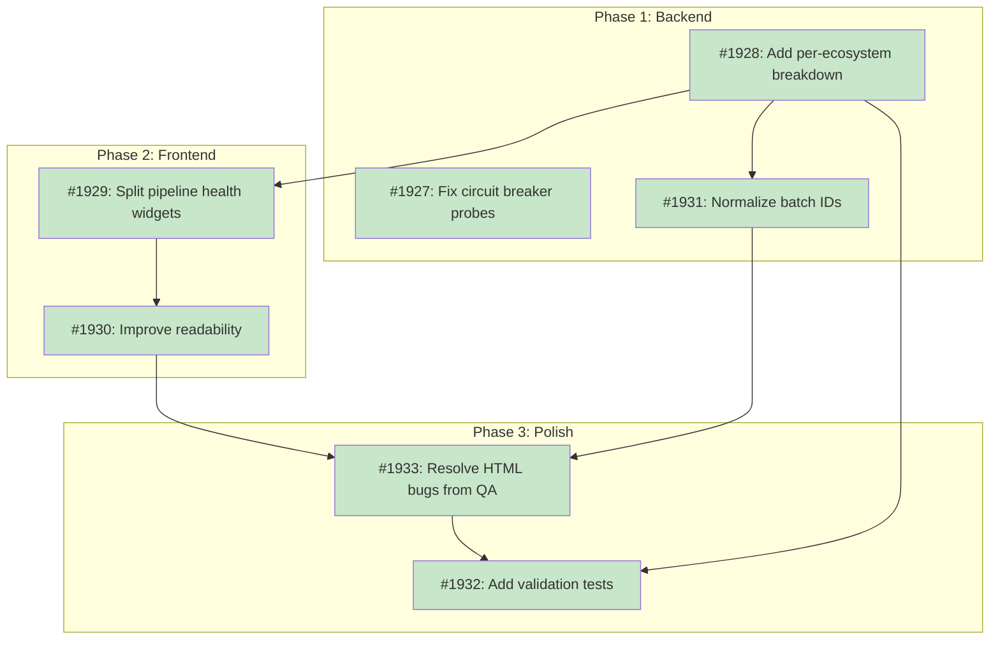

# DESIGN: Pipeline Dashboard Overhaul

## Status

Planned

## Implementation Issues

### Milestone: [pipeline-dashboard-overhaul](https://github.com/tsukumogami/tsuku/milestone/102)

| Issue | Dependencies | Tier |
|-------|--------------|------|
| ~~[#1927: fix(batch): prefer pending entries for half-open circuit breaker probes](https://github.com/tsukumogami/tsuku/issues/1927)~~ | None | testable |
| ~~_Modify `selectCandidates()` to bypass backoff for half-open probes and prefer pending entries over failed ones. Adds unit tests for the new selection logic including `FilterEcosystem` interaction._~~ | | |
| ~~[#1928: feat(dashboard): add per-ecosystem queue breakdown to dashboard data](https://github.com/tsukumogami/tsuku/issues/1928)~~ | None | testable |
| ~~_Add `ByEcosystem` field to `QueueStatus` in `computeQueueStatus()`, aggregating entry counts per ecosystem per status. This provides the data the Ecosystem Pipeline widget and validation tests need._~~ | | |
| ~~[#1929: feat(dashboard): split pipeline health into three focused widgets](https://github.com/tsukumogami/tsuku/issues/1929)~~ | [#1928](https://github.com/tsukumogami/tsuku/issues/1928) | testable |
| ~~_Restructure `index.html` Pipeline Health into three widgets: Pipeline Health (pipeline-level), Ecosystem Health (circuit breaker details from existing data), and Ecosystem Pipeline (per-ecosystem counts from the new `by_ecosystem` field)._~~ | | |
| ~~[#1930: fix(dashboard): improve recent runs and recent failures readability](https://github.com/tsukumogami/tsuku/issues/1930)~~ | [#1929](https://github.com/tsukumogami/tsuku/issues/1929) | testable |
| ~~_Replace raw batch IDs with ET-formatted timestamps, add ecosystem badges to Recent Runs, add ecosystem column and clickable packages to Recent Failures. All CSS/JS changes in `index.html`._~~ | | |
| ~~[#1931: fix(dashboard): normalize batch IDs and populate failure detail fields](https://github.com/tsukumogami/tsuku/issues/1931)~~ | [#1928](https://github.com/tsukumogami/tsuku/issues/1928) | testable |
| ~~_Fix Go-side data generation: normalize `health.last_run.batch_id` format, strip `batch-` prefix from failure details, and populate `message` and `workflow_url` fields from JSONL source data. Runs parallel to frontend work._~~ | | |
| ~~[#1933: fix(dashboard): resolve HTML bugs from QA audit](https://github.com/tsukumogami/tsuku/issues/1933)~~ | [#1930](https://github.com/tsukumogami/tsuku/issues/1930), [#1931](https://github.com/tsukumogami/tsuku/issues/1931) | testable |
| ~~_Fix all 34 HTML/JS/CSS bugs from #1834-#1838 across 12 pipeline pages: cross-links, status gaps, clickability, action targets, and filter/rendering bugs. Applies after both readability changes and Go data fixes land._~~ | | |
| ~~[#1932: test(dashboard): add validation tests for dashboard data and link integrity](https://github.com/tsukumogami/tsuku/issues/1932)~~ | [#1928](https://github.com/tsukumogami/tsuku/issues/1928), [#1933](https://github.com/tsukumogami/tsuku/issues/1933) | testable |
| ~~_Add Go structural invariant tests for `dashboard.json` (batch ID consistency, ecosystem breakdown correctness, status coverage) and shell-based link integrity checks for the 12 HTML pages. Integrate into `website-ci.yml`._~~ | | |

### Dependency Graph



**Legend**: Green = done, Blue = ready, Yellow = blocked, Purple = needs-design, Orange = tracks-design

## Context and Problem Statement

The pipeline dashboard (`website/pipeline/`) is the primary operator interface for monitoring tsuku's batch recipe generation system. It shows queue status, batch run history, failure patterns, and circuit breaker state across six ecosystems (homebrew, github, crates.io, npm, pypi, rubygems).

Two categories of problems have accumulated:

**Circuit breaker deadlock.** Four of six ecosystems (crates.io, npm, pypi, rubygems) are stuck with open circuit breakers. The root cause is a design flaw in half-open probe selection: `selectCandidates()` applies per-entry backoff filtering even when picking half-open probes, and it doesn't prefer pending entries over already-failed ones. When all entries for an ecosystem have failed and are in a backoff window, the half-open probe can't select any candidate, the circuit breaker never updates, and the ecosystem stays permanently stuck. Even when probes execute, they retry entries that previously failed rather than trying fresh pending entries that might succeed.

**Dashboard usability.** The main dashboard page overloads the Pipeline Health panel with ecosystem-specific circuit breaker badges, pipeline-level run tracking, and health warnings -- three different concerns in one panel. The Recent Runs panel shows timestamps without timezone context and uses a compact format that's hard to scan. The Recent Failures table lacks enough information to triage problems. Beyond these layout issues, a QA audit (PR #1831) found 37 bugs across 12 HTML pages: broken cross-links between failures, runs, and packages (#1834); package.html failing for `requires_manual` status (#1835); data elements that should be clickable links (#1836); inconsistent action button targets (#1837); filter and rendering bugs (#1838). No automated tests exist (#1839), so these bugs were only caught through manual exploration.

### Scope

**In scope:**
- Fix circuit breaker probe selection to prefer pending entries and bypass backoff for probes
- Split Pipeline Health into three focused widgets: Pipeline Health, Ecosystem Health, Ecosystem Pipeline
- Improve Recent Runs readability (ET timezone, clearer formatting)
- Fix Recent Failures readability
- Address all findings from issues #1834, #1835, #1836, #1837, #1838
- Add dashboard validation tests (#1839)
- Any needed changes to `dashboard.json` schema and its Go generator

**Out of scope:**
- Changes to the batch orchestrator beyond probe selection
- New pipeline pages (the 12 existing pages cover all needed views)
- Changes to recipe generation logic
- Telemetry or website changes outside `website/pipeline/`

## Decision Drivers

- **Self-healing**: Circuit breakers must recover without operator intervention when viable entries exist
- **Single responsibility**: Each dashboard widget should answer one question
- **Ecosystem visibility**: Operators need per-ecosystem pipeline counts to understand where work is stalled
- **Backward compatibility**: Dashboard consumers (if any) shouldn't break on schema additions
- **Testability**: Key dashboard invariants (link integrity, data contracts, page availability) should be automatically validated
- **Minimal complexity**: Prefer changes to existing code over new infrastructure

## Considered Options

### Decision 1: How to Fix the Circuit Breaker Probe Deadlock

The circuit breaker's half-open state is supposed to allow exactly one "probe" request per ecosystem to test whether the ecosystem has recovered. But two problems prevent this from working:

First, `selectCandidates()` applies per-entry backoff (`NextRetryAt > now`) even when selecting a half-open probe. If all entries for an ecosystem are in their backoff window, the probe can't execute. The circuit breaker sits in half-open state indefinitely, transitions back to open when `check_breaker.sh` runs again, and the cycle repeats.

Second, when entries *are* available, the function picks the first eligible one in queue order (priority ascending, then alphabetical). It doesn't distinguish between pending entries (never tried) and failed entries (previously failed, now past backoff). In ecosystems where most entries have failed, probes keep retrying entries that are likely to fail again, preventing recovery.

#### Chosen: Pending-first probe selection with backoff bypass

Modify `selectCandidates()` to apply special rules when the ecosystem's circuit breaker is in half-open state:

1. **Bypass backoff for probes**: When selecting a half-open probe, ignore `NextRetryAt`. The probe's purpose is to test ecosystem health, not the individual entry's readiness. The backoff protects entries from being retried too aggressively during normal operation, but a circuit breaker probe is a fundamentally different use case.

2. **Prefer pending entries**: When selecting a half-open probe, scan for a `StatusPending` entry first. Only fall back to `StatusFailed` entries if no pending entries exist for that ecosystem. Pending entries haven't been attempted yet, making them better health indicators than entries that have already failed (which may have entry-specific problems unrelated to ecosystem health).

Implementation: add a two-pass selection for half-open ecosystems. First pass: collect pending entries. If found, use the first one. Second pass (fallback): use the first failed entry, bypassing backoff.

#### Alternatives Considered

**Reset backoff timers when transitioning to half-open.** Clear `NextRetryAt` on all entries for the ecosystem when `check_breaker.sh` transitions from open to half-open.
Rejected because it affects normal retry scheduling for entries that should still be in backoff. When the circuit breaker eventually closes, those entries would all be immediately eligible, creating a retry storm.

**Add a dedicated "probe" entry per ecosystem.** Create synthetic queue entries specifically for circuit breaker probes, separate from the normal queue.
Rejected because it adds complexity to the queue schema and processing logic. The orchestrator would need to handle a new entry type, and the probe entry's success/failure wouldn't necessarily reflect real ecosystem health since it wouldn't be a real package.

### Decision 2: How to Restructure Dashboard Widgets

The current Pipeline Health panel combines three different functions: circuit breaker badges per ecosystem, last run / last success tracking, and a staleness warning. This makes it hard to glance at the dashboard and understand the state of any single concern.

The user wants two new widgets (Ecosystem Health, Ecosystem Pipeline) and wants the Pipeline Health widget cleaned up to focus on pipeline-level information. The question is how to partition the data and what additional information to surface in each widget.

#### Chosen: Three-widget split with new per-ecosystem data

Split the current Pipeline Health panel into three focused widgets:

**Pipeline Health** (existing, restructured): Overall pipeline status. Shows last run timestamp, last successful run, runs since last success, staleness warning (>2 hours since last run), and a summary count of open/half-open breakers as a single line (not individual badges). This answers "is the pipeline running?"

**Ecosystem Health** (new): Circuit breaker status per ecosystem. Shows one row per ecosystem with: name, breaker state badge (closed/open/half-open), consecutive failure count, last failure timestamp, and time until recovery (for open breakers, computed from `opens_at`). Clicking an ecosystem links to its filtered failures page. This answers "which ecosystems are healthy?"

**Ecosystem Pipeline** (new): Queue distribution per ecosystem. Shows one row per ecosystem with counts: total entries, pending, failed, success, blocked, requires_manual. Includes a mini progress bar showing the ratio. This answers "where is work concentrated?"

The Ecosystem Pipeline widget requires a new `by_ecosystem` breakdown in `dashboard.json`, computed from the priority queue during dashboard generation.

#### Alternatives Considered

**Keep a single combined panel with tabs.** Add tab buttons (Pipeline / Ecosystems / Queue) to the existing Pipeline Health panel to switch between views.
Rejected because tabs hide information. The three views answer different questions and operators often want to see all three at once. Separate widgets let them all be visible simultaneously.

**Add ecosystem data to the existing status bars.** Break down the status bars (pending/failed/success/etc.) by ecosystem using stacked segments within each bar.
Rejected because it would make the already-dense status bar even harder to read. Per-ecosystem breakdown is better served by its own dedicated widget with a table layout.

### Decision 3: How to Improve Recent Runs and Recent Failures Readability

The Recent Runs panel currently shows batch IDs (timestamp-derived strings like `2026-02-22T22-42-09Z`), an ecosystem label, merged/total counts, and a percentage. The format is compact but hard to scan: batch IDs look like noise, there's no timezone context, and the ecosystem info is inline.

The Recent Failures panel shows package name, failure category, and relative time. It lacks ecosystem information, making it hard to understand whether failures cluster in one ecosystem.

#### Chosen: Formatted timestamps in ET, structured table layout

**Recent Runs**: Replace the raw batch ID with a human-readable timestamp formatted in `America/New_York` (ET). Show date and time separately. Display ecosystem information as small badges. Keep merged/total and percentage. Add duration if available.

**Recent Failures**: Add an ecosystem column. Show the subcategory when available (it's more actionable than the top-level category). Make package names clickable links to `package.html`. Show absolute timestamps in `America/New_York` (ET) alongside the relative "time ago" display.

Both changes are CSS/JS only -- no backend modifications needed since `dashboard.json` already contains all the required data.

#### Alternatives Considered

**Use browser locale for timezone.** Let `toLocaleString()` use the browser's system timezone instead of hardcoding ET.
Rejected because the operator team is in the ET timezone and wants consistent display across sessions. While browser locale detection works fine for this static site, it produces different output depending on which machine the operator uses. Hardcoding `America/New_York` (ET) provides predictable display. A future enhancement could add a timezone picker, but that's out of scope.

**Use UTC with explicit label.** Display all timestamps in UTC with a visible "UTC" suffix.
Rejected because UTC requires mental conversion for the operator team, who correlates dashboard events with their local schedule (batch runs, on-call windows). ET is the team's working timezone and produces more immediately useful displays.

**Replace the table with a timeline visualization.** Show runs and failures as dots on a timeline chart, with hover details.
Rejected because tables are more information-dense and easier to scan for the volume of data displayed. A timeline visualization would be a significant new component for marginal benefit.

### Decision 4: How to Address Existing Dashboard Bugs (#1834-#1838)

The QA audit found 37 individual bugs across 12 pages, grouped into 5 issues by theme. The question is whether to address them in this design or leave them as separate work items.

#### Chosen: Include all bugs in this overhaul

Incorporate all findings from #1834 through #1838 as implementation work within this design. The bugs span the same pages we're already modifying for widget restructuring and readability improvements, so addressing them separately would mean touching the same files twice. The issues are well-specified with specific findings and affected pages, so they can be implemented as sub-tasks within the overhaul.

#1839 (automated tests) provides the verification mechanism -- the tests should validate that the bugs are actually fixed.

#### Alternatives Considered

**Address bugs as separate PRs.** Keep this design focused on the new widgets and circuit breaker fix, and implement #1834-#1838 as independent PRs.
Rejected because the overlap is too high. The new Ecosystem Health widget modifies the same Pipeline Health panel area where #1834 finding 1b lives. The Recent Failures improvements overlap with #1838 findings. Separate PRs would conflict.

### Decision 5: How to Add Dashboard Validation Tests (#1839)

The dashboard currently has zero tests. The QA audit (#1831) found all 37+ bugs manually. #1839 specifies three categories of validation: link integrity, data contracts, and page availability.

#### Chosen: Go-based validation tests using the dashboard generator

Add Go tests in `internal/dashboard/` that validate the generated `dashboard.json` against structural invariants. For HTML page validation, add a shell script that checks link targets exist and status references are complete. These run in CI alongside existing tests.

Go tests cover data contract validation (required fields, consistent IDs, status coverage). Shell-based checks cover link integrity (all referenced pages exist, status bar links resolve). This avoids introducing a browser testing framework while still catching the categories of bugs found in the QA audit.

#### Alternatives Considered

**Browser-based end-to-end tests with Playwright.** Use Playwright to load each page with test data and verify rendering.
Rejected because it introduces a heavy dependency (Node.js + Playwright + browser binaries) for what's fundamentally a static site with client-side rendering. The bugs found are structural (wrong IDs, missing statuses, broken links), not rendering issues. Go tests for data and shell checks for page structure catch these without browser overhead.

**JSON Schema validation.** Define a JSON Schema for dashboard.json and validate against it.
Rejected as insufficient -- it validates structure but not semantic correctness. The bugs involve cross-references between data fields (batch IDs in different formats, ecosystem prefixes in package IDs), which JSON Schema can't express.

## Decision Outcome

**Chosen: 1A + 2A + 3A + 4A + 5A**

### Summary

The overhaul modifies both the batch pipeline backend and the dashboard frontend. On the backend, `selectCandidates()` gets a two-pass selection for half-open ecosystems: first pass scans for pending entries, second pass falls back to failed entries with backoff bypassed. This ensures probes always execute and test the ecosystem with the best available candidate. The dashboard Go generator adds a `by_ecosystem` breakdown to `QueueStatus`, counting entries per ecosystem per status.

On the frontend, the Pipeline Health panel is stripped down to pipeline-level information: last run, last success, runs since success, and a staleness warning. The ecosystem circuit breaker badges move to a new Ecosystem Health widget that shows each ecosystem's breaker state, failure count, last failure time, and recovery countdown. A second new widget, Ecosystem Pipeline, shows per-ecosystem entry counts broken out by status with mini progress indicators.

Recent Runs switches from raw batch ID display to ET-formatted timestamps with ecosystem badges and duration. Recent Failures gains an ecosystem column, clickable package links, subcategory display, and ET timestamps.

All 37 bugs from #1834-#1838 are fixed in the same pass, grouped by page. Cross-link issues (batch ID format mismatches, missing pages, broken ecosystem prefixes) are fixed in both the Go generator and the HTML. Package.html adds support for `requires_manual` status. Clickable elements replace plain text across all list pages. Action buttons get corrected targets.

Go tests in `internal/dashboard/` validate dashboard.json structural invariants: consistent batch IDs, required fields, status coverage, ecosystem prefix consistency. A shell-based link checker validates that all cross-page references resolve.

### Rationale

Fixing the circuit breaker and overhauling the dashboard fit together because the Ecosystem Health widget is what makes circuit breaker state visible, and the probe fix is what prevents that widget from showing a permanently broken state. Per-ecosystem pipeline counts give operators the context to understand *why* a circuit breaker is open (no pending entries in npm, for example, vs. a transient failure in homebrew).

Including the existing bugs avoids file-level conflicts and delivers a single cohesive update. The test infrastructure validates both the bug fixes and the new widgets, preventing regression.

### Trade-offs Accepted

- Hardcoding ET timezone means operators in other timezones see ET times. Acceptable because the current operator team is in ET, and adding a timezone picker is straightforward future work.
- The pending-first probe selection might mask ecosystem-level failures by always picking untried entries. Acceptable because the alternative (retrying known-failed entries) guarantees the breaker stays open.
- Including all bugs makes this a large design with many implementation issues. Acceptable because the alternative (separate PRs touching the same files) is worse.

## Solution Architecture

### Overview

Changes span four layers: batch orchestrator, dashboard Go generator, dashboard JSON schema, and dashboard HTML/JS/CSS.

### Components

**1. Batch Orchestrator (`internal/batch/orchestrator.go`)**

Modified `selectCandidates()` adds a two-pass half-open probe selection:

```
func selectCandidates():
  for each entry in queue:
    if entry.Status not in (pending, failed): skip
    eco = entry.Ecosystem()
    state = breaker[eco]

    if state == "open": skip

    if state == "half-open":
      if already selected a probe for eco: skip
      if entry.Status == Pending:
        select as probe (first pending wins)
        mark eco as probed
        continue
      else:
        // Failed entry: save as fallback, don't select yet
        save to fallback[eco] if not already set
        continue

    // Normal selection (closed state)
    if entry.Priority > maxTier: skip
    if entry.NextRetryAt > now: skip
    select entry

  // Second pass: fill in half-open ecosystems that had no pending entries
  for eco, fallback in fallbacks:
    if eco not already probed:
      select fallback (bypass backoff)

  return selected entries (up to batchSize)
```

**2. Dashboard Generator (`internal/dashboard/dashboard.go`)**

Add `ByEcosystem` to `QueueStatus`:

```go
type QueueStatus struct {
    Total       int                           `json:"total"`
    ByStatus    map[string]int                `json:"by_status"`
    ByTier      map[int]map[string]int        `json:"by_tier"`
    ByEcosystem map[string]map[string]int     `json:"by_ecosystem"`  // NEW
    Packages    map[string][]PackageInfo      `json:"packages"`
}
```

`ByEcosystem` is a map from ecosystem name to status counts: `{"homebrew": {"pending": 2800, "failed": 30, "total": 4876, ...}, "npm": {"failed": 23, "total": 75}, ...}`. The `total` per ecosystem is computed in the Go generator (same loop as `ByStatus` aggregation in `computeQueueStatus`), not derived client-side, to keep the widget rendering simple.

**3. Dashboard JSON Schema Additions**

Only additive changes -- existing fields are unchanged:

```json
{
  "queue": {
    "by_ecosystem": {
      "<ecosystem>": {
        "pending": 0,
        "failed": 0,
        "success": 0,
        "blocked": 0,
        "requires_manual": 0,
        "excluded": 0,
        "total": 0
      }
    }
  }
}
```

**4. Dashboard HTML/JS/CSS (`website/pipeline/index.html`)**

Widget layout changes on the main dashboard page:

| Current Panel | New Layout |
|--------------|------------|
| Pipeline Health (combined) | Pipeline Health (pipeline-level only) |
| *(new)* | Ecosystem Health (circuit breaker details) |
| *(new)* | Ecosystem Pipeline (per-ecosystem counts) |
| Queue Status | Queue Status (unchanged) |
| Top Blockers | Top Blockers (unchanged) |
| Failure Categories | Failure Categories (unchanged) |
| Recent Failures | Recent Failures (improved) |
| Recent Runs | Recent Runs (improved) |
| Disambiguations | Disambiguations (unchanged) |
| Curated Overrides | Curated Overrides (unchanged) |

### Key Interfaces

**Ecosystem Health Widget Data** (from existing `health.ecosystems`):
```json
{
  "ecosystems": {
    "homebrew": {
      "breaker_state": "closed",
      "failures": 0,
      "last_failure": "2026-02-22T20:29:29Z",
      "opens_at": "2026-02-22T16:25:36Z"
    }
  }
}
```

No new backend fields needed -- the widget uses existing data with better presentation.

**Ecosystem Pipeline Widget Data** (from new `queue.by_ecosystem`):
```json
{
  "by_ecosystem": {
    "homebrew": { "pending": 2827, "failed": 30, "success": 310, "blocked": 1709, "requires_manual": 0 },
    "npm": { "pending": 0, "failed": 23 }
  }
}
```

### Data Flow

```
batch-control.json ──→ dashboard.go ──→ dashboard.json ──→ index.html
priority-queue.json ─┘  (adds by_ecosystem)              (new widgets)

priority-queue.json ──→ orchestrator.go (modified selectCandidates)
batch-control.json ───┘  (pending-first half-open probes)
```

### Bug Fix Map

Each existing issue maps to specific page and component changes:

| Issue | Category | Pages Affected |
|-------|----------|----------------|
| #1834 | Broken cross-links | index.html, failure.html, run.html, package.html |
| #1835 | package.html status gaps | package.html, blocked.html |
| #1836 | Non-clickable elements | 8 pages (all list pages) |
| #1837 | Action link targets | failure.html, run.html, package.html, curated.html, failures.html |
| #1838 | Filter/render bugs | success.html, runs.html, blocked.html, requires_manual.html, pending.html, run.html, failure.html, failures.html, index.html |
| #1839 | No tests | internal/dashboard/ (Go tests), scripts/ (link checker) |

## Implementation Approach

### Phase 1: Circuit Breaker Fix

Fix the probe selection deadlock. This is the highest-priority change because it affects pipeline throughput.

- Modify `selectCandidates()` in `orchestrator.go`
- Add tests for pending-first selection and backoff bypass
- Add test for `FilterEcosystem` interaction with half-open probe logic
- Manually reset stuck breakers in `batch-control.json` after deploying

Dependencies: none.

### Phase 2: Dashboard Backend

Add `by_ecosystem` to the dashboard generator.

- Add `ByEcosystem` field to `QueueStatus` struct
- Compute ecosystem breakdown during queue loading
- Add tests for the new breakdown
- Regenerate `dashboard.json` with the new field

Dependencies: none (independent of Phase 1).

### Phase 3: New Dashboard Widgets

Build the Ecosystem Health and Ecosystem Pipeline widgets.

- Implement Ecosystem Health widget (circuit breaker details table)
- Implement Ecosystem Pipeline widget (per-ecosystem status counts)
- Restructure Pipeline Health to remove ecosystem-specific data
- Add CSS for new widget layouts

Dependencies: Ecosystem Pipeline widget requires Phase 2 (`by_ecosystem` field in dashboard.json). Ecosystem Health widget uses existing data and has no backend dependency.

### Phase 4: Readability Improvements

Improve Recent Runs and Recent Failures.

- Add ET timezone formatting function
- Rework Recent Runs display (formatted timestamps, ecosystem badges, duration)
- Rework Recent Failures display (ecosystem column, clickable packages, subcategories, ET timestamps)

### Phase 5: Bug Fixes (#1834-#1838)

Address all 37 findings from the QA audit.

- #1834: Fix cross-links (batch ID format normalization, create failed.html, fix ecosystem prefixes)
- #1835: Fix package.html (add `requires_manual` to status search, fix blocked_by ecosystem prefix, add CSS class, fix blank name/ecosystem)
- #1836: Make elements clickable (ecosystem names → filtered links, disambiguation links, index panel links)
- #1837: Fix action links (failure.html issue URL, retry workflow targets, Actions link, curated buttons, batch_id filter UI)
- #1838: Fix filters and rendering (success.html date filter, ecosystems format, since-last-success, runs summary cards, blocked chart, requires_manual category, pending failures column, run.html duration, platform display, failure message/workflow_url, succeeded label, ecosystem header, batch ecosystem, by_tier display)

### Phase 6: Validation Tests

Add automated tests to prevent regression.

- Go tests for dashboard.json data contracts (consistent IDs, required fields, status coverage)
- Go tests for ecosystem breakdown correctness
- Shell-based link integrity checks (cross-page references resolve)
- Integrate into CI (website-ci.yml)

## Security Considerations

### Download Verification

Not applicable. This design modifies dashboard display logic and circuit breaker probe selection. No binaries are downloaded or verified as part of these changes. The batch pipeline's existing download verification is unchanged.

### Execution Isolation

Not applicable. The dashboard is a static site served from Cloudflare Pages with client-side rendering. No server-side code execution is involved. The circuit breaker change modifies which queue entries are selected for processing, but the actual execution (recipe generation, installation testing) uses the same isolation mechanisms as before.

### Supply Chain Risks

Not applicable. No new dependencies are added. The dashboard uses vanilla HTML/CSS/JS with no build tools or npm packages. The Go changes are to existing internal packages with no new imports.

### User Data Exposure

The dashboard displays pipeline operational data (package names, failure categories, batch run timestamps). This data is already public -- it comes from public recipes and public GitHub Actions runs. The new Ecosystem Pipeline widget shows per-ecosystem entry counts, which is a derived view of already-public queue data.

No user-specific data is collected, displayed, or transmitted. The timezone hardcoding (ET) reveals the operator team's timezone, but this is already implicit in batch scheduling patterns visible in public CI logs.

## Consequences

### Positive

- Circuit breakers self-recover when pending entries exist, eliminating permanent deadlocks
- Operators can see ecosystem health and pipeline distribution at a glance without digging into filtered views
- Timestamps in a consistent timezone make it easier to correlate events across widgets
- 37 bugs fixed across 12 pages improves navigation reliability
- Automated tests prevent regression of all fixed bugs

### Negative

- Three widgets instead of one takes more vertical space on the dashboard index page
- Hardcoded ET timezone doesn't serve operators in other timezones
- The `by_ecosystem` field increases `dashboard.json` size (proportional to number of ecosystems, currently 6-10)
- Large implementation scope (6 phases) increases merge risk

### Mitigations

- Widget compactness: use a two-column layout for Ecosystem Health and Ecosystem Pipeline side by side
- Timezone: ET is correct for the current team, and adding a picker later is straightforward
- JSON size: the ecosystem count is small (under 10), adding negligible bytes
- Scope: phase the implementation with independent PRs if needed, though a single PR is preferred for consistency
