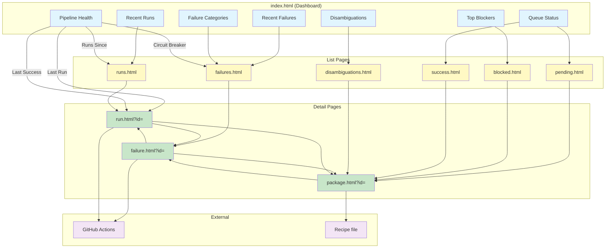
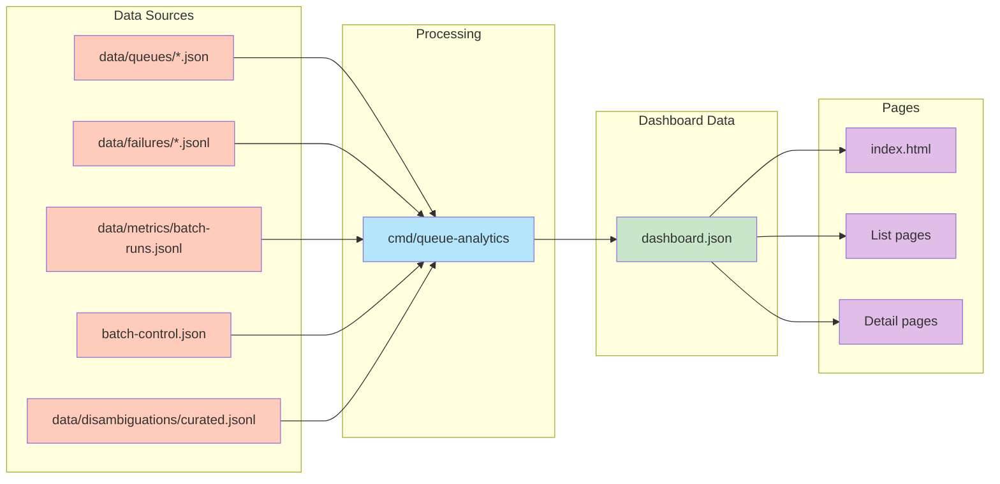
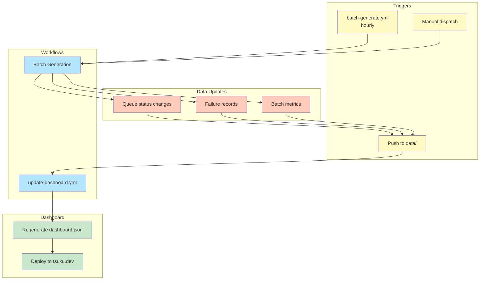

# DESIGN: Pipeline Dashboard Enhancement

## Status

Proposed

## Upstream Design Reference

This design augments [DESIGN-registry-scale-strategy.md](DESIGN-registry-scale-strategy.md).

**Relevant sections:**
- Failure Analysis System: structured failure tracking
- Phase 2: Failure Analysis Backend + macOS Platform (dashboard infrastructure planned but partially implemented)
- DESIGN-operator-dashboard.md: mentioned as recommended but not created

## Context and Problem Statement

The batch recipe generation pipeline and its dashboard (tsuku.dev/pipeline/) are operational but have gaps that prevent autonomous multi-ecosystem coverage.

**Current state:**
- Pipeline runs hourly via `batch-generate.yml`
- Validation runs across 11 platform environments (5 Linux x86_64 families, 4 Linux arm64 families, 2 macOS architectures)
- Dashboard shows queue status, blockers, failure categories, and recent runs
- Circuit breaker pattern prevents runaway failures

**Root cause hypothesis:**

Popular tools (bat, fd, rg, etc.) are mapped to `github:` or `cargo:` sources in `data/disambiguations/curated.jsonl`, but batch generation hardcodes `--from homebrew:<name>`. These packages don't have Homebrew bottles (they're Rust crates distributed via GitHub releases). All 10 packages selected each hour fail deterministic generation because the pipeline tries to extract bottles that don't exist.

**Observed problems:**

1. **Zero recipe throughput** (symptom): The pipeline has run successfully since Feb 9 but generates 0 new recipes per run. The dashboard shows "last run: Feb 6" because that was the last run that actually merged recipes.

2. **Wrong ecosystem routing** (root cause): Batch generation ignores disambiguation. Packages that should route to `cargo:ripgrep` or `github:sharkdp/bat` fail when processed as `homebrew:ripgrep` or `homebrew:bat`.

3. **No failure debugging** (observability gap): The dashboard shows failure counts but not why packages fail. The `validation_failed` category covers too many distinct problems (missing bottles, bottle extraction errors, verify pattern mismatches).

4. **Single-ecosystem operation** (coverage gap): Despite supporting 8 ecosystems, only Homebrew runs on schedule. Other ecosystems have zero queue entries.

5. **Circuit breaker invisible** (observability gap): The circuit breaker state exists in `batch-control.json` but isn't shown on the dashboard.

### Scope

**In scope:**
- Dashboard enhancements for failure visibility and debugging
- Integration of disambiguation into batch generation
- Multi-ecosystem scheduling
- Failure category refinement

**Out of scope:**
- LLM-based generation (excluded by design in DESIGN-registry-scale-strategy)
- New ecosystems beyond the 8 already supported
- Backend service changes (failure analysis backend is Phase 2, not this design)
- Dashboard styling or UX redesign

## Decision Drivers

1. **Autonomous operation**: The pipeline should run without manual intervention
2. **Debug-first**: Operators need to understand failures before fixing them
3. **Incremental enhancement**: Build on existing infrastructure, don't rebuild
4. **Multi-ecosystem fairness**: All ecosystems should progress, not just Homebrew
5. **Disambiguation early**: Route packages to correct ecosystem before generation
6. **Transparency**: Users should see pipeline health at a glance

## Implementation Context

### Existing Patterns

**Dashboard data flow:**
- `cmd/queue-analytics/` generates `website/pipeline/dashboard.json`
- Workflow `update-dashboard.yml` triggers on `data/` changes
- Frontend JavaScript fetches and renders the JSON

**Batch generation flow:**
- `cmd/batch-generate/` orchestrates via `internal/batch/`
- Selects pending packages from ecosystem-specific queue
- Invokes `tsuku create --from <ecosystem>:<name> --deterministic-only`
- Records failures to `data/failures/<ecosystem>-<timestamp>.jsonl`

**Disambiguation implementation:**
- `internal/disambiguation/` contains ecosystem routing logic
- `data/disambiguations/curated.jsonl` stores manual overrides
- CLI uses disambiguation in `install` command but not in `create`

### Queue State (as of Feb 15)

```
Total: 5,144 packages
- Pending: 4,988 (97%)
- Success: 138 (2.7%)
- Failed: 14 (0.3%)
- Blocked: 4 (0.1%)
```

All packages are in the homebrew queue. No other ecosystem queues exist.

## Considered Options

### Decision 1: Dashboard Failure Visibility

The dashboard currently shows failure categories but lacks detail for debugging. When all 10 packages fail hourly with `validation_failed`, operators can't determine if it's bottle availability, verify pattern issues, or something else. The failure JSONL files contain this data but aren't exposed.

#### Chosen: Drill-Down Dashboard with Full Detail Pages

Every dashboard panel links to a dedicated page, and every list item links to a detail page. No JSON file inspection required.

**Main dashboard (index.html)** shows summary panels:
- Each panel displays a preview (e.g., last 5 failures, recent 3 runs)
- Each panel header is clickable → navigates to full list page
- "Pipeline Health" panel shows:
  - **Pipeline Status**: "Running" / "Stalled" (based on last_run timestamp)
  - **Last Run**: "1 hour ago (0/10 succeeded)" → click to `run.html?id=<batch-id>`
  - **Last Success**: "9 days ago (2 recipes)" → click to `run.html?id=<batch-id>`
  - **Runs Since Success**: "156 runs" → click to `runs.html?filter=since-last-success`
  - **Circuit Breaker**: per-ecosystem state → click to filtered failures for that ecosystem

**List pages** show complete data:
- `failures.html`: All failures with filtering by category, ecosystem, date range
- `runs.html`: All batch runs with success/fail counts (existing, enhanced)
- `blocked.html`: All blocked packages with dependency info (existing, enhanced)
- `pending.html`: All pending packages by ecosystem (existing)

**Detail pages** show single-item deep dive:
- `failure.html?id=<failure-id>`: Full failure record including:
  - Package ID and ecosystem
  - Category and subcategory
  - Full error message (not truncated)
  - Stack trace or CLI output if available
  - Timestamp and batch ID
  - Platform where failure occurred
  - Link to related workflow run (if available)
- `run.html?id=<batch-id>`: Full batch run details including:
  - All packages processed
  - Per-platform results
  - Recipes generated
  - Failures encountered

**Navigation pattern:**
```
Dashboard Panel → List Page → Detail Page
     ↓                ↓            ↓
  "Failures (42)"  → failures.html → failure.html?id=xyz
  "Recent Runs"    → runs.html     → run.html?id=2026-02-15-homebrew
  "Blocked (4)"    → blocked.html  → (package detail in queue)
```

This reuses existing data in `data/failures/` and `batch-control.json`. The `queue-analytics` command aggregates everything into `dashboard.json` with enough detail for all pages.

#### Alternatives Considered

**Grafana/external dashboarding**: Build metrics pipeline to external service.
Rejected because it adds operational complexity: another service to deploy, another set of credentials to manage, another monitoring target. The dashboard.json is 788KB and serves 5K packages. Grafana's value comes from alerting and historical trends; we need debugging visibility, not time-series analysis.

**Log aggregation**: Point operators to GitHub Actions logs.
Rejected because logs are ephemeral (90 days retention) and require navigating through workflow runs. Finding why `neovim` failed means searching across 20+ workflow runs. A persistent dashboard with recent failures is more accessible.

**Structured JSON in PR comments**: Enhance batch PR bodies with failure details.
Rejected because PR bodies have size limits (65K characters) and aren't queryable for aggregation. The batch workflow already creates PRs with validation summaries; enhancing these would help individual PR review but not overall pipeline debugging.

### Decision 2: Failure Category Refinement

The current `categoryFromExitCode` maps exit codes to categories but lumps too much under `validation_failed`. Exit code 6 covers both "verify pattern mismatch" and "binary not found". Exit code 7 covers "recipe schema invalid" and "install failed". This makes debugging impossible.

#### Chosen: Structured Failure Subcategories

Extend the failure record schema to include a `subcategory` field. The CLI already outputs JSON with `--json`; parse it for additional detail.

New category structure:
```
deterministic_insufficient
  → no_bottle (no bottle available for platform)
  → archive_extraction_failed (bottle exists but extraction fails)
  → binary_discovery_failed (no executables found in archive)

validation_failed
  → verify_pattern_mismatch (version output doesn't match pattern)
  → verify_timeout (verify command didn't complete)
  → install_failed (install action failed)
  → schema_invalid (recipe TOML doesn't validate)

missing_dep
  → (already has blocked_by field)

api_error
  → rate_limited (429 from ecosystem API)
  → upstream_unavailable (5xx from ecosystem API)
  → timeout (network timeout)
```

The `parseInstallJSON` function in `orchestrator.go` already extracts some of this. Extend it to populate subcategory from CLI output.

#### Alternatives Considered

**Exit code explosion**: Add new exit codes for each failure type.
Rejected because exit codes are limited (0-255) and the CLI already uses structured JSON output. Parsing JSON is cleaner than inventing new exit codes.

**Separate log files**: Write different failure types to different files.
Rejected because it fragments the data and makes aggregation harder. A single JSONL with structured fields is easier to query.

### Decision 3: Unified Disambiguated Queue

The current workflow assumes each package comes from the queue's ecosystem. But package names like `rg` exist in multiple ecosystems (homebrew, cargo, github), and the best source varies by tool. Processing `homebrew:bat` when `github:sharkdp/bat` has pre-built binaries wastes CI cycles on certain failure.

#### Chosen: Unified Queue with Durable Disambiguation Decisions

Replace per-ecosystem queues with a single unified queue where each entry includes its pre-resolved source. Disambiguation decisions are durable—computed once and cached until stale or invalidated.

**Key insight**: A tool's best source rarely changes. `ripgrep` should use `cargo:ripgrep` today, next week, and next month. Re-running disambiguation for 5K packages weekly wastes API calls. Instead, treat disambiguation decisions as durable data with freshness tracking.

**Queue entry format** (includes freshness metadata):
```json
{
  "name": "ripgrep",
  "source": "cargo:ripgrep",
  "priority": 1,
  "confidence": "auto",
  "disambiguated_at": "2026-02-15T00:00:00Z",
  "metrics_snapshot": {
    "cargo_downloads": 1250000,
    "homebrew_installs": 89000
  }
}
```

**Incremental seeding workflow** (reuses existing ecosystem probers):
1. **New packages**: Disambiguate tools not yet in queue (from ecosystem feeds)
2. **Stale records**: Re-disambiguate if `disambiguated_at` > 30 days
3. **Failed packages**: Re-disambiguate after N consecutive failures (source may have changed)
4. **Manual refresh**: Force re-disambiguation via workflow input or CLI flag

The workflow invokes the existing CLI disambiguation:
```bash
tsuku disambiguate <name> --json
```

This reuses the ecosystem probers in `internal/disambiguation/` which already handle API rate limits, authentication, and quality metric collection.

**API call estimation**:
- Initial seeding: ~5K calls (one-time)
- Weekly maintenance: ~50 new packages + ~200 stale records + ~10 failure retries = ~260 calls
- Rate limits become a non-issue after initial seeding

**Batch generation** uses the pre-resolved source directly:
```bash
tsuku create --from github:sharkdp/bat --deterministic-only
```

#### Alternatives Considered

**Per-ecosystem queues with rotation**: 8 separate queues, rotate hourly.
Rejected because it doesn't solve the core problem. A package like `bat` in the homebrew queue will always fail homebrew generation because bat doesn't have Homebrew bottles. Rotation just wastes CI cycles on 8 ecosystems instead of 1.

**Full re-disambiguation weekly**: Query all ecosystems for all packages every week.
Rejected because it wastes API calls. Disambiguation results are stable—`ripgrep`'s best source doesn't change week to week. Incremental updates with freshness tracking are more efficient.

**Disambiguation at generation time**: Check curated overrides when processing each package.
Rejected because it's a partial fix. Curated overrides only cover ~30 packages. The 4,988 pending packages would still process from their queue ecosystem. Upfront disambiguation using quality metrics handles the entire queue.

### Decision 4: Seeding Strategy for Multi-Ecosystem Coverage

The current queue contains 5,144 packages but they're all from Homebrew's formula list. Other ecosystems (cargo, npm, pypi, etc.) have popular packages that aren't in Homebrew or have better sources elsewhere.

#### Chosen: Incremental Multi-Source Seeding with Existing Probers

The seeding workflow discovers new packages and maintains disambiguation freshness, reusing the existing ecosystem probers in `internal/disambiguation/`.

**Package discovery** (identifies candidates for disambiguation):
- **homebrew**: `brew formulae --json` (existing seed script)
- **cargo**: crates.io most-downloaded list
- **npm**: npm registry popular packages
- **pypi**: PyPI top packages by downloads
- **rubygems**: RubyGems most-downloaded
- **github**: Curated list of popular CLI tools with releases

**Seeding phases**:

1. **Discovery phase**: Collect tool names from ecosystem feeds
2. **Filter phase**: Skip tools already in queue with fresh disambiguation
3. **Disambiguation phase**: For new/stale tools, invoke `tsuku disambiguate <name> --json`
4. **Merge phase**: Update queue with new entries, preserve existing fresh entries

**Freshness rules**:
- `disambiguated_at` < 30 days → fresh, skip re-disambiguation
- `disambiguated_at` >= 30 days → stale, re-disambiguate
- `consecutive_failures` >= 3 → force re-disambiguate (source may have changed)
- Curated overrides → never auto-refresh (manual only)

**Curated overrides** (`data/disambiguations/curated.jsonl`) take precedence:
```jsonl
{"name": "bat", "source": "github:sharkdp/bat", "reason": "pre-built binaries"}
{"name": "rg", "source": "cargo:ripgrep", "reason": "canonical crate"}
```

Curated entries are never overridden by algorithmic disambiguation. They represent expert knowledge that shouldn't churn.

**Failure feedback loop**:
When batch generation fails a package repeatedly, increment `consecutive_failures`. After threshold (default 3), mark for re-disambiguation. This catches cases where:
- A source stopped publishing binaries
- A better source became available
- The original disambiguation was wrong

#### Alternatives Considered

**Independent ecosystem queues**: Each ecosystem gets its own queue with its own packages.
Rejected because it creates duplicate work. A package like `ripgrep` would appear in homebrew, cargo, and github queues, processed 3 times with 2 failing.

**Full regeneration weekly**: Re-disambiguate all packages every week.
Rejected because it wastes API calls. With durable disambiguation decisions and freshness tracking, we only re-process new, stale, or failing packages.

**On-demand seeding**: Add packages to queue when users request them.
Rejected for initial implementation because we want autonomous progress. On-demand is a valid addition later via telemetry data, but shouldn't be the only source.

### Assumptions

1. **Existing ecosystem probers work for batch**: The disambiguation probers in `internal/disambiguation/` already implement API fetching, rate limiting, and quality metric collection. We assume these work correctly when invoked via `tsuku disambiguate --json`.

2. **Disambiguation decisions are stable**: A tool's best source rarely changes. This justifies treating disambiguation as durable data with 30-day freshness rather than recomputing weekly.

3. **Curated overrides take precedence**: When an expert has manually specified a source in `curated.jsonl`, the seeding workflow uses it even if quality metrics suggest otherwise. This prevents algorithmic churn on well-known packages.

4. **Deterministic generation works for selected sources**: The unified queue assumes `tsuku create --from <source> --deterministic-only` succeeds for the sources disambiguation selects. Sources that require LLM generation are excluded from the queue.

5. **Failure categories map to actionable remediation**: Operators know what to do when they see "verify_pattern_mismatch" vs "binary_discovery_failed". If this doesn't hold, we'll need to add resolution guidance to the dashboard.

6. **Dashboard data refresh is sufficient**: The dashboard regenerates when data changes. If all batches fail, no data changes, so the dashboard can become stale. Mitigation: include "generated_at" timestamp prominently.

### Uncertainties

- **Quality metric reliability**: Download counts from ecosystem APIs may be stale or missing. The 10x threshold from DESIGN-disambiguation.md may need tuning for batch contexts.
- **Ecosystem coverage**: Some ecosystems (cpan, go) don't have obvious popularity APIs. May need proxy metrics like GitHub stars or search result ordering.
- **Deterministic source coverage**: What percentage of packages can actually generate deterministically? If most route to `github:` (LLM-required), the unified queue may still be sparse. **Recommendation**: Validate hypothesis by manually testing `tsuku create --from cargo:ripgrep --deterministic-only` before building seeding infrastructure.
- **Freshness threshold tuning**: 30 days is a guess. May need adjustment based on how often sources actually change.

### Success Metrics

- **Primary**: Recipe throughput increases from 0/week to >10/week within 2 weeks of deployment
- **Secondary**: Time to diagnose a failure decreases from "check workflow logs" (~5 minutes) to "check dashboard" (~30 seconds)
- **Coverage**: Unified queue includes packages from at least 5 different ecosystems
- **Routing accuracy**: >95% of queue entries have correct source (validated by spot-checking high-priority packages)
- **Health visibility**: Operators can determine pipeline health status in <10 seconds via dashboard

## Decision Outcome

**Chosen: All four enhancements (Dashboard visibility + Category refinement + Unified disambiguated queue + Multi-source seeding)**

### Summary

We're making the pipeline autonomous by addressing its three gaps: visibility, routing, and coverage.

For visibility, the dashboard gains drill-down navigation. Every panel links to a list page, and every list item links to a detail page. "Recent Failures" shows failures with full error messages, CLI output, platform info, and workflow links. "Pipeline Health" distinguishes "last run" (even with 0 recipes) from "last successful run", and shows circuit breaker state per ecosystem. A failing pipeline is visible, not hidden behind stale data.

For routing and coverage, we replace the current homebrew-only queue with a unified disambiguated queue. A weekly seeding workflow queries all ecosystem APIs, collects quality metrics (downloads, version counts, artifact availability), and applies the disambiguation algorithm from DESIGN-disambiguation.md. The result is a single `priority-queue.json` where each entry has a pre-resolved source:

```json
{"name": "bat", "source": "github:sharkdp/bat", "priority": 1, "confidence": "auto"}
{"name": "jq", "source": "homebrew:jq", "priority": 1, "confidence": "curated"}
```

Batch generation uses the source directly: `tsuku create --from github:sharkdp/bat`. No runtime disambiguation lookup needed. Packages that require LLM generation (`github:` sources where deterministic fails) are excluded from the queue or marked for manual review.

Curated overrides in `data/disambiguations/curated.jsonl` take precedence over algorithmic decisions. Expert knowledge for packages like `ripgrep` → `cargo:ripgrep` isn't overridden by download count heuristics.

Failure categories get refined subcategories to distinguish "no bottle available" from "verify pattern mismatch" from "binary not found". The existing `parseInstallJSON` function extracts subcategory from CLI JSON output.

### Rationale

The unified queue approach solves the root cause directly. The current problem is that popular tools (bat, fd, rg) are in the homebrew queue but should use github or cargo sources. Per-ecosystem rotation with disambiguation overrides is a partial fix: it helps the ~30 packages with curated records but leaves 4,988 packages routing to potentially wrong ecosystems.

By treating disambiguation as durable data with freshness tracking, we:
1. Pay the API cost once per package (initial disambiguation)
2. Minimize ongoing API calls (~260/week vs ~40K for full regeneration)
3. Get quality metrics for all packages, not just curated ones
4. Create a feedback loop where failures trigger re-disambiguation

The design reuses existing infrastructure:
- Ecosystem probers in `internal/disambiguation/` handle API fetching and rate limits
- `tsuku disambiguate --json` provides the interface for seeding
- Curated overrides work exactly as they do today

The 10x popularity threshold from DESIGN-disambiguation.md provides a clear decision rule. If cargo's `ripgrep` has 10x more downloads than homebrew's, use cargo. If downloads are close, use curated override or ecosystem priority.

Visibility changes work independently of queue changes. Even if the unified queue takes time to implement, the dashboard improvements immediately help debug the current stalled pipeline.

## Solution Architecture

### Components

```
┌─────────────────────────────────────────────────────────────────────┐
│                        Dashboard (website/pipeline/)                 │
├─────────────────────────────────────────────────────────────────────┤
│                                                                     │
│  PAGES (all panels link to list pages, all list items link to       │
│         detail pages)                                               │
│                                                                     │
│  index.html (main dashboard)                                        │
│  ├── Queue Status panel → pending.html                              │
│  ├── Top Blockers panel → blocked.html                              │
│  ├── Failure Categories panel → failures.html                       │
│  ├── Recent Runs panel → runs.html                                  │
│  ├── [NEW] Recent Failures panel → failures.html                    │
│  ├── [NEW] Pipeline Health panel (breaker state, last success)      │
│  └── Disambiguation panel → disambiguations.html                    │
│                                                                     │
│  [NEW] failures.html (list all failures, filterable)                │
│  ├── Table: package, ecosystem, category, subcategory, timestamp    │
│  ├── Filters: by category, ecosystem, date range                    │
│  └── Each row → failure.html?id=<failure-id>                        │
│                                                                     │
│  [NEW] failure.html?id=<id> (single failure detail)                 │
│  ├── Full error message (not truncated)                             │
│  ├── CLI output / stack trace                                       │
│  ├── Platform, batch ID, timestamp                                  │
│  └── Link to workflow run (if available)                            │
│                                                                     │
│  runs.html (existing, enhanced)                                     │
│  ├── Each row → run.html?id=<batch-id>                              │
│                                                                     │
│  [NEW] run.html?id=<id> (single run detail)                         │
│  ├── Batch metadata: ID, ecosystem, timestamp, workflow link        │
│  ├── Summary: X succeeded, Y failed, Z blocked                      │
│  ├── Packages table: name, status, link to failure detail if failed │
│  ├── Per-platform breakdown: which platforms passed/failed          │
│  ├── Recipes generated: links to recipe files in repo               │
│  └── Failures: inline list with links to failure.html?id=           │
│                                                                     │
│  pending.html, blocked.html, success.html (existing, enhanced)      │
│  └── Each row → package detail or disambiguation page               │
│                                                                     │
│  dashboard.json                                                     │
│  ├── queue: { total, by_status, packages }                         │
│  ├── blockers: [...]                                                │
│  ├── runs: [...]                                                    │
│  ├── disambiguations: { total, by_reason, need_review }             │
│  ├── [NEW] failures: [{ id, package, category, subcategory, ... }]  │
│  ├── [NEW] health: { per_ecosystem_breaker, last_success, ... }     │
│  └── generated_at                                                   │
│                                                                     │
└─────────────────────────────────────────────────────────────────────┘

┌─────────────────────────────────────────────────────────────────────┐
│                     Incremental Seeding Pipeline                     │
├─────────────────────────────────────────────────────────────────────┤
│                                                                     │
│  seed-queue.yml (NEW - runs weekly)                                 │
│  ├── Discover new packages from ecosystem feeds                    │
│  ├── Identify stale records (disambiguated_at > 30 days)           │
│  ├── Identify failing packages (consecutive_failures >= 3)        │
│  ├── For each: invoke `tsuku disambiguate <name> --json`           │
│  ├── Merge results into existing queue (preserve fresh entries)   │
│  └── Output: data/queues/priority-queue.json                       │
│                                                                     │
│  cmd/seed-queue/main.go (NEW)                                       │
│  ├── PackageDiscovery (fetch popular packages from each ecosystem) │
│  ├── FreshnessChecker (identify stale/failing entries)             │
│  ├── DisambiguationRunner (shell out to tsuku disambiguate)        │
│  └── QueueMerger (update entries, preserve freshness metadata)     │
│                                                                     │
│  internal/disambiguation/ (EXISTING - reused)                       │
│  ├── Ecosystem probers (homebrew, cargo, npm, pypi, etc.)          │
│  ├── Rate limiting per ecosystem                                   │
│  ├── Quality metrics collection                                    │
│  └── 10x threshold scoring                                          │
│                                                                     │
└─────────────────────────────────────────────────────────────────────┘

┌─────────────────────────────────────────────────────────────────────┐
│                      Batch Generation Pipeline                       │
├─────────────────────────────────────────────────────────────────────┤
│                                                                     │
│  batch-generate.yml                                                 │
│  ├── [MODIFY] Read source from queue entry, not ecosystem flag     │
│  └── (rest unchanged)                                               │
│                                                                     │
│  cmd/batch-generate/main.go                                         │
│  └── [MODIFY] Use pkg.Source instead of constructing from ecosystem │
│                                                                     │
│  internal/batch/orchestrator.go                                     │
│  ├── [MODIFY] generate(): use pkg.Source directly                   │
│  ├── [MODIFY] parseInstallJSON(): extract subcategory               │
│  └── [MODIFY] FailureRecord: add Subcategory field                  │
│                                                                     │
└─────────────────────────────────────────────────────────────────────┘

┌─────────────────────────────────────────────────────────────────────┐
│                            Data Files                                │
├─────────────────────────────────────────────────────────────────────┤
│                                                                     │
│  data/queues/                                                       │
│  ├── [REPLACE] priority-queue.json (unified, pre-disambiguated)    │
│  │   Format: {"name": "bat", "source": "github:sharkdp/bat", ...}  │
│  └── priority-queue-homebrew.json (archived, not used)             │
│                                                                     │
│  data/failures/*.jsonl                                              │
│  └── [MODIFY] records now include subcategory field                 │
│                                                                     │
│  data/disambiguations/curated.jsonl                                 │
│  └── (existing, read by seed-queue as overrides)                    │
│                                                                     │
│  batch-control.json                                                 │
│  └── (existing, read by queue-analytics for health display)         │
│                                                                     │
└─────────────────────────────────────────────────────────────────────┘
```

### Navigation Flow

Every panel links to a list page, and every list item links to a detail page.



**Legend**: Blue = Dashboard panels, Yellow = List pages, Green = Detail pages, Purple = External

### Data Flow

How data flows from source files to dashboard pages.



### Trigger Flow

When dashboard data gets regenerated.



### Page Wireframes

Every element described below is clickable unless marked (static).

#### Main Dashboard (`index.html`)

```
┌─────────────────────────────────────────────────────────────────────┐
│  Pipeline Dashboard                                    [↻ Refresh]  │
│  Generated: 2026-02-15T14:00:00Z (static)                          │
├─────────────────────────────────────────────────────────────────────┤
│                                                                     │
│  ┌─ Pipeline Health ────────────────────────────────────────────┐  │
│  │                                                               │  │
│  │  Status: 🟢 Running (static)                                  │  │
│  │                                                               │  │
│  │  Last Run         1 hour ago (0/10)        → run.html?id=... │  │
│  │  Last Success     9 days ago (2 recipes)   → run.html?id=... │  │
│  │  Runs Since       156 runs                 → runs.html?since │  │
│  │                                                               │  │
│  │  Circuit Breakers:                                            │  │
│  │    homebrew: 🟢 closed  → failures.html?ecosystem=homebrew   │  │
│  │    cargo:    🟢 closed  → failures.html?ecosystem=cargo      │  │
│  │    npm:      🟡 half-open → failures.html?ecosystem=npm      │  │
│  │                                                               │  │
│  └───────────────────────────────────────────────────────────────┘  │
│                                                                     │
│  ┌─ Queue Status ───────────────────┐  ┌─ Top Blockers ──────────┐ │
│  │  [View All →]     pending.html   │  │  [View All →] blocked   │ │
│  │                                  │  │                         │ │
│  │  Total: 5,144                    │  │  glib (4 deps)     →    │ │
│  │  ├─ Pending: 4,988          →    │  │  openssl (3 deps)  →    │ │
│  │  ├─ Success: 138            →    │  │  libffi (2 deps)   →    │ │
│  │  ├─ Failed: 14              →    │  │                         │ │
│  │  └─ Blocked: 4              →    │  │  Each row links to      │ │
│  │                                  │  │  blocked.html?pkg=      │ │
│  │  By Ecosystem:                   │  │                         │ │
│  │    homebrew: 5,100          →    │  └─────────────────────────┘ │
│  │    cargo: 44                →    │                              │
│  │                                  │                              │
│  └──────────────────────────────────┘                              │
│                                                                     │
│  ┌─ Recent Failures (5 of 42) ──────────────────────────────────┐  │
│  │  [View All →]                              failures.html      │  │
│  │                                                               │  │
│  │  Package    │ Category              │ When      │ Details    │  │
│  │  ───────────┼───────────────────────┼───────────┼─────────── │  │
│  │  neovim     │ verify_pattern_mis... │ 1h ago    │ [→]        │  │
│  │  bat        │ no_bottle             │ 1h ago    │ [→]        │  │
│  │  fd         │ no_bottle             │ 1h ago    │ [→]        │  │
│  │  rg         │ no_bottle             │ 1h ago    │ [→]        │  │
│  │  jq         │ archive_extract_f...  │ 1h ago    │ [→]        │  │
│  │                                                               │  │
│  │  Each row → failure.html?id=<failure-id>                      │  │
│  └───────────────────────────────────────────────────────────────┘  │
│                                                                     │
│  ┌─ Recent Runs (3 of 156) ─────────────────────────────────────┐  │
│  │  [View All →]                                    runs.html    │  │
│  │                                                               │  │
│  │  Batch ID              │ Ecosystem │ Result    │ When        │  │
│  │  ──────────────────────┼───────────┼───────────┼──────────── │  │
│  │  2026-02-15-homebrew   │ homebrew  │ 0/10 ❌   │ 1h ago  [→] │  │
│  │  2026-02-15-cargo      │ cargo     │ 2/5 ⚠️    │ 2h ago  [→] │  │
│  │  2026-02-15-npm        │ npm       │ 5/5 ✅    │ 3h ago  [→] │  │
│  │                                                               │  │
│  │  Each row → run.html?id=<batch-id>                            │  │
│  └───────────────────────────────────────────────────────────────┘  │
│                                                                     │
│  ┌─ Failure Categories ─────────────┐  ┌─ Disambiguations ───────┐ │
│  │  [View All →]    failures.html   │  │  [View All →] disamb    │ │
│  │                                  │  │                         │ │
│  │  validation_failed: 30      →    │  │  Total: 32              │ │
│  │  ├─ verify_pattern: 18      →    │  │  Need Review: 5    →    │ │
│  │  ├─ no_bottle: 8            →    │  │                         │ │
│  │  └─ install_failed: 4       →    │  │  By Reason:             │ │
│  │  deterministic: 8           →    │  │    better_source: 20 →  │ │
│  │  api_error: 4               →    │  │    no_homebrew: 8   →   │ │
│  │                                  │  │    manual: 4        →   │ │
│  │  Each links to filtered          │  │                         │ │
│  │  failures.html?category=         │  └─────────────────────────┘ │
│  └──────────────────────────────────┘                              │
│                                                                     │
└─────────────────────────────────────────────────────────────────────┘
```

#### Failures List (`failures.html`)

```
┌─────────────────────────────────────────────────────────────────────┐
│  ← Back to Dashboard                                                │
│                                                                     │
│  Failures (42 total)                                                │
├─────────────────────────────────────────────────────────────────────┤
│                                                                     │
│  Filters:                                                           │
│  ┌─────────────┐ ┌─────────────┐ ┌─────────────┐ ┌───────────────┐ │
│  │ Category ▼  │ │ Ecosystem ▼ │ │ Date From  │ │ Date To       │ │
│  │ (all)       │ │ (all)       │ │ 2026-02-01 │ │ 2026-02-15    │ │
│  └─────────────┘ └─────────────┘ └─────────────┘ └───────────────┘ │
│                                                           [Apply]   │
│                                                                     │
│  ┌───────────────────────────────────────────────────────────────┐ │
│  │ Package  │ Ecosystem │ Category        │ Subcategory    │When │ │
│  ├──────────┼───────────┼─────────────────┼────────────────┼─────┤ │
│  │ neovim   │ homebrew  │ validation      │ verify_pattern │ 1h  │ │
│  │ [→ detail page]                                               │ │
│  ├──────────┼───────────┼─────────────────┼────────────────┼─────┤ │
│  │ bat      │ homebrew  │ deterministic   │ no_bottle      │ 1h  │ │
│  │ [→ detail page]                                               │ │
│  ├──────────┼───────────┼─────────────────┼────────────────┼─────┤ │
│  │ fd       │ homebrew  │ deterministic   │ no_bottle      │ 1h  │ │
│  │ [→ detail page]                                               │ │
│  ├──────────┼───────────┼─────────────────┼────────────────┼─────┤ │
│  │ ...      │           │                 │                │     │ │
│  └───────────────────────────────────────────────────────────────┘ │
│                                                                     │
│  Showing 1-20 of 42                        [← Prev] [Next →]        │
│                                                                     │
└─────────────────────────────────────────────────────────────────────┘
```

#### Failure Detail (`failure.html?id=homebrew-2026-02-15T13-45-21Z-neovim`)

```
┌─────────────────────────────────────────────────────────────────────┐
│  ← Back to Failures                                                 │
│                                                                     │
│  Failure: neovim                                                    │
├─────────────────────────────────────────────────────────────────────┤
│                                                                     │
│  ┌─ Summary ────────────────────────────────────────────────────┐  │
│  │                                                               │  │
│  │  Package:      neovim           → package.html?id=neovim     │  │
│  │  Ecosystem:    homebrew         → failures.html?eco=homebrew │  │
│  │  Category:     validation_failed→ failures.html?cat=valid.. │  │
│  │  Subcategory:  verify_pattern_mismatch                       │  │
│  │  Timestamp:    2026-02-15T13:45:21Z                          │  │
│  │  Batch:        2026-02-15-homebrew → run.html?id=...         │  │
│  │  Platform:     linux-x86_64-debian                           │  │
│  │  Workflow:     [View on GitHub →]                            │  │
│  │                                                               │  │
│  └───────────────────────────────────────────────────────────────┘  │
│                                                                     │
│  ┌─ Error Message ──────────────────────────────────────────────┐  │
│  │                                                               │  │
│  │  Verification failed: version pattern mismatch                │  │
│  │                                                               │  │
│  │  Expected: v0.10.0                                            │  │
│  │  Got:      NVIM v0.10.0                                       │  │
│  │                                                               │  │
│  │  The verify command output did not match the expected         │  │
│  │  version pattern. This usually means the recipe's verify      │  │
│  │  pattern needs adjustment.                                    │  │
│  │                                                               │  │
│  └───────────────────────────────────────────────────────────────┘  │
│                                                                     │
│  ┌─ Full CLI Output ────────────────────────────────────────────┐  │
│  │                                                               │  │
│  │  $ tsuku install --json --recipe recipes/n/neovim.toml       │  │
│  │                                                               │  │
│  │  {                                                            │  │
│  │    "status": "failed",                                        │  │
│  │    "category": "validation_failed",                           │  │
│  │    "subcategory": "verify_pattern_mismatch",                  │  │
│  │    "details": {                                               │  │
│  │      "expected": "v0.10.0",                                   │  │
│  │      "actual": "NVIM v0.10.0",                                │  │
│  │      "command": "nvim --version",                             │  │
│  │      "exit_code": 0                                           │  │
│  │    }                                                          │  │
│  │  }                                                            │  │
│  │                                                               │  │
│  │  exit code: 6                                                 │  │
│  │                                                               │  │
│  └───────────────────────────────────────────────────────────────┘  │
│                                                                     │
│  ┌─ Recipe Snippet ─────────────────────────────────────────────┐  │
│  │                                                               │  │
│  │  [verify]                                                     │  │
│  │  command = "nvim --version"                                   │  │
│  │  pattern = "v0.10.0"    ← Problem: missing "NVIM " prefix    │  │
│  │                                                               │  │
│  │  [View full recipe →] (links to GitHub)                       │  │
│  │                                                               │  │
│  └───────────────────────────────────────────────────────────────┘  │
│                                                                     │
│  ┌─ Actions ────────────────────────────────────────────────────┐  │
│  │                                                               │  │
│  │  [Retry this package]  (triggers manual batch for 1 package) │  │
│  │  [Mark as won't fix]   (moves to permanent exclusion)        │  │
│  │  [File issue]          (opens GitHub issue with context)     │  │
│  │                                                               │  │
│  └───────────────────────────────────────────────────────────────┘  │
│                                                                     │
└─────────────────────────────────────────────────────────────────────┘
```

#### Runs List (`runs.html`)

```
┌─────────────────────────────────────────────────────────────────────┐
│  ← Back to Dashboard                                                │
│                                                                     │
│  Batch Runs (156 total)                                             │
├─────────────────────────────────────────────────────────────────────┤
│                                                                     │
│  Filters:                                                           │
│  ┌─────────────┐ ┌─────────────┐ ┌───────────────┐                 │
│  │ Ecosystem ▼ │ │ Status ▼    │ │ Since Success │                 │
│  │ (all)       │ │ (all)       │ │ [ ] only      │                 │
│  └─────────────┘ └─────────────┘ └───────────────┘     [Apply]     │
│                                                                     │
│  ┌───────────────────────────────────────────────────────────────┐ │
│  │ Batch ID            │ Eco      │ Success │ Failed │ When      │ │
│  ├─────────────────────┼──────────┼─────────┼────────┼───────────┤ │
│  │ 2026-02-15-homebrew │ homebrew │ 0       │ 10     │ 1h ago    │ │
│  │ [→ run detail page]                                           │ │
│  ├─────────────────────┼──────────┼─────────┼────────┼───────────┤ │
│  │ 2026-02-15-cargo    │ cargo    │ 2       │ 3      │ 2h ago    │ │
│  │ [→ run detail page]                                           │ │
│  ├─────────────────────┼──────────┼─────────┼────────┼───────────┤ │
│  │ 2026-02-15-npm      │ npm      │ 5       │ 0      │ 3h ago    │ │
│  │ [→ run detail page]                                           │ │
│  ├─────────────────────┼──────────┼─────────┼────────┼───────────┤ │
│  │ ...                 │          │         │        │           │ │
│  └───────────────────────────────────────────────────────────────┘ │
│                                                                     │
│  Showing 1-20 of 156                       [← Prev] [Next →]        │
│                                                                     │
│  ┌─ Summary ────────────────────────────────────────────────────┐  │
│  │  Last 24h: 24 runs, 12 recipes generated                     │  │
│  │  Last 7d:  168 runs, 45 recipes generated                    │  │
│  │  Success rate: 8.2% (packages), 26.8% (runs with ≥1 recipe)  │  │
│  └───────────────────────────────────────────────────────────────┘  │
│                                                                     │
└─────────────────────────────────────────────────────────────────────┘
```

#### Run Detail (`run.html?id=2026-02-15-homebrew`)

```
┌─────────────────────────────────────────────────────────────────────┐
│  ← Back to Runs                                                     │
│                                                                     │
│  Batch Run: 2026-02-15-homebrew                                     │
├─────────────────────────────────────────────────────────────────────┤
│                                                                     │
│  ┌─ Summary ────────────────────────────────────────────────────┐  │
│  │                                                               │  │
│  │  Batch ID:    2026-02-15-homebrew                            │  │
│  │  Ecosystem:   homebrew          → pending.html?eco=homebrew  │  │
│  │  Timestamp:   2026-02-15T13:45:21Z                           │  │
│  │  Duration:    3m 34s                                         │  │
│  │  Workflow:    [View on GitHub →]                             │  │
│  │                                                               │  │
│  │  Result:      0 succeeded, 10 failed, 0 blocked              │  │
│  │  Recipes:     (none generated)                               │  │
│  │                                                               │  │
│  └───────────────────────────────────────────────────────────────┘  │
│                                                                     │
│  ┌─ Packages Processed ─────────────────────────────────────────┐  │
│  │                                                               │  │
│  │  Package  │ Status  │ Category           │ Details           │  │
│  │  ─────────┼─────────┼────────────────────┼───────────────────│  │
│  │  neovim   │ ❌ fail │ verify_pattern     │ [→ failure]       │  │
│  │  bat      │ ❌ fail │ no_bottle          │ [→ failure]       │  │
│  │  fd       │ ❌ fail │ no_bottle          │ [→ failure]       │  │
│  │  rg       │ ❌ fail │ no_bottle          │ [→ failure]       │  │
│  │  jq       │ ❌ fail │ archive_extract    │ [→ failure]       │  │
│  │  fzf      │ ❌ fail │ no_bottle          │ [→ failure]       │  │
│  │  exa      │ ❌ fail │ no_bottle          │ [→ failure]       │  │
│  │  delta    │ ❌ fail │ no_bottle          │ [→ failure]       │  │
│  │  zoxide   │ ❌ fail │ no_bottle          │ [→ failure]       │  │
│  │  lazygit  │ ❌ fail │ no_bottle          │ [→ failure]       │  │
│  │                                                               │  │
│  └───────────────────────────────────────────────────────────────┘  │
│                                                                     │
│  ┌─ Platform Results ───────────────────────────────────────────┐  │
│  │                                                               │  │
│  │  Platform              │ Tested │ Passed │ Failed │ Skipped  │  │
│  │  ──────────────────────┼────────┼────────┼────────┼───────── │  │
│  │  linux-x86_64-debian   │ 10     │ 0      │ 10     │ 0        │  │
│  │  linux-x86_64-ubuntu   │ 10     │ 0      │ 10     │ 0        │  │
│  │  linux-x86_64-fedora   │ 10     │ 0      │ 10     │ 0        │  │
│  │  linux-x86_64-arch     │ 10     │ 0      │ 10     │ 0        │  │
│  │  linux-x86_64-alpine   │ 10     │ 0      │ 10     │ 0        │  │
│  │  linux-arm64-debian    │ 10     │ 0      │ 10     │ 0        │  │
│  │  linux-arm64-ubuntu    │ 10     │ 0      │ 10     │ 0        │  │
│  │  linux-arm64-fedora    │ 10     │ 0      │ 10     │ 0        │  │
│  │  linux-arm64-alpine    │ 10     │ 0      │ 10     │ 0        │  │
│  │  darwin-x86_64         │ 10     │ 0      │ 10     │ 0        │  │
│  │  darwin-arm64          │ 10     │ 0      │ 10     │ 0        │  │
│  │                                                               │  │
│  │  Each row links to filtered failures for that platform        │  │
│  └───────────────────────────────────────────────────────────────┘  │
│                                                                     │
│  ┌─ Actions ────────────────────────────────────────────────────┐  │
│  │                                                               │  │
│  │  [Retry this batch]    (re-runs same 10 packages)            │  │
│  │  [View workflow logs]  (GitHub Actions)                      │  │
│  │                                                               │  │
│  └───────────────────────────────────────────────────────────────┘  │
│                                                                     │
└─────────────────────────────────────────────────────────────────────┘
```

#### Pending Packages (`pending.html`)

```
┌─────────────────────────────────────────────────────────────────────┐
│  ← Back to Dashboard                                                │
│                                                                     │
│  Pending Packages (4,988 total)                                     │
├─────────────────────────────────────────────────────────────────────┤
│                                                                     │
│  Filters:                                                           │
│  ┌─────────────┐ ┌─────────────┐ ┌─────────────┐                   │
│  │ Ecosystem ▼ │ │ Priority ▼      │ │ Search...   │      [Apply]     │
│  │ (all)       │ │ (all)       │ │             │                   │
│  └─────────────┘ └─────────────┘ └─────────────┘                   │
│                                                                     │
│  ┌───────────────────────────────────────────────────────────────┐ │
│  │ Package     │ Ecosystem │ Pri │ Added      │ Attempts        │ │
│  ├─────────────┼───────────┼──────┼────────────┼─────────────────┤ │
│  │ neovim      │ homebrew  │ 1    │ 2026-01-15 │ 12 (last: 1h)   │ │
│  │ [→ package detail]                                            │ │
│  ├─────────────┼───────────┼──────┼────────────┼─────────────────┤ │
│  │ vim         │ homebrew  │ 1    │ 2026-01-15 │ 8 (last: 2h)    │ │
│  │ [→ package detail]                                            │ │
│  ├─────────────┼───────────┼──────┼────────────┼─────────────────┤ │
│  │ emacs       │ homebrew  │ 1    │ 2026-01-15 │ 5 (last: 3h)    │ │
│  │ [→ package detail]                                            │ │
│  ├─────────────┼───────────┼──────┼────────────┼─────────────────┤ │
│  │ ...         │           │      │            │                 │ │
│  └───────────────────────────────────────────────────────────────┘ │
│                                                                     │
│  Showing 1-50 of 4,988                     [← Prev] [Next →]        │
│                                                                     │
│  ┌─ By Ecosystem ───────────────────────────────────────────────┐  │
│  │  homebrew: 4,850 → │ cargo: 44 → │ npm: 32 → │ pypi: 28 →    │  │
│  │  rubygems: 18 →    │ go: 12 →    │ cpan: 4 → │ cask: 0 →     │  │
│  │  (each links to filtered pending.html?ecosystem=)            │  │
│  └───────────────────────────────────────────────────────────────┘  │
│                                                                     │
└─────────────────────────────────────────────────────────────────────┘
```

#### Package Detail (`package.html?id=homebrew:neovim`)

```
┌─────────────────────────────────────────────────────────────────────┐
│  ← Back to Pending                                                  │
│                                                                     │
│  Package: neovim                                                    │
├─────────────────────────────────────────────────────────────────────┤
│                                                                     │
│  ┌─ Status ─────────────────────────────────────────────────────┐  │
│  │                                                               │  │
│  │  Queue Status:  pending                                       │  │
│  │  Ecosystem:     homebrew                                      │  │
│  │  Queue ID:      homebrew:neovim                               │  │
│  │  Priority:      1 (critical)                                  │  │
│  │  Added:         2026-01-15                                    │  │
│  │  Attempts:      12                                            │  │
│  │  Last Attempt:  2026-02-15T13:45:21Z (1 hour ago)            │  │
│  │                                                               │  │
│  └───────────────────────────────────────────────────────────────┘  │
│                                                                     │
│  ┌─ Disambiguation ─────────────────────────────────────────────┐  │
│  │                                                               │  │
│  │  Status: No override configured                               │  │
│  │                                                               │  │
│  │  Available sources:                                           │  │
│  │    • homebrew:neovim  (current)                              │  │
│  │    • github:neovim/neovim                                    │  │
│  │    • cask:neovim                                             │  │
│  │                                                               │  │
│  │  [Configure disambiguation →] (opens disambiguations editor)  │  │
│  │                                                               │  │
│  └───────────────────────────────────────────────────────────────┘  │
│                                                                     │
│  ┌─ Attempt History ────────────────────────────────────────────┐  │
│  │                                                               │  │
│  │  #  │ Timestamp           │ Result  │ Category        │ Det  │  │
│  │  ───┼─────────────────────┼─────────┼─────────────────┼───── │  │
│  │  12 │ 2026-02-15 13:45:21 │ ❌ fail │ verify_pattern  │ [→]  │  │
│  │  11 │ 2026-02-14 05:45:18 │ ❌ fail │ verify_pattern  │ [→]  │  │
│  │  10 │ 2026-02-13 21:45:15 │ ❌ fail │ verify_pattern  │ [→]  │  │
│  │  9  │ 2026-02-13 13:45:12 │ ❌ fail │ verify_pattern  │ [→]  │  │
│  │  8  │ 2026-02-12 05:45:09 │ ❌ fail │ verify_pattern  │ [→]  │  │
│  │  ... (show more)                                              │  │
│  │                                                               │  │
│  │  Each row → failure.html?id=                                  │  │
│  └───────────────────────────────────────────────────────────────┘  │
│                                                                     │
│  ┌─ Actions ────────────────────────────────────────────────────┐  │
│  │                                                               │  │
│  │  [Retry now]           (triggers immediate batch for this)   │  │
│  │  [Skip temporarily]    (removes from queue for 7 days)       │  │
│  │  [Exclude permanently] (adds to exclusion list)              │  │
│  │  [Change ecosystem]    (opens disambiguation editor)         │  │
│  │  [File issue]          (opens GitHub with context)           │  │
│  │                                                               │  │
│  └───────────────────────────────────────────────────────────────┘  │
│                                                                     │
└─────────────────────────────────────────────────────────────────────┘
```

#### Blocked Packages (`blocked.html`)

```
┌─────────────────────────────────────────────────────────────────────┐
│  ← Back to Dashboard                                                │
│                                                                     │
│  Blocked Packages (4 total)                                         │
├─────────────────────────────────────────────────────────────────────┤
│                                                                     │
│  ┌───────────────────────────────────────────────────────────────┐ │
│  │ Package    │ Ecosystem │ Blocked By          │ Since          │ │
│  ├────────────┼───────────┼─────────────────────┼────────────────┤ │
│  │ gtk+3      │ homebrew  │ glib, cairo         │ 2026-02-10     │ │
│  │ [→ package detail with dependency graph]                      │ │
│  ├────────────┼───────────┼─────────────────────┼────────────────┤ │
│  │ imagemagick│ homebrew  │ libpng, libtiff     │ 2026-02-08     │ │
│  │ [→ package detail]                                            │ │
│  ├────────────┼───────────┼─────────────────────┼────────────────┤ │
│  │ ffmpeg     │ homebrew  │ libvpx, x264, x265  │ 2026-02-05     │ │
│  │ [→ package detail]                                            │ │
│  ├────────────┼───────────┼─────────────────────┼────────────────┤ │
│  │ opencv     │ homebrew  │ ffmpeg              │ 2026-02-05     │ │
│  │ [→ package detail]                                            │ │
│  └───────────────────────────────────────────────────────────────┘ │
│                                                                     │
│  ┌─ Top Blockers (missing dependencies) ────────────────────────┐  │
│  │                                                               │  │
│  │  Dependency │ Blocks           │ Status                      │  │
│  │  ───────────┼──────────────────┼──────────────────────────── │  │
│  │  glib       │ 4 packages       │ pending (last try: 2h ago)  │  │
│  │  [→ package.html?id=homebrew:glib]                           │  │
│  │  cairo      │ 3 packages       │ pending (last try: 2h ago)  │  │
│  │  libpng     │ 2 packages       │ failed (no_bottle)          │  │
│  │  libtiff    │ 2 packages       │ failed (no_bottle)          │  │
│  │                                                               │  │
│  │  Resolving glib would unblock 4 packages                      │  │
│  │                                                               │  │
│  └───────────────────────────────────────────────────────────────┘  │
│                                                                     │
└─────────────────────────────────────────────────────────────────────┘
```

#### Disambiguations (`disambiguations.html`)

```
┌─────────────────────────────────────────────────────────────────────┐
│  ← Back to Dashboard                                                │
│                                                                     │
│  Disambiguations (32 total, 5 need review)                          │
├─────────────────────────────────────────────────────────────────────┤
│                                                                     │
│  Filters:                                                           │
│  ┌─────────────────┐ ┌─────────────┐                               │
│  │ Status ▼        │ │ Reason ▼    │                    [Apply]    │
│  │ (all)           │ │ (all)       │                               │
│  │ • All           │ └─────────────┘                               │
│  │ • Needs review  │                                               │
│  │ • Configured    │                                               │
│  └─────────────────┘                                               │
│                                                                     │
│  ┌───────────────────────────────────────────────────────────────┐ │
│  │ Package │ From           │ To                  │ Reason       │ │
│  ├─────────┼────────────────┼─────────────────────┼──────────────┤ │
│  │ rg      │ homebrew:rg    │ github:BurntSushi/  │ better_source│ │
│  │ [→ disambiguation detail]                                     │ │
│  ├─────────┼────────────────┼─────────────────────┼──────────────┤ │
│  │ bat     │ homebrew:bat   │ github:sharkdp/bat  │ better_source│ │
│  │ [→ disambiguation detail]                                     │ │
│  ├─────────┼────────────────┼─────────────────────┼──────────────┤ │
│  │ fd      │ homebrew:fd    │ github:sharkdp/fd   │ better_source│ │
│  │ [→ disambiguation detail]                                     │ │
│  ├─────────┼────────────────┼─────────────────────┼──────────────┤ │
│  │ exa     │ homebrew:exa   │ (needs review)      │ 🔶           │ │
│  │ [→ disambiguation editor - tool has multiple viable sources] │ │
│  └───────────────────────────────────────────────────────────────┘ │
│                                                                     │
│  ┌─ By Reason ──────────────────────────────────────────────────┐  │
│  │  better_source: 20   (GitHub has pre-built binaries)         │  │
│  │  no_homebrew: 8      (tool not in Homebrew)                  │  │
│  │  manual: 4           (manually configured)                   │  │
│  │  Each links to filtered list                                 │  │
│  └───────────────────────────────────────────────────────────────┘  │
│                                                                     │
└─────────────────────────────────────────────────────────────────────┘
```

#### Success Packages (`success.html`)

```
┌─────────────────────────────────────────────────────────────────────┐
│  ← Back to Dashboard                                                │
│                                                                     │
│  Successful Packages (138 total)                                    │
├─────────────────────────────────────────────────────────────────────┤
│                                                                     │
│  Filters:                                                           │
│  ┌─────────────┐ ┌─────────────┐ ┌─────────────┐                   │
│  │ Ecosystem ▼ │ │ Date From  │ │ Date To      │      [Apply]     │
│  │ (all)       │ │ 2026-01-01 │ │ 2026-02-15   │                   │
│  └─────────────┘ └─────────────┘ └─────────────┘                   │
│                                                                     │
│  ┌───────────────────────────────────────────────────────────────┐ │
│  │ Package    │ Ecosystem │ Generated   │ Recipe              │   │ │
│  ├────────────┼───────────┼─────────────┼─────────────────────┤   │ │
│  │ gh         │ homebrew  │ 2026-02-06  │ [View recipe →]     │   │ │
│  │ [→ package detail]                                            │ │
│  ├────────────┼───────────┼─────────────┼─────────────────────┤   │ │
│  │ jq         │ homebrew  │ 2026-02-06  │ [View recipe →]     │   │ │
│  │ [→ package detail]                                            │ │
│  ├────────────┼───────────┼─────────────┼─────────────────────┤   │ │
│  │ ripgrep    │ cargo     │ 2026-02-05  │ [View recipe →]     │   │ │
│  │ [→ package detail]                                            │ │
│  ├────────────┼───────────┼─────────────┼─────────────────────┤   │ │
│  │ ...        │           │             │                     │   │ │
│  └───────────────────────────────────────────────────────────────┘ │
│                                                                     │
│  ┌─ Success Timeline ───────────────────────────────────────────┐  │
│  │                                                               │  │
│  │  Feb 1  ████████░░░░  12 recipes                              │  │
│  │  Feb 2  ██████░░░░░░   8 recipes                              │  │
│  │  Feb 3  ████████████░ 15 recipes                              │  │
│  │  ...                                                          │  │
│  │  Feb 6  ██░░░░░░░░░░   2 recipes (last success)               │  │
│  │  Feb 7  ░░░░░░░░░░░░   0 recipes                              │  │
│  │  ...                                                          │  │
│  │  Feb 15 ░░░░░░░░░░░░   0 recipes                              │  │
│  │                                                               │  │
│  └───────────────────────────────────────────────────────────────┘  │
│                                                                     │
└─────────────────────────────────────────────────────────────────────┘
```

### Data Structures

**Extended FailureRecord** (internal/batch/failure.go):
```go
type FailureRecord struct {
    PackageID   string   `json:"package_id"`
    Category    string   `json:"category"`
    Subcategory string   `json:"subcategory,omitempty"` // NEW
    BlockedBy   []string `json:"blocked_by,omitempty"`
    Message     string   `json:"message"`
    Timestamp   time.Time `json:"timestamp"`
}
```

**Dashboard health section** (website/pipeline/dashboard.json):
```json
{
  "health": {
    "ecosystems": {
      "homebrew": {
        "breaker_state": "closed",
        "last_failure": "2026-02-08T09:31:11Z",
        "consecutive_failures": 0
      },
      "cargo": {
        "breaker_state": "closed",
        "last_failure": null,
        "consecutive_failures": 0
      }
    },
    "last_run": {
      "batch_id": "2026-02-15-homebrew",
      "ecosystem": "homebrew",
      "timestamp": "2026-02-15T13:45:21Z",
      "succeeded": 0,
      "failed": 10,
      "total": 10
    },
    "last_successful_run": {
      "batch_id": "2026-02-06-homebrew",
      "recipes_merged": 2,
      "timestamp": "2026-02-06T20:45:08Z"
    },
    "runs_since_last_success": 156,
    "hours_since_last_run": 1,
    "hours_since_recipe_merged": 213
  }
}
```

This distinguishes:
- **last_run**: Most recent batch execution (shows pipeline is alive even with 0 recipes)
- **last_successful_run**: Most recent batch that produced recipes
- **runs_since_last_success**: How many batches have run without merging recipes (156 runs = ~6.5 days at hourly)

**Failures section** (all failures, not just recent):
```json
{
  "failures": [
    {
      "id": "homebrew-2026-02-15T13-45-21Z-neovim",
      "package": "neovim",
      "ecosystem": "homebrew",
      "category": "validation_failed",
      "subcategory": "verify_pattern_mismatch",
      "message": "expected version pattern 'v0.10.0' but got 'NVIM v0.10.0'",
      "full_output": "tsuku install: verification failed\nexpected: v0.10.0\ngot: NVIM v0.10.0\nexit code: 6",
      "platform": "linux-x86_64-debian",
      "batch_id": "2026-02-15-homebrew",
      "timestamp": "2026-02-15T13:45:21Z",
      "workflow_run_url": "https://github.com/tsukumogami/tsuku/actions/runs/22036696489"
    }
  ],
  "failures_summary": {
    "total": 42,
    "by_category": {
      "validation_failed": 30,
      "deterministic_insufficient": 8,
      "api_error": 4
    },
    "by_ecosystem": {
      "homebrew": 42
    }
  }
}
```

**Runs section** (full detail per run):
```json
{
  "runs": [
    {
      "batch_id": "2026-02-15-homebrew",
      "ecosystem": "homebrew",
      "timestamp": "2026-02-15T13:45:21Z",
      "total": 10,
      "succeeded": 0,
      "failed": 10,
      "blocked": 0,
      "packages_processed": ["neovim", "bat", "fd", "..."],
      "recipes_generated": [],
      "workflow_run_url": "https://github.com/tsukumogami/tsuku/actions/runs/22036696489",
      "platform_results": {
        "linux-x86_64-debian": {"tested": 10, "passed": 0, "failed": 10},
        "darwin-arm64": {"tested": 10, "passed": 0, "failed": 10}
      }
    }
  ]
}
```

### Unified Queue Entry Format

The new queue format includes pre-resolved sources with freshness tracking:

```json
{
  "name": "ripgrep",
  "source": "cargo:ripgrep",
  "priority": 1,
  "status": "pending",
  "confidence": "auto",
  "disambiguated_at": "2026-02-15T00:00:00Z",
  "consecutive_failures": 0,
  "metrics_snapshot": {
    "cargo_downloads": 1250000,
    "homebrew_installs": 89000,
    "selected_reason": "10x threshold exceeded"
  }
}
```

**Fields:**
- `name`: Tool name (used for display and deduplication)
- `source`: Pre-resolved source in `ecosystem:identifier` format
- `priority`: Priority level (1 = most important)
- `status`: Queue status: `pending`, `success`, `failed`, `blocked`
- `confidence`: How source was selected: `curated`, `auto` (10x threshold), `priority` (ecosystem order)
- `disambiguated_at`: When disambiguation was last run (for freshness checking)
- `consecutive_failures`: Count of consecutive batch failures (triggers re-disambiguation at threshold)
- `metrics_snapshot`: Quality metrics at disambiguation time (for debugging/auditing)

### Batch Generation with Unified Queue

In `orchestrator.go`, the orchestrator uses `pkg.Source` directly:

```go
func (o *Orchestrator) generate(pkg QueueEntry) error {
    // Source is pre-resolved in the queue entry
    source := pkg.Source

    // Skip sources that require LLM (github: typically)
    if !o.supportsDeterministic(source) {
        return o.recordSkipped(pkg, "requires LLM generation")
    }

    // Generate recipe using the pre-resolved source
    cmd := exec.Command("tsuku", "create", "--from", source, "--deterministic-only", "--json")
    // ...
}
```

No runtime disambiguation lookup needed. The seeding workflow already made the decision.
```

## Implementation Approach

### Phase 1: Dashboard Visibility with Drill-Down Navigation

Add failure debugging and full navigation to the dashboard.

1. Extend `cmd/queue-analytics/` to aggregate:
   - All failures from `data/failures/*.jsonl` (not just recent)
   - Full failure details including `full_output`, `platform`, `workflow_run_url`
   - Circuit breaker state from `batch-control.json`
   - Time since last successful batch (derived from `data/metrics/batch-runs.jsonl`)
   - Full run details including per-platform results

2. Create drill-down page structure:
   - `failures.html`: List all failures with filters (category, ecosystem, date)
   - `failure.html`: Single failure detail page (query param `?id=<failure-id>`)
   - `run.html`: Single run detail page (query param `?id=<batch-id>`)
   - Enhance existing `runs.html` to link to `run.html?id=`

3. Update `website/pipeline/index.html`:
   - Add "Recent Failures" panel linking to `failures.html`
   - Add "Pipeline Health" panel with breaker state
   - Make all panel headers clickable → link to respective list pages
   - Make all table rows clickable → link to detail pages

4. Update `website/pipeline/dashboard.json` schema:
   - Add `failures` array with full failure records
   - Add `failures_summary` for category/ecosystem breakdown
   - Extend `runs` array with full detail per run
   - Add `health` section

**Deliverables:**
- Modified `cmd/queue-analytics/`
- Modified `website/pipeline/index.html`
- New `website/pipeline/failures.html`
- New `website/pipeline/failure.html`
- New `website/pipeline/run.html`
- Modified `website/pipeline/runs.html`
- Updated dashboard.json schema

**Validation:**
- All dashboard panels are clickable and navigate to list pages
- All list items are clickable and navigate to detail pages
- Failure detail page shows full error output (not truncated)
- No need to inspect JSON files for any information
- Pipeline Health clearly distinguishes "last run" from "last successful run"
- A pipeline running hourly with 0 successes shows as "Running" not stalled
- "Runs since success" counter shows how many batches have failed to produce recipes

### Phase 2: Failure Subcategories

Refine failure categories for better debugging. This can be done independently of queue changes.

1. Add `Subcategory` field to `FailureRecord` struct.

2. Verify `tsuku install --json` output includes subcategory information. If not, add it to CLI first.

3. Extend `parseInstallJSON` in `orchestrator.go` to extract subcategory from CLI JSON output.

4. Update `categoryFromExitCode` to return `(category, subcategory)` tuple.

5. Modify failure JSONL writing to include subcategory.

6. Update `queue-analytics` to aggregate by subcategory.

**Deliverables:**
- Modified `internal/batch/orchestrator.go`
- Modified `internal/batch/failure.go`
- Modified `cmd/queue-analytics/`
- Possibly modified CLI (`tsuku install --json` output schema)

**Validation:**
- Failure records include meaningful subcategories
- Dashboard shows subcategory breakdown

### Phase 3: Unified Disambiguated Queue

Replace the homebrew-only queue with a unified queue containing pre-resolved sources. This phase reuses the existing ecosystem probers in `internal/disambiguation/`.

**Pre-validation step** (before building infrastructure):

Manually test that disambiguation actually helps:
```bash
# Test that the disambiguated sources work for deterministic generation
tsuku create --from cargo:ripgrep --deterministic-only
tsuku create --from github:sharkdp/bat --deterministic-only
```

If these fail, disambiguation doesn't solve the root cause and we need a different approach.

**Step 1: Build incremental seeding infrastructure**

1. Create `cmd/seed-queue/main.go` with:
   - `PackageDiscovery`: Fetch popular packages from ecosystem feeds (homebrew formulae, crates.io top, npm popular, etc.)
   - `FreshnessChecker`: Identify entries needing disambiguation (new, stale >30 days, consecutive_failures >= 3)
   - `DisambiguationRunner`: Shell out to `tsuku disambiguate <name> --json` (reuses existing probers)
   - `QueueMerger`: Update queue entries, preserve fresh ones, add freshness metadata

2. Create `seed-queue.yml` workflow (runs weekly on schedule, manual dispatch):
   - Discovers new packages from ecosystem feeds
   - Identifies stale/failing entries in existing queue
   - Runs disambiguation only for those entries
   - Commits updated `data/queues/priority-queue.json`

**Step 2: Leverage existing disambiguation**

The heavy lifting is already done in `internal/disambiguation/`:
- Ecosystem probers handle API rate limits and authentication
- Quality metric collection is implemented
- 10x threshold scoring exists
- Curated override lookup works

The seeding workflow just orchestrates:
```bash
# For each package needing disambiguation
tsuku disambiguate ripgrep --json
# Output: {"source": "cargo:ripgrep", "confidence": "auto", "metrics": {...}}
```

**Step 3: Update queue schema and batch generation**

1. Extend queue entry schema with freshness fields:
   ```json
   {
     "name": "ripgrep",
     "source": "cargo:ripgrep",
     "priority": 1,
     "disambiguated_at": "2026-02-15T00:00:00Z",
     "consecutive_failures": 0
   }
   ```

2. Update orchestrator to:
   - Use `pkg.Source` directly
   - Increment `consecutive_failures` on failure
   - Reset `consecutive_failures` on success

3. Filter out `github:` sources that require LLM (deterministic-only batching).

**API call estimation**:
- Initial seeding: ~5K disambiguation calls (one-time)
- Weekly maintenance: ~50 new + ~200 stale + ~10 failures = ~260 calls
- Rate limits are non-issue after initial seeding

**Deliverables:**
- New `cmd/seed-queue/` command
- New `seed-queue.yml` workflow
- Modified queue schema with freshness fields
- Modified `internal/batch/orchestrator.go`

**Validation:**
- Seeding workflow runs incrementally (skips fresh entries)
- Queue contains entries from multiple ecosystems
- Entries have pre-resolved sources with freshness metadata
- Batch generation uses source directly (no runtime disambiguation)
- Packages like `bat`, `fd`, `rg` use their correct sources (github/cargo, not homebrew)
- Failed packages get re-disambiguated after threshold

## Security Considerations

### Download Verification

**No change.** Recipe generation and installation continue to use existing checksum verification. Downloaded artifacts are validated against checksums from ecosystem APIs (Homebrew bottle checksums, npm integrity hashes, etc.).

### Execution Isolation

**No change.** Batch generation runs in GitHub Actions CI with ephemeral runners. Generated recipes are validated in Docker containers (Linux) or sandboxed macOS environments. No new execution surface is added.

### Supply Chain Risks

**Disambiguation lookup is read-only.** The curated disambiguations file is checked into the repository and reviewed via PR. Batch generation reads this file but can't modify it during execution.

**New ecosystem queues follow existing patterns.** Cargo, npm, and other ecosystems use the same seeding approach as Homebrew: query public APIs for popular packages, store in static JSON files, generate recipes deterministically from official ecosystem sources.

**No new external dependencies.** All ecosystem APIs are already used by tsuku's builders. Multi-ecosystem rotation doesn't introduce new API integrations.

### User Data Exposure

**Minimal operational data only.** The dashboard displays pipeline operational data: failure counts, batch metrics, package names processed, and platform information. No personally identifiable information (PII) is collected or displayed. Error messages in failure records could contain path information from CI environments, but these are ephemeral runner paths with no user association.

Note: The failure records reveal ecosystem trends (which packages are being processed) and platform distribution (OS, architecture). This is acceptable for a public package manager where all recipes are public anyway.

## Consequences

### Positive

- **Debugging enabled**: Operators can now see why packages fail without reading workflow logs
- **Multi-ecosystem coverage**: Unified queue naturally includes packages from all ecosystems
- **Correct routing**: Disambiguation at seeding time means every queue entry has the right source
- **Health visibility**: Circuit breaker state and "runs since success" visible at a glance
- **No wasted cycles**: Packages like `bat` use `github:sharkdp/bat` directly, not failing homebrew
- **Incremental**: Builds on existing infrastructure without rebuilding

### Negative

- **Seeding workflow dependency**: Queue quality depends on seeding workflow. If seeding fails repeatedly, queue becomes stale. Mitigation: freshness is gradual (30-day threshold), so occasional failures don't immediately impact batch processing.
- **Quality metric gaps**: Some ecosystems (go, cpan) lack clear popularity APIs; will use proxies or heuristics.
- **LLM exclusion**: Packages that require LLM generation (many `github:` sources) are excluded from batch processing.
- **Initial seeding cost**: First run disambiguates ~5K packages, which takes time. Subsequent runs are incremental (~260 packages/week).

### Neutral

- **CI cost unchanged**: Same hourly budget
- **No new external services**: Still static JSON, no Grafana/Prometheus/etc.
- **Queue migration**: Existing homebrew queue is archived, unified queue replaces it
