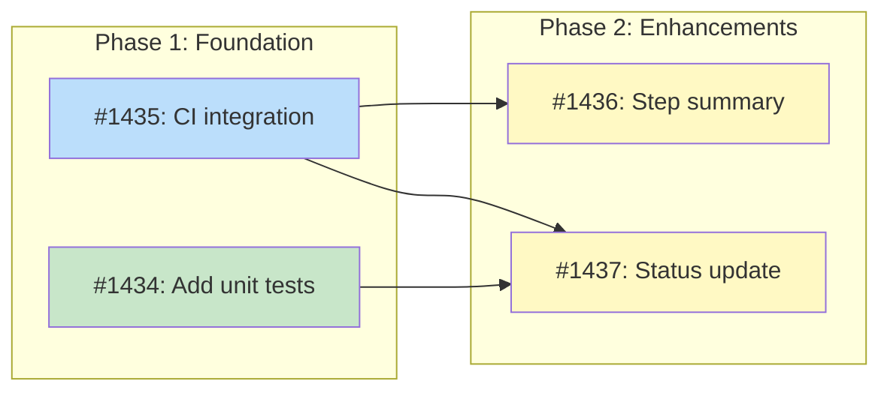

# Pipeline Dashboard

**Status**: Planned

## Implementation Issues

### Milestone: [Pipeline Dashboard](https://github.com/tsukumogami/tsuku/milestone/67)

| Issue | Title | Dependencies | Tier |
|-------|-------|--------------|------|
| ~~[#1434](https://github.com/tsukumogami/tsuku/issues/1434)~~ | ~~test(dashboard): add unit tests for internal/dashboard package~~ | ~~None~~ | ~~testable~~ |
| _Adds unit tests covering JSONL parsing (both legacy batch and per-recipe formats), queue aggregation, blocker extraction, and graceful handling of missing files._ | | |
| [#1435](https://github.com/tsukumogami/tsuku/issues/1435) | ci(pipeline): integrate dashboard generation into batch-generate workflow | None | testable |
| _Integrates the queue-analytics binary into the batch-generate.yml merge job to auto-regenerate dashboard.json on every batch run._ | | |
| [#1436](https://github.com/tsukumogami/tsuku/issues/1436) | ci(pipeline): add step summary with queue status | [#1435](https://github.com/tsukumogami/tsuku/issues/1435) | simple |
| _Adds a step that writes queue status counts and top blockers to $GITHUB_STEP_SUMMARY for quick visibility in the Actions UI._ | | |
| [#1437](https://github.com/tsukumogami/tsuku/issues/1437) | docs(pipeline): update design status to Current after deployment | [#1434](https://github.com/tsukumogami/tsuku/issues/1434), [#1435](https://github.com/tsukumogami/tsuku/issues/1435) | simple |
| _Finalizes the design lifecycle by updating status to Current after verifying the dashboard is live and functional on tsuku.dev._ | | |

### Dependency Graph



**Legend**: Green = done, Blue = ready, Yellow = blocked, Purple = needs-design

## Context and Problem Statement

The batch recipe generation pipeline produces structured data at multiple stages:

1. **Queue status** (`data/priority-queue.json`) - 1000+ packages with statuses: pending, failed, blocked, success
2. **Failure records** (`data/failures/homebrew.jsonl`) - Per-package failure details including category (missing_dep, validation_failed, etc.) and blocking dependencies
3. **Run metrics** (`data/metrics/batch-runs.jsonl`) - Per-run SLI data with platform breakdowns

Currently, understanding pipeline health requires:
- Running `jq` queries against raw JSON files
- Manually correlating failures with queue entries
- No historical view of progress or trends

Issue #1190 proposes a Cloudflare D1 backend for failure analysis, but that requires:
- Standing up a Cloudflare Worker
- Database schema design and migrations
- API implementation for queries
- Frontend for visualization

This is the right long-term solution, but it's weeks of work. Meanwhile, the data already exists in the repo and could be visualized with much simpler tooling.

### Scope

**In scope:**
- Dashboard for visualizing existing pipeline data (queue, failures, metrics)
- Works with data as it exists today in the repo
- No server or database dependencies
- Actionable insights: top blocking deps, failure patterns, progress over time

**Out of scope:**
- Re-queue triggers (requires backend - stays in #1190)
- Interactive failure investigation (stays in #1190)
- Real-time updates (static data, regenerated on each pipeline run)
- Multi-ecosystem support (focus on homebrew initially)

### Success Criteria

- Operator can identify top 3 blocking dependencies in under 30 seconds
- Dashboard generation adds less than 10 seconds to batch pipeline runtime
- No manual jq queries needed for standard status checks
- Queue status by tier is visible at a glance

## Decision Drivers

- **No infrastructure**: Must work without servers, databases, or external services
- **Immediate value**: Should be usable within days, not weeks
- **Data compatibility**: Must work with existing JSON schemas (no data format changes)
- **Maintainability**: Minimal code, standard tooling, easy to update
- **CI integration**: Could be generated automatically by the batch pipeline
- **Actionable insights**: Focus on answers to "what should I fix next?"

## Implementation Context

### Upstream Reference

This design supports the broader [Registry Scale Strategy](DESIGN-registry-scale-strategy.md) and specifically provides an intermediate solution for #1190 (Failure Analysis Backend). The goal is to deliver immediate visibility without requiring the full Cloudflare D1 infrastructure.

### Existing Patterns

**Shell Scripts** (`scripts/`):
- Use jq for JSON processing, awk for calculations, printf for table formatting
- Examples: `gap-analysis.sh`, `batch-metrics.sh`

**Website** (`website/`):
- Static HTML + vanilla JS, no framework, no build step
- CSS bar charts with variable widths
- Stats page uses cards, tables, and responsive grid layout
- Data loaded from JSON files at runtime

**Data Generation**:
- Python scripts transform TOML to JSON (see `generate-registry.py`)
- JSONL format for append-only data (failures, metrics)

### Data Sources

| File | Schema | Contents |
|------|--------|----------|
| `data/priority-queue.json` | ~8K lines | Package queue with status, tier, timestamps |
| `data/failures/homebrew.jsonl` | JSONL | Failure records with category, blocked_by |
| `data/metrics/batch-runs.jsonl` | JSONL | Per-run SLI data (PR #1422) |

### Existing Scripts

- `scripts/gap-analysis.sh` - CLI analysis of blocking dependencies
- `scripts/batch-metrics.sh` - CLI display of run metrics

## Considered Options

### Decision 1: Visualization Format

The primary question is how operators will consume pipeline status. Different formats serve different use cases: quick CLI checks during development, at-a-glance dashboards for monitoring, or browsable interfaces for investigation.

The choice affects maintenance burden, discoverability, and how the data integrates with existing workflows. CLI tools are already established for tsuku development, but a web dashboard would be more accessible and shareable.

#### Chosen: Static HTML Dashboard + CLI Scripts

Provide both:
1. **Static HTML page** (`website/pipeline/index.html`) - Visual dashboard for at-a-glance status
2. **CLI scripts** - Quick terminal access for developers

The HTML page follows the existing `website/stats/` pattern: static HTML with vanilla JS that loads JSON data files. No build step, no framework. Generates a `website/pipeline/dashboard.json` file that the page fetches.

CLI scripts extend `batch-metrics.sh` and `gap-analysis.sh` patterns for terminal users.

#### Alternatives Considered

**CLI only**: Extend existing scripts without web interface.
Rejected because shareable visualizations and historical trends are hard to express in terminal output. Web dashboards are better for recurring monitoring.

**Real-time dashboard**: Dynamic page with live data from Cloudflare Worker.
Rejected because this requires infrastructure (#1190 scope). Intermediate solution should be purely static.

**GitHub Actions Step Summary only**: Enhance `$GITHUB_STEP_SUMMARY` output in batch-generate workflow.
Rejected because while this provides immediate visibility after batch runs, it requires navigating to the Actions tab. A dedicated dashboard page provides a single URL for status regardless of when the batch ran. However, adding summary output to the workflow is complementary and should be implemented alongside the dashboard.

---

### Decision 2: Data Processing Approach

Processing involves: reading JSON/JSONL files, aggregating counts, computing percentages, and outputting either formatted tables (CLI) or JSON (web).

The choice affects dependencies, maintainability, and consistency with existing codebase patterns.

#### Chosen: Go Tool (internal/dashboard)

A Go package processes all data files and outputs JSON for the dashboard. This matches existing internal tooling patterns (`internal/seed/`, `internal/queue/`) and provides type safety, testability, and robust error handling for parsing the two JSONL formats.

Pipeline:
1. Read `priority-queue.json` for queue status counts
2. Read `failures/homebrew.jsonl` for failure category breakdown and blocker analysis
3. Read `metrics/batch-runs.jsonl` for run history
4. Output combined JSON to `website/pipeline/dashboard.json`

Invoked as: `tsuku dashboard generate` or via direct binary for CI.

#### Alternatives Considered

**Shell script (jq + awk)**: Follows `batch-metrics.sh` pattern, lower barrier to quick changes.
Rejected because the seed and queue tooling use Go. Dashboard generation is similar data transformation work and benefits from type safety, especially for parsing the two JSONL record formats.

**Python script**: More readable for complex logic, better error handling than shell.
Rejected because Go is the established language for tsuku internal tooling. Python would add a dependency.

---

### Decision 3: Update Mechanism

The dashboard needs fresh data to be useful. Updates could happen manually, on-demand, or automatically via CI.

#### Chosen: CI-Generated on Batch Pipeline Completion

Add a step to `batch-generate.yml` that regenerates `dashboard.json` after each run. The data commits alongside any recipe changes.

Benefits:
- Always up-to-date after pipeline runs
- No manual intervention required
- Dashboard reflects the same state as the repository

Implementation: Add step to the `merge` job before "Check for recipes to merge" that runs `./queue-analytics` and includes output in the commit. This ensures the dashboard updates on every batch run regardless of whether recipes are merged.

#### Alternatives Considered

**Manual generation**: Operator runs script when they want to see status.
Rejected because it defeats the purpose of quick visibility. Pipeline health should be visible without extra steps.

**Scheduled cron job**: Generate dashboard hourly regardless of pipeline runs.
Rejected because it adds complexity for marginal benefit. While a cron could skip commits when data is unchanged, "regenerate on batch completion" is simpler and naturally aligns with when operators want fresh data.

---

### Decision 4: Dashboard Content

What specific visualizations provide the most value? The dashboard could show everything or focus on actionable insights.

#### Chosen: Four-Panel Layout

1. **Queue Status** - Bar showing pending/failed/blocked/success counts, with tier breakdown
2. **Top Blockers** - Table of dependencies blocking the most packages (from `blocked_by` in failures)
3. **Failure Categories** - Breakdown of why packages fail (missing_dep, validation_failed, etc.)
4. **Recent Runs** - Last 10 batch runs with pass rates (from batch-runs.jsonl)

Each panel answers a key question:
- Queue Status: "What's the overall health? Are high-priority packages being processed?"
- Top Blockers: "What should we fix next?"
- Failure Categories: "What kinds of problems do we have?"
- Recent Runs: "Is the pipeline improving?"

#### Alternatives Considered

**Minimal status page**: Just show counts (X pending, Y failed).
Rejected because it doesn't help prioritization. Knowing there are 8 failures is less useful than knowing which 2 dependencies block 6 of them.

**Comprehensive dashboard**: Include per-package details, historical trends, drill-down.
Rejected for initial scope. Start simple, add detail if operators find the basic dashboard useful.

### Uncertainties

- **Data volume**: The priority queue is ~8K lines. jq can handle this, but performance hasn't been measured for dashboard generation.
- **Failure record freshness**: JSONL appends may accumulate stale data. May need a truncation or rotation strategy eventually.
- **Metric data availability**: PR #1422 adds `batch-runs.jsonl` but it's not yet merged. Dashboard will handle missing file gracefully (show "No metrics data available" panel).

### Assumptions
- **Public data**: Queue status and failure messages are appropriate for public visibility on tsuku.dev. Package names and Homebrew formula details are already public.
- **Single ecosystem**: Initial implementation filters to homebrew only. The dashboard JSON schema supports future ecosystem expansion.
- **Browser access**: Operators have browser access for the HTML dashboard; CLI scripts remain available for terminal-only contexts.

## Decision Outcome

**Chosen option: Static HTML Dashboard with CI Generation**

### Summary

The pipeline dashboard consists of three components: a shell script that processes data files, a JSON data file committed to the repository, and a static HTML page deployed to tsuku.dev.

The data processing tool (`internal/dashboard/`) reads from three sources: `data/priority-queue.json` for queue status and tier breakdown, `data/failures/homebrew.jsonl` for failure categories and blocking dependencies, and `data/metrics/batch-runs.jsonl` for historical run metrics. It aggregates counts, computes top blockers by frequency, and outputs a single `website/pipeline/dashboard.json` file. The tool handles missing metrics data gracefully by omitting the "Recent Runs" panel data when `batch-runs.jsonl` doesn't exist.

The HTML dashboard (`website/pipeline/index.html`) fetches `dashboard.json` at page load and renders four panels: queue status with tier breakdown, top blocking dependencies, failure category distribution, and recent batch runs. It follows the existing `website/stats/` pattern: vanilla JavaScript, CSS variables for theming, no framework, no build step. The page shows the data timestamp and links to the relevant data files for operators who want raw access.

CI integration adds a step to `batch-generate.yml` that runs the dashboard generation tool and includes the output in the commit. The dashboard updates automatically after each batch pipeline run, ensuring data freshness without manual intervention. Additionally, the merge job's `$GITHUB_STEP_SUMMARY` output is enhanced to include a quick status table, providing immediate visibility in the Actions tab.

### Rationale

Shell scripting with jq aligns with established codebase patterns. The existing `batch-metrics.sh` and `gap-analysis.sh` scripts prove this approach works for similar data processing tasks. Python or Go would add dependencies and maintenance burden for what amounts to JSON aggregation.

Static HTML with vanilla JavaScript matches the website's existing architecture. No build step means simpler deployment and maintenance. The stats page already demonstrates this pattern works for data visualization.

CI-triggered generation ensures data freshness without operator intervention. The dashboard reflects the same state as the repository because it's generated and committed in the same workflow that modifies the underlying data. This is simpler than cron-based approaches and more automatic than manual generation.

The four-panel layout directly addresses operator questions: overall health (queue status), priority (tier breakdown), next actions (top blockers), and trends (recent runs). Including tier breakdown was added based on review feedback to answer "are high-priority packages being processed?"

### Trade-offs Accepted

By choosing this option, we accept:
- **No real-time updates**: Dashboard is stale until the next batch pipeline run. Operators see data from the last completed run, not live state.
- **Single ecosystem**: Initial implementation only shows Homebrew data. Other ecosystems will require future work.
- **Limited interactivity**: No drill-down into individual packages or filtering. Deep investigation still requires manual jq queries or the future #1190 backend.
- **File growth**: JSONL files grow indefinitely. Eventually a rotation or archival strategy will be needed.

These are acceptable because:
- Batch runs happen every 3 hours (per #1412), so data is at most 3 hours stale
- Homebrew is the only ecosystem currently generating data
- This is an intermediate solution; #1190 will provide full investigation capabilities
- File growth is slow (one record per batch run) and can be addressed later

## Solution Architecture

### Overview

```
┌─────────────────────────────────────────────────────────────────────┐
│                        batch-generate.yml                           │
│  ┌─────────────┐     ┌──────────────────┐     ┌─────────────────┐  │
│  │   Generate  │ ──► │   Validate +     │ ──► │ Generate        │  │
│  │   Recipes   │     │   Merge          │     │ Dashboard       │  │
│  └─────────────┘     └──────────────────┘     └─────────────────┘  │
│                              │                        │             │
│                              ▼                        ▼             │
│                     data/priority-queue.json   website/pipeline/    │
│                     data/failures/*.jsonl      └── dashboard.json   │
│                     data/metrics/*.jsonl                            │
└─────────────────────────────────────────────────────────────────────┘

┌─────────────────────────────────────────────────────────────────────┐
│                          tsuku.dev                                  │
│  ┌─────────────────────────────────────────────────────────────┐   │
│  │              website/pipeline/index.html                     │   │
│  │  ┌──────────┐ ┌──────────┐ ┌──────────┐ ┌──────────────┐   │   │
│  │  │  Queue   │ │   Top    │ │ Failure  │ │   Recent     │   │   │
│  │  │  Status  │ │ Blockers │ │Categories│ │    Runs      │   │   │
│  │  └──────────┘ └──────────┘ └──────────┘ └──────────────┘   │   │
│  │           ▲                                                 │   │
│  │           └── fetch('/pipeline/dashboard.json')            │   │
│  └─────────────────────────────────────────────────────────────┘   │
└─────────────────────────────────────────────────────────────────────┘
```

### Components

**1. Data Generation Tool** (`cmd/queue-analytics/`)

Standalone binary (like `cmd/seed-queue/`) that reads source data files and outputs `website/pipeline/dashboard.json`:

```go
// cmd/queue-analytics/main.go
func main() {
    queueFile := flag.String("queue", "data/priority-queue.json", "...")
    failuresFile := flag.String("failures", "data/failures/homebrew.jsonl", "...")
    metricsFile := flag.String("metrics", "data/metrics/batch-runs.jsonl", "...")
    output := flag.String("output", "website/pipeline/dashboard.json", "...")
    // ...
    dashboard.Generate(opts)
}
```

Usage: `./queue-analytics [-output PATH]`

The core logic lives in `internal/dashboard/` package for testability.

Note: The failures JSONL contains two record types that the Go parser handles:
1. **Legacy batch records**: Objects with `failures[]` array containing `package_id`, `category`, `blocked_by`
2. **Per-recipe validation records**: Objects with `recipe`, `platform`, `exit_code`, `category`

The tool processes both formats: legacy records for blocker analysis (extracting `blocked_by` arrays) and per-recipe records for category counts.

**2. Dashboard Data File** (`website/pipeline/dashboard.json`)

JSON structure with all pre-computed aggregations:

```json
{
  "generated_at": "2026-02-03T12:00:00Z",
  "queue": {
    "total": 1001,
    "by_status": {
      "pending": 988,
      "failed": 8,
      "blocked": 4,
      "success": 1
    },
    "by_tier": {
      "1": { "total": 50, "pending": 45, "failed": 2, "blocked": 2, "success": 1 },
      "2": { "total": 951, "pending": 943, "failed": 6, "blocked": 2, "success": 0 }
    }
  },
  "blockers": [
    { "dependency": "glib", "count": 15, "packages": ["imagemagick", "ffmpeg", "..."] },
    { "dependency": "gmp", "count": 8, "packages": ["coreutils", "..."] }
  ],
  "failures": {
    "missing_dep": 12,
    "validation_failed": 6,
    "no_bottles": 0,
    "build_from_source": 0,
    "api_error": 2,
    "deterministic_insufficient": 1
  },
  "runs": [
    { "batch_id": "2026-02-02-homebrew", "total": 10, "merged": 6, "rate": 0.6, "timestamp": "..." }
  ]
}
```

**3. HTML Dashboard** (`website/pipeline/index.html`)

Static HTML page using vanilla JavaScript:

- Fetches `dashboard.json` on load
- Renders four panels with CSS bar charts
- Shows timestamp and raw data links
- Handles missing data gracefully (shows "No data" message)
- Responsive layout following `website/stats/` patterns

### Key Interfaces

**Dashboard JSON Schema:**

| Field | Type | Description |
|-------|------|-------------|
| `generated_at` | ISO 8601 | When the data was generated |
| `queue.total` | int | Total packages in queue |
| `queue.by_status` | object | Counts by status (pending/failed/blocked/success) |
| `queue.by_tier` | object | Nested counts: tier → status → count |
| `blockers[]` | array | Top blocking dependencies, sorted by count desc |
| `blockers[].dependency` | string | Dependency name (tsuku recipe name) |
| `blockers[].count` | int | Number of packages blocked |
| `blockers[].packages` | string[] | First 5 blocked package names |
| `failures` | object | Counts by failure category |
| `runs[]` | array | Last 10 batch runs, newest first |
| `runs[].batch_id` | string | Batch identifier |
| `runs[].total` | int | Packages processed |
| `runs[].merged` | int | Recipes successfully merged |
| `runs[].rate` | float | Success rate (0.0-1.0) |

### Data Flow

1. **Batch pipeline runs** → Updates `priority-queue.json`, `failures/homebrew.jsonl`, `metrics/batch-runs.jsonl`
2. **Generate dashboard step** → Reads all three files, outputs `dashboard.json`
3. **Commit and push** → `dashboard.json` is committed to repo
4. **Cloudflare Pages deploys** → `website/pipeline/` becomes accessible at tsuku.dev/pipeline/
5. **Operator visits page** → Browser fetches `dashboard.json`, renders panels

## Implementation Approach

### Phase 1: Data Generation Tool

Create `internal/dashboard/` package with:
- Types for priority queue, failure records (both formats), and metrics
- `Generate()` function that reads files and outputs `dashboard.json`
- Unit tests for parsing both JSONL record formats
- Graceful handling of missing files (outputs partial data)

Create standalone binary: `cmd/queue-analytics/main.go` (like `cmd/seed-queue/`)

Test locally: `go run ./cmd/queue-analytics && cat website/pipeline/dashboard.json`

### Phase 2: HTML Dashboard Page

Create `website/pipeline/index.html` that:
- Follows `website/stats/index.html` structure
- Fetches and parses `dashboard.json`
- Renders four panels with bar charts
- Includes dark theme support via CSS variables
- Shows "No data available" for missing sections

Test locally: `python3 -m http.server -d website 8080` → visit localhost:8080/pipeline/

### Phase 3: CI Integration

Modify `.github/workflows/batch-generate.yml`:
- Add "Generate dashboard" step in the `merge` job before "Check for recipes to merge"
- Build and run `./queue-analytics` binary
- Include `website/pipeline/dashboard.json` in the commit

This placement ensures the dashboard updates on every batch run, regardless of whether recipes are merged. The step should run early in the merge job so dashboard data reflects the current batch state.

Test: Trigger workflow manually, verify dashboard.json is committed

### Phase 4: GitHub Actions Summary (Enhancement)

Add status table to merge job `$GITHUB_STEP_SUMMARY`:
- Quick queue status counts
- Top 3 blockers
- Link to full dashboard

## Consequences

### Positive

- **Immediate visibility**: Operators can check pipeline health without jq knowledge
- **Zero infrastructure**: No servers, databases, or external services
- **Low maintenance**: Go tool with tests + static HTML is robust and easy to update
- **Consistent with patterns**: Follows existing website and scripting conventions
- **Complementary to #1190**: Provides value now while full backend is developed

### Negative

- **Stale data**: Dashboard reflects last batch run, not current state
- **Limited interactivity**: No filtering, drill-down, or ad-hoc queries
- **Homebrew only**: Other ecosystems not supported initially
- **Growing data files**: JSONL files grow without bound

### Mitigations

- Stale data: Batch runs every 3 hours, so max staleness is predictable
- Limited interactivity: CLI scripts remain available for custom queries; #1190 will provide full investigation
- Homebrew only: JSON schema supports future ecosystem expansion
- Growing files: Monitor file sizes; add rotation when files exceed 1MB

## Security Considerations

### Download Verification

**Not applicable** - This feature does not download external artifacts. It processes JSON files that already exist in the repository and outputs a new JSON file. All data is read-only from trusted, version-controlled sources.

### Execution Isolation

The data generation script runs in GitHub Actions with standard repository permissions:
- **File system access**: Read access to `data/` directory, write access to `website/pipeline/dashboard.json`
- **Network access**: None required
- **Privilege escalation**: None - runs as standard GitHub Actions runner user

The HTML dashboard runs in the user's browser with standard web sandbox restrictions:
- Can only fetch from same origin (tsuku.dev)
- No local file system access
- No special permissions required

### Supply Chain Risks

**Data sources are trusted**:
- `priority-queue.json` is committed by the batch pipeline running in this repo's CI
- `failures/homebrew.jsonl` is generated by the same pipeline
- `metrics/batch-runs.jsonl` is generated by the same pipeline

All source data is written by workflows with `GITHUB_TOKEN` permissions in this repository. External actors cannot modify these files without repository write access.

**Dashboard deployment**: The HTML page is deployed via Cloudflare Pages from the repository. Changes require code review and merge approval.

### User Data Exposure

**What data is exposed**:
- Package names from Homebrew (public information)
- Failure messages (may contain Homebrew formula metadata, which is public)
- Pipeline run timestamps and statistics

**What is NOT exposed**:
- No user-identifying information
- No API keys or secrets
- No installation paths or local filesystem information

The dashboard is deployed to tsuku.dev (public). All displayed information is already public (Homebrew formula names and metadata). There is no privacy concern with this data being visible.

### Mitigations

| Risk | Mitigation | Residual Risk |
|------|------------|---------------|
| Malicious data injection | All data sources are written by CI with repo permissions; PRs require review | Compromised CI could inject bad data; mitigated by GitHub's security model |
| XSS via failure messages | Dashboard renders text as textContent, not innerHTML | None for standard text rendering |
| Denial of service via large JSON | Dashboard truncates display of long lists (max 10 blockers, 10 runs) | Extremely large files could slow page load; acceptable given data growth rate |
