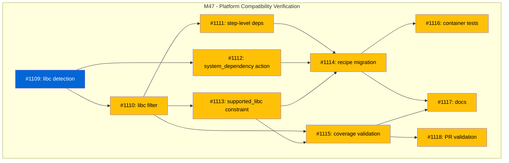

# Platform Compatibility Verification

## Status

**Planned**

## Implementation Issues

| Issue | Title | Dependencies | Tier |
|-------|-------|--------------|------|
| [#1109](https://github.com/tsukumogami/tsuku/issues/1109) | feat(platform): add libc detection for glibc vs musl | None | testable |
| [#1110](https://github.com/tsukumogami/tsuku/issues/1110) | feat(recipe): add libc filter to recipe conditional system | #1109 | testable |
| [#1111](https://github.com/tsukumogami/tsuku/issues/1111) | feat(recipe): add step-level dependency resolution | #1110 | testable |
| [#1112](https://github.com/tsukumogami/tsuku/issues/1112) | feat(actions): add system_dependency action for musl support | #1109 | testable |
| [#1113](https://github.com/tsukumogami/tsuku/issues/1113) | feat(recipe): add supported_libc platform constraint | #1110 | testable |
| [#1114](https://github.com/tsukumogami/tsuku/issues/1114) | feat(recipe): migrate library recipes to hybrid approach | #1111, #1112, #1113 | testable |
| [#1115](https://github.com/tsukumogami/tsuku/issues/1115) | feat(verify): add recipe coverage validation for libc support | #1110, #1113 | testable |
| [#1116](https://github.com/tsukumogami/tsuku/issues/1116) | ci: add container integration tests for glibc and musl | #1114 | testable |
| [#1117](https://github.com/tsukumogami/tsuku/issues/1117) | docs: document hybrid libc approach for recipe authors | #1114, #1115 | simple |
| [#1118](https://github.com/tsukumogami/tsuku/issues/1118) | ci: add recipe coverage to PR validation workflow | #1115 | testable |



## Context and Problem Statement

tsuku builds and releases binaries for 4 platform combinations (Linux/macOS x amd64/arm64) and claims support for 5 Linux distribution families (Debian, RHEL, Arch, Alpine, SUSE). However, the testing infrastructure doesn't adequately verify that tsuku actually works on all these targets.

This gap was exposed when adding dlopen integration tests: embedded library recipes (zlib, libyaml, gcc-libs, openssl) use Homebrew bottles built for glibc, which fail on musl-based systems like Alpine Linux. The libraries install without error, but fail at runtime with "Dynamic loading not supported" because they link against `libc.so.6` which doesn't exist on musl systems.

This reveals a broader pattern: tsuku's CI uses simulation (running Alpine-family tests on Ubuntu runners) rather than real environment verification. Other untested gaps likely exist:
- ARM64 Linux binaries are released but never integration-tested
- Only Debian family receives library dlopen verification
- openssl can't be verified due to system library conflicts

The current approach creates false confidence: tests pass on simulated environments while users on real systems encounter failures.

### Scope

**In scope:**
- Ensuring tests run on real target environments (actual containers/runners, not simulation)
- Solving library compatibility on musl systems via system packages while preserving Homebrew bottles on glibc
- Expanding dlopen verification to all supported Linux families (including Alpine)
- Testing ARM64 Linux binaries
- Establishing a verification matrix that matches release targets

**Out of scope:**
- Adding new platform targets beyond current release matrix
- Windows support
- Non-Linux/macOS platforms

**Scope clarification:** This design changes the approach for library dependencies on musl systems only. Glibc systems continue using Homebrew bottles with full hermetic version control.

## Decision Drivers

- **Accuracy over speed**: Real environment tests are slower but catch real issues; simulated tests are fast but miss environment-specific bugs
- **Release parity**: Every binary released should have corresponding integration tests
- **Fail-fast discovery**: Platform incompatibilities should be caught in CI, not by users
- **Maintainability**: Test infrastructure should be sustainable as platforms evolve
- **CI resource constraints**: GitHub Actions has limited ARM64 runners and container support varies by runner type
- **Preserve user value**: Hermetic library versions provide real value (CI reproducibility, audit trails) that shouldn't be discarded unnecessarily
- **Minimal disruption**: Fix Alpine without changing behavior for existing glibc users

## Research Findings

Analysis of competing package managers (Homebrew, Nix, asdf/mise, Cargo, Docker) and tsuku's own architecture revealed key insights that reshape the approach to this problem. Extended research into Alpine's market position, the viability of hermetic APK extraction, and the value of hermetic library versions informed the hybrid approach.

### Alpine's Strategic Importance

Research into Alpine Linux's market position found:

- **~20% of all Docker containers use Alpine** as their base image
- **Over 100 million container image downloads per month** with significant Alpine usage
- Alpine is ~30x smaller than Debian (5 MB vs 75+ MB)
- **95%+ of musl Linux users are on Alpine** - other musl distros (Void, Chimera, Adelie) are statistically negligible
- mise (a direct competitor to tsuku) explicitly provides native Alpine/musl support

This makes Alpine a first-class citizen that tsuku must support, not a niche target.

### The Value of Hermetic Library Versions

Research into user value found that hermetic library versions provide real benefits:

1. **CI reproducibility** - Same library versions across machines and over time
2. **Audit/compliance trail** - Prove exactly which versions were installed
3. **Security incident response** - Identify affected tools, enable rollback to known-good versions
4. **"Works on my machine" debugging** - Share plans with explicit versions
5. **Differentiator from mise** - mise does NOT manage library dependencies hermetically

These benefits justify preserving Homebrew bottles where they work (glibc systems).

### Why System Packages for musl Only

**Hermetic APK extraction was considered and rejected:**

1. **Alpine doesn't retain old package versions.** Version-pinned Docker builds break within days/weeks when packages are updated. There's no snapshot service like Debian's snapshot.debian.org.

2. **APK extraction only works on Alpine.** Other musl distros use different package formats (Void uses xbps, Chimera uses APKv3).

3. **The hermetic value proposition doesn't hold on Alpine.** Since Alpine removes old packages, you can't get reproducibility anyway.

This means system packages are the right answer for musl - but there's no reason to extend that to glibc where Homebrew bottles work fine.

### The Dependency Graph Is Shallow

tsuku only has 4 embedded library recipes:
- zlib (no deps)
- libyaml (no deps)
- openssl (depends on zlib)
- gcc-libs (Linux only)

Only 4 tool recipes depend on these: ruby, nodejs, cmake, and tools using openssl. Maximum dependency depth is 2 (cmake → openssl → zlib). This makes the hybrid approach straightforward.

### Dependency Resolution Asymmetry

Research found a key asymmetry that simplifies the hybrid approach:

| Aspect | glibc/Homebrew | musl/System Packages |
|--------|----------------|---------------------|
| Who resolves deps? | tsuku (from recipe) | Package manager (apk) |
| Transitive deps | Must be declared in recipe | Automatic |
| Recipe complexity | Higher (full dep tree) | Lower (just package name) |

For a library like libcurl with 8+ dependencies:
- **glibc path**: Recipe declares `dependencies = ["openssl", "zlib", "brotli", ...]` and tsuku resolves the tree
- **musl path**: Recipe just says `apk add curl-dev` and apk handles all transitive deps

This asymmetry works in our favor - the musl path is simpler, not harder.

## Considered Options

This design addresses three independent questions:

### Decision 1: How to handle the glibc/musl split?

#### Option 1A: System packages everywhere

Replace embedded library recipes with system package dependencies across ALL Linux families.

**Pros:**
- Single code path
- Works on all platforms

**Cons:**
- **Loses hermetic version control for glibc users**
- Breaking change for existing users
- Discards working infrastructure (1,251 LOC of Homebrew code)
- Gives up differentiating feature vs mise

#### Option 1B: Hybrid approach (Recommended)

Keep Homebrew bottles for glibc, use system packages only for musl.

**Pros:**
- **Preserves hermetic version control on glibc** (majority of users)
- Fixes Alpine without changing behavior for existing users
- Lower risk - glibc users see no change
- Reuses existing battle-tested Homebrew infrastructure
- musl path is simpler (package manager handles deps)

**Cons:**
- Two code paths (but cleanly separated)
- Requires `libc` filter in recipe conditionals
- musl users don't get hermetic versions (but Alpine removes old packages anyway)

### Decision 2: How to express conditional dependencies?

Dependencies should only be resolved for steps that actually run on the target platform.

#### Option 2A: Recipe-level dependencies (current)

```toml
[metadata]
dependencies = ["openssl", "zlib"]  # Always resolved, even if unused

[[steps]]
action = "homebrew"
when = { libc = ["glibc"] }
```

**Problem:** On musl, the plan shows 8+ resolved dependencies with no steps.

#### Option 2B: Step-level dependencies (Recommended)

```toml
[[steps]]
action = "homebrew"
formula = "curl"
when = { libc = ["glibc"] }
dependencies = ["openssl", "zlib", "brotli"]  # Only resolved if this step matches

[[steps]]
action = "system_dependency"
name = "curl"
when = { libc = ["musl"] }
# No dependencies - apk handles it
```

**Pros:**
- Dependencies tied to steps that need them
- Clean plans - no phantom dependencies
- Explicit about what each path requires

**Cons:**
- Requires adding `dependencies` field to Step struct (new feature)

### Decision 3: Testing approach

Same as before - hybrid testing with native runners where available, containers for family-specific tests.

## Decision Outcome

**Chosen: 1B (Hybrid libc approach) + 2B (Step-level dependencies) + Hybrid testing + Match release matrix**

### Summary

We adopt a **hybrid approach** that preserves hermetic library versions on glibc while fixing Alpine compatibility via system packages. A new `libc` filter enables conditional recipe steps, and step-level dependencies ensure dependency resolution only happens for matching steps.

### Rationale

**Decision 1 - Hybrid libc approach (1B):**

The hybrid approach is lower risk and preserves more user value:

1. **Fixes the actual problem** - Alpine support was the goal
2. **Preserves differentiating feature** - Hermetic library versions remain available on glibc
3. **No breaking change for glibc users** - Majority of users see no change
4. **Research-backed** - Hermetic APK extraction wouldn't provide value anyway (Alpine removes old packages)
5. **Reuses existing code** - 1,251 LOC of Homebrew infrastructure is battle-tested

**Decision 2 - Step-level dependencies (2B):**

Step-level dependencies provide clean semantics:

1. **Dependencies tied to steps** - Only resolved if the step matches the target
2. **No phantom dependencies** - musl plans don't show unused Homebrew deps
3. **Explicit control** - Recipe author decides what each path needs

### Trade-offs Accepted

1. **Two code paths**: Acceptable because they're cleanly separated and the Homebrew path is battle-tested (1,251 LOC that already works).

2. **musl users don't get hermetic versions**: Acceptable because Alpine removes old packages anyway - hermetic versions wouldn't provide reproducibility there.

3. **Recipe verbosity for hybrid libraries**: Acceptable - libraries need two step blocks, but it's explicit about what each path does.

4. **New feature required (step-level deps)**: Acceptable - it's a clean addition (~100 LOC) that improves the recipe model.

## Solution Architecture

### Overview

The solution has seven components:

1. **Libc detection** - Detect glibc vs musl at runtime
2. **Libc recipe filter** - Add `libc` to recipe conditional system
3. **Step-level dependencies** - Dependencies declared per-step, only resolved if step matches
4. **System dependency action** - For musl systems, guide users to install system packages
5. **Platform support matrix** - Clear three-way split (glibc/musl/darwin)
6. **Dependency precedence rules** - How recipe-level and step-level deps interact
7. **Hybrid CI test matrix** - Native runners + containers for comprehensive coverage

### Component 1: Libc Detection

Add libc detection to the platform package.

```
internal/platform/
├── libc.go          # New: libc detection (glibc vs musl)
├── family.go        # Existing: Linux family detection
└── target.go        # Existing: platform target
```

**Detection logic:**

```go
func DetectLibc() string {
    // Check for musl dynamic linker
    matches, _ := filepath.Glob("/lib/ld-musl-*.so.1")
    if len(matches) > 0 {
        return "musl"
    }
    return "glibc"
}
```

**Integration with Target:**

```go
type Target struct {
    os     string
    arch   string
    family string
    libc   string  // New field
}

func (t *Target) Libc() string {
    return t.libc
}
```

### Component 2: Libc Recipe Filter

Add `libc` to the recipe conditional system.

**WhenClause changes:**

```go
type WhenClause struct {
    Platform       []string `toml:"platform"`
    OS             []string `toml:"os"`
    Arch           string   `toml:"arch"`
    LinuxFamily    string   `toml:"linux_family"`
    PackageManager string   `toml:"package_manager"`
    Libc           []string `toml:"libc"`  // New: ["glibc"], ["musl"], or both
}

func (w *WhenClause) Matches(target Matchable) bool {
    // ... existing checks ...

    // Check libc filter (only applicable on Linux)
    if len(w.Libc) > 0 && target.OS() == "linux" {
        if !contains(w.Libc, target.Libc()) {
            return false
        }
    }
    return true
}
```

**Matchable interface:**

```go
type Matchable interface {
    OS() string
    Arch() string
    LinuxFamily() string
    Libc() string  // New method
}
```

### Component 3: Step-Level Dependencies

Add `dependencies` field to the Step struct so dependencies are only resolved for matching steps.

**Step struct changes:**

```go
type Step struct {
    Action       string
    When         *WhenClause
    Note         string
    Description  string
    Params       map[string]interface{}
    Dependencies []string  // New: only resolved if this step matches target
}
```

**Dependency resolution changes:**

```go
func (g *PlanGenerator) resolveStepDependencies(step *Step, target *Target) ([]Plan, error) {
    // Only resolve dependencies if step matches target
    if step.When != nil && !step.When.Matches(target) {
        return nil, nil  // Step doesn't match, skip its dependencies
    }

    var depPlans []Plan
    for _, depName := range step.Dependencies {
        depPlan, err := g.generatePlan(depName, target)
        if err != nil {
            return nil, err
        }
        depPlans = append(depPlans, depPlan)
    }
    return depPlans, nil
}
```

### Component 4: System Dependency Action

For musl systems, a new action that checks for system packages and guides installation.

**Structured error type:**

```go
// DependencyMissingError is a sentinel error type for missing system dependencies.
// The CLI uses this to provide specialized output (colored, formatted).
type DependencyMissingError struct {
    Library string
    Package string
    Command string
    Family  string
}

func (e *DependencyMissingError) Error() string {
    return fmt.Sprintf("missing system dependency: %s (install with: %s)", e.Library, e.Command)
}

// IsDependencyMissing checks if an error is a missing dependency error.
func IsDependencyMissing(err error) bool {
    var depErr *DependencyMissingError
    return errors.As(err, &depErr)
}
```

**Action implementation:**

```go
type SystemDependencyAction struct{ BaseAction }

func (a *SystemDependencyAction) Execute(ctx *ExecutionContext, params map[string]interface{}) error {
    name := params["name"].(string)
    packages := params["packages"].(map[string]string)

    // Get package name for this family
    family := ctx.Target.LinuxFamily()
    pkgName, ok := packages[family]
    if !ok {
        return fmt.Errorf("no package mapping for family %s", family)
    }

    // Check if installed
    if isInstalled(pkgName, family) {
        return nil
    }

    // Show install command with root detection
    cmd := getInstallCommand(pkgName, family)
    return &DependencyMissingError{
        Library: name,
        Package: pkgName,
        Command: cmd,
        Family:  family,
    }
}
```

**Package installation detection:**

```go
func isInstalled(pkg string, family string) bool {
    switch family {
    case "alpine":
        cmd := exec.Command("apk", "info", "-e", pkg)
        return cmd.Run() == nil
    case "debian":
        cmd := exec.Command("dpkg-query", "-W", "-f=${Status}", pkg)
        out, err := cmd.Output()
        return err == nil && strings.Contains(string(out), "install ok installed")
    // ... other families
    }
    return false
}
```

**Root detection for install commands:**

```go
func getInstallCommand(pkg string, family string) string {
    prefix := ""
    if os.Getuid() != 0 {
        // Not running as root, add sudo/doas prefix
        if _, err := exec.LookPath("doas"); err == nil {
            prefix = "doas "
        } else {
            prefix = "sudo "
        }
    }

    switch family {
    case "alpine":
        return prefix + "apk add " + pkg
    case "debian":
        return prefix + "apt install " + pkg
    // ... other families
    }
    return ""
}
```

**Aggregate missing deps at plan time:**

The plan generator collects ALL missing dependencies before failing, so users see everything they need to install:

```go
func (g *PlanGenerator) collectMissingDeps(steps []Step, target *Target) []DependencyMissingError {
    var missing []DependencyMissingError
    for _, step := range steps {
        if step.Action == "system_dependency" && step.When.Matches(target) {
            if err := checkSystemDep(step, target); err != nil {
                var depErr *DependencyMissingError
                if errors.As(err, &depErr) {
                    missing = append(missing, *depErr)
                }
            }
        }
    }
    return missing
}
```

**CLI output for aggregated missing deps:**

```
$ tsuku install complex-tool
Planning complex-tool v1.0.0

Missing system dependencies:

    libcurl is required but not installed.
    openssl is required but not installed.

Install all with:
    sudo apk add curl-dev openssl-dev

Then retry:
    tsuku install complex-tool
```

### Component 5: Platform Support Matrix

The hybrid approach creates a three-way split for library dependencies:

| Platform | Libc | Library Source | Version Control | User Action |
|----------|------|----------------|-----------------|-------------|
| Linux (Debian, Fedora, Arch, SUSE) | glibc | Homebrew bottles | Hermetic (tsuku controls) | None |
| Linux (Alpine) | musl | System packages | Non-hermetic (apk controls) | `apk add` before tsuku |
| macOS | libSystem | Homebrew | Homebrew controls | None |

**macOS behavior:** macOS uses a single libc (libSystem) and continues using Homebrew via `brew_install` action. The `libc` filter is only relevant on Linux - macOS steps should use `when = { os = ["darwin"] }`.

**Recipe pattern for all three platforms:**

```toml
# glibc Linux: Homebrew bottles with full dependency tree
[[steps]]
action = "homebrew"
formula = "curl"
when = { os = ["linux"], libc = ["glibc"] }
dependencies = ["openssl", "zlib"]

# musl Linux: System packages (apk handles transitive deps)
[[steps]]
action = "system_dependency"
name = "curl"
packages = { alpine = "curl-dev" }
when = { os = ["linux"], libc = ["musl"] }

# macOS: Homebrew (brew handles deps)
[[steps]]
action = "brew_install"
packages = ["curl"]
when = { os = ["darwin"] }
```

### Component 6: Dependency Precedence Rules

Recipe-level and step-level dependencies can coexist. The resolution rules are:

1. **Recipe-level dependencies** (in `[metadata]`) are resolved for ALL matching steps
2. **Step-level dependencies** (in `[[steps]]`) are resolved ONLY if that step matches the target
3. Dependencies are **additive** - a step inherits recipe-level deps plus its own step-level deps
4. **Deduplication** happens after aggregation - if both levels declare the same dep, it's resolved once

**Example:**

```toml
[metadata]
dependencies = ["zlib"]  # Resolved for all paths

[[steps]]
action = "homebrew"
when = { libc = ["glibc"] }
dependencies = ["openssl"]  # Only resolved on glibc

# On glibc: resolves zlib + openssl
# On musl: resolves zlib only (no homebrew step matches)
```

**Recommendation:** For hybrid recipes, prefer step-level dependencies only. This makes each path's requirements explicit and avoids phantom dependencies.

### Component 7: Hybrid Recipe Format

Library recipes use conditional steps with step-level dependencies:

```toml
[metadata]
name = "libcurl"
type = "library"
# No recipe-level dependencies - they're step-specific

# glibc: Homebrew bottles with full dependency tree
[[steps]]
action = "homebrew"
formula = "curl"
when = { os = ["linux"], libc = ["glibc"] }
dependencies = ["brotli", "libnghttp2", "libssh2", "openssl", "zlib", "zstd"]

# musl: System packages (apk handles transitive deps)
[[steps]]
action = "system_dependency"
name = "curl"
packages = { alpine = "curl-dev" }
when = { os = ["linux"], libc = ["musl"] }

# macOS: Homebrew (brew handles deps)
[[steps]]
action = "brew_install"
packages = ["curl"]
when = { os = ["darwin"] }
```

### Data Flow

**On glibc (e.g., Debian):**

```
User runs: tsuku install cmake (depends on libcurl)

1. Platform detection
   └─> OS=linux, arch=amd64, family=debian, libc=glibc

2. Load cmake recipe
   └─> Step: homebrew action, when={libc=["glibc"]}, deps=["libcurl"]
   └─> Step matches! Resolve dependencies...

3. Load libcurl recipe
   └─> Step: homebrew action, when={libc=["glibc"]}, deps=["openssl", "zlib", ...]
   └─> Step matches! Resolve dependencies recursively...

4. Download Homebrew bottles
   └─> curl, openssl, zlib, brotli, ... from GHCR

5. RPATH relocation
   └─> patchelf to fix library paths

6. Verification
   └─> dlopen test passes (glibc bottles on glibc system)
```

**On musl (e.g., Alpine):**

```
User runs: tsuku install cmake (depends on libcurl)

1. Platform detection
   └─> OS=linux, arch=amd64, family=alpine, libc=musl

2. Load cmake recipe
   └─> Step: homebrew action, when={libc=["glibc"]} - SKIP (doesn't match)
   └─> Step: system_dependency, when={libc=["musl"]}, no deps
   └─> Step matches! No dependencies to resolve.

3. Check system package
   └─> Is curl-dev installed?
       └─> Yes: Continue
       └─> No: Show "apk add curl-dev", halt

4. Tool installation
   └─> Download cmake binary from upstream

5. Verification
   └─> dlopen test passes (system libraries on musl system)
```

## Implementation Approach

### Phase 1: Libc Detection

**Goal:** Add libc detection to platform package.

**Changes:**
1. Add `internal/platform/libc.go` with `DetectLibc() string`
2. Add `libc` field to `Target` struct
3. Add `Libc()` method to `Matchable` interface
4. Update `NewTarget()` to detect libc
5. Add unit tests

**Estimated LOC:** ~50

**Dependencies:** None

### Phase 2: Libc Recipe Filter

**Goal:** Add `libc` to recipe conditional system.

**Changes:**
1. Add `Libc []string` field to `WhenClause` struct
2. Update `WhenClause.Matches()` to check libc
3. Update `WhenClause.IsEmpty()` and serialization
4. Add validation rules (see below)
5. Add unit tests for libc filtering

**Validation rules:**

```go
func (w *WhenClause) Validate() error {
    // libc filter only valid on Linux
    if len(w.Libc) > 0 {
        if len(w.OS) > 0 && !slices.Contains(w.OS, "linux") {
            return fmt.Errorf("libc filter only valid when os includes 'linux'")
        }
        for _, libc := range w.Libc {
            if libc != "glibc" && libc != "musl" {
                return fmt.Errorf("libc must be 'glibc' or 'musl', got %q", libc)
            }
        }
    }
    return nil
}
```

**Estimated LOC:** ~100

**Dependencies:** Phase 1

### Phase 3: Step-Level Dependencies

**Goal:** Allow dependencies to be declared per-step.

**Changes:**
1. Add `Dependencies []string` field to `Step` struct
2. Update TOML parsing to read step-level deps
3. Update dependency resolver to only resolve deps for matching steps
4. Update plan generator to handle step-level deps
5. Add unit tests

**Estimated LOC:** ~150

**Dependencies:** Phase 2

### Phase 4: System Dependency Action

**Goal:** Create action for musl systems to check/guide system packages.

**Changes:**
1. Add `internal/actions/system_dependency.go`
2. Implement `isInstalled()` for apk (Alpine-only scope initially)
3. Implement `getInstallCommand()` with root detection
4. Register action in registry
5. Add tests

**Estimated LOC:** ~200

**Dependencies:** Phase 1 (needs libc detection)

### Phase 5: Library Recipe Migration

**Goal:** Update library recipes to use hybrid approach.

**Changes:**
1. Update `zlib.toml` with conditional steps + step-level deps
2. Update `libyaml.toml` - same pattern
3. Update `openssl.toml` - same pattern (deps on zlib for glibc path)
4. Update `gcc-libs.toml` - same pattern
5. Update tool recipes that depend on libraries
6. Add CI tests for both paths

**Recipe migration templates:**

**Template A: Library with no dependencies (e.g., zlib, brotli)**

```toml
# Before (glibc-only)
[[steps]]
action = "homebrew"
formula = "zlib"

# After (hybrid)
# glibc Linux
[[steps]]
action = "homebrew"
formula = "zlib"
when = { os = ["linux"], libc = ["glibc"] }

[[steps]]
action = "install_binaries"
install_mode = "directory"
when = { os = ["linux"], libc = ["glibc"] }
outputs = ["lib/libz.so", "lib/libz.so.1"]

# musl Linux
[[steps]]
action = "system_dependency"
name = "zlib"
packages = { alpine = "zlib-dev" }
when = { os = ["linux"], libc = ["musl"] }

# macOS
[[steps]]
action = "homebrew"
formula = "zlib"
when = { os = ["darwin"] }

[[steps]]
action = "install_binaries"
install_mode = "directory"
when = { os = ["darwin"] }
outputs = ["lib/libz.dylib", "lib/libz.1.dylib"]
```

**Template B: Library with dependencies (e.g., openssl depends on zlib)**

```toml
# glibc Linux - deps declared at step level
[[steps]]
action = "homebrew"
formula = "openssl@3"
when = { os = ["linux"], libc = ["glibc"] }
dependencies = ["zlib"]  # Only resolved on glibc

# musl Linux - no deps, apk handles them
[[steps]]
action = "system_dependency"
name = "openssl"
packages = { alpine = "openssl-dev" }
when = { os = ["linux"], libc = ["musl"] }

# macOS
[[steps]]
action = "homebrew"
formula = "openssl@3"
when = { os = ["darwin"] }
```

**Template C: Tool that depends on libraries (e.g., cmake depends on openssl)**

```toml
[metadata]
name = "cmake"
# No recipe-level deps for hybrid recipes

# glibc Linux - build with hermetic deps
[[steps]]
action = "download"
when = { os = ["linux"], libc = ["glibc"] }
# ... download params

[[steps]]
action = "configure_make"
when = { os = ["linux"], libc = ["glibc"] }
dependencies = ["openssl", "zlib"]  # Only resolved on glibc
# ... configure params

# musl Linux - require system libraries
[[steps]]
action = "system_dependency"
name = "openssl"
packages = { alpine = "openssl-dev" }
when = { os = ["linux"], libc = ["musl"] }

[[steps]]
action = "download"
when = { os = ["linux"], libc = ["musl"] }
# ... download params

[[steps]]
action = "configure_make"
when = { os = ["linux"], libc = ["musl"] }
# ... configure params (no step-level deps)
```

**Acceptance criteria:**
- All 4 library recipes migrated with tests passing on both glibc and musl
- Tool recipes that depend on libraries updated
- CI validates both paths

**Dependencies:** Phases 2, 3, 4

### Phase 6: ARM64 Native Testing

**Goal:** Verify ARM64 Linux binaries with real native tests.

**Changes:**
1. Add `ubuntu-24.04-arm` runner to integration tests
2. Add ARM64 to test matrix
3. Update release workflow

**Dependencies:** None (parallel with other phases)

### Phase 7: Container Family Tests

**Goal:** Verify both paths work on all families.

**Changes:**
1. Add Alpine container tests (musl path)
2. Add Fedora, Arch, openSUSE container tests (glibc path)
3. Verify dlopen works on ALL families

**Dependencies:** Phase 5

### Phase 8: Documentation

**Goal:** Document the hybrid approach.

**Required documentation:**

1. **Platform Support Matrix** (README)
   - Clear statement of supported platforms
   - Explanation of glibc vs musl behavior differences
   - Link to troubleshooting guide

2. **Recipe Authoring Guide: Hybrid Libraries**
   - When to use glibc vs musl steps
   - How step-level dependencies work
   - Migration templates (A, B, C from Phase 5)
   - Common pitfalls

3. **Troubleshooting: Alpine/musl**
   - "Why do I need to install system packages?"
   - "How do I find the right package name?"
   - "Can I use hermetic versions on Alpine?" (Answer: Use nix-portable)

4. **Recipe Reference: New Fields**
   - `libc` filter in `when` clause
   - `dependencies` field at step level
   - `system_dependency` action parameters
   - Validation rules

**Dependencies:** All previous phases

### Recipe Validation Rules

CI validates recipes with these rules:

**WhenClause validation:**
- `libc` filter only valid when `os` is omitted or includes `"linux"`
- `libc` values must be `"glibc"` or `"musl"` only
- Error if `libc` specified with `os = ["darwin"]`

**Step-level dependency validation:**
- Step dependencies must reference valid recipe names
- Circular dependency detection at step level

**Coverage validation (warnings, not errors):**
- For library recipes (`type = "library"`), warn if no musl path exists
- For tool recipes with library deps, warn if musl case isn't handled
- Allow explicit opt-out via `unsupported_libc = ["musl"]` in metadata

**system_dependency action validation:**
- `packages` map must include `alpine` key when `when = { libc = ["musl"] }`
- Package names should follow naming conventions (`-dev` suffix for library packages)

**CI integration:**

```yaml
- name: Validate recipes
  run: |
    tsuku validate-recipes --check-libc-coverage --warn-only
```

## Testing Infrastructure

This section describes the testing infrastructure changes needed to prevent recipes from unintentionally lacking Alpine/musl support.

### Quick Reference for Recipe Authors

**For library recipes** (type = "library"), you MUST either:
1. Add a musl step with `system_dependency` action, OR
2. Explicitly constrain with `supported_libc = ["glibc"]` (and add `unsupported_reason`)

**For tool recipes** with library dependencies, you SHOULD:
1. Add a musl step, OR
2. Accept the warning (tool won't work on Alpine)

**Templates:** See Phase 5 for migration templates A, B, and C.

**Local testing:**
```bash
# Test on Alpine locally before pushing
docker run --rm -v $(pwd):/work -w /work alpine:3.19 sh -c '
  apk add --no-cache curl
  ./tsuku-linux-amd64 verify --dlopen zlib
'

# Full local test with library deps
docker run --rm -v $(pwd):/work -w /work alpine:3.19 sh -c '
  apk add --no-cache curl zlib-dev libyaml-dev openssl-dev
  ./tsuku-linux-amd64 verify --dlopen zlib
  ./tsuku-linux-amd64 verify --dlopen libyaml
  ./tsuku-linux-amd64 install jq
  jq --version
'
```

### Problem: Silent Alpine Incompatibility

Without safeguards, recipe authors can easily create recipes that:
1. Work on glibc but silently fail on musl (no matching steps)
2. Have Homebrew steps without corresponding musl alternatives
3. Depend on libraries that lack musl support

The testing infrastructure must catch these issues before they reach users.

### Solution: Multi-Layer Protection

Protection happens at three layers:

```
Layer 1: Recipe Validation (static analysis)
    ↓
Layer 2: Plan Generation Tests (simulated targets)
    ↓
Layer 3: Container Integration Tests (real environments)
```

### Layer 1: Recipe Validation (CI - All PRs)

Static analysis catches structural issues without running tsuku.

**Coverage analyzer:**

```go
type CoverageReport struct {
    Recipe        string
    HasGlibc      bool
    HasMusl       bool
    HasDarwin     bool
    SupportedLibc []string  // Explicit supported_libc constraint
    Warnings      []string
    Errors        []string
}

func AnalyzeRecipeCoverage(recipe *Recipe) CoverageReport {
    report := CoverageReport{Recipe: recipe.Name}

    // Check explicit libc constraints
    report.SupportedLibc = recipe.Metadata.SupportedLibc

    // Analyze steps for platform coverage
    for _, step := range recipe.Steps {
        if step.When == nil {
            // Unconditional step - counts for all platforms
            report.HasGlibc = true
            report.HasMusl = true
            report.HasDarwin = true
            continue
        }

        if matchesGlibc(step.When) {
            report.HasGlibc = true
        }
        if matchesMusl(step.When) {
            report.HasMusl = true
        }
        if matchesDarwin(step.When) {
            report.HasDarwin = true
        }
    }

    // Check if musl is explicitly excluded via supported_libc constraint
    muslExcluded := len(report.SupportedLibc) > 0 &&
                    !slices.Contains(report.SupportedLibc, "musl")

    // Generate warnings for missing coverage
    if !report.HasMusl && !muslExcluded {
        if recipe.Metadata.Type == "library" {
            report.Errors = append(report.Errors,
                "library recipe has no musl path and no explicit constraint (supported_libc)")
        } else if hasLibraryDeps(recipe) {
            report.Warnings = append(report.Warnings,
                "recipe depends on libraries but has no musl path")
        }
    }

    return report
}
```

**CI workflow:**

```yaml
name: Recipe Validation
on: [push, pull_request]

jobs:
  validate:
    runs-on: ubuntu-latest
    steps:
      - uses: actions/checkout@v4

      - name: Build tsuku
        run: go build -o tsuku ./cmd/tsuku

      - name: Validate recipe syntax
        run: ./tsuku validate-recipes

      - name: Check libc coverage
        run: ./tsuku validate-recipes --check-libc-coverage
        # Errors for libraries without musl
        # Warnings for tools without musl (visible but non-blocking)

      - name: Verify no orphaned dependencies
        run: ./tsuku validate-recipes --check-deps
```

### Layer 2: Plan Generation Tests (CI - All PRs)

Test that plans generate correctly for all target platforms.

**Simulated target testing:**

```go
func TestRecipePlanGeneration(t *testing.T) {
    targets := []platform.Target{
        {OS: "linux", Arch: "amd64", Family: "debian", Libc: "glibc"},
        {OS: "linux", Arch: "amd64", Family: "alpine", Libc: "musl"},
        {OS: "darwin", Arch: "arm64", Family: "", Libc: ""},
    }

    recipes := loadAllRecipes(t)

    for _, recipe := range recipes {
        for _, target := range targets {
            t.Run(fmt.Sprintf("%s/%s", recipe.Name, target.Libc), func(t *testing.T) {
                // Skip if libc is explicitly constrained out
                if len(recipe.Metadata.SupportedLibc) > 0 &&
                   !slices.Contains(recipe.Metadata.SupportedLibc, target.Libc) {
                    t.Skipf("recipe explicitly constrains to %v (not %s)",
                            recipe.Metadata.SupportedLibc, target.Libc)
                }

                plan, err := GeneratePlan(recipe, target)

                // For libraries: MUST have a valid plan
                if recipe.Metadata.Type == "library" {
                    require.NoError(t, err, "library must generate plan for %s", target.Libc)
                    require.NotEmpty(t, plan.Steps, "library plan must have steps for %s", target.Libc)
                }

                // For tools with library deps: should have valid plan or system_dependency
                if hasLibraryDeps(recipe) {
                    if err != nil {
                        t.Logf("WARNING: tool %s has no plan for %s: %v", recipe.Name, target.Libc, err)
                    }
                }
            })
        }
    }
}

// Additional test: transitive dependencies have musl support
func TestTransitiveDepsHaveMuslSupport(t *testing.T) {
    muslTarget := platform.Target{OS: "linux", Arch: "amd64", Family: "alpine", Libc: "musl"}

    for _, recipe := range loadLibraryRecipes(t) {
        t.Run(recipe.Name, func(t *testing.T) {
            deps := collectTransitiveDeps(recipe, muslTarget)
            for _, dep := range deps {
                depRecipe := loadRecipe(t, dep)
                coverage := AnalyzeRecipeCoverage(depRecipe)
                require.True(t, coverage.HasMusl || isMuslExcluded(depRecipe),
                    "transitive dependency %s lacks musl support", dep)
            }
        })
    }
}
```

**CI workflow addition:**

```yaml
      - name: Test plan generation for all targets
        run: go test -v ./internal/recipe/... -run TestRecipePlanGeneration
```

### Layer 3: Container Integration Tests (CI)

Real environment tests run on actual glibc and musl containers.

**Key principle:** Build binaries once, distribute to containers. This ensures we test the actual release binaries, not source compilation with varying Go versions.

**Trigger strategy:**
- **Always run** on pushes to main
- **Run early** on PRs that modify recipes (catch failures before merge queue)
- **Run in merge queue** for all other PRs

**Test matrix:**

```yaml
name: Platform Integration Tests
on:
  push:
    branches: [main]
  pull_request:
    paths:
      - 'recipes/**'           # Run early for recipe changes
      - 'internal/recipe/**'   # Run early for recipe code changes
    types: [opened, synchronize, ready_for_review]

jobs:
  # Build binaries once with consistent Go version
  build:
    runs-on: ubuntu-latest
    steps:
      - uses: actions/checkout@v4

      - uses: actions/setup-go@v5
        with:
          go-version: '1.22'  # Pin version for consistency

      - name: Build for all targets
        run: |
          GOOS=linux GOARCH=amd64 go build -o tsuku-linux-amd64 ./cmd/tsuku
          GOOS=linux GOARCH=arm64 go build -o tsuku-linux-arm64 ./cmd/tsuku

      - name: Upload binaries
        uses: actions/upload-artifact@v4
        with:
          name: binaries
          path: tsuku-*
          retention-days: 1

  # Test on real containers with pre-built binaries
  integration:
    needs: build
    strategy:
      fail-fast: false
      matrix:
        include:
          # glibc amd64 targets
          - container: debian:bookworm-slim
            libc: glibc
            family: debian
            arch: amd64
            runner: ubuntu-latest
          - container: fedora:41
            libc: glibc
            family: rhel
            arch: amd64
            runner: ubuntu-latest

          # musl amd64 targets
          - container: alpine:3.19
            libc: musl
            family: alpine
            arch: amd64
            runner: ubuntu-latest

          # ARM64 targets (native runners)
          - container: debian:bookworm-slim
            libc: glibc
            family: debian
            arch: arm64
            runner: ubuntu-24.04-arm
          - container: alpine:3.19
            libc: musl
            family: alpine
            arch: arm64
            runner: ubuntu-24.04-arm

    runs-on: ${{ matrix.runner }}
    container: ${{ matrix.container }}

    steps:
      - name: Download pre-built binary
        uses: actions/download-artifact@v4
        with:
          name: binaries

      - name: Install minimal test dependencies
        run: |
          # Use script for maintainability: scripts/ci-install-deps.sh
          case "${{ matrix.family }}" in
            alpine)
              apk add --no-cache curl
              ;;
            debian)
              apt-get update && apt-get install -y --no-install-recommends curl ca-certificates
              ;;
            rhel)
              dnf install -y --setopt=install_weak_deps=False curl
              ;;
          esac

      - name: Make binary executable
        run: chmod +x ./tsuku-linux-${{ matrix.arch }}

      - name: Test library verification
        run: |
          TSUKU=./tsuku-linux-${{ matrix.arch }}

          # For musl: pre-install system deps
          if [ "${{ matrix.libc }}" = "musl" ]; then
            apk add --no-cache zlib-dev libyaml-dev openssl-dev
          fi

          # Verify dlopen works
          $TSUKU verify --dlopen zlib
          $TSUKU verify --dlopen libyaml

          # openssl has system library conflicts on some distros
          # Skip if verification fails due to version mismatch, not missing library
          $TSUKU verify --dlopen openssl || echo "::warning::openssl verification skipped (system conflict)"

      - name: Test tool installation
        run: |
          TSUKU=./tsuku-linux-${{ matrix.arch }}
          # Install a static binary tool (works everywhere)
          $TSUKU install jq
          jq --version
```

**Why build once, distribute:**
1. **Consistent Go version** - All tests use Go 1.22, not distro-packaged versions (Alpine has 1.21, Debian has 1.19)
2. **Tests release binaries** - We test what users actually download, not source compilation
3. **Faster** - Build once (~30s) instead of 5 times (~3 min total)
4. **ARM64 support** - Cross-compile for ARM64, test on native runners

### Explicit Opt-Out Mechanism

Some tools genuinely cannot support musl (e.g., they only provide glibc binaries and can't be built from source). Recipes can explicitly opt out using the existing platform constraint system, extended with libc support.

**Existing platform constraint system:**

tsuku already supports platform constraints in recipe metadata:

```go
// internal/recipe/types.go - MetadataSection
SupportedOS          []string `toml:"supported_os,omitempty"`          // Allowed OS (default: all)
SupportedArch        []string `toml:"supported_arch,omitempty"`        // Allowed arch (default: all)
UnsupportedPlatforms []string `toml:"unsupported_platforms,omitempty"` // Exceptions in "os/arch" format
```

Examples in existing recipes:
- `hello-nix.toml`: `supported_os = ["linux"]`
- `iterm2.toml`: `supported_os = ["darwin"]`

**New fields for libc support:**

We extend this system with libc-aware constraints:

```go
// New fields in MetadataSection
SupportedLibc      []string `toml:"supported_libc,omitempty"`   // Allowed libc (default: all)
UnsupportedReason  string   `toml:"unsupported_reason,omitempty"` // Explanation for constraints
```

**Recipe metadata example:**

```toml
[metadata]
name = "some-glibc-only-tool"
description = "A tool that only provides glibc binaries"
supported_libc = ["glibc"]  # Excludes musl
unsupported_reason = "Upstream only provides glibc binaries (tracked: github.com/foo/bar/issues/123)"

[[steps]]
action = "github_archive"
# Only glibc binary available from upstream
```

**Why `supported_libc` instead of `unsupported_libc`:**

Consistency with existing patterns:
- `supported_os = ["linux"]` means "only Linux"
- `supported_libc = ["glibc"]` means "only glibc"

Both are allowlists. The `unsupported_platforms` field exists for edge cases like `["darwin/arm64"]` where you support darwin and arm64 separately but not the combination.

**Reason field is optional but encouraged:**

The `unsupported_reason` field applies to ALL platform constraints, not just libc:

```toml
# Linux-only tool with reason
supported_os = ["linux"]
unsupported_reason = "Requires Linux-specific syscalls not available on macOS"

# No ARM64 support with reason
supported_arch = ["amd64"]
unsupported_reason = "Upstream only provides x86_64 binaries"

# glibc-only with reason
supported_libc = ["glibc"]
unsupported_reason = "Depends on glibc-specific features not in musl"
```

**Validation behavior:**

| Recipe Type | Has musl path | Has constraint | CI Result |
|-------------|---------------|----------------|-----------|
| Library | Yes | - | Pass |
| Library | No | No | **Error** (blocks merge) |
| Library | No | `supported_libc = ["glibc"]` | Pass (with note) |
| Tool | Yes | - | Pass |
| Tool | No | No | Warning (visible, non-blocking) |
| Tool | No | Any constraint | Pass |

**Rationale for library strictness:** Libraries are dependencies for other recipes. A library without musl support breaks the entire dependency chain on Alpine. Tools can gracefully degrade (user sees "not available on Alpine").

**User-facing visibility:** The `tsuku info` command surfaces constraints:

```
$ tsuku info some-glibc-only-tool
Name: some-glibc-only-tool
Platforms: linux (glibc only), darwin
Constraints:
  - Libc: glibc only
  - Reason: Upstream only provides glibc binaries (tracked: github.com/foo/bar/issues/123)
```

**Runtime behavior:**

When a user on Alpine tries to install a glibc-only tool:

```
$ tsuku install some-glibc-only-tool
Error: some-glibc-only-tool is not available for linux/musl

Platform constraints:
  Supported libc: glibc
  Reason: Upstream only provides glibc binaries

Suggestion: Check if upstream has added musl support, or use an alternative tool.
```

### New Recipe Gate: Library Coverage Required

For library recipes (`type = "library"`), CI enforces musl coverage:

```go
func ValidateLibraryRecipe(recipe *Recipe) error {
    if recipe.Metadata.Type != "library" {
        return nil  // Only enforce for libraries
    }

    coverage := AnalyzeRecipeCoverage(recipe)

    if !coverage.HasMusl {
        // Check if explicitly constrained to glibc
        if len(recipe.Metadata.SupportedLibc) > 0 &&
           !slices.Contains(recipe.Metadata.SupportedLibc, "musl") {
            // Explicit constraint is allowed but should be rare for libraries
            log.Printf("WARNING: library %s explicitly doesn't support musl", recipe.Name)
            return nil
        }
        return fmt.Errorf("library recipe %s must have musl support or explicit constraint (supported_libc)", recipe.Name)
    }

    return nil
}
```

### Preventing Regression

To prevent new recipes from accidentally lacking Alpine support:

1. **PR template checklist** (in `.github/PULL_REQUEST_TEMPLATE.md`):
   ```markdown
   ## Recipe Checklist
   - [ ] Tested on glibc (Debian/Ubuntu/Fedora)
   - [ ] Tested on musl (Alpine) OR added `supported_libc = ["glibc"]` with `unsupported_reason`
   - [ ] Library deps have musl paths
   ```

2. **CI bot comment on missing coverage** (only when issues exist):
   ```
   ⚠️ This recipe has no musl/Alpine support path.

   If this is intentional (tool genuinely can't support musl), add to metadata:
   supported_libc = ["glibc"]
   unsupported_reason = "Explain why musl isn't supported"

   If the tool should support musl, add a musl step:
   [[steps]]
   action = "system_dependency"
   name = "..."
   packages = { alpine = "..." }
   when = { os = ["linux"], libc = ["musl"] }

   📖 See: docs/recipe-authoring.md#platform-support
   ```

   The bot comment:
   - Only appears when issues exist (not on every PR)
   - Updates/resolves when the issue is fixed
   - Uses `needs-musl-support` label for tracking

3. **Periodic coverage report:**
   ```yaml
   name: Weekly Coverage Report
   on:
     schedule:
       - cron: '0 0 * * 0'  # Weekly

   jobs:
     report:
       runs-on: ubuntu-latest
       steps:
         - name: Generate coverage report
           run: ./tsuku validate-recipes --coverage-report > coverage.md

         - name: Create issue if coverage dropped
           if: # coverage decreased
           uses: actions/github-script@v7
           with:
             script: |
               github.rest.issues.create({
                 title: 'Recipe coverage regression detected',
                 body: 'Some recipes lost musl support...'
               })
   ```

### Summary: Defense in Depth

| Layer | When | What it catches | Blocking? |
|-------|------|-----------------|-----------|
| Recipe validation | Every PR | Missing musl steps, invalid syntax | Libraries: Yes, Tools: Warning |
| Plan generation tests | Every PR | Plans that fail to generate | Yes |
| Container integration | Recipe changes + merge queue | Real runtime failures | Yes |
| Explicit constraint | N/A | Documented exceptions | N/A |
| Weekly report | Scheduled | Coverage regressions | Creates issue |

**Note:** Container tests run early (not just merge queue) when PRs modify recipes or recipe code, preventing the "cliff" where authors discover failures only at merge time.

This multi-layer approach ensures that:
1. Libraries **always** have musl support (or explicit documented exception)
2. Tools **visibly** lack musl support (warnings in CI)
3. No recipe silently fails on Alpine
4. Regressions are caught before reaching users

## Security Considerations

### Download Verification

**Tool binaries:** Unchanged - downloaded from upstream with SHA256 verification.

**Library dependencies (glibc):** Unchanged - Homebrew bottles from GHCR with checksum verification.

**Library dependencies (musl):** Users install via their distro's package manager (apk), which has GPG signatures and repo checksums. This is a security improvement for musl - distro security teams have institutional review processes.

### Execution Isolation

**System dependency action:** Does NOT execute privileged commands. It:
1. Checks if a package is installed (read-only)
2. If missing, displays the command for the user to run
3. User decides whether to run it (tsuku never runs sudo)

### Supply Chain

**glibc path:** Trust model unchanged - Homebrew bottles.

**musl path:** Trust shifts to Alpine's package infrastructure - GPG-signed packages from official mirrors. For library dependencies, this is equivalent or better than Homebrew.

### PATH Trust Assumption

Package manager detection uses `exec.LookPath()`. In a hostile environment with PATH manipulation, tsuku could display incorrect commands. This is accepted because an attacker with PATH control already has code execution.

## Consequences

### Positive

- **Full Alpine/musl support:** Tools work on Alpine Linux via system packages
- **Hermetic versions preserved on glibc:** Existing users keep CI reproducibility and audit trails
- **No breaking change for glibc users:** Majority of users see no behavior change
- **Clean recipe semantics:** Step-level dependencies make it explicit what each path needs
- **Lower risk:** Hybrid approach is less disruptive than system-packages-everywhere
- **Reuses existing code:** 1,251 LOC of Homebrew infrastructure continues working

### Negative

- **Two code paths:** More complex than single path (but cleanly separated)
- **New recipe features:** `libc` filter and step-level deps need documentation
- **musl users don't get hermetic versions:** But Alpine removes old packages anyway
- **Recipe verbosity:** Libraries need multiple step blocks

### Mitigations

- **Two code paths:** Already cleanly separated; Homebrew and system package code don't interact
- **New features:** Well-defined additions that improve recipe expressiveness
- **musl hermetic versions:** Users who need this can use Nix (tsuku has nix-portable support)
- **Recipe verbosity:** Provide templates; most users won't write library recipes

## Research References

### Core Research
- `wip/research/explore_full_synthesis.md` - Initial Homebrew vs system packages analysis
- `wip/research/explore_apk-synthesis.md` - APK extraction viability

### APK Deep Dive
- `wip/research/explore_apk-format.md` - APK file format
- `wip/research/explore_apk-infrastructure.md` - Alpine CDN, APKINDEX
- `wip/research/explore_apk-portability.md` - Cross-musl compatibility (Alpine-only)

### Market and Value Analysis
- `wip/research/explore_alpine-market.md` - Alpine market share (~20% containers)
- `wip/research/explore_musl-landscape.md` - musl distro comparison (Alpine 95%+)
- `wip/research/explore_hermetic-value.md` - Why hermetic APK doesn't provide value

### Hybrid Approach Research
- `wip/research/hybrid_synthesis.md` - Hybrid approach recommendation
- `wip/research/hybrid_recipe-conditionals.md` - Adding libc filter
- `wip/research/hybrid_user-value.md` - Value of hermetic versions
- `wip/research/hybrid_maintenance-burden.md` - Maintenance comparison
- `wip/research/hybrid_implementation-complexity.md` - Risk assessment
- `wip/research/hybrid_libcurl-example.md` - Complex dependency example
- `wip/research/hybrid_dependency-resolution.md` - Dependency resolution architecture

### Reviews (Initial - System Packages Everywhere)
- `wip/research/review_platform-architecture.md` - Platform architecture review
- `wip/research/review_security.md` - Security review
- `wip/research/review_developer-experience.md` - Developer experience review

### Reviews (Revised - Hybrid Approach)
- `wip/research/review2_platform-architecture.md` - Platform architecture review (approved)
- `wip/research/review2_security.md` - Security review (approved)
- `wip/research/review2_developer-experience.md` - Developer experience review (approved)
- `wip/research/review2_recipe-maintainer.md` - Recipe maintainer review (approved)

### Reviews (Testing Infrastructure)
- `wip/research/review3_platform-architecture.md` - Platform architecture review (approved with suggestions)
- `wip/research/review3_security.md` - Security review (approved with recommendations)
- `wip/research/review3_developer-experience.md` - Developer experience review (conditional approval)
- `wip/research/review3_ci-testing.md` - CI/Testing specialist review (approved with revisions)
